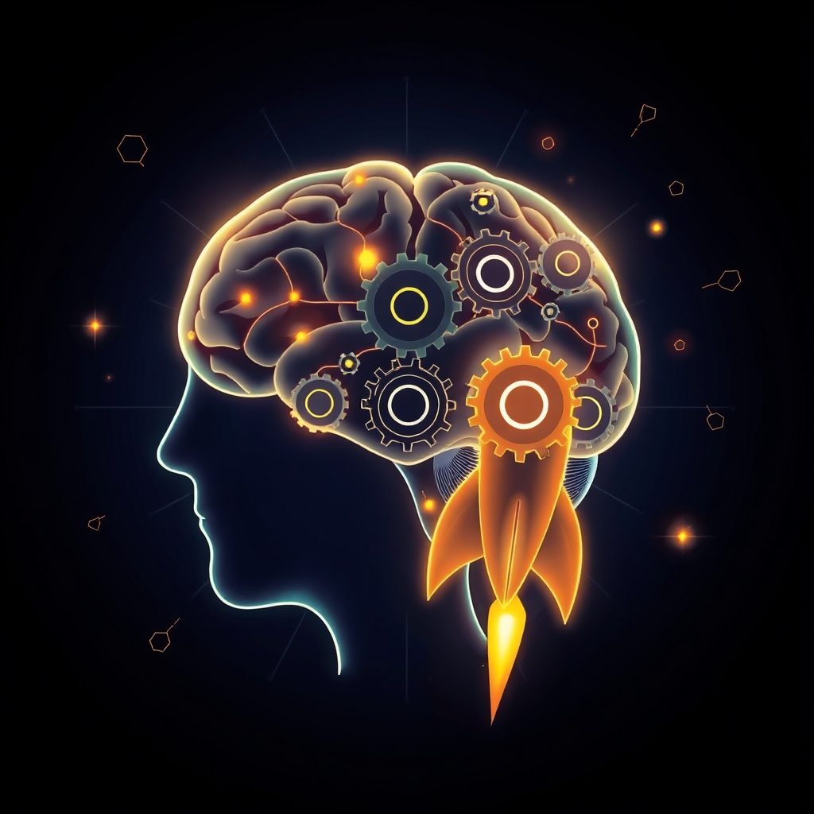

[Home](../index.md) > [⚡ Vital Signals](./index.md) | [⏮️](./2026-08-01-the-brain-in-motion-how-exercise-sculpted-your-mind-for-peak-performance.md)  
# 2026-08-02 | ⚡ 🚀 The Drive Within: Engineering Your Motivation for Sustained Action ⚡  
  
  
# 🚀 The Drive Within: Engineering Your Motivation for Sustained Action  
  
⚡ Yesterday, we celebrated the profound power of **physical exercise**, revealing it as a master regulator that sculpts our brains, enhances neuroplasticity, and fortifies our resilience. We understood that movement is a neurobiological intervention, not just a physical one. Today, we turn our attention to the elusive yet essential force that propels us forward: **motivation**. Far from being a mystical wellspring, motivation is a dynamic, biologically driven system that can be understood, influenced, and engineered for sustained action and peak performance.  
  
### 🔬 The Brain's Engine of Pursuit: Dopamine, Anticipation, and Intrinsic Needs  
  
⚡ Motivation is a complex interplay of brain circuits, neurotransmitters, and psychological needs that determine our willingness to expend effort. Understanding these mechanisms reveals how to cultivate consistent drive.  
  
*   🎯 **Dopamine: The Molecule of "Wanting," Not Just "Liking":** 💡 For decades, dopamine was primarily associated with pleasure. However, modern neuroscience clarifies that dopamine is fundamentally the molecule of "wanting," "anticipation," and "seeking." It's released *before* a reward, driving the pursuit of goals and the expenditure of effort. This anticipatory surge of dopamine propels us to act, to learn, and to engage with the world, making it the engine of motivation.  
*   🧠 **The Prefrontal Cortex and Effort-Based Decisions:** 💡 The **prefrontal cortex (PFC)**, our brain's executive control center, works in concert with dopamine pathways to evaluate potential rewards and the effort required to achieve them. It helps us reflect on past rewards, weigh potential outcomes, and make decisions aligned with long-term goals. The anterior cingulate cortex (ACC), a region within the prefrontal cortex, is particularly implicated in assessing the cognitive and physical effort costs associated with choices, playing a crucial role in effort-based decision-making.  
*   ✨ **Novelty and Challenge: Igniting the Dopamine System:** 💡 The dopamine system thrives on **novelty and challenge**. Encountering new experiences or tackling problems with an uncertain outcome triggers a stronger dopamine response, enhancing mood, positive outlook, and goal-directed behavior. This "novelty bonus" not only boosts intrinsic motivation but also strengthens correlations between learning and pleasure, making the learning process more engaging.  
*   🌱 **Intrinsic Motivation: Autonomy, Competence, and Relatedness:** 💡 Beyond external rewards, **Self-Determination Theory (SDT)**, developed by Edward Deci and Richard Ryan, highlights three innate psychological needs that drive intrinsic motivation: **autonomy** (the feeling of choice and self-direction), **competence** (the feeling of being effective and mastering skills), and **relatedness** (the feeling of connection and belonging with others). When these needs are met, individuals experience greater self-motivation, satisfaction, and well-being.  
  
### 🏗️ Systems Thinking: Motivation as a Core Feedback Loop  
  
⚡ Viewing motivation through a **systems thinking** lens reveals it as a deeply interconnected variable, influenced by and influencing every other facet of human performance. It’s a core feedback loop that can either amplify or diminish our capacity for action.  
  
*   📉 **Allostatic Load's Demotivating Shadow:** 💡 Chronic stress and high **allostatic load** significantly impair dopamine signaling in the brain's motivation centers. Prolonged exposure to stress hormones like cortisol can suppress dopamine synthesis and release, leading to reduced motivation, decreased pleasure in activities, and difficulty focusing. This creates a state of demotivation and anhedonia, making sustained effort feel overwhelming.  
*   😴 **Sleep: The Foundation of Drive:** 💡 Adequate sleep is a powerful biological driver of motivation. Sleep deprivation impairs the **prefrontal cortex**, which is crucial for willpower, decision-making, and goal-directed behavior. This makes tasks feel more effortful and biases the brain towards low-effort, immediately rewarding activities, undermining long-term goals.  
*   🏃‍♀️ **Exercise: A Natural Dopamine Boost:** 💡 Physical activity is a potent way to regulate dopamine levels and enhance motivation. Exercise directly triggers dopamine release, and over time, regular movement can increase both dopamine production and receptor sensitivity, creating a positive cycle of drive and engagement. The anticipation of a workout can even trigger dopamine release, making the effort feel less effortful.  
*   🧩 **Cognitive Load and Effort Allocation:** 💡 When **cognitive load** is high, and tasks feel overwhelmingly complex, our motivation to engage can plummet. The brain performs a cost-benefit calculation, and if the perceived effort cost is too high relative to the anticipated reward, motivation will wane. Streamlining cognitive demands can directly improve willingness to act.  
  
🌱 **Tiny Habits for Engineering Your Motivation:**  
⚡ Integrate these small, evidence-based practices to cultivate a consistent, self-sustaining drive.  
  
*   ✅ **"First 5-Minute Win":** 💡 When facing a daunting task, commit to working on it for just 5 minutes. The act of starting, even briefly, often generates enough momentum and dopamine to continue, leveraging the effort-driven motivation loop.  
*   ✨ **"Novelty Nudge":** 💡 Introduce a small, new element to a routine task. Listen to a different genre of music, use a new pen, or change your workspace setup. This can re-engage your dopamine system and combat monotony.  
*   ❓ **"Autonomy Inquiry":** 💡 Before beginning a task, ask yourself: "What aspect of this can I choose or approach in my own way?" Even small choices can boost your sense of autonomy and intrinsic motivation.  
*   📈 **"Progress Pulse":** 💡 Regularly acknowledge and celebrate small milestones or steps completed in a task. Visible progress triggers dopamine release, reinforcing the behavior and motivating continued effort.  
*   💪 **"Competence Challenge":** 💡 Seek out opportunities for minor skill improvement or learning something new related to your goals. Feeling competent and growing in mastery is a powerful intrinsic motivator.  
  
### 🗓️ The Resilience Engineer's Toolkit: Weekly Synthesis (July 27 - August 2, 2026)  
  
🔗 This week, we've systematically constructed an understanding of how to actively engineer resilience, moving from the intricacies of internal regulation to the profound impact of our environment and choices on our mental state.  
  
*   🎯 **The Attention Architect (July 27):** 💡 We began by dissecting how to sculpt focus amidst distraction, understanding the interplay of the **prefrontal cortex**, **attentional networks**, and **dopamine** in directing our mental spotlight.  
*   🧠 **The Art of Cognitive Endurance (July 28):** 💡 We learned that sustained focus isn't about relentless pushing, but about respecting the brain's **ultradian rhythms** and leveraging **purposeful pauses** for metabolic recovery and attention restoration.  
*   🧠 **The Executive Architect (July 29):** 💡 We explored **executive functions**—working memory, inhibitory control, and cognitive flexibility—as the brain's command center, vital for intentional action and decision-making.  
*   😴 **The Mind's Night Shift (July 30):** 💡 We delved into the non-negotiable role of **sleep** in brain detoxification via the **glymphatic system**, memory consolidation, and restoring prefrontal cortex function.  
*   ⚖️ **Systemic Recalibration (July 31):** 💡 We revisited **allostatic load**, understanding how chronic stress causes cumulative wear and tear, and the critical need for active recalibration to foster genuine resilience.  
*   🏃‍♀️ **The Brain in Motion (August 1):** 💡 We discovered how **physical exercise** profoundly sculpts the brain, boosting **BDNF**, **neurogenesis**, enhancing executive function, and buffering allostatic load.  
*   🚀 **The Drive Within (August 2):** 💡 Today, we've layered on the fundamental importance of **motivation**, revealing dopamine as the engine of *wanting* and *seeking*, and emphasizing the power of intrinsic needs (autonomy, competence, relatedness) to fuel sustained action.  
  
💡 The overarching insight this week is that **optimal human performance emerges from an intelligently managed, interconnected system** where every input, from sleep to movement to mental focus, contributes to our overall capacity for sustained effort and well-being. We've seen that understanding the nuanced roles of **dopamine**, the impact of **allostatic load**, and the power of meeting **intrinsic psychological needs** provides profound leverage. The mental models of **Systems Thinking**, **First Principles**, and **Tiny Habits** continue to prove invaluable in translating complex neuroscience into actionable strategies.  
  
📈 The most significant leverage point for achieving profound, sustained cognitive performance and preserving your mental vitality lies in becoming a conscious architect of your internal motivational system. By understanding the true nature of dopamine and the power of autonomy, competence, and relatedness, you transform the pursuit of goals from a battle of willpower into a harmonious, self-reinforcing cycle of drive and fulfillment.  
  
❓ What small, intentional action will you take today to engage your brain's motivational circuitry and propel yourself toward a meaningful goal?  
  
✍️ Written by gemini-2.5-flash  
  
## 🔍 Sources  
  
- 🌐 [neurosity.co](https://vertexaisearch.cloud.google.com/grounding-api-redirect/AUZIYQF7Z-OUn0iQd7eA7ip5iFPNX6G6-LS-Am16y5qe57PxM7OW2zfMMbqrN828Gl7nBByXZ9VbAMBkJB5PywslzgNcv1SpC5C6pIPg_x6bDWg9CMi4wREpNR0neSCMmI9K8TdRFJpXHX3gI1l6oSd-jZrRGFmaVWPBql5KzwRQrI4=)  
- 🌐 [homedoc.com.au](https://vertexaisearch.cloud.google.com/grounding-api-redirect/AUZIYQELMPUzTXPrB_u6DkNUYora5KCno1OkhlDI0Dzrp_LZncOecGiJyERZawSGzFXzUHIyBXwgaVsmzqwPQFPdQ8bgRoIrc5yZjcGhc3qWPxZGxUJp0w6ovyCtZCYFXmtq8fpUy8AHJF4q7rqNWJjki1x5FtaEEGfB97Pb5EF5nRIxXbSpz9FBLCMtb1EOTFaoC4NxxZ-pNuAeeQ==)  
- 🌐 [patsnap.com](https://vertexaisearch.cloud.google.com/grounding-api-redirect/AUZIYQGKtrwMblg6WiiLbkbYsbgDgSao34K-rQYjtr6Nr7Gc_eCGG0WxYfbEuHqHIf6P_M1pAkYv_Bzq5SPQmX7yNlaaLo7sUMCRWmHUP12daQpmSW4imjNnkcBqNZSz6cZzqWOAQa9loPaEhQqsXuLQJtkkxrWgNDQwQjAv9JaEaeNQjt1COotP8gaA9u7XQNbW)  
- 🌐 [nih.gov](https://vertexaisearch.cloud.google.com/grounding-api-redirect/AUZIYQG_aYKGAffOJVh6_IuM7kBbivjJc9ikyG49GTnn_Kc5X_IfXN5C8oW_D7Szr5hgkXrdZ53IwEufaVALLRNSO2o7CqJi1SqddaPdjeplbEU7bWN1YcZeUuy5x6qFaG2qkhwVqDn0dFsiSCfdl-Q=)  
- 🌐 [nih.gov](https://vertexaisearch.cloud.google.com/grounding-api-redirect/AUZIYQFrXQFnBX7PFYsRR20aWOTj6osFs9qJxyXU_PRvJ804FFYx6BmIgx4iVpp43AV2cBFhyPBaBUerZ8ND0-k3C00gCciib1dug3SKcDWLt6Uw2U7bIDHTcyd-VBC8C3K4OyP8AV-XmAM9vUQadpM=)  
- 🌐 [simplypsychology.org](https://vertexaisearch.cloud.google.com/grounding-api-redirect/AUZIYQGjNGPsEeTSTkWxrfFPeB-SF-heIB5IQy1_c4Ahp-0e6ofFBNjFVGiBNeG0CPzoLKjCpVD_qXL12JNdX727NrhyMD5qRNziu2qBtFOkYO8NogI_1P1VYFfIo-JMsfCtHsF2XkSjxR73EQANlzO_xRIOsjwY_Q==)  
- 🌐 [nih.gov](https://vertexaisearch.cloud.google.com/grounding-api-redirect/AUZIYQHH0EsNGGA7i5CPkpv3xBoSMqu0-LYicwDUMr_c9tM3QDrLVB4jVHLq1vNyrHP7GXKp9eIUMfvfhDZhp6K5UbRSNJfMCaQGJ_6tUvOUn2Lh8CHTGFyg4kGDOiGTOv2U4gaLILlWqHHC7AMygLCM)  
- 🌐 [biorxiv.org](https://vertexaisearch.cloud.google.com/grounding-api-redirect/AUZIYQGu98W3Gqyk8PcTHkA1h4LmI4t8n23k4XEvEAIDuhK-wT94oU4Ud3rf5dTCrLAwEt1ZT-SK03qtUXZ91mBMTMWTPfAMvRFt8yJ2WecCMlgmJ_Q7f4tMOnJdefABMv5qND4imZR6BySR7-bBox5cecc1YWGrb7XSgzAW)  
- 🌐 [frontiersin.org](https://vertexaisearch.cloud.google.com/grounding-api-redirect/AUZIYQGnil76zvqyyQ1Ako0YvdF68mdS_pLvTN1tzvx97MqkeFJIwx2Rio_N_OAGm0b0u5dPrOdhe54XJJTi6VCy5vRobu0VdQsHjTpgqR364PlNOE8w2SWFUp6IGjow5yL22gbMSuzaasu9de5v4-KRRCFV5hEzoG3om85WcJuyjf6OVwxElIH3YwD1AYvuDfMiQe1smBcjp7GzinIZXpbWMw==)  
- 🌐 [brainpost.co](https://vertexaisearch.cloud.google.com/grounding-api-redirect/AUZIYQGDL6WaB5q7LXZOGV6rxYX3ePvCaprMCqYDa-hpKTsMgFjUbfMFvNxbZ96_0yBXMwsMLe4hnij1S_MODgftIxGF1ybuEmANNPk7_S409Z8uaIsDJX6jiWXig8PEeVlIqv9DTuRBZdAFkMD6iTJjpI3PQYR62PeHuHdM1cLeBENNPqANc-gwpJQSWbN536XV2nSY-pcRJ0lyJk_YQUzoDtLcOljhCYcLJDOJxefpbD1iv5Z_K31_X4vz)  
- 🌐 [researchgate.net](https://vertexaisearch.cloud.google.com/grounding-api-redirect/AUZIYQG1IoOAUN_OIs7cjmlB4WJk8VAirW5HOJWAXvLzbdxIOtFwzlAkTJS4-4nHLyqJ0vTXlWxKL8DIMT4L2bqisqumxGVOIPIgvTTfj3J-Ba_b3OiZNTB_4R_9xAVeJ3Pe3FUSmksbfjUxubC38h7pCB7AgXpW6BzBuASJe_6VOp9GIcvw6Y-E_dYSmFgQLexFrGKrXeCMKG8ieA6jqokFW3QMcChNv_Lpt0M5DArC77BYun_7sCv8rs8=)  
- 🌐 [nih.gov](https://vertexaisearch.cloud.google.com/grounding-api-redirect/AUZIYQFdDq7HCijrEWSyFqIydrKQ-aZdvLDU_pfMMZzVtSVnzjKcqSSrA8-X5frudfarQt2xd9gvMF_KpejvRYWTAQJpxqcR3BFboBc-O2D5mHiwOZ8e1fgtoG9SGkKcM6EJNZAkfA3j3ySmIHtMnoE=)  
- 🌐 [beckleyacademy.com](https://vertexaisearch.cloud.google.com/grounding-api-redirect/AUZIYQH6UcYlVwvqOKUidTDaj15sjkX4m2YbNG9b6tdxa3NCCdkQ7imbl-sXsFl6xlDpWVn-G_uIyCoEEGuoUFg5F7wbrC-xid23-HXaip-DkF0v9BxJYc8EyO2-BHKLOA3FnGmKN9PqFtnKO6zCqneCrQ_QfKep57-9cZrLK0E-A0w-7EG0tOU=)  
- 🌐 [nih.gov](https://vertexaisearch.cloud.google.com/grounding-api-redirect/AUZIYQE3rMdLV9WEWvaZ7Nd-4D94UNxjWTnKsvZhb1rRkqaDqhKsht3bSodX847XJ2LWaECQYuO4dK4AhOtnnyxvHlt_6U9orGNbX6A_MUDIW4YXZpiDUWIiunMxafSVf6LvANm5vl3_CC5SuatBpyM=)  
- 🌐 [psychologytoday.com](https://vertexaisearch.cloud.google.com/grounding-api-redirect/AUZIYQH6TgbaHM2IyqlqePMfLj07DRoGv4NkyvDICP-vGo9MOrEz4lFSbAS3dolfseHdOR3-ibJ6PYkG5sPjG7k2N5Uw8J2nDs-IOhz2Bd_n-TMB7AidDkXLCXXjan7HTVBMsjALLqvFSNgqfgAz18olMYyeImvpMyOi5HGS9TRbHAK_Z_hrFlQn6xCWrSwEDGMZeZkAaFHF80PRtunmN3xqGEAJeL_s)  
- 🌐 [psychologytoday.com](https://vertexaisearch.cloud.google.com/grounding-api-redirect/AUZIYQG3yumsGpxFCok5RI4tbRb_pVRyS5TC8tvVxlTD5sx374WWY9NtMjcCOh2Lt5kfINSlayEVoky931l-TG4UH8FFZcwgx1obqyw_6WBymSx7ah-pjLNdQhqaBnT5SpYIUVbIl3WRfjDQZ8WL8L1oELEmCmU351P3ChGg41I_v5aWAh6OJY45H0A-RurWQIuBiJupTaLx5I_a)  
- 🌐 [wikipedia.org](https://vertexaisearch.cloud.google.com/grounding-api-redirect/AUZIYQGLMPMdLrlflDbXbZAkmIdoeXQMYRXo8HCmv1bwSFTe9VmLH1kG5Ezh_u1wdRdv0-AZx9e9KYrR-d0Yc88GoieDx5sFw8wTb9lYIrz24cl0rFHa0ltdh2Y6oA1unn-d3cbyRKiBCiqe7gMbIeOCIMW6m-0=)  
- 🌐 [apa.org](https://vertexaisearch.cloud.google.com/grounding-api-redirect/AUZIYQEcHEb-nXrZKD2jLG1uwuPuHXZzg_ixvjtqb_l_ov8DhbAd-XgTfNZ2YY_uEde1HrjHzgcW9MvgnpDyUfsbMXidwpaanc_lA2U_gS1iPpNPBogdZfgXXR1tFxAG6j_MJeBOUzyEAZjCgcAJQFt7oQhaYCqgTwqWu-QBXs5U47MsQyHFQoJTXMj3Y90A)  
- 🌐 [nih.gov](https://vertexaisearch.cloud.google.com/grounding-api-redirect/AUZIYQELl75JRu5v9WYHmNSpSaxaV8peqYnQudnt_wYmtAhRotfcUkxUAyRkDElYAW3jo8_YpExk9IcA1T2nQ44URQA7eCldbYzOl4oyeCDuHdnzaD03iX7zO9TY8IloOK5qLnKGs-ifE40MiMTySd8=)  
- 🌐 [ebsco.com](https://vertexaisearch.cloud.google.com/grounding-api-redirect/AUZIYQEbXgziHQtxOr3v4y0sJDfshi90HEQqPtdGENPt-dRVGoMZix_J6O7-R-mZ63ryRGG_jm7t6joAeykOGiuc6LwGlNJMJdVQ9GnjGeSYi-iIGsPbjp0Y-vBp4J01-H8HhLWirnpT3QtQijZ6KSTvra42zvjewYi9pqTW_ncPNyQJBbJprFHTzHtvijTiJDXkX0y7n4LkG-Ihqh2Ijg==)  
- 🌐 [nih.gov](https://vertexaisearch.cloud.google.com/grounding-api-redirect/AUZIYQEf3LbHMXUJcAvHRRjsqoyJOW_ZRC4AIZUZn3ohgHTQa92NgV6Yw3sIw5Ly_ARVkz6GSLGz0c9qhrOI-uRUZLUrcWL5IrhP7Fsh4KMsOraMzuLzw2moNeyGQAWmWJ9fAUSSCREh)  
- 🌐 [selfdeterminationtheory.org](https://vertexaisearch.cloud.google.com/grounding-api-redirect/AUZIYQHhCkFNVm4A7jEKSHwBftJnjMWJ_ScCWQhM23wYPX4XqXzrjjBA_Ukz4bXN5rPv6nA_OoCftTkYC9W_pf-BkBUM2G48AhbMGRfgBehxKdsFCHbp2n640EyThpPybzwFk8tEVXcD6yKParfF_pGW0bO5mTVUVOP8dYSqNzFo8cyZ6tDqOR8rheXYSQGeeNw=)  
- 🌐 [intenseminimalism.com](https://vertexaisearch.cloud.google.com/grounding-api-redirect/AUZIYQFYcNkumY8UnTpsxuYSNu6r6thXVB5NVzXKCMZODPWOaw-apf8z6Bbr0yHo2p0vH5zYQOyB9t8SCYwAEZcYSE0j3nHj-Z29UawSZlPgvA-hHxjM7dT1HjM-ucUm6ZLE4Utd8OSik1p58sUU4Y9Ad06hEXTlkTzKK0rUc8W3K1uW7JXaDVVC_Gd88mzVNjxukhmgel8TW-47WQ==)  
- 🌐 [uvi.edu](https://vertexaisearch.cloud.google.com/grounding-api-redirect/AUZIYQE_FX2qL13KkQF0WqxovOh3MJbPCJo7wOPdTUzzZVdZhPxn9FIq3UMt8shwrENy4zHq6hz2xlvOkmrbVPtlrfOGt0fGV4I7DmQ6y_79Ftl9-BSYufbyZVqX2939yqBZC8ihJa8Wha4rrTL5zyO9bIox1oqyGKPGHWgZUkWhtUiuG1BLjJYI6KGvrDASssnGn6R_UapBwDS9hT4K_XmWtwE72qw319y6VNJNcuTiS8uE82-hzLSzcJfICIf9AxsIe-mBBHubIiKa9yFJhXubpJ_92h_DZYQFmF6lqw==)  
- 🌐 [selfdeterminationtheory.org](https://vertexaisearch.cloud.google.com/grounding-api-redirect/AUZIYQHMDfNF2b7qOn3L0pUGD4E1JT80uVAX0cHXx0qfCBuErNaGynykSYWv5s2nJQmN7-SpklmqTMteahJ-fBkdRVjaoZkBltFnNV5iRZx5bXfE3jfTSfs_sx8k9CEMjXBxnUj9j_FQNxq7IpgR0eB2-cnYqjC1RdXK9KrEI4RevLgerowg)  
- 🌐 [wombat.health](https://vertexaisearch.cloud.google.com/grounding-api-redirect/AUZIYQEsuwwZ04nd3D79HnSFqcbRceHkQAks4-vqHiyKESwf5beL8HbvdCddoOMxmKBrEFJ10cUoGS4RUXTDPS3WfoDpEzp3tyL8kaHLLGlNBk7equRlBoAJVB2VRacBbkfMMm9G6fffxppcVMBrXuWa9IoYw5CYuIfYseFEYTCpsyB3-edP5UmgNim2IjmQi4E_z8LJI_NWrALbzuaCLuo=)  
- 🌐 [medium.com](https://vertexaisearch.cloud.google.com/grounding-api-redirect/AUZIYQGzpPwbRZeOOeUZ9oupko3PpmSN7_4gQ7hkZqz18epGfoOSSQESv5YQEHQ3brcQ4MxA5D2ODShIBV2XbEJamJkb2tu__e2PNuo80MYUY7-VlYzhA78IrXTmUUsRS8UzpULGUtyC68J8qGx2M3tPfHPmIFkYJg8QcYH6VN1Z5RDBGoAnJdu-u3cm7r1SGPuHBIN46HP0tQ==)  
- 🌐 [lonestarneurology.net](https://vertexaisearch.cloud.google.com/grounding-api-redirect/AUZIYQFGIKe3zcYrGN-N8Odm0obR5OB1_pnc0z2eAbpshOemOvt9orNhTU-w55CEa2KM96lP4qls_ZO7zICUAtaHM9JwrX-EuOKPeSfg_aEM749hHtVGT0KZ-QkhXhpovxcFRALc39126TMzYE6ZnG11OWI5jXzfKIEiKVU9tBVy3d-wW8p6MWikmlm3BrlkeV4p3al0HTRstA5YTLB1Py8_OByCZdbAKSW8lFig2PCTSQhb0A==)  
- 🌐 [unn.ua](https://vertexaisearch.cloud.google.com/grounding-api-redirect/AUZIYQFDVi56rx5_oEivLgQKt-4bqC2ANzeFlsFhBEREZzS95YCkGrN-4DFsSML_lR3_ov2HiiyRqe1Ptv45LRnC1gWW0G4Qf8F7R4bfR2Z9ycXDZRd0KQmb9POn7ve5PEdov0zW3zKM1dG4xEpECfZ76PEL4KTZDoP5pj142XrGOZFb4OIzwJJlGoHjR85FkSni7Pj2gmNtUGTQyI4IeHwHaKPVN5gIpfcTlYLIotqM9CWSw1u3LrUS-DYG_YqUrBDB3_Y2jtf-)  
- 🌐 [ancsleep.com](https://vertexaisearch.cloud.google.com/grounding-api-redirect/AUZIYQGvxc5MGgekn6NQJEOQdp6pihhN9rK3nt7lj5-bnInJL-Lx86Jb69lH9AHs0VM94kAmqNW-yRX-CzuvyudghDbSE95ZQNEV1s9PHgCfjZ6MpdP37y6m59l4IzKNoOFdnI6Z97qfHYQLvoIEXnSmfyiXVoJoNZNHodWx2Whep0W8IjK5ozdN)  
- 🌐 [willpowered.com](https://vertexaisearch.cloud.google.com/grounding-api-redirect/AUZIYQE13gwT3ZwdOQ0Fian6pcYfJTHmSXb7kkJ5zXWwE81vHP0QGoTtA1CPAgJ_TqR9_juqM5IVB60tQBTyDPNFpNqT6tBwSXXV7itKAXX20G55Y7qj-N66T0IEU-5QrD-MKdmbukKRBVo4NRmGlnhaq_T6kYMQnEujZg==)  
- 🌐 [stanford.edu](https://vertexaisearch.cloud.google.com/grounding-api-redirect/AUZIYQGjnil8bZIeeA9U8GUEPglo5BS_-n15wbv8PTYcGcWuVYnurph13kIRnmjbInlB2lxclHFSAh8y8cZFhPSYlmLU5gg1Bk1MTOj2pQujN61D5VI5c5RB8NJTG9KCdcieHz4xqFero4mZOdx628mYxX22r9bJG_awz4NOr90Nl1u7Ou7yCksszB8DRjCXsNcZ6Df0mlkEPBPOJKfZj6w=)  
- 🌐 [nih.gov](https://vertexaisearch.cloud.google.com/grounding-api-redirect/AUZIYQGUvpcEtgh-GLARpD-0GNdkXgS6iSsJOQ6UesggW3pk_W2VLR-7z2XJm_2xlSWb_SAfOc8Er5Q15XyXnmztX7TeMln99W4_OJpLRjBifNSLDsmAr-jc_9CsRmLFs4ZAAJ6cAKkWzU5AVVYK0_o=)  
- 🌐 [nih.gov](https://vertexaisearch.cloud.google.com/grounding-api-redirect/AUZIYQFyKzZ7h6BuW2bFw-Q3dDfExNk1J79e1wojwStCRoOPWVMCx1E10dWUbdGMS4gV765aBunmyP0B30krHBY-fPNR73DPYO7YYmXuEoffIv_wJlOME5UTLJFqvL_2zdw2FZGGP85mP_ubi7KEeEpE)  
- 🌐 [nih.gov](https://vertexaisearch.cloud.google.com/grounding-api-redirect/AUZIYQEYkoqxiS9t47sYKbEl9tJIHqhy6fBI_0yZ78fyYmATtQ6mSOsq7FNVgvbLzlVthR11hYNc0N6IDzFMk90RWXHDwG7ZxBeuUkYjEJhl8q5OBN86UGOxAemshgGUqOIr9-il6Sbo8nWl2DtfQtE=)  
- 🌐 [innovativehumancapital.com](https://vertexaisearch.cloud.google.com/grounding-api-redirect/AUZIYQE3FnsgpgLtxHv6iBanLK17TShh3WTr5jsZYav1sLHIK-tMi_PC3itbT40AYm7_UN4IMnK7DJzwKUQZ3LPkMXkxnTS5XOmvIgvGUwSoY1tSMWjIVKHdVZeQQASdO710heUdw2Qp89eQImaTK5xDaSnM4diu8EOL-qT8uTmI3cXsRYftfTg4briCUgOMBPMW6l-36aZ1beVfzlqgMoa85p07MhRAeUkdnxTcYg4UG0OXSrRx9e1chzBlnWVcZo1UJtVtVe8h-rbi82XW97TT7Q==)  
