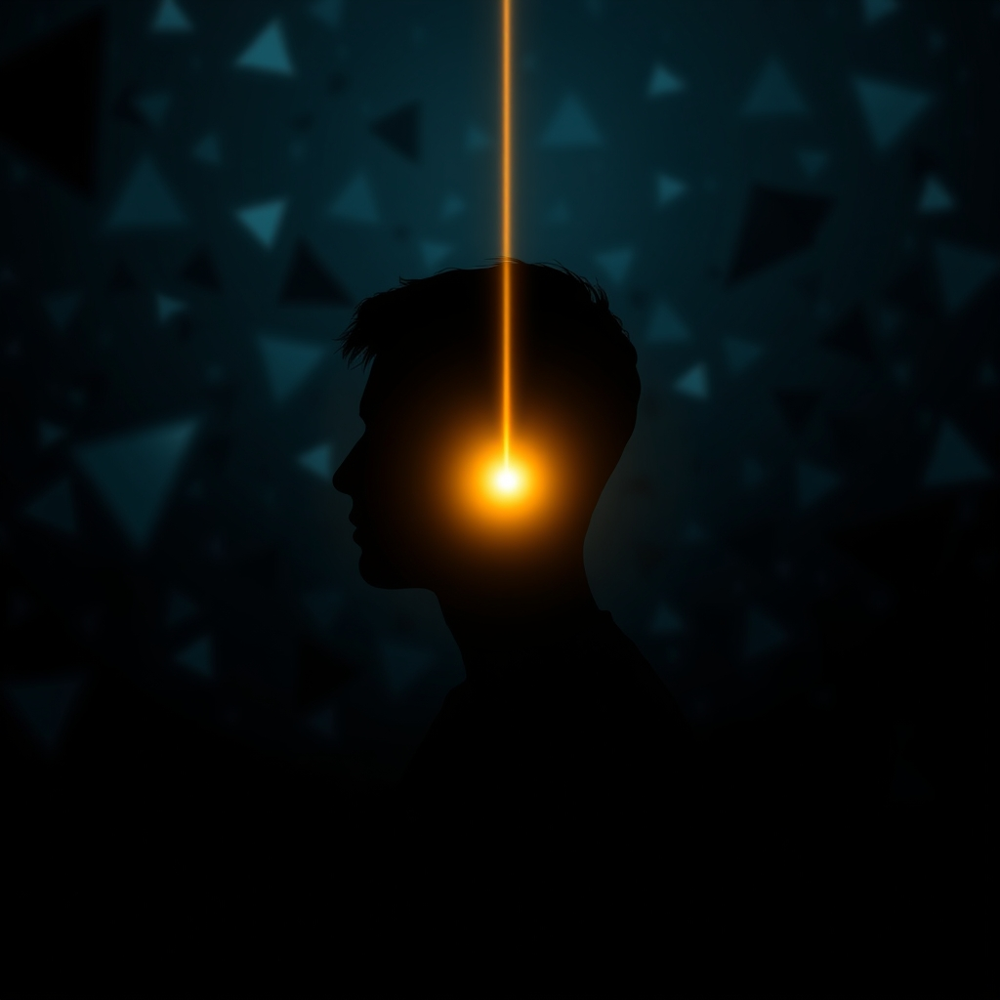

[Home](../index.md) > [⚡ Vital Signals](./index.md) | [⏮️](./2026-08-02-the-drive-within-engineering-your-motivation-for-sustained-action.md)  
# 2026-08-03 | ⚡ 🎯 The Focused Mind: Architecting Undivided Attention in a Distracted World ⚡  
  
  
⚡ Yesterday, we explored the dynamic forces of **motivation**, understanding dopamine as the brain's engine of "wanting" and the profound impact of intrinsic needs. We learned that sustained drive is less about brute willpower and more about intelligent design. Today, we turn our attention to the critical skill that allows us to direct that drive: **focus**. In an era saturated with digital noise and constant demands, the ability to sculpt and sustain our attention is no longer a given; it is a vital signal that underpins all high-level performance and thoughtful living.  
  
## 🎯 The Focused Mind: Architecting Undivided Attention in a Distracted World  
  
⚡ Our capacity to direct and sustain attention is a sophisticated feat of neurobiology, involving intricate brain networks and a delicate balance of chemical messengers. Understanding these mechanisms reveals how to cultivate unwavering focus amidst the modern world's relentless distractions.  
  
### 🔬 The Brain's Attentional Orchestration: Networks, Filters, and Neuromodulators  
  
⚡ Your ability to pay attention is not a single switch, but a complex, dynamic system that can be intentionally trained and optimized.  
  
*   🧠 **The Prefrontal Cortex: Command Center for Top-Down Attention:** 💡 The **prefrontal cortex (PFC)**, located at the front of your brain, functions as the primary executive control center, playing a pivotal role in directed attention, decision-making, and self-control. It helps you stay focused on a task by filtering out irrelevant information and managing impulses. This region is highly metabolically active, consuming significant energy to maintain its high-level cognitive functions.  
*   🎯 **Dopamine: The Signal Amplifier for Sustained Focus:** 💡 While often associated with pleasure, **dopamine** is fundamentally crucial for motivation, learning, and critically, **attention**. It acts as a key neurotransmitter that enhances the signal-to-noise ratio within brain networks, reducing background distractions and improving focused attention. Research indicates that dopamine strengthens sustained attention by reinforcing the neural loops involved in focus. Maintaining a healthy dopamine baseline is essential for the consistent ability to concentrate on everyday tasks.  
*   🔄 **Attentional Networks: Orchestrating Internal and External Cues:** 💡 Your brain employs at least two distinct attentional networks that work in concert. The **dorsal attention network (DAN)**, a frontoparietal system, mediates goal-directed, "top-down" control, allowing you to voluntarily allocate attention to specific tasks or locations. In contrast, the **ventral attention network (VAN)** acts as a "circuit-breaker," responding to salient or unexpected "bottom-up" stimuli and triggering shifts of attention. The flexible interaction between these two systems enables dynamic control of attention in response to both internal goals and external sensory input.  
*   🌌 **The Default Mode Network (DMN): The Inner Wanderer's Pause Button:** 💡 The **Default Mode Network (DMN)** is a collection of brain regions that become highly active when your mind is at rest, engaged in introspection, mind-wandering, or daydreaming. While important for creativity and self-reflection, unchecked DMN activity can compete with and disrupt focused attention. Studies have shown that focused attention meditation can attenuate DMN activity and enhance the anticorrelation between the DMN and dorsal attention network, leading to improved sustained attention.  
  
### 🏗️ Systems Thinking: Attention as a Finite, Restorable Resource  
  
⚡ Viewing attention through a **systems thinking** lens reveals it as a finite, metabolically costly resource that can be depleted, but also actively restored and strengthened through intentional practices.  
  
*   🔋 **Cognitive Load and Energy Allocation:** 💡 Our **working memory**, a critical component of executive function, has a limited capacity, generally able to process only a few pieces of information at once. **Cognitive Load Theory (CLT)** highlights that when we attempt to process too much information simultaneously, especially due to extraneous distractions, it overloads our working memory, hindering attention and learning. Effectively managing cognitive load is crucial for preserving your mental energy budget.  
*   🌳 **Attention Restoration Theory (ART): Nature's Cognitive Reset:** 💡 Prolonged periods of effortful, **directed attention** lead to mental fatigue. **Attention Restoration Theory (ART)**, developed by psychologists Rachel and Stephen Kaplan, proposes that exposure to natural environments can effectively restore this depleted capacity. Nature provides "soft fascination"—stimuli that effortlessly capture our attention without demanding conscious effort (like rustling leaves or clouds drifting), allowing the fatigued prefrontal cortex to recover. Research indicates that even brief time in nature can improve focus, reduce mental fatigue, and enhance working memory by around 20%.  
*   📉 **The Compounding Cost of Constant Distraction:** 💡 In our hyper-digital world, constant task-switching and digital interruptions are pervasive. Research from the University of California, Irvine, showed that after just one interruption, it takes an average of 23 minutes to regain full focus. This recovery lag significantly accumulates throughout the workday, leading to measurable losses in productivity. Furthermore, studies from Boston University have found that negative or upsetting distractions are particularly disruptive to sustained attention and are remembered more vividly, further impairing performance.  
  
🌱 **Tiny Habits for Sculpting Your Focus:**  
⚡ Integrate these small, evidence-based practices to strengthen your attentional muscles and reduce the impact of distractions.  
  
*   🚫 **"Single-Task Sprint":** 💡 For your next task, commit to 10-15 minutes of uninterrupted, single-task focus. Close all unnecessary tabs, mute notifications, and put your phone out of sight. This builds your capacity for sustained attention.  
*   🌳 **"Nature's Micro-Dose":** 💡 Take a 5-minute break to consciously look out a window at trees or sky, or step outside and observe natural elements. This engages "soft fascination" and helps restore directed attention, leveraging Attention Restoration Theory.  
*   ⏰ **"Pre-Focus Intention":** 💡 Before starting a focused work block, explicitly decide what your main task is and what distractions you will ignore. A brief mental declaration helps reinforce top-down attentional control.  
*   👂 **"Auditory Anchor Drill":** 💡 If you find your mind wandering during a task, gently bring your attention back by noticing the subtle, non-distracting sounds in your environment (e.g., distant traffic, hum of a fan). Use this as a quiet anchor to re-center your focus.  
*   ❓ **"Task Relevance Check-in":** 💡 When facing a challenging or unengaging task, pause and quickly recall the underlying purpose or value of completing it. Connecting the task to a larger goal can boost dopamine release and reinforce top-down motivation for sustained effort.  
  
## 💡 The Architecture of Undivided Presence  
  
🔗 This week, we've systematically constructed an understanding of how to actively engineer resilience, moving from the foundational role of **physical exercise** in sculpting the brain to the intricate dance of **motivation** driven by dopamine and intrinsic needs. Today, we've layered on the fundamental importance of **focus and sustained attention**, revealing it as the critical filtering mechanism that determines what information reaches our conscious awareness and how effectively we engage with the world. We've seen that our ability to direct our mental spotlight is a complex interplay of the prefrontal cortex, attentional networks, and neurotransmitters like dopamine.  
  
📈 The most significant leverage point for achieving profound, sustained cognitive performance and preserving your mental vitality lies in becoming a skillful architect of your attention. By understanding how your brain's attentional systems function, how dopamine amplifies focus, and how both internal distractions (like the DMN) and external interruptions (like digital noise) deplete your finite attentional resources, you gain the power to intentionally cultivate a more focused, efficient, and resilient mind. This approach transforms the daily struggle against distraction into a deliberate, science-backed practice, allowing you to build the capacity for deep work and genuine presence in a world designed to scatter your attention.  
  
❓ What intentional step will you take today to consciously direct your attention and build your capacity for unwavering focus, moving from mere presence to undivided presence?  
  
✍️ Written by gemini-2.5-flash  
  
## 🔍 Sources  
  
- 🌐 [neurosity.co](https://vertexaisearch.cloud.google.com/grounding-api-redirect/AUZIYQGNifWUFzxltK2fsX7zEMXkMY55_JoV-TAPy5SFRfSTe781cIEl-nXg6B6D5C6yIEnsQpU0KjCVTscMGvbcrD-f99TJNnL3CbHlReW0azbuHdTHJImNGE1osceSPm_TzXEF5Z-lHSAtGx6GkQa7oK1h8G4GhuTWstqoUg==)  
- 🌐 [mit.edu](https://vertexaisearch.cloud.google.com/grounding-api-redirect/AUZIYQEL9-m6q8fH59X3ythQjdBntROOhK1Ga4g90aFIKxkOQkohJshww9-Xc8KQDjeSA4NGDzF3YbHggwLpv-iKM2GIx5VoihnC4z0zRe1-mTSDpaBbw9HCl_rJrYhnJ5HAsNZOqYqm9bXpw4qMaL--MQjTNDXxIaKqCtqoKg==)  
- 🌐 [mindomax.com](https://vertexaisearch.cloud.google.com/grounding-api-redirect/AUZIYQGGWKdsW4vwSSIeB4Sj9e6OEDyploAlqaV_fffW2jp_3A4bGrwtZGhxQLDlLG13d3DaNjDooBzSaOKRl9VRcnM8wEL03nsOxFsX1AzOp2dnJnziQpibuWbve_HJtLlKFfCmZbuOt5Mafu-RZLy4DL49IxUlUO83dzYjN31LBmfMC5bcQFE8-lPwVH5tLZ1lHtXKlajbyQV8SFghNH4H5HpObvhR9w==)  
- 🌐 [learningsuccess.ai](https://vertexaisearch.cloud.google.com/grounding-api-redirect/AUZIYQFvIbwXa15b3fHw3jhcTAZxJMnGP8UJFHpz5d26fTgAnX_nX5ShRhRv5NE8TLRyOLNlpE0VYfm0aX76e6ApSVOqK3zenjgvPn-9WTV_Zrq_l64l76g12gj5L0taWjWYyUFHIn6aY5wktg==)  
- 🌐 [hubermanlab.com](https://vertexaisearch.cloud.google.com/grounding-api-redirect/AUZIYQF9ybfyD3l6NkrJGS1wb0ch549vrLTtWnhaHkzb6kFW24fd3ld5m4omU825k6PpT35fiR9nclJUQNsi_g9WZUzo18xHHTWzIjPd6KkR8jm1rqbrsf0ne8lHHUwB-k0hu98=)  
- 🌐 [cognifit.com](https://vertexaisearch.cloud.google.com/grounding-api-redirect/AUZIYQEN5HknXO_7nJtxHCkHMaHp7FYAn5x1PQichqzlJyA-0F3aHgF_tvPpYLm7odeZYBLa4cI8BYJoMprm5xFrVfrqLEDHDwBiuyXYL05-pqXrdj38TYJy1ycsHIy1tAaZaB832WKUYZGfU0__l5H0qT76GDOzr6fcYeWmoWzYoC1V6wGlwe_BlVNN6avL2Ir0KOT55vlUxVkV3Ru5m_YxvPtThw==)  
- 🌐 [nih.gov](https://vertexaisearch.cloud.google.com/grounding-api-redirect/AUZIYQEm4MZ2C-dlgqSNlKahkWAASYCuamTG5kPxKH97paFyLVUICXOGMQhxNWlK6QYy7v8jQmjyjA_eq8pMF3dcahyAg92ORSHOTl-0gDcYw4oB1WwMArvqBmaSthloNGiUonpXdHMb8Llv7iHw7Zo=)  
- 🌐 [wikipedia.org](https://vertexaisearch.cloud.google.com/grounding-api-redirect/AUZIYQHmnw2YkpgXUs3y2qIQ6AF4vISocUfQRSrr8mepYUZ9drwNg2feGE58FpeeNjKzCOB32nw_k1MugevZ5KC_xTwEOWM70ttJX2oKID2HLubRIbTgKfwqVj1-07He-Lp6PJyl3PULNl1QAxSP3OKhul6ZeA==)  
- 🌐 [nih.gov](https://vertexaisearch.cloud.google.com/grounding-api-redirect/AUZIYQFpdZFBA8hOCkdrxWo32LjztjbMKqXE8tJQsjRdwbjp71mXvuuPSAmDvVDgeqVgOE6xqlVI4cCCcc9975TOU2SUr9nZmUeHjPYC1B5MPKN-nWYoB_WAu8ykT_vDqVKdWfOMcLYJH_WfwYmyU0A=)  
- 🌐 [o8t.com](https://vertexaisearch.cloud.google.com/grounding-api-redirect/AUZIYQGUusFw5wgByVIqOPlyTCpc9AGEQF3T8th48f2k80Lv8t148N978DUfCcLdh61KPIAtsRppLH1T516L9Wa-Yvztn0C8AhyHoaNfSDmyGgs1ONINVM2-K-1M4iOETDodtRMHYCAc4NPUQiztABjP)  
- 🌐 [psychologytoday.com](https://vertexaisearch.cloud.google.com/grounding-api-redirect/AUZIYQE0QYy2K6IFAsBrFObiFuSMmGbyZMh0vqQcaBv-gAeU7VzSl8Ca9DrL-rUjp0bySU4FHbSF68ve9PZKbjtbpZ2NkLNEBQza1Zi3T9vKyhegsEW-_QnQEtPX3fumG-ihoVk18ytune2NxlOhpjL11EzmoDB6NVZH_R1R)  
- 🌐 [biorxiv.org](https://vertexaisearch.cloud.google.com/grounding-api-redirect/AUZIYQGrbJj3DRjLdxj0nY8Gy-47YP2VN6687OJw-3PSWDK8Q7KcNQt50qc9lNQr4jMypGY9CG5IhHi-eSyuMWj36xKZ1h9KhLhEu3tnBOFVAgW_Sa9QEoOGmDeZi3Bo8Q_TxIQp2Hrxnu3IUPI_Wcq4xklAoWAkAONxxh_MD_55Zdb1Og==)  
- 🌐 [nih.gov](https://vertexaisearch.cloud.google.com/grounding-api-redirect/AUZIYQE2clwq6hFZ94vzr5M4fYPI9kFnY4GUy7uK0q_BBAQT5o7dvmWhDTGti4fCvweeNLu83zSa-xMkLDMJKMhU8Y7gbx2rpJZeOmNgx5zrt8T97GLon2ecrbIObin55dGPOBZXstfy)  
- 🌐 [education-ni.gov.uk](https://vertexaisearch.cloud.google.com/grounding-api-redirect/AUZIYQFM1HnzxBRF1snlMLYgfBAC_qq5u9Ke-jJM3yXRS94kFFJ0AhZeTAgjWt6Qxuy4Rkxw4MjzZLUGdyzqWTvOnzvBBG8MtIzvhOMPEfpL2C_-AqWU4OKY-ttszsxmTEjfg7Ywb7ihcxWN3Fr-zu0THDCqNKbv-qWe-bjdaalr9trhOzm45BG5-WgZ4IvnaQ-l3elpczFv)  
- 🌐 [mcw.edu](https://vertexaisearch.cloud.google.com/grounding-api-redirect/AUZIYQExHr9w5o6dRSfgVV7NQJeLUJGG-L7hMIjiS-i1nnrIjLyp_o6tSMjkbKvEYwaKhNt0cz7n-uCswQ9dTjPdrefK61GkVbdBwJvcEw4OeuCq1TOEdJQ5hzwQJGTU_pXNRYpGEpc3Z0U1zLBW52kvlFzoedN_XdWI0Lzt2XjymXdmrTg1KeDPWCJuVD2ZjYXPU9lB8LmlFY41EbazrHxAjUqLMe-5pi_8FTs=)  
- 🌐 [ldatschool.ca](https://vertexaisearch.cloud.google.com/grounding-api-redirect/AUZIYQF8u7KtkAChZCZ9mkZI95llv9CZXg35ChrHzDz9bpQ_X9PcNKViqGHnh7N6NV9K14yio1hhVgA1YX_7dUbop3pGUeypHmuhddPKPxedJl_WuGQUu3ihpmyKtbJH28TBkkp5YYNSyruuO-4iQC_AcxJHoORRtDeJLQ==)  
- 🌐 [thedecisionlab.com](https://vertexaisearch.cloud.google.com/grounding-api-redirect/AUZIYQGaXbWZYOqS20P70cz4lQ41gpZFnA1pCKjKoVcFBN1K4VNLJxexyIKloDdPQFpdrt71G4gtmy4po69iaXi6gXtMKa_n4EIWS5kVUGOciBijxehqL4xbTBpXFNEX-wSRO-TyuuJGPdi-zTrjH15bmxyD0Eybrscx8rpOrnow7fTBBbzzDOwQYw==)  
- 🌐 [chartered.college](https://vertexaisearch.cloud.google.com/grounding-api-redirect/AUZIYQFOHBc0FXBmn3E7bXWTaJy7j3eHgH3ZQHRr-lNOrwnbUINbZMDTdVdc3zgppmM-FwFfqmA3YNnQO8WMICW3hd2D7Do2FFfqqegs-6ea__1rKcYIq5NmAZ5Nck41sPq0X4Go6q-g1uDM41thZhYqfC_KjOWnOBHnSSmgftc5mHEoBgvZ_5Z7sf4nxa5gP7vw4i6Oy6VHIzI3pYOIX7UZNy6OBdtMyw==)  
- 🌐 [unyoked.co](https://vertexaisearch.cloud.google.com/grounding-api-redirect/AUZIYQEChfzTw_j9JFGTP4uXy7Oy4hf3UzA3iAMs4WvsW9KMyPoImMtSTSpPsjWe74uZeWwM2j0vNSi3XqbIldg2htNmx_EF6pRycKo97vjF9xn3yBx_PbMANfCcba1WRrWmfm6SSLjy_JCX7ED869JIvY3cU0Pm)  
- 🌐 [positivepsychology.com](https://vertexaisearch.cloud.google.com/grounding-api-redirect/AUZIYQFG1ttQMyDz3hj0kIjcgTCgtWcTdsF87ZG-RepnuUVh_hUmA9HbHfbZE1Yt7d-nDOsgusNC9ZSFU96yTkNaCLrxKZtKImyDw0lwiYnYlApzGOMp_Np1qPCqD-KuFMSI17ktQCywWrSMo02PA3k2eJLSROywl2CG8A==)  
- 🌐 [rootsbrancheswellness.com](https://vertexaisearch.cloud.google.com/grounding-api-redirect/AUZIYQHy7H-90kFsaVUWkMRCBc4Ig3oa-8nAz831gxgP479n8wBLWrlvUGd7wWCIpD6f5SYzQUnxmN6ZYXT5J4KojJC7s_UN8xqWAFJbLjvb0GCSqGI5oYcvJBaWlr-7Iudb2s5RMJPXbr9PgEWju4QkFcC3dZdnmElawK-3WjhOfvNSIVWDPOQ-aJtQdiogW_ltr2aeqZ5qY5iTuvKZISr-V52psA38Mw2YuWGY9WDBTBICef8VCuf2M2dOXebTO8lVbTefJDY=)  
- 🌐 [iomindfulness.org](https://vertexaisearch.cloud.google.com/grounding-api-redirect/AUZIYQE0PVDEULBRGwaEs2FuXKBjm_mYdbpng4KyK6FBGKxvGWISygG0XQfxwHMhtP9vdYHQYoFEHHfyPeETIj9oH7dRi4Sy-AV-4KEe3L0GipP0ETuTtWIkNt2umm8tYWUQ_Zy2uqUrJyc5q87KC8D_Z2p9G1LK-zLIbTUnvLMqdYur2U2kajJZM9qe0vLQBLzonmmFNFuf49i8wv5ZhnZx)  
- 🌐 [bu.edu](https://vertexaisearch.cloud.google.com/grounding-api-redirect/AUZIYQEqA2F1TSVLbjq-9QVXZy-bQFPrIiChz6HizmTC0HEs8yKET5uac8k4X5X3mT3D1ZXM2ZU-6UIsGgCr-frO__INg1APogNPV01uFaGQl5d_0mR-BS4IaPn458fSbO3sTaWS0-84re9E2z8b3VZa_pPYbY9p_B0Q91yaliYAc_1KX4MOD7etMTsy203AVcqlHKgxrI4k8F_Ff0E0gqpXxD2gkL0Da-M00Qv1vg==)  
- 🌐 [neurosciencenews.com](https://vertexaisearch.cloud.google.com/grounding-api-redirect/AUZIYQE-9KAwn63d5LXX4jT6YuZDGSH4gr9uk69e9TvQvSLKLaVSwqh9X4l5bdZcBL-IAuisz7RPSdPBmM3I9FricIZ7Pxtx_7xR8PL5RfK-4Z3AGD52Ba5hsm9Zfy4mf3KNHxqD7Pzw4-ps6qNI8U1fCvFZFihlz_UmuUmR9cKMRhdvNCdYpTY=)  
