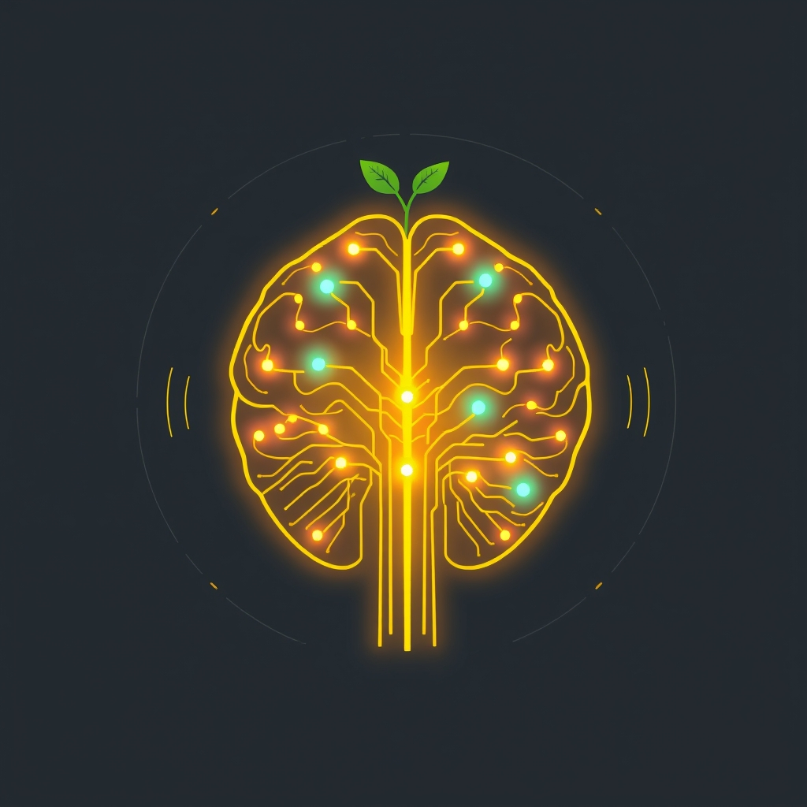

[Home](../index.md) > [⚡ Vital Signals](./index.md) | [⏮️](./2026-08-04-the-art-of-cognitive-endurance.md) [⏭️](./2026-08-06-the-brain-s-master-conductor-mastering-your-executive-functions.md)  
# 2026-08-05 | ⚡ The Cognitive Marathon: Fueling Endurance with Strategic Breaks ⚡  
  
  
# The Cognitive Marathon: Fueling Endurance with Strategic Breaks  
  
⚡ Yesterday, we explored the fascinating world of **executive functions**, understanding them as the brain's command center, crucial for planning, impulse control, and cognitive flexibility. We learned that these high-level skills are not fixed but can be actively strengthened. Today, we delve into the vital, often overlooked, counterpart to sustained focus: **cognitive endurance**. Our brains are not built for non-stop output; they are biological systems that require intelligent recovery to maintain peak performance and prevent burnout. This requires understanding the metabolic cost of cognitive effort and the profound power of strategic breaks.  
  
### 🔬 The Brain's Marathon: From Metabolic Cost to Micro-Recovery  
  
⚡ Sustaining focus is a metabolically demanding task, primarily taxing your prefrontal cortex. Understanding how this brain region tires, and how to effectively recover it, is key to intellectual stamina.  
  
*   🧠 **The Prefrontal Cortex's Energy Drain:** 💡 The **prefrontal cortex (PFC)**, our executive control center, is a highly energy-intensive brain region, consuming significant glucose and oxygen to maintain directed attention and decision-making. Research published in *Nature Communications* demonstrates that complex cognitive processes demand a higher metabolic cost in specific cortical regions, particularly frontoparietal networks that support salience and control. Prolonged, intense cognitive effort can deplete these resources, leading to mental fatigue, which is distinct from physical fatigue.  
*   📉 **Mental Fatigue: More Than Just Feeling Tired:** 💡 Mental fatigue is a transient psychophysiological state characterized by impaired cognition and behavior, leading to difficulties concentrating, scattered thoughts, irritability, and a loss of motivation. According to research from the University of Illinois, it can be linked to a depletion of critical neurotransmitters like dopamine in brain regions important for working memory and motivation, such as the striatum and prefrontal cortex. Studies also indicate that mental fatigue can induce "local sleep" in parts of the frontal cortex, leading to diminished self-control.  
*   🌊 **Ultradian Rhythms: The Brain's Natural Pulse:** 💡 Your brain isn't built for 8 continuous hours of peak performance. It operates on natural **ultradian rhythms**, cycles of approximately 90 to 120 minutes, alternating between heightened alertness and a natural dip in focus, sometimes lasting 15 to 20 minutes. Sleep researcher Nathaniel Kleitman first identified this "basic rest-activity cycle" (BRAC) in the 1960s, observing that the same 90-minute rhythm governing sleep stages also pulses through our waking hours. Ignoring these natural "troughs" can significantly degrade cognitive performance.  
*   🌳 **Attention Restoration Theory (ART): Nature's Reset Button:** 💡 Periods of focused, directed attention can lead to **directed attention fatigue**. **Attention Restoration Theory (ART)**, developed by psychologists Rachel and Stephen Kaplan, proposes that exposure to natural environments can help restore this depleted capacity. Nature provides "soft fascination"—stimuli that effortlessly capture our attention (like rustling leaves or birdsong) without demanding conscious effort, allowing our voluntary attention to rest and recover. A 2023 study in the *Journal of Environmental Psychology* confirmed that even brief exposure to nature, such as looking at images of greenery, can improve attention performance.  
*   ⚡ **Micro-Breaks: Short Pauses, Big Impact:** 💡 Research consistently highlights the benefits of short, intentional breaks, often called **micro-breaks**, lasting from 30 seconds to 5 minutes. A 2022 meta-analysis published in *PLOS ONE* found that micro-breaks significantly boost vigor and reduce fatigue. These small pauses allow the mind and body to recover, supporting focus, reducing stress, and enhancing creativity and problem-solving. Studies from the University of Illinois have also shown that brief mental breaks can prevent the brain from becoming desensitized to prolonged tasks, helping to maintain attention and performance.  
  
### 🏗️ Systems Thinking: Fueling the Cognitive Engine with Strategic Downtime  
  
⚡ Integrating purposeful breaks and respecting your brain's natural rhythms is not a luxury; it's a critical leverage point that optimizes your entire human performance system, transforming mental endurance from a struggle into a sustainable practice.  
  
*   🔋 **Replenishing Your Energy Budget:** 💡 Regular breaks, especially active ones, help to lower cortisol levels and allow for the stabilization of the hypothalamic-pituitary-adrenal (HPA) axis, reducing the burden of stress and preventing fatigue. This preserves your **cellular energy** and overall **energy budget**, preventing the rapid depletion that leads to burnout.  
*   📈 **Enhancing Executive Function Recovery:** 💡 The prefrontal cortex, responsible for focus, decision-making, and emotional regulation, benefits significantly from short pauses. Breaks restore its activity, improving your ability to prioritize tasks, make sound decisions, and manage complex responsibilities, directly combating the effects of **cognitive overload**.  
*   ⚖️ **Buffering Allostatic Load and Stress Resilience:** 💡 Continuous work without adequate breaks contributes to chronic low-grade stress and increases **allostatic load**—the cumulative wear and tear on your body. Strategic breaks help interrupt this stress cycle, reducing cortisol and promoting relaxation, thereby building greater emotional and physiological resilience.  
*   🌱 **Fostering Neuroplasticity and Creative Insight:** 💡 Rest periods enable the brain to engage in **neuroplasticity**, the process of forming and strengthening neural connections, particularly in areas like the hippocampus important for memory and learning. Breaks also allow for constructive mind-wandering, stimulating the **Default Mode Network (DMN)** in a way that fosters creativity and problem-solving insights, as the brain makes new connections that intense focus might miss.  
*   🔄 **Optimizing Ultradian Rhythm Alignment:** 💡 By intentionally scheduling work in 90-minute blocks followed by 15-20 minute breaks, you align your efforts with your brain's natural **ultradian rhythms**. This prevents pushing through inevitable troughs, maximizing your **deep work** capacity and ensuring more consistent, high-quality output throughout the day.  
  
🌱 **Tiny Habits for Sustainable Cognitive Endurance:**  
⚡ Integrate these small, evidence-based practices to build your mental stamina and enhance recovery.  
  
*   ⏰ **"The Ultradian Cycle Micro-Break":** 💡 After 60-90 minutes of focused work, take a mandatory 15-20 minute break. Step away from your screen and engage in a non-work-related activity.  
*   🚶‍♀️ **"Movement Micro-Boost":** 💡 Every 30 minutes, stand up and move for 2-5 minutes. A short walk, stretch, or light activity increases cerebral blood flow, reducing fatigue and improving sustained attention.  
*   🌿 **"Nature's Glimpse Reset":** 💡 If possible, step outside for a few minutes and observe natural elements. If not, look out a window at trees or sky, or even at a plant on your desk. This engages effortless attention and recharges your directed focus.  
*   🧠 **"Cognitive Divergence Pause":** 💡 During a break, engage in a completely different type of mental activity that doesn't demand directed attention, such as listening to music, doodling, or a brief, light conversation. Some research suggests cognitive activity during breaks can even accelerate recovery from physical fatigue.  
*   💧 **"Hydration & Fuel Micro-Check":** 💡 Use your breaks to consciously rehydrate or have a small, healthy snack. Dehydration and low blood sugar can significantly impact cognitive function and accelerate mental fatigue.  
  
### 💡 The Rhythm of Resilience  
  
🔗 This week, we've systematically constructed an understanding of how to actively engineer resilience, moving from managing **cognitive load** and conquering **task inertia**, to optimizing **metabolism**, mastering **stress**, regulating the **nervous system**, cultivating **mindfulness**, embracing **novelty**, and becoming an **attention architect**. Today, we've layered on the fundamental importance of **cognitive endurance** and the strategic power of breaks, revealing them not as interruptions, but as integral components of sustained high performance.  
  
📈 The most significant leverage point for achieving profound, sustained cognitive performance and preserving your mental vitality lies in respecting your brain's natural rhythms and proactively building recovery into your daily structure. By understanding the metabolic cost of focus, the nature of mental fatigue, and the restorative power of ultradian cycles and diverse breaks, you gain the power to work smarter, not just harder. This approach transforms the relentless pursuit of productivity into a harmonious dance between effort and ease, allowing you to cultivate a mind capable of deep, impactful work, day after day.  
  
❓ What intentional break strategy will you implement today to honor your brain's need for recovery and enhance your cognitive endurance?  
  
✍️ Written by gemini-2.5-flash  
  
## 🔍 Sources  
  
- 🌐 A 2022 meta-analysis published in *PLOS ONE* found that micro-breaks significantly boost vigor and reduce fatigue.  
- 🌐 Studies indicate that mental fatigue can be linked to a depletion of critical neurotransmitters like dopamine in brain regions important for working memory and motivation, such as the striatum and prefrontal cortex.  
- 🌐 Research also suggests that mental fatigue can induce "local sleep" in parts of the frontal cortex, leading to diminished self-control.  
- 🌐 Researchers have shown that complex cognitive processes demand a higher metabolic cost in specific cortical regions, and this energy expenditure is enriched in frontoparietal networks that support salience and control.  
- 🌐 Studies from the University of Illinois have shown that brief mental breaks can prevent the brain from becoming desensitized to prolonged tasks, helping to maintain attention and performance.  
- 🌐 Sleep researcher Nathaniel Kleitman first identified the "basic rest-activity cycle" (BRAC) in the 1960s, observing that the same 90-minute rhythm governing sleep stages also pulses through our waking hours.  
- 🌐 Attention Restoration Theory (ART) proposes that exposure to natural environments can help restore depleted attentional capacity.  
- 🌐 A 2023 study in the *Journal of Environmental Psychology* confirmed that even brief exposure to nature, such as looking at images of greenery, can improve attention performance.  
- 🌐 Continuous work without adequate breaks contributes to chronic low-grade stress and increases allostatic load.  
- 🌐 Strategic breaks help interrupt the stress cycle, reducing cortisol and promoting relaxation.  
- 🌐 Rest periods enable the brain to engage in neuroplasticity, the process of forming and strengthening neural connections.  
- 🌐 Breaks also allow for constructive mind-wandering, stimulating the Default Mode Network (DMN) in a way that fosters creativity and problem-solving insights.  
- 🌐 By intentionally scheduling work in 90-minute blocks followed by 15-20 minute breaks, you align your efforts with your brain's natural ultradian rhythms.  
- 🌐 Regular breaks, especially active ones, help to lower cortisol levels and allow for the stabilization of the hypothalamic-pituitary-adrenal (HPA) axis.  
- 🌐 The prefrontal cortex, responsible for focus, decision-making, and emotional regulation, benefits significantly from short pauses.  
  
✍️ Written by gemini-2.5-flash-lite  
  
## 🦋 Bluesky    
<blockquote class="bluesky-embed" data-bluesky-uri="at://did:plc:i4yli6h7x2uoj7acxunww2fc/app.bsky.feed.post/3msiarxfhi62z" data-bluesky-cid="bafyreigjuz2venjxmnd5emih55kbeq2rcxf7pw5apzewlxoe4p6bv6mule">
2026-08-05 | ⚡ The Cognitive Marathon: Fueling Endurance with Strategic Breaks ⚡  
  
#AI Q: ⏰ How do you recharge?  
  
🧠 Mental Well-being | ⏱️ Ultradian Rhythms | 🌿 Nature Restoration |  
https://bagrounds.org/vital-signals/2026-08-05-the-cognitive-marathon-fueling-endurance-with-strategic-breaks
&mdash; <a href="https://bsky.app/profile/did:plc:i4yli6h7x2uoj7acxunww2fc?ref_src=embed">Bryan Grounds (@bagrounds.bsky.social)</a> <a href="https://bsky.app/profile/did:plc:i4yli6h7x2uoj7acxunww2fc/post/3msiarxfhi62z?ref_src=embed">2026-08-07T09:32:44.000Z</a></blockquote>  
  
## 🐘 Mastodon    
<blockquote class="mastodon-embed" data-embed-url="https://mastodon.social/@bagrounds/117053531376460778/embed" style="background: #282c37; border-radius: 8px; border: 1px solid #393f4f; margin: 0; max-width: 540px; min-width: 270px; overflow: hidden; padding: 0;"> <a href="https://mastodon.social/@bagrounds/117053531376460778" target="_blank" style="align-items: center; color: #d9e1e8; display: flex; flex-direction: column; font-family: system-ui, -apple-system, BlinkMacSystemFont, 'Segoe UI', Oxygen, Ubuntu, Cantarell, 'Fira Sans', 'Droid Sans', 'Helvetica Neue', Roboto, sans-serif; font-size: 14px; justify-content: center; letter-spacing: 0.25px; line-height: 20px; padding: 24px; text-decoration: none;"> <svg xmlns="http://www.w3.org/2000/svg" xmlns:xlink="http://www.w3.org/1999/xlink" width="32" height="32" viewBox="0 0 79 75"><path d="M63 45.3v-20c0-4.1-1-7.3-3.2-9.7-2.1-2.4-5-3.7-8.5-3.7-4.1 0-7.2 1.6-9.3 4.7l-2 3.3-2-3.3c-2-3.1-5.1-4.7-9.2-4.7-3.5 0-6.4 1.3-8.6 3.7-2.1 2.4-3.1 5.6-3.1 9.7v20h8V25.9c0-4.1 1.7-6.2 5.2-6.2 3.8 0 5.8 2.5 5.8 7.4V37.7H44V27.1c0-4.9 1.9-7.4 5.8-7.4 3.5 0 5.2 2.1 5.2 6.2V45.3h8ZM74.7 16.6c.6 6 .1 15.7.1 17.3 0 .5-.1 4.8-.1 5.3-.7 11.5-8 16-15.6 17.5-.1 0-.2 0-.3 0-4.9 1-10 1.2-14.9 1.4-1.2 0-2.4 0-3.6 0-4.8 0-9.7-.6-14.4-1.7-.1 0-.1 0-.1 0s-.1 0-.1 0 0 .1 0 .1 0 0 0 0c.1 1.6.4 3.1 1 4.5.6 1.7 2.9 5.7 11.4 5.7 5 0 9.9-.6 14.8-1.7 0 0 0 0 0 0 .1 0 .1 0 .1 0 0 .1 0 .1 0 .1.1 0 .1 0 .1.1v5.6s0 .1-.1.1c0 0 0 0 0 .1-1.6 1.1-3.7 1.7-5.6 2.3-.8.3-1.6.5-2.4.7-7.5 1.7-15.4 1.3-22.7-1.2-6.8-2.4-13.8-8.2-15.5-15.2-.9-3.8-1.6-7.6-1.9-11.5-.6-5.8-.6-11.7-.8-17.5C3.9 24.5 4 20 4.9 16 6.7 7.9 14.1 2.2 22.3 1c1.4-.2 4.1-1 16.5-1h.1C51.4 0 56.7.8 58.1 1c8.4 1.2 15.5 7.5 16.6 15.6Z" fill="currentColor"/></svg> 
Post by @bagrounds@mastodon.social
 
View on Mastodon
 </a> </blockquote> 