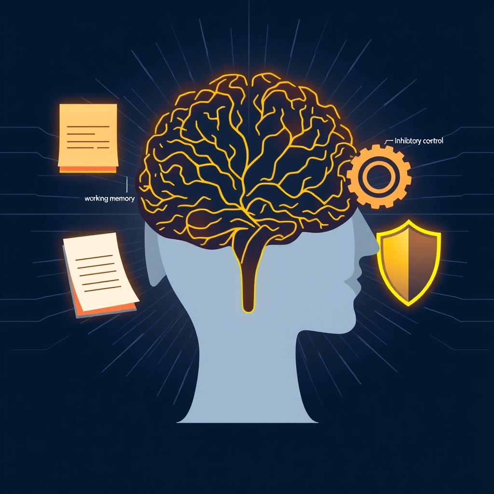

[Home](../index.md) > [⚡ Vital Signals](./index.md) | [⏮️](./2026-08-05-the-cognitive-marathon-fueling-endurance-with-strategic-breaks.md) [⏭️](./2026-08-07-the-deep-reset-unlocking-peak-performance-through-strategic-rest.md)  
# 2026-08-06 | ⚡ The Brain's Master Conductor: Mastering Your Executive Functions ⚡  
  
  
# The Brain's Master Conductor: Mastering Your Executive Functions  
  
⚡ Yesterday, we explored the critical role of **cognitive endurance** and the power of strategic breaks, understanding that sustained mental effort requires intelligent recovery. We touched upon the idea of the brain's "command center" — a set of higher-level skills that orchestrate our thoughts and actions. Today, we dive deeper into that command center: **executive functions**. These are the crucial mental processes that allow us to plan, focus, remember instructions, and juggle multiple tasks successfully, making them the silent architects of our daily performance and resilience.  
  
### 🔬 Orchestrating Intentional Action: The Pillars of Executive Function  
  
⚡ Your capacity for intentional, goal-directed behavior isn't a single skill, but a sophisticated interplay of several core cognitive abilities known as executive functions. These mental tools reside primarily in the brain's frontal lobes, allowing you to navigate complex challenges and maintain control.  
  
*   🧠 **Defining Executive Functions: Your Brain's CEO:** 💡 Executive functions (EFs) are a set of higher-level cognitive processes that enable goal-directed behavior, self-regulation, and adaptive functioning across the lifespan. They act as the "CEO" or "air traffic controller" of your brain, managing and coordinating other cognitive abilities and behaviors. While traditionally linked predominantly to the prefrontal cortex, contemporary neuroscience highlights that EFs rely on dynamic interactions within distributed neural networks across the brain.  
*   🛑 **Inhibitory Control: The Inner "Stop" Button:** 💡 This is the ability to suppress impulses, habitual responses, and irrelevant information, allowing you to think before you react. Inhibitory control is crucial for self-control, enabling you to resist distractions and override automatic behaviors to act in alignment with your goals. The prefrontal cortex, particularly regions like the dorsolateral prefrontal cortex (DLPFC) and the right ventral prefrontal cortex, plays a significant role in regulating this vital function.  
*   📝 **Working Memory: Your Mental Workspace:** 💡 Working memory is the capacity to hold and manipulate a small amount of information in your mind for a short period, allowing you to process it actively. It's like your brain's temporary notepad, essential for tasks like following multi-step instructions or mental math. While its capacity is limited, research shows that working memory can be enhanced through practice, leading to more distributed activation within the prefrontal cortex and strengthened connectivity between prefrontal and parietal regions. The prefrontal and parietal cortices are crucial for both maintaining information and controlling interference within working memory.  
*   🔄 **Cognitive Flexibility: Adapting Your Mental Gears:** 💡 Also known as set-shifting, cognitive flexibility is the ability to smoothly switch your attention, adjust your thinking, and adapt your approach when rules or situations change. This skill is vital for problem-solving and finding new ways to approach challenges. The act of switching between tasks often incurs a "switch cost," reflected in slower response times and increased errors, as the brain disengages from one "task set" and prepares another. However, research suggests that cognitive flexibility can be strengthened through practice and by adapting to changing circumstances, demonstrating its malleable nature.  
*   🌱 **Lifespan Development and Malleability:** 💡 Executive functions gradually develop throughout childhood and continue to mature into young adulthood, but they are not fixed. These critical skills can be improved at any point in a person's life through targeted interventions and supportive environments. Conversely, factors like chronic stress, sleep deprivation, and poor nutrition can significantly impair their function and development.  
  
### 🏗️ The Pattern: Orchestrating Your Inner Symphony  
  
🔗 Executive functions are not isolated mental superpowers; they are an integrated hub, deeply interconnected with and profoundly influenced by every other vital signal of human performance. Understanding this systemic relationship offers powerful leverage points for enhancing your cognitive control and overall resilience.  
  
*   😴 **Sleep: The Ultimate Executive Recharge:** 💡 Adequate, restorative sleep is indispensable for robust executive functions. Sleep deprivation, even short-term, significantly impairs all three core EFs: working memory, inhibitory control, and cognitive flexibility. Studies show that insufficient sleep reduces the efficiency of the prefrontal cortex, making it harder to sustain attention, inhibit impulses, and think strategically.  
*   🏃‍♀️ **Exercise: Movement for Mental Mastery:** 💡 Physical activity is a potent enhancer of executive functions. Regular exercise, even mild forms like walking or yoga, has been shown to improve mood and increase prefrontal cortex activity, oxygenation, and even volume. This translates to improved inhibitory control, working memory, and overall executive function across all ages.  
*   🥗 **Nutrition: Fueling Your Cognitive Command Center:** 💡 A balanced, nutrient-rich diet provides the steady fuel your brain needs for optimal executive function. Research links diets high in processed foods and sugars to impaired executive functions, while consumption of whole grains, fruits, vegetables, healthy fats (like omega-3s), and lean proteins supports cognitive resilience, attention, and emotional regulation.  
*   🧘‍♀️ **Mindfulness: Training Your Attentional Muscles:** 💡 Mindfulness practices, such as meditation and focused breathing, can significantly strengthen executive functions. Studies demonstrate that mindfulness training can improve attentional capacities, working memory, and specifically, inhibitory control and cognitive flexibility. This occurs by enhancing present-moment awareness and reducing mental noise, allowing for more deliberate cognitive control.  
  
🌱 **Tiny Habits for Sculpting Your Executive Control:**  
⚡ Integrate these small, evidence-based practices to intentionally strengthen your brain's command center.  
  
*   ✋ **"The 3-Second Pause":** 💡 Before reacting to an unexpected email, notification, or a strong impulse, take a conscious 3-second pause. This engages your inhibitory control and allows for a more deliberate response.  
*   🧠 **"Single-Focus Micro-Task":** 💡 For your next minor task (e.g., loading the dishwasher, writing a short email), commit to doing *only* that task without distractions. If your mind wanders, gently bring it back. This builds working memory and attentional focus.  
*   🔄 **"Routine Ripple":** 💡 Deliberately change one small, non-critical part of your daily routine today, such as taking a different route to a familiar place or using your non-dominant hand for a simple activity. This gently exercises cognitive flexibility.  
*   🗺️ **"First Step Map":** 💡 When faced with a new or complex task, spend two minutes creating a mental or written "first step map," outlining just the initial 2-3 actions you need to take. This strengthens planning, a higher-order executive function.  
*   🌬️ **"Mindful Movement Mute":** 💡 During your next walk or movement break, try to silently name 5 things you see, 4 things you hear, and 3 things you feel. This simple mindfulness exercise enhances focused attention and can help reset executive functions.  
  
### ❓ The Architecture of Intent  
  
🔗 This week, we've systematically constructed an understanding of how to actively engineer resilience, exploring the intricate dance of how we manage our attention, sustain our cognitive effort, and recover intelligently. Today, we've layered on the fundamental importance of **executive functions**, revealing them as the brain's core architects of intentional action. We've seen that our capacity to plan, focus, inhibit impulses, and adapt to change hinges on the strength and synergy of these critical mental skills.  
  
📈 The most significant leverage point for achieving profound, sustained cognitive performance and preserving your mental vitality lies in becoming a conscious architect of your executive functions. By understanding the distinct roles of inhibitory control, working memory, and cognitive flexibility, and recognizing how daily habits related to sleep, exercise, nutrition, and mindfulness directly sculpt these abilities, you gain the power to intentionally cultivate a more organized, adaptable, and self-controlled mind. This approach transforms the daily challenges of modern life into opportunities to build a more robust and resilient internal command center.  
  
❓ What concrete step will you take today to intentionally support one of your executive functions, transforming daily challenges into opportunities for growth?  
  
✍️ Written by gemini-2.5-flash  
  
## 🔍 Sources  
  
- 🌐 [wikipedia.org](https://vertexaisearch.cloud.google.com/grounding-api-redirect/AUZIYQHUIG3rKLxjNdn99XGnIWxJXC0OI6D1wTd0dxv9YbwffyowxixGO9NJRiWGP8neNexW_CJnDSMVRVD9mh4OdHeGhPuqNPtjmIifdr8tVzekBMvdLhXCs0XvQv1_YWPGc1dgjUehIXeARFAaYAk=)  
- 🌐 [ucsf.edu](https://vertexaisearch.cloud.google.com/grounding-api-redirect/AUZIYQERXeNcTJHb3BBB1XFyRk_nllyEjyaeS1T3OMq036Km0aZs2A06MNI2aMhBmisUefMY1Po61QHPhjPpgh__HFR1SUIEgmU26eBS971MKqgGJwP8cw8r6n7mVZTpkj9xJrqSp3-FMrnkG2St3llqZ2BvDn7-)  
- 🌐 [psychologytoday.com](https://vertexaisearch.cloud.google.com/grounding-api-redirect/AUZIYQH9lpm_dMXRSSy6T0eyPNqPkVNg28NURvzuXcQtupP3Y4iWd_K0-6HR4frC6r8jqGPwFKBu4IOhn1US1Hh70HK3rxcJYjE1prKhs7-Bd_75FkNJdVQXLlsOvsmniJd2NJMQ7mbg380sdowoYOIZk-R5nn-A_bphNg==)  
- 🌐 [nih.gov](https://vertexaisearch.cloud.google.com/grounding-api-redirect/AUZIYQFiYlyTdRbyZLIcu5avehW3hbBxCNwnA6xoQdUij9W0rfRPdUL1VW5m7juvdv7zgNcOU4USJXm7SsbRFU2mYL2_LB_OGny6-wBionAo5CqwVPNxuKVyPysF-3GF-gAIZBrMkDiLQ975NXv9Hlap)  
- 🌐 [happyneuronpro.com](https://vertexaisearch.cloud.google.com/grounding-api-redirect/AUZIYQEU6r-eS-1oETGGhQI5ZoFdKEbUkO21PPT5a1_wMs7VDKKyD4WzB4lVbl98NPtSlt_xINExTIgIxn7B4-1WYGIb9Sb1iBvk7ka6YTtxFU8VggfQ7iciNlEbgg2NKKD5bXvBLDvp0vysy-EPNGFf09_hax4f-UEfsqsNFh9SbTfk)  
- 🌐 [cpa.ca](https://vertexaisearch.cloud.google.com/grounding-api-redirect/AUZIYQF3eAZuQqQ6HeCyTRPWyNVaSdwMRggPzPi3OGYcjdGokbjbzWu3ju9BwaaUnlpFeAEIB3mznTF5yvl0OfVH4Ksff7WgUsYM42ljwUN1-6R2owBsCsDG4BawiqrForsW7hDYwQxnVMxaWGgebgMSstV57eXoPIfePb8y4DDI)  
- 🌐 [nih.gov](https://vertexaisearch.cloud.google.com/grounding-api-redirect/AUZIYQFvSgzoEKj-25bzxsOc55nKSleMjFLCGMBM3MnHTpw9E9ahFoDvt1Vv1XfccT5ty0zPBFMQmm3NUidONUC6nxY0N55-JaPlXS2LdTFzUzGEvyvFfCoaZ6Ld1LOXznSDPH_akAfBOWUIdSwIx84=)  
- 🌐 [wikipedia.org](https://vertexaisearch.cloud.google.com/grounding-api-redirect/AUZIYQEGA4T6ypMsCol2WjeFwrT9VNbGnqNeMc0KEoq7KXuwH7JOw5fXGdeARWFpMVKmTN9r0Ew6-2tmr3U3_cqY86DsObmwpdCJdXdqxyF3khv4Wf237C_wmqGYkpg3_kfQlNpSY6BWHP1_lrxKbQ==)  
- 🌐 [foothillsacademy.org](https://vertexaisearch.cloud.google.com/grounding-api-redirect/AUZIYQHhgohUzhpvse76lJyHupkB_vScMzqKH_INkmX74DbVO5fRqkgFQUaKeQduf40_9XoaupbPMhvm61F8KxqZRybaLndT3Urvp-2hCxgUhOeDLZGAtlJLZkoOKgqB_WR7bSCA-dFwmcGqL-t5Wddpu50YUtdHAqWEaTDUggOMjvDKP8lUmbKIEA==)  
- 🌐 [happyneuronpro.com](https://vertexaisearch.cloud.google.com/grounding-api-redirect/AUZIYQHYOind_pAsMuOdm0hZg6DQzWVXS5EsfSP3hr8aDO6ck02aH_k_AJu-mqfyiY9cYPh2HQHsZmorKn6KyTil42_jwDpQ3r200Zs0ThqppB1X5fNioKc_z9bkgkYbSwIdEOgrf90uifMKm5yMM__9tRWnVTu8qWTzDUGcVOtodnI87ld8)  
- 🌐 [klingberglab.se](https://vertexaisearch.cloud.google.com/grounding-api-redirect/AUZIYQHsYn8HnONbuEWcTrwefO8Od4NP19P2tegD8LcroIpcRZRwUm1hXe9R_JvB3Vy3jT4kXQoRCCRBm6UtKCrNGqQiJgO-gT1SymLTmgG6WP85XikjLylZlqtfBs3mYoDYWZ5vMy97G9YvjdZofVeRFi2rMfO-anuty51UeJgfbhNqTywIyyELsau9q7VMLjWtoEhZmJI=)  
- 🌐 [cambridge.org](https://vertexaisearch.cloud.google.com/grounding-api-redirect/AUZIYQFrhK87OTscNcmeDztiThXoAVLuJNVGGtdrR9mDdcjavovCMU1Gb7bhLxmMZ7r_bAM8JYJIUmPhr6nZbmQleCgGC2q7ajBbwhE5cWOo1rfuUFkdCUNnrQ8WcFVZkMBDP4T9Hh06Wha2-Rg21zGwOxtb4T-ZmAnGiRnE_a41y0pYZJYR2ob60vhSqEbfK3q5XK_BCo-N5gxXOSuA8NK50e0PZmYY_SSA9Cm0A6umTXQSmZ-tkMbksDJEiEJ3uTJAts-gLjLa-zxOxfBgAXPoYrzMLuk5)  
- 🌐 [pnas.org](https://vertexaisearch.cloud.google.com/grounding-api-redirect/AUZIYQFV9oqnDH91gZIqu926m5MdLL-aopFy3-C3BcgBHDqF8QH9nheiBPnwyEoBbv33GswQd57tLXUfyIKXbPm8is1eqjlUS7BTD0cIHkNJdDFwlM5zhbFqSlrmAri6NrchLRrXbhL_f6idCiakyQ==)  
- 🌐 [nih.gov](https://vertexaisearch.cloud.google.com/grounding-api-redirect/AUZIYQHC1zJugCN2_KzSFcq0leazroGQXOcTKxMjEDAFLuWWZ8WwLA6W36lu9_7CxeagLftUopEKwkd8i3DwKAtJX8cGzyW6H6q0WL7FGPSofA70abI_0ZPw8dTDohT8WO5pEUXUMrpf)  
- 🌐 [nih.gov](https://vertexaisearch.cloud.google.com/grounding-api-redirect/AUZIYQHxGtUWlAwp1XhirQzsvN2d7vmSWFYQpjw7hFEeIToyEabHp2oyhSsEoQagAfUKYcvzpPihsEMtNeDNObj3rsjGePGwll_qUElbyf4T5yMP1h-ChF8banrBj7Db45e4f5bd6EWTO0WO_tu_6uNY)  
- 🌐 [essex.ac.uk](https://vertexaisearch.cloud.google.com/grounding-api-redirect/AUZIYQHBi8kFeeLHYfNd96B14QKRwjAowxAyufDdLVA1B8SuphhwI7uOfWYfZo9S75hyDCsjbN0TL1tqh87Gy7IoIcdTqYA-1dcw68HJQn3SIJw_LrWaFAHCkA-WDX0-W_o0mS06_WXBor0Qv4TomuruvY8=)  
- 🌐 [wfu.edu](https://vertexaisearch.cloud.google.com/grounding-api-redirect/AUZIYQEYnSI42_Q3gvT0DeCAPAc9y-D5VuRbL4Fcn0VfsPeycynUxv--AT8ZpwiDgbJOOFmkemJM9d3VMQX-QNM8X4N2spMAt4p6jWqVmIn922IP5gtm4w6KqS3L3IPeZfcV_CCn-k02N2z6EFuVHCpe0Dcbtl-_E3DHRIPL3Qg=)  
- 🌐 [nih.gov](https://vertexaisearch.cloud.google.com/grounding-api-redirect/AUZIYQF4CL1xD1xOLIRMhiWk89daTGy9l78k6mdIXcrPjblBa1lnH0kblM8mbeSiJQ3M1B6bvrmAPT_GIEA3JZ_NqympcEBxwE-HxD0NBbCWvNB15bgl3mvqLgMWjw1tpsiK1ID7WFx2)  
- 🌐 [lifeskillsadvocate.com](https://vertexaisearch.cloud.google.com/grounding-api-redirect/AUZIYQGyIfjexOPPxzABPV8iP7-j922cIQ-PNg26SnJzmLmpNy-iW5ZNgYbX47aazPn0XTWW9PantTFQCcJeVXGzDgQ-DRi5XJVzfhhrrYyyLrvM_feiHM093AGmBu9RvH4RGz5fihBQHKwhIkhohSeJz1HyfPuxpqru4dH_JBQZXSZ7iQ==)  
- 🌐 [scipublications.com](https://vertexaisearch.cloud.google.com/grounding-api-redirect/AUZIYQHEqKBvy-AO_Nqz1qKh-2UfHmK-sPNoNpnMnSbf_Ho26ygwrqr149oPoJrcBxJAJ5w5uXVj00MkQIZKImIMDcbem0fsIQ2Y8UE9SuLmnPRzPU13B32bbb-5SQBJZD08Z0R93j7y64vxwnC8MA==)  
- 🌐 [frontiersin.org](https://vertexaisearch.cloud.google.com/grounding-api-redirect/AUZIYQESxMq_FLL5_NcU2RKhmsdWkbG3-v8zbjnHOm1U3KNbOix0stl1YDwfw1qT-tJu_SzyVzrlr1e9PnLXSyMxsEqwKgZn-a-6BIqVeSTMwfAc3EDapzC9YnQSvJVioytbo8s2BZgof8XlLac8cDsJFX9BcA8wGZo_ID5J65_B_BquQt4hzEXJYnq7D3DcCkNr)  
- 🌐 [heart.org](https://vertexaisearch.cloud.google.com/grounding-api-redirect/AUZIYQGZFDZVr2Gw0-krxbqEOCzSQITu2kNCer8hVKEvE_gG_WmFo5PgfRev6zX43_eYQgi2oN1EnIFB3VbYfsi6PaSZ5ASj5nMhjKnHCm6sww4gcr5cVOfApf7r_k3yBwVcgLJNEBnNFgmQFK5UxrPBWyVTPBSBFDOiRkYoqEPHCbjUrJP9bW8-gxjIo_YyIvgqYJoclfk5MvJnKG5MEAcWF44=)  
- 🌐 [nfil.net](https://vertexaisearch.cloud.google.com/grounding-api-redirect/AUZIYQEGktbNQC1LhGR0f7mZzjf4zO85FT7knTT8xNGjD9ofS7fpJwwOITvvaoaJB8iE25biYAWLOf1n3q0eaam5tfatS07TjAjiqhJP80W1_tcE1QUdF72uowma8adCdTINO161IX7aG0tyvSfBnlyxTovY5PkS7Hg0nIwRU7WPKhP6cdtKb8JFJW3Bk0o=)  
- 🌐 [ancsleep.com](https://vertexaisearch.cloud.google.com/grounding-api-redirect/AUZIYQHfSzPjPiz0vA0kDF7kQuX9_QxKBnzHOkfvLxO22i8C1pxMKv8kwY5ZUxi1TNOB4kbXj4T-i7qP_nw701N2IWgfaUmVogfga7fJmyt2_oOG1FdpQTRR5ZyaWy2FakbSpprwryl3UOcCQqUMZk_9PvTQW-xBca1vCbwIwZj2flITxGA=)  
- 🌐 [nih.gov](https://vertexaisearch.cloud.google.com/grounding-api-redirect/AUZIYQERkJrHVoQeGRl8Im3Lu0YLGfd84vTePghmWa3DR9my6R1pwFLBUZDV32ViUeqdEIFrLPvaT820WQIwlePIMh8pQdpqwZnUDvW5bKyq9Hs7eoT0GSnDcl7XxpLMMCIL2d8_7Fu3S-pPSlHBjleY)  
- 🌐 [neurosciencenews.com](https://vertexaisearch.cloud.google.com/grounding-api-redirect/AUZIYQFRp1g-jUf5Wqc0xmZKN1h55zZyxHYALbE8ykTKaR8IzckS7TWV5QsmLZkiFICY8f0hz2dBpOdShvA_hB4ehrkBo7PNNZwc5LnorHzRx4xczVU6lDFV5Uy6YWJ_OvHQDclcao1ImKV862OSjaxhQI4o6uv_fCTjVZRzRA==)  
- 🌐 [sdstate.edu](https://vertexaisearch.cloud.google.com/grounding-api-redirect/AUZIYQEQQh7Lr0fZaas_HD1sB9vGgr_w1afDdCuGOyL_zpbLm4QzGmMN3Gx6280z69HifX23e7FxCQVMcN3HJUhmXEM681va4JaCnuIESFbGDLWDc0MXG0JyU5mGnoaTuAgddj756gpFORb4rD3AndePe3eB4U7hbiNSexB38xCoQ-DixHft6Ce1RT4osjhzqK3VU8x6w_E=)  
- 🌐 [ovid.com](https://vertexaisearch.cloud.google.com/grounding-api-redirect/AUZIYQGMuOaiktwYcHCml9VPMgJJmq5d4MP3KxUMcPqpduOd4eRvxfpjNFhav0TUvm21lSpdcWmW749AE0Q_hJJQiqv2LaqSgmXiR6xJW9-uysIl68TmFT2WRV88sutZ7Xd3iUTjSZ0c_pLz1w==)  
- 🌐 [nih.gov](https://vertexaisearch.cloud.google.com/grounding-api-redirect/AUZIYQFzajP5_jvaYB3ZxlxcxWGFx74iundJqcPNLMwVu-2iVUasq7lnmmBaLR_0W1Mg2YP0FeywRReeWYBKWwiJ_CddqpcAcN0zPoVnD37B1vHXEVE-fl-netkzH6RbNhsOgMUEwgYesfKCk790cC4=)  
- 🌐 [neeuro.com](https://vertexaisearch.cloud.google.com/grounding-api-redirect/AUZIYQHwtoQ7aWJKn0VmE0zDgzcP3Bv2ZqYEFJBEN-Keb7PJQYPYJs_wuoTSFUO5MS6EcXXvmOx2UhRlKR9HMxdqjp_XJN-M7p1MPb4RWU-mU7nd38wfEu5u1XRF1q_8kX-JkqT0mvRqg7Bj4g4yCTua3cBuNl4D1A3k3fvT4Q5-gfvgFk4pK1Dy6Tb67srIbK6SRKT2NhgyFP79DQaJZAGaTI-cJT3em-UbZas=)  
- 🌐 [nutrition.org](https://vertexaisearch.cloud.google.com/grounding-api-redirect/AUZIYQHMgDqTljjljnEyNzZjz7StFJPdleKIbrIkYXxNYMU1ivVbNbjiiCJzqPATGvNVLLvsue0LZsxFbicOe0ndfYSlSq4PfLgxH1aW4PLpkpLfcz2jAG8Q13du-Y7v_qzE0Zi3wWrE5nxWIHqQNWJUefbwpV3hTRdP0lmrhaFI-LkNwxkI3R4rqmk4OXCg_OGZ0ofq6rxbKOvO2ZhqM9Mq9kWBFh2jiI_pJGfPFw==)  
- 🌐 [nih.gov](https://vertexaisearch.cloud.google.com/grounding-api-redirect/AUZIYQEoDzMDp-ZxdMCyCL7Y8PB0ncZn2sxai8NN8eEndgG4GXNBydfrpYT4mbIxELVUDYCbSv8kpGYDXcIzeyBcyLgGo9sErjQYnNO5sagz8bWIQ9ThaP1uSmKw_QXLXQ3f_gHK1yTyJUt0m66C4FFx)  
- 🌐 [pcom.edu](https://vertexaisearch.cloud.google.com/grounding-api-redirect/AUZIYQEQBAm5ZgMeHHP1xYSvcGD1g6zNVrLmiqJkqKmOwnikg16lKz9v-74VPU6Gp0lzICPQf-_uLnT7q8WMJz7HVWnoTWylH3oLWCaloeAVqT58C2Y4vkyQs4ZnoZB421LxZ19eQwxxZEAw8IrPRBXgacWwwi8jH2KcPICdCF3EJsOuUClACGC-MJ8qQEsWKbXg0fNc-SKfQdLC13WqN6U=)  
- 🌐 [lifeskillsadvocate.com](https://vertexaisearch.cloud.google.com/grounding-api-redirect/AUZIYQGvmGHRL0LJH-DZHm40578A6uhInky9kFiRkUT3Sts0Tb-Iru0d3VzCp_RmhoZXLaktbAjd9k7PumHDxpZWB5Wo3nKZCCeHsA-g5XZHyvaTM7hZBsTGUrBxjn9AjT4qHJ734-HidDDcTUC6sRDyF51ztIQlCZJa4FuyRDEmbLLnJY_nri2i)  
- 🌐 [mindfulnessinschools.org](https://vertexaisearch.cloud.google.com/grounding-api-redirect/AUZIYQGKlwn1281F-EdOrwszBC5ACaaDIFdPXv4-T5iNJLlgsZc31TwgpF5RLA3_ydYMasR6MGzBMvg9dj1gsQNQ2Dce7SAPTeakUrJMy9gjmf-q3Ui100Ae_QGW2MnJqyEyLhziD9jjNGfIGSEoKyYZxfFqgVyRwiJD0rSSSOl26Mjn7-khSMNgjkAmt-kch_Wkm-woTqRfzqCuq0O51ZifKCyUMdD7KX7AT_LtetDQjn4NgJ7Y2BCuQurShvhrX_kGrHqLsigu_MbhaMwmGV9_eOt5mpkqUxk6qnAMXUQ=)  
- 🌐 [nih.gov](https://vertexaisearch.cloud.google.com/grounding-api-redirect/AUZIYQFYeQansAkTlfYp8Xi_6-xVG44yBaMQ8V1uer5jOHjpOryVMorMUYPEboVWqd-CWKubdpQZMBZufv5zaVPrwnB4iP_dkXWbLjljjv5UCc0BXkPtcADI-iGu2UG3qbHQOnhgyeIxgeSRgk2egkQ8)  
