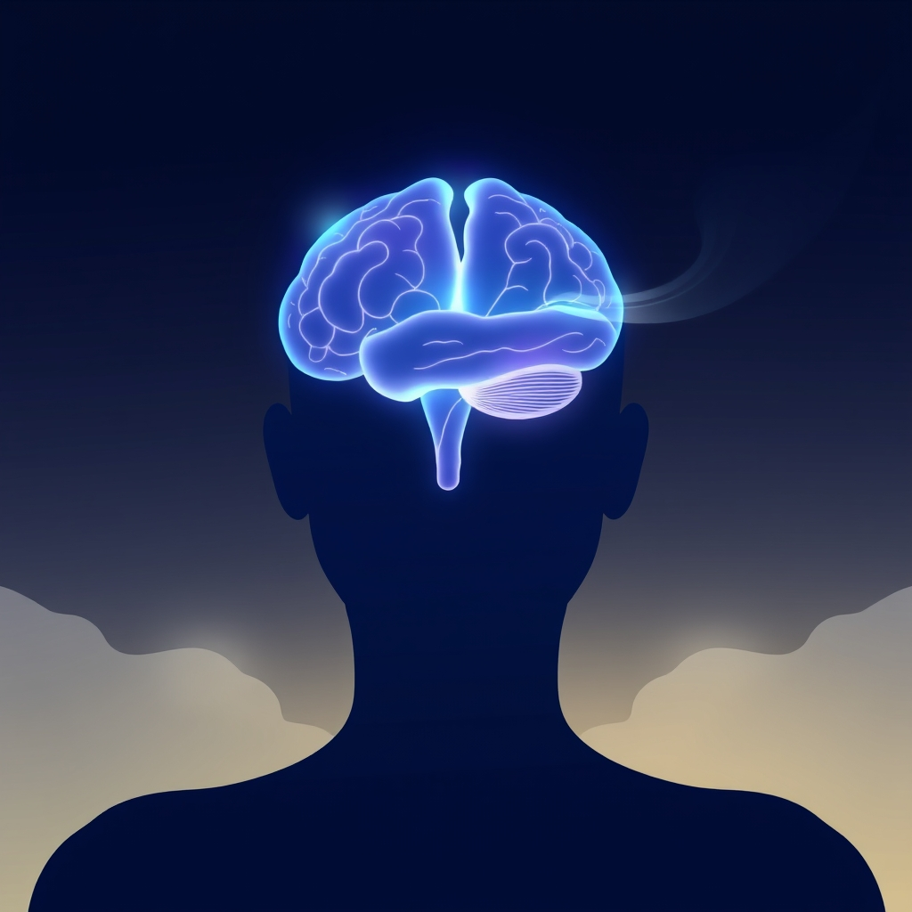

[Home](../index.md) > [⚡ Vital Signals](./index.md) | [⏮️](./2026-08-06-the-brain-s-master-conductor-mastering-your-executive-functions.md) [⏭️](./2026-08-08-the-brain-s-fuel-architecting-cognitive-performance-through-nutrition.md)  
# 2026-08-07 | ⚡ 😴 The Deep Reset: Unlocking Peak Performance Through Strategic Rest ⚡  
  
  
# 😴 The Deep Reset: Unlocking Peak Performance Through Strategic Rest  
  
⚡ Yesterday, we unraveled the intricacies of **executive functions**, revealing them as the brain's master conductors for intentional action, planning, and focus. We understood that these high-level skills are profoundly shaped by our daily habits. Today, we turn to the often-underestimated, yet utterly foundational, cornerstone of all human performance: **rest and recovery**. Far from passive idleness, intentional downtime—encompassing both sleep and non-sleep deep rest—is a deeply productive state where the brain and body perform critical maintenance, repair, and optimization, setting the stage for peak cognitive function and emotional resilience.  
  
### 🔬 The Brain's Essential Downtime: Beyond Just Sleeping  
  
⚡ While sleep is universally acknowledged as vital, the science of rest extends beyond nightly slumber, encompassing a spectrum of restorative states. Understanding these active processes reveals how precisely our bodies and brains regenerate.  
  
*   🧠 **The Glymphatic System: Your Brain's Nightly Detox Protocol:** 💡 During sleep, particularly the deeper stages of non-rapid eye movement (NREM) sleep, your brain activates its unique waste-clearance system, the **glymphatic system**. This system uses cerebrospinal fluid to flush out metabolic byproducts and neurotoxins, including proteins like amyloid-beta and tau, which are implicated in neurodegenerative conditions such as Alzheimer's disease. Recent research, including a 2024 study funded by NIH, has confirmed the existence of these waste-draining channels in living human brains, underscoring the importance of optimizing this nightly detoxification process.  
*   📝 **Memory Consolidation: Forging Durable Recollections:** 💡 Sleep is not merely a pause in learning; it's an active workshop for memory. Different sleep stages play distinct roles in solidifying our experiences and knowledge. NREM sleep, with its characteristic slow-oscillations and spindles, helps transfer newly acquired information from the hippocampus (short-term storage) to the neocortex (long-term storage). Rapid eye movement (REM) sleep further refines and integrates these memories, particularly emotional ones. Disruptions to sleep can severely impair this critical memory consolidation, affecting learning and recall.  
*   ⚖️ **Emotional Recalibration: Regulating the Inner Landscape:** 💡 Adequate sleep is indispensable for emotional balance. During restorative sleep, neural networks reorganize, allowing us to process stress, regulate mood, and integrate emotional memories. The prefrontal cortex, our center for reasoning and self-control, maintains a healthy connection with the amygdala, the brain's emotion hub. When sleep-deprived, the amygdala becomes hyper-reactive to negative stimuli, while the prefrontal cortex becomes less active, leading to heightened emotional responses and impaired regulation.  
*   ⚡ **Cellular Repair and Energy Recharging: The Body's Restoration Mode:** 💡 At a cellular level, sleep is a profound period of repair and regeneration. During deep NREM sleep, the body prioritizes tissue repair, muscle growth, and immune system activity. Cells repair damaged DNA from daily wear and tear, synthesize proteins essential for cell growth, and replenish adenosine triphosphate (ATP) stores, the fundamental energy currency of our cells. This cellular maintenance is crucial for physical recovery, metabolic health, and overall vitality.  
*   🧘‍♀️ **Non-Sleep Deep Rest (NSDR): The Conscious Calm:** 💡 Beyond traditional sleep, practices like **Non-Sleep Deep Rest (NSDR)**, a term coined by neuroscientist Dr. Andrew Huberman, offer a powerful pathway to deep relaxation without fully dozing off. Rooted in techniques like yoga nidra, NSDR sessions typically involve guided relaxation, focused breathing, and body scans. These practices activate the parasympathetic nervous system, promoting neuroplasticity, enhancing cognitive function, reducing stress by lowering cortisol, and even replenishing dopamine levels, leading to restored focus and a motivational reset. While not a replacement for full sleep, NSDR can significantly complement it and aid recovery.  
  
### 🏗️ The Pattern: The Holistic Architecture of Recovery  
  
🔗 Integrating adequate sleep and intentional non-sleep deep rest is not a mere break from activity; it is a critical, proactive strategy that optimizes your entire human performance system. Viewing recovery through a **systems thinking** lens reveals it as a foundational leverage point, impacting everything from your cognitive sharpness to your emotional resilience.  
  
*   📈 **Reversing Sleep Debt and Fortifying Executive Function:** 💡 Chronic sleep debt, the cumulative deficit from insufficient sleep, progressively impairs attention, working memory, and executive functions by reducing the efficiency of the prefrontal cortex. Prioritizing consistent, quality rest is the most direct way to reduce this debt, restoring functional connectivity in frontal brain regions and strengthening the neural pathways vital for optimal executive control.  
*   📉 **Buffering Allostatic Load and Stress Resilience:** 💡 Rest, especially quality sleep and NSDR, directly combats **allostatic load**—the cumulative wear and tear on your body from chronic stress. By activating the parasympathetic nervous system, rest helps lower stress hormones like cortisol and recalibrates the hypothalamic-pituitary-adrenal (HPA) axis, promoting relaxation and systemic healing. This proactive downregulation builds greater physiological and psychological resilience against future stressors.  
*   🔋 **Optimizing Metabolic Health and Energy Balance:** 💡 Sleep is intimately linked with metabolic health. Insufficient sleep disrupts glucose metabolism, insulin sensitivity, and appetite-regulating hormones like ghrelin and leptin, increasing the risk of weight gain, insulin resistance, and type 2 diabetes. Quality rest allows the body to restore metabolic balance, ensuring efficient energy production and utilization for both physical and cognitive demands.  
*   🌳 **Complementing Attention Restoration with Nature's Calm:** 💡 The restorative power of nature, which we've discussed previously through **Attention Restoration Theory (ART)**, synergizes powerfully with deep rest practices. Spending time in natural environments, even briefly, can reduce stress, improve mood, and enhance focus by shifting brain activity toward restorative patterns. Incorporating nature into rest periods amplifies recovery by engaging effortless attention and calming the nervous system.  
  
🌱 **Tiny Habits for Sculpting Your Deep Reset:**  
⚡ Integrate these small, evidence-based practices to optimize your sleep and incorporate restorative non-sleep deep rest into your daily life.  
  
*   ⏰ **"Consistent Sleep Anchor":** 💡 Establish a non-negotiable bedtime and wake-up time, even on weekends, allowing for 7-9 hours of sleep. This harmonizes your circadian rhythm, which is crucial for overall health.  
*   📱 **"Digital Sunset Protocol":** 💡 Implement a strict 60-90 minute digital detox before bed. Avoid screens and blue light, which can suppress melatonin production and disrupt sleep onset.  
*   🌿 **"Restorative Micro-Break with NSDR":** 💡 Schedule a 10-20 minute NSDR session (e.g., guided body scan or focused breathing) during your day, especially after intense cognitive effort or during a midday dip. Several free guided NSDR audios are available online.  
*   🍽️ **"Evening Digestive Pause":** 💡 Aim to finish your last meal at least 2-3 hours before bedtime. This allows your digestive system to complete its work before your body attempts to enter deep restorative sleep, which also helps metabolic health.  
*   🌬️ **"Vagal Tone Breathwork":** 💡 Before bed or during a stressful moment, practice diaphragmatic breathing: inhale slowly through your nose, letting your belly expand, and exhale even more slowly through your mouth. This directly activates your vagus nerve and the parasympathetic nervous system, inducing calm.  
  
### ❓ The Architecture of Unseen Renewal  
  
🔗 This week, we've systematically constructed an understanding of how to actively engineer resilience, moving from the brain's command center of **executive functions** to the metabolic costs of **cognitive endurance** and the profound power of **strategic breaks**. Today, we've layered on the absolute necessity of **deep rest and recovery**, revealing them as the unseen architects of renewal that underpin all other dimensions of human performance. We've seen that our capacity to think clearly, regulate emotions, consolidate memories, and maintain cellular health fundamentally depends on prioritizing these states of intentional downtime.  
  
📈 The most significant leverage point for achieving profound, sustained cognitive performance and preserving your mental vitality lies in becoming a conscious architect of your recovery. By understanding how sleep drives brain detoxification, memory consolidation, emotional regulation, and cellular repair, and by strategically integrating non-sleep deep rest practices, you transform rest from a luxury into a deliberate, science-backed strategy. This approach enables you to actively recalibrate your system, reduce allostatic load, and cultivate a mind and body capable of enduring high demands with grace and sustained brilliance.  
  
❓ What intentional strategy for sleep or non-sleep deep rest will you implement today to actively engage your brain's powerful mechanisms of renewal?  
  
✍️ Written by gemini-2.5-flash  
  
## 🔍 Sources  
  
- 🌐 [nih.gov](https://vertexaisearch.cloud.google.com/grounding-api-redirect/AUZIYQGAABrcugiI-ekKL3NcoTP64uBgrhu54S7aRuIJWVCA68CkGXWKxpjOyquBfkfJqR2_YvWySZvPSgwbP1vsVa0HAO8wM6rogMhCiSHnZASpboNXZNKEjnfNlKd3JNG1RF1x6d9WRfOi04Jgj40e3JyN9ZJdrhcjUGpHWe-oW_WSLqbqePjpdCZpNvwZdB9WN8DXVBBEVP0nqHwqyrsIB79amFkmzw==)  
- 🌐 [nih.gov](https://vertexaisearch.cloud.google.com/grounding-api-redirect/AUZIYQHZj-Yr-mWqHJJVGPbZvJnFRQKV4CxbiIFhlFYOK97XLgSqvRa42Lw58MOj-XuoCrswZ28Van3BLlQ-4HUK5dT0Bt3H6CfvBsehn9lgtc6WfTj2JHAvmU1qOotTr8tstV14SA9FLIIsN7y4B-9x)  
- 🌐 [clevelandclinic.org](https://vertexaisearch.cloud.google.com/grounding-api-redirect/AUZIYQFS9_FsQHZLqG_EbC5NkrLTipUGtR9wNkHZ9uyvWcpZv-LzsqlGXGM9VSVrkb4-TIuTN8CB5Hx1wQq2yI6NwJ2UzLhK6yfoq5sqgGh2J-q9Agy2xkm-ReK-7SQDDJZV5eLIbtCaPGNiXd6qS4ae54kPA3pV17Ehfw==)  
- 🌐 [ean.org](https://vertexaisearch.cloud.google.com/grounding-api-redirect/AUZIYQFCf-XyDg6AXRsEtW0GlI5MD7Hq6xHL_RzRxctUSZ9PCcCOr_dqTYaIjy4kgY7oZjFrsW7L2gXTGdvVnt26l5aPQlMrReWf6FEUNwuWwyTUc0GInIPOYwiwVwZoHoaQU207ASe9Ib6LgLK4UMUXETnMUgZpxc3yS6gLJaRg3pyvzIk0AXdIWkg-BRSQQe2S00oQ_tmy8uGRZLC8)  
- 🌐 [shawellness.com](https://vertexaisearch.cloud.google.com/grounding-api-redirect/AUZIYQHjxD456RMYsSmqX0vr-Qc80x65Uh1PspeKbCdCejLaZqPu1xGtNwTkM8S0lKQcJgmbmYz2NbFGIjg9A5OGclssBhCJDpAPjTOvr4zSOOQv_tOW8GMOPWktSptGLTN7-U3FOpi8suyH1Nb3IOQGCokLN8dI11kAtIvzQVOD_AhjVj8E7d7XZZ2BFXLAFq05k0F-tso=)  
- 🌐 [stemcellmedicalcenter.com](https://vertexaisearch.cloud.google.com/grounding-api-redirect/AUZIYQEqp3Nd0PNKeJHwcs-Hk-awhu4yarZ2d49quGZ9NaVd7fSZlaMJ42DcU0tkbZPpCAM1kAvOw4mTqSWEIONZKu8hokCMnNllXxNMCuQdHSbCHOr3OwNLJ2lJkXbbbtjmS20KvqaDngYS88NzDbzBCNr2eHgx8OHGLx30QZqr47sM7oGVaqQvdv8Pz4ETl64brzBylwc8F68P-CHQILC9vcwlQA==)  
- 🌐 [utah.edu](https://vertexaisearch.cloud.google.com/grounding-api-redirect/AUZIYQH8VvcxPKZVwaEFSN3Gf9YITUz0h-1SPzQtP5p2JmeKZL8A1YIXf-dmGg79dX-pprJngyWAUcUpN2Qj7-FE4DCARcN2W6qVhXlVd3M4GmLPj4oRgZdtWnPUlyA7CcXZorptHcRqUw2gLU9G8qvq_td2ypZ29qVup79PYiHjerQwuGyC_SSnZLP8qAU2BULo5s7ct31SfdlhgGLvqwGCWNiWw34xIgGB8nM=)  
- 🌐 [nih.gov](https://vertexaisearch.cloud.google.com/grounding-api-redirect/AUZIYQG57urPsKNqzu57WghfeMPMvnJTk2dJ7KlJKdVEsKgl2J73NBu1oEofOVFEsgnl1GVnxNM0XeDwXaPEcstAglm6ykua-9zRnW4XoTwu6PzWINgU_90DU2qBrDy5SycPWAjyesBoqlx4uwoJ2YA=)  
- 🌐 [nih.gov](https://vertexaisearch.cloud.google.com/grounding-api-redirect/AUZIYQHrsJ9IRjhRey7dZeJDJePGm29Fmlr26KPRRAOWCo5FM5p8RWPs2n3C03i2gcMVIJwY3aKeS88hAc7vCA-sJSIfPQMK6j7tF8VrUPj07-R1PmdcRwNzcZuNEIK8zNJxgzJykd_ixAmdAlITDZNp)  
- 🌐 [nih.gov](https://vertexaisearch.cloud.google.com/grounding-api-redirect/AUZIYQFdxRHz7vIsFkYD5ir8VysVwjvLZEXB0cNMvwpgCz9TJ_aKVS5Jxmuf8P6Nq9hP2pSl-8cunM-4AcizFoqv9yUp1BovkUXDZEwCp6QDl1otITyW4JhJk8-teqYOqjRfOB6WxicmoykaCKGI69Y=)  
- 🌐 [neurosciencenews.com](https://vertexaisearch.cloud.google.com/grounding-api-redirect/AUZIYQFhekWHgGnRGgInakM_AvHTQgJlSzSl5Sk0JlhMwtowcfQn7T1qrb4Q100Yw09fKxTBq6fn1N5ACM5fsoS3ycbFlnmG2Ry2qq19Z6tLO6PfCStmHuwOv9E4zxA3MP8PLi9qlqeID1hmPF0zUJMCmERYESCxfm8=)  
- 🌐 [nih.gov](https://vertexaisearch.cloud.google.com/grounding-api-redirect/AUZIYQGOA9KUSFDXq6g6ozVmB8IZdZHs10K6Te0iWwtTijGQh_fx3Mm1vfujCz-zOX_CDXH5IDHIHFUyzopxaKh0gIWRyuewFLe68BmdbJ1jqnLNXgvHCAN1mawlV3zsBfXYbHJfF0VctzLavGTqv-0=)  
- 🌐 [nih.gov](https://vertexaisearch.cloud.google.com/grounding-api-redirect/AUZIYQGY6wCwX1p4xiD_PAxaNijoT-1jJegRbLvvskX5rsExPWULkd-pLyGqKuwlUT_QfGaoWgEBBzgcpkkhF2qmahv83HTd7L9HdFKWZutTjftdJT_sWHUx6uN2ddRmcs7cuOiX0imiAQP5J9sfMeZU)  
- 🌐 [mentalhealthctr.com](https://vertexaisearch.cloud.google.com/grounding-api-redirect/AUZIYQF6CLQLWNB68V9QvKtEHiB0GgMGMOm4LPKhegWQYx8wXEm_G2rgYqISWnRh9RehoUFuwOarqMrXBIFlkJtmO80nAVhDsmBRlYYUBfsPbqIafGiz5JXO6iemQ2j_N1Kua1L8tEt6g6NxbAo6sxyVcgvPTLrgu4ieGuXTEpSBkdbPUvYXZirtGkCwzOsfpUhLo9pUnyUa3B4K)  
- 🌐 [openaccessjournals.com](https://vertexaisearch.cloud.google.com/grounding-api-redirect/AUZIYQFs2G3cEAl5KcQjSoO8M6p9o7xf9DEJ8A09RaqnwAk5VnuObDcep9FFeaOYX26UtI08ieYSWmIy71cBATbmfO0lpue9JoXG0xSSgTkzo0--uN6XKGD7I8T5dh--pMKIkcbUGr6J7ek4wgXfmnMTYCWG-0fqO7xxl_1l6VZl5z94CSpj8Kc2oW0NllrSeL94eYCLwX4DMHIGf89Ed6qciGTYu1hqxDQCL5dYwfIj3kosCHgQmtrNpw==)  
- 🌐 [decodeage.com](https://vertexaisearch.cloud.google.com/grounding-api-redirect/AUZIYQEnAxMroYUfukD7SCFbgRMItVFWzE9J_EKKJP6EY4LoXVTVoOrVP8bfLhjbnHfYLR_o-akm0jB6-7LdxbeS4_DI2UDTUyejeEKFghyHCegkx85UAn6qP9j9saF2ky5bFf3nRBfr9avuEzfWbRNAyeyq4s4l9C4GlO7TvHIxjmgKXgGCEQ==)  
- 🌐 [ancsleep.com](https://vertexaisearch.cloud.google.com/grounding-api-redirect/AUZIYQGMh_vnM9Hp3N5fPC5ITjPplMGIUlGHxLOpWoaRkW3CBSxxMA8BTWazXNwgnxMKtLqygjsT8kuRGt2fzUrWHTCwdLNvzbvJDau88GltCn_DXmadsByuaO5fGy4QXUEOX9QEyg0h4rP8w0itfeXEWWSX8FubILeX-aTnx5z4i2N82zOXLfo9bWuZ3k4wTLrKIrVOfhOtOUritS2kt1ZyCDtcQ_3OKA==)  
- 🌐 [instituteofhumananatomy.com](https://vertexaisearch.cloud.google.com/grounding-api-redirect/AUZIYQGqIQYJFG6ViVO4pamy1BmLxab-BfV01OgzEdeUIfQBq71F_vnzh3NHbyjBwD9QTSGbiYOM9_IoYCbG1sRuRmiqwKpGjTk-_mGWqmKy95ET4Iai0oJ4L4kzwGBi81tV833ZqW2C5ETXL3dOCRWU1UZpRemVgU0-gwPe5Yzd8lBivtZKZFqxHzc2jFThYCz9H0fO9Q2NFtNVcpAoqYeSSoxfnIPGDG1I)  
- 🌐 [ouraring.com](https://vertexaisearch.cloud.google.com/grounding-api-redirect/AUZIYQEYrikK6D7P3pRZ262mfQTzPpCZ0kjTANFS6Ga3DnagJ3-LbECSgEvT_nm6ROiQrufgrJ9uZF4rXYs_mzbG32NXXLtFiafXGYAwb5eAabpoqtiADPFyEvGUJCCioy9MbCRAyLAx97SeCgk8q8QCqIlI)  
- 🌐 [siemedical.com](https://vertexaisearch.cloud.google.com/grounding-api-redirect/AUZIYQEfbuoWvwE3Jf5YSHpmcs-kdgSr0EyWplI6i5p9CZ0mHaoa6I9Ro4t-LNw41cuo0cDwnTVJHL2E61hdhH06VD2qOvf9Rxn_GL6VTXaqACR4n8TeqGfqUoIJM715txkuimOot5ViXlc-Q0Ejck6DCxItMAYEqLiDYL4lIWofe_18EkQki-Mc5PPY4WPXxDlWCug=)  
- 🌐 [whoop.com](https://vertexaisearch.cloud.google.com/grounding-api-redirect/AUZIYQGXuFiM4A5kJMdRmuLVlvzYiFgZmXDevhxy1L7qTSMCY1wDT9jeWWMNdi97jrdC_fP12bAEWLvhGGM59XV9NMGDTb5uQZB9fj4gtJSj-BX5xpZUFiUA0ua-DfxoMlYUA_3KvbMF8-sHu_8JMgCgQp4MviJj7PU=)  
- 🌐 [sunsama.com](https://vertexaisearch.cloud.google.com/grounding-api-redirect/AUZIYQH6k4p9Q820DA_RGKp1Rj5KUrc2iQZRN17C_OwY1JXzEE-qJVMI5WEzaqFj9rFrP5IcOSZog0NPkBixqAY-0TFgVOgEI4dFja77QIv9x_uisuqhFjQl738ZbkjKJg==)  
- 🌐 [superpower.com](https://vertexaisearch.cloud.google.com/grounding-api-redirect/AUZIYQE9_p7tLtTYjwLYWo32UFBkJ87UtR5WAdbGsgv6Z_vinA14GxeKlpnRx9tq-XowgdoCn6UZFs9Wv0Od3RXi0GaSSKFYomq_CC-92536CXOty6SnXXAKJzl3KYnc1FNJgcKCorbcSlE0yH5F3oMhzUgAcfndcaEx93zlI-ykfQzak0zV0OI=)  
- 🌐 [positivepsychology.com](https://vertexaisearch.cloud.google.com/grounding-api-redirect/AUZIYQFagF3hAVrTylrZtZDeACV7byFjbKEJyXZLPYZmZI-BmLG7Ao4QO_MVxBkzDtBXAbjybPxhpefptF2Jjm-tBTlCpuhahWPjYX-CIPOfV6Ta41A-IkQPh1k7vFtFGlBy-ziSVypEEajzao1EZDza6pDjYytn)  
- 🌐 [hubermanlab.com](https://vertexaisearch.cloud.google.com/grounding-api-redirect/AUZIYQHG7kcCHO4ZDbzFnjpNbjheY_IQBDdXjM2tOhqyFa4PvysDU8WFCX55Six5EgpcVpcC9EThQbgsvRgEciYMR9_xMeqJ6u1b8QApTWczDWTXP-IGA5gAAndtCNv8)  
- 🌐 [coespu.org](https://vertexaisearch.cloud.google.com/grounding-api-redirect/AUZIYQG7a6MIQ0d4PqIGBCyIa5miyaoNScogrMizN2GuGDUtwGGKhobz1msAEg9yfT8mez_MO_4cO7ktNmv9eWRSL6gJVP1s_gaxrUHDQUNkgkvkzwUqymM4a-LRf1kmG-lDvdr4TRm2QmE_3dfqLd66KWeOdk-kxhgOuNs=)  
- 🌐 [creyos.com](https://vertexaisearch.cloud.google.com/grounding-api-redirect/AUZIYQFgNO0wJs21Qi1BtL7B6yYY07PY0aPC1laS_fC-9O6Ti5h14gmtdTQ25Q7RLeEVorzYpWmDMvYAlMeTUle_HUFa0jlOCFosBsRUCwAuzGFDN96JOiyjK8CWygDwIEd-CnseNx4qrcUbNQkR9HUXHnY=)  
- 🌐 [youtube.com](https://vertexaisearch.cloud.google.com/grounding-api-redirect/AUZIYQHjCaICsKJxGMwaF4oUNL9ZR-aamwcmEqc9cKNzNtCrwgQ-GBJABR5rE9D8KwFLrw3f2AKpQ2cJVPS34W-Axw5mMAXen_uXF6c9yXjKg40HQn9rY1-h4qto8e2hKFMBrZbGBvmhd7Y=)  
- 🌐 [nih.gov](https://vertexaisearch.cloud.google.com/grounding-api-redirect/AUZIYQGdW77fY4boRK_0asQwWh8UHINTKu3CsSa5h_pz6YDysEZ8cc9boBsZR2tfFqU-kQpz-CEImVjFf5u7wbisrZ0KPLhl0Pj4zFFJFYBaHqa8JuhNXFQ76xm2HBHcWhHs4fA76v5ODzv5-PFaAE-4)  
- 🌐 [nin.nl](https://vertexaisearch.cloud.google.com/grounding-api-redirect/AUZIYQGGxTl7LStyCA-YG270EVzUGfcpUOTZ5HPLrz8IOxvQ5tHAKwpR1kRRjOTsFuEawZdGUv6ZJMOvccGXNEFz8XjzUlzXJE-PqeEuvQ1Dh_ouBeDKvhJa1Tm4SL8DTgA8jli_Q6yyPW5LJQATYK7W3pqQiiyb3190wQ7YTvvb7yM7GkWXPYNEmQE30tObb0UhKvgpTBCF_h6cLF4o01tfJvo06fOiH54LaNRh-Z43_Q==)  
- 🌐 [amethystrecovery.org](https://vertexaisearch.cloud.google.com/grounding-api-redirect/AUZIYQE2Hmz3xkr86oQsBLTiZ1mBni2_iRWa3OhxTub-g4tat8P4W1eeLaTjFjsAEjanuU990CjoeBQcBY9UIoSLH7XsQu6NnhUPOtao3QDc64Z5dbc_sRxr1G7DSLMvICykjUyfWp_CwMNAs0HZYrfdvFxfuAy8uUUP_eZESYF_6V86iNxzBIYXnQ==)  
- 🌐 [insightcla.com](https://vertexaisearch.cloud.google.com/grounding-api-redirect/AUZIYQHUiUjWiwO3nVkyHc94y0azWtQDOiNp3xj0cDsofjvtLGtz0gSV8I2l_3UZ_yFzF3_LL7DXHvtJ9SHfwWxz50F-SqxyQH7DOK8aLM0Je4IVf0QqT5dViMsGd0WaVl7b8qcu_OQxfcrMWVvELEFcxW89kCFRA5vO)  
- 🌐 [healingfoundationscenter.com](https://vertexaisearch.cloud.google.com/grounding-api-redirect/AUZIYQEZN4FA5zupCSb5BbbPYr7uBXvxNUYx_3Pylm8ivWzAsYArZQvdGe3q0D3YSBwh_NOiYvnoJqoL_X8G30A-NpozU6-TgZo5_zFgbfmnil1dni2EaFHd9OC0Ue1UPyDdBPw_SvYr9hs11DUQmdcs9z__Q3iR4lND0tQsAZhst7A-np78b6v8qYqAhJ2QfSe7q5p5rTsFpclHhmaXqPFmFYnJH53j_OP4Pr9xXA==)  
- 🌐 [elevatechiro.es](https://vertexaisearch.cloud.google.com/grounding-api-redirect/AUZIYQF7h-lhbKSf8JqQyEMqgv4dySk_jQAsvi1C9wzf2RgenVdzoVgOoSZVIcRdFq1G9KYvcVxsNDHrYyJg7s6p8RNJ6Eacdnncs6i0qJju_qvwr1TF6aGQ8iScRZJcn0esh0pcNS47LTcM4Yr3MNOLU3ycel2x7SKb1HNT-15XqpaBcm45wg==)  
- 🌐 [nih.gov](https://vertexaisearch.cloud.google.com/grounding-api-redirect/AUZIYQHSEkwkdv44txjJlYHzr1cLXWHm_PoqJd3uPeaNZ2nyM8WF1lDUyOcssoft-idPTv8cHLpyKq7CunHj8EyzLR6DtBGEJ3QlCMBmZwA1PVDdG847Ti8nIJpar4or5IDy4Q5DC9DAi1DMcgoyC0aK)  
- 🌐 [stanford.edu](https://vertexaisearch.cloud.google.com/grounding-api-redirect/AUZIYQHCKpRRBSjfDbZeJ-3jJT-lj9VFHhCj4heP5rNhIugAv0wVKShLlAYQ2NmoFgKqFLpedrLNan-XpanxvCbKk1H8nbasO_tGrZco1Ar7Ujo0Xi8HKOHuap9apikdC0H9QxG6QsapZCJhWL_DIuV-5QL4bxCiPOHRfssrqhgAIoPlDy-EZ1RQJ6wOUpi1lU8oKdq4_gD4CtE=)  
- 🌐 [nih.gov](https://vertexaisearch.cloud.google.com/grounding-api-redirect/AUZIYQEwp4Vr6VOEBMiQJY6_TIc7-OulfnzklUvZByobCbPfJH7zzF3Y4TPrfG5t55N5Vdew2AU86xnuLemW3TWUe6VY1MQPy8AjC_JLpx4ykIzVLnNCUaB7M9Ed8dWyRq18FkH5fW2BGLF4A6A4hvA=)  
- 🌐 [clevelandclinic.org](https://vertexaisearch.cloud.google.com/grounding-api-redirect/AUZIYQEa-rvUNTvraO6L_xei1vWTTQICwAPZeU5CR--V4BrVEXNSVV-iH2N7Sd9QtyzocYAlhQJ2Bzj8O8_EqsAF7J-I09Hjv8i5Br8DB-mPs16qEddMiU2ER_bddriJ3vM7WThtNMVuuB8higkeDR_N6C9ysd4=)  
- 🌐 [pacificneuroscienceinstitute.org](https://vertexaisearch.cloud.google.com/grounding-api-redirect/AUZIYQELH4VmaLTeDWu0G7AxoopLkQjFglVPkYdvh1o-wf75Tz4K7HlAEoBuxKy5Vp_GFPWoJ4Z4E7IZRWyr-k1H8TMstYipF8MRmyuWY2mS4Ye0oXYq3zZ2I6gzMT0lS1EXADljtY51sBu6qIglDNSmJsBsBF9_RsVb44R6GDSZibnaT2wN2kZVaH6ld-qmDWGZXw57tc5TKL4jmR5f5PBkglu7LZLbDXXR_DBn6BvaARsVMM7tnkUH_QJSDFlD546wJ849keFAfo1LGUwC2A==)  
- 🌐 [news-medical.net](https://vertexaisearch.cloud.google.com/grounding-api-redirect/AUZIYQGAxz0myxUFihPkSUObeIxPW5EDeO6MAzV_5Xut-WpU1LhG2QUPsfN9pG5yP_es2niB1FqhagdmBG9OHVy3MkrwDBoc9OtAGBmKZlbMcklfi2QE8uHGjFAAORIezRxGrYGeYMJyeFovkGloIMWrWcd50X9Qc-FsLQIWpY9ceETlG4W7VOb3-wUGvDrah0op1XIyV-_8FzgmN4520A==)  
- 🌐 [unr.edu](https://vertexaisearch.cloud.google.com/grounding-api-redirect/AUZIYQF1rhaztf8fJhev9LM9__6vIj2I3aQALAyDj_njNOvn-Ja1x7xvD9KoHdIyJtxLR5l6bekZgSs5KI2em96gYUEqsVs_Ia7aB8BlfL_4rcGIrMS-vnBaiP_XjbmpyxAKlwGJzfHaodT0thfLHN3YKvdHYK2-k4_1cQYTP32MMeQ=)  
- 🌐 [psychologytoday.com](https://vertexaisearch.cloud.google.com/grounding-api-redirect/AUZIYQHc9qRkrtgwqpP10MHPQL8SZLLidf3CD5JIR1UtVbcR6ksw9bf54n6xXlJr-2dDoQOi6U-9psWbKSM6bFMYt02P6vGDQ6P0gOAFKw1tLa4MiuCoRn2YdtBSK6Q82H--XM_041fvkDv0nd-6GbDFfVmwOQE2cAD9BdZnKaRBKeDT8TeiZzpMXLhLhRfmHpWmowZoQwomD5bk9Eai)  
  
## 🦋 Bluesky    
<blockquote class="bluesky-embed" data-bluesky-uri="at://did:plc:i4yli6h7x2uoj7acxunww2fc/app.bsky.feed.post/3msl6w2tths26" data-bluesky-cid="bafyreicl5p2ifk4bftjqbd25jfhd5qmqwczgsguaw747ctfqffqqxei4q4">
2026-08-07 | ⚡ 😴 The Deep Reset: Unlocking Peak Performance Through Strategic Rest ⚡  
  
#AI Q: 😴 Which daily rest habit works?  
  
*   *Selection 1:* 🧠 Glymphatic System |  
https://bagrounds.org/vital-signals/2026-08-07-the-deep-reset-unlocking-peak-performance-through-strategic-rest
&mdash; <a href="https://bsky.app/profile/did:plc:i4yli6h7x2uoj7acxunww2fc?ref_src=embed">Bryan Grounds (@bagrounds.bsky.social)</a> <a href="https://bsky.app/profile/did:plc:i4yli6h7x2uoj7acxunww2fc/post/3msl6w2tths26?ref_src=embed">2026-08-08T13:37:13.000Z</a></blockquote>  
  
## 🐘 Mastodon    
<blockquote class="mastodon-embed" data-embed-url="https://mastodon.social/@bagrounds/117060156369999420/embed" style="background: #282c37; border-radius: 8px; border: 1px solid #393f4f; margin: 0; max-width: 540px; min-width: 270px; overflow: hidden; padding: 0;"> <a href="https://mastodon.social/@bagrounds/117060156369999420" target="_blank" style="align-items: center; color: #d9e1e8; display: flex; flex-direction: column; font-family: system-ui, -apple-system, BlinkMacSystemFont, 'Segoe UI', Oxygen, Ubuntu, Cantarell, 'Fira Sans', 'Droid Sans', 'Helvetica Neue', Roboto, sans-serif; font-size: 14px; justify-content: center; letter-spacing: 0.25px; line-height: 20px; padding: 24px; text-decoration: none;"> <svg xmlns="http://www.w3.org/2000/svg" xmlns:xlink="http://www.w3.org/1999/xlink" width="32" height="32" viewBox="0 0 79 75"><path d="M63 45.3v-20c0-4.1-1-7.3-3.2-9.7-2.1-2.4-5-3.7-8.5-3.7-4.1 0-7.2 1.6-9.3 4.7l-2 3.3-2-3.3c-2-3.1-5.1-4.7-9.2-4.7-3.5 0-6.4 1.3-8.6 3.7-2.1 2.4-3.1 5.6-3.1 9.7v20h8V25.9c0-4.1 1.7-6.2 5.2-6.2 3.8 0 5.8 2.5 5.8 7.4V37.7H44V27.1c0-4.9 1.9-7.4 5.8-7.4 3.5 0 5.2 2.1 5.2 6.2V45.3h8ZM74.7 16.6c.6 6 .1 15.7.1 17.3 0 .5-.1 4.8-.1 5.3-.7 11.5-8 16-15.6 17.5-.1 0-.2 0-.3 0-4.9 1-10 1.2-14.9 1.4-1.2 0-2.4 0-3.6 0-4.8 0-9.7-.6-14.4-1.7-.1 0-.1 0-.1 0s-.1 0-.1 0 0 .1 0 .1 0 0 0 0c.1 1.6.4 3.1 1 4.5.6 1.7 2.9 5.7 11.4 5.7 5 0 9.9-.6 14.8-1.7 0 0 0 0 0 0 .1 0 .1 0 .1 0 0 .1 0 .1 0 .1.1 0 .1 0 .1.1v5.6s0 .1-.1.1c0 0 0 0 0 .1-1.6 1.1-3.7 1.7-5.6 2.3-.8.3-1.6.5-2.4.7-7.5 1.7-15.4 1.3-22.7-1.2-6.8-2.4-13.8-8.2-15.5-15.2-.9-3.8-1.6-7.6-1.9-11.5-.6-5.8-.6-11.7-.8-17.5C3.9 24.5 4 20 4.9 16 6.7 7.9 14.1 2.2 22.3 1c1.4-.2 4.1-1 16.5-1h.1C51.4 0 56.7.8 58.1 1c8.4 1.2 15.5 7.5 16.6 15.6Z" fill="currentColor"/></svg> 
Post by @bagrounds@mastodon.social
 
View on Mastodon
 </a> </blockquote> 