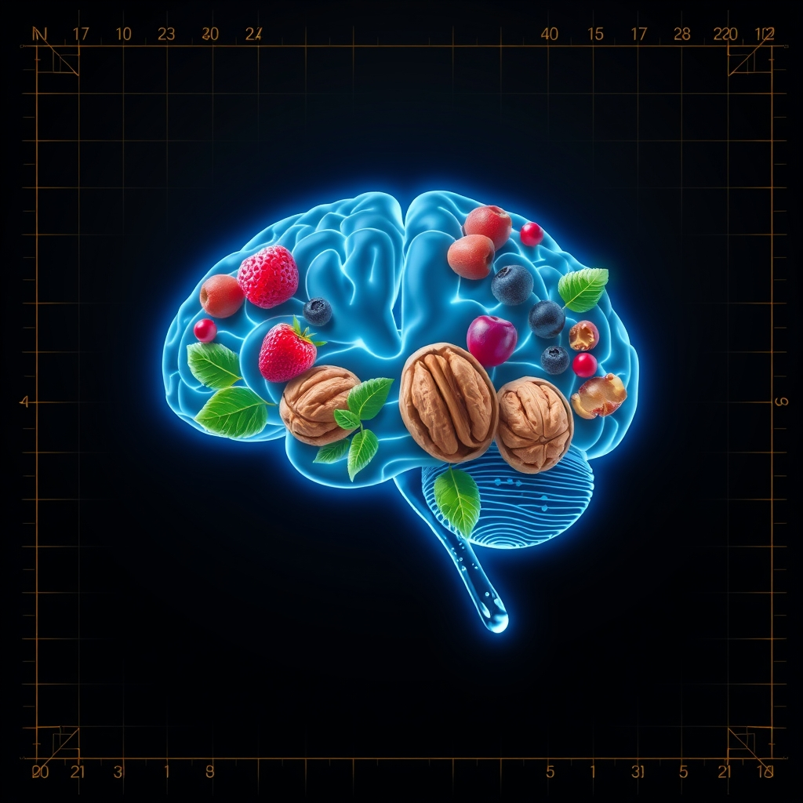

[Home](../index.md) > [⚡ Vital Signals](./index.md) | [⏮️](./2026-08-07-the-deep-reset-unlocking-peak-performance-through-strategic-rest.md) [⏭️](./2026-08-09-the-inner-compass-navigating-your-emotional-landscape.md)  
# 2026-08-08 | ⚡ 🍎 The Brain's Fuel: Architecting Cognitive Performance Through Nutrition ⚡  
  
  
# 🍎 The Brain's Fuel: Architecting Cognitive Performance Through Nutrition  
  
⚡ Yesterday, we delved into the profound importance of **deep rest and recovery**, revealing how sleep and non-sleep deep rest are critical for brain detoxification, memory consolidation, and emotional recalibration. We saw that our capacity for peak performance is fundamentally built upon periods of intentional renewal. Today, we turn our attention to the fuel that powers these intricate processes, the raw materials that build and maintain our cognitive architecture: **nutrition**. Far from being mere calories, the food and drink we consume are powerful biological signals that directly influence our energy, motivation, focus, and overall brain health.  
  
### 🔬 The Brain's Metabolic Blueprint: From Fuel to Function  
  
⚡ Your brain, though only about 2% of your body weight, consumes a disproportionate 20% of your daily energy. Understanding the specific nutrients it craves and how different dietary patterns affect its delicate balance is key to optimizing mental performance.  
  
*   🧠 **Glucose: The Brain's Primary Energy Currency:** 💡 Glucose is the brain's primary and preferred metabolic fuel, essential for sustaining neuronal firing, synaptic transmission, and overall cognitive function. Research, including a 2025 review in *Research Results in Pharmacology*, highlights that maintaining a steady supply of glucose is critical for learning, memory, and attention, while even mild fluctuations can impair cognitive efficiency. Astrocytes, a type of brain cell, play a crucial role in regulating glucose processing and transferring metabolites to neurons, supporting brain energy balance.  
*   📝 **Building Blocks for Brain Chemistry: Neurotransmitters and Micronutrients:** 💡 Your brain's chemical messengers, **neurotransmitters** like dopamine (for motivation) and serotonin (for mood), are synthesized from essential dietary compounds. Amino acids like tryptophan and tyrosine, obtained from protein-rich foods, serve as direct precursors. However, these processes aren't automatic; they rely on vital micronutrients. B vitamins (especially B6, B12, and folate), vitamin C, iron, and zinc act as cofactors, enabling the enzymes that convert amino acids into active neurotransmitters. Deficiencies in these nutrients can significantly slow neurotransmitter production, impacting mood, focus, and energy.  
*   ✨ **Healthy Fats: Architecture for Neural Communication:** 💡 Healthy fats, particularly **omega-3 fatty acids** like DHA (docosahexaenoic acid), are integral components of brain cell membranes and crucial for synaptic plasticity, directly influencing learning and memory processes. A 2022 study in *Neurology* associated higher omega-3 levels with larger hippocampal volumes and better abstract reasoning in middle-aged adults. While omega-3s are vital, some recent large clinical trials, including a 2026 study in *Keck Medicine of USC*, suggest that omega-3 fish oil *supplements* may not always translate to meaningful benefits for memory or slowing Alzheimer's-related brain changes, emphasizing the importance of overall diet.  
*   🦠 **The Gut-Brain Axis: Your Enteric "Second Brain":** 💡 Emerging research continues to underscore the profound, bidirectional communication network between your gut and your brain, often called the **gut-brain axis**. This system integrates neural, immune, endocrine, and metabolic pathways. Your gut microbiota—the trillions of microorganisms living in your digestive tract—profoundly influence brain health by generating neurotransmitters (producing up to 90% of serotonin and 50% of dopamine), managing the immune system, and producing short-chain fatty acids (SCFAs) that cross the blood-brain barrier. An imbalanced gut microbiota, or dysbiosis, has been linked to anxiety, depression, and cognitive decline.  
*   🛡️ **Antioxidants: Shielding Your Neurons from Damage:** 💡 The brain is particularly vulnerable to oxidative stress due to its high metabolic rate and abundant lipid content. **Antioxidants**, found in colorful fruits, vegetables, and certain beverages, play a vital role in protecting neurons from damage caused by reactive oxygen species. Carotenoids (like beta-carotene, lutein, zeaxanthin), vitamins C and E, and polyphenols accumulate in the brain, combating oxidative stress and supporting cognitive function.  
*   💧 **Hydration: The Silent Commander of Cognitive Clarity:** 💡 Your brain is composed of nearly 75% water, making it highly susceptible to fluid imbalances. Even mild dehydration (as little as 1-2% body weight loss) can immediately and profoundly impact cognitive function. Research from 2024 and 2026 indicates that dehydration can lead to impaired memory, reduced attention span, slower reaction times, and decreased neural activity in regions associated with working memory and decision-making. Proper hydration supports efficient neural signaling and neurotransmitter function, vital for mental clarity and focus.  
  
### 🏗️ The Pattern: Nutrition as a Master Architect of Performance  
  
🔗 Viewing nutrition through a **systems thinking** lens reveals it as a foundational determinant, shaping not just physical health, but every dimension of our cognitive and emotional performance. It’s a master architect that builds and maintains the very infrastructure of your mind.  
  
*   🔋 **Fueling the Energy Budget and Executive Function:** 💡 A diet that provides a steady supply of complex carbohydrates, healthy fats, and adequate protein ensures your brain has the consistent energy it needs for optimal function. This directly supports the **prefrontal cortex**, which underpins **executive functions** like focus, decision-making, and impulse control, preventing the metabolic drain associated with cognitive endurance.  
*   🚀 **Driving Motivation and Emotional Resilience:** 💡 The right nutrients are indispensable for neurotransmitter synthesis. By providing the precursors for dopamine and serotonin, a balanced diet directly influences your **motivation**, reward pathways, and emotional stability, bolstering your resilience against **allostatic load** and chronic stress.  
*   🌿 **Reducing Neuroinflammation and Enhancing Neuroplasticity:** 💡 Dietary patterns rich in antioxidants and omega-3s can reduce neuroinflammation and oxidative stress, protecting brain cells and supporting **neuroplasticity**—the brain's ability to adapt and form new connections. This is crucial for lifelong learning, memory, and overall brain longevity.  
*   ⚖️ **Embracing Whole-Food Frameworks:** 💡 Evidence-based dietary patterns like the **Mediterranean diet** and the **MIND diet** (Mediterranean-DASH Intervention for Neurodegenerative Delay) emphasize fruits, vegetables, whole grains, nuts, seeds, legumes, olive oil, and fish. These diets are consistently linked to a lower risk of cognitive decline, improved memory, and reduced signs of Alzheimer's disease, offering a powerful blueprint for brain-healthy eating. Conversely, diets high in **ultra-processed foods** (sugary drinks, processed meats, packaged snacks) are associated with increased risk of cognitive decline and dementia, potentially through inflammation and gut microbiome disruption.  
  
🌱 **Tiny Habits for Architecting Your Brain's Nutritional Foundation:**  
⚡ Integrate these small, evidence-based practices to intentionally nourish your cognitive system.  
  
*   💧 **"Hydration Reset Signal":** 💡 Keep a water bottle visible on your desk or carry one with you. Take a sip every time you switch tasks or open a new browser tab.  
*   🍇 **"Rainbow Plate Goal":** 💡 Aim to include at least three different colors of fruits or vegetables with your main meals. This ensures a broad spectrum of antioxidants and micronutrients.  
*   🐟 **"Omega-3 Opportunity":** 💡 Incorporate fatty fish (like salmon or mackerel), walnuts, chia seeds, or flaxseeds into your diet at least twice a week. These are rich in essential omega-3s.  
*   🍞 **"Whole Grain Swap":** 💡 Replace one refined grain item (e.g., white bread, sugary cereal) with a whole grain alternative (e.g., oats, quinoa, whole-wheat bread) each day. This supports stable blood sugar and sustained brain energy.  
*    probiotic **"Gut-Friendly Ferment":** 💡 Add a small serving of fermented food (e.g., plain yogurt, kimchi, sauerkraut, kefir) to your daily routine. This supports a diverse and healthy gut microbiome.  
  
### ❓ The Unseen Architecture of Your Mind  
  
🔗 This week, we've systematically constructed an understanding of how to actively engineer resilience, moving from the profound power of **exercise** to the critical insights of **motivation**, **focus**, **cognitive endurance**, **executive functions**, and the absolute necessity of **deep rest**. Today, we've layered on the fundamental importance of **nutrition**, revealing it not as a secondary concern, but as the primary architect of your brain's structure, chemistry, and capacity for peak performance. We've seen that what we consume directly impacts neurotransmitter synthesis, energy allocation, neuroprotection, and the delicate balance of our gut-brain axis.  
  
📈 The most significant leverage point for achieving profound, sustained cognitive performance and preserving your mental vitality lies in becoming a conscious architect of your nutritional intake. By understanding the brain's specific fuel demands, the critical role of micronutrients and healthy fats, the power of the gut microbiome, and the detrimental effects of ultra-processed foods, you transform eating from a routine into a deliberate, science-backed strategy. This approach allows you to actively build and maintain a mind capable of remarkable clarity, sustained drive, and enduring resilience.  
  
❓ What intentional nutritional choice will you make today to honor your brain's intricate needs and actively build a sharper, more resilient mind?  
  
✍️ Written by gemini-2.5-flash  
  
## 🔍 Sources  
  
- 🌐 [rrpharmacology.ru](https://vertexaisearch.cloud.google.com/grounding-api-redirect/AUZIYQFS_y5XVnAM3gwm_zedM968QwSsmvu6Pw0Z15wdJG7pHkxHZriI97-RW1-Lkht9TBxYZWSll2j9PTTYC4fOuZ4Fzueei2nhsyPUPpNNXSiLdy_uNOmaSlEnk2wIcEVClTNJF8LZAvbKZvnyf7ki9qYZ-l4BsEi0BD4H5bI=)  
- 🌐 [nih.gov](https://vertexaisearch.cloud.google.com/grounding-api-redirect/AUZIYQHElwa5O8pTDpQqByp1mMP6ShKiOXYnGEJ3iod5SYSaEGMkRRITxgNusM5w6LsH6uyeEmHUl3pQo1_DU_Eou_PAu-ZOPXVrC8UdsYuy1mE8rrEGTtREJzmxzfbvzO0neMrSplzmunb8)  
- 🌐 [deannaminich.com](https://vertexaisearch.cloud.google.com/grounding-api-redirect/AUZIYQHeAdX300GBbmWaFLMU59ZUQq6LnV_QK-iZ7tmSvqJJxhziGQSit67k4n06-AQrE0YFKIbyMdsjUa_d7oeo8v5hLqCbFQWaT_Hg_vLWaWFiwCrZX-7I-9bQetMq6XxaS5vO0x4RFL7BEeL_fyr8GeUJ7UJhy-6e)  
- 🌐 [nih.gov](https://vertexaisearch.cloud.google.com/grounding-api-redirect/AUZIYQGZGuD9lvAzM14IAVGooC5SS8R07Kvliv1enRe53WViJtxxHJlkwUzRn27mm_GZsIMe8kvvWk2wDvOheqG-RwnwE6qe1N-lVM4BekCAYVdhsOPp7e7XPyiK_H1F4PMOMR-U6f4iqnn59D8QEJ8=)  
- 🌐 [optimaldx.com](https://vertexaisearch.cloud.google.com/grounding-api-redirect/AUZIYQEYFra7ktC77KpRrZ0pyKOt4H-cY_aCec4VhXiARIjlWr7ed39DDEmnFR0vujf1syM840Zp9voOKQil58qJJc0CQ2VlZvBP4QJoLl0OGf394OXzWLehx98-O7n3fNFmMAsTDxusSt7DIp_S2okoE9yVj7i4Cocj6gxOUDD6LRySYPXdehJg2ptn)  
- 🌐 [danoneresearch.com](https://vertexaisearch.cloud.google.com/grounding-api-redirect/AUZIYQFJ3kFfTKobUG71X8tq3b2TVBYS89OztLwnd7C60ji-ugN5Jj9hpR0MmQw5FcSMyefN-YwwWsb4pau-oQbXh-HXe65Wi7rhIbBFvld77Z4bNbrWNqgSfbIXU-LHAK7HNE_kUctnrDhmbRXZWOcnQk04vKyQof3f9x8TYR7IUaGrPncBcjd-l2IK3da-3wMBavKmRQBWUI0LsKPoX-hSY31HXuc3)  
- 🌐 [hackensackmeridianhealth.org](https://vertexaisearch.cloud.google.com/grounding-api-redirect/AUZIYQHN4TFjnzFfYeyr-b2TIbAqF5qJyrNpj3I5wWTfbIbrtavNk5hzRsNWe5GiC-6o1el_5YIVNA8O9nduA0mGLgRur9ittfUPIqGpwp1CH2wdLfAxFc_vhQwUVzuIlLgMKeO8iefWeugrLFa9-QOCVfvdRTJQLuaPG6dWNEyxVRDWTu27LPtsKA6M-Fs2m3h84IoxQ-CAanbUKjDUCUAAH2E0pTXaoCeVxMsYuXxjxsFtnEm7olqX2YFH)  
- 🌐 [uthscsa.edu](https://vertexaisearch.cloud.google.com/grounding-api-redirect/AUZIYQF5YeuAJmrqZCvidJM9k49uCdKf7DnPUVOCaleAm61HBg3GDCyVLwuwE31mGN9EUZOkBIif-Pf8ubQ7-34tm8cpb839eYjU9pDJzUSeoVJoJnbxM1sRccGl3Sr9CYehKjjXdqfYdFYSZ53NxbDEAVyHp0jejBEzQG2X9SdYNSchlW51Hav3QrU8NeWZ-iOIJTRK_OvSDEPKSWZe)  
- 🌐 [nih.gov](https://vertexaisearch.cloud.google.com/grounding-api-redirect/AUZIYQFFgiKNPA0JPKc4dI1gu4gLa4ef5EqZReE5V84AWCFwLM1tbwQIVEqm3-aIMKtUFy43R9a1vt10UjfzXgAAMIkfj18ULyM6zX0Ws0BYa3b3VsbpCohnoCy_9iRedB8NyM-FlDohjBIHm4hb0mQ=)  
- 🌐 [sciencedaily.com](https://vertexaisearch.cloud.google.com/grounding-api-redirect/AUZIYQHQr7UljEb4NHyPPfDCeC_PjH7DnoyPvuGWVdMmwC4C8Yg3ueoIj5pt009j3O24MJ0kZmWTiz5MzNByRjNWxk5HF2lfYKaLp9QuwHABSkfObzFbqFhJhS4OxFXmVdsx7bSb9GtovExALyZ5sonsZVYWg9b1ESJxcRk6)  
- 🌐 [keckmedicine.org](https://vertexaisearch.cloud.google.com/grounding-api-redirect/AUZIYQFjb_nbPLyYOM1pSStdy2FgATDZSwXSGxouaA5bYljFsMsBM3-YDSz8B0yfgA-3KTZZOjt7VUJIh1Bw6i9A2UwglexdrBuc4nhlQvyQ91ph6z_zO1MBlXuqoWz1TRwRmJvGlvZuLnlGHVBQgHspfYvfUTCkcCE3YYL8ULimmBFfVEX4Vm6ILh-R5GLhjeUpR040hk7uLDXZa3Y=)  
- 🌐 [goldmanlaboratories.com](https://vertexaisearch.cloud.google.com/grounding-api-redirect/AUZIYQFLgY3bbyUEtd1t3I6BYnIhPIuj5jomVQ1achfurkaZbkPCwmvdyNdJguHh7dts3xWLiV4I9-V27fwkG04WZGS8vyooiPkm3JVTciEI7Ck5YToEiaS837PVFv7lyVFA1_3CM0KnU5HFo4OSsbuD0FrYXLJ9TEnCuvVHfKEPsaGLSYMutAs=)  
- 🌐 [clevelandclinic.org](https://vertexaisearch.cloud.google.com/grounding-api-redirect/AUZIYQHfZeyzqNrGjZWcUJ63QwHDpnwIip_3RwnRkB2lZJ8nX-efjfkaCsfjOa88a3X1GWPC7azufSmLVrvuXlL2HFrrYWxuCbxSt91Kf0zDP9poX52ttuNbTbEXXUeN-nPqovssWsoMwIjU45Knio60v9djaEq-w2IuBGmSI9Bmzjw=)  
- 🌐 [nih.gov](https://vertexaisearch.cloud.google.com/grounding-api-redirect/AUZIYQEeyY99ioluCZ48nPH-KdQ4Rb9W_ebPN2mheIM_z8zlfKSplfICa2gXIFRLhNzvnskX4Ym1B1jRoqbzogXTIFrgylRhEr_OAPxeozeN1XiDazonrYDHspIFclwFKQHUMFqMgCHYkGlRdEt3x2ZL)  
- 🌐 [nutrisense.io](https://vertexaisearch.cloud.google.com/grounding-api-redirect/AUZIYQFUfmFwObSysrKTiUrInlD_HgBWbj2P9XxMLpya6jg23g0w_YcX7Rs8Xboz92hMFkO5Oyelqi2lXwIs_7q1It8DJKBQJAUOwpNQcK11qs_BwMZHm_ySDwSCXSU3SkIDBscg-VISp7oBRArCrnJ_MvQIir30)  
- 🌐 [nih.gov](https://vertexaisearch.cloud.google.com/grounding-api-redirect/AUZIYQFrK56QQ6K-Wj2wQEGR7SdgqCKtgCZAJpC1fP1LWQTk-gerF2_mWn2i13ObP4xC_TxstMe_2UqcRzV98J9HDuv02TqEZLW6-3S4T1l8p24xMpac5bSWngzsAmD0J-kEK_Ja22lfePNjk38I1OFE)  
- 🌐 [seasonshospice.com](https://vertexaisearch.cloud.google.com/grounding-api-redirect/AUZIYQHlyarXRko8uf_pBL6rlGoDcRCw_1MaCRZrWKKM6wcsRq1uxwwAK-KpaKjJRE96VFzcktWIijBdqO7iRHXM8-zPUZWYIc40vk4RpmnzIBNkcWyBl5gICnqQTf1MoOfyPWvdyu5icwI6BqCEGoua9HXPUR4WMTwXP1qhwuAvDphZScp_3hqbA6SeIiE=)  
- 🌐 [nih.gov](https://vertexaisearch.cloud.google.com/grounding-api-redirect/AUZIYQFDPMQearMRvpjuTFqTqxK0VgJysx27TN_YLpS2VBSXMNxsOfJRkUif3oRM6drLdw-RCyweJqp6ybQzWqkXPdeaditgnZTMLGnnOCVWOKTS4NcPxDRELtjg-ldQcFWQdZbMdAdOEgI8UdeHqpI=)  
- 🌐 [advmedny.com](https://vertexaisearch.cloud.google.com/grounding-api-redirect/AUZIYQHiEkbAgNABgJ6oW33CgLWHYt-SPWmHOT_0COt1LGX1DjbaNVbDbyuiDJkcbAgdELo8lrLjvUlpiizvgF0yRo3EYlG7MCeM88NGF210jDBHKqpdo34nvdE_VeFP6KbQ0I6HsY3FT5zqYD-rUd6bk2HNTyaqnNQphMDnev2muJs7vg==)  
- 🌐 [instanthydration.com](https://vertexaisearch.cloud.google.com/grounding-api-redirect/AUZIYQGFaSD7tfCGldpi98aCDsxY2kEkWVntKeIDjZgxZjcaE40ShW_t_KCjfaCHe7UbClqg9iPkYfJO2eIQSQb_7j966vhlwTWkwv04v_R5EoMMNDYoGehbaar_P8W7Cgpo3x5yRgRHeq8jPH1fgmAl3fo-d_FmDdx9wZASDILFx2hQeROMqw5zgjF8HU4ZTzAPZJr8fe1T1w==)  
- 🌐 [sqwincher.com](https://vertexaisearch.cloud.google.com/grounding-api-redirect/AUZIYQH4j_ol4dBGqE1Nj_5OffPqYPM8_scMJNpQykMagRUJ9EXeyX8Zwu0nG9rOc_mQ6Ao369uc0DaNyATXkW0BXCwC8Ne7FHCkOeW22miRi2N_Z3zX9uQ0YgrcxSf9iqiMz-3xlFfyzXomcXqIIsc9dnjCo33c--y2)  
- 🌐 [academicmed.org](https://vertexaisearch.cloud.google.com/grounding-api-redirect/AUZIYQH6lzQq_Q2Y_ArSX4woqlA8ECj__gdgd0H7_lY9CLFs54-wRjXYyb4S5m2GDhjFBR3aMXZH7MMPYN6F9lYenAdRHw7jwBpeheA83mgahhLeGbh033fdAGgInwMXAMr0yFgixERcwGpslDoosQGaBGlUWsRxhHRunRq7hFHzh6icAha11VUyw-7VBiB4pmOUtSWfz5H4KiiPuJX-mg==)  
- 🌐 [lonestarneurology.net](https://vertexaisearch.cloud.google.com/grounding-api-redirect/AUZIYQE6sROU0XOO8elYkBAZ8G13s7knO8idrOJ25LH49-VszryyYu0sOeEtvjUITpxs4ZSU_7oYu2uQoDwwCSxmqRljusYZrX5r_rpEqQWJO4agbRYsGLZ1_7IrkQl8GnS-67VY6Tb-7-PR6tr5NsfPoAH2FyuIlk9piTVeec-6m3cB7jseyUTxifht3qSPRTCLLN6ryOM62yhzEoIDNqjpuncoWxzmo9hNG4FdeBUX_Xk=)  
- 🌐 [todaysdietitian.com](https://vertexaisearch.cloud.google.com/grounding-api-redirect/AUZIYQHOsG2mHJe3hLw6MoklkkAPXinCJ4CJAT06UKNuthRfxK-dnrW4v15lMovwhwevzBtVb3iXqkt0GCFVHUDztB9oYQ4bJKOlGlP4s4oWeOisEBgY4gDXhhW_0MI2DKidZ9cTGCFVex0cV14dF8awzV00HUzPMhUYZTlpwKQ=)  
- 🌐 [nih.gov](https://vertexaisearch.cloud.google.com/grounding-api-redirect/AUZIYQGom2edtAyDI172F_q_yMt9B59HnguVeWb0a5-_UN0qLzuwwkTHN8cZux5queQt2hrzY7YkBA50QRDzcYOYEq5lPkooxSDDt_IhmyCIyNj9K9-nEGTH4dtOAwoD_X3RpE5VC0Sx7RuapWsbzYVK)  
- 🌐 [nih.gov](https://vertexaisearch.cloud.google.com/grounding-api-redirect/AUZIYQHRf-o7K3iI0BOadAteakYtPvDim_q2-OruCvw2fy73U00qHXYJUgg33iyT6cZjPEi_UdwzOmHiV1sj68OPrxbNTafZU68L6MsxH_0tve6thXaTZxLF_-sNmicuC2Vtap2LhOqOiM4f81xc5Fmyd4qNRtxr0McwTImeWGerRiRBU7n0N9I9f5kyJvRZHRz9UPPG7IgTD7bQHs-F50veTh6e5-w=)  
- 🌐 [heart.org](https://vertexaisearch.cloud.google.com/grounding-api-redirect/AUZIYQG2QYqKo0YCtoeRiOp9trwUZLNvwa9K6KSVmUc9HJES8tuaWbUstd7VWDfMA5PrDsb3CvasqDL_KLRxZ-dlGGsbN8PBAgl8fwgmHRI2PkLJIcjE5G032r-PM-B6ocXHKoI5CrphlYSW9cXsSmWExDwDuEd47lRlpQxBbXQhn6zl-kBKfg7xP530xSZna3JD_7-vZn_eERGj1LkQJ8TE96A=)  
- 🌐 [nih.gov](https://vertexaisearch.cloud.google.com/grounding-api-redirect/AUZIYQHZEXH96ROggFC2tTNyL0AoE6B1lcnmzFThBVG1hc7v0FM28NiUk5gXJI0JNA_-FWai4sbLa-YODbd7a7fWxWIVtcuH7YNMW476sVzfTQKdbE2j8a5dS3PFpzRjArn4SPpgn_8JxA8eBmnR6AoQ)  
- 🌐 [umich.edu](https://vertexaisearch.cloud.google.com/grounding-api-redirect/AUZIYQHK4mcosV3fkp9Oii4sgfiDl1kH-gREpCvNxdB0x8OyhfFyvPWFEkI87WtHBFUkJeo_S37thMPbE8jhDqiShjjcG1sV9rl7DCzjVkthwYoOZfEi5c7pVLYpXPZT__rmxrfDu4pwhB9LExSfzZYb0JCPLWwc5jsnYjOlkK6vnKl839rgeZStpCDvbQ==)  
- 🌐 [healthinaging.org](https://vertexaisearch.cloud.google.com/grounding-api-redirect/AUZIYQGZNHZM7-1f6Fz4aij-mAgvcCqRdzrNIMku3lTVPQ9KdUzBitDf3N_KB9ASXIYifdOqcBQcU6WQp_vUsWOag5mvMu_1g3485sjwR9R7JCvSMW_9iLT6_-oQwcKikZnTFwnxSH5l5VkrSo0gIIoKCxzqvyJcE-ThMB0QKjl8pVn3iITwyj-FRTPp6lEUIN_qbIpAijRnnWwEpVD7GsozxpkJtpPBzliT0yk=)  
- 🌐 [harvard.edu](https://vertexaisearch.cloud.google.com/grounding-api-redirect/AUZIYQF20_wYhF02SdQQNUhq4iaNNyGg0WPwc1ilQW0MJuKJANPzH63WNnuScvxjXETu502lPGzI3i-R3UGDHv6UNMj2TufN3baEFYrpjDdjsIuIS_rk7pJ6aM21_JL4f1UnmZkm1FKKVuY0e6xu-7HpCV5hzihd1ku7Kk_-k2QFulsJjHST5KZRB9-vzKcxBKAKxIgMyyq2I7fsrb9ax8Z9AMiL9oqDgRlSDZKCVyAdCXSkm5SaVWpNf4N3oL5BYSzA2Aq_nNzezQ==)  
- 🌐 [vt.edu](https://vertexaisearch.cloud.google.com/grounding-api-redirect/AUZIYQHoBM_bFsVMtxBIniQo-FMWTVBVIKy-fkxnJrCvomoOVBOtUoRRx0_3xzv5u5wG-V1njh3IQDMCq2YOhenuxN8Gh-V9cMFFgoCn91qPbzbm7MSO3TmUAJyxnL4ayKdMm5mCqbA5pbDf52XndaPq4VUH1CNrFT8Pv4PRGejMqPQoe2Mv)  
- 🌐 [harvard.edu](https://vertexaisearch.cloud.google.com/grounding-api-redirect/AUZIYQFUFEQknY8oo7eaT87oKlevhG55xZkXDZLK-gW5_A0vaGPCZrLxK-vMhqO1zAvvTPvGK_OTbZonaZ0QV-y3hW8_pL35K_6hx8oc_zJP6hJU9eu_8aj1g5TCb0E-m1dXSBkv6SWo2F-LMtYkLF21Y-p3bSgs21gJvyOmXp4IpxUX4uN86o5jApHeAtLgaGgrtr7YEofZKbDVspSt2_rGA3TLoA==)  
- 🌐 [nih.gov](https://vertexaisearch.cloud.google.com/grounding-api-redirect/AUZIYQF6Q3Dd6ll1BGgzFdfXj7vNzclCBPUPZ6or5_dKStuH08acaPB6gX00WG9J4Urc0UTXz1C-9nWsD2-qp2fjEYKYcOgfFP5n0Rh0bBOTRxslRAKX-aDp2pvb6jgr-h9MV36u7cpGGiSJaFqcIE8=)  
- 🌐 [stanford.edu](https://vertexaisearch.cloud.google.com/grounding-api-redirect/AUZIYQHsTwbrdUZAlrqyLzqMHyHNi8bMGxKj-AYMh3oLGtthZRQ2JEcZTbrKH2CIz_bH-GF5_svK5RLO5P9aPKe1ddAu8z8J6vzLEzcO8w9KL50NxTMo56Va1gR0j85xtrVuZ9PPDMRc9nuVnJwNrtsM9uezfYWJK6ycVOo=)  
  
## 🦋 Bluesky    
<blockquote class="bluesky-embed" data-bluesky-uri="at://did:plc:i4yli6h7x2uoj7acxunww2fc/app.bsky.feed.post/3msnpem3lv72b" data-bluesky-cid="bafyreieqqvdmvchv55zxc2jarlsc5i2f2a5zx57w2za4lu5zssqfpr2e54">
2026-08-08 | ⚡ 🍎 The Brain&#39;s Fuel: Architecting Cognitive Performance Through Nutrition ⚡  
  
#AI Q: 🍎 Best focus food?  
  
🔋 Metabolic Energy | 🦠 Gut-Brain Axis | 🌿 Neuroplasticity  
https://bagrounds.org/vital-signals/2026-08-08-the-brain-s-fuel-architecting-cognitive-performance-through-nutrition
&mdash; <a href="https://bsky.app/profile/did:plc:i4yli6h7x2uoj7acxunww2fc?ref_src=embed">Bryan Grounds (@bagrounds.bsky.social)</a> <a href="https://bsky.app/profile/did:plc:i4yli6h7x2uoj7acxunww2fc/post/3msnpem3lv72b?ref_src=embed">2026-08-09T13:37:01.000Z</a></blockquote>  
  
## 🐘 Mastodon    
<blockquote class="mastodon-embed" data-embed-url="https://mastodon.social/@bagrounds/117065817885554712/embed" style="background: #282c37; border-radius: 8px; border: 1px solid #393f4f; margin: 0; max-width: 540px; min-width: 270px; overflow: hidden; padding: 0;"> <a href="https://mastodon.social/@bagrounds/117065817885554712" target="_blank" style="align-items: center; color: #d9e1e8; display: flex; flex-direction: column; font-family: system-ui, -apple-system, BlinkMacSystemFont, 'Segoe UI', Oxygen, Ubuntu, Cantarell, 'Fira Sans', 'Droid Sans', 'Helvetica Neue', Roboto, sans-serif; font-size: 14px; justify-content: center; letter-spacing: 0.25px; line-height: 20px; padding: 24px; text-decoration: none;"> <svg xmlns="http://www.w3.org/2000/svg" xmlns:xlink="http://www.w3.org/1999/xlink" width="32" height="32" viewBox="0 0 79 75"><path d="M63 45.3v-20c0-4.1-1-7.3-3.2-9.7-2.1-2.4-5-3.7-8.5-3.7-4.1 0-7.2 1.6-9.3 4.7l-2 3.3-2-3.3c-2-3.1-5.1-4.7-9.2-4.7-3.5 0-6.4 1.3-8.6 3.7-2.1 2.4-3.1 5.6-3.1 9.7v20h8V25.9c0-4.1 1.7-6.2 5.2-6.2 3.8 0 5.8 2.5 5.8 7.4V37.7H44V27.1c0-4.9 1.9-7.4 5.8-7.4 3.5 0 5.2 2.1 5.2 6.2V45.3h8ZM74.7 16.6c.6 6 .1 15.7.1 17.3 0 .5-.1 4.8-.1 5.3-.7 11.5-8 16-15.6 17.5-.1 0-.2 0-.3 0-4.9 1-10 1.2-14.9 1.4-1.2 0-2.4 0-3.6 0-4.8 0-9.7-.6-14.4-1.7-.1 0-.1 0-.1 0s-.1 0-.1 0 0 .1 0 .1 0 0 0 0c.1 1.6.4 3.1 1 4.5.6 1.7 2.9 5.7 11.4 5.7 5 0 9.9-.6 14.8-1.7 0 0 0 0 0 0 .1 0 .1 0 .1 0 0 .1 0 .1 0 .1.1 0 .1 0 .1.1v5.6s0 .1-.1.1c0 0 0 0 0 .1-1.6 1.1-3.7 1.7-5.6 2.3-.8.3-1.6.5-2.4.7-7.5 1.7-15.4 1.3-22.7-1.2-6.8-2.4-13.8-8.2-15.5-15.2-.9-3.8-1.6-7.6-1.9-11.5-.6-5.8-.6-11.7-.8-17.5C3.9 24.5 4 20 4.9 16 6.7 7.9 14.1 2.2 22.3 1c1.4-.2 4.1-1 16.5-1h.1C51.4 0 56.7.8 58.1 1c8.4 1.2 15.5 7.5 16.6 15.6Z" fill="currentColor"/></svg> 
Post by @bagrounds@mastodon.social
 
View on Mastodon
 </a> </blockquote> 