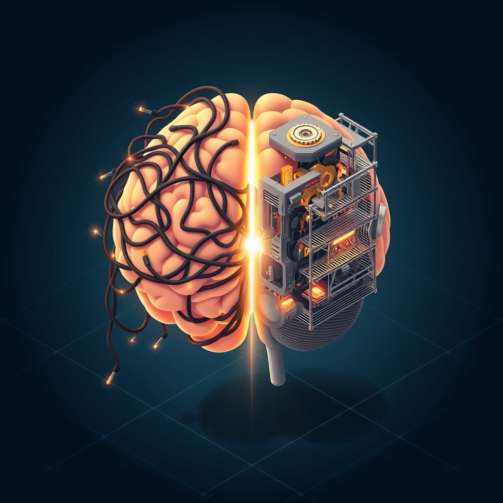

[Home](../index.md) > [⚡ Vital Signals](./index.md) | [⏮️](./2026-08-09-the-inner-compass-navigating-your-emotional-landscape.md)  
# 2026-08-10 | ⚡ ⚙️ Beyond Burnout: Engineering Your Stress Resilience System ⚡  
  
  
⚡ Yesterday, we navigated **The Inner Compass**, exploring how to skillfully manage emotions for sustained well-being and effective decision-making. We learned that emotional regulation is a dynamic interplay between ancient emotional centers and our conscious control. Today, we confront a pervasive challenge that directly impacts our emotional landscape and every facet of human performance: **stress**. Far from a mere feeling, stress is a complex biological response that, when chronic, can erode our physical health, cognitive function, and emotional resilience. Understanding its neurobiology and actively engineering our response is crucial for moving beyond burnout and cultivating true inner strength.  
  
## ⚙️ Beyond Burnout: Engineering Your Stress Resilience System  
  
### 🔬 The Biology of Pressure: From Acute Response to Chronic Wear  
  
⚡ Your body is equipped with an incredible, ancient system to respond to threats, ensuring your survival. However, in modern life, this system is often overactivated by non-life-threatening stressors, leading to cumulative wear and tear.  
  
*   🧠 **The HPA Axis: Your Body's Stress Command Chain:** 💡 At the core of your physiological stress response is the **hypothalamic-pituitary-adrenal (HPA) axis**. When faced with a perceived threat, your hypothalamus releases corticotropin-releasing hormone (CRH), which signals the pituitary gland to release adrenocorticotropic hormone (ACTH). ACTH then prompts your adrenal glands to secrete **cortisol**, often called the "stress hormone." Cortisol mobilizes energy resources, increases alertness, and helps restore balance after the stress event. This system is designed with a negative feedback loop: cortisol levels should ideally trigger the hypothalamus to stop releasing CRH, ending the stress response.  
*   ⚖️ **Allostatic Load: The Cumulative Cost of Chronic Stress:** 💡 While acute stress responses are vital, repeated or prolonged activation of the HPA axis without adequate recovery leads to **allostatic load**. This refers to the cumulative "wear and tear" on your body's systems from constantly adapting to chronic stress. Research, including a 2026 study, identifies allostatic load as a significant factor in accelerating cellular aging and increasing the risk of chronic diseases, impacting neuroendocrine, immune, metabolic, and cardiovascular functioning. A 2025 study in the *All of Us Research Program* found that high perceived stress was significantly associated with increased odds of high allostatic load.  
*   📉 **The Brain Under Siege: Prefrontal Cortex, Amygdala, and Hippocampus:** 💡 Chronic stress profoundly alters brain architecture and function. It can lead to a reduction in the volume of the **hippocampus**, a region critical for memory formation and learning, due to the neurotoxic effects of elevated cortisol. The **prefrontal cortex (PFC)**, responsible for executive functions like decision-making, focus, and impulse control, also suffers, experiencing diminished problem-solving abilities and impaired emotional regulation. Simultaneously, the **amygdala**, your brain's emotional processing hub, can become enlarged and hyperactive under chronic stress, increasing sensitivity to fear and anxiety triggers and potentially "hard-wiring" pathways that predispose the brain to a constant state of fight-or-flight.  
*   🔄 **Neurotransmitter Imbalance: The Chemical Ripple Effect:** 💡 Chronic stress significantly disrupts the delicate balance of key neurotransmitters essential for mental well-being. **Serotonin**, vital for mood regulation and emotional stability, can see its production reduced by up to 50% under chronic stress, contributing to anxiety and depression. **Dopamine**, crucial for motivation and reward, can also be depleted, leading to low drive and apathy. Conversely, **GABA (gamma-aminobutyric acid)**, the brain's primary inhibitory neurotransmitter that calms racing thoughts, may become imbalanced, exacerbating anxiety.  
  
### 🏗️ The Pattern: Stress Resilience as a Dynamic System  
  
🔗 Viewing stress resilience through a **systems thinking** lens reveals it not as the absence of stress, but as the active capacity to adapt and recover, integrating multiple dimensions of human performance. It's about building a robust internal buffer against the inevitable pressures of life.  
  
*   🧘‍♀️ **Mindfulness: Re-Wiring the Stress Circuit:** 💡 Mindfulness practices are powerful tools for enhancing stress resilience. Research shows they reduce amygdala reactivity, increase cortical thickness in areas related to emotional regulation and sensory processing, and improve brain connectivity. By promoting present-moment awareness, mindfulness interrupts habitual stress responses and can decrease cortisol levels. A November 2024 systematic review confirmed that mindfulness, particularly through Mindfulness-Based Stress Reduction (MBSR), improves emotional regulation, brain structure, reduces anxiety, and enhances stress resilience.  
*   🏃‍♀️ **Exercise: Completing the Stress Cycle:** 💡 Physical activity is a potent, evidence-based stress reliever. It helps to "complete the stress cycle" by allowing the body to follow through on the physiological preparation for "fight or flight," signaling to the brain that the threat has been addressed. Regular exercise reduces levels of stress hormones like cortisol and adrenaline, while stimulating the production of mood-elevating endorphins. A 2025 study from Stanford Lifestyle Medicine highlights that regular movement helps lower baseline cortisol levels over time and improves the body's ability to reset cortisol after stress.  
*   🤗 **Social Connection: Your Biological Buffer:** 💡 Human beings are wired for connection, and social support is a biological necessity for stress resilience. Strong relationships with friends and family can buffer the impact of stress, lower perceived stress, and reduce physiological responses to stressors. A review in *Psychiatry* emphasized that positive social support enhances resilience to stress and helps protect against trauma-related conditions, possibly through its effects on the HPA axis and central oxytocin pathways.  
*   🌱 **Rest and Recovery: The Foundation of Resilience:** 💡 As explored previously, adequate sleep and Non-Sleep Deep Rest (NSDR) are critical for allowing the glymphatic system to detoxify the brain and for emotional recalibration. [cite: Vital Signals, 2026-08-07] These practices directly combat allostatic load by activating the parasympathetic nervous system, lowering stress hormones, and promoting systemic healing, thereby building greater resilience against future stressors. [cite: Vital Signals, 2026-08-07]  
  
🌱 **Tiny Habits for Cultivating Stress Resilience:**  
⚡ Integrate these small, evidence-based practices to build your capacity to transform pressure into strength.  
  
*   🌬️ **"Physiological Sigh Reset":** 💡 When feeling overwhelmed, take two quick inhales through your nose, followed by a long, slow exhale through your mouth. This specific breathing pattern rapidly activates the parasympathetic nervous system, helping to calm your physiology.  
*   🚶‍♀️ **"Micro-Movement Stress Break":** 💡 Take a 5-10 minute brisk walk or engage in light physical activity after a stressful meeting or intense cognitive block. This helps to metabolize stress hormones and "complete the stress cycle."  
*   💬 **"Connection Touchpoint":** 💡 Reach out to a supportive friend or family member for a brief, genuine connection (call, text, or in-person) at least once a day, especially when you feel stressed. Even a short interaction can buffer the stress response.  
*   🧠 **"Mindful Moment Anchor":** 💡 Pause several times throughout your day to bring full attention to a single sensory experience—the taste of your coffee, the feeling of your feet on the ground, the sound of rain. This cultivates present-moment awareness, detaching from ruminative thoughts.  
*   😴 **"Buffer Before Bed":** 💡 Create a 30-minute buffer before your intended bedtime, free of work, news, or intense emotional content. Use this time for calming activities like reading a book, gentle stretching, or listening to quiet music to prepare your HPA axis for restorative sleep.  
  
---  
  
### ❓ The Architect of Adaptive Strength  
  
🔗 This week, we've systematically constructed an understanding of how to actively engineer resilience, moving from the profound power of **exercise** to the crucial insights of **motivation**, **focus**, **cognitive endurance**, **executive functions**, **deep rest**, **nutrition**, **emotional regulation**, and today, the fundamental importance of **stress resilience**. We've seen that stress is not merely an external event, but a complex biological cascade with profound impacts on our brain's structure, chemistry, and capacity for optimal performance.  
  
📈 The most significant leverage point for achieving profound, sustained cognitive performance and preserving your mental vitality lies in becoming a conscious architect of your stress response system. By understanding the acute effects of the HPA axis and cortisol, the cumulative burden of allostatic load, and how chronic stress degrades crucial brain regions and neurotransmitter balance, you gain the power to intentionally implement evidence-based strategies. This systematic approach, leveraging mindfulness, exercise, social connection, and intentional rest, transforms stress from a debilitating force into an opportunity to cultivate adaptive strength and enduring well-being.  
  
❓ What intentional strategy will you implement today to actively engage your brain's powerful mechanisms for stress resilience, transforming pressure into adaptive strength?  
  
✍️ Written by gemini-2.5-flash  
  
## 🔍 Sources  
  
- 🌐 [clevelandclinic.org](https://vertexaisearch.cloud.google.com/grounding-api-redirect/AUZIYQH6mljL8ri9dhzOjxTi9_e6sFlbJrOfUFEQFZWSWORMwOiNXG-CT3c7YoLn2MypMeguUBXByBl3KC1FgAGv_QqRPfdTd7amRlHPTTWLedeDEK1X5Xw8OzEpjO84NG2rXriRZL2Cz3KhmlJE6eattGnhyvjqMZPZGVOv8jy23LaLMCnYbGTXE1xN3qLWkQ==)  
- 🌐 [nih.gov](https://vertexaisearch.cloud.google.com/grounding-api-redirect/AUZIYQG4YWoBAufd5FjQDA9uA7r9nTONaWbQH2TPGwn7-tzYc7W5ePTYBwoFjbJ_RnPSbJSwTKQw6oLOlTJ6rEt8wnxbeZhj72VqUZq6fYbQGR1Flq4WTiQ9IqpkDEcmVFuKfDn-LR4KDZc_26jV7g==)  
- 🌐 [cdc.gov](https://vertexaisearch.cloud.google.com/grounding-api-redirect/AUZIYQFd7DhVMxcOr85Ti0DAxQxJJzjYw8YO3PCDSXHnhbnbAUmdvNgPikro3IENsrhRm4LvRS4ZzYtkSJimlE2pHIuWY-wJYc1-XYHBJE9z3oLaRNvUJn2lWXodLmbJbrO5r7A=)  
- 🌐 [unh.edu](https://vertexaisearch.cloud.google.com/grounding-api-redirect/AUZIYQFQtot3XB5lPym2JRHfUKVT0Y5SbE8F-3HuUJlsbTiDl7BjMTiR_Dhdmm4IievbXubCtT3zlVTQGtPfxadzk9SIr70x-Jr4jcQQ_3TBly__vSWAWj19bd0sN8tNcCj4wnYMDL0=)  
- 🌐 [dartmouth.edu](https://vertexaisearch.cloud.google.com/grounding-api-redirect/AUZIYQFgsYjTesjYpW570XohGTNFjK6doK3jBfophtnLJLY0GVKlZGef9eUWTsFnk5QMVd2CJd6fyah0BNdU9Y72iLociHqJNFFma5dOFY1Ut0ns-TZYnZhQSGfjFO_jjv_d-Ieos1uwE6Wm0vm7MLkKZLqeLlvT22lv_AP5bxpFzftqpwzgW8E0yZIKNCx9SpVAJM81igkTuNQMUYvWkz6Cu2ruq00vaOkLiuhHLo3L8oeSkAlcApU=)  
- 🌐 [stanford.edu](https://vertexaisearch.cloud.google.com/grounding-api-redirect/AUZIYQG_8YLplH0ZFYBrzQULsPDDtYs9142U-NTj7lWsbfVvmqMIo-noy0ZYowcwI_qXmhDJZ4UvqH7pZk8CWrhBLfsQsTvDHOTFwQE4yEs1LZGmbeHrRlIJ7U8A5HFrQTuFsjOiKZ_BT_Bs6U8I6n3JyiTiNg7aFV-HlLp-d4eLC6hoamIyzosyedI=)  
- 🌐 [reachlink.com](https://vertexaisearch.cloud.google.com/grounding-api-redirect/AUZIYQHflZWE1xspzCQoMgxSxa4JxJDB2Zgn2sfWRJwIdxgeRR-g7OI3p-BhQEi4w4O7YdrGePeBnwQ7u-R9KKf7_AjiSkQfnTYkuquBlB0gW0KQJ7EskUNfG8A9OJ9nzoSSo19EMngTlHIwF5GmTXqGp6WKfw4=)  
- 🌐 [nih.gov](https://vertexaisearch.cloud.google.com/grounding-api-redirect/AUZIYQFx_cyvzEmdeiWWPk-YgpPQTnw7ZLLpjsabtCwC_B46V6Qn-bP9LUs8Q1E9-4aBiYCf942fpSmNM75_0dYcFWir2Ur3Mn8BTNG4Fxk_1df_aSnYos_mXvaLkEx_YigOmQ95yunT-zogYC39I-o=)  
- 🌐 [nih.gov](https://vertexaisearch.cloud.google.com/grounding-api-redirect/AUZIYQEmVFsisFa8IYgcBn8Sj1zvhFHnCDBFUhL6RMrwVrjR8KaY5-8iJ7-4XzZYtn2YKdW_PhLWnsbZyGHeCXhnVyY2XsocFYBIRRmTuXJqV2LVoDKY0dcq8wvJqW61YzaAh-XkIT4=)  
- 🌐 [ahajournals.org](https://vertexaisearch.cloud.google.com/grounding-api-redirect/AUZIYQFLbGglwn-VM7IIwZF5N7VrCywFIoWzYZCGk_g8wzx1sCbxBi5cK6Xi3YmrZPbBBSD0kSOWr-lqqFKUzJZ_GrOKfEp6FT3Lr8hSRMdqhDs_WUEPwnNUNSaODdgq1uVOmgRZTJcZIDs5m_alVaEbDOx9TA==)  
- 🌐 [plos.org](https://vertexaisearch.cloud.google.com/grounding-api-redirect/AUZIYQF7P0K41SgUW1MD_onAjp6c4k9QhFmoSVM1l_VDljBW5ddyjph6z1fB7VabDxkfJfpnKfYF6j6ewhQppH-IhGJMDcaMgnulaATD23hM3YDG0pqczEHe7V5CgmtydsaJwJwBmslkylzTUfBzXl7qbKD5VLilDBf9wODOGE-cPuWyEScYsg==)  
- 🌐 [marylandneuromuscular.com](https://vertexaisearch.cloud.google.com/grounding-api-redirect/AUZIYQEugOcFr7ojbWMq-WcsEkMYFhnBp_ejzzp2-7wQlGyRTjR8ssm0fWUBBFJo260HzNhJDJJTmADoKyGrK_VAJHOPlYtx190OvsBB4atQVfdSbqNKs4Ro88eS-88zfBNqjsWgj-9Vh9O6WtR3vJsjyGoaJD9GOypBEZU1vkJqji0QUzY2yKdn21DuNxCrsSxHWwLLUJas_o7E3E45)  
- 🌐 [utphysicians.com](https://vertexaisearch.cloud.google.com/grounding-api-redirect/AUZIYQGim0nDe7L-D1F7XSKibthXV6XWFfLbXf90h9iCGUvB2DITg9IVKfCk1pedfyiUTtaM22AwKoztuDW1zpB7_aHLx8jJ3noxC7FIKPuB6rmORYj2afDo6Ay4Mu96Vw_fN_dTcbEGb6Tac4qzq1s=)  
- 🌐 [tuw.edu](https://vertexaisearch.cloud.google.com/grounding-api-redirect/AUZIYQH3MAqUdNGhnlz9-O9FPhJzxRg-TMFpxlROhNkFBvvnhLhAAGILv-_fmJDBDmYzKuPzjQ0dD7yzw6DTfwVbY2rafbJtr5ABUO12haUb0_rac8u1wwt1iwZVdYw-wj0XLxg1wAspDmvly6LCV1F79NITaN8=)  
- 🌐 [nih.gov](https://vertexaisearch.cloud.google.com/grounding-api-redirect/AUZIYQEV6XqwWj1_dnQz5DwUsul7PFeY242MMtFa2Z5btYOr99Ll65NUYPaDHKR6ArtQC8FMzQfIGU43m7xKCH2BERBUHuH0L7k_lRVVEadZdv1t-8KqZSCZKI5hY-9Iwy_LgZL9xqc=)  
- 🌐 [lonestarneurology.net](https://vertexaisearch.cloud.google.com/grounding-api-redirect/AUZIYQEa679b3q-olgWhGDw_aYoZbNVkWHS4t1toowmcOxGGxh-ZbdmmjMzjJ8NFZabuqmnQdQkFqYJR206IZNhYkv0A-0P-3hAKCyo7Lx-i7gYvtduyXkROpvy2NPxwCqc864ZJodSKjr348vvD8D1IaicI03b1Oi-2_8rY3i8LMirfyV5dQfwmXC11mREqMAR6vKAk_p4EwyNkUD_ewlLVgU3_AydlvyjEQ960ba31AfzN)  
- 🌐 [ethicacbd.com](https://vertexaisearch.cloud.google.com/grounding-api-redirect/AUZIYQGzDtcRqJzvmilfPLPBVrQOwK5JyVRA0CiS0yRqPIsneD4pnlcRFs7k9b5X3y8rLE2gldmt6h3FskV1aXuicjKdtb9dyVPWYQmcIkPg9KLWMZrXKTwWgzeDa35TgfcBAHeTa7kVN4hHVY_HEeOJJsQhnsJiXw_qknVOt8SMlUydtygN)  
- 🌐 [wholepathintegrativecare.com](https://vertexaisearch.cloud.google.com/grounding-api-redirect/AUZIYQGFDbZioXsV9RJswiSBiLSlbHNfqgyf5bvXlCvy9g0aY-ianNsFmE4T2zu5vow_8aC5bIMJYOca2N9dInbzjA2xEHeeBCFm7husM28cwjM3tJyzxLyNhc6ReofOOSBHJX4IAg8wh0VgH9VWviGP-hVMk2WIFv1MTGIg0P_mVwvXP3G4HqDH6DuiYd4NnYcjcTQQiXH7aJ-baObdS04qKUv_BtmfrBDAYF8PJivkdDl9Zw==)  
- 🌐 [solal.co.za](https://vertexaisearch.cloud.google.com/grounding-api-redirect/AUZIYQEb8R0MxGPVevbzDerTnon1iqDftuBHW20FoZhZTDMP2OBnJ3p3z70tvC7C_Lc1qBU9ilZExOAZkGcF0fpBaliHNiUv6v22mnGvvFlieNGUqTJacSMFBPPQdqHidnQdWpBFE2nLD-m7sYRBLhL1C6WHqQi7HDQY9dO2Iwx89kWUqP_uQOA9VzmGyBdP)  
- 🌐 [nih.gov](https://vertexaisearch.cloud.google.com/grounding-api-redirect/AUZIYQHoTNQeOpAtoPvM6I55OuSntxBcPslg1gNG3OBYu9pC0WCHG7cvqGoZ7ZND1gwwPWAr-ucF0EbV4-Eln8VNrUb6hgET7jezFfb6SXdVu3VOEoC7bO9oQIgEpJMicGw_GzNwjbREsPgPN4lcOw==)  
- 🌐 [nih.gov](https://vertexaisearch.cloud.google.com/grounding-api-redirect/AUZIYQH0fO_HdVClc1VALiZhZWzYog-ANWRR8I0gbWZeo1g0OE8hEc5aym1_dD9bTOjkyQLJirBOvnvNhjwXyptLSwno6PS3ZtKWbPJZLI2RBYaRHVUJbqGcJ5565QbygLA8L1v7xd98Lu09uPldXeM=)  
- 🌐 [advancedmmc.com](https://vertexaisearch.cloud.google.com/grounding-api-redirect/AUZIYQHPdi0VfcDVk36AUUDLMPjBuVJibHqj_mL2VLnH1ydeE9dVw4UlgliYt4IVuA8y1fIGTqQn3CYghG1w9x-1wMVmIyJIhHEpU3TDGM4hcaKkrcwUEonEx-kPAy14nYpQNOB5y25zqbaA3NiZCgYSY-UQ94NvXhI2wl888wvFaVvqpBkTEHvAfDMWlEj2kG8aQyu5LZ1DAbnm)  
- 🌐 [hprc-online.org](https://vertexaisearch.cloud.google.com/grounding-api-redirect/AUZIYQG3DGdEuyYj7274wnA6_N1EZrBZbBLIIfDzXTLY-cMbgqEOTJu2gsSlqFJ-M5P0agjZtpqpzqx7Qsirn92zgC7j64wAkzRvNANPAOIJ4fWkVjVcT-KEDY9U9KQWu1rhyxZN02XZQOskAkkxI_vIHmGhLtgTAuIBzpGSmDHUW_Fq1h96tzWnigFr_RkXWpGMuACHB1d00RsyPFk4d0smt05EXTR8f7aao_XdGD0XJnpmNkdVD-ByopQ=)  
- 🌐 [upenn.edu](https://vertexaisearch.cloud.google.com/grounding-api-redirect/AUZIYQETQtDqKVGmi7S96IqnuwNSAkck-Jw5N_XOPYXPJHECzx8audEEBRHrdTJzv6JrZKov4spBvoJlx_4s2qFomSZIcvh92zc77KoutGrRTAoNQeDD01veDbwnblPOFqSWFg5LG_hw-Nn-61Xd97U2-EgbuC1LcDW6b0U=)  
- 🌐 [abhayawellness.com](https://vertexaisearch.cloud.google.com/grounding-api-redirect/AUZIYQHMzZsAL0y5adFhMf-IHmFq5hpOoeVxexg-TkvjXplZIiMKJRm5DVbPn9R-ytv_NF-2F_fNbIzol4p__DXPQmLCyAHsMwwC8fDMnNFi-UCSWnZoXGYm6C67KSuhs_c57jjiyhGOHeqCjt99G4TLFa2fTc2PhuCUGxYy5__1BKFcumQ=)  
- 🌐 [samphireneuro.com](https://vertexaisearch.cloud.google.com/grounding-api-redirect/AUZIYQGoVYPGvFsoqtR8DIZqJSK2yjaEvFBUDx01Zee4RTiABFP4PFliAG_kTn5lWSyHExhAJvi1lA8_smspn-YB4HYcuPLBp2qAnRZQIVUTHbHtWUOvS2DgvDHLlBo2cCiI9bnxd7A8Yt2oh5wzUwvZhX9Fq1ULIpP0lLmlEECxBBY=)  
- 🌐 [medium.com](https://vertexaisearch.cloud.google.com/grounding-api-redirect/AUZIYQEppCgi8BOXlSNGi94s_5D0UquNvsSDEfrcqc0BoR7VvfY1n2Q1G3E-Ey-Tl7xRDtUbz20lYksKCR1Gw3tVcNTHo2yZlEH_Hk3w8Ya9wl0CC78DumzoPgv-qysrNhLqEYnF0L44uKqEn0BrN4B-ezvvwtF0CU8CqMB0pbXqvc5cvUZoTlq05QdyuHLI1oHJh7r903rp_xHsNu0lpA==)  
- 🌐 [nih.gov](https://vertexaisearch.cloud.google.com/grounding-api-redirect/AUZIYQHmZfO3bu308k5DgQXwXhFxIQx774WBARsOgUGix3ahMzGDS_u9XJ7GETPU1yQshEfiPDSvM7ul4AGUUcB3Wrd8oqb5aawkfaoZhUaHK0HbPVcVe7zN4Nys2Tlfshf00gCRr8s0WVSyH9g71Q==)  
- 🌐 [norcen.org](https://vertexaisearch.cloud.google.com/grounding-api-redirect/AUZIYQHEB9tSeEXi4HWwbnI2IA9bk4xMBwJV6cSFcSg-eC2a_v8zL-xxxk3byglr-0BFo5XZPlgxMqW2r900gH7gBPCjqby8N6F-0oGuyO--J9Y5F-e0W-EcrhA363XyKtfqLDK4ILZ3s-yKC6LE6U4P4_NdfyJWDty2cWmzSF9QGumoArGMFtTwTgo8EVZQZsFUDaq73KrSetzw9vmamg==)  
- 🌐 [harvard.edu](https://vertexaisearch.cloud.google.com/grounding-api-redirect/AUZIYQH64KY4CzC3IDPDI1O8Px9JqR74lNJES3mclAOZSHbnXV5h2r_YH3PeiqjfSyBWjH8Kq4MJHJ44diYKnP8AS1A6im2Do1_tUqvrhxZHHlLlRe63Z3PquskwT4VKldtGOnbO6zyYdElb6LxRFwX5GdoMaxgFX76LF4ahh1CVtLsShndjxnhoAy9S)  
- 🌐 [uccs.edu](https://vertexaisearch.cloud.google.com/grounding-api-redirect/AUZIYQGxpUpKxNHO1_o6id2M8REBHa0wl71npPLDq_7UFxI5R0tvU6bnQ3bBcrl8vUKKOfe-2uShVlzIycU8aCAndaGpVYqywWjspyJKBfufiSA3WvuZIKw19rUqU6qJzv_l0yRA__suCrjdY_U8vIAO2xQx0VJq5sZZMm67bl5_JGAwVZrv)  
- 🌐 [helpguide.org](https://vertexaisearch.cloud.google.com/grounding-api-redirect/AUZIYQFnxnlVQYD7q5ewo2-P9u838HSk2S3-Z2agmGOL9sD51RXR8nYjacnZ6zA9LaujIH-BMfWqZxLf7xfLkicG-zYWUwzikZz4SbULREBhmY_KCQ06KyWgYNlgjkS7XOmrJPDTE4RzDgb19szSMN0D5NgpEpAqdlxkd1xgntcvQ0a-zxyQSuuqXxZYXA==)  
- 🌐 [nih.gov](https://vertexaisearch.cloud.google.com/grounding-api-redirect/AUZIYQHkXeIeqSw8a3yfCf4sX3qjNzaZ3Qm9D8Bqf3QlhEytgm5RHIYABGWUo1vS5qyMpE7_6it9O_W7Ej_Nd8NksYAabvr18Mqesi4FAmTRdph75IKOq7LEI_SkDy1Dx4e-RgHSNO5IJv-TsOK3uA==)  
- 🌐 [researchgate.net](https://vertexaisearch.cloud.google.com/grounding-api-redirect/AUZIYQGT3Izp0bfWatcf0LHsY4FJ4JiYiy-HWwdOudk4rvTs6YKk2UxCA2MTlmk4uRwRhip6NvRSdszRBxA16f-inIMabPAkxT0P_xyRDY2oqsycb1JLmiuOT3JXnPwe7N80tJb1mGKpZ2Q0MB46tLhclqFS4UA1sPCMBfgoVF4GSPHW1-McwPWW598zMWPvNTZ76zioDdBTkrEyze8XKod6C2XccL4yRqyuEthsclaJDN1A2ySHWiGZqcXCjkwB)  
