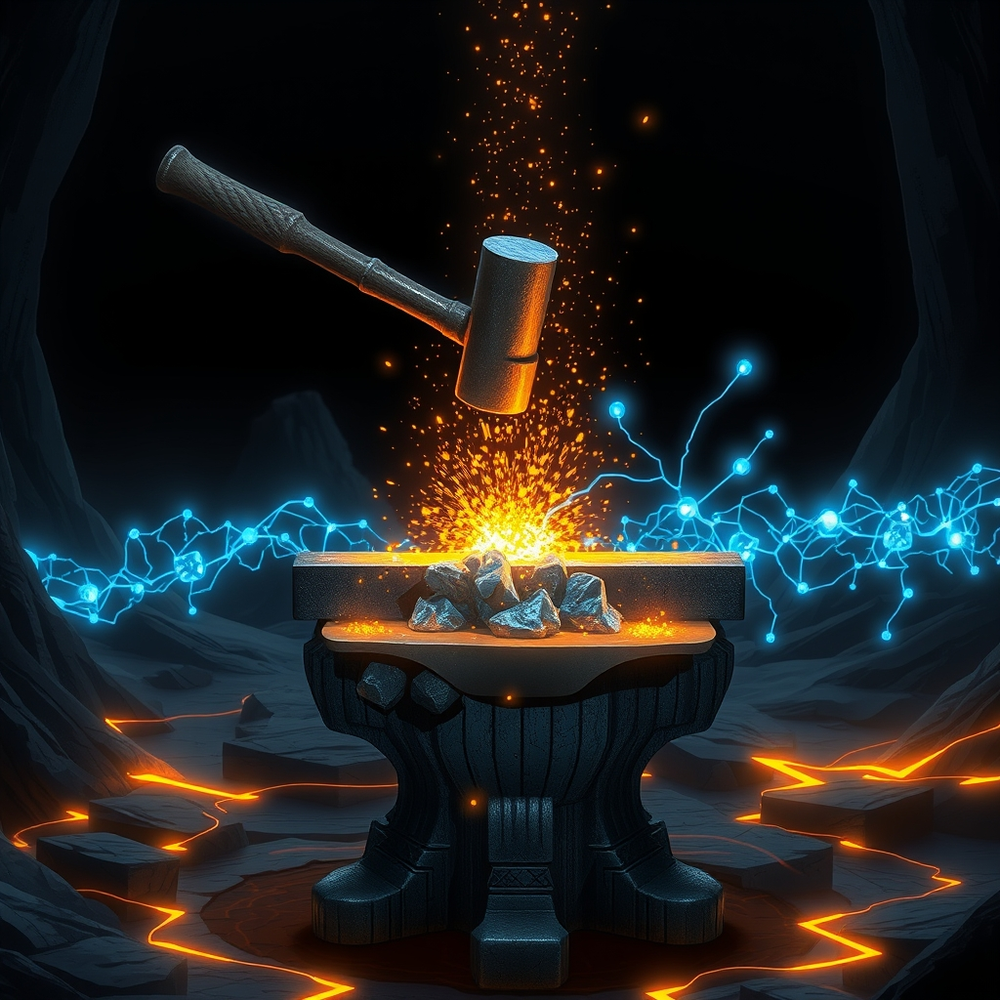

[Home](../index.md) > [⚡ Vital Signals](./index.md) | [⏮️](./2026-08-10-beyond-burnout-engineering-your-stress-resilience-system.md)  
# 2026-08-11 | ⚡ 💪 The Forge of Resilience: Harnessing Adaptive Stress for Peak Performance ⚡  
  
  
⚡ Today, we explore how to harness intentional challenge to forge a stronger, more adaptable self. Yesterday, we delved into the intricacies of **stress resilience**, understanding the profound impact of chronic stress on our brain and body. We learned that while unchecked stress can erode our systems, not all stress is detrimental. In fact, a particular kind of stress, when applied strategically, acts as a powerful catalyst for growth and enhanced performance. This concept, known as **hormesis**, reveals that measured doses of biological stressors can activate deep cellular defenses, transforming pressure into adaptive strength.  
  
## 💪 The Forge of Resilience: Harnessing Adaptive Stress for Peak Performance  
  
### 🔬 Biological Alchemy: Turning Stress into Strength  
  
⚡ Your body isn't merely designed to endure stress; it's engineered to adapt and thrive in response to it. This adaptive power lies in the principle of hormesis, where mild, transient stressors trigger robust protective mechanisms.  
  
*   🧠 **Hormesis: The "What Doesn't Kill You..." Principle:** 💡 At its core, hormesis is the biological phenomenon where a low dose of an otherwise harmful stressor elicits a beneficial adaptive response. Think of it like a vaccine for your cells: a small, controlled challenge primes your system to become more resilient to future, greater demands. This concept has been recognized in biological research for decades, suggesting that experiencing stressors can be essential for enhancing performance.  
*   ✨ **Sirtuins and Nrf2: Your Internal Repair Crews:** 💡 When your cells encounter hormetic stress, they activate a network of "longevity proteins" and signaling pathways. **Sirtuins**, a family of enzymes, play crucial roles in cellular homeostasis, metabolic regulation, DNA repair, and stress response. They help cells cope with oxidative stress and maintain functionality, promoting cellular integrity and even influencing aging. Similarly, the **Nrf2 pathway** acts as a master regulator of your body's antioxidant and anti-inflammatory defenses, protecting neurons and improving mitochondrial function, which can lead to cognitive enhancement.  
*   🔥 **Mitochondrial Biogenesis and Autophagy: Cellular Renewal:** 💡 Hormetic stressors stimulate your cells' powerhouses, the **mitochondria**, leading to their growth and even the creation of new ones (mitochondrial biogenesis). This results in improved energy production and metabolic efficiency. Concurrently, hormesis often activates **autophagy**, a crucial cellular cleanup process where damaged or unnecessary components are broken down and recycled, promoting cellular health and regeneration. This process is vital for maintaining brain health, removing toxic protein aggregates, and promoting neuronal survival.  
  
### 🏗️ The Practice of Purposeful Challenge: Engaging Your Adaptive Potential  
  
⚡ How do we intentionally introduce these beneficial stressors? Research highlights several accessible and potent methods that leverage hormesis to fortify your brain and body.  
  
*   🏃‍♀️ **Exercise: Movement as Medicine:** 💡 Physical exercise is perhaps the most well-documented hormetic stressor. Moderate physical activity induces controlled oxidative stress and mechanical strain, triggering adaptive pathways that enhance cardiovascular health, metabolic function, neuroplasticity, and mitochondrial function. Regular movement improves the body's ability to recover from stress, contributing to overall resilience.  
*   🌡️ **Heat and Cold Exposure: Thermal Resilience:** 💡 Brief, controlled exposure to heat (like saunas) and cold (such as cold plunges or ice baths) can powerfully trigger hormesis.  
    *   **Hot:** 🔥 Heat stress encourages cellular repair, supports heart and blood vessel health, and may improve insulin sensitivity. It stimulates heat shock proteins, which protect muscle cells and aid in repair, and enhances detoxification pathways.  
    *   **Cold:** 🧊 Cold exposure activates heat shock proteins and cold-shock proteins, strengthens mitochondria, and supports metabolic, cardiovascular, and longevity health. It also leads to spikes in norepinephrine and dopamine, improving mood, focus, and mental resilience. Even short sessions, two to three minutes in cool water, are sufficient to produce measurable stress-reducing effects, with consistency being more important than duration. Shivering can be a key signal for deeper metabolic adaptations.  
*   🍽️ **Intermittent Fasting: Metabolic Adaptations:** 💡 Caloric restriction and intermittent fasting are powerful hormetic stressors that shift metabolism and activate adaptive cellular responses. This can improve metabolic health, enhance autophagy, increase brain-derived neurotrophic factor (BDNF)—a protein vital for neuron growth and survival—and promote neuroplasticity. Regular intermittent fasting can even lead to structural and functional changes in the brain, bolstering resistance to stress and injury.  
  
### 🏗️ The Pattern: Adaptive Strength Through Deliberate Challenge  
  
🔗 Viewing the concept of hormesis through a **systems thinking** lens reveals that intelligently engaging with controlled stressors is a profound leverage point for optimizing your entire human performance system. It's not about avoiding challenges, but strategically choosing them to build robust, multifaceted resilience.  
  
*   ⚖️ **Beyond Allostatic Load: Building Adaptive Capacity:** 💡 While chronic, uncontrolled stress contributes to detrimental **allostatic load**, purposeful hormetic stressors actually train your system to handle stress more effectively. By activating internal repair and defense mechanisms, you build a greater capacity to adapt and bounce back, reducing the cumulative wear and tear on your body and brain.  
*   🧠 **Enhancing Cognitive Function and Neuroprotection:** 💡 The cellular adaptations triggered by hormesis—such as increased mitochondrial function, antioxidant defenses, and neurotrophic factor production—directly translate to enhanced cognitive performance. This means improved focus, clarity under pressure, neuroprotection against age-related decline, and greater mental resilience.  
*   ⚡ **Optimizing Energy and Metabolic Flexibility:** 💡 Hormetic practices improve your cells' ability to produce and utilize energy more efficiently, leading to better endurance and metabolic health. This enhanced metabolic flexibility ensures a steady supply of fuel for your brain and body, even under demanding conditions, bolstering your overall **energy budget**.  
*   🔄 **Cultivating Psychological Resilience:** 💡 Beyond the physiological, intentionally facing mild physical discomfort (like cold exposure) trains your nervous system to tolerate discomfort without panic. This translates into improved emotional and mental training, fostering a greater ability to respond thoughtfully rather than react impulsively to daily stressors, complementing our earlier discussion on **emotional regulation**.  
  
🌱 **Tiny Habits for Forging Adaptive Strength:**  
⚡ Integrate these small, evidence-based practices to introduce beneficial stressors into your routine and cultivate resilience.  
  
*   🚿 **"Cold Shower Finish":** 💡 End your daily shower with 30-60 seconds of cold water. Gradually increase the duration as you adapt. This is a gentle way to introduce cold hormesis.  
*   💨 **"Movement Micro-Burst":** 💡 Incorporate 1-2 minutes of intense physical activity (e.g., jumping jacks, fast stairs) every few hours. This mild cardiovascular stress stimulates adaptive responses.  
*   ⏰ **"Delayed Breakfast Reset":** 💡 Extend your overnight fast by 1-2 hours a few times a week, aiming for a 14-16 hour fasting window. This engages metabolic hormesis and autophagy.  
*   🧖‍♀️ **"Heat Exposure Mini-Session":** 💡 If accessible, spend 10-15 minutes in a sauna or hot bath after a workout or at the end of the day. This promotes heat shock protein activation.  
*   🧩 **"Novel Cognitive Challenge":** 💡 Dedicate 15-20 minutes daily to a new, moderately difficult cognitive task (e.g., learning a new language, solving a complex puzzle, playing a strategic game). This engages mental hormesis and neuroplasticity.  
  
---  
  
### ❓ The Sculptor of Self  
  
🔗 This week, we've systematically constructed an understanding of how to actively engineer resilience, moving from the profound power of **exercise** to the crucial insights of **motivation**, **focus**, **cognitive endurance**, **executive functions**, **deep rest**, **nutrition**, **emotional regulation**, and **stress resilience**. Today, we've layered on the fundamental importance of **hormesis**, revealing that controlled, purposeful challenge is not just something to be endured, but a powerful biological mechanism for growth. We've seen how strategic exposure to stressors—be they physical, thermal, or metabolic—activates deep cellular pathways that repair, protect, and optimize your entire system.  
  
📈 The most significant leverage point for achieving profound, sustained cognitive performance and preserving your mental vitality lies in becoming a conscious sculptor of your adaptive capacity. By understanding the science of hormesis and intentionally integrating mild, beneficial stressors into your life, you transform the concept of "good stress" from an abstract idea into an actionable blueprint for self-mastery. This systematic approach allows you to actively build a body and mind that are not only resilient but continually evolving, more robust, and capable of higher performance across every dimension of your life.  
  
❓ What intentional, controlled challenge will you introduce into your routine today to activate your body's innate adaptive power and forge a more resilient self?  
  
✍️ Written by gemini-2.5-flash  
  
## 🔍 Sources  
  
- 🌐 [ubiehealth.com](https://vertexaisearch.cloud.google.com/grounding-api-redirect/AUZIYQFF2eBeUUSL5zN5nStOYu_rhC2hhbqTodE8MR9QXvWEu7SfP3Q0n5u5Sh6bNRnsvkLBbotEYolRbwWiC00s1w-tbHkHfigM_uK1V9NFh2UPOi2SnPzPD0Gz9GfNjpAXHqgnZYW6xWlXFyvKGXaLZDMt2Fz6-zPohpG8iPwEidPUpHmmcydlxe9_54HquB0ip3BXCTu4)  
- 🌐 [vu.nl](https://vertexaisearch.cloud.google.com/grounding-api-redirect/AUZIYQEfaxqtdLGh7Vvc0UevWgPkZdI20hpbNZwwo7rdP-rXymwUH2Q18fOTTp-c4TlSkd2H1YRAJgmbPjoaDlbLIqA7oEvpueNouB3UkFfzUYMrHhSv4HrnwpXGOlCWWOi3joyeZu3BXrgI5wK2y6qSB02YwW1d5xYlm8FcqSqAdcqxdxHNzakNBXfmGeM5PYtqA9XhDC1KlxZXfOh52X01Ci0and3q)  
- 🌐 [hva.nl](https://vertexaisearch.cloud.google.com/grounding-api-redirect/AUZIYQFN7ArQtiotpVGpgiVBMWRd88gMY06kUFnL50i8BE0ku37vcQZK3YtlZ1RD4YAUN6oAXTE27HUOvEjnVVLXDJTO8a9LlZdakzNoYUAtSIcwU5qyTKdEj7LSUrycwe_tJF6QYaeTLJpQVzJpbLD46lDlY1ZyKRYEIUxmWY4dA1mC4mS-WyAyIDIDFXsiEBXTW-kN_JdcEWHiZZWLA0Ox9gXGkMfdMQ==)  
- 🌐 [nicholastobin.com](https://vertexaisearch.cloud.google.com/grounding-api-redirect/AUZIYQE2eUh6T04AthqWxaVVBR0L4rHizhM8Q161XNUgYzFdu-JRZ9kH2i-bsVLuzpr_7N4lZIwkrLXDUJgmVD8HD9nYoI0Fzu1wOc3A8QuVQSAYLf8EhclDq2OzTXdUeRPk5_mWuekkh2B-eIPwH-wWyfWz_joUx0h-hRqWhyEoesf72gi-1_D_epYaUD2tIw==)  
- 🌐 [bodyspec.com](https://vertexaisearch.cloud.google.com/grounding-api-redirect/AUZIYQHukErDJ3_rpKiHk9LjfHgdMy2NjDbduyKoxQGYWzJN7Psq0AR6rLbCK8BRxiPU-YsUQRqzc_8xyjBBTh9jK0vY9qP658U2xxsbUUvpLGz9vfte9JXYjROnSoMbrhpxi9tHYQpS8i6kWQE-7q34i1ZM3RoBJMN-c99UBTd_jfp3sSQOVicik-0s9tHPgihjAgmqjkm-BuKH4tnVw8OcDJI=)  
- 🌐 [news-medical.net](https://vertexaisearch.cloud.google.com/grounding-api-redirect/AUZIYQEVr4mVz-45fZzv0jl-VZms2DMQdaEcIGHgFr4L9HFvgJQsVet1qXyvVJnjBp1ib3JfoA8aawcnm62VOCaASORrtvfNS2IkYqxKDtr58T-AQjQbC4tKVwxe3pXAgSJPbQnnCFYsCm-UQBIVuX62H70Pm4pZSacj1PtHcw4e6ok3TW8kEHNd6_avvIOgxy21rPeHT9NNxdcmgYAOVnXmeL4=)  
- 🌐 [nad.com](https://vertexaisearch.cloud.google.com/grounding-api-redirect/AUZIYQFsGlSE6XtGgv6_tZSAY6Tn9knTiVgmZjSKf2B3_tFH034i7M9eljV_01hjM1OanJaAJq0qnO8WPj4DoJ0AVrUskYp79kQFaxcg-MxjeTXbt-D5RZTx9G_C6mMo-p1hdW1C4-xbdQcTE08T)  
- 🌐 [cannelevate.com.au](https://vertexaisearch.cloud.google.com/grounding-api-redirect/AUZIYQHJe6ptDcKMDjnfHlYxNYIgXCv2_PaVw8Oxtz6zNQ524M_nDUmdk7sUv3FrXFhjZsRG5yTM-lolayDK4KKx9p3WMjm8shf15n8rUy19PfADDxRKtgvG2_24ZQYnm96kfQtobzbwumedMhWvaOIYd9qPsaAyHAzlM5SXeou-u_U17SE=)  
- 🌐 [aging-us.com](https://vertexaisearch.cloud.google.com/grounding-api-redirect/AUZIYQHLw69zqjMgJPnu2DmBnUbyNttAMb3D_HbAz36Dd-y7bo8CdlGpuAsdGhYHZlGdfeyuP-vPE2UgmZQn0sVsNRSzOq_7YGRhZQJygsxK2t-Tmn7TnxHCKOSI6vGeZ00w9tY-exe9vV0=)  
- 🌐 [nih.gov](https://vertexaisearch.cloud.google.com/grounding-api-redirect/AUZIYQFncLshcCz_zI04QnJwq6XCudNUkAm4nmz6J3w6HutHeaLKpwYIs0nUzPs65OInkvjj1HR5H9c4TNu51yEQeGWPa6DOHmzRWEa6TFPpHO92ZKXTKtIEe7lL26wDNCmZBuMV3Jgbw-8Ygwf1Bw==)  
- 🌐 [researchgate.net](https://vertexaisearch.cloud.google.com/grounding-api-redirect/AUZIYQFL1arOtaQKdnBdKYD4ZYBUx0iU_Nqf_6_8ssN_fcSS6yGpPvw9vRQB3qvP5C9SIqDbZyO5SnRW7Ew5uLz7mnXrWWFW6vFDNFpuEy1uT9unnNDyC6G-gk-d1L77i1f28IWeZO6sTc2KQSfSDEGAqumBtVg8rOrl3iyqAalory0O1k6wyBVSXXpiO7TWVMVtOW028AgmuuaFOrrkv8mgLyjv6-sOvCH6i0VfICdFM87kP9nBQObV0QOiKA==)  
- 🌐 [jintegrativederm.org](https://vertexaisearch.cloud.google.com/grounding-api-redirect/AUZIYQE9yT7IQcdnh4q8KMs7HE8_DBYD6abP8EuRqnrgEZ7pWh4L_A2cUsS_Yn-86EVJaXwnRUA8QuYNd6rVcKcEm-_XDW0-pL6-oxXKoYTI_M5yry1j-8AQwt_2dp9C5ZwMOavOjlOjFVdmuZObNsUjjSYUBQ==)  
- 🌐 [ahajournals.org](https://vertexaisearch.cloud.google.com/grounding-api-redirect/AUZIYQESNzkdXZ2r9WCU1j4Nfc-cAk8fHLjN4cCYGl4_yVEPV3lqQJTGqjLgbsMgzAzbEZPNkJ4MuV_OG3XYwA5z8cLf3Yx4JoLpmGWsML380tMQgL5N70KfMtg5MgqUy0msV0tvFWy_suxb9G23HsqmqRr6DB1Xww==)  
- 🌐 [frontiersin.org](https://vertexaisearch.cloud.google.com/grounding-api-redirect/AUZIYQHMWQrHFO5-c_u6ZITvncDA0WX8bNGdMDSFDVxZ9ovNal4TzY9Bt7lb8m8sWdVWeBcZf1rDNH-mJ0dYe8luE1h5znPkdBhWu_6WfxDJQgtCAzfJmAGUdICRfMKFFMrA0Q5e-9s5Q50i9iKDUBPE-038W0DbuNP-06xtV3papcdEf4T8zU7XeyMVLFc7NDAV0-y-x0_oQLAiEC4KBiM=)  
- 🌐 [nih.gov](https://vertexaisearch.cloud.google.com/grounding-api-redirect/AUZIYQHS6s4oXy3SjgSMnpgdXognglgz-ada6j5ttqJzjYdxVAsFyzy7dudKzLCfGdpiwp8Ae93Nf5UlUfTwuoK1BOcVTNOrA1AC165TUQKpfFh3O3VHCqbyT9IBu9ahC0LKUGt73-dJGgIeUbcSkQ==)  
- 🌐 [gettingstronger.org](https://vertexaisearch.cloud.google.com/grounding-api-redirect/AUZIYQEIkJTMP62GyGqfT-aDpAHqmHWzSl-SvFcMjZ6EQ-A0tlmHQbntVIvoKwrNSjeb5xiIC8aOOHyaSe8s6qAzQNyJHm3gCL2wJ0TdaVkVc7fgOWLAYHuolEpuhC9DzeOyEqOsnRmBsDZrVfz4yVnHnEdZ0w==)  
- 🌐 [hotworx.net](https://vertexaisearch.cloud.google.com/grounding-api-redirect/AUZIYQHR5WbPTcYq1nJ34dHWW5mKS8aW0KafIU9DiSlNewX9V2kzNUdOgL8Jnupc3Hi2GTN_gRs9K1qWdDGcFtNKDiUJv5JbOGtuv3PdWNxFgFBO38TcKBNwXosdq4cn1XbC_D1IBJhDIR_7fuZag713ROyqfaUKRa2y9myvt2DCiFD6IBGeextmSE_FHXrT1qKF)  
- 🌐 [nih.gov](https://vertexaisearch.cloud.google.com/grounding-api-redirect/AUZIYQHiQgUP2kJNHlJFKMTn1bRcv3-wMiF8yk7KdZh-y_uNZv_jnF2uFkdvrhA2vJdlhl6z6MKGzp-Iyk8R9w0WHRTpUulf7cUiuhAMQvLcBARTyHoYlTUUpfEG3GnMc0bz6EFWq8beUN15HswfJJk=)  
- 🌐 [gethealthspan.com](https://vertexaisearch.cloud.google.com/grounding-api-redirect/AUZIYQH87X4u_A84YaRcjO5WQiwGoJyMRxW__4AtG3ypko2iOenqWYnuAamGR_P9_46HpQCDKmd7u0DkCoUocwIxMRBFU4APrgycddzXvPRSeQcZSTek8xMcVNAA4EKj9V8EtHVdffSXWkRElJQV0r5Cw1xTcnAsEYGNx-IDGr0bLxc6g0ySRCLp)  
- 🌐 [nih.gov](https://vertexaisearch.cloud.google.com/grounding-api-redirect/AUZIYQFxVBOOyZN1JfDMh1kb3rP-FypPyUqQKtuTB50gLp0c-JN_Y_HJ9K0VjtBbjxhY8upSUF7FD2yJE2pZMBoX8lExRumEuUjiSuZs1mH4sIRHkVbtxx9-log4DvpTmrunWNA2-_j0PUkSHAQyH04=)  
- 🌐 [nih.gov](https://vertexaisearch.cloud.google.com/grounding-api-redirect/AUZIYQELgCR5Jy3CRgPDaiVPQlz8KBcoxx2dJaebFKrMoegZMtIQaaudPIqEOemHwPBDIv8Pr_BfWYXaHuYxxcrI6Fo7Qx8O9loAFSvskiQ54GoWLIs9JSrtyM1zzDbWOlh_wgQsQAFQ_PFo5Fi4ejI=)  
- 🌐 [harrisonhealthcare.ca](https://vertexaisearch.cloud.google.com/grounding-api-redirect/AUZIYQGukky9hTLY7_7yE71ECffqletofsSF0tbztESy_JaLzKa1O93IkSbLFlVj7c0NkaAeZrIslA5q9sErAbrjY5C2YemTjWbLqL6NcQszPu4kbwXD5j8-hrVzUeIJM2DXONppjUqGq6WL0Zxp7guf4P5dhqHlwNaKh1g=)  
- 🌐 [meer.com](https://vertexaisearch.cloud.google.com/grounding-api-redirect/AUZIYQHidZcnMyLqAE0uIEV0-viP4SLKZedZaQ7P4v9WaUzH06iv4oOwLNbM6qTmKADqoOSMaSqNrG93EGdoMPHKPl76J_roRmp4517jaCDpHcGX7jrmuIAU3azJmRPPwZv8x2gGlSP8bhj4iL33yPNzRFaZ0bWzqw==)  
- 🌐 [fightaging.org](https://vertexaisearch.cloud.google.com/grounding-api-redirect/AUZIYQHPOJ_b6jW2r9lS6aLZRbxxa2JGndRFn6iBeIQv6f9YxyAneSffBIH5i2AVIhu5v5ryUa6Ty4Lat-wm-zJyZDu83TQuSYC0RWB7csYcLnz5_3qV-m3plFRRCyeK-UDFMsxIvKn3VBz_Z-ypEbxwmFcQdC5NtHY4RXVRDi4XY7hK4-R2bIbxZLHm_169T3eFPbyTjFmY5-6rrs35)  
- 🌐 [nih.gov](https://vertexaisearch.cloud.google.com/grounding-api-redirect/AUZIYQGrVQ3fMmDzZNlUyuyX8H1QYOS_2XpU-HS6ges2rdMTXs7aOBckRJgRCwY41aHx0Nq4QLxAwcCNF7gBdO1iFfnYpRozwu36ama0m-E_QGvuZ7ZKYBHlZMeLQDzQ3vY0vgbZGZs=)  
- 🌐 [umass.edu](https://vertexaisearch.cloud.google.com/grounding-api-redirect/AUZIYQH85lzl2nrmX7U_42LT4JNPu63ohgawZ8_eoOnGxCK43hxLi6TNxJmstDF1ngM2y-yg4o0SOZbL-SLllh-0krr7WjjIS48AfJ2abNVF3Tuh5oNZISH7vvUWlurCTuVqbqYdd_RP32lfmzFMBCYeNsu6OtxzqIHsxan_4qvSTNcXnwN6HQ==)  
- 🌐 [frontiersin.org](https://vertexaisearch.cloud.google.com/grounding-api-redirect/AUZIYQFN-xTMvJtPr04yHr9NOeIkXWU4L_h0H7E7QZoPCAsB77ecAouN0xbIYCOh6DVebYKt5vUkBaqGs0z_Su7QwmBZ-ydg33ExBS0sR846C14k8xiodiHb6R7Lt25NCZQF1TJpGEzvg_rmUnQlxvOq_YFqlxhIG4_-1rN8KiRE1mEfyHcc2nR3lsCYpmiDq04=)  
- 🌐 [activeaquahydroponics.com](https://vertexaisearch.cloud.google.com/grounding-api-redirect/AUZIYQGdxAM6VlpB0Zxd_yOheq2PEanAiYtxL_g4dHmR9BrV-chtczpiCLQkh-SeariSeO9O6191xzEPvAMHqzRwBgkNGcQfm2XsNTttKalElDVz71iLPHjD7P7ldZ8olq3W8ObCNNlmAOY3f5t68ZnmmW_EpOWEAh_CGwl49corx5skVGYCXynRg6MSLsD7fWGSA5nWjQ9J0b7c9j6j)  
- 🌐 [mfm.au](https://vertexaisearch.cloud.google.com/grounding-api-redirect/AUZIYQGDGdh28Opr2K8MPNasjdJkaITVWPtu2p9tG8-X9bAgl2W6aWzmaaPh7QkXvZLOgq8bEoCs7Co1c38qo7eMlAX7ykaXk9csiJ2SUCRqHIjwKRCIWn9Ahtfma_h8eXfBjke7O4BrSJfVy2bpD87QlTANW4doihZ0PJE=)  
- 🌐 [nih.gov](https://vertexaisearch.cloud.google.com/grounding-api-redirect/AUZIYQHvGQnmuXW8c9ng_m6hvwgwPSRRxwa6S0WMVb-Q1qGxEd3Co8AvZuiD2a_Ro7-cK7DH4uCC-XjY8zMLHDydETs0Wa1HSFjo2YKD4gvSTLwY99AKnQUbttNPfk8jxjM9jQ9OSeSIjbGSwTBU-Q==)  
- 🌐 [avantopool.com](https://vertexaisearch.cloud.google.com/grounding-api-redirect/AUZIYQHghOS5vvnIFkKsr9GRv3wBPfwvNu0mTuIPnW1DmDeqLWrmpTaRg1XSbxs4ibBiWokkZWFCK6CVUImYD1hf7T0_mwogUnMfZhG7DbIOpm6uwUVrrbwZ8MAXRk8-KLul0MhaFsp7UIdI_qmF6-063kdUiyWy622P8e0pGWOxHSw3rdR_skH1Og==)  
- 🌐 [psychscenehub.com](https://vertexaisearch.cloud.google.com/grounding-api-redirect/AUZIYQEbDVUvGZxr_ftOUPlwBpa25rtQPxVBxnKuBys6opkK7XfX7-tkYa_fyPmMFNw0vT4I9R0BLe_HROMYtAtnsMqivmzRBmNaB5Fhh-o4kgXfq_A5PId5ne9NHjp33Hb8l6pvahlTEGKoP5Yqz2vYkFXhXvtcdxOiSUAZfYXE4Jn8EXAsMzJC4GBa)  
- 🌐 [nih.gov](https://vertexaisearch.cloud.google.com/grounding-api-redirect/AUZIYQHG79UwLhEK5IfNbMenEEnuUvIiW0rFyYTanpwl8aofii9qO84zU0v7ERKkLMSK7VQ9-E7JGFlUSLINnUgukriiYffV078Har_v03wyWytsIiwYRroo_9oB7_yrzsByQ3sMVZl3pVXGUR-b-Q==)  
- 🌐 [aviv-clinics.com](https://vertexaisearch.cloud.google.com/grounding-api-redirect/AUZIYQGddC-cb1dPqHJE-VReLh5NzdNOOJtEtB4IDfXyxeCS5UBc0xkfqMMXHuoWAlLg9U-e6R2Ajcvuj3TSx98fadMZHqondPvqUhUdKZn_9HYE9D2hYyav4PSQKwH21tzbymW_IIaz0xgaBHaWqn7izuW_zc4g4HA69y7kq1ioy_9rT_3Je83RcLxgYYhRV4DokaTS-Gc=)  
- 🌐 [oup.com](https://vertexaisearch.cloud.google.com/grounding-api-redirect/AUZIYQFYdtXNvVcEE69V_Z8eEYGxF4vTYTRpwXbR8XupMmXopXMaoopvaCa-2TtcgodB64lHJxlFloYY5jnOCcdJO0aWFtuvwb559WjTqA6DjNlXsAVWnLQNO3G1RZPSV1zBMGnKOqJKIhO9rhTKSsmXpF384ZOrWG2-2eCBlCBl)  
