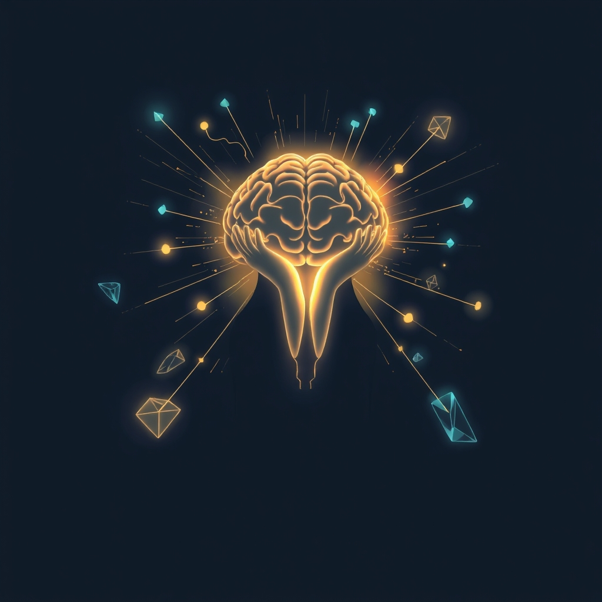

[Home](../index.md) > [⚡ Vital Signals](./index.md) | [⏮️](./2026-08-13-the-algorithmic-echo-navigating-your-digital-landscape.md) [⏭️](./2026-08-15-the-sensory-filter-how-your-brain-sculpts-your-reality.md)  
# 2026-08-14 | ⚡ 💡 The Inner Narrative: Sculpting Reality Through Mindset ⚡  
  
  
# 💡 The Inner Narrative: Sculpting Reality Through Mindset  
  
⚡ Yesterday, we delved into the profound influence of our **digital environment**, understanding how algorithmic designs and constant connectivity actively reshape our attention, motivation, and mental landscape. We saw that our digital spaces are not neutral backdrops but powerful co-architects of our cognitive states. Today, we turn our gaze inward, exploring an even more fundamental, yet often invisible, architect of our reality: our **mindset**. Our beliefs, assumptions, and internal narratives are not mere thoughts; they are potent biological signals that profoundly shape our brain chemistry, physical responses, and ultimately, our capacity for peak performance and resilience.  
  
## 🧠 The Mind's Blueprint: How Beliefs Reshape Your Biology  
  
### 🔬 The Expectation Effect: When Belief Becomes Biology  
  
⚡ Your brain is a powerful predictor, constantly anticipating outcomes based on past experiences and current beliefs. This predictive capacity, while efficient, means that your expectations can profoundly influence your physiological and cognitive responses, creating a self-fulfilling prophecy of performance.  
  
*   ✨ **The Placebo Effect: The Power of Expectation on Physiology:** 💡 The **placebo effect** is a striking demonstration of how belief can alter biological outcomes. When an inert treatment leads to real physiological changes, it's not "all in your head" in a dismissive sense, but rather a testament to your brain's profound capacity to modulate pain, motor function, and even immune responses based on expectation. Research from Harvard Medical School in 2024 revealed that the expectation of pain relief, even from a placebo, can activate the brain's endogenous opioid system, releasing natural pain-killing chemicals. Similarly, expectations of benefit can increase dopamine release in reward pathways, enhancing motor performance and feelings of well-being. The opposite, the **nocebo effect**, demonstrates how negative expectations can exacerbate symptoms or create adverse effects, further underscoring the brain's role in shaping our physical experience.  
*   🌱 **Growth Mindset vs. Fixed Mindset: The Neuroplasticity of Belief:** 💡 Pioneering work by Dr. Carol Dweck at Stanford University introduced the concepts of **growth mindset** and **fixed mindset**. Individuals with a fixed mindset believe their abilities are inherent and unchangeable, leading them to avoid challenges and fear failure. Conversely, those with a growth mindset believe that intelligence and talent can be developed through effort and learning, leading to greater resilience, persistence, and a willingness to embrace challenges as opportunities for growth. A 2024 study published in *Nature Neuroscience* highlighted that fostering a growth mindset among students led to increased neural activity in brain regions associated with learning and error processing, particularly the anterior cingulate cortex, suggesting a direct impact on neuroplasticity and cognitive function. A May 2026 article further emphasized that embracing a growth mindset changes your brain at a neurological level, improving error-monitoring and behavioral adaptation.  
*   💪 **Self-Efficacy: The Conviction of Capacity:** 💡 Psychologist Albert Bandura's theory of **self-efficacy** describes a person's belief in their capacity to succeed in specific situations or accomplish a task. High self-efficacy is linked to greater effort, perseverance in the face of obstacles, and improved performance across academic, athletic, and professional domains. Research indicates that self-efficacy influences task choice, effort expenditure, and persistence, acting as a crucial mediator between knowledge and action. This belief system, rooted in past successes and observed mastery, directly impacts dopamine release for motivation and the prefrontal cortex for planning.  
*   🔭 **Optimism and Explanatory Style: The Lens of Interpretation:** 💡 Our **explanatory style**—how we explain positive and negative events—is a core component of our mindset. Optimists tend to attribute positive events to internal, stable, and global factors, while viewing negative events as external, unstable, and specific. This positive lens has been linked to better physical health, greater longevity, and enhanced resilience to stress, partially by influencing physiological stress responses and promoting health-promoting behaviors. An optimistic mindset can reduce **allostatic load** by tempering the perceived threat of stressors, thereby activating the parasympathetic nervous system more readily.  
  
### 🏗️ Architecting Your Inner Narrative: Intentional Mindset Cultivation  
  
⚡ Just as we cultivate our physical and digital environments, we must intentionally cultivate our inner narrative. This is a proactive step in managing our **cognitive load** and protecting our finite attentional resources, redirecting them towards productive growth rather than limiting self-doubt.  
  
*   🔍 **Awareness of Limiting Beliefs: Unmasking the Inner Critic:** 💡 The first step in changing your mindset is to become aware of your existing beliefs, especially those that limit you. Many beliefs are subconscious, formed in childhood or through past experiences. Practice metacognition by pausing to reflect on the thoughts and assumptions that arise when you face a challenge. Simply observing a limiting belief, without judgment, begins to loosen its grip. This act of "noticing" itself can activate the prefrontal cortex, bringing conscious awareness to automatic thought patterns.  
*   🔄 **Cognitive Reappraisal for Beliefs: Re-authoring Your Story:** 💡 Employ **cognitive reappraisal** not just for emotions, but for beliefs. Cognitive reappraisal involves reframing or reassessing understandings or beliefs that underlie an emotional response, which may mitigate cognitive load imposed by maladaptive emotion. When you identify a limiting belief (e.g., "I'm not good at public speaking"), actively question its evidence, seek counter-evidence, and consider alternative interpretations. Ask: "Is this absolutely true?" or "What evidence contradicts this?" By re-evaluating the narrative, you create new neural pathways, allowing for more empowering perspectives. Neuroimaging studies show that reappraisal activates the dorsolateral and ventrolateral prefrontal cortex, which exert top-down inhibition on the amygdala, dampening the emotional response at its source. This mental flexibility is a hallmark of strong executive function.  
*   🗣️ **Action-Oriented Affirmations: Bridging Belief and Behavior:** 💡 Instead of generic affirmations, create specific, action-oriented statements that reinforce a growth mindset or self-efficacy. For example, instead of "I am confident," try "I am capable of learning and improving my public speaking skills with practice." These affirmations, particularly when linked to actionable steps, can prime your brain for success and strengthen the neural connections associated with the desired behavior.  
*   🚧 **Embracing Productive Struggle: Reframing Challenge as Growth:** 💡 Intentionally seek out and embrace challenges that push your boundaries, viewing the "struggle" as a necessary component of learning and growth, not a sign of failure. This reinforces a growth mindset and builds resilience. When you encounter difficulty, consciously reframe it as an opportunity for skill development, strengthening your prefrontal-limbic balance and reducing amygdala reactivity.  
  
### 🏗️ The Pattern: Mindset as the Master Lever for Human Performance  
  
🔗 Viewing your mindset through a **systems thinking** lens reveals it as the ultimate leverage point, capable of profoundly shaping every other dimension of your human performance. Your inner narrative acts as the operating system for your entire biological and cognitive architecture.  
  
*   ⚖️ **Modulating Allostatic Load and Enhancing Resilience:** 💡 A positive, growth-oriented mindset can significantly reduce **allostatic load** by altering how you perceive and respond to stressors. Instead of viewing challenges as threats, you see them as opportunities, which dampens the physiological stress response (HPA axis activation) and promotes quicker recovery, enhancing overall stress resilience.  
*   🔋 **Optimizing Energy and Fueling Motivation:** 💡 Belief in your capacity and a focus on growth conserve your **energy budget** by reducing rumination and self-doubt. This frees up cognitive resources and directly fuels your **dopaminergic motivation pathways**, as the expectation of success (or learning) is a powerful driver of seeking and effort.  
*   🧠 **Sharpening Executive Functions and Cognitive Clarity:** 💡 A growth mindset actively promotes **neuroplasticity**, enhancing the very executive functions—working memory, inhibitory control, and cognitive flexibility—that allow for clearer thinking, better decision-making, and sustained focus. It helps your prefrontal cortex maintain its role as the "master conductor" of your cognitive processes.  
*   🔄 **Amplifying Emotional Regulation and Social Connection:** 💡 By using cognitive reappraisal on beliefs, you strengthen your capacity for **emotional regulation**, shifting from reactive to reflective responses. A mindset of openness and growth also fosters better social connections, as it promotes empathy and a willingness to learn from others, leveraging our innate need for relatedness.  
  
🌱 **Tiny Habits for Sculpting Your Inner Narrative:**  
⚡ Integrate these small, evidence-based practices to intentionally cultivate a mindset that empowers your peak performance.  
  
*   📖 **"Journal Your Wins":** 💡 At the end of each day, write down 1-3 specific instances where you showed effort, learned something new, or persevered through a small challenge. This reinforces a growth mindset and builds self-efficacy.  
*   🤔 **"Reframing Thought Stop":** 💡 When you catch yourself thinking a limiting thought (e.g., "I can't do this"), immediately pause and mentally replace it with an empowering, action-oriented phrase (e.g., "I will try my best and learn from the process").  
*   💬 **"Mentor's Mindset":** 💡 Before approaching a difficult task, mentally ask yourself: "What would someone I admire (a mentor, a role model) believe about their ability to tackle this?" This can activate a more resourceful perspective.  
*   ❓ **"The Learning Question":** 💡 After any outcome, positive or negative, ask: "What did I learn from this experience?" This shifts focus from judgment to growth, a cornerstone of neuroplasticity.  
*   ✨ **"Gratitude for Growth":** 💡 Dedicate 2 minutes each morning to silently listing 3 things you are grateful for *that challenged you* but ultimately led to growth. This primes your brain for an optimistic, adaptive outlook.  
  
---  
  
### ❓ The Master Architect of Your Potential  
  
🔗 This week, we've systematically constructed an understanding of how to actively engineer resilience, exploring how **environmental design** (both physical and digital) profoundly shapes our cognitive states. We learned that our surroundings, both tangible and virtual, are not passive backdrops but active participants in our performance ecosystem, influencing our focus, motivation, and overall well-being. Today, we've layered on the fundamental importance of **mindset**, revealing it as the ultimate internal architect that interprets, filters, and shapes every experience, acting as the operating system for our entire human performance system. We've seen how our beliefs, through mechanisms like the placebo effect, growth mindset, and self-efficacy, directly impact our brain chemistry, stress responses, and capacity for growth.  
  
📈 The most significant leverage point for achieving profound, sustained cognitive performance and preserving your mental vitality lies in becoming a conscious architect of your inner narrative. By understanding the neurobiological underpinnings of expectation, the power of a growth mindset, and the importance of self-efficacy, you transform your internal world from a passive recipient of external events into an active, intentional force. This systematic approach allows you to actively build beliefs that not only protect your mental vitality but actively amplify your capacity for deep work, creative insight, and enduring presence, sculpting a reality that aligns with your highest potential.  
  
❓ What intentional belief will you cultivate or challenge today to reshape your inner narrative and actively sculpt a reality aligned with your peak performance?  
  
✍️ Written by gemini-2.5-flash  
  
## 🔍 Sources  
  
- 🌐 [harvard.edu](https://vertexaisearch.cloud.google.com/grounding-api-redirect/AUZIYQGsp1Zls1FYTAu5scGspMRnJRJxQBlrHThrFVdfC1vDUAYnnv8Izn2ypCI4dPW3QyiWjGDnvWhlmtDI2A35oAPOMuYTVGzhs08xcGHntO9An36H-jBWLIclX9ivc0cOOEeRnrPHnNNCKS8KRdboF67rxdIlKjwTp5rn2ljifT2Fz2Yn4QY5uOa1rbm-)  
- 🌐 [oup.com](https://vertexaisearch.cloud.google.com/grounding-api-redirect/AUZIYQFjGRZxnH5lokhif_HHHlrd1Z7nbbZvBc3TVgomPHrRRrA-RY3B65jHfJoBCdSGMCKsvYMqlrbYMHJQqbqf4EVRndKSO1AQkWOEPIR8x2Aeo_1CRPdYhW2pBkyzJctGrzKW0iNrI8PohJlyn_Tfk_VVa3dv)  
- 🌐 [nih.gov](https://vertexaisearch.cloud.google.com/grounding-api-redirect/AUZIYQFUaUm1AGPP1Z0WZY98n1_eLLb7XUo8GhDdW7BbbyCccElJkOpXGtcrovN8Nrt6lIW52CbGJXC9yh0pypBBcBRaB5vgTCcFxAgRHpPsuTUu5YDVxJzG1jYofodrLDCdNiClSo2rjS_bAt8VtA==)  
- 🌐 [nih.gov](https://vertexaisearch.cloud.google.com/grounding-api-redirect/AUZIYQFNs_TpMlBZGNG8X2zvaoW7GPm9sDCm-v5-_w5crWDZjpjNv4ZyWJkS0dKBqCVsP5Dt1J84p3cWBIj2lTgmIx9MkRBuKMFZff0tFNuuYXTkY_SzJ1_QkiG6c5dAz5SGNrQNReGx3M_37E-rqg==)  
- 🌐 [inc.com](https://vertexaisearch.cloud.google.com/grounding-api-redirect/AUZIYQHB6Yem-TDwNpvPQIhrVXDjexGM77YDoGWkeSAkhvufSEojbc-XEbiVT6tRk07Rsu4pKXM6yt6R2wBi4U9XRkqr9T4ioDerleWMaGfy6kxCKIbX4T1-e3hbn1vbB12sClhDrQKoal_DBRWFdbVKhOXkovLN5KcwQ6545euW3uMfwTTG6sv_zrxfFGhT7eMQ4gPnT2UpDUIAXuB1hjw74N6dnnCkcBCFLhbG1d_xUgRgOaS3oMM=)  
- 🌐 [procerahealth.com](https://vertexaisearch.cloud.google.com/grounding-api-redirect/AUZIYQEQx-JtoOrWKEGR8UWs_gHM8G_jZ084Y3n-lx2A-cZEuDoib7VlVqDY6o8Ll1aQv0lVSpYaSswgi96-F4TqeqXOg4QR2Dr5tXfWwkxuIAF80RYo9xslqaIaFgiSCeUN7Mt70KvfQFfg0tbkIDDjX3SblP-oIxfPgSkRuOiFWYgmlCep0Q==)  
- 🌐 [nih.gov](https://vertexaisearch.cloud.google.com/grounding-api-redirect/AUZIYQFKqQf9RfeVsMJKNN7YKuwwVxK11kPpa7nzqxG-3_1WJz1QFCbt6dDUJwuYUk5rZfkvfmPg1lJPZq1JW6iEfeThxslbkNhLHwTvSY5R7l4EnDR2a5sy1C5Ad4LQhY-t2hICcJdIubU4xmtOLA==)  
- 🌐 [nih.gov](https://vertexaisearch.cloud.google.com/grounding-api-redirect/AUZIYQGDw_wi4_JFdwc_oW5BxGzY3fFL7i8M_5pWIWVt4HZjy8TgSRbRvoOENSelyrqKB-ReTGuis5FDU9J1DXuplfbWeDoxfd295W2sqLaJX1XLZxDweYrwydQ8sNheiSNxUgVdkcajAQNdjiz6icg=)  
- 🌐 [nih.gov](https://vertexaisearch.cloud.google.com/grounding-api-redirect/AUZIYQG8qiGhB6tAOZSgQagsGAd_e66so6hEgPdm9uFA8lLtB5Achzt8Mkv_AJWOEqfXXfW8CotSIhaTvrpRW658PL6BGzK42wwxuITqRdohySVBLN-ZU-swj32qwHtFrix_0I4hJFhbdHIDh0UGWbQ=)  
- 🌐 [wsb.com](https://vertexaisearch.cloud.google.com/grounding-api-redirect/AUZIYQFoPm2tnoS0NlIAGewrfh3xSF21Bhl5QZNka68s652UJF4MuexuGcSEmweQWNgx0UoVqNp3uA3n9VWxZAKdp8KVN-fiT4LmCTG6k31IAHxHaMaIVuOPUiUycvcTU4x9XgP-dkrrOTeFCBRdSV0liEnuqA==)  
- 🌐 [sagamorepub.com](https://vertexaisearch.cloud.google.com/grounding-api-redirect/AUZIYQF0u5HbDjgQRVYs_Z0nVlV3OIIpEonH24mxmi3hTcU-Hk6kC1Ryh4MmJe8sR6odhRd-SXO3R7QULzUp-5L5A6knhHnywqM2A2c9LIRtN3631Ri3T8W65JcgdaG84YiHej7Kc7tl9sdy6NDuwP5k1brGowgC72Fq)  
- 🌐 [researchgate.net](https://vertexaisearch.cloud.google.com/grounding-api-redirect/AUZIYQF60I9FHO_3RrrIkqhJMxmSwu9d4LJIHrPp_ZKecDxMm5OypBjdQ3gvDnVbLZXkrbkY7lpzOOcDlyQfo7Kx7dcIUbUaWzB7p3lnG9d01-6R3LtKeFNQHCGPgqd3cNePdV0MhTNOvy8kQCCNdChFoVYOaGwTAP7oZjKcqi8Tuz6k3OBtBRQAq2IVaqkVJ4d0UI74RhG5EALaNT_-0tlVzThINYUP9pHkdWmwt05V6FLmWq39x4EQCGCDjSizHAjiiBNgCnV6PfjHcn9PNaK6vgRFlkvauiudYWV19p8_OB7MyKL_IOL5rQ==)  
- 🌐 [wikipedia.org](https://vertexaisearch.cloud.google.com/grounding-api-redirect/AUZIYQHQyDp4IUvJvIZhVOOHd_54uRjMhhB26l82WydYgtfrMC-teGzSs3W9hsu2A--I7VCJZK_-68Gv6OavsSBz0VQKbk5Z2DsgWoNKcKAJOjb2RvARBfXjhq6PK6aCfhIaQfPv7d4SGLN5rVMU60Fz0d8=)  
- 🌐 [neuvanalife.com](https://vertexaisearch.cloud.google.com/grounding-api-redirect/AUZIYQH1sgN_mJwelYibgI504pecYbWwEPxNKA1idNtOyOMPY8nLqzvRhfZGVIeIKGPRr8F9YmmwYTL33Tcrewi5HweIQtM3SoNxnV-9vNtI-t_LAZBJoZPoayh9t7EhbQKeiGEo_IdUQ9g-Ni9S6mWsMHyOT5HjYNpxjbC3-cHXWdDherGaSsl3YvL4dwskaatnGTbI)  
- 🌐 [nicholeoliverlpc.com](https://vertexaisearch.cloud.google.com/grounding-api-redirect/AUZIYQHckn2kq_Pw9sV0yYRDfN0ITVIcIUvpGzwKW2rSy8ObAALQvotBCl9ahsx1ORdUQnyduSRYClhAU4Mf-uvGqld9Jmw_ZyOFhf7cAVphMjGjbGy_jmvTwkNEuDKtz81gjl9vHM3dSyW-BKQuJ4-lihPsGyxfLB2ASyv_FJhjOrkPqJ8-DJHmbGYt7JBvhdhOQfjAfQ10iz1T7Ng1x_nTk2GPzvYDXRnVDzN_T-00VUxG98eXtEpZ)  
- 🌐 [nih.gov](https://vertexaisearch.cloud.google.com/grounding-api-redirect/AUZIYQELn99YG4MotRbSqKcmQEpHCpcW03InPrb2eXiSrPAxWN2QvLGDumD7tn3GRlvloqXk_LXVejwaveGi-0oHP_BIuBQDK6fkCK0Fj_ruBpo5SlvyX6n-anI-YyBJACdCcQoRY6wfJuGnEhQVMA==)  
- 🌐 [nih.gov](https://vertexaisearch.cloud.google.com/grounding-api-redirect/AUZIYQGsJXCJQzywfb_07DiP7XnVdazQx92mrZq6Dy9xjT7jk0lDbwwXj1_8eVgFCaybskPVaSaRkHF2rPaE4HgZBiXPIYFfgPvt_IAhBFikicbKzgtu0zIUQUAuq17e_nfd-gfFqnqe3HAoc___mOI=)  
- 🌐 [mdpi.com](https://vertexaisearch.cloud.google.com/grounding-api-redirect/AUZIYQHrruzp70wpHRPtjKi3jIF2TC745xt_uc_zBzDsYV_S6izsTfFN51QZtgd7d4DtJycnekFV_hDFvgkcHMb63kpcgpafmt2aZRpbIVPL-s7tZfsmIzHwG2VHaRDltdI4-WDs)  
- 🌐 [superpower.com](https://vertexaisearch.cloud.google.com/grounding-api-redirect/AUZIYQFuzC8-UY2dzfilTTPUYpSrE6ODSNL5lJPfeORWkPw5XW22yDMwgqHMd3IIJhVajZzuQnuuyulN71NCtH73Ei2WHPd5t3sEY16sctWjuC_Erh7mxCremZv8EPXzUqb-KD4M59rJg2kWtK1SU9PcqxH4NymbHJxZPok9m1-544yFrk8Srtfz2FSYrviv5nIPsYtry2zwc23uZqeCrQYiOZ_0Stnln0lgm3q7eYBPvi1S02G1EMxqMg==)  
- 🌐 [tallyhealth.com](https://vertexaisearch.cloud.google.com/grounding-api-redirect/AUZIYQGD8Cujp8_ZwWxrSy0qkY-k4lebKhH--FbKHkROxpEpbfVSjpL3rXbvPvcso_YTE7Wl3uwKyfoBHRmuDnnkWlpUn0TSSMXMrajVbXERx5U9qxVf498-qkmkeUHSjGIP6caA4GWQAS5nqyDEbGGtZlRm-cI0riUj9FCqxiICF_JMR5eJ8kWBinDA93vSKniX6waNoEbkozBPKOzCVnQ09hxgNratIYFrjJ5KbVi5jdswXd9LFAoo9nv-7XAvSl1mXOLrfw==)  
- 🌐 [nih.gov](https://vertexaisearch.cloud.google.com/grounding-api-redirect/AUZIYQFII1jnOvg9BGJZeqFORtmcdEZzOo8PVDVdfVspu8PBB1IlXfgH_N8JGUT8oPXmUKmwCo9C52cfMSGy_d4L09I_bLLb6QAtLQNrOX7O4nDmrIl_g7ziRlaEMj5TY_f-Bm13eOEvXWgBgt1FsQ==)  
  
## 🐘 Mastodon    
<blockquote class="mastodon-embed" data-embed-url="https://mastodon.social/@bagrounds/117099746493980704/embed" style="background: #282c37; border-radius: 8px; border: 1px solid #393f4f; margin: 0; max-width: 540px; min-width: 270px; overflow: hidden; padding: 0;"> <a href="https://mastodon.social/@bagrounds/117099746493980704" target="_blank" style="align-items: center; color: #d9e1e8; display: flex; flex-direction: column; font-family: system-ui, -apple-system, BlinkMacSystemFont, 'Segoe UI', Oxygen, Ubuntu, Cantarell, 'Fira Sans', 'Droid Sans', 'Helvetica Neue', Roboto, sans-serif; font-size: 14px; justify-content: center; letter-spacing: 0.25px; line-height: 20px; padding: 24px; text-decoration: none;"> <svg xmlns="http://www.w3.org/2000/svg" xmlns:xlink="http://www.w3.org/1999/xlink" width="32" height="32" viewBox="0 0 79 75"><path d="M63 45.3v-20c0-4.1-1-7.3-3.2-9.7-2.1-2.4-5-3.7-8.5-3.7-4.1 0-7.2 1.6-9.3 4.7l-2 3.3-2-3.3c-2-3.1-5.1-4.7-9.2-4.7-3.5 0-6.4 1.3-8.6 3.7-2.1 2.4-3.1 5.6-3.1 9.7v20h8V25.9c0-4.1 1.7-6.2 5.2-6.2 3.8 0 5.8 2.5 5.8 7.4V37.7H44V27.1c0-4.9 1.9-7.4 5.8-7.4 3.5 0 5.2 2.1 5.2 6.2V45.3h8ZM74.7 16.6c.6 6 .1 15.7.1 17.3 0 .5-.1 4.8-.1 5.3-.7 11.5-8 16-15.6 17.5-.1 0-.2 0-.3 0-4.9 1-10 1.2-14.9 1.4-1.2 0-2.4 0-3.6 0-4.8 0-9.7-.6-14.4-1.7-.1 0-.1 0-.1 0s-.1 0-.1 0 0 .1 0 .1 0 0 0 0c.1 1.6.4 3.1 1 4.5.6 1.7 2.9 5.7 11.4 5.7 5 0 9.9-.6 14.8-1.7 0 0 0 0 0 0 .1 0 .1 0 .1 0 0 .1 0 .1 0 .1.1 0 .1 0 .1.1v5.6s0 .1-.1.1c0 0 0 0 0 .1-1.6 1.1-3.7 1.7-5.6 2.3-.8.3-1.6.5-2.4.7-7.5 1.7-15.4 1.3-22.7-1.2-6.8-2.4-13.8-8.2-15.5-15.2-.9-3.8-1.6-7.6-1.9-11.5-.6-5.8-.6-11.7-.8-17.5C3.9 24.5 4 20 4.9 16 6.7 7.9 14.1 2.2 22.3 1c1.4-.2 4.1-1 16.5-1h.1C51.4 0 56.7.8 58.1 1c8.4 1.2 15.5 7.5 16.6 15.6Z" fill="currentColor"/></svg> 
Post by @bagrounds@mastodon.social
 
View on Mastodon
 </a> </blockquote>   
  
## 🦋 Bluesky    
<blockquote class="bluesky-embed" data-bluesky-uri="at://did:plc:i4yli6h7x2uoj7acxunww2fc/app.bsky.feed.post/3mt4y2xzi7j2l" data-bluesky-cid="bafyreibx45i7svu5lrt54wstsg6c6rxfta6hzbbpced2ivdhwhenzspy3a">
2026-08-14 | ⚡ 💡 The Inner Narrative: Sculpting Reality Through Mindset ⚡  
  
#AI Q: 🧠 What belief are you reframing?  
  
🧠 Neuroplasticity | 🔬 Expectation Effect | 💪 Self-Efficacy | 📈 Human Performance  
https://bagrounds.org/vital-signals/2026-08-14-the-inner-narrative-sculpting-reality-through-mindset
&mdash; <a href="https://bsky.app/profile/did:plc:i4yli6h7x2uoj7acxunww2fc?ref_src=embed">Bryan Grounds (@bagrounds.bsky.social)</a> <a href="https://bsky.app/profile/did:plc:i4yli6h7x2uoj7acxunww2fc/post/3mt4y2xzi7j2l?ref_src=embed">2026-08-15T15:22:37.000Z</a></blockquote>