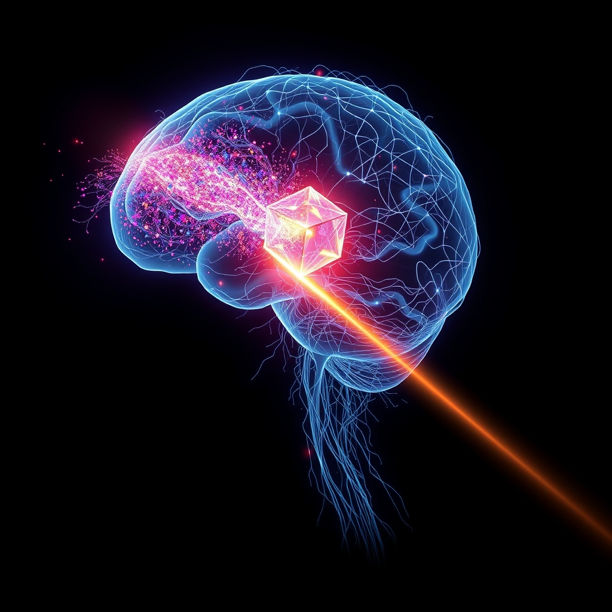

[Home](../index.md) > [⚡ Vital Signals](./index.md) | [⏮️](./2026-08-14-the-inner-narrative-sculpting-reality-through-mindset.md) [⏭️](./2026-08-16-the-resilience-engineer-s-blueprint-a-week-of-architecting-peak-performance.md)  
# 2026-08-15 | ⚡ 👂 The Sensory Filter: How Your Brain Sculpts Your Reality ⚡  
  
  
# 👂 The Sensory Filter: How Your Brain Sculpts Your Reality  
  
⚡ Yesterday, we explored how our **mindset** acts as an internal blueprint, profoundly shaping our biology and capacity for performance. We saw that our beliefs are not just thoughts, but potent signals influencing everything from the placebo effect to our neuroplasticity. Today, we delve deeper into how our reality is sculpted, examining the fundamental processes by which our brains filter, interpret, and prioritize the constant deluge of sensory information from the world around us. Far from passively receiving data, your brain is an active editor, deciding what to amplify and what to ignore, profoundly impacting your focus, energy, and overall cognitive experience.  
  
## 🧠 The Brain's Master Editors: Filtering the Deluge of Information  
  
### 🔬 Sensory Gating: Your Brain's Built-in Bouncer  
  
⚡ Every second, your senses are bombarded with an estimated 11 million bits of information, yet your conscious mind can only process a tiny fraction of this. Your brain employs sophisticated mechanisms to filter out redundant or irrelevant stimuli, a process known as **sensory gating**. This crucial function prevents your higher-order brain centers from being overwhelmed, allowing you to focus on what matters. Sensory gating is largely automatic, but it's also influenced by selective attention, as the brain actively seeks goal-relevant information.  
  
*   ✨ **The Thalamus: The Grand Central Station of Sensation:** 💡 Deep within your brain, the **thalamus** acts as a central relay station for almost all sensory information (except smell) before it reaches the cerebral cortex for interpretation. It's more than a passive switchboard; the thalamus plays a crucial role in prioritizing attention by filtering and selecting sensory information for further processing. For instance, the pulvinar nuclei of the thalamus is vital in filtering out unnecessary information in sensory gating. Research suggests that the prefrontal cortex relies on the thalamus to modulate the strength of competing sensory inputs, a discovery that challenges older models of selective attention.  
*   🚧 **The Reticular Activating System (RAS): The Gatekeeper of Arousal:** 💡 The **Reticular Activating System (RAS)**, a network of neurons in your brainstem, is another key player in sensory filtering. It regulates arousal, alertness, and attention, determining which sensory inputs reach conscious awareness and helping you focus on relevant stimuli while ignoring background noise. The RAS helps your brain manage its limited resources by filtering incoming information based on its relevance to your current goals.  
*   💡 **Perceptual Load Theory: When More Input Means Less Distraction:** 💡 **Perceptual load theory** offers an intriguing insight into selective attention. It suggests that when the "perceptual load" (the complexity or number of relevant stimuli) of a task is high, your brain's perceptual capacity is exhausted by the task, leading to less processing of irrelevant distractors. Conversely, under low perceptual load, more attentional resources are available, and irrelevant stimuli are more likely to be processed. This implies that sometimes, a richer, task-relevant sensory environment can actually reduce distraction.  
*   🧠 **Expectation Effects: Sculpting What You See (and Hear, and Feel):** 💡 Your expectations, heavily influenced by past experiences and current mindset, profoundly shape your perceptions. Your brain constantly makes "best guesses" about what's to come, based on prior knowledge, and these "priors" can direct your attention to expected stimuli or even reduce your sensitivity to variations within expected categories. This is not just a psychological phenomenon; neuroscience studies show that expectations can influence brain activity and behavior, demonstrating that perception is not a one-way street of faithfully representing external stimuli.  
  
### 🏗️ Sensory Overload and Deprivation: The Extremes of Perception  
  
⚡ While sensory filtering is essential, imbalances can have significant cognitive and emotional consequences.  
  
*   ⛈️ **The Costs of Sensory Overload:** 💡 When your sensory gating mechanisms are overwhelmed, you experience **sensory overload**. This can lead to increased stress, anxiety, emotional fatigue, and impaired cognitive performance, particularly in children and individuals with conditions like autism. A 2026 study found that sensory over-responsivity in children is linked to elevated symptoms of anxiety and autism. While feelings of sensory overload can increase with more situational triggers like noise, this doesn't always directly impair objective cognitive performance, as individuals may compensate by increasing effort, though they may feel subjectively overwhelmed.  
*   🌫️ **The Detriments of Sensory Deprivation:** 💡 Paradoxically, a significant lack of sensory input, or **sensory deprivation**, can also be detrimental. Prolonged or extreme sensory deprivation can lead to cognitive decline, memory issues, depression, anxiety, personality changes, and even hallucinations. It triggers widespread neurobiological adaptations, affecting neurotransmitter systems (especially dopaminergic pathways), the HPA axis, circadian rhythms, and brain structures like the hippocampus. However, short-term, controlled sensory restriction (like flotation-REST) can, under specific conditions, promote relaxation and emotional regulation.  
  
### 🏗️ Architecting Your Sensory Landscape: Intentional Perception  
  
⚡ Just as we intentionally design our physical and digital spaces, we must become conscious architects of our sensory experiences to optimize cognitive performance.  
  
*   👂 **Mindful Listening: Cultivating Auditory Awareness:** 💡 In a noisy world, actively practicing mindful listening—paying non-judgmental attention to sounds around you—can enhance your ability to selectively attend and reduce cognitive load. This helps to strengthen your sensory gating and distinguish relevant sounds from background noise. Mindfulness practices, including those focused on sensory awareness, can increase parasympathetic activity, promoting relaxation.  
*   👁️ **Visual Decluttering: Reducing Perceptual Load:** 💡 Minimizing visual clutter in your workspace or environment can reduce extraneous perceptual load, freeing up cognitive resources for your primary tasks. [cite: Vital Signals, 2026-08-12] An uncluttered visual field supports the brain's ability to focus, aligning with the principle that high perceptual load from irrelevant stimuli is distracting.  
*   ✋ **Tactile Anchors: Grounding Your Attention:** 💡 Intentional engagement with tactile sensations can serve as a grounding mechanism, bringing your attention to the present moment and modulating arousal. Simple actions like holding a textured object, focusing on the feeling of your clothes, or walking barefoot can enhance **proprioception** (your sense of body position) and **interoception** (your sense of internal bodily states), which are fundamental to self-awareness and emotional experience. Mindfulness meditation, which often focuses on interoceptive body awareness, can lead to structural changes in the insular cortex, a region processing interoceptive information.  
*   👃 **Scent and Soundscapes: Curating Mood and Focus:** 💡 Consciously introducing specific scents or soundscapes can positively influence your mood, alertness, and focus. Certain aromas (e.g., peppermint for alertness, lavender for calm) can impact brain activity. Similarly, carefully chosen background music or white noise can mask distractions and create a more conducive auditory environment for deep work, aiding in focus and reducing cognitive overload. [cite: Vital Signals, 2026-08-12]  
  
### 🏗️ The Pattern: Sensory Awareness as a Foundation for Cognitive Mastery  
  
🔗 Viewing your sensory experience through a **systems thinking** lens reveals it as a foundational layer, profoundly influencing every aspect of your cognitive architecture. Consciously managing your sensory inputs is a critical leverage point for optimizing attention, managing cognitive load, and enhancing overall well-being.  
  
*   🎯 **Amplifying Focus and Attention:** 💡 By actively engaging sensory gating and understanding perceptual load, you gain the power to create environments that facilitate deep focus. This reduces the **cognitive load** imposed by irrelevant stimuli, allowing your **prefrontal cortex** to dedicate more resources to executive functions.  
*   ⚖️ **Modulating Allostatic Load and Emotional Regulation:** 💡 Sensory overload contributes to **allostatic load** by inducing chronic stress and anxiety. By intentionally reducing overwhelming sensory input and cultivating mindful sensory awareness, you can activate your **parasympathetic nervous system**, supporting **emotional regulation** and enhancing your resilience.  
*   🧠 **Enhancing Neuroplasticity and Perception:** 💡 Intentional sensory engagement and balanced sensory environments support healthy brain function and **neuroplasticity**. Research shows that how we perceive the world is not just about external signals but also internal signals like prior knowledge and expectations. By being aware of these biases, you can cultivate more accurate and adaptive perceptions.  
*   🔄 **Integrating Physical and Digital Environments:** 💡 The principles of sensory filtering bridge our understanding of physical and digital environments. Just as a cluttered desk can overwhelm visual processing, constant notifications hijack auditory and visual attention. Intentional design across both domains ensures a coherent, supportive performance ecosystem.  
  
🌱 **Tiny Habits for Sculpting Your Sensory Experience:**  
⚡ Integrate these small, evidence-based practices to intentionally shape how you perceive your world and optimize your cognitive performance.  
  
*   👂 **"Three-Sound Check-in":** 💡 Three times a day, pause for 10 seconds and simply notice three distinct sounds in your environment without judgment. This builds mindful auditory awareness.  
*   👁️ **"Focused Glance":** 💡 Before starting a new task, take a moment to intentionally scan your workspace for anything visually distracting, and either remove it or cover it.  
*   ✋ **"Texture Touchpoint":** 💡 Keep a small, interesting textured object on your desk. When you feel your attention wander, pick it up and focus on its tactile qualities for 30 seconds to re-anchor.  
*   👃 **"Scent Shift":** 💡 Use a subtle, invigorating essential oil (e.g., citrus or peppermint) when you need to focus, and a calming one (e.g., lavender or chamomile) when transitioning to rest.  
*   🗓️ **"Sensory Audit":** 💡 Once a week, dedicate 15 minutes to critically evaluating your environment (home, office, digital) from a sensory perspective. What's overwhelming? What's missing? Make one small adjustment.  
  
---  
  
### ❓ The Conscious Architect of Perception  
  
🔗 This week, we've systematically constructed an understanding of how to actively engineer resilience, exploring how **mindset** acts as an internal operating system, profoundly shaping our reality. We've seen how our beliefs, through mechanisms like the placebo effect and growth mindset, directly impact our brain chemistry and physical responses. Today, we've layered on the fundamental importance of **sensory processing**, revealing that our perception of the world is not passive but an active construction, filtered and interpreted by intricate neural mechanisms like the **thalamus** and **Reticular Activating System**. We've seen how sensory gating prevents overload, how perceptual load influences distraction, and how our expectations literally sculpt what we experience.  
  
📈 The most significant leverage point for achieving profound, sustained cognitive performance and preserving your mental vitality lies in becoming a conscious architect of your sensory landscape. By understanding the neurobiological mechanisms that govern how you perceive and prioritize information, you gain the power to intentionally sculpt environments and practices that support, rather than sabotage, your focus, emotional balance, and overall well-being. This systematic approach allows you to actively build a mind that is not only resilient but continually evolving, more attuned, and capable of higher performance across every dimension of your life.  
  
❓ What intentional sensory choice will you make today to fine-tune your brain's filters and actively sculpt a more focused, present, and resilient reality?  
  
✍️ Written by gemini-2.5-flash  
  
## 🔍 Sources  
  
- 🌐 [wikipedia.org](https://vertexaisearch.cloud.google.com/grounding-api-redirect/AUZIYQGB8xnT5JQfAppX0ywcdB4gPcvCJzOF-gRK__tmJELsWS4QcREDReOctIpKo465zaazAV0JVKNSicKjKU0sBguPXEThCUAWGzf_C3SqpNXvvVV6vb5swqoIfVPlFOZDrJUJqfUmitLu)  
- 🌐 [latahcountyid.gov](https://vertexaisearch.cloud.google.com/grounding-api-redirect/AUZIYQE1uvl-VdO6Z6SM1ZkYE3YOFPArVsDv5nkIwWs-Cu2YcLdQN7APnnEpiV6zr4lhfJlhKZ7H0TGXmfXDRA1B-wv5xrKunDgtQSFoXM2MEfKLp6RCqHS7RCCWjJCDHvql0krTWxpC9lMHd8cvH1CE-FTJWGElsMTfjQKLe-c_KmX8VnTa1iaDCAp4hae0_7_pabGXORhFMrWOX-KKkJ_BSUbjAX8sdDbu6RIezSaWJqWAdxNZ)  
- 🌐 [clevelandclinic.org](https://vertexaisearch.cloud.google.com/grounding-api-redirect/AUZIYQE6yNdCQEDH-I78NIHDog4EjyVXJPX4SwJdWT-FzUk18BRZuexVr3Lwo-EUHrieTMz3-5JoeYJSajciRjS72HgWnD8Tw7Waw_F-UK01j7eI_X1ItzZExqLMtANEouUYbZd7OB0kgjaMOwd_YfDGVeWtFUwxQQ==)  
- 🌐 [mqneurosurgery.com.au](https://vertexaisearch.cloud.google.com/grounding-api-redirect/AUZIYQFYdj1y7Er42OH9F_B2y7tBxPz5_wOiIHzgyAK_Fly2Ng2YJcAccaDXl_F0jspvBTSdiABZNJ4gQHIh1K_L3r3sy0L_wDRlSxzl79Pu1Zn37zo-DLCr7aX0oidOFVFHU38n37JdBEnJKAXv_JRbXvqX35eSksYggB8ed0CXMn2-CJecsQKNrA3iTWlFYC8=)  
- 🌐 [ebsco.com](https://vertexaisearch.cloud.google.com/grounding-api-redirect/AUZIYQHYbtA3kSaWXgKWFwjeNgcFnVO5vDXHeb2j8Y1hslblE3XO7Gu7jCB5vdJ3rSwvORXQsuewEtb4WZA94OSgEYCQBThtK8cvn0R1jCmQ_Gka7Z2r-VLLOqw2An6FeDFOVXDT7fqYpH26_Rw1u52g2aJsh3gEdc3OMFoqhjYK10Qh)  
- 🌐 [aan.com](https://vertexaisearch.cloud.google.com/grounding-api-redirect/AUZIYQECD12PvGeYLgYLP0tt-0b06YQWvcoL7uSq8x_4O2qRLN8SfcYtkOFiV7u-jyMu8oFjClDNDOYgzFU7vtFxVzw1QK2kvHn3UMLD-IPKFBLGOvm_-irffk882cGIvCkHZneC4xnKxqRGPJonDO63HG6tiBi-xpa-FUFtalLG6voA)  
- 🌐 [chateaurecovery.com](https://vertexaisearch.cloud.google.com/grounding-api-redirect/AUZIYQHTdcl1xJU1R_mNVxqjlboMkulgSziRAcF5HT8hvVwe29hPHowFRiv49iRh-iU2P39yCl-5gbjXcvRz-1PVmx9TJ54wLptWOLocuRRQW3kxzcm54N6s1Wh6_lE2qwxKFx8fwFljCwM1iTAMWZB_G7RR5SDzydiT)  
- 🌐 [qualialife.com](https://vertexaisearch.cloud.google.com/grounding-api-redirect/AUZIYQEIlXGQIlMeBSl8YDC2_kF5OdR35hxL0OyurLXs8uRYMjdiAf9YJ739c-4VlJrAHktVXQj_NKfoVChFZbruZdTZIH1E_ylW0vK8OGwaPHs2pZrdKGYSuu_rLw9rhEZjaHILyBTojd6CWUrZVfnjmoBNvTY5bTjH3OIgkgHThGoz5Gq2jveOCORVIzdBq-X2w0UIHph7Obw5Y8gX2rFZ3fiQQc8I)  
- 🌐 [wikipedia.org](https://vertexaisearch.cloud.google.com/grounding-api-redirect/AUZIYQGVxQWRnExwXBsG8OzkXbxq-9Dcv1mXp-7mBvXNkBTYfCwAdSf_SCgm79JXJ1RUufpWVK1-rtRPwBwidzBcAZruidFhNx-pWzbwoi5qSaPBXiE52S5NVg8bHSXng_1RRFl88KKArOTbm11mtVzdJDg=)  
- 🌐 [nih.gov](https://vertexaisearch.cloud.google.com/grounding-api-redirect/AUZIYQFzkkyP8OoV6J0QWjJxcVKwhVMCb79M2oNjM5TkKs5hDlp7TNwEkXUguhs1YoqlI2M9-tKKU3NybGIERMhWkjXsnkvMUr7To6cEx54DN8Ce_ysKoDyV4spvkYtsbE0rBpgrvZd-)  
- 🌐 [researchgate.net](https://vertexaisearch.cloud.google.com/grounding-api-redirect/AUZIYQGnfpbW3C1nbwC1_7TlNA9eDCqYav-nxFkBjX1j90MfDQq3QR8RbrxJRs8raawXVceDEZpcCIOWixRswdz7BkzI7nWJSxdb_i5OW8jkXqBOHs0bspvtHMDfiVulbtPY67DLa52IuPK2Xh7wnE8EJuXvi-EYPwMYfmiiMW0uicdyyQ3FEg-X8tTZ6aZ_LUrvHe41in55_Xp_gzkbornx9LszmRCrJw==)  
- 🌐 [mappingignorance.org](https://vertexaisearch.cloud.google.com/grounding-api-redirect/AUZIYQGQP1diC3XVXfiEWhsPh3dhijZTK_nFBtEIIBMmpBvQ6hn2J7UJfXgL21cYRtGLZ1MDiIGpxG1i3Z_rTdME77xMQJYr50mSxuUD39jzfgkrFRN3kktdLn3USXvmbKov87fsuCNQ9BDeqUd8pV_OkCayG_C4ZAXLiv6vnIRcv-yBNJyP7H0NdPCgDCpA1syYoS3iWA==)  
- 🌐 [medium.com](https://vertexaisearch.cloud.google.com/grounding-api-redirect/AUZIYQEpO5ngq7WmSmQOJcXFm7zyNZ8TfsdKz8lxzz-j13R6zuKSk04A9oIpe1uUEdytHrPviCytYtIkGjuBVfjsPt0vbCN7v6-nvbpgtZUyYKtTCjbZw6RCyfgtcd0ypRSsAazm9rP4jPpXujebbMD3l9EyXjHYILNFjvm2FtrwS9B183FJg4jhuHE-CyRHEOJk-ThDfrcdRPe1MEqVDafkT1OBNxXYnzq_Dnh-X_hRMQ==)  
- 🌐 [mit.edu](https://vertexaisearch.cloud.google.com/grounding-api-redirect/AUZIYQE14_M6L_yeo4AMMzDgtmaqr1xHYIO9-S1VSnMY0yFilLwkHqqrLha3OuCreqwFehi7QKJ8BzpKBHqyHqI4gx5nHqsPrGBrl9GrO0JktJhnIIB8Vg2eC5RWxxoAxtJZU8BLB7H9REW9dqpNVfOCrR9NsKl7ZfACVgwpfLGFFUh4)  
- 🌐 [cogneurosociety.org](https://vertexaisearch.cloud.google.com/grounding-api-redirect/AUZIYQHT5rpgL18ErbnUfXJQGRZx-6Vq--KwMGsjKWN90Y21Hj2JvU4fC_TdHyTkJxn_d2y-lU1y5aE51iBCdWmF-dl9SWvTqCIaUqjV_suOFY_3fd8_PINxF21LLWoFUB5FUDJyhQ8AqrACi5_K407Jrq0Vh_pmMGBXLy8fNlUHG6CeuVt3cPkyMMjV3wiE-s5osnvWhv-4pn_4BU6-)  
- 🌐 [neurosciencenews.com](https://vertexaisearch.cloud.google.com/grounding-api-redirect/AUZIYQGLQPYWZ3slJvq4kcHyCDu2CPXfWCL5svYjmt_c3wQyyi7pSuR0O5oqamXEgnsELHR0a2TvtlvhbhXlL6-CXTwm7CBluvCfe9niotzOembUln_h_NMXJhU2K_yOLXXhzzSSwvjCXkWQZkyoTEuve8ELeRciWL77LZ0=)  
- 🌐 [nih.gov](https://vertexaisearch.cloud.google.com/grounding-api-redirect/AUZIYQGZf-0yKlF-V-u3Pn8bXUNcCXxMDR8ze76Wf4vxTjxbarEOURbCVLZjChuNzrlLpRXflG0ffcxnCcL5iikGXLsPS7d7z6BJp_4EEHcsp2SSgpGusG-sXSfojJviedBfngYA7-2SvruzxKaGdHcS)  
- 🌐 [nih.gov](https://vertexaisearch.cloud.google.com/grounding-api-redirect/AUZIYQGChwJeUkba9I7BUblGls1gu_NM5UgHMfaeZ-aIwEZiVSFq9qjNa35N0S8eM-aBd2579Ef-LLO9Q5BY2xKOHhfGafVkJSKsp8imiP5yEgDLylbrNXFY2XEZqSFwCJNues4T3_fG)  
- 🌐 [washu.edu](https://vertexaisearch.cloud.google.com/grounding-api-redirect/AUZIYQFiQU8Qxjq9_OG4hzByYpLrkPzNZK7zNKjpMFm3pKDnO8rsSCQyM72LKxI8c9utJzOoxyu_DNE4iYr7H3-jfbMao4KkEOgXIJrhWevdJF6arHnp1c5QWMvTXOqKZyjJJEn5H8U2Tax6ivr9EXK38lNWOCoK1N8vVPoGqjqCgQV-PJZWNveWu_xaVgcv3o3LdSpI6DMFD76a)  
- 🌐 [bioengineer.org](https://vertexaisearch.cloud.google.com/grounding-api-redirect/AUZIYQHpQ0SZ7rr7xm3zS7erQ205k-gZzTlGcIXLFriqMMlufN0yjOde0DvyeZbZWx3SuIbVYoLvvEv4aDZODiaCT6Pu_4faM6NMipoC_TzqoOzMVsjNYx0DgDJ36tRxCXUVAVXit2GiuuSjUEAv8REDqyqj5PI4xpVgu9n0eqWX9ZF4YMH_7b7obPGr0T4dN6EDDmpY8BuJAz1CKX105Tt7)  
- 🌐 [miragenews.com](https://vertexaisearch.cloud.google.com/grounding-api-redirect/AUZIYQEah3kt-tEoYzIHkEscutEwUwucm9QTdLN-2pVeR04HBL2UMbCS8qJUugLGKxx4rjGMy0F7IFPsqe5qtwE3HpUTMyUV0ZFbOfrq12tJmBFe0gqASf0hEQAYvdR7t7pSdvkUpQY3rBFYSiDfoVHvKJMfIo9GFgZd-1MufuW2fzjqCbHOZsheX8wZnQ9x3Q==)  
- 🌐 [childmind.org](https://vertexaisearch.cloud.google.com/grounding-api-redirect/AUZIYQFfPddPgrgmXCNjcbtQRI19UGTIUQEs7JK_FKUnEHvxjlmL9s7xL5C1HNwJtprkm3W0OF3jXSyNLz3soqSDAJpH5oExWaPUyerPCZM2LuGrtgqNMfWTxwfPcsb-P4IvqeIvUwQwIPK5N856f08GXS7CFSA=)  
- 🌐 [tandfonline.com](https://vertexaisearch.cloud.google.com/grounding-api-redirect/AUZIYQHV6aNVPpW5_EgFZxYilRfyghIwKNiL5GcTqWMyMafoDHI6EhIoqRxHK8g6ywwiXfZFdUpNdHgMpVokVBhq1_uUE556tgShjRiBdIOafBqzp7BqKrkGUaaQopH46fr5jNx0SpVIc_q5alTFvMNRS0koN3-e2t2hn7boTUsumw==)  
- 🌐 [study.com](https://vertexaisearch.cloud.google.com/grounding-api-redirect/AUZIYQGB39WtzNcrN-tPCiAcKx-e8oTXnex90OfXQUMuKbVGfUGiDTLc2R6CwOeBHc6lg6u_y11IAWgTzcInYBuVU_JK-LlpZVQNvsMfEcVhec6z3IXenb3Q9IoyXue6W2WwUaLmiQ1cu2_CTsdaDCorfpzSnFetzKBo4jHxmxSL7LenmUAKvLHy13-VUbMbCDNLdi0WBbRi)  
- 🌐 [nih.gov](https://vertexaisearch.cloud.google.com/grounding-api-redirect/AUZIYQFuA1nJDm3H9Z3o_tuvlE2SDaVPzntf0qegk-pmEg1pqOen2QgdodKDTpZlq0ylv4PNQNY1zQHQ-_RpvWs0h20ubgMqCIcAO_RDEPlesCWSJSJ62MoqGOLwsPdcBeEaF6QnnOc1a6_l5h4rh9MN)  
- 🌐 [nih.gov](https://vertexaisearch.cloud.google.com/grounding-api-redirect/AUZIYQHT00csPNkoKevY_anTEInwIRXEL5j6cqlob6fGhkyEYfFcADUx_spFctmZ-SDR7o2gwBt-jGpOFBgT8-Mr6kkzIOz3gYFmmiuOw3m1G_fLd2Q8jXtUZwDtr83UjlhRHQ-F-clS)  
- 🌐 [nih.gov](https://vertexaisearch.cloud.google.com/grounding-api-redirect/AUZIYQFwDXCkJrCzIcnajZzmTIoHozM1Jn05VsrxJ26Qxm_qHJlxCnT78XygTj59A-Fd95nWnaLQ2BVlIZ-YhxYXTWcNiMdGCBb1ck8LKvEl9ZYhbYW8eeLyRvI0A9zo2tH4wSSd1nJNc71RAIdvYKQ=)  
- 🌐 [forest-healing.co.uk](https://vertexaisearch.cloud.google.com/grounding-api-redirect/AUZIYQHzfwnCHwHzwyvxSCj-VYWL9yA208kivJ-VtTj4h5z8uBaLmFMH8i5ba-lIjACz06tvh1kE8-8KKrdMkEH1Z6Buu26ATmHnlJMCi2zdvL8ztSuDZ-oJwpFgVgmHSYBB6ybmDPpbjg9P85JWCfdQSMkHGhCNBJB91jJpcGlJ3nB-gs8skztMey_nbpXBHWCwww==)  
- 🌐 [matthiasgruber.com](https://vertexaisearch.cloud.google.com/grounding-api-redirect/AUZIYQFwmEiFyfkMDa7hXhf0SCfA6jQCH6jMvs_9zs1LCO1EXquOvwLuhGg4eD4GM5jFyEZ7xyvIku4Mww9Fa7Oib1-mQ2zjznaPkPTePcq01G9rSDU4IuEaFkWWH1PnwZPigNntbKEuMyXwMb-nWcBqY2A=)  
- 🌐 [upenn.edu](https://vertexaisearch.cloud.google.com/grounding-api-redirect/AUZIYQFYoXjL0y5zoezc0TZkOqCkyC60J5tlGAX1iGrXybPExZsKh9IB1A6svBCAFhziUsiUdqmGDPn16QmyCojW9Fb4QKCjuk-pT9l9mhMhe67X2QRLy8mih8TkNOey8Im6wGO2lKCX4TA5ewvsEGJJnA_CvNoxSULSxI_j)  
