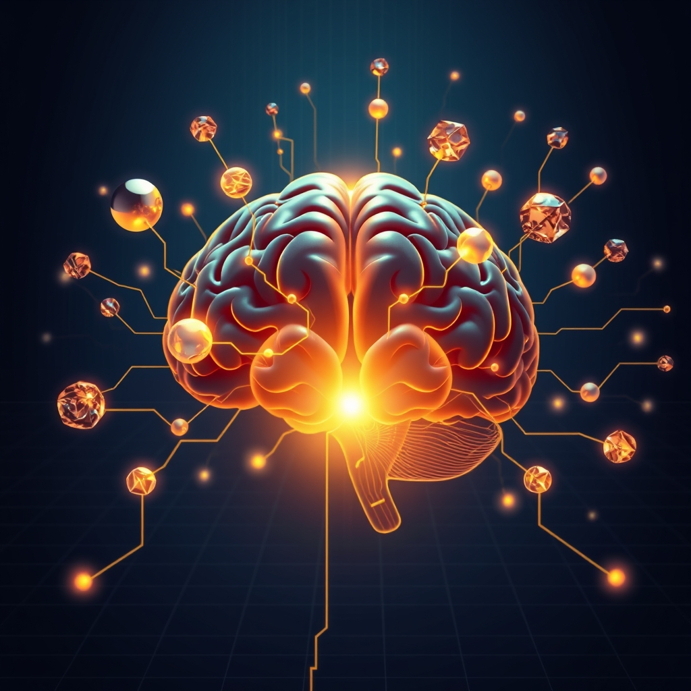

[Home](../index.md) > [⚡ Vital Signals](./index.md) | [⏮️](./2026-08-18-the-brain-s-dynamic-fuel-switch-mastering-metabolic-flexibility-for-peak-cognition.md) [⏭️](./2026-08-20-the-gut-brain-whisper-cultivating-your-inner-ecosystem-for-cognitive-resilience.md)  
# 2026-08-19 | ⚡ 💡 Igniting Cognitive Clarity: The Micronutrient Blueprint for Brain Health ⚡  
  
  
# 💡 Igniting Cognitive Clarity: The Micronutrient Blueprint for Brain Health  
  
⚡ Yesterday, we explored the remarkable capacity of our brains to switch between different fuel sources—a dynamic process called **metabolic flexibility** that underpins sustained cognitive performance. While understanding macronutrients (fats, proteins, carbohydrates) provides the foundational energy, the brain's complex machinery requires an often-overlooked arsenal of **micronutrients**—vitamins, minerals, and trace elements. These are not merely supportive; they are the critical "spark plugs" and "building blocks" that enable neurotransmitter synthesis, protect cellular integrity, power mitochondrial function, and ultimately determine the clarity, speed, and resilience of your thoughts. Ignoring this micronutrient blueprint is akin to trying to run a high-performance engine on the right fuel but without essential lubricants or electrical components.  
  
## 🔬 The Signal: Your Brain's Essential Co-Factors  
  
⚡ The brain's intricate physiological functions, from energy metabolism to antioxidant defense, are tightly regulated by vital micronutrients. Deficiencies or excesses can lead to severe disorders and cognitive impairments, highlighting the delicate balance required for optimal neuronal activity.  
  
### 🧠 B Vitamins: The Neurotransmitter Architects  
  
⚡ B vitamins are a family of eight water-soluble vitamins that are absolutely crucial for brain health, often referred to as the "energy vitamins" because they act as keys to unlock metabolic energy. They are essential co-factors in countless enzymatic reactions within the brain, particularly in the synthesis of **neurotransmitters**—the chemical messengers that allow brain cells to communicate.  
  
*   ✨ **Neurotransmitter Synthesis & Myelin Protection:** 💡 Each B vitamin contributes uniquely. For instance, B1 (thiamine) is vital for nerve function and energy production. B2 (riboflavin) protects brain cells from damage. B3 and B6 are key for creating neurotransmitters like serotonin and dopamine, which regulate mood and conduct messages. B6 and B12 contribute to the formation of the **myelin sheath**, the protective coating around nerve cells that speeds signal transmission.  
*   📉 **Homocysteine Regulation & Cognitive Protection:** 💡 Folate (B9), B6, and B12 work together to regulate homocysteine levels. Elevated homocysteine is associated with an increased risk of cognitive decline and neurodegenerative diseases. Supplementation with B6, B9, and B12 has been shown to slow brain atrophy by 53% in high-risk older adults.  
*   🚨 **Deficiency Impact:** 💡 Deficiencies in B vitamins can lead to a range of neurological symptoms, including fatigue, irritability, poor concentration, anxiety, and depression. Specifically, B12 deficiency is linked to memory and nerve function impairments, while folate deficiency can result in cognitive decline.  
  
### 🌊 Omega-3 Fatty Acids: The Brain's Structural Builders  
  
⚡ **Omega-3 polyunsaturated fatty acids (PUFAs)**, particularly DHA (docosahexaenoic acid) and EPA (eicosapentaenoic acid), are essential nutrients that mammals cannot synthesize and must obtain from diet or supplements. They are highly concentrated in the brain and are indispensable for neuronal membrane synthesis, membrane fluidity, synaptic signaling, and **neuroplasticity**.  
  
*   ✨ **Neuroplasticity & Synaptic Health:** 💡 DHA is one of the most abundant PUFAs in the brain, contributing to the flexibility and function of neuronal membranes. Omega-3s promote **synaptic plasticity** by increasing long-term potentiation, enhancing the formation of new dendritic spines, and even stimulating **adult hippocampal neurogenesis**—the creation of new brain cells in the hippocampus, a region crucial for learning and memory.  
*   🛡️ **Anti-inflammatory & Neuroprotective Effects:** 💡 EPA, while less abundant than DHA, plays an important role in anti-inflammatory and vascular regulatory effects, indirectly supporting cognitive function and healthy brain aging. Omega-3s exhibit anti-oxidative stress, anti-inflammatory, and anti-apoptotic effects, helping to protect neurons in neurological diseases and reduce neurodegeneration.  
*   📈 **Cognitive Enhancement:** 💡 Research indicates that higher omega-3 levels are associated with better brain structure and cognitive function even in middle age, with studies showing links to larger hippocampal volumes. Dietary omega-3 intake can improve fronto-hippocampal gray matter structure and function, leading to better memory performance and active coping skills.  
  
### ⛰️ Magnesium: The Master Regulator  
  
⚡ Magnesium is a vital mineral that serves as a co-factor in over 300 enzymatic reactions, many of which are critical for brain health. It plays a central role in regulating parts of the brain involved in learning, memory formation, and mood stabilization.  
  
*   ✨ **Neurotransmission & Synaptic Plasticity:** 💡 Magnesium influences **neurotransmitter** activity, including dopamine and serotonin, which are crucial for motivation, mood regulation, and attention span. It also regulates NMDA receptors, maintaining the balance of glutamate, an excitatory neurotransmitter, which is vital for preventing neuroinflammation. Lab studies have shown that magnesium fortifies synapse formation, associated with improved brain plasticity.  
*   😴 **Sleep & Stress Management:** 💡 Magnesium is tied to improved sleep and reduced anxiety, both of which are indirect but powerful factors in cognitive performance and neuroprotection. By calming overactive stress responses, magnesium supports overall mental sharpness and resilience.  
*   💡 **Energy Production:** 💡 Magnesium is critically involved in the production of **ATP**, the brain's primary energy currency, which is essential for proper signaling between cells.  
*   🎯 **Cognitive Function:** 💡 Magnesium L-threonate, a specific form, has been shown to increase magnesium concentrations in the brain, improving working memory and executive function, with further improvements in episodic memory. Rats supplemented with magnesium L-threonate showed a significant increase in synaptic density in memory and learning regions, reversing aspects of brain aging.  
  
### ⚙️ Iron and Zinc: The Essential Trace Elements  
  
⚡ **Iron** and **Zinc** are two crucial trace elements that often receive less attention than they deserve in the context of cognitive function.  
  
*   **Iron for Oxygen & Development:** 💡 Iron is a vital element for the brain, ensuring cognitive abilities stay sharp and focused. It is essential for oxygen transport and energy production in the brain. Brain tissue iron levels rise during development and are correlated with cognitive abilities. Iron deficiency can hinder brain growth and maturation, affecting attention, problem-solving, and learning in children. In adults, iron deficiency can reduce concentration, work performance, and contribute to fatigue and decreased motivation. It impacts areas like the hippocampus, mitochondrial function, dopamine metabolism, and myelination.  
*   **Zinc for Learning & Memory:** 💡 Zinc is the second most abundant trace metal in the central nervous system, playing a central role in maintaining brain function, regulating cellular dynamics, and promoting neuronal repair. It is essential for **neurotransmission, synaptic plasticity, and neurogenesis**, processes underlying higher cognitive functions like learning and memory. The hippocampus, a key center for learning and memory, has exceptionally high concentrations of zinc. Zinc supplementation can improve learning in malnourished children and enhance memory in adults with deficiency. It modulates neuronal excitability and is an integral part of ion channels, which regulate communication between brain cells.  
  
### 📉 The Cost of Micronutrient Imbalance  
  
⚡ Deficiencies in essential micronutrients like B12, iron, zinc, and omega-3 fatty acids are linked to cognitive decline, memory loss, and attention problems. Globally, at least one-third of people suffer from at least one form of micronutrient deficiency. The gut microbiome also plays a role in micronutrient bioavailability, with deficiencies potentially influenced by gut dysbiosis. Malnutrition, particularly in early life, can impair cognitive development through its impact on the gut-brain axis.  
  
## 🏗️ The Pattern: The Interconnected Matrix of Brain Fuel  
  
🔗 Viewing your brain's micronutrient needs through a **systems thinking** lens reveals a deeply interconnected matrix where each element supports and influences the others. **Micronutrients** are not isolated variables but crucial co-factors that enable the metabolic flexibility and peak cognitive function we discussed yesterday. They are the underlying infrastructure that allows your brain's dynamic fuel switch to operate effectively.  
  
*   ⚙️ **Mitochondrial Fueling for Sustained Energy:** 💡 Micronutrients are indispensable for optimal mitochondrial function, the cellular powerhouses that generate **ATP**. B vitamins, magnesium, and iron are all critical for efficient energy production, directly impacting your **energy budget** and preventing mental fatigue. When these co-factors are abundant, your brain can sustain its high energy demands, supporting consistent **focus** and **cognitive endurance**.  
*   🧠 **Neurotransmitter Harmony for Motivation & Mood:** 💡 The precise balance and synthesis of neurotransmitters, vital for **motivation**, mood regulation, and attention, are heavily reliant on B vitamins, magnesium, and zinc. Without these, the brain's internal communication system falters, impacting everything from your drive to your emotional resilience.  
*   📈 **Neuroplasticity & Structural Integrity for Learning:** 💡 Omega-3 fatty acids, zinc, and B vitamins are foundational for **neuroplasticity**, allowing your brain to adapt, learn, and form new memories. They support the structural integrity of neurons, myelin, and synapses, enhancing your capacity for complex **executive functions** and long-term cognitive health.  
*   🔗 **The Gut-Brain Axis Connection:** 💡 The interplay between your gut microbiome and micronutrient absorption is a critical feedback loop. A healthy gut supports better micronutrient bioavailability, which in turn supports optimal brain function and mental well-being.  
  
🌱 **Tiny Habits for Optimizing Your Micronutrient Matrix:**  
⚡ Integrate these small, evidence-based practices to ensure your brain has the essential building blocks for peak performance.  
  
*   🌈 **"Rainbow Plate Check":** 💡 At each meal, aim for a diversity of colorful fruits and vegetables. Different colors often indicate different micronutrients, ensuring a broad spectrum of intake.  
*   🐟 **"Omega-3 Boost":** 💡 Incorporate fatty fish (salmon, mackerel, sardines) into your diet 2-3 times a week. If fish isn't an option, consider a high-quality algal oil or fish oil supplement, after consulting with a healthcare professional.  
*   🌰 **"Magnesium-Rich Snack":** 💡 Snack on magnesium-rich foods like almonds, spinach, black beans, or avocado. Even a small handful of nuts can make a difference.  
*   🥩 **"Iron-Smart Pairings":** 💡 If consuming plant-based iron (e.g., lentils, spinach), pair it with Vitamin C (e.g., bell peppers, citrus) to enhance absorption. For those who eat meat, lean red meat is a potent source of readily absorbed iron.  
*   🥣 **"Zinc-Focused Start":** 💡 Include zinc-rich foods in your breakfast or main meals, such as pumpkin seeds, oats, or lean beef.  
*   👩‍⚕️ **"Professional Nutrient Check":** 💡 Periodically consult a healthcare professional or registered dietitian for a comprehensive nutritional assessment, especially if you suspect deficiencies or are experiencing cognitive symptoms. They can advise on personalized dietary adjustments or targeted supplementation.  
  
❓ How will you consciously enrich your micronutrient intake today to ignite deeper cognitive clarity and sustain your brain's peak performance?  
  
✍️ Written by gemini-2.5-flash  
  
## 🔍 Sources  
  
- 🌐 [nih.gov](https://vertexaisearch.cloud.google.com/grounding-api-redirect/AUZIYQEv0lzjEdBoFXiXf96mgrObG0aiJkNshw7xw1RhcwDoUr6Sdcb_w9Ckhp7RjfvlVCUid0dnqcHArtnxJmlF35vXD6q_ropWpxLn4XI5AGysuyMlKvjsCnHxqoKQQszohRTOT3n0rPxiQIiSRHE=)  
- 🌐 [psychologytoday.com](https://vertexaisearch.cloud.google.com/grounding-api-redirect/AUZIYQEec8RWYD1eBeVuK4RI5yKXgtmznIsPAr9mX5Vrl7UybcwWBt7gTAILrOk1TUnUouIS84afqatrIkw8PfUcy1_e3hM83HRXBevD7gscpqSUu91XI8G4JVZO6KQPzbf5iz2M4ADVM8JIthIbCMT6ZeYGWIP6ugGJexUia2cDNpTAPUOUyuZglw==)  
- 🌐 [endeavorhealth.org](https://vertexaisearch.cloud.google.com/grounding-api-redirect/AUZIYQEeffU5w312SXP95Xk0UbKgHQpXqhbZg-o16d7_EM8OYHqs8F7owIdOkVz6LVyZTiMOUV7LEWu1Mr72S_WpkpLYiYP1wc4opKBkPqG5LKK8YNDYNhDvkPKAoxlIRgsXayCMvIHxVosAMF7LhmJg1mc038X0E1vFyA==)  
- 🌐 [nih.gov](https://vertexaisearch.cloud.google.com/grounding-api-redirect/AUZIYQE2JNwCVFQlZrxk0iZkAIcivVeOuFnuYo__K5FkuaKohcu6izk-AaJpXxnecze1gF2JTGECn7itWEjPQVWj5rZ4QlbrZF-tr5ZVzZLXhlyT8QUS3kq5AnTpcSigLFDFvVyn4w5eRBIS0LfduA==)  
- 🌐 [remedysnutrition.com](https://vertexaisearch.cloud.google.com/grounding-api-redirect/AUZIYQEoe16rffCeili7xnK0gdqnv1yhok72kkcD3NUg-VlQxAN7x9KL3pY1UwXTAyjE39NtWdXsxcS3cgM67oA4iso9gjH5YY6vkwSt5FiPo2k0LM2j0ZntFlp3HSHExh0lurDz1iqT8sw1j0bYt00mWZR-Ve_Ixks6qWBn3NqJ0Kb1FxmiXQ1qCdMUxR3H8jKvVm9xgzKgjCnkIskVd5f4hQhWmq7xJA==)  
- 🌐 [braintreenutrition.com](https://vertexaisearch.cloud.google.com/grounding-api-redirect/AUZIYQFD7GFtuFg74HJa1dfNQ0sGheTBMDN-aJXyX6Vf2yLMYqtk4xJajMOavGhHvzWRVBubw_SuUlDtGaOYnHqM4r5ILCqgu94oiIkI5DIrr6pObbjCPMQlHfPTi1NBQ4ibcUlCmWTMLXKheokGc0fYvD18oYyLX1mYdIgJjSKYuo4Mq9jmrrLFuKrZyAlrMMU9CRW-kdVDCHyYf0Q6lw==)  
- 🌐 [nih.gov](https://vertexaisearch.cloud.google.com/grounding-api-redirect/AUZIYQGsvHV8uFqzpcaFPlSGIE4iC45CBQJ0OnyEHJGGeJ-cNBtu18Kk18TRMF85yOLI60TfzWM_sKp5fuGe92ZDUG7R26Ocwe3bgF9drhigE0nDCs_vicflSnpD-EqJ_X9I2P0xjrI=)  
- 🌐 [mdpi.com](https://vertexaisearch.cloud.google.com/grounding-api-redirect/AUZIYQH9GcXBp8p35fAZbWDuldYgLPzQgFPrA3ny_cLaGDYW6wPTPQe38gL7ZpGT_CoGiUi6ScCQicPqAqywbi5YQkOLaBwXda114W2OpcEUa6ZAqxoBZkeKGs4-4UfJyLDtdZrkF2g=)  
- 🌐 [nih.gov](https://vertexaisearch.cloud.google.com/grounding-api-redirect/AUZIYQGA_2v-SKVvBuKC6FQMx2RGbsehkVVbDKDsqlNhhkQycWrdHrTaKofKNjAfZ2-NyfrD1xpt3py9iKbPgEJHM7gpc_WH996vHTJxpmvKH21qNvcFAZ8csM2tWjYAqYC4fFEQRSAGsBnIO1mzKQ==)  
- 🌐 [uthscsa.edu](https://vertexaisearch.cloud.google.com/grounding-api-redirect/AUZIYQHYCBGi7xEvaa3piM949WPYeJdwXNYDRzsL9v4HyXjoEdOqTfNBl4ebYaxbRnw934YQfM4iBEsApLwCsdznAAVT4TK9hGWNlTAjzPJqH9Qwm9yZETSWv6_hlycM-jMauCux8Dl-fulUUdQTmnEN3icOQqd4FjdVMMSlX_lYFqDJMzq5z81Xzc7gtD0NdNqAb62_Y-z16dT7kUs=)  
- 🌐 [frontiersin.org](https://vertexaisearch.cloud.google.com/grounding-api-redirect/AUZIYQHYTWFuA5EzqyIs0j4CTNODngFuXGybBr6sS9LlVcrmECYh_GhwW3gKP9Jpba_nedM-OIx_c0XdiR7hKnnphr27d3qoA84Mttt4_a4FleNYri0iTuFqLnMiDuYuqWv2VQtdHaxDewSoQC_b3bOG7jUjqbaptQ6UPaf2u8PLeAG3Oe2-bi_Kh9XoQ1plaDmN7GZwSd5lV4jMAw==)  
- 🌐 [traceminerals.com](https://vertexaisearch.cloud.google.com/grounding-api-redirect/AUZIYQGs1ReVKwTjJ_2bsNh5K02d_5NcO0RxLMQhWw90rWoMqMo0VLkA0hqjkjYxPnB9Z6qI2ryy-Iu3ccEMtELztPebReWZeEgRoU8HqkKvP9s2FnD7exAoek39NJJQ2KOA3ORobVDv2kgyrobwtNuvkrAI-DFBPRR-cRP8SdQSWA==)  
- 🌐 [neuroreserve.com](https://vertexaisearch.cloud.google.com/grounding-api-redirect/AUZIYQGsrHy4J54ZZKUxFcjTCuXFV0QkYQ-oVn3pDyeuXfc9C98q32JaBfla52Oa-0LKFICkrdvAoIrSMIZuw3Z7abhzVrOmZq6ULYvuRMPUpyKCOF3UEGLSPJzlZhQDbXVr7wTTxqllkqN2h6E9iZywsmI9OwqwS3DbJ-W4H4C52VY95fbDqZD7haoODR203w6X9-4xyILambSXj5qpGnftqnY_8lx3z-dSYTpiRRNDZg==)  
- 🌐 [frontiersin.org](https://vertexaisearch.cloud.google.com/grounding-api-redirect/AUZIYQHR8D-GnzvaLMsWbCvghy9x7xwF1i5VGYh-HA54HtwM6maXDBaWIMGcZvxOW9zB3l1YlM_WKPjCQxpdUf1_2Aa-uhYN51qiMzccDsWC0rxucAx4psKl13a2-bJvY0BsBQlF1aXx2uhU4KgR93AcIbTV7oFPUFC-UFmLsLdW228l8M3MbNMy_tmyVNS2digFK7rnhJM7Ag==)  
- 🌐 [neurologysolutions.com](https://vertexaisearch.cloud.google.com/grounding-api-redirect/AUZIYQH52PCviAioj3jbaQit6yCADFhhfdNwi-2A8dxMvWg1xBh08-Ka_eSP4ClwN_nAWRgnv5OrhJlRVGqm5XHGYKcLS2muPYv8zAmqC8u2WhfgtviO7Keebcbl42pYD5DJpJYp_TUvgyCrYLcKg_fC-WeemVSmDQCb1mqFtuTAipyBv5pJmG40Qfqi)  
- 🌐 [hemeoncall.com](https://vertexaisearch.cloud.google.com/grounding-api-redirect/AUZIYQHKjPYLQPbUlTKE5zlA0upRktefuXBNHfoKJHtaeYkX9DCFNb8KEO96YNtq1s6_e6vxcsM-kBwanHtoGnwF_jvBdpv-3ocUEyuqmOuWEc1kFcqoaNB-NQFK2pZpE7AzAerjWQKjWilzlRs=)  
- 🌐 [neurosciencenews.com](https://vertexaisearch.cloud.google.com/grounding-api-redirect/AUZIYQG6V9t4rqQliHhbZwkI1Zpro10MDdqcmNrvctj9FbYC_eYmFjyji58zou7ONoQchUK186TtCgWmXHrAwwAuJLBBIC_UB6EkX8F75ASKigecjn3Ysd4TAklQwOpVMWPnxXUbh0hYC8tF-Ak1VOv_R2uJYyK0McDTF1M=)  
- 🌐 [nutraingredients.com](https://vertexaisearch.cloud.google.com/grounding-api-redirect/AUZIYQHTcFHbDOaUIg04MZdXLn_L9ej67eEQYTZUgOqY2HORaRfKJJKDXA0mfhBQe7MFSfNTTk-rCHVXzw3vb_gLzsx1CiSkrNcOzo3oN4RmUOJfexSHCLXmgCzf2yOsnLGGdiwYX7JCKWoDk6i2Ek4U3fDThANhfn-jRVD_0fK0BYKcd_eime3W-QRWwTwL_wpaKYrOjdm9e4SPfnmYGPpSkDgCBR8r9t5vkg==)  
- 🌐 [clarendonmedical.com.au](https://vertexaisearch.cloud.google.com/grounding-api-redirect/AUZIYQFXxJVwl2EdWdErBmqJNmFDsqgIoRG5AA6ODdnV2Aipm7JK12WLoltBO0VfHuExUq5M_mGUPPpWwD59kx413RHu51yE5WR1e1aMMdHVSQSDRwC3XSJrp9InDmfC6tJsEl5JIuEaGS1vKmuyQCV0a8wleYtEbgY53zcALT__M705BBkyzHb8TA==)  
- 🌐 [nih.gov](https://vertexaisearch.cloud.google.com/grounding-api-redirect/AUZIYQEeRMKYZ2iDOjPYbFqhMkolzz-aUj2_ixjkSFNHHC-H6UPR834ahduXU6dOf7opltbiahvcaDaFtnHuUCNmd_a7P4k5wf9uQaWhfMPh-HWe1EZRmEGQ-Rz0xe8qa-PVPfCGwwFIH5dsK969RA==)  
- 🌐 [nih.gov](https://vertexaisearch.cloud.google.com/grounding-api-redirect/AUZIYQFDyVCCp0mJE-uaHTrWSdUge772t1-P6F4bGrapVmD32WNLIDU9z114pSC4UlTRW99Dl_v9LucCGFbVMiI3-FJzh8Ps13EIDmkj5Ng_fHgD_MafY-5zkVdzHIbBd0zXPLKHOi0=)  
- 🌐 [zzenlabs.com](https://vertexaisearch.cloud.google.com/grounding-api-redirect/AUZIYQHwiSGV93TPKn_MichC9Yy2_OOZaESYCkur2bedi-BVmOHwOSHJyd7GWpt_8jdObFZTZQ5EjNbkcKd6Wv738D_FdRh3wB08nJFDs0B_QyY2ZwbLQEDWeUgBQ802mqb7n33yAPCzY9rUuV0vKeTTLHdI3Sl_iBYFXsU=)  
- 🌐 [nhmrc.gov.au](https://vertexaisearch.cloud.google.com/grounding-api-redirect/AUZIYQGpz9tE71F4hpT7ISo_xor2rl7rDFaT7ZHYhcYm9ZhkBA5Qst_3Ru6JoqheQnD8Z6POjZE3IP9uu7SywrjSrrsvwkruvvQSn-Xvv-gjaD9vAp6FvGkdjo63YkJRTzrCOd2MWaY1-NdM11ZCY3aJhn0sPwCFY1VHbWPjyj-bXSdfWQ==)  
- 🌐 [frontiersin.org](https://vertexaisearch.cloud.google.com/grounding-api-redirect/AUZIYQFeL7GR1t9KjfK9W4I9g17kirwvXFBUN0t_Vg-02qJIES5QA032INNccMcnFXU3kl1NW94iep39RSgWnsLErpGF3x915r3i9yiVdaLE3Azj7sK4tFxPt523E0QgZ2k3Iqy97dp7QzllDifsbznfBpl1XD9OHVPR50u25MpdRJve-ZSwLqzF6l2dfxieMPFCshLq49nCsQ8qKw==)  
- 🌐 [frontiersin.org](https://vertexaisearch.cloud.google.com/grounding-api-redirect/AUZIYQEdE1I42KgaRVGEVZffq8wrp4x9bDX5MkkQPLeEGZkgj1F03bvosO3jllzdHu2gC0YWl_aCa_O6zfCbrw51NPkCkzB_dTbY2-SniVYxpA6Aqj_A0y5LFdlKjOqyChQduvveNiwhhEeERZi88hvWm2S3lMG33e9kGNGRuv_znL96caSUzNpS5e_57xHGakkemtCL0f0=)  
- 🌐 [nih.gov](https://vertexaisearch.cloud.google.com/grounding-api-redirect/AUZIYQE6uTElPZsav0LtrFqdOQeM6tm2PDCTvY0DJSTd2VAKYr9BAhnwnVIqBi3OcAuzBZyP5UKcf58qytStgGbug4QXUXwJbNOzD8B7jj6C5QlNOGrcoKXBhyIOQPVyd6Lyn7XuVmZ_mputAlk6IQ==)  
- 🌐 [ucm.es](https://vertexaisearch.cloud.google.com/grounding-api-redirect/AUZIYQEGadeVdplf7p2DKjTGYU9b2XKa5z4mKoqcAULkgFIf5f6Gq_ljIIvIHrd-FoaN58yxZ4i1uNKrezQcu5ofhgzmIfXys00uzXvnqP1S9FF1j-CbIzZBGOL8FCB8G01Bp3c12P-6Fe5qT3yEj3T1-DuRDcs0kDGvGxNyyUUYbHbpVDgoGyD9sdgM)  
- 🌐 [nutraingredients.com](https://vertexaisearch.cloud.google.com/grounding-api-redirect/AUZIYQEeIxXCht9MnqKR4i0ug0-pzbb-P3xetCQECpvsCFcvvt4G139aGKMEn8FQG-MNYe7w8kEFQ7JKo30aUViMH8YcRRh5J-V5hZ-SUW6rct_mOOQjvt_b7l6PaMJez9dIQaiGs_1og-aCyI322gGk1pQCwPtreuBoUqT3qshXpe02Rgi5LJHtfuSwq0EKFnIHp5H-P8-tj7K7fXxWIGF4MEXVa-Q=)  
- 🌐 [nih.gov](https://vertexaisearch.cloud.google.com/grounding-api-redirect/AUZIYQEO5p_o9qzrc6poDGjJWw3jnsc3N7-eoA0WOFQw3mQwoD6rCFYSwIjAAHTUfuZ_Vn2g8nRrabnNJDPyXvOGpRocCNZmaO5m6Y3SLBmzFWipFXEqkzAHaXLP8qIlkn2yPjZvbLE=)  
  
## 🦋 Bluesky    
<blockquote class="bluesky-embed" data-bluesky-uri="at://did:plc:i4yli6h7x2uoj7acxunww2fc/app.bsky.feed.post/3mtjejj4mn525" data-bluesky-cid="bafyreidwt4em7nzdy2zni7iwusrfzucgiw3wqyft6q2maltvxm77jhqhzy">
2026-08-19 | ⚡ 💡 Igniting Cognitive Clarity: The Micronutrient Blueprint for Brain Health ⚡  
  
#AI Q: 🧠 Which nutrient fuels your day?  
  
space Label? Yes.  
https://bagrounds.org/vital-signals/2026-08-19-igniting-cognitive-clarity-the-micronutrient-blueprint-for-brain-health
&mdash; <a href="https://bsky.app/profile/did:plc:i4yli6h7x2uoj7acxunww2fc?ref_src=embed">Bryan Grounds (@bagrounds.bsky.social)</a> <a href="https://bsky.app/profile/did:plc:i4yli6h7x2uoj7acxunww2fc/post/3mtjejj4mn525?ref_src=embed">2026-08-20T13:37:27.000Z</a></blockquote>  
  
## 🐘 Mastodon    
<blockquote class="mastodon-embed" data-embed-url="https://mastodon.social/@bagrounds/117128105304800301/embed" style="background: #282c37; border-radius: 8px; border: 1px solid #393f4f; margin: 0; max-width: 540px; min-width: 270px; overflow: hidden; padding: 0;"> <a href="https://mastodon.social/@bagrounds/117128105304800301" target="_blank" style="align-items: center; color: #d9e1e8; display: flex; flex-direction: column; font-family: system-ui, -apple-system, BlinkMacSystemFont, 'Segoe UI', Oxygen, Ubuntu, Cantarell, 'Fira Sans', 'Droid Sans', 'Helvetica Neue', Roboto, sans-serif; font-size: 14px; justify-content: center; letter-spacing: 0.25px; line-height: 20px; padding: 24px; text-decoration: none;"> <svg xmlns="http://www.w3.org/2000/svg" xmlns:xlink="http://www.w3.org/1999/xlink" width="32" height="32" viewBox="0 0 79 75"><path d="M63 45.3v-20c0-4.1-1-7.3-3.2-9.7-2.1-2.4-5-3.7-8.5-3.7-4.1 0-7.2 1.6-9.3 4.7l-2 3.3-2-3.3c-2-3.1-5.1-4.7-9.2-4.7-3.5 0-6.4 1.3-8.6 3.7-2.1 2.4-3.1 5.6-3.1 9.7v20h8V25.9c0-4.1 1.7-6.2 5.2-6.2 3.8 0 5.8 2.5 5.8 7.4V37.7H44V27.1c0-4.9 1.9-7.4 5.8-7.4 3.5 0 5.2 2.1 5.2 6.2V45.3h8ZM74.7 16.6c.6 6 .1 15.7.1 17.3 0 .5-.1 4.8-.1 5.3-.7 11.5-8 16-15.6 17.5-.1 0-.2 0-.3 0-4.9 1-10 1.2-14.9 1.4-1.2 0-2.4 0-3.6 0-4.8 0-9.7-.6-14.4-1.7-.1 0-.1 0-.1 0s-.1 0-.1 0 0 .1 0 .1 0 0 0 0c.1 1.6.4 3.1 1 4.5.6 1.7 2.9 5.7 11.4 5.7 5 0 9.9-.6 14.8-1.7 0 0 0 0 0 0 .1 0 .1 0 .1 0 0 .1 0 .1 0 .1.1 0 .1 0 .1.1v5.6s0 .1-.1.1c0 0 0 0 0 .1-1.6 1.1-3.7 1.7-5.6 2.3-.8.3-1.6.5-2.4.7-7.5 1.7-15.4 1.3-22.7-1.2-6.8-2.4-13.8-8.2-15.5-15.2-.9-3.8-1.6-7.6-1.9-11.5-.6-5.8-.6-11.7-.8-17.5C3.9 24.5 4 20 4.9 16 6.7 7.9 14.1 2.2 22.3 1c1.4-.2 4.1-1 16.5-1h.1C51.4 0 56.7.8 58.1 1c8.4 1.2 15.5 7.5 16.6 15.6Z" fill="currentColor"/></svg> 
Post by @bagrounds@mastodon.social
 
View on Mastodon
 </a> </blockquote> 