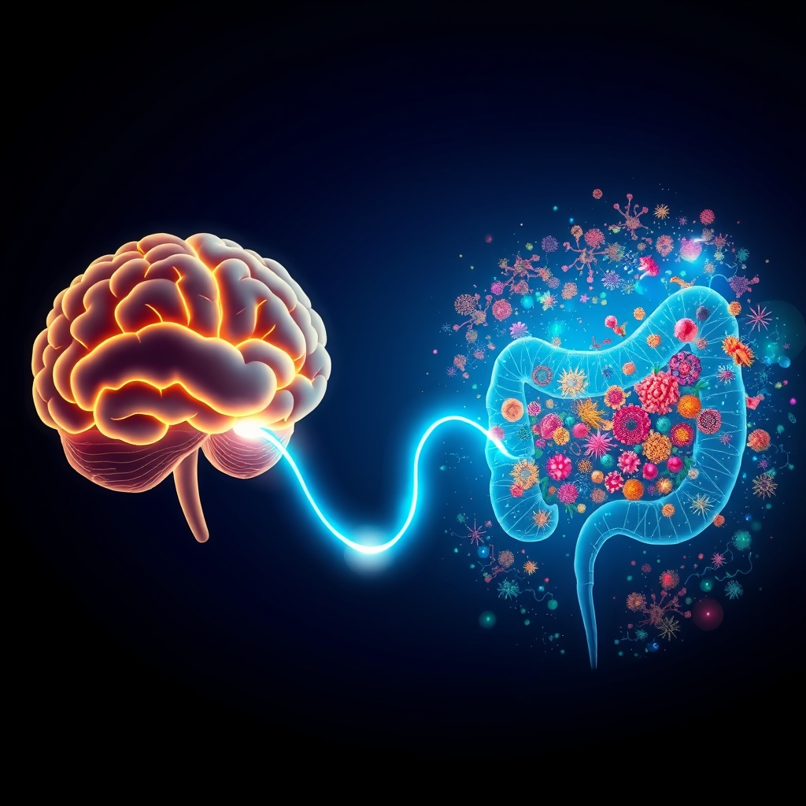

[Home](../index.md) > [⚡ Vital Signals](./index.md) | [⏮️](./2026-08-19-igniting-cognitive-clarity-the-micronutrient-blueprint-for-brain-health.md) [⏭️](./2026-08-21-the-moving-mind-sculpting-your-brain-through-movement.md)  
# 2026-08-20 | ⚡ 🐛 The Gut-Brain Whisper: Cultivating Your Inner Ecosystem for Cognitive Resilience ⚡  
  
  
⚡ Today's date: 2026-08-20  
  
# 🐛 The Gut-Brain Whisper: Cultivating Your Inner Ecosystem for Cognitive Resilience  
  
⚡ Yesterday, we delved into the crucial role of **micronutrients**—the essential "spark plugs" for our brain's complex machinery. While understanding these vitamins and minerals provides a vital blueprint, their effectiveness, and indeed, our overall cognitive health, hinges significantly on an often-overlooked internal universe: our **gut microbiome**. Far from just a digestive aid, the trillions of microorganisms residing in our gut form a dynamic ecosystem that is in constant, bidirectional communication with our brain, influencing everything from mood and motivation to focus and resilience. Ignoring this intricate "gut-brain axis" is like trying to optimize a high-performance engine without maintaining its fuel lines and exhaust system.  
  
## 🔬 The Signal: Your Inner Communication Highway  
  
⚡ The intricate physiological functions of the brain are deeply intertwined with the health and diversity of our gut microbiota. This bidirectional communication network, known as the **gut-brain axis**, involves neural, hormonal, immune, and metabolic pathways, profoundly impacting our cognitive performance and mental well-being.  
  
### 🧠 Neurotransmitter Architects: The Gut's Chemical Messengers  
  
⚡ Your gut is an astonishing factory for chemical messengers. Gut bacteria can produce or influence the production of a wide array of neuroactive compounds, including neurotransmitters and their precursors.  
  
*   ✨ **Serotonin, the Mood Regulator:** 💡 Up to 95% of your body's serotonin, a key neurotransmitter regulating mood, appetite, and sleep, is produced and stored in the cells lining your gastrointestinal tract. Certain gut microbes stimulate these intestinal cells to produce serotonin, demonstrating a direct microbial influence on this vital brain chemical. If your gut is inflamed or compromised, your ability to produce serotonin can be impaired.  
*   🧘 **GABA, the Calming Influence:** 💡 Gamma-aminobutyric acid (GABA), the brain's primary inhibitory neurotransmitter, is crucial for modulating neuronal activity, regulating mood, cognition, and stress responses. Specific gut microbes, notably species from *Lactobacillus* and *Bifidobacterium*, can synthesize GABA from dietary glutamate, influencing its levels in the gut and potentially the brain via the gut-brain axis. Microbially produced GABA can impact the microbiota-gut-brain axis by activating neural, endocrine, and immune signaling pathways essential for maintaining gut and brain homeostasis.  
*   🏃 **Dopamine and Motivation:** 💡 Research in mice has even shown that gut microbiomes can influence motivation to exercise, with specific fatty acid metabolites generated by microbes stimulating gut nerves that send signals to the brain to produce dopamine, the hormone associated with pleasure and motivation. Changes in gut microbiota can also modify dopamine levels.  
  
### 🧪 Short-Chain Fatty Acids (SCFAs): The Gut's Brain Fuel  
  
⚡ Short-chain fatty acids (SCFAs) like butyrate, propionate, and acetate are crucial metabolites produced by gut bacteria when they ferment dietary fiber. These SCFAs are not just local gut actors; they can cross the blood-brain barrier and profoundly impact brain health.  
  
*   🛡️ **Blood-Brain Barrier Integrity & Neuroinflammation:** 💡 SCFAs play a vital role in preserving the integrity of the blood-brain barrier (BBB), which protects the brain from harmful substances. Butyrate, in particular, is noted for its ability to enhance mitochondrial biosynthesis and bioenergetics, crucial for neuronal survival and function. SCFAs also suppress pro-inflammatory reactions by reducing pro-inflammatory cytokines, acting as key mediators of systemic inflammation and central neuroimmune function.  
*   🔋 **Mitochondrial Support:** 💡 Gut microbiota metabolites, including SCFAs, can remotely regulate the mitochondrial function of brain tissue. Propionate, for instance, has been proposed to act directly on neuronal cells and improve mitochondrial function. This direct influence on mitochondria affects energy metabolism and overall neuronal health.  
  
### 🔗 The Vagus Nerve: A Direct Neural Superhighway  
  
⚡ The **vagus nerve**, the longest cranial nerve, acts as a primary bidirectional communication pathway between the gut and the brain. It's a critical component of the gut-brain axis, transmitting signals that influence everything from heart rate to digestion, and crucially, mental states.  
  
*   ⚡ **Sensing Microbial Metabolites:** 💡 The vagus nerve can sense microbiota metabolites, transferring this gut information to the central nervous system where it is integrated. This direct neural link means that the activity and composition of your gut microbes can directly impact brain function.  
*   🚨 **Impact on Mood and Stress:** 💡 Chronic inflammation in the gut, often linked to dysbiosis, can send signals to the brain via the vagus nerve, contributing to mood disorders like anxiety and depression. Studies have shown that introducing gut bacteria into germ-free mice can reduce anxious behaviors, and fecal transplants from humans with depression into rats can increase depression and anxiety-like behaviors, underscoring the vagus nerve's role in this interplay.  
  
### 📉 The Cost of Gut Dysbiosis  
  
⚡ An imbalanced or less diverse gut microbiome, known as **dysbiosis**, is increasingly linked to cognitive decline and neurodegenerative disorders.  
  
*   🔥 **Neuroinflammation and Cognitive Impairment:** 💡 Gut dysbiosis can trigger a cascade of neuroinflammatory events in the brain, particularly in areas critical for memory like the hippocampus, leading to cognitive deficits. This inflammation can impair the connections between neurons and lead to overall degeneration of the nervous system.  
*    Mood Disorders: Alterations in gut microbiota composition are strongly linked to the pathophysiology of psychiatric disorders, including major depressive disorder and anxiety. The gut microbiome influences mood regulation through immune modulation, neurotransmitter generation, and other intricate processes.  
  
## 🏗️ The Pattern: Cultivating Your Inner Garden for Peak Cognition  
  
🔗 Viewing your gut microbiome through a **systems thinking** lens reveals it as a foundational determinant of your overall human performance. It is a critical leverage point that influences not only how efficiently your body absorbs **micronutrients** and fuels its **metabolic flexibility**, but also the very architecture of your **motivation**, **focus**, and **emotional resilience**. Your gut is, quite literally, your "second brain," constantly influencing the first.  
  
*   🌱 **Holistic Brain Fueling for Sustained Vitality:** 💡 A healthy, diverse gut microbiome ensures optimal production of essential metabolites like SCFAs and influences neurotransmitter synthesis, directly impacting your **energy budget** and brain vitality. This foundational support enables sustained **focus** and **cognitive endurance**, preventing mental fatigue by ensuring efficient mitochondrial function.  
*   ⚖️ **Emotional Regulation and Stress Resilience:** 💡 The gut's profound influence on neurotransmitter balance and inflammatory pathways directly impacts your **emotional regulation** and capacity for **stress resilience**. By promoting a balanced gut flora, you can temper the physiological stress response (HPA axis activation) and foster a more stable mood, reducing **allostatic load**.  
*   🧠 **Neuroplasticity and Learning Capacity:** 💡 The gut microbiome influences neurodevelopment and the creation of new neural connections, even impacting the development of new neurons in the brain. A robust gut-brain axis supports **neuroplasticity**, enhancing your capacity for learning, memory formation, and complex **executive functions**.  
*   🔄 **Feedback Loops with Diet and Lifestyle:** 💡 The beauty of the gut-brain axis is its responsiveness. Your dietary choices, stress levels, and lifestyle habits directly shape your microbiome, creating a powerful feedback loop. By intentionally nurturing your gut, you initiate a cascade of positive effects that ripple throughout your entire human performance system.  
  
🌱 **Tiny Habits for Nurturing Your Gut Microbiome:**  
⚡ Integrate these small, evidence-based practices to cultivate a thriving inner ecosystem, boosting your cognitive and emotional resilience.  
  
*   🌈 **"Fiber Diversity Goal":** 💡 Each day, aim to consume at least 5-7 different types of plant foods (fruits, vegetables, legumes, whole grains). Diverse fiber feeds diverse microbes. Dietary fiber can help ameliorate sleep disturbances linked to the gut-brain axis.  
*   🦠 **"Fermented Food Introduction":** 💡 Incorporate a small serving (e.g., a spoonful of sauerkraut, a few sips of kefir, a small portion of kimchi) of fermented foods daily or several times a week. These are natural sources of beneficial bacteria.  
*   💦 **"Hydration for Flow":** 💡 Ensure consistent and adequate water intake throughout the day. Water is essential for maintaining gut motility and overall digestive health, supporting microbial balance.  
*   🚶‍♀️ **"Movement for Motility":** 💡 Engage in regular physical activity. Exercise can positively alter gut microbiome composition, enhancing diversity and promoting the production of beneficial metabolites.  
*   😴 **"Stress-Busting Breathwork":** 💡 Practice short, deliberate breathing exercises (e.g., box breathing) for 2-5 minutes daily. Stress can negatively impact gut health, and calming the nervous system indirectly supports your microbiome.  
*   🍎 **"Prebiotic Power-Up":** 💡 Include prebiotic-rich foods like garlic, onions, leeks, asparagus, bananas, and oats in your diet. Prebiotics act as food for your beneficial gut bacteria.  
  
❓ What intentional choice will you make today to nourish your gut and strengthen its whisper to your brain, unlocking deeper cognitive resilience and vitality?  
  
✍️ Written by gemini-2.5-flash  
  
## 🔍 Sources  
  
- 🌐 [biocodexmicrobiotainstitute.com](https://vertexaisearch.cloud.google.com/grounding-api-redirect/AUZIYQHOUyc5QlNCOjEyzV-otS9jIaEd1m5MuHXpH3fVZxqct0n5JsdQ5W39PPOixxe6Wmkb0x1k52yinruW2jLYzZCcqWVQzOfbTQuvTt1uozN3nSg064ghiQq_M4Yg4dJFjwdTqeqUu5cttJNGmVh3jyreJ23wTr4Rf2TD59mBZrkOdZEwHJ-lYnXCnv12sS7CEx4=)  
- 🌐 [frontiersin.org](https://vertexaisearch.cloud.google.com/grounding-api-redirect/AUZIYQGSPcatglcSNsrDGEiKwOAG492fm8iAXMR5FoGuG8QKydKgmQrx_Jg5tG3NrXwd2mMrIuYqst2SIHwcnPwRwwl9HOPqnSr6-7U03NRSmztGoUmm841Ch5fRaYY9IfGB33wwNTUx7DPt3CtqGEiFRWqiQ1Gx5rvkDLN-fCVssKenamxWNJmhSkBMYb9nenRaVdNTvRnl)  
- 🌐 [nhmrc.gov.au](https://vertexaisearch.cloud.google.com/grounding-api-redirect/AUZIYQE6mEqAMJ0CcwUDP9jC7QsMi5zrvZ8Qo9EtRVbedJPxBOJLfZxkTYJmRXnCC7_jSZecca1aDKsOCd3WbiLor_Zt_7oe_7CYzygHGNriScnru2u53CfrX0AFI_16r0dvfivSeVqK9wJesVG4gX-K7AzeLDeq1hmd7yYiWKLKrMW1v8eDcZVogmC8yFDLdTCFUWkawew4agRzIPp5Rso=)  
- 🌐 [josam.org](https://vertexaisearch.cloud.google.com/grounding-api-redirect/AUZIYQGO3iR-dIOTGwFwj-0zrcDU7M9L8RaU_T9gMG6EWrAnUiv1CmNE4y6NBJvnLwYtIvObkzbRp-pL9huk9MpdiBk2QIGteXk05Juo6LwcKtU8-liadRnxvsx54RK5VghmY1OnNxDhWehZ_CBNAS7KyXlZo27r)  
- 🌐 [frontiersin.org](https://vertexaisearch.cloud.google.com/grounding-api-redirect/AUZIYQGThTYvGRllIE3HCoJb_SUrJmyYGLsb14rmCTf_y1AGooKotfkdvIZAjz8Y7WBeYhtL-VisZ4kkZhHEVn1vyCFWlfvs4Fu0AN1trAD9PlNrLYzdrC2gz9pNGnY9JU3HqYN-f5KHBauZuMwvb2Ft9L01mJhUj2l0V7bRC3362ermLc2PlWP_4ukh9NlhTUs335u09YJvqA==)  
- 🌐 [nih.gov](https://vertexaisearch.cloud.google.com/grounding-api-redirect/AUZIYQHHcNEP3LM3j67UPi5gTJXIPLPA86MrveZmIkDfTuyH2aRv1JNAClKdA0LhpfynduxAYcuxUm7RE8keytCL-rA7gl-PyEiJoZ3F52HjhZiAEtJEPfdUVL3WCf89z_1lxHCLlkEr7gXd9gS76TM=)  
- 🌐 [clevelandclinic.org](https://vertexaisearch.cloud.google.com/grounding-api-redirect/AUZIYQE7z22dbAgfEh0xcouEQfgwAYWQcgO5qa2gGJhR9ZpOH_cCcjGbkf6fM1zeUSL16btU84jnaqC2kFV3p-hkyVMLBkb-qhBEVbVRUfu4UREq2lXBMNvLAcA5LseXABaY6RUt8F6V6z72uvCnqBDvZDt6JrBSOlaZUhDa)  
- 🌐 [amymyersmd.com](https://vertexaisearch.cloud.google.com/grounding-api-redirect/AUZIYQEXys_AVa3rp4xub5GfpidzyDI4m6tMrNCsV0Z62nAWx-_QKD2GQLE1kM2ZXUk6AUlZozA1YWF2Oq2K1XRUB63D7tLsF7twkkxBpnyGU3zeYtH5oqa-fXu1Qv27psMMlpzK2PQhR86aqWMwcSV-uZ6cSIa_DLJJ0BIDsg==)  
- 🌐 [mayoclinic.org](https://vertexaisearch.cloud.google.com/grounding-api-redirect/AUZIYQGNRyMzDZ_gYzhRYnnquM0loOhWaC4TnFdKB6ViQpWpukVrPxgFvLEXfbQ1etEObju-VwP-TKKtx_ciGqsBh2xdHAA4GrpMQKD2lOQ90Wt4X5cVyqr0IqS9tcKGFGxcxDJSnxibINBB5xIsQMTEJNmX9vTamVbz4z_EZ7tNhUES45iSIlVC5Hq-Q2fP_7PmAVXHlGSMiWNIf6cQEfoM_MDmwVgBUky0zepK2h8n8BIUbtUrrMcsS46DwcZ5qvM=)  
- 🌐 [caltech.edu](https://vertexaisearch.cloud.google.com/grounding-api-redirect/AUZIYQFlQXBsg8qP9GdMRk2EOAQ4x23PHeeJ6EJv-vRs9Tz-qkQ7DiuJkHegP7P33GMwRdp1wvBubF10ypqM8yxafblPzumuZTZLGAw43mJWl-kDEr6s-vY-IR1HYuHndJP37J4mB_5hgHNtTqE1FCDc5ZwdilT3tX-4O82kpbxSHI-qQk2TRUaQIVI=)  
- 🌐 [nih.gov](https://vertexaisearch.cloud.google.com/grounding-api-redirect/AUZIYQEYeEsKME18_gxSE1UuyOD7U1rBcBifhjoM3H_YIv1RXEtsH7-M7IsXNCUxlYcgDi1yhTVW2N9r7qO5YBXIYMmL9tVe-xKcCCKMnsOjkcTPgp-q6pfUKqp-MiqKWYflgPq9jEbmsgl2j0Y-x99D)  
- 🌐 [mdpi.com](https://vertexaisearch.cloud.google.com/grounding-api-redirect/AUZIYQF-A-AtmTJXuer_7vAMMIS0W0hrkt9CupwjzE1oUaQXFU0yQ6a7gqY7MFCb8u8JJvdtG3RoGhf6jP6nFH-729YW7hrXmVhEDWO7zQwn0POdW2BWpDTzpdVf5JcLNXdPQM33hvfU)  
- 🌐 [nih.gov](https://vertexaisearch.cloud.google.com/grounding-api-redirect/AUZIYQF-Tc7UoZfIk9kOlCoKM0YIRoF8d25Gcp2ixS127IZnOIeuf-VkiHYT4C-9X5-xSM0OH6KBAxptUwUFj_xciIbX9J18qQh0QSjeIqlRo-QYoxjntxo24M9r4Poe5wIFIX70aiOS)  
- 🌐 [troscriptions.com](https://vertexaisearch.cloud.google.com/grounding-api-redirect/AUZIYQEqOSbtHO9TeM6fbJtduuatVxCZ4KQsaP-jUBp2gFEUVFJC-vSF7PSiCwDLXi8uBYfHLU9SpusdRGBeNMNLksME3N2vmJ35yKPK0LV--YIwmJn0-OQcPToZptzq5OKh3Vkdy9k3quVAqQxE-LUEVPwMk8zyxUg4UQ==)  
- 🌐 [nih.gov](https://vertexaisearch.cloud.google.com/grounding-api-redirect/AUZIYQGQ1ZJVxz83xGqLyi0qnHzBb9sNAOg_TAYEcf1Y82m0Z_Fnk1wFe0oARFfipU_ehnoqhisby7JrH2590dpqy0mKYLAC_3Hx5QNj9Z068gD5901X2cgNaJNyjJH_KFlOBfnOxr8K)  
- 🌐 [stanford.edu](https://vertexaisearch.cloud.google.com/grounding-api-redirect/AUZIYQGRnYryJCIpp75XbMvAaRDn7C-5T8hVmYUtlr7MxlOVBcw0ECzjGx-_i8waOrmYVJURgYiDnm5I6mObhavWWtsnL_hDaI6e6iMPhg6E9ASXZAbeGXr0E8uPDphxkNvw9y_I4VHMMz-OQ_j5jGQ3m-WWGNwKbHDAaKvOmsAssRI7_5z222Mo1bl_SAKLx68DNEP0_1Tba9AX-klbCty_cpL-Tw==)  
- 🌐 [nih.gov](https://vertexaisearch.cloud.google.com/grounding-api-redirect/AUZIYQECgmC1igAyuB6ZOQyYmMt3UcI6IJ-cQRf536FKRkKjK05GTNdz7sg3HUki6uC9yNgV6WrJow52yt8MIEKZm7bmi86Vsbv0gO9YNVDOI6WKVmFkD6qonB4xazGGqdv1UI3Vb5A6EtNMJwNnZrWiashZ-Mw=)  
- 🌐 [northwell.edu](https://vertexaisearch.cloud.google.com/grounding-api-redirect/AUZIYQH0vhKOGa7O_JzDppi8cU_l6u_QuGy2dOsYCbl27moPDijoCSxUbmeYYV8CcWipQXyF-E0Na9j7SKfZyrHUj1zXAEYZAJ_6_W6kDkYuw4UTTxK-PtR4c8Z0SYH5lNThF2_x4yI2gJoA2j1B_Y9NweycfFEywhipTxMLNi4=)  
- 🌐 [nih.gov](https://vertexaisearch.cloud.google.com/grounding-api-redirect/AUZIYQFACUrQn7jIIa-5-9iWN9eQOwZ4sLsxWoex-WMp7y9gBUYU5IHJvBMKBbKuPhCauWAx_dAtIokITEjZjjNsCY3xSW2YZe-edlMjRA3CA0stlrE-wYmKhUF0t6v-py6qArQYdsmb9I5Vl7yxAJI=)  
- 🌐 [nih.gov](https://vertexaisearch.cloud.google.com/grounding-api-redirect/AUZIYQEqUbbY0kAu6ON-r5TJPJAXGU2KkWSPuMc7e1nhpk3P9gQsAh8RBT2mUDGSpBEAZBnkwI5pzs3gJjWAL1nO7TCYWYT8wbO3YlJeXopT36-USTU76jdbAQsUCJoGbh9pD7BUdG6GZIDXo7tvP54=)  
- 🌐 [nih.gov](https://vertexaisearch.cloud.google.com/grounding-api-redirect/AUZIYQExFo99Dztbzol5XAmXUzg0JB1ITSwQMdZeArDSDaURFvab-sv14_illfijdk2T2Ru0YLg9Hu8NH-LCLEbOeJVuQEvayE2uVzOVxwT2TSNOZPQzSHKt1MXiAEbdoAiLA7hJwWAtmqI_KXBAZWzF)  
- 🌐 [frontiersin.org](https://vertexaisearch.cloud.google.com/grounding-api-redirect/AUZIYQE8RRG53VOxTcxGKpEj4QW9IK0YeqNp4XAlKs67YhaM0POfk0lSKB8EVAtgawMNXp8bQtebJDhc2qk0Cg_5vle0Zrc4NNx8Ecc-bGadXKEwCxiI6GtFHZFWC_1V3ovib6myua2miTYf9qlDHAsHal-uwtBHKU0ixNoyNnlYSD-xxInjpVtXKAmWhW6Y2jCqnGqE9wEK)  
- 🌐 [explorationpub.com](https://vertexaisearch.cloud.google.com/grounding-api-redirect/AUZIYQH-nb9OwsiU-NuiB5ZfvnxkUP4ae4vOsk3Qwug1ZJepeWHjgBIdxqJStEMwXA_ogEETLfRjILP9Ut8SnHI2Iy-6jHpIbyKmGg5g72IhCmQ0U4o18B4Ibrw_vMymNJCea1SfTqzxovvDtUo0yMPxVs2kpfBnwqs=)  
- 🌐 [nih.gov](https://vertexaisearch.cloud.google.com/grounding-api-redirect/AUZIYQGRNBkq3rDD9w5JJjINkxNhF72wUCAOOpxssDh29uZQMMp5NfIR9Z_JMVaNZxsiGx7Gj1JxvQVBTPAwTHB94rEmEZkg4hXumcyjRS2h8A16GTQSPZOHfpNwFPRqLspd8ukSJfvpywntBme2tmIJ)  
- 🌐 [nih.gov](https://vertexaisearch.cloud.google.com/grounding-api-redirect/AUZIYQGhet7gjqp3U8Qi5Whnb79bVruGUb63EcATRGfCnK0iDy-vaDBhBoTLk_6LokyLbt0tjt27vSUgkMx_h2PZ06FaZR_Cz9WtCxSBSzGpEfJLo5VjFR7TzTU11IA4Jqb5yrZK6dY49WUIkJLThIBj)  
- 🌐 [frontiersin.org](https://vertexaisearch.cloud.google.com/grounding-api-redirect/AUZIYQFTZGPR8s8R2HYtLpahVWG4gY5oIQlsI091oOpL_CQNRtC0CN2a4Dhn80q8MXHLdwXZLJKOvGlg4uj57z8PzYctRtr7YWEE0V3nPjIoiKAakP-JxJjrn49lChMXcv0E6k7gFIcI2BRdW2mFLhF_g0Ch-fxHqnD9Bws8a4rWiaM1jT_WtjrGnO11KWrt7W97CywYhxw=)  
- 🌐 [news-medical.net](https://vertexaisearch.cloud.google.com/grounding-api-redirect/AUZIYQG1gQj0W1nVVPb2O79ZGwREVzBqUu-rNj-yc1pI4E8zd77tPnJmawnOsxIAmCFGoVzYfXqROTMiGWEAWtdNWwr7XJQHp4km-LPQNiy-VApcgUlfE2RMnTlIxFViRrY4L9dFJ03rg_PiiDs8UwBP-O2G-1upUks8WQ_PLS9xGh-RnEQNszAJ9wbUslLr9egAU6AvrJ6bAUNQbMIgSKuY3F_0HvHSCBKWpRIiETx66ZvKHzg5FYKHcpYbml7dQuETrs5VecYM5SmXcOQn44zggho=)  
- 🌐 [gwu.edu](https://vertexaisearch.cloud.google.com/grounding-api-redirect/AUZIYQFbCgNxL-jIJn-oxQt-DDCaXFXS-ckogcRsJnvzh6Tleu1A10PzyLkcG4KQ7jZyUmMLRuWDs5SBdjQ5ce71m0zOk6imRWps_J6UHv0Ujow5THS9JhnothV29aIzFarALdHzA3wMdO73l0RRhsgTlJ5Ids90y6WdMLqho31oypg_n-VB-CbjIC6KollsoH85R1LDFOowYQr2DBeiHDGIGyw4Ee3tnri79oCIx_aSfe6JeT6tB_wqFps=)  
- 🌐 [psychiatrictimes.com](https://vertexaisearch.cloud.google.com/grounding-api-redirect/AUZIYQFPd5Wgum2yj0se7b5tm7ruA3KwY9cHIYJviWpT2xmOUJlBKoQSkHwfAN8rrgL93YGyEH3fuZY6KwwUQTRE1BmivrQ8xSS_olJjxMtzeDR6TGxNd3f61V7YdHa4gjBWTBEnHoA7pSQT7XOSN_V9_ruYd9ffhzmp98dYDhBtuxvF6cf0Z-Z4NyiBAlgpXGRkRzwBqkrlznSXQMMevaByRZibUIsCaJfaLkL3UDvrEinNw2joJQe3-jvbReqZ_tC5RA==)  
- 🌐 [frontiersin.org](https://vertexaisearch.cloud.google.com/grounding-api-redirect/AUZIYQHln3gQV6mD7Spe7bJxEgm4P9Er_8mKeiv2tzWeNi_LcVTgiw_APHTJOst2ZxK009HV3qgVZ7UhcYwgXgcIpDbz-uGqH7LSQPq1HS6HiqIBOZROU1TQK5ZyrfaOjly6TKTxUQvUJ2ZmLKUKUtoFY2ju1MiJTgKntG9q0n7Qokh43HAzCbrURZxE85iMoTBOG6Us4sX3fjOYQlkuoQ==)  
- 🌐 [nih.gov](https://vertexaisearch.cloud.google.com/grounding-api-redirect/AUZIYQGQruKqYB99B9tBOpoKNtAI5qRVTwjxqIh1n1VgZbiVDApLIQ5qMHve2-ICcd0lr9d_oG6xE8HViXkTqbicbpkxFUFUWm0d1HxQ9sE4pitCzMDXxIMN7rJGdYb6NBKYnJKbpMpg)  
- 🌐 [nih.gov](https://vertexaisearch.cloud.google.com/grounding-api-redirect/AUZIYQFk-pyklFHffPF3GHfXjxkS2yU1MMjNOMhNQfmuwQMdilpNT350gzbRif16hH-1VOmTw1kUaastlxebSGTB7sGJrOk-Rk81vHDQzeUtymDtQAGWqWAxD-POuvXX35MWpfxd0tH2FUAN1YSvS-6R)  
- 🌐 [nih.gov](https://vertexaisearch.cloud.google.com/grounding-api-redirect/AUZIYQGy92RplO8w3x-qCXdH-qKSqNdAv1GSvrsFzEh1W3mEy1jPZegNKTK0qICdtp-pZvIHGxa_GDsKUd_c9hsMOpMyqFGVY4nNoFooe3N5cvvrpbmK_mKylAqLdHDdwP9xV54M7GZj6PepC9jVfNnK)  
- 🌐 [rsc.org](https://vertexaisearch.cloud.google.com/grounding-api-redirect/AUZIYQFXVORdHbOvLB3hfkE3gmSmrL_sqWds5v7C1wWjcf_2jNigTSYKI9bYl3QUuFYCGyIVMSZaOfNtbmNMy3odNftnohAnFlP0p9fWFoWJYk2LnyTixo859gYSRgJfdiopvHyJFkZ5DtRfbjlanD8gPIPnoWIcJilbJllC8DKi)  
  
## 🦋 Bluesky    
<blockquote class="bluesky-embed" data-bluesky-uri="at://did:plc:i4yli6h7x2uoj7acxunww2fc/app.bsky.feed.post/3mtluvgfkq62m" data-bluesky-cid="bafyreievjr54cgf23q42l42pax6rmdmlnirufexbt22aqs62nfnp7vlose">
2026-08-20 | ⚡ 🐛 The Gut-Brain Whisper: Cultivating Your Inner Ecosystem for Cognitive Resilience ⚡  
  
#AI Q: 🥗 How&#39;s your gut health?  
  
🦠 Microbial Health | 🧪 Neurochemistry  
https://bagrounds.org/vital-signals/2026-08-20-the-gut-brain-whisper-cultivating-your-inner-ecosystem-for-cognitive-resilience
&mdash; <a href="https://bsky.app/profile/did:plc:i4yli6h7x2uoj7acxunww2fc?ref_src=embed">Bryan Grounds (@bagrounds.bsky.social)</a> <a href="https://bsky.app/profile/did:plc:i4yli6h7x2uoj7acxunww2fc/post/3mtluvgfkq62m?ref_src=embed">2026-08-21T13:35:45.000Z</a></blockquote>  
  
## 🐘 Mastodon    
<blockquote class="mastodon-embed" data-embed-url="https://mastodon.social/@bagrounds/117133760753676941/embed" style="background: #282c37; border-radius: 8px; border: 1px solid #393f4f; margin: 0; max-width: 540px; min-width: 270px; overflow: hidden; padding: 0;"> <a href="https://mastodon.social/@bagrounds/117133760753676941" target="_blank" style="align-items: center; color: #d9e1e8; display: flex; flex-direction: column; font-family: system-ui, -apple-system, BlinkMacSystemFont, 'Segoe UI', Oxygen, Ubuntu, Cantarell, 'Fira Sans', 'Droid Sans', 'Helvetica Neue', Roboto, sans-serif; font-size: 14px; justify-content: center; letter-spacing: 0.25px; line-height: 20px; padding: 24px; text-decoration: none;"> <svg xmlns="http://www.w3.org/2000/svg" xmlns:xlink="http://www.w3.org/1999/xlink" width="32" height="32" viewBox="0 0 79 75"><path d="M63 45.3v-20c0-4.1-1-7.3-3.2-9.7-2.1-2.4-5-3.7-8.5-3.7-4.1 0-7.2 1.6-9.3 4.7l-2 3.3-2-3.3c-2-3.1-5.1-4.7-9.2-4.7-3.5 0-6.4 1.3-8.6 3.7-2.1 2.4-3.1 5.6-3.1 9.7v20h8V25.9c0-4.1 1.7-6.2 5.2-6.2 3.8 0 5.8 2.5 5.8 7.4V37.7H44V27.1c0-4.9 1.9-7.4 5.8-7.4 3.5 0 5.2 2.1 5.2 6.2V45.3h8ZM74.7 16.6c.6 6 .1 15.7.1 17.3 0 .5-.1 4.8-.1 5.3-.7 11.5-8 16-15.6 17.5-.1 0-.2 0-.3 0-4.9 1-10 1.2-14.9 1.4-1.2 0-2.4 0-3.6 0-4.8 0-9.7-.6-14.4-1.7-.1 0-.1 0-.1 0s-.1 0-.1 0 0 .1 0 .1 0 0 0 0c.1 1.6.4 3.1 1 4.5.6 1.7 2.9 5.7 11.4 5.7 5 0 9.9-.6 14.8-1.7 0 0 0 0 0 0 .1 0 .1 0 .1 0 0 .1 0 .1 0 .1.1 0 .1 0 .1.1v5.6s0 .1-.1.1c0 0 0 0 0 .1-1.6 1.1-3.7 1.7-5.6 2.3-.8.3-1.6.5-2.4.7-7.5 1.7-15.4 1.3-22.7-1.2-6.8-2.4-13.8-8.2-15.5-15.2-.9-3.8-1.6-7.6-1.9-11.5-.6-5.8-.6-11.7-.8-17.5C3.9 24.5 4 20 4.9 16 6.7 7.9 14.1 2.2 22.3 1c1.4-.2 4.1-1 16.5-1h.1C51.4 0 56.7.8 58.1 1c8.4 1.2 15.5 7.5 16.6 15.6Z" fill="currentColor"/></svg> 
Post by @bagrounds@mastodon.social
 
View on Mastodon
 </a> </blockquote> 