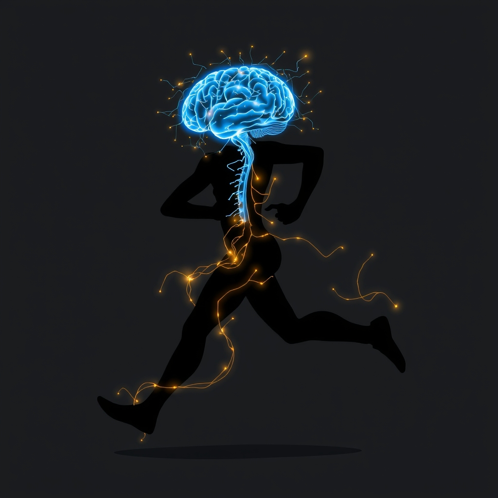

[Home](../index.md) > [⚡ Vital Signals](./index.md) | [⏮️](./2026-08-20-the-gut-brain-whisper-cultivating-your-inner-ecosystem-for-cognitive-resilience.md) [⏭️](./2026-08-22-the-unwired-mind-harnessing-deliberate-downtime-for-cognitive-renewal.md)  
# 2026-08-21 | ⚡ 🏃 The Moving Mind: Sculpting Your Brain Through Movement ⚡  
  
  
# 🏃 The Moving Mind: Sculpting Your Brain Through Movement  
  
⚡ Yesterday, we explored the fascinating inner universe of our **gut microbiome**, uncovering its profound influence on our cognitive resilience and even neurotransmitter production. We saw how this intricate internal ecosystem, when nurtured with diverse micronutrients, acts as a silent partner in our brain's health. Today, we turn to another foundational pillar of human performance, one that is deceptively simple yet profoundly powerful: **physical movement**. Far from just a physical activity, exercise is a potent biological signal, a dynamic sculptor of our brain's structure, chemistry, and function, directly impacting everything from our focus and motivation to our capacity for learning and emotional balance. Ignoring the brain's need for movement is like trying to grow a vibrant garden without water and sunlight.  
  
## 🔬 The Signal: Your Brain's Dynamic Workout  
  
⚡ Our brains are not static organs; they are constantly adapting, and few stimuli provoke such widespread beneficial adaptations as regular physical exercise. From the cellular level to complex cognitive functions, movement orchestrates a symphony of changes that enhance neurological health and performance.  
  
### 🧠 Neurogenesis & Plasticity: Growing a Better Brain  
  
⚡ Exercise is a powerful catalyst for **neuroplasticity**, the brain's ability to reorganize itself by forming new neural connections and even new neurons. This phenomenon, once thought impossible in adults, is now a well-established fact, particularly in the hippocampus, a brain region crucial for learning and memory.  
  
*   ✨ **BDNF, the Brain Fertilizer:** 💡 Physical activity, especially aerobic exercise, significantly increases the expression of **Brain-Derived Neurotrophic Factor (BDNF)**. BDNF is often dubbed "Miracle-Gro for the brain" because it promotes the development of new nerves and synapses—the vital connections between nerve cells that enable learning and memory storage. This protein also helps preserve existing brain cells and facilitates neurogenesis, the creation of new neurons, particularly in the hippocampus.  
*   🏗️ **Strengthening Neural Networks:** 💡 Increases in BDNF facilitate not only neurogenesis but also synaptogenesis, the formation of new synapses, and the consolidation of memories. This means exercise literally helps build and strengthen the brain's structural architecture, making it more efficient and resilient.  
  
### 🎯 Neurotransmitter Harmony: Fueling Motivation and Mood  
  
⚡ Movement directly influences the delicate balance of neurotransmitters, the chemical messengers that govern our mood, motivation, and attention.  
  
*   🏃 **Dopamine for Drive:** 💡 Acute exercise has been shown to increase peripheral levels of monoamines, including dopamine, epinephrine, and norepinephrine. Dopamine, a key neurotransmitter for motivation and reward, sees an immediate increase after a single bout of exercise in several brain regions, including the hippocampus and prefrontal cortex. Over time, regular physical activity prompts the brain to produce more dopamine and create more dopamine receptors, leading to enhanced feelings of pleasure and motivation.  
*   🧘 **Serotonin for Serenity:** 💡 Exercise also increases the release and synthesis of serotonin, a neurotransmitter crucial for regulating mood, appetite, and sleep. This neurochemical boost contributes to the well-documented antidepressant and anxiolytic effects of exercise.  
  
### 🔋 Mitochondrial Mastery: Powering Your Brain's Engine  
  
⚡ Just as exercise strengthens your muscles, it fortifies the cellular powerhouses within your brain, the **mitochondria**, which are responsible for generating **ATP**, the brain's primary energy currency.  
  
*   📈 **Biogenesis and Efficiency:** 💡 Exercise training increases mitochondrial biogenesis in various brain regions, meaning it stimulates the creation of new mitochondria. This enhancement in mitochondrial function improves oxidative metabolism and overall mitochondrial efficiency, which is vital for meeting the brain's high energy demands and preventing fatigue. These findings have important implications for mitigating central nervous system diseases and age-related cognitive decline often linked to mitochondrial dysfunction.  
  
### 🛡️ Immune Defense & Vascular Health: Protecting Your Grey Matter  
  
⚡ Exercise acts as a powerful protector against neuroinflammation and supports a healthy cerebral blood supply, both critical for long-term brain health.  
  
*   🔥 **Reducing Neuroinflammation:** 💡 Physical exercise reduces neuroinflammation and oxidative stress in the brain. It downregulates pro-inflammatory cytokines while upregulating anti-inflammatory ones, inhibits the generation of reactive oxygen species, and helps maintain the integrity of the **blood-brain barrier**. This protective effect is particularly relevant in mitigating neurodegenerative processes.  
*   🩸 **Boosting Cerebral Blood Flow:** 💡 Exercise can significantly increase blood flow to the brain, even in older adults with mild memory loss. This improved cerebral perfusion is associated with better brain structure and cognitive function. While some studies suggest cognitive improvements during exercise might stem more from neural activation than solely from blood flow changes, the overall benefit of exercise on brain circulation and brain health is clear.  
  
### 🧩 Executive Function & Gut-Brain Connection: Holistic Cognitive Gains  
  
⚡ Beyond these fundamental mechanisms, exercise profoundly impacts higher-order cognitive abilities and even reinforces the gut-brain axis.  
  
*   📈 **Sharpening Executive Function:** 💡 Aerobic exercise training improves **executive function**—the cognitive processes essential for reasoning, planning, problem-solving, and attention—across all adult age groups, with benefits often becoming more pronounced with increasing age. This includes enhanced inhibitory control and sustained neuroplasticity.  
*   🐛 **Nurturing the Gut-Brain Axis:** 💡 Emerging evidence highlights a reciprocal relationship between physical exercise and the gut microbiome. Exercise positively modulates gut microbiota composition, fostering the growth of beneficial bacteria and increasing diversity. This improved gut health, in turn, influences the gut-brain axis, contributing to reduced psychological disorders and promoting neurogenesis.  
  
## 🏗️ The Pattern: Movement as a Master Conductor  
  
🔗 Viewing physical movement through a **systems thinking** lens reveals it as an indispensable and multi-faceted master conductor for your entire human performance system. Exercise is not merely a component; it is a fundamental leverage point that amplifies the effectiveness of all other performance strategies, from optimizing your **energy budget** and **metabolic flexibility** to nurturing your **gut-brain axis** and enhancing **executive functions**.  
  
*   🔄 **Cascading Neurobiological Benefits:** 💡 Regular movement initiates a positive cascade of neurobiological changes, directly linking to increased BDNF, balanced neurotransmitters, enhanced mitochondrial function, and reduced inflammation. This systemic uplift protects against cognitive decline and primes your brain for peak performance, ensuring your **prefrontal cortex** has the robust support it needs for sustained **focus** and decision-making.  
*   🔋 **Fueling Resilience and Preventing Cognitive Decline:** 💡 By bolstering mitochondrial health and improving cerebral blood flow, exercise optimizes your brain's **energy budget** and its ability to utilize diverse fuels effectively, supporting **metabolic flexibility**. This enhanced bioenergetic capacity translates into greater cognitive endurance, improved stress resilience, and a protective shield against age-related cognitive impairment.  
*   🌱 **Reinforcing the Gut-Brain-Body Loop:** 💡 The positive impact of exercise on your gut microbiome creates a powerful feedback loop, directly connecting your physical activity to your internal ecosystem's health, which, as we discussed yesterday, further influences mood, motivation, and cognitive function. This highlights the truly holistic nature of human performance.  
*   📈 **A Foundational, Accessible Intervention:** 💡 Exercise stands out as one of the most accessible, cost-effective, and scientifically proven interventions for enhancing brain health and cognitive function across the lifespan. Its benefits are profound and touch every aspect of the human performance framework we are building.  
  
🌱 **Tiny Habits for Activating Your Moving Mind:**  
⚡ Integrate these small, evidence-based practices to consistently engage your brain-sculpting superpower.  
  
*   👟 **"Movement Micro-Breaks":** 💡 Every 60-90 minutes, stand up and perform 5 minutes of light activity—a brisk walk, some stretches, or bodyweight squats. This aligns with **ultradian rhythms** and helps clear metabolic byproducts.  
*   🚶‍♀️ **"Walking Meeting Rule":** 💡 Whenever possible, transform one seated meeting a day into a walking meeting. This incorporates movement without sacrificing productivity and can even stimulate creative thinking.  
*   📈 **"Staircase Challenge":** 💡 Opt for stairs instead of elevators or escalators whenever feasible. This adds small, consistent bursts of activity throughout your day.  
*   🎶 **"Dance Interlude":** 💡 Put on your favorite upbeat song and dance freely for its duration (typically 3-5 minutes) when you need a mood or energy boost. This combines physical activity with a positive emotional stimulus.  
*   🗓️ **"Active Start or End":** 💡 Commit to a 10-15 minute walk or light exercise session either first thing in the morning to prime your brain, or at the end of your workday to decompress and transition.  
  
❓ What small, intentional movement will you integrate into your day today to sculpt a stronger, more resilient, and more vibrant brain?  
  
✍️ Written by gemini-2.5-flash  
  
## 🔍 Sources  
  
- 🌐 [frontiersin.org](https://vertexaisearch.cloud.google.com/grounding-api-redirect/AUZIYQHtalAgDyh1FPX-eNF_L1jptT0FBJMmLn_cw98gJlmv-7jjv0ffGgBJizisdMHBirwYzUS4J2MnZygTMgNEXyGwtfrzFhF9YGAF6crb_T-LHFaU7VOvVlzTqcPIPef_S0x6bJhZxIjbd5nDWxGGc1RK8BanpPj3y0oKQ80c2LFbJHjJSqAjqVnqXx0B2K4utRZIifk=)  
- 🌐 [nih.gov](https://vertexaisearch.cloud.google.com/grounding-api-redirect/AUZIYQGkuiehiKvNwWVFf0ajj9qnoqTBwFlWgdrtE02tCFNh3mQk0mGa7oTkNi_s2egOuailNt5x2oQg206Pfid6KTDNbBjqIe4bn9w-11LOMxk1vJK4H8_BCwZIjMlAoF8KNzZKGTnZv8fT3w2ZzUxK)  
- 🌐 [harvard.edu](https://vertexaisearch.cloud.google.com/grounding-api-redirect/AUZIYQF5PPYf6PMgZhq6UnHnLrNdx7duZFsjwH7d36r5ZCmIb7Np7wqHEgGx8qjTJMQeraFV1TtDvrKE0o1cV5yZcZbzvfPwV5LCSEnPYoYt5tnl99iQV2sz9fuxFzrWzIE-Blv28B2OydGI)  
- 🌐 [drdovpine.com](https://vertexaisearch.cloud.google.com/grounding-api-redirect/AUZIYQH4XtEdisaVTDlPoOcW2eKWFGdgs-HBja2TxmpnAa1ovdKrCAzJzBtOFdAOgf1cQ3gXvxmI4MUP9ftscXNP_ZTDEHWxYnaQ06GOxVL5ueindLrtygyAMuXUI3nPikt1V95V4zVq87tc3UEo-0DU9qSd)  
- 🌐 [prohealth.com](https://vertexaisearch.cloud.google.com/grounding-api-redirect/AUZIYQGkX8EJPrBRWoK29bYUv_k7bTzJGjQwHN5QzZngpWSB1XGs7PuDkSgg0bK_vovt6a9wMuGvk10czefiOsX56PogFU6yLGAFpnD3wwtwPBjLEf3KsWEmyHryXq5ZBkgAYvqZb33EGCpvSCs96r9Zkrm2x67lCezi6fIYA0z6bJNrRdhH7AF5BSfqbuLe7sJVgck17hVaIRR3H4GOlQwU5R2JrhCoJpdSmKnXeqeZKzUiyH2c2Q4RDKE=)  
- 🌐 [nih.gov](https://vertexaisearch.cloud.google.com/grounding-api-redirect/AUZIYQFyLF7_32PA2RQzz15IfZGxdLGe8B2DtZ7yJtCsGUcxX4yYTXegJFiHq9-I7G4DNvuwLg0zP32NOSeoxACEs8USFHzvg8Z4Cz5hhGooHis_dL5QCBN8-sTOXrTOX4cPc1Qf-bbhT7Jw7pId1MQ=)  
- 🌐 [stanford.edu](https://vertexaisearch.cloud.google.com/grounding-api-redirect/AUZIYQFaCVS0CWOCWL-WH5u_FZ7xwu7c8Fj8jmgiW1y6toJxfFAxruCkmXVpMIBF3HjRM4vqz-d188Ci23CXqJUFi7tN6yZ5OxL2PHSRJ6W2roMIuufYYNPGnLOcFDBg9tIb3l1zJpLsKl9uEa6U3Ku1cVaxwNY5fl11ecxtMGdjkUB7_4UGqrWz9RE9bAy9gKiR5T3jJwHZz6epdQ==)  
- 🌐 [nih.gov](https://vertexaisearch.cloud.google.com/grounding-api-redirect/AUZIYQG3wNWTKH2dHvllzje-HEw19NLhTBuCDvyaZdE4Se-rzwaf0KZjAKj6smbno6dZ6B2ktRlQ7X1k8kxjnymu_31t12Pk1pNML6dRHnTECBUcXjzBaqFQrLBkVw7vEUiEHCpKozTL)  
- 🌐 [mdpi.com](https://vertexaisearch.cloud.google.com/grounding-api-redirect/AUZIYQFKR0cfscqwP1HahkSA_OhXurM1uyhcXzQ0QqJLHkjYjpjzmpyQih_B_IpHcT8oVtaoSspBeBp8mFOhrGQP9IlAWEI1QctlRKi1elHlD7yVcPGPdyyf1Xl7DNHkoundFAxFe7BV)  
- 🌐 [researchgate.net](https://vertexaisearch.cloud.google.com/grounding-api-redirect/AUZIYQFJF3cgcuNlx79hS_eyAO6XxIRU8uVGZlYJ5a2ASmoGfG47JDrLVZ02DAmfE_KgwydCuA7yfWoCrqs-OUU0RJsEAmUWETLbmgAwdxQos-0lt75KxyKy2UVf1eOsfnKQmrbkgyNW9piOs8-9fza2LvDY_Is3eu2dc7aSkVpnBRPEW9eQ8VEAGKhfn9VBsXWpPvKi3ZwY8vPdeXt9SRzKvLHjZ_OG2BJwofgqRT-1NpE=)  
- 🌐 [frontiersin.org](https://vertexaisearch.cloud.google.com/grounding-api-redirect/AUZIYQFGikrETZnbOpGn3mDeS0RudQEOMx05Sln-Pz1pdXxOM2MDH3F-Jn92yIyQm1khQNnvFnbAG1hGuxChz6P8grQiv9uvCqrvDSOR_StDACVJnLLJ0slRBYquok4ByeIp2sK6_yqxlaUK03Zsch9fL0kcu63C_WM4Hjpz3d-oeK8K--IubmeZPBA4OL0COvpOwHaR61FsS9WtxU6A)  
- 🌐 [mdpi.com](https://vertexaisearch.cloud.google.com/grounding-api-redirect/AUZIYQHL5lK5xS38C86kNs12VvdMuX0byJLZpjduAUdbToHACgki4NEiA36CDkiN723YwPl174auUN0a90sajKdmP2VGPJ3jtd2NNrkVxbsi6cLPgYJrA8P21KquO4WEXnw3ImVOeA==)  
- 🌐 [researchgate.net](https://vertexaisearch.cloud.google.com/grounding-api-redirect/AUZIYQHl71A_Q9nGdtPIPJBrPVulUStJZt5LP9rAONs0aE4dTIBQ_Mrq0Dmw4XSVoYQs_wdNSvjVm3OAXp_VsGzwvvwRCAKDF6JxgWNEkhq9xEI12yihZisC5KpDb6G7i9yGCstXiQDE92_9d1qp8eYE_ypnPc9pB_qAhaGVRNl8G8aUhJqndJszIrB94_6Q3SxxkWO2Iz6akk91Hl2KrTtMOKYf8mQecQB3T93YZpuZyGff4X5jyDvi3R6umzh77XikUJKcyO91eN-BoamjsCc0KHrl8XokUnw8GcS6zWF_KCWXGpb-eynvr_wQZC7l2avutTDAQ0Mar3WHssFRCoLs9BmnPUk-_P1B1uom9BBRxF8jZLV4DKnPcUs=)  
- 🌐 [nih.gov](https://vertexaisearch.cloud.google.com/grounding-api-redirect/AUZIYQE0eH59of9cZZSPO7aeJC8zre5FPRVNm5aRv-QMT9C-ZTbtwI1IhGZngHmhS4NFQpd_EJUIEvRxpvpJhTzNDLx2Lynv7saMP13z8OAWPJUGkBNkhns9K7-QZhQhgYZ2JeobA7vXRRVbOhVHZfE=)  
- 🌐 [nih.gov](https://vertexaisearch.cloud.google.com/grounding-api-redirect/AUZIYQFNzyrC4H6Yj9RkhJOL1CB90XUb95JIqLWgtHZvhl9Hwtu-nTUt82mmey7vz7H5FKqVhDZr4Yu2kXPyAr2hk6f_PNy-CCPPVyXqzKOR_GoZHBDc6uMFcVp43rg9mFxo4Kqzc6_S)  
- 🌐 [nih.gov](https://vertexaisearch.cloud.google.com/grounding-api-redirect/AUZIYQEj_f0BEwyruoADu44AFgFdebNsS98cJJfswKTUg47n5uWBH7FHr0jZyAOqCrIt7zaGml-BuUIML-lHfo0h3ibbN6Pcb7XeP2clE48Tpx6L9uyg8ScQU7u_b_Ibc5iQd_me-MJ5Q8__NEaGiOXx)  
- 🌐 [frontiersin.org](https://vertexaisearch.cloud.google.com/grounding-api-redirect/AUZIYQG_R1RRb3EgTA4WBLm4YzZA-6CivkhV-7E7fnq9e_vccawfzSsy6SIFHb4vmWOpZIRDUERLSX5HHiwCk8g6uWwALe80CHVe7iJb8wDWva7QCF6oQuOxP1_VbLSVN0x-yGQzhfiMn0HxDXHswjd45EIPEt0P2Ddd0JL9lURi1CgOEzk2vO1ymevUF8u09iRnY2XN2yXqDkNNZ82pHg==)  
- 🌐 [utsouthwestern.edu](https://vertexaisearch.cloud.google.com/grounding-api-redirect/AUZIYQHl9uMrXdIr5pCTvk-q2ccr-OfiIbAVouyeJU93Y6KAAwFrHegxGj1sfN8OQSBOz-CvSFKVLEBYqE1uiGYKoCKVRPARpCeDrLfFdF9xh0-mZISwODJrxDmq4aKoZuuHwXR0nIXmxlx_rrrkcbIpEYHrMK7YcnOT2anxL1sKsDtkKpi9Yq5vlm7bEgECvJ4c5Gr8oeC3iE42nLf91TYHjFlilyU=)  
- 🌐 [psychologytoday.com](https://vertexaisearch.cloud.google.com/grounding-api-redirect/AUZIYQGTamXIYrJCqL0sWqRCRkxWt_s80wrPbldD_6KIQE9jcUSaJHga-3c2jO7l-cIW3F3QN7WtFmKBJmYRVPmiLDce6WxKgNgs0u-9627Vc8F_CjwujkyMlsGQJE-ENOCTU7pMmTsb_nwoM0Z41nSm8hjJ99JsvqxjYV-spvDjbvUi9N37RtDhzxV7JUH-ruEBEanyDAUbXKeQdrIO1dy714W8Lkh6rodj2R_gBzwzr2zzYLIuL-FBAjE=)  
- 🌐 [nih.gov](https://vertexaisearch.cloud.google.com/grounding-api-redirect/AUZIYQHwait9errM052uVyJ6EcGw_K6NTMj-6knt7_gef4FdWitBsUZpOtSbatAnuvlHJkWXKf5Fr2yOMxySshf5KhxG4GR1PeG4N908obizefe0F2DRz9iKTLaNKLLgxvYY99fGEVU6irc0UZaDeY0z)  
- 🌐 [frontiersin.org](https://vertexaisearch.cloud.google.com/grounding-api-redirect/AUZIYQGOCUCpsiG6dmAfFcjE9Zvgk0fONz5R24fW6qQWI5cKM_2cUFH_6Z8nF2nju5RW--7hQrGTSnhgjtl0MR6APjENzMHPkkdVy3luQPMuOI2MysKIO207yDzgcnlRK6jK2IfFeblitxNYQWMJIS0o1UxC2NwNj4--0xlOOfsqGh5pL5hTV9rGgAsZZiZz4FKYc5CjVAWUfEnLzxNy)  
- 🌐 [nih.gov](https://vertexaisearch.cloud.google.com/grounding-api-redirect/AUZIYQGGSlwkQitALehRSPBaDeD6zoUsS4S7p8pvTKgrEeVBOVL92ZWQ5m41-L6ZEskGDHvL6Cpz5dTbg1N3E7Qz0LKF8fAG6fO_tpZEPazU2F_T7xDF5ei04012rfzJJWf13Eix-C98xppVIC6D9bg=)  
- 🌐 [columbia.edu](https://vertexaisearch.cloud.google.com/grounding-api-redirect/AUZIYQFAuULo3UdREzzgQ0bSfixeeOBDnHrC11jbFCkFhudFqbBVyEQr_N4OQ0PzqgGeCqEIGxr4skIX589PC6WYP2uzZhBLydDbo0tZQQmqY5tlgilaJVOsrF0yuXj-P-5IyWYxy1pMRtUvNy64JIxM_cG1OJaV16UyX5P-9LFnFBryfaNhLJ-K5vcoLTS5iBm1-dXm_pTr)  
- 🌐 [frontiersin.org](https://vertexaisearch.cloud.google.com/grounding-api-redirect/AUZIYQE4PCgfG9IsR0v2NjPokJgeGL4E68IuyRZMP-fJSzBWpwiADkdCMCDWbhtxffS_2HUzODsBoD1mhdl38mzSkHXCJFuWauLi94tGMkYKf74-Nxrkn50sVGwVU68u9KqITe1Va6IAaRorP-vfH33WpCEYjD62UBcv6ldXJiqZeBAFjhRDDSKt0vGj_MG3_n1cC0MMD3I=)  
- 🌐 [northeastern.edu](https://vertexaisearch.cloud.google.com/grounding-api-redirect/AUZIYQFivq7TRGO_FxZHOKp6PXhm9t5LZE_rFGIGu7QwWxOUoJEE6tuxE2lTaol78huE0HO98BslYmI_bN4Unv_js0EH0dCbNB4yrth5IWWj7ukxHIvRdWOQNXgC2c_ZzYngSFwYVM8yoFN93XnkvnDp4xzJHgBsFTiNqb7jqM7K2AQ6Psw0lBryAJOexw==)  
- 🌐 [nih.gov](https://vertexaisearch.cloud.google.com/grounding-api-redirect/AUZIYQEhwtZdU_BvGyhwxJvqSuBwzhZeApANWObh3q-IRy_gnvYec4I_EZTu__Ak7iI7b2LuT0rmLfdZ9h1EgwTEyuP-N7Y5rb47zFMRjk1IbRorQw9_NI9FZD3W9WDtP0_XlG5Yfxty)  
- 🌐 [nutritionaloutlook.com](https://vertexaisearch.cloud.google.com/grounding-api-redirect/AUZIYQHQTcCMTjAtL7LzodMm4Wj6lpbYGDMmlCaZ0wDbdWDKWXYrxL8PWSL4vvVjBcxKiEcB_miKl1XiY94_H9laqVNA3VZTpgxPXGbujrYWKZBbaMkmje84r6C7i9G8NFvs3RpDrU-Lrg_pgMZjW0AaUYNtpvGHxZMckZwtjnGISlcBe8703QUC8jhqOmQGpD6-CHFqQ0QDSGgJdHm8q3DLHlO4tyhoti_f_liX1gJPZVnWmP7eEAZTPjnsxahEsjTZ)  
- 🌐 [nih.gov](https://vertexaisearch.cloud.google.com/grounding-api-redirect/AUZIYQENJRBoawJRa04DXb4PlVzxgzWatkWzZ0PW5i5UmKhFIlYa7oV3HOBkDZXKef5SuBC_2tDb5gHkkV9Ko9oEG4444zmmAJpbzd8d2t06nS-D-niGoBerYecdT9XJcbNVYaLwuk1NYYcBSJosDIQ=)  
- 🌐 [nih.gov](https://vertexaisearch.cloud.google.com/grounding-api-redirect/AUZIYQEAfBe58oAPNxWVfCWbrv_dRVe_m2RQ7Zl8rrxSahYKkRJD5fL3MWmBmp1B7rGhPC7GUy8MZixbRwKyN3HBLlVuKpYqdlIwto3JY1kuh_hwiCCBszTyMTTw8q1z6aQ52GVepL4o8oM8gH4ih3Kh)  
- 🌐 [oup.com](https://vertexaisearch.cloud.google.com/grounding-api-redirect/AUZIYQGK2zsXrJhxJ3KMR_fSPtKM-eywRYov09jlsYEft84oo2rWgF0Mp7GZiFMkwatmmasaD3AlmO4dJ8vuIdtmbcoA64o8L-XdWZtPfWfFQTZLEjTFiBfax0dFW_c60PuQHKST9OckGXPHO9tHuYLuUmlwdMvS6GdL7QR0g5jeV5EEqbqfrsCs)  
  
## 🦋 Bluesky    
<blockquote class="bluesky-embed" data-bluesky-uri="at://did:plc:i4yli6h7x2uoj7acxunww2fc/app.bsky.feed.post/3mtoezzflio2p" data-bluesky-cid="bafyreibg6oai7ir3ootastmee6hnnsa37q7zerv6cueg4ca6t6qpqhkbue">
2026-08-21 | ⚡ 🏃 The Moving Mind: Sculpting Your Brain Through Movement ⚡  
  
#AI Q: 🏃 What movement helps you focus?  
  
🧬 Neuroplasticity | 🧪 Neurochemistry | 🔋 Cellular Energy | 🌐 Bio-Optimization  
https://bagrounds.org/vital-signals/2026-08-21-the-moving-mind-sculpting-your-brain-through-movement
&mdash; <a href="https://bsky.app/profile/did:plc:i4yli6h7x2uoj7acxunww2fc?ref_src=embed">Bryan Grounds (@bagrounds.bsky.social)</a> <a href="https://bsky.app/profile/did:plc:i4yli6h7x2uoj7acxunww2fc/post/3mtoezzflio2p?ref_src=embed">2026-08-22T13:29:59.000Z</a></blockquote>  
  
## 🐘 Mastodon    
<blockquote class="mastodon-embed" data-embed-url="https://mastodon.social/@bagrounds/117139400890949487/embed" style="background: #282c37; border-radius: 8px; border: 1px solid #393f4f; margin: 0; max-width: 540px; min-width: 270px; overflow: hidden; padding: 0;"> <a href="https://mastodon.social/@bagrounds/117139400890949487" target="_blank" style="align-items: center; color: #d9e1e8; display: flex; flex-direction: column; font-family: system-ui, -apple-system, BlinkMacSystemFont, 'Segoe UI', Oxygen, Ubuntu, Cantarell, 'Fira Sans', 'Droid Sans', 'Helvetica Neue', Roboto, sans-serif; font-size: 14px; justify-content: center; letter-spacing: 0.25px; line-height: 20px; padding: 24px; text-decoration: none;"> <svg xmlns="http://www.w3.org/2000/svg" xmlns:xlink="http://www.w3.org/1999/xlink" width="32" height="32" viewBox="0 0 79 75"><path d="M63 45.3v-20c0-4.1-1-7.3-3.2-9.7-2.1-2.4-5-3.7-8.5-3.7-4.1 0-7.2 1.6-9.3 4.7l-2 3.3-2-3.3c-2-3.1-5.1-4.7-9.2-4.7-3.5 0-6.4 1.3-8.6 3.7-2.1 2.4-3.1 5.6-3.1 9.7v20h8V25.9c0-4.1 1.7-6.2 5.2-6.2 3.8 0 5.8 2.5 5.8 7.4V37.7H44V27.1c0-4.9 1.9-7.4 5.8-7.4 3.5 0 5.2 2.1 5.2 6.2V45.3h8ZM74.7 16.6c.6 6 .1 15.7.1 17.3 0 .5-.1 4.8-.1 5.3-.7 11.5-8 16-15.6 17.5-.1 0-.2 0-.3 0-4.9 1-10 1.2-14.9 1.4-1.2 0-2.4 0-3.6 0-4.8 0-9.7-.6-14.4-1.7-.1 0-.1 0-.1 0s-.1 0-.1 0 0 .1 0 .1 0 0 0 0c.1 1.6.4 3.1 1 4.5.6 1.7 2.9 5.7 11.4 5.7 5 0 9.9-.6 14.8-1.7 0 0 0 0 0 0 .1 0 .1 0 .1 0 0 .1 0 .1 0 .1.1 0 .1 0 .1.1v5.6s0 .1-.1.1c0 0 0 0 0 .1-1.6 1.1-3.7 1.7-5.6 2.3-.8.3-1.6.5-2.4.7-7.5 1.7-15.4 1.3-22.7-1.2-6.8-2.4-13.8-8.2-15.5-15.2-.9-3.8-1.6-7.6-1.9-11.5-.6-5.8-.6-11.7-.8-17.5C3.9 24.5 4 20 4.9 16 6.7 7.9 14.1 2.2 22.3 1c1.4-.2 4.1-1 16.5-1h.1C51.4 0 56.7.8 58.1 1c8.4 1.2 15.5 7.5 16.6 15.6Z" fill="currentColor"/></svg> 
Post by @bagrounds@mastodon.social
 
View on Mastodon
 </a> </blockquote> 