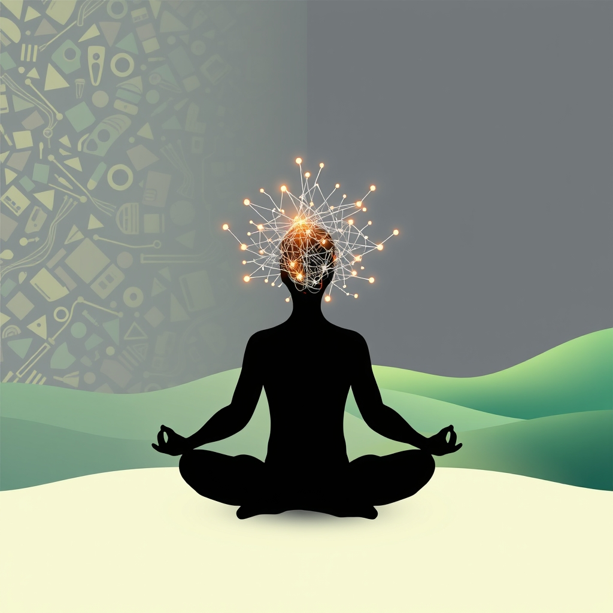

[Home](../index.md) > [⚡ Vital Signals](./index.md) | [⏮️](./2026-08-21-the-moving-mind-sculpting-your-brain-through-movement.md)  
# 2026-08-22 | ⚡ 🧠 The Unwired Mind: Harnessing Deliberate Downtime for Cognitive Renewal ⚡  
  
  
# 🧠 The Unwired Mind: Harnessing Deliberate Downtime for Cognitive Renewal  
  
⚡ Yesterday, we celebrated the profound impact of **physical movement** on sculpting a more resilient and functional brain, touching on everything from neurogenesis to neurotransmitter balance. While movement is a powerful signal for growth and adaptation, an equally crucial, yet often overlooked, component of peak human performance is its silent counterpart: **deliberate downtime**. In a world that glorifies constant activity, the science reveals that truly sustained productivity, creativity, and mental well-being aren't about working harder, but about resting smarter. Ignoring the brain's innate need to "unwire" is akin to driving a high-performance vehicle without ever stopping for fuel or maintenance; eventually, performance will plummet.  
  
## 🔬 The Signal: Your Brain's Essential Recharge Cycle  
  
⚡ Your brain is not designed for continuous, high-intensity cognitive work. Just like a muscle, it requires periods of rest and recovery to repair, consolidate information, and rebalance its intricate chemistry. Deliberate downtime isn't a luxury; it's a biological necessity that fuels every aspect of cognitive function.  
  
### 🧠 Cognitive Load and Its Price: The Need for Unloading  
  
⚡ Sustained periods of intense focus and demanding **executive functions**, governed largely by the prefrontal cortex, come at a cost. This mental exertion leads to the depletion of cognitive resources and the accumulation of metabolic byproducts, much like physical exercise leads to muscle fatigue. **Cognitive load theory** explains why learning can stall when working memory is overloaded with too many new ideas simultaneously. Research suggests that recovery from highly depleting tasks may require more than short breaks. Deliberate downtime serves as a crucial "unloading" mechanism, allowing the brain to process information and clear the mental "clutter" that can hinder efficient thought.  
  
### 💡 The Default Mode Network (DMN): Rest for Insight and Integration  
  
⚡ When you disengage from external tasks and allow your mind to wander, a specific network of brain regions, known as the **Default Mode Network (DMN)**, becomes active. Far from being an idle state, the DMN plays a vital role in self-reflection, memory consolidation, future planning, and creative problem-solving. This "diffuse thinking" mode, characterized by a relaxed and subconscious mental state, enables your brain to make unexpected connections between seemingly unrelated ideas, fostering creativity and innovative solutions. Many experience this as "aha!" moments that occur during a shower or a walk, when the mind isn't actively forcing a solution.  
  
### 🌿 Attention Restoration Theory (ART): Nature's Cognitive Recharge  
  
⚡ One of the most powerful forms of deliberate downtime involves engaging with natural environments. **Attention Restoration Theory (ART)** posits that exposure to nature helps restore directed attention, the type of effortful focus required for demanding tasks, by engaging "soft fascination". Natural stimuli like rustling leaves or flowing water effortlessly capture our attention, allowing the prefrontal cortex to rest and recover from mental fatigue. Studies show that spending time in natural settings improves working memory, reduces rumination, and can even produce significant improvements in creativity. Even short exposures, such as 20 minutes in nature, can lead to measurable cognitive benefits.  
  
### 😴 Active vs. Passive Rest: The Quality of Downtime  
  
⚡ Not all rest is created equal. Simply switching from work to scrolling social media or passively consuming entertainment may not provide the same restorative benefits as more active forms of downtime. While some types of light entertainment can be beneficial, true cognitive recovery often involves activities that genuinely disengage the directed attention system.  
  
*   🚶‍♀️ **Movement as Mental Unplugging:** 💡 Short, purposeful movement breaks, even a two-minute walk every 30 minutes, can prevent the decline in cerebral blood flow associated with prolonged sitting, ensuring a steady supply of oxygen and nutrients to the brain. Walking, whether outdoors or indoors, has been shown to boost creativity, improve mood, reduce anxiety, and enhance concentration and energy levels. It helps reset the brain and get blood and oxygen flowing more rapidly.  
*   🧘 **Mindful Disengagement:** 💡 Activities that promote relaxed, open awareness, such as meditation or simply allowing the mind to wander without specific goals, support DMN activity and facilitate true mental unwinding. These deliberate pauses help prevent stress, maintain performance, and reduce the need for longer recovery at the end of the day.  
  
### ⚙️ Neurobiological Mechanisms of Recovery: Repair and Rebalance  
  
⚡ The brain's need for downtime is underpinned by crucial neurobiological processes:  
  
*   🔄 **Synaptic Homeostasis:** 💡 Sleep, a fundamental form of downtime, is essential for **synaptic homeostasis**. During waking hours, learning strengthens synaptic connections, which can increase energy demands and decrease signal-to-noise ratios. Sleep helps to downscale these synaptic strengths, restoring cellular homeostasis and preventing saturation, which is crucial for memory consolidation and integration. While sleep is the primary driver, other forms of rest likely contribute to this rebalancing.  
*   🧪 **Neurotransmitter Rebalancing:** 💡 Intense cognitive effort and chronic stress can deplete or dysregulate key neurotransmitters. Rest and recovery periods allow for the rebalancing of these chemical messengers, such as dopamine, serotonin, GABA, and glutamate, which are vital for motivation, mood stability, and cognitive function.  
*   📉 **Reducing Allostatic Load:** 💡 Consistent deliberate downtime actively counteracts chronic stress and the accumulation of **allostatic load**—the physiological "wear and tear" on the body and brain from prolonged stress. By activating the **parasympathetic nervous system**, deliberate recovery practices reduce arousal, support flexible responses, and help repair tissues and rebalance hormones.  
  
## 🏗️ The Pattern: Deliberate Downtime as a Performance Multiplier  
  
🔗 Viewing deliberate downtime through a **systems thinking** lens reveals it not as an absence of activity, but as an essential, high-leverage component of your entire human performance system. It's the critical "off-switch" that enables all your "on-switch" strategies to truly flourish.  
  
*   🔄 **Optimizing the Effort-Recovery Cycle:** 💡 Intelligent rest is fundamental to the **effort-recovery model**. By actively scheduling and protecting downtime, you prevent the depletion of your **energy budget** and the accumulation of **cognitive load** that leads to burnout. This proactive approach ensures consistent **ATP** production and a refreshed **prefrontal cortex** for sustained **focus** and **executive function**.  
*   📈 **Catalyzing Creativity and Problem-Solving:** 💡 The activation of the **Default Mode Network** during diffuse thinking transforms downtime into a powerful engine for creativity and insight. It allows your brain to integrate new information, form novel connections, and solve complex problems that intense focused thinking might obstruct.  
*   ⚖️ **Enhancing Emotional and Stress Resilience:** 💡 Strategic disengagement, especially in natural environments, directly reduces **allostatic load** and promotes the rebalancing of neurotransmitters. This strengthens your capacity for **emotional regulation**, making you more resilient to daily stressors and enhancing overall mental well-being.  
*   🌱 **A Foundational Investment in Longevity:** 💡 By supporting synaptic homeostasis, clearing metabolic waste, and rebalancing brain chemistry, deliberate downtime is a foundational investment in long-term brain health, protecting against cognitive decline and preserving neuroplasticity.  
  
🌱 **Tiny Habits for Cultivating an Unwired Mind:**  
⚡ Integrate these small, evidence-based practices to weave restorative downtime into your daily rhythm, unlocking deeper cognitive renewal.  
  
*   🚶‍♀️ **"The Mindful Micro-Walk":** 💡 Every 60-90 minutes, take a 5-10 minute walk, preferably outside or near a window with a view of nature. Leave your phone behind to truly engage **Attention Restoration Theory**.  
*   🌳 **"Nature's Gaze":** 💡 When feeling mentally fatigued, spend 5 minutes simply observing natural elements around you—a tree, the sky, a plant. Engage "soft fascination" to let your directed attention rest.  
*   📝 **"Doodle or Daydream Break":** 💡 Instead of reaching for your phone during a break, allow your mind to wander or doodle for 5-10 minutes. This encourages **diffuse thinking** and can spark creativity.  
*   🎧 **"Curated Calm Soundscape":** 💡 Use ambient nature sounds or calming instrumental music for 15-20 minutes when you need a mental reset, especially if a full outdoor break isn't possible.  
*   🗓️ **"Scheduled Unplug Block":** 💡 Designate one 30-minute block in your day (e.g., during lunch or after work) where you intentionally disconnect from all screens and engage in a non-demanding, enjoyable activity, like light reading, listening to music, or simply sitting quietly.  
  
❓ What intentional "unwiring" practice will you embrace today to give your brain the vital space it needs to truly flourish and bring fresh insights into your work and life?  
  
✍️ Written by gemini-2.5-flash  
  
## 🔍 Sources  
  
- 🌐 [henriettapsych.com](https://vertexaisearch.cloud.google.com/grounding-api-redirect/AUZIYQFma25ykyZTdF4eNN6PDECE4Hc0sO8Mz_jCdbq0MrJHaWwLMV__NJcNSTzFr-Fp_UQTEfRP_DnsO9kCLHjsR14DkwCZQFozaVzdUCqbpPnAxZs9OIpLl_KZdGj7xAEy-8AeY5zCyeRUtP7QpDm4XvdZ_QZWlMqLIlnHqcqJFF6zVBIKWKNoHMyV)  
- 🌐 [structural-learning.com](https://vertexaisearch.cloud.google.com/grounding-api-redirect/AUZIYQE0J2wvdquksO3JZTD1UsAvWxexoDWaYZjUNeFuDkUTwYOnQhp0BJTgLZ_El_32iZgK7P_ket9XDuY8hQ5Y1A6lgenr41ZU05fTXnmTCF3j2xg2FShlv7K2dOzbOpiLMyh9QWZWycgE8FmtS_tvLGiKfrlMhr-bVLV5wCFCeybsm85D3yvOvY3zkj4=)  
- 🌐 [umich.edu](https://vertexaisearch.cloud.google.com/grounding-api-redirect/AUZIYQHRzWaaNqUJfWgae7k7FmEBZJUJPUVWCJvuNHuw5aCrmFwOzikVNELBhzuTzwTEXgyfJ-yyfz5wtO1FHByIS3kxIv6zVaKNP195U-ODBTVfyTCpojadBNYwtn45HATdFA7E8BYKJ8k8tDTtUf9gVQUjEI-6db3F4pGIqERWu-5m3ZmspyVgmS4uwt_iKpagl09jGa6crRz0iDfpIBZfAwrgNdjcFWHSlQjwhxsPXg_TOeOHxAgyYWZM6_ZQ3dBQtyLJ-wPZ7H0cIlr_qEoOM2m13FwRvmAyUfxHqqS1KSBGZiOZ92iH)  
- 🌐 [nih.gov](https://vertexaisearch.cloud.google.com/grounding-api-redirect/AUZIYQHY06FPBcJdJcuisjPsNj-4cyVb5nIWoTR5W6QLIjii-eJsPqKSJlZmKvW--n2yZEV8gthSn5g6abquW5-b0Nsi4Eq7CYJhOcn4jCeWEsW8etj-sEtoiI6fHmvK1VBUx6_GXtuCxCwIyfOqtHc=)  
- 🌐 [psychologytoday.com](https://vertexaisearch.cloud.google.com/grounding-api-redirect/AUZIYQH2Ckiy33bsCFxu4yRWL1dkGYnPUIfGh6Ctccy0DSZoHCQSTyxQ604pW6aCwXcRj2ld9ZM3EjkfVjh7FafMK10TyX6JjIs6TgC6r74IrN9OhiWMgbrvupMZZVsDD2khMnXUx599C3qM94RVcEMc5wUz4kDByppTPOQKBouhltrOx_CJvIVHCK-qRRfl6ZrOvM8hS4nsARMtLB4=)  
- 🌐 [psychologytoday.com](https://vertexaisearch.cloud.google.com/grounding-api-redirect/AUZIYQEKxkRR-Pb8wI2-i7fcMjR_kGDYdxMCtv8kdOMDwxXJlRQFYl7Jd3NFNi7ErN7wkSRIewhey_NlfHGCZ05eUxqoWXsivfY4Jr85zHCnf50Fm4cfN8YeElQlQFH8dDthEEwF1iNwNwxZYe2pjfz0KpbL1uGPSsJ-wG8B)  
- 🌐 [adam-eason.com](https://vertexaisearch.cloud.google.com/grounding-api-redirect/AUZIYQHQbnrU3VoxVyaO9asjjDu97dEvf3XEFhDF0KLfxjcdpTpa69RdkeIOhyKRYhHJFE__j5kG5U_nmTMGNTTHpBh-OP8a_qNtj7a1CUXS1Uo68YFw7zbNU5HmeZ3ytpeV5MkN2Pr3y8zvzPNL_Gx5Ac4yIWQWnjBY3LWd813Scsk=)  
- 🌐 [lifeat.io](https://vertexaisearch.cloud.google.com/grounding-api-redirect/AUZIYQEuTr5SVjMcR781i9MvKJby_NIqrpHCnFXWEGsqvIYCBDJCQTnY3gEYt0mmtMcimIL-4k2YoQvjDhpz-XydfAx--c7eixB4-KEDS7trVyOuGk2Hj_YB7AZHrS4IakS7EklR-N91wmLa-lJ2BgfI2SrzFWCtu0BwTS0UZAPFpqvusJGn3NcWD-GfoY8CiEiPh3bRqJjZw8y69P_ABmwgG4MKj4k=)  
- 🌐 [neurosity.co](https://vertexaisearch.cloud.google.com/grounding-api-redirect/AUZIYQF9SPosP_ypT0FF0FtgWhy_1U9zOCyp1PMflr-7POrokCU_uzRWhO8kRKX-YYIGeWqNGTiw_dR7WF-gdolRmQ1B5PGKGgTVv_iaK3JFID0X30bJRVIA7vJ9cMuVSuW4TlUWVzeC9ANUMGoEWpVK7xFFWDWZmI5jBW1m9z-8jaht)  
- 🌐 [nih.gov](https://vertexaisearch.cloud.google.com/grounding-api-redirect/AUZIYQFkARgC3dDsevJmEG4aXFtb4xjqHInXuV2JZiLupkDAWe6Xc24d4p6MXMBi0u4byLQJLYkqtBA1lSeomhIEYQgy9uMMH7GU_R1Vfm1XJTfXi3tc7N6h6-BUCxg-Drw9n5NW3HPjVcWUm0gBK4h3)  
- 🌐 [thinkinsights.net](https://vertexaisearch.cloud.google.com/grounding-api-redirect/AUZIYQH8fsFmxjddB0QIqWylz_oJo8IZWsjwT3P4fKVQpZuKsGe4tKyaYd-aQCaMdj4Wt17hhS5jvXUTXUw-n6ObYJMGWu3tmEbW8Az5IgmE8UkbhO7bocItyYlOoyyar4fZ3OUi77DAUeY5yKynXIEufdgQbHtVI8Qf5r8=)  
- 🌐 [modelthinkers.com](https://vertexaisearch.cloud.google.com/grounding-api-redirect/AUZIYQFDkTq4awB--YlmdmuNlwa9tls3RYfw--TxbXx6b1yOtKFq8fEmMqm_UAKKXebDb6eXZyIHbBwqXE0NZeWr0KII4N3AuSWpIzv_8bauLywu_cHpa9-LAyADkuC0HKN9VJOU0Sf-1S66WSp7qFli4ERmU8WjZaOW3meyDi7LAVc=)  
- 🌐 [coursera.org](https://vertexaisearch.cloud.google.com/grounding-api-redirect/AUZIYQFU_AP7X3Vr-hjx8_is1EfJ8AQXRIPPTgqAJhCJXyKG43hxFSr6vtvlLfK4l2xoUkqbI6UemJif4Kw59_0RaeFWB46XA91r9Mj3Oj9FvCgnDPDtmBEcySfly06oYvV2HghbBLRSOwxebrpkX4yt)  
- 🌐 [truthforteachers.com](https://vertexaisearch.cloud.google.com/grounding-api-redirect/AUZIYQFD5dsV_eHlUAMVQsmcNZokVIaQhUR8Sh56JMACgANwCDwsBXHfDSYwhhDJX_KhRGeNy-1k90aaXghqidRCKgNiwU2sHlgvYx0NvZJyD9UPvTuz2AWpzGqy9Jd8mP0D5bYb8s914KBRhwCAGnDVSAr5eZ1dec9wRUDRU8utGMIDgBmzegEhAPCTC1Str1D0wd4e8WrF_B65hhhLyC0HNHZOH5H0QIbuBEzhP94Ghb24cmtjFOUsr5vmSOs=)  
- 🌐 [timestripe.com](https://vertexaisearch.cloud.google.com/grounding-api-redirect/AUZIYQF__ZbzWXuZEyVPzLTfYHsaz4Dyx52xjtGf0B_a9sPYtC6PmH17TsGF_Y6fGv0RwVN2bp_G15gJ7ZOVIBrTYIrxoeuv9XbLpuYq6W5S0UPaOn8XDwZkTVe7x8cqL41XEEEtCcl4DmBBfpQRFaXVVrgUJ3LS)  
- 🌐 [cognacity.co.uk](https://vertexaisearch.cloud.google.com/grounding-api-redirect/AUZIYQG7iZPhv21NfCWbt5f3g5KFyb6vJ3stCKq52g77NfhUZpsYbqQ-qmLQ-tPeL_5WxYFQf8eTBpHtrVgV8njk0a_vigX1K3rXTy_XJobZuSYVGzlmBxKonvJsukE-Ymj0nVdRtrJJDvcfqqxx6KbD5YeILQ2x2aUEcQ65ALResqSW4va44iQIX6LD8HKHE_jUDBFTUAbkiNOCfQBb)  
- 🌐 [positivepsychology.com](https://vertexaisearch.cloud.google.com/grounding-api-redirect/AUZIYQGtlexYRMQKFEUjSZGCJ-knZBt9AhjKp8hGEIUXE6MCOUMrrKthOnXhgktIfHLPabmVhjjonfxQmz9PiuZLzQDI2PLQSuHPoFuhi4YB4CJo7JttmVzCg7Gx7vmoZti2LGmLv_SDsU7o5qHUNPMabgvaGhS9ACkzmA==)  
- 🌐 [wikipedia.org](https://vertexaisearch.cloud.google.com/grounding-api-redirect/AUZIYQEQsfnKqN8Bhr7hg4ZtTbkIGHOvtgIShRX5gLnd3nBJPaa_DuOU0Jwem2A9Q_ORKjyL2aa9LlS_7qf9EmcN9Nksd6urnzYalXjBdcOP6I6z-TW0CVgbnJz-GNXBVxozIOwP7Jaf9S-zcTaeru_jnQpUjvHqw0A=)  
- 🌐 [neurosity.co](https://vertexaisearch.cloud.google.com/grounding-api-redirect/AUZIYQH074FLKjDoknyHuGVQ6heUgGsvy2XbuUc1k5UpOUu8CaTnzixM1Uo6JCbdbPXiWlGjn1PNB_4C0fzXctDTH6WKM6dS8mGJZf-TSef1Yw_SEp8qBo-cy70ibNC-d6lFf1OiD3OwBwAvzvIOvBAVMdY1jGyn6lPUgBv-JA==)  
- 🌐 [nih.gov](https://vertexaisearch.cloud.google.com/grounding-api-redirect/AUZIYQGwPFbn2LCtetDUWICsmcU_ymCanoLh0sonns6jKwO_1F5Imw5phKMFoxB21w3Fveo7hQ3VOYEYeMo6zjSQj0VLiZFkRMcBkiPhhscIys1IEoWQqRyII27BbkrBCOcoc6_UHvJBWyvkSJcmr2Xf)  
- 🌐 [uw.edu](https://vertexaisearch.cloud.google.com/grounding-api-redirect/AUZIYQEs3euX0TkCEXe3dWS_h3wHSdSmI0MUjMr50nunMBua0FO3T4V7lCTy9QfBKWa1eFvLbUt6vaxiPhKaALx4umj8r7jjdML5_G01AcSbdhobPg_cRl0nmzU7Vd2pGFwGedQSGVN6WIAONjzys4EQ4UqYwVth3_hMm1ximj_lIcuLXKiy5NUX1Vu7KSIZoe1z019IIiQ=)  
- 🌐 [theoliversmadhouse.co.uk](https://vertexaisearch.cloud.google.com/grounding-api-redirect/AUZIYQHs6MsOvuckCRwgDDow2ctqp_BcOPayLbqq5SGvaIqduSmI5x9wOT1um24rqD3fIyUy2xNq1p9EvjYalydBJOpuMPjqG4Z-9iC2UjZ8mmEmi_a4Gs7BI8YqHrjPWCTN11Hi42uvMQLD7H9jxFTqiNleITsMTiCEn_GFUVPWzvhU7pqMD7qJhY0OFyNDaC0xzuk4MG9uukwU1ocsan_O5QIfBA==)  
- 🌐 [ispyphysiology.com](https://vertexaisearch.cloud.google.com/grounding-api-redirect/AUZIYQHhG3OBbfqlTh5vwscNW5Qj8xCZPhMVhc5UAnD552X7HuYeVrWWdJieaMbdWdj6LtNoMt0QuB42sXIq_zNn0XsptqUJbs62MrygpZHKBrBJ3IIcqGxco3-YK2Q5dkBXJMw3Ubdsbsl8jx9zZ3VL9pX5DwoQPA8gQjA7D4podmIhQZwpVT9UDR8TnFsUEecOW7gHVyW5DUXCakM=)  
- 🌐 [naboso.com](https://vertexaisearch.cloud.google.com/grounding-api-redirect/AUZIYQETW5tLaS43a80udH3TkVu8-ETtRe3MWofBiAHFrnmCeC9yQ3eMFXaDVBUrLiIgxTSx61NgiMStac6oLRsNPoIkOGi3kWHwWoBfWPLQ5bnJf55WTgEKVmLRBWEzDXhUUv9_OKBxVMBmVved1KKK-eY8k4SkEeQT9jquoh_zVWqFdqt_5KL8742mKMLp-kdrpQ9E4pojxLYarth0gdb1aPs1OCz1Izr9lo4gdCQdXBEHl9g=)  
- 🌐 [psychologytoday.com](https://vertexaisearch.cloud.google.com/grounding-api-redirect/AUZIYQG2JFkjbxvlHnF0i4-t09sNmWvpTKzMOnbwpudGW1O298t9AC3zda10aEKZD9YFuDtBThG6RkFMryPjLtL1Wkd_LbupQh1HYtdpvYy7tfRyp8jWUjMwh_zUKlBFUAU8FfgBNiDHlfD9ZdmdUPe1bAqOFWCrOgd8AqnBooXAni2SD7kYiyF7PkPRkNrZUtBM89Tf928ijc6QbKNyXjbS-fE_9YBJYyb7IejC9gc=)  
- 🌐 [nih.gov](https://vertexaisearch.cloud.google.com/grounding-api-redirect/AUZIYQF7PxasGN_96PJBFBxW4aa4S_WzD_VeKGMToRcT3751hp2IobmbZg8QUORsqZr3UKuF0q-Ft7KING98Kpnog1AIye_uomyOfNjoQGLwGadQ1ijwOmxAiMb_QOqEzePWSJjHK7wrIJBqWZFOdWGi)  
- 🌐 [unr.edu](https://vertexaisearch.cloud.google.com/grounding-api-redirect/AUZIYQFYp_kxJ-TeGlm1kAJH4jGsl0PMEsCfQXijNm2D_5BRVFDvK7q0fwopmSvavGqOx0ezg7ppIcbCH4NHYYPZOEIa_0L6OxS3TMoYstPRCuNs_6UNj-XybM14VWbLo6LXldsw8PXyg0_Bx85d4IvJXp4U)  
- 🌐 [thewellbeingthesis.org.uk](https://vertexaisearch.cloud.google.com/grounding-api-redirect/AUZIYQHbp538VTlFB2wyOM73vdQaAoyW7CqY7RebsVrOvARXr5fC6jNDD1OGioTnsL6cJ-eEHjb2a5RygfWu7rLtDLbp95gTdXFUkriloGB15r2lfvVXKZx0FGVa3U4CwuzxRfJR30GP-UkOpggYHRCxvZKgjwYIrIsjUNrlJOGPmGDqqsPK1idJGN1hr7zUJ_8FnsNoEqes9v3flngZ9d9c_iNyzIv1tKspPq0A7gCJ)  
- 🌐 [nih.gov](https://vertexaisearch.cloud.google.com/grounding-api-redirect/AUZIYQFSjrdFrjl-4hZP4bz1BcP5vHt3_8VLk_GQ7SzgC2gd4aag8ofV2qMZGWYGceS1ub8bFocHNinfhPsF35k-umqFgVbqwhzQb_nRmvEXeVnh6Ivclkw7n5fO4_nazXWl_2gYItNueVVK6y6sLeQ=)  
- 🌐 [confex.com](https://vertexaisearch.cloud.google.com/grounding-api-redirect/AUZIYQHRpcfNifKH1v9QQacMIqZOEXL_MI6ClHalqrGJKVw6mrgiyOLQEHi26QAL0fuQeuBEOVHG3sdKSgc1K2ERRlEoBxEIDfmGypCNQ6KM4JCMu8EBCxMJPiYKW3gOW4_cV1nKZjxq5MsIDvqHH1QYuuXSgOhPv5f6hg==)  
- 🌐 [nih.gov](https://vertexaisearch.cloud.google.com/grounding-api-redirect/AUZIYQFXlu9tGZsQEVNlFbXJt5idS_5EIURQ5eBj25U1Acre5zy5tRjSpv8p_KuDjc3yyRxX8HxyUqsrnN0AxmSr7z8hKadU2KmAYaxHnHDXpgcBY9C14kh9Hw4T_j-jMWMya0gJHF8TSPBfMn0fE_4=)  
- 🌐 [renewhealth.com](https://vertexaisearch.cloud.google.com/grounding-api-redirect/AUZIYQESfPn_vZxZz8ZseDRftBUyhrD5yujGXL-P_vNpSO5CM6NudRsQ_k1GGfL9xgfEG3RSWq2NTTcsau1H0gaTuIRtzyVWQ_3Bq332a83KH1eefuFJR9w4b1GfK46hfd269iFI4X3PJ9rcTub3saK4G_KnFzSLups2ven785cUftSHWp8_RvDxm78wWdQGbl0XOthVX5KlhwCn4tgc5O7I)  
- 🌐 [harmonyridgerecovery.com](https://vertexaisearch.cloud.google.com/grounding-api-redirect/AUZIYQHT0e7Klx5ERVjNrkV7jf_ssYUycTTXBN9-bnPGQf4G3PziwvR_23PEv9Bb5xdzQGScxB4uT668a-oCfUPzOuaUDKiWP_XRZHG6S4Tqv8BM9c37c-GI-R8WWyhkNCFPbhP_vNIuLWKTB3GIZZ63ppVHloQEUlLFFOY7qTixyAhwVjSknZinQsXI1jbyX5wmC6KTvxL-wZpSQERVy0_nlNn5eKM=)  
- 🌐 [awakeningrecoverycenter.com](https://vertexaisearch.cloud.google.com/grounding-api-redirect/AUZIYQGBCjr-ppiIGT7tgMlbXqBobhblb2GBpSLx_a51yv72NS30qTBHoAQdAyxoC-e5w_WJsc5k1SVviEKuZC3665SDJ3mDnA7QLdgYiwbCWUAUe7KqBC59Xy3kLvzZ4tAohEMMg2rK44DEaorPhRQbpzoVoTaxmpNnGAz3KrwdxZiBB7FHjQkSZ5S2wA==)  
- 🌐 [mentalhealthproviders.org](https://vertexaisearch.cloud.google.com/grounding-api-redirect/AUZIYQEt-clx_ydciXcISiz9FU3faqQMEAGFxebwSOWDoOJpkaQO-uT_6SlFN_wO9dcq7MRVJGhaNVdT9fwUXX2zHHfCWuRD5_yQNXRTdDmuA1wu-dNnmj4-GToRn798nrMZscMN5lGVtFF36D-TOa3iwVgjIzNlWBAtYaq-NjVcNdv_ayLXfapWnxtN_v-O_VZzHdtDi5JuBAJdXXj_W8ZlQQg=)  
- 🌐 [michellegibbings.com](https://vertexaisearch.cloud.google.com/grounding-api-redirect/AUZIYQFafG3ruQiWtn-yORXSNvtnUghgTPI0EgZOy23PNM3H-UEvVvVyMMFd4CxBxMpLIp_DVmpBLlC6NHksCl7QTzI7DwfdvWsLRMbFrGAlW74Vz_xFT4BI-TJB3CFSuNIGni4-L_yX-NXU860CeTLdV31vUsE6aYho1oVYMyLE5sOCt3In29zkI3iN9D-HZAH8UOn1DWjejsXKBIuj5Jr9CXDrK0XAkQhUHBU=)  
- 🌐 [shiftlife.com](https://vertexaisearch.cloud.google.com/grounding-api-redirect/AUZIYQHBHxmYsHom8NRIYvjeoiRA-FWWB7myI-jXfIQTOXBDnshYBucvqZzY8gY_j6yIVzTw4gEgnSdwiEcQASPQc03zkJRhk2O4rkFnm-_jz1hNn0FeoGIsXBnRKEA9xRccCTfCUlQG_rfax_fz3IkZZkmDsCreC_tNHouuF-rfClT8oLV2wejPx43d0XR9IicYPAnlXh-HWck=)  
- 🌐 [strengthvitalitywellness.com](https://vertexaisearch.cloud.google.com/grounding-api-redirect/AUZIYQFK-gLFSEANBRYiU2oTakKBQjwCCyRLNUeI510Wfn3Qtk32d415Iu7gD2N5a-aQ_-LwvyRa8943tWhh4TanYOxB_qiUWeDF5nesPuXVO03zpoBWYLjaxGz5fbuT3ksHIv_w2-olrzQ9nUs30NP7B-U5nLJcLVulxWwWo0n3ixymzYaA9Ck=)  
- 🌐 [newporthealthcare.com](https://vertexaisearch.cloud.google.com/grounding-api-redirect/AUZIYQGwQ-U0HMZClOXmusBZmNnPBXe2ZQHUTOBQ0tOxIeXdGjYZfJ8iHkbINr5LrrhsDKAVLMru0jUkN0raAOxS30qimQynbJHG6Hv35OvXoJ5MaVK6C8CmN5RxsC-d6jVhm53nto2hKu3-ZDls71iBNbyyscHe7IuW3zK5fY4YvxrbkVSP7TDPZvdQZGsDcq-tE9It0qtceA==)  
- 🌐 [corbettelegantretreat.com](https://vertexaisearch.cloud.google.com/grounding-api-redirect/AUZIYQGt8KQ6hJmoMs2GWy7MOfDad4q7E_T45HfR5zNDfHBME1u8FMHeTVryFt3sgJvibCJeoK5JoW1NU3kLzeEHdqeTvXX6jJbhQ77Wtf7CU7yamonTA9-ff7oF6PKN9EKWEEG5ZPeOhN1YVkAi4EvZb-nER6iL_VzL49lIzeweHrzInyhwTYT4O-JRWGKuN0IkB6BBzOB8MIZO-5NFv44xqkbR7KnAeG8tyQ==)  
