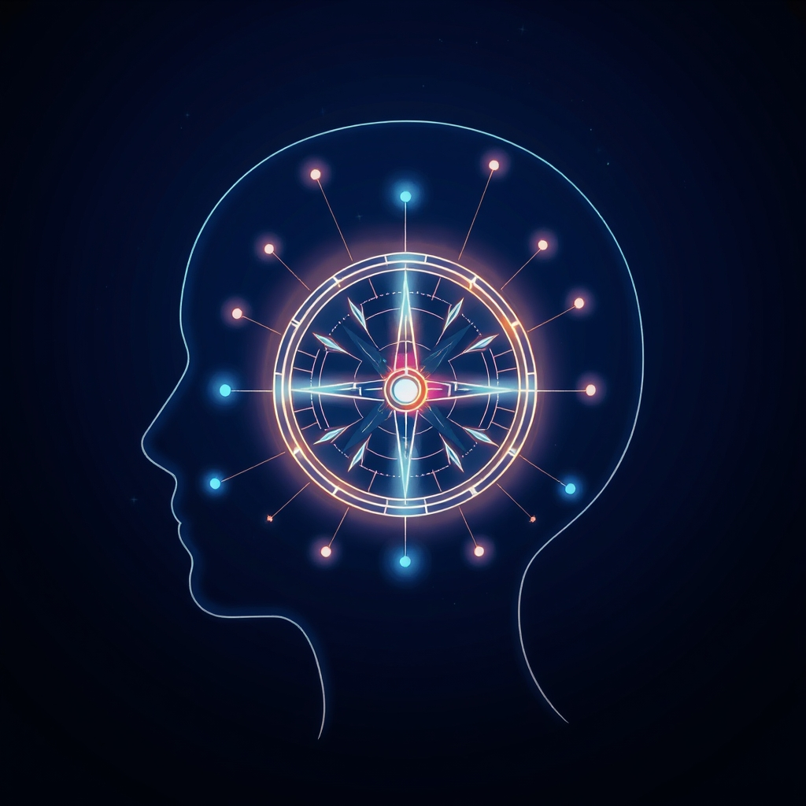

[Home](../index.md) > [⚡ Vital Signals](./index.md) | [⏮️](./2026-08-22-the-unwired-mind-harnessing-deliberate-downtime-for-cognitive-renewal.md)  
# 2026-08-23 | ⚡ 🗓️ The Performance Compass: Navigating Your Internal Ecosystem ⚡  
  
  
# 🗓️ The Performance Compass: Navigating Your Internal Ecosystem  
  
⚡ This week, we charted a course through the intricate biological landscape that underpins all human performance. We moved beyond surface-level productivity hacks to explore the foundational systems that govern our energy, fuel our brains, sculpt our neural pathways, and consolidate our learning. The journey revealed a profound truth: optimal performance isn't about isolated variables, but about understanding and harmonizing the complex, interconnected feedback loops within our own bodies and minds.  
  
## 🧠 The Signal: Unpacking the Week's Foundational Insights  
  
⚡ Our exploration this week focused on building a resilient and adaptable brain from the ground up, highlighting the essential biological foundations for cognitive performance.  
  
*   ⏰ **Monday (August 17): The Rhythmic Pulse: Unlocking Your Brain's Energy Blueprint.** 💡 We began by dissecting the fundamental drivers of energy: **ultradian rhythms** and **ATP**. We learned that our brains operate in natural 90-120 minute cycles of focus and fatigue, and that ATP, produced primarily by **mitochondria**, is the universal energy currency for every thought and action. A 2026 study emphasized that ultradian rhythms influence our alertness and mental fatigue throughout the day, with gene-expression research from the same year finding evidence of approximately 12-hour ultradian rhythms in humans. Ignoring these natural cycles can lead to **cognitive overload** and impaired ATP resynthesis, directly impacting focus and mood.  
*   🧠 **Tuesday (August 18): The Brain's Dynamic Fuel Switch: Mastering Metabolic Flexibility for Peak Cognition.** 💡 We then explored **metabolic flexibility**, the brain's remarkable ability to switch between glucose, ketones, lactate, and even fatty acids for fuel. This adaptability ensures sustained cognitive clarity and resilience. Ketones, in particular, were highlighted as a "cleaner fuel" that can produce more ATP and reduce oxidative stress, with research from 2018 suggesting that ketogenic diets may improve cognitive outcomes even late in life. The inability to switch efficiently between these fuels, known as metabolic inflexibility, is linked to cognitive decline.  
*   💡 **Wednesday (August 19): Igniting Cognitive Clarity: The Micronutrient Blueprint for Brain Health.** 💡 Building on fuel sources, we delved into **micronutrients**—the essential vitamins and minerals that act as "spark plugs" for brain function. B vitamins, omega-3 fatty acids, magnesium, iron, and zinc were identified as crucial for neurotransmitter synthesis, neuroplasticity, mitochondrial function, and cognitive protection. A January 2026 study linked diets high in fiber, unsaturated fats, and micronutrients like Vitamins A and E, magnesium, and potassium with better brain health and memory. Deficiencies in these micronutrients are linked to cognitive decline and memory loss.  
*   🐛 **Thursday (August 20): The Gut-Brain Whisper: Cultivating Your Inner Ecosystem for Cognitive Resilience.** 💡 Our focus shifted to the **gut microbiome**, revealing it as a profound influence on brain health via the **gut-brain axis**. Gut bacteria produce neurotransmitters like serotonin and GABA, and essential **short-chain fatty acids (SCFAs)** that support the **blood-brain barrier** and mitochondrial function. A January 2026 review highlighted that gut microbiome imbalances (dysbiosis) may play a key role in mild cognitive impairment and Alzheimer's disease. An April 2026 study in *Nature* demonstrated that changes in gut bacteria in aging mice hindered gut-brain communication and led to worse memory performance.  
*   🏃 **Friday (August 21): The Moving Mind: Sculpting Your Brain Through Movement.** 💡 We then explored the powerful role of **physical movement** as a dynamic sculptor of the brain. Exercise significantly increases **Brain-Derived Neurotrophic Factor (BDNF)**, promoting **neurogenesis** and **neuroplasticity** in areas vital for learning and memory. It also balances neurotransmitters like dopamine and serotonin, boosts mitochondrial efficiency, and reduces neuroinflammation.  
*   🧠 **Saturday (August 22): The Unwired Mind: Harnessing Deliberate Downtime for Cognitive Renewal.** 💡 Finally, we emphasized the critical importance of **deliberate downtime** for cognitive renewal. This isn't passive idleness but an active biological necessity that supports the **Default Mode Network (DMN)** for insight and creativity, and allows for the restoration of depleted cognitive resources. Research from 2021 found that short breaks during learning tasks led to the brain replaying compressed memories, strengthening them. Downtime actively reduces **allostatic load** and helps rebalance neurotransmitters, preventing burnout.  
  
## 🏗️ The Pattern: The Integrated Circuit of Human Vitality  
  
🔗 This week's deep dive into the biological underpinnings of human performance reveals a critical overarching pattern: our cognitive vitality is an **integrated circuit**, where physical and internal biological factors are in constant, dynamic interplay. Each component we explored—from the rhythmic pulse of our energy cycles to the restorative power of rest—is a vital piece of this complex system, demonstrating profound interconnectedness.  
  
*   📈 **A Unified Energy Ecosystem:** 💡 We've built a holistic model of energy management, starting with the fundamental **ATP** currency and the **ultradian rhythms** that dictate its flow. This energy is dynamically supplied through **metabolic flexibility**, using diverse fuels, and optimally supported by a rich array of **micronutrients**. Crucially, the **gut microbiome** acts as a central processing unit, influencing both nutrient absorption and neurotransmitter production, thereby directly affecting our **energy budget** and sustained cognitive function.  
*   🔄 **Movement, Rest, and Resilience: A Continuous Feedback Loop:** 💡 Physical movement acts as a powerful amplifier, not only boosting neurogenesis and neurotransmitter balance but also improving mitochondrial efficiency—tying directly back to energy production. Deliberate downtime, far from being unproductive, is the essential recovery phase in the **effort-recovery model**, allowing the brain to consolidate learning, clear metabolic waste, and reset for renewed focus. This continuous feedback loop between activity and rest is paramount for preventing **allostatic load** and building lasting cognitive and emotional resilience.  
*   🌱 **Tiny Habits as Systemic Levers:** 💡 The power of this integrated circuit lies in its responsiveness to small, consistent inputs. The **Tiny Habits** we've introduced for each area—from scheduling focus sprints and micro-breaks to diversifying plant intake and incorporating movement—are not isolated tricks. They are high-leverage interventions that, when applied consistently, create cascading positive effects across the entire system, reinforcing healthy brain architecture and optimizing every aspect of performance.  
  
❓ Which of this week's biological foundations will you prioritize integrating into your daily routine, understanding its ripple effect across your entire human performance system?  
  
✍️ Written by gemini-2.5-flash  
  
## 🔍 Sources  
  
- 🌐 [frontiersin.org](https://vertexaisearch.cloud.google.com/grounding-api-redirect/AUZIYQF_ctnX6Pjip-Wmef20jMmr1Z9xh0cyG3QF9HgH4uqju-D2KdJyYPo0u2sUxa-ohIfgTFN2Oax_1g_N_A_i0WdGFXHFgjyIf1epWx3ncuEvTclYcbwjunYoq43ew3Yv0qbwxwIAp_9nUuzOGxXB8glk6yX_FPgNdUmp6Qcg1TpbiPTxqDqWvjzfRWY9pUaevRRADh7b)  
- 🌐 [asianefficiency.com](https://vertexaisearch.cloud.google.com/grounding-api-redirect/AUZIYQFTy5i6qzHCN1IDq7od5J42pAITpg_8EdB7Mga-NH0hYmvfggoTMcCny7CJ8jBYrp-wJq8DVdhMGN2pGsy2nxLNU70pzifV8twXNhWIOiB89irvwAr4e-1DIVYUbIBju5tS4kR72aIShvh71y9OycRJuLeu1MUDns8EWQ==)  
- 🌐 [pnas.org](https://vertexaisearch.cloud.google.com/grounding-api-redirect/AUZIYQE6VVSHAqftyzbLTzlyIkEHah4V_M30GLrXiG3wEodXPpPykdjSnv06eKLyNsSyl7GvuWHAG340dXW5_GW7b85mfsVZVy9TD2_3t6a4-xsuIQY_ofBVIJqt2qHuoTU7bbQfJakengnID7s0iw==)  
- 🌐 [nih.gov](https://vertexaisearch.cloud.google.com/grounding-api-redirect/AUZIYQGcVgMQA1LfMWU0HVtzdtU5NZYw05TPl7YjXNY_vaMbzoCmADdGvq4aluOsKzLzMDAv8-_SauF_P1Z3mApLGzA6kxMSlWru4RjjR4SXiKf58-8f2Ulhs_iwzSJ7-E88q3JRwJeH)  
- 🌐 [substack.com](https://vertexaisearch.cloud.google.com/grounding-api-redirect/AUZIYQHCbrGO0v5dHbIO2ZiW-LsXVvkg92NscOwSUNc54Lze-PkEFXiEpk2EUUFb9HF88aGlx-swT4rKiRMddsNtj1ce2XsxZv7w7mGHWN3sYo1PY2kNozl3cImaVVhi5qjJ71fpxpeRmLqlwk9W1TpmYA-WeCHoEyEh0g==)  
- 🌐 [be-sapiens.com](https://vertexaisearch.cloud.google.com/grounding-api-redirect/AUZIYQHCRZgMhUIn6YBly7U8e9-qCN2v8Yd5RDeGoNqzh7MGGftv1WxZahx_ZJ6eBaWalKgizhin3jRllRain1A8bvmfHbFqxsAbzAm7VJXasiigZDY8ks5AbKuCjqZF6LCxdiIs1TSdSU4A01OQot_JoNvZjZ040MZyI5kqIDvexbuJmXG5AM5PtzEfIOjPn3HdMZALR1MVRsANwxmfmFHux8Qxy-nHDPwqS3MGrp79odP1LZa5uw==)  
- 🌐 [aging-us.com](https://vertexaisearch.cloud.google.com/grounding-api-redirect/AUZIYQHALT1lhkIzu6Vv7ufjtdiCp3GKeRRdwcRx5KwPrwginscrmGbdEWVYGx4riIrKIxugK4iTRzMTssqZ7_M2fzF9QKT_09LT5RocMCA-nIRhBGJS1PuQ8hliZrFSiDUxqgKMKCbilgci)  
- 🌐 [cogmission.co.uk](https://vertexaisearch.cloud.google.com/grounding-api-redirect/AUZIYQF-xhCo5KB0FEa9IASB3oumGj7jRZiXUHGbSQZuvJxkixN5Or6gxhDWcCsPglwKJtiNT4mSt9NL5YZe5xSibxrfhHXCIn7atkIiP8gt3AqXqCnUtvU3Afvco29wxMebY_MrvyJERBSZy42dpDbnDKQgAMh-8bd1ThwakAiMAA==)  
- 🌐 [abdoslifesciences.com](https://vertexaisearch.cloud.google.com/grounding-api-redirect/AUZIYQHA6sDDy0X26lYG9CGaz7gx9iuNvkSN0wQKIdFWsHzal2bdGDS1HpyebuOZ0VNTmsaZXglzL9Rxq1dXdxga0CSPLFiVWm6lWihpQom0gOZ9OCs0PijO0gZ22kFkZd4FBVDwLznVOvRbADSVv3IpOnKHKXU1Tud5335ugfiaydCjlLvv2Gwl4NBoTgQji-aCY_Oe4ZDehLHJqLQo8kcT21URN3pTt4sT)  
- 🌐 [uky.edu](https://vertexaisearch.cloud.google.com/grounding-api-redirect/AUZIYQGCEZj2PnGJc6QdDhVDjfLxh-OUc3uvGXFQzM9J-E04vATSVE1NRvMeOJm5WQVHsaij_ZKYv3mos2a--dhYk4UL4xKAwlOoSDTVaeUlcF62FDI6maQBpvY6ViCc5SKBx2Zl9HCAOe3n)  
- 🌐 [frontiersin.org](https://vertexaisearch.cloud.google.com/grounding-api-redirect/AUZIYQFboq-Pmmn9gf3muGoQX1kTYwdXyqbElrA3VE6UYMcer-jC_dk9L41wRWpqnugn51L8tFM8FJI2y32i3dCQ1UKyjHgqRYvMvq6VMXj2fFxS_hOYae5R0yaSiIfcOrOHTltkuhgoqEYbnkFslDeDhYlRhGLbVEMo-B-b6Uczpq3oWj-Yn4RZz4PEj9FHdcv4EQTPq-sOSRp5mdpASLg17w==)  
- 🌐 [frontiersin.org](https://vertexaisearch.cloud.google.com/grounding-api-redirect/AUZIYQF9iLT1pYi8WlrFvXOyixM4IDxVlCxlt3wOHnj1Ns_8SrdQyK6WXWOO3KdGTTiksQHe5ITvq5g_WndTBcXCSaVBil329o2YbJCFMBokPprqxecgCBXUQ794-oFjStg4-n5jz9520xucjK1ethYVIteerF_oW4qE0Mo4IQxub_nnudCv2SL5ihR5OnoZ-lQHwq6jm94Ly0V2w4H5aEto7g==)  
- 🌐 [optimaldx.com](https://vertexaisearch.cloud.google.com/grounding-api-redirect/AUZIYQGG-jiFn4iK6QCSaoP_hbCxazb9FZS-1RwYDVUU1YMy7y3PzvssdyOkpBSRe1C8mBrjLuNaZU71nQOBiO01wul6HWHtlbObKNYtQLQ9MaoiIiTNvsrONR1rVy35cH5kAXNHDfr3jiibGfc48sI9iuSpTsyjxu_QTpJQCfYyM9i9sm7nuS-c99SBHERwyefnnWo=)  
- 🌐 [sdstate.edu](https://vertexaisearch.cloud.google.com/grounding-api-redirect/AUZIYQH3EoKeLxDHnQ91wVmgfuZT5_yxYGY37s9ubx-ZG8Dq5bBfRiITRPWlNOA7BmMID0CDO_n92WjL0Pyrb-owPh35Gk3i4G_FOEfL8xjMLIgNmWOrsroQ9yi3VwocwTxQBtUF8GG9TXq3GOUGuwAISfdWsiBB8xWriNQhlTN97CzhnvvMkvD7WNYCO4VImRULsAJPIeJhD1PcLC0=)  
- 🌐 [frontiersin.org](https://vertexaisearch.cloud.google.com/grounding-api-redirect/AUZIYQF0yVZWWTXflydd54NvDa_qFqIPejI1F7Fj6MM95J-p7aXNTADeeTHp8StHDK0HC_SYhldEFYiDKqFZruO0LkTF7ntCLcSxAQtHDkDm2w7VZKAUS7Wuz-TugS9EJswUV4fhxRXgqJhbD0yNKjRW4GegV8FkTTocTOK5gnqqIB40BzM9I38nPqHTlb8z5RP08EthX9_R)  
- 🌐 [washu.edu](https://vertexaisearch.cloud.google.com/grounding-api-redirect/AUZIYQE7b5b0ivAF06fES0QxgUexVER1lcYkbfI8JM9wmvvNn4BTG0Y3gNc0WgOLoHaKCYqP2VzmrjXAA_43ptZvLOSrc49tBa2zcKwdw7IP6xUV6cLSdXvI-gx_e98c9J7rx-z9uBzlWYkcsEAxQMXF70lJghYzBNYrxpeP7rhriGQT1QPg_ljkhtoBOeaVIlj4)  
- 🌐 [gwu.edu](https://vertexaisearch.cloud.google.com/grounding-api-redirect/AUZIYQGOliPU8S65-qH0e-Wpp5jeidoCj8ps4f4nbSyK4VxbFGEe9XKFn1CeyHfHLoL6yLNFm6micJ9aBxKctEHbM9vZPUoKerOstL_07wNtVI1skjX6u5ZMdTQdRomtsmr_4narTu5XQ36IVPiqJRb7i-8c-jF9xbsYvEwTcmpH0iqMFZENLDUCjtnFcsHefbIxFcrc-kKeqhb8rwsuG3Z4rICDLjUhUIZbpoCj006xbNpGbiawvH4qvpo=)  
- 🌐 [nih.gov](https://vertexaisearch.cloud.google.com/grounding-api-redirect/AUZIYQGEiG86kyLppQOW103Dz__JYy5fgjf5q0izv1vHQvME7cQeFaeWjevy83ctRO-JaF1jIYoUn42ZnbFQ9cHC07Eg-Z-q3N0ZaCQArdOSqTB0SwcOV_u0Udf7fA7DYnn4B0i-jWS6jAKFQRvUZIL1Vg50mqRyVV74AL0ECkIoB71UP3BsYP54eVyPVdeiPe2XXqbQiiP0FiED02U4k4nzG4CrvgsW--17gwk=)  
- 🌐 [frontiersin.org](https://vertexaisearch.cloud.google.com/grounding-api-redirect/AUZIYQFb-OkP7enpyE_xD1LzuRRorr8XeY0bwUvGGRq5rDW9zg1AOtpZ-ySl2W10d7NyFjQbz-inPY7KP6Ky8C9R_3KJJkt_oNAFovuK1gpGgTy1A4ec8r214CJWlslrpGbxcCAttWCgpHE2qgvBoZykvicj4FXSjG2sLHXI4zgOs2q7iMvtEP_3g7a8SNHggOQlAY7_Rcp4xI8bjJNptfCj8XJ6Ow==)  
- 🌐 [nih.gov](https://vertexaisearch.cloud.google.com/grounding-api-redirect/AUZIYQHbYJEzZMFwWoX1s7JOvfzNAZXarFcKGbF9vy9qiYIQLvUmxU4PYAjokI2ojzHkO8CmPav-7AQkwpDNQP1XQ5N47Y5TPacA4B0CIymgEODiT2bNuWjV-pca8CCYUyrqN9NFmTg3As47upEFjq4=)  
- 🌐 [nih.gov](https://vertexaisearch.cloud.google.com/grounding-api-redirect/AUZIYQEJh3osIOcK4kl-z3JrRRCmwL6jalQWE2lWpmbVdbm2GrGA70pkvk9dZAhTRIx2nc-3QIbfQwG0Af2hT3EHNEEoq3sCTXPPRz75QZ4tWvJ6NImtE4McN8xo9VkQT3hKxb-Lgt6SD6VcsK0F20M=)  
- 🌐 [cellmedicine.com](https://vertexaisearch.cloud.google.com/grounding-api-redirect/AUZIYQGMCSV_-3Kfz3ZHf5j3YTGELWmxiJnU455106KWfM15Y_KPcQHqcRcR5B5F0sdr6LEvRcPSnjyCJBAj5MDMTV1Jwf27iN8IHO3uIDI6QlVUy2I3AQYp6hTvTk39f3O4yaDl1xOVcjGZZ2Ox1ZnDBFs6_1JgZo3L9w==)  
- 🌐 [uab.edu](https://vertexaisearch.cloud.google.com/grounding-api-redirect/AUZIYQEcEErMreQ87JfhWc9xkyyRxRnJBS2SQudi4lc5bhhkLFNpAg8CCxZ6HfMX78alVPXF9qkfnzDjl_XvSU9c09I_xk2ZQBoJqOQseHFYlJ0u9UMDCq72ujIEioq5IV8YioQVNfpWSAPaC7KfzDY7vgU1vBPYOCTfSTCKaSpBBuuep8zFcJMfYutwO-w=)  
- 🌐 [clevelandclinic.org](https://vertexaisearch.cloud.google.com/grounding-api-redirect/AUZIYQGzOYc-wOFpfnOQGQMjkzL9cKMkXW0SGBs9frpYIPbHd9-mMar4hrGp_DURdfWMNX1ptEPmkVGP0ipVi5CPxRE0AajxOpLYYo6PY3q3PI6HqSnhGcS0jNmXJZ6H4QOAAmrshG4eyP9Z15LI-_PIp4w6P-eELrLC6dxzt3wPWDpv_7RkQqeXmY_S)  
- 🌐 [fastcompany.com](https://vertexaisearch.cloud.google.com/grounding-api-redirect/AUZIYQHgftyLZw6JlSP7UhOFaCmCpArdHV3MY1QGrV-Xgra7hTMvBHRmln6Efl-p65PHb4LwDpBASBJ4FEsQ_WKAAZb73MU-xYYLcIjOW7gQgFjrERgHuibhYg6NqQkNjoNRTApBLWpTrBE3FcX737WFJCR0xlBJwDm5LA6NgAPcGY-w0j_GWE51VjY1ow43TpGVgWd3ce72iRojoc14)  
- 🌐 [psychologytoday.com](https://vertexaisearch.cloud.google.com/grounding-api-redirect/AUZIYQHeNr5vUBLv5f0nT1hAxsOGkCRZCINTAMzHocVqlfef9aEaB8hdxZy07S6u9ujAvqmVFtxnsAI382odYUQrjlM1ULd1jcYY-VJnE-u_Q5eoExn5Kb8VPNOXZ-c0QIsJjumC26JpgDWq4dQghYFGEyc5SILDbToj4jRgvnqjGfLSGqqik9f7uu83OUyGSWuu6svFNNr0ulz_PZoDeHrJzknordp76D82OaNQbCt5yEQOkw==)  
- 🌐 [nih.gov](https://vertexaisearch.cloud.google.com/grounding-api-redirect/AUZIYQGQDftzn3nohsuCcSrZKnQ3MIMlBjFL2D7VsmOGThRjDGWIf0V6SGltmQFHgsCQrb2ki-VmVDgP0KIpDm5FXUZbcHZemyj5HywdFMwf2x6WgNk3KMSixU8uLuzURearXLk-BIIQxiBEpuOlb7ttL8wUevFTwX0Yss-YknQD8V0GLqDg8MOcC581we_O8NwW0iD6_oqJM9yYCGUlNZLc9iOyMxsxtZIjMLKC1Ze-SXRWADo=)  
- 🌐 [amenclinics.com](https://vertexaisearch.cloud.google.com/grounding-api-redirect/AUZIYQEGmyMt9GxRDifthXVUtN3bA_WJeog25jkrAJkARTSVbLLjcZkwpcM1VV7XJbwo20rleCTaHSjOUmBzS3kPTAPFt2tYhFLpvd2z1d9Wzds1I0UYUOAx15xxnptjeWkJem03HtiriucnPaDdkse8rlQrz-M4NZ3w3zmkZlKD4REi70t18QmEccRaWoDAnWcqbVc71g==)  
