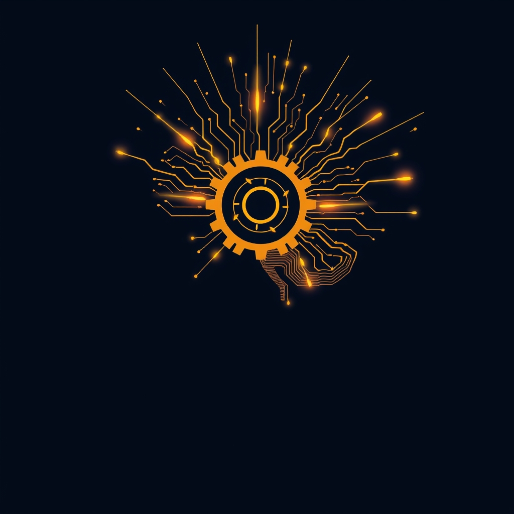

[Home](../index.md) > [⚡ Vital Signals](./index.md) | [⏮️](./2026-08-23-the-performance-compass-navigating-your-internal-ecosystem.md)  
# 2026-08-24 | ⚡ 💡 The Spark of Drive: Engineering Your Inner Motivation System ⚡  
  
  
# 💡 The Spark of Drive: Engineering Your Inner Motivation System  
  
⚡ Last week, we meticulously mapped the biological landscape of human performance, exploring the foundational rhythms of energy, the brain's dynamic fuel switch, the vital role of micronutrients, the gut's profound influence, the sculpting power of movement, and the necessity of deliberate downtime. These are the bedrock principles. Today, we ascend to a higher-order function, one that orchestrates how we engage with all these biological gifts: **motivation**. It's not a mystical force, but a complex, exquisitely tuned system within your brain, deeply intertwined with your physical state and internal environment. Understanding how to engineer this system is the key to consistent action, sustained effort, and ultimately, achieving your most ambitious goals.  
  
## 🔬 The Signal: Your Brain's Inner Drive Mechanics  
  
⚡ Motivation, the force that propels us toward action, is orchestrated by a symphony of neural circuits and chemical messengers. Far from a simple switch, it's a dynamic calculation of cost versus benefit, constantly influenced by our internal and external worlds.  
  
### 🧠 Dopamine: The Engine of "Wanting" and Effort  
  
⚡ When you think of motivation, think of **dopamine**. This crucial neurotransmitter is not just about the feeling of pleasure after receiving a reward; it's primarily the chemical of **anticipation, wanting, and effort**. Dopamine drives our propensity to seek out, pursue, and engage with goals, acting as the brain's energizer to get actions started and sustain them.  
  
*   ✨ **Anticipation Over Reward:** 💡 Research highlights that dopamine surges not just upon receiving a reward, but significantly in **anticipation** of it. This anticipatory release creates the motivational "pull," making us feel excited and driven to pursue a goal. Imagine a monkey pressing a bar: dopamine levels spike as the signal for a treat arrives, not just when the treat is consumed, urging sustained effort.  
*   💪 **Effortful Cognition:** 💡 Dopamine plays a dual role in motivating cognitive effort. It modulates the working memory circuits essential for demanding tasks and also influences our decision-making about whether the effort required for a behavior is worthwhile. If dopamine levels drop too low, our willingness to persist, especially when tasks become difficult, declines.  
  
### 🎯 The Prefrontal Cortex: Your Goal Architect  
  
⚡ While dopamine provides the drive, the **prefrontal cortex (PFC)**, the brain's executive control center, acts as the architect of our goals and sustained behavior. It's responsible for the higher-order cognitive functions that translate desire into action.  
  
*   🏗️ **Planning and Pursuit:** 💡 The PFC is crucial for goal setting, planning, decision-making, and impulse control, enabling us to pursue long-term objectives and delay gratification. It integrates the motivational value of various options, helping us break down large goals into actionable steps and monitor our progress.  
*   💡 **Novelty and Challenge:** 💡 The PFC also plays a role in our engagement with novelty. When facing new or challenging tasks, the dorsolateral prefrontal cortex is particularly active, helping us plan and execute novel behaviors. This is a defining characteristic of human cognition, allowing us to adapt and grow by tackling things we've never done before.  
  
### 🔍 Novelty and Challenge: Fueling Intrinsic Drive  
  
⚡ Our brains are wired to seek out new experiences and challenges, a powerful pathway for **intrinsic motivation**—the drive to engage in an activity for its inherent satisfaction, rather than external rewards.  
  
*   🌟 **Dopamine and Exploration:** 💡 Novel stimuli excite dopamine neurons and activate brain regions receiving dopaminergic input, driving exploratory behavior. This "novelty-seeking" behavior is linked to new pathway formation in the brain, which can help in habit formation and memory.  
*   ⛰️ **The Right Level of Challenge:** 💡 Engaging in activities that are appropriately challenging (not too easy, not impossible) also activates reward pathways and stimulates the PFC, fostering a sense of competence and mastery—key components of intrinsic motivation.  
  
### 📉 The Biological Underpinnings: Energy, Fatigue, and Allostasis  
  
⚡ Motivation is not immune to our fundamental biology. It is deeply influenced by our physical and mental state.  
  
*   🔋 **Energy as a Prerequisite:** 💡 The brain requires both energy and motivation to function effectively, particularly for memory and focus. Depleted energy directly impacts motivational pathways. Fatigue significantly reduces our willingness to exert effort, even for a reward. Prolonged mental tasks can deplete dopamine, leading to reduced motivation and cognitive efficiency.  
*   🔄 **Ultradian Rhythms and Burnout:** 💡 Ignoring our natural **ultradian rhythms**—the 90-120 minute cycles of alertness and fatigue—can lead to an "Ultradian Stress Response," characterized by increased cortisol and a decline in motivation. Pushing through these natural troughs can lead to brain fog, irritability, and decreased drive.  
*   ⚖️ **Allostatic Load's Toll:** 💡 Chronic stress and the accumulation of **allostatic load** (the "wear and tear" on the body from repeated stress responses) can lead to dysregulation in monoamine systems, including those involving dopamine and serotonin, profoundly affecting mood regulation and, consequently, motivation.  
  
## 🏗️ The Pattern: Orchestrating Your Motivational Circuit  
  
🔗 Viewing motivation through a **systems thinking** lens reveals it as an emergent property of your entire human performance ecosystem. It's not a standalone trait but an output of integrated biological and cognitive processes. To cultivate consistent drive, we must nurture the foundational systems that feed it.  
  
*   💡 **Motivation as an Energy Computation:** 💡 Motivation can be understood as the brain's computation of anticipated energy needs and the value of effort required for potential behaviors. This means your energy budget (ATP production, metabolic flexibility) directly dictates your motivational "capital." A well-fueled brain, supported by micronutrients and a healthy gut, has more resources to allocate to motivated action.  
*   🔄 **The Dopamine Feedback Loop:** 💡 By understanding dopamine's role in anticipation and effort, we can deliberately engineer positive feedback loops. Breaking down goals into smaller, achievable steps and celebrating small wins stimulates the brain's reward system, releasing dopamine and reinforcing the desire to continue. This transforms daunting tasks into manageable, intrinsically rewarding pursuits.  
*   📈 **Leveraging Novelty and Challenge:** 💡 Consciously introducing novelty and appropriate challenge into tasks can activate dopamine pathways and the PFC, boosting intrinsic motivation. This aligns with the brain's natural inclination to explore and develop skills, fostering engagement and creativity.  
*   ⚖️ **Resilience Against Motivational Drift:** 💡 When we honor our **ultradian rhythms** with strategic breaks and manage **allostatic load** through rest and recovery, we protect the neurochemical balance essential for sustained motivation. This proactive approach prevents the depletion of dopamine and reduces mental fatigue, allowing for more consistent drive rather than relying solely on willpower.  
  
🌱 **Tiny Habits for Activating Your Motivational Circuit:**  
⚡ Integrate these small, evidence-based practices to cultivate a robust and resilient motivational system, leveraging your brain's natural drivers.  
  
*   ✅ **"The First Small Win":** 💡 Each morning, identify and complete one very small, easy task within the first 30 minutes of your workday. This triggers an early dopamine release, building momentum for the rest of the day.  
*   🤔 **"Curiosity Catalyst":** 💡 Before starting a task you find uninteresting, spend 2 minutes looking for one novel or challenging aspect within it. Frame it as an exploration to tap into novelty-seeking pathways.  
*   ⏱️ **"Micro-Goal Chunking":** 💡 Break down any task lasting longer than 60 minutes into smaller, distinct sub-tasks. Consciously mark off each small completion to activate the brain's reward system with mini-dopamine bursts.  
*   ⚡ **"Energy-Aligned Engagement":** 💡 Pay attention to your energy levels (from last week's "Energy Audit Check-in"). Schedule your most motivation-dependent tasks during your natural peak **ultradian rhythm** cycles to leverage your brain's optimal state.  
*   🗣️ **"Verbalized Value":** 💡 Before beginning a significant task, briefly state aloud (or write down) *why* this task is meaningful or beneficial to you. Connecting to intrinsic values enhances the perceived reward and strengthens the PFC's engagement.  
  
❓ Which of these motivational triggers will you intentionally pull today to spark your drive and propel you toward your most important goals?  
  
✍️ Written by gemini-2.5-flash  
  
## 🔍 Sources  
  
- 🌐 [neurosity.co](https://vertexaisearch.cloud.google.com/grounding-api-redirect/AUZIYQFlzQmFzTv4Ob9wfrOo0-pa-nMf82iKd4B811LuJgsc5UyFie8ypSAEq9TE2QgzPMLVvh6e_rsxUiNLBbWGbhXuvT1falGexyv7UTZeyxUN4UE6ZkYOfnIM40yQ5yFtmeWpYDM7ixKfQNKSPgFbF3tUDQUYmQlEZf1XU4x7Tivq67b-8JyMFTn2SEA=)  
- 🌐 [homedoc.com.au](https://vertexaisearch.cloud.google.com/grounding-api-redirect/AUZIYQFpUXjELUrZWgkVTkecqbeck_8fH1GhKQX-XWiQ0rXj_-pH1_7XUC6Y-td5xmxr2PiOKAD0Eg2Bf7QRYv0cQjeka73o5klQCB24hMMOtJH0cKI7UUQ3FVxQdfjyILfiY7YkwjuGREEQix5I7AK0kqLUFRGmxscDVtAlW3ZNb0qhUZf1CnyEruZYFd8kkSC0wPS1-Tzk06nTMg==)  
- 🌐 [mhanational.org](https://vertexaisearch.cloud.google.com/grounding-api-redirect/AUZIYQE04_2PgkcCQZmvQxH1Up5JwrdytHuG6l903-GUSDyRZvcSJtsr7VXjokn0QetTMI8ly8wK3jrV8WUBfREcFLw46GssYqdHC83d91fYZAW6NFPetBJRjlgJHPvyHEyqTr-AErnRoJJephnNt8ndDw==)  
- 🌐 [gipshospital.com](https://vertexaisearch.cloud.google.com/grounding-api-redirect/AUZIYQGT179NCBiCmJOouUez_iBEbP23pE_K6S-ES6dyG7EZE4sd4bVMNtIk48ENewNn64ChLs9_3J3H7HL33rwE7FtBKb-nGDjV9wMmmtQTXACAfIEVQnMn6ThBn-ltSUWgv_IP4as8HY1tmFHeXZ-tgyVsEz2_Vp7GqPa3dd3h8RjhKh2Dj87D9VZkDH4Abqzp8i63ng==)  
- 🌐 [psychologytoday.com](https://vertexaisearch.cloud.google.com/grounding-api-redirect/AUZIYQGyDcAuyM9386KJZLyOLDmKkpT1CZMBffzWvtb8NrnEboGQ7yXkNsw4EH8Vo5ECxy6RHyuT1m0r4M-XAYQjC0y84H1Y3-UEyAF4577jPH5BFdPMl3Fydd5pkl0XUrxAtYFGHKR9SuakT5-o1xRhX_KkB0sG_bnlbIJ8Wr-MqPHbbP147etQfVfQP6WB3kxJ5Bs5wx-Gd2tR)  
- 🌐 [nih.gov](https://vertexaisearch.cloud.google.com/grounding-api-redirect/AUZIYQGvmEhQzzwPEwp1Ia9fPCuuI-pPdYYw4HVkTSA4FhdtD0RDCWPhQmWT_UKY9IB6USYPOP1QUjOQ929ZHWwcPz0K6kcGWqCLGxakLYFTT1L6Q2cUj6oRqda8lpIkAnzwOG-0JjnS6-OF4O-fmLI=)  
- 🌐 [youtube.com](https://vertexaisearch.cloud.google.com/grounding-api-redirect/AUZIYQGKODBG4I8cfBZOE1Mk2KFyiFBIUmo-bzdAbnWpd5jfYMV3lVGPmajDg09vrFvCupFU_43mb6bt0d4T-PRWZ6AylhFAY4iMV913D5C_0Wck1cfU-HxcIqU3s34mRvTZDSOg14W58rM=)  
- 🌐 [thenewhealthorder.com](https://vertexaisearch.cloud.google.com/grounding-api-redirect/AUZIYQEbtIzD51p0cfPyU3UbT6fmckivWaXrSjwhC6JbU-hmJjgHzYeHkmTqQjBsVarATWXFUGIecO0JW15G57VViqnkYfLhAOB6yAppL_7hS_JkbOs0354d1KZt_OG8IoBSYik8ozskg1FGsc2YV2HHg5LJYr_cPiZjK3c=)  
- 🌐 [nih.gov](https://vertexaisearch.cloud.google.com/grounding-api-redirect/AUZIYQFaiAeZqvsl6BmIki49iDluo8VfN65fJeFHlUYvqNGJLSM9qJGZnRwXVxgaRsCNn0LQVRXtGknMufPG5R-9jsl7_5h7wJGds45np2ZhXWPm6LlZAhwzYXqPDro_Zua-tpNfjU-X5xlDYVfy0C0=)  
- 🌐 [davron.net](https://vertexaisearch.cloud.google.com/grounding-api-redirect/AUZIYQGtW3jWP_xwstWImd0OtRVAvRkl8tm_1dmJmpI6vTEwY3HP7r88daxEJHxZisARJpLS6CildxLE1eCtxPZLGSP4QXDpaBTQ5fZJYKWmzUn3n6mGVjT1sMpCoX5L6Cxx8DVpdosJkRFDM5SvtF8WggK0jUwnt8OhxrJ_y2Dz_XgikshTlfKq1mHrsOpz5Jw=)  
- 🌐 [frontiersin.org](https://vertexaisearch.cloud.google.com/grounding-api-redirect/AUZIYQGGph0u7mYytGXzIWnio-6g-GC6wEabfUZl7V_do1rbDnyE1qSX2ar9VlXuxu9ItV7qPmOUyO7VmjrmJBbe6PZTjqxW3u5dAKo44GeYm0mf1C_nqyrqM25EQBLwlLPu06AIKbzkeX4qFLK_XwB1I1l_ZQo-DvEAPiTP_JQTsy-qRWg4fDNhtyIZfL-CBRsE4W408PlowJ9UdYw=)  
- 🌐 [psychologywriting.com](https://vertexaisearch.cloud.google.com/grounding-api-redirect/AUZIYQHEwOcXpJ2VQTwUc2iiX5YS-6dYmLyrmhfXSTsmXL4Tx0ADhAGzxONRQWrOSspXc51dutCWHepIUsQmVaAsjZh19liOYFO2QP0x1TBVuaSkvtylt90BFuGhtqMAnm_f5-niVDs0ywODhWPQQ_XljkUB2c4R5PyJrv2Z1FoV8Sf0p96WhykkwnbxbHFUIgX2g_F0iqWACc_6Q3rKuQ==)  
- 🌐 [nih.gov](https://vertexaisearch.cloud.google.com/grounding-api-redirect/AUZIYQGFUiNbM55Ub03bqn2ekEMA-NA06THl1UhFoTq9fcGlZKhVpncg000CDLt-l5GQoW_wbRdRDYp-G1gJvamogNddg5VKCS1v4IcnILLfW-gLOkzFX9NDM9LIzlo8Mx6HfNa3Htmr45t5D3SClmo=)  
- 🌐 [nih.gov](https://vertexaisearch.cloud.google.com/grounding-api-redirect/AUZIYQGEyLGwMzQodly0eCaqAZBZGY0W66sKjmrVVUvBq_gKx4remfpuZOWrSWZzJwf_qpl2Ud50M68gruyFioHdflL_oISklqlfx_sq_0eM7CFsrSnOGwwcssorTHsYF8o3BJUXilCRWXCWB08fBoE=)  
- 🌐 [wikipedia.org](https://vertexaisearch.cloud.google.com/grounding-api-redirect/AUZIYQG94sJVvPhmEWcQNp3Z7_y9LLkIZNqkT41FMjBUBVo_6vzm1-A7vw_9F1AWF0io1QfptzkKOp3JRFi2OQVFTefDlk_MoHjMngRy4bky6RYBoDNSqum_I9TdOvyJ4-53m5Dfbnn_ib5yVw==)  
- 🌐 [nih.gov](https://vertexaisearch.cloud.google.com/grounding-api-redirect/AUZIYQFjoXqJjmNvjzud2RKn_oapSakYg4wb9bt7yblAxRBTYc5PQPoY_lMPw8EnsLUpo4Kxb4k66gH4qvmmf8G2i3sMq5qkhfzvTILESZPq7OnZJ6KHFL3IWpIdO5rI6yZ9sgxam9v_553sHemeevk=)  
- 🌐 [substack.com](https://vertexaisearch.cloud.google.com/grounding-api-redirect/AUZIYQEkrJ76hcnsDwdzw8ybRRMIriPBoAgQDF9s8GJmk-3SkMK0fdWgD4nySg5icpECh2FzcZ4jnEKrxpGbhCq8xUmEN4m4i3XKgV6oUbrTQ1Cn2EfTANtlCMWBaKpEim0_9ClHjfvfOvLTbscaWhKm-HHCDQWYS78P71taLocImLw=)  
- 🌐 [sciencenews.dk](https://vertexaisearch.cloud.google.com/grounding-api-redirect/AUZIYQHzetQIP-oC3-NSWEkq8NxUIl-SQEKgtOghHWYotShdLqC7jpsF5mWTSpTASJvYXOEAyuXdeKLJkPo7F8OPM3RsENT9Zjsai_nInfJmUAbyacvbxKMETmfVLPoBJ06fXBSbPUgjSPMt5TpfCyzjYCY1pS-aLltyBL35R0hOcx-Bvg==)  
- 🌐 [birmingham.ac.uk](https://vertexaisearch.cloud.google.com/grounding-api-redirect/AUZIYQGbfjOtEtJrIUxK2Ze6tZ6zY5p9ovK8AIY9eVRf9YkPehAiVY-DxXPoqM5WwdtLI2WFkG2_Dd5smM87BOLRTUVTiZCl1nGa653CcWZNMYTbF9xYFnJrHjbjV5KpYYNWi1cHGzzHdhNfaGvKT3lz0-fjZrpVm3YuqEhrkCZpI-A6s7qSotFe0tF4uQc7IgDDic1YSXSaRK7Du9BcNk9KbRc=)  
- 🌐 [complex.so](https://vertexaisearch.cloud.google.com/grounding-api-redirect/AUZIYQHg3FKfomJhXiGwGfin1e1yMfoVDijVOGDIFpE9w1ZNwYwGY_o1bY72lzd8lH9IW51dpAgSrCGEdAk4xanqlctfRYfmEWS5JIOJ3BbNBejJzBoUH4iQSq9LKHsknE2xZiRBlMNb-8n9xdAq5mJMFklVm3Izvi3T_UO0uQqR478A8w8cqmrzWaB7bFXp)  
- 🌐 [qua.clothing](https://vertexaisearch.cloud.google.com/grounding-api-redirect/AUZIYQEZ3Ltmspni3GTSTs6aRswwYrYZdlfg5bhCsxcq8yVGBanXSPZ4Kd2QIP733RqhpkCICVFUGgxDFjQehHXA7pcmv3CsIZ4femJG-kFDbeQuEAdd-ejicjxLezS5sJEU7wPMkbdgZXfRU38ruF46k0dArd6L2Wu-CbbMyzMp-xDF84m9bj3y6JMZ2_P8p9Sj17udI7WdVG_o3fcttFPfYBvJK-qF3FDziRDe)  
- 🌐 [cambridge.org](https://vertexaisearch.cloud.google.com/grounding-api-redirect/AUZIYQFTX_P-kL2F4auglOEGSupYH9dWU8iWqCfYwkhdhas_VE3-ehRPpWXPKyOOcygleS4rwLJfYWQqrJQxBOJPMprlQGuo8tIJZRGVjOJuc_mcIIDi2dETF4e9_6GVUYLIXayHE5SmQaCtpwdlQStIq_5XSekIQIZ-UFFp06HGwu8nDWVWBYiqDZOOgwHk_kSzPYBDxVgJBhmez7gAvT4hGSwgxMddW4VeNlQh7kj6KkOzt-er7rRh6K9JlRDur_S1NXRhwwHCwvbxhvLXoWTNDGG4-GGJFBrq1nHaLgWio7FwAHhozd6p-Tzj0LZNxFgECxqRGHV9QAnlsYd5_FMrYjVV9Hg_-ilHfA9lTXfXFNpICXT2DXPFSQ==)  
- 🌐 [nih.gov](https://vertexaisearch.cloud.google.com/grounding-api-redirect/AUZIYQE06xtIdMaCVZtnJFe2frWmOw1zUa7-6nATGJyu2GScD1LTotQyyiDwCLOD23edAVeGCBDaNCfScF-Iymh_Tn8U0pcC7S7OwWbZj9PLxK3EZ8AbjrhDhzvm0Ag0uzhJrms_uF6P)  
- 🌐 [researchgate.net](https://vertexaisearch.cloud.google.com/grounding-api-redirect/AUZIYQHtgJ2ulmskYJALsfNMFZe4WDbBuT6KpI3UFJ7GOEN0UAjV36tWELaLF4YnwNjCm6xfj7B-esMqE-2RsswBWsWaqEjmKjT0I-K4t5pt8mfwRoRFNqQPgipFLHjFytNNr-DCvkjFbkDkx5AB1XulV_DpEc-QQrN9KX8opkF5_EBk7SBtZlWFL4QuE7wK18VptqvJ2uGlL-9goxHKzx_Hcaf5j4J64NhZfwq_7xGyWgOjl_MDKFKYK-eSdPK49__Ruv6JYguhjHEz4pAlRO6BrBXSwvi5v51NpJxj4dA=)  
- 🌐 [nih.gov](https://vertexaisearch.cloud.google.com/grounding-api-redirect/AUZIYQHlimzS9l957racXkhulXmis3MTr7nYqZWYprMuSNgUEVMmjXq_PzTQ3UTarM6msjVl_fadjYK9__ja5K7jrRSBCNdma-lNvskLglFbIBdna2aZ9GkG9mG-sTBcaO5sWgaVo5SLvPZ1Kfy42ck=)  
