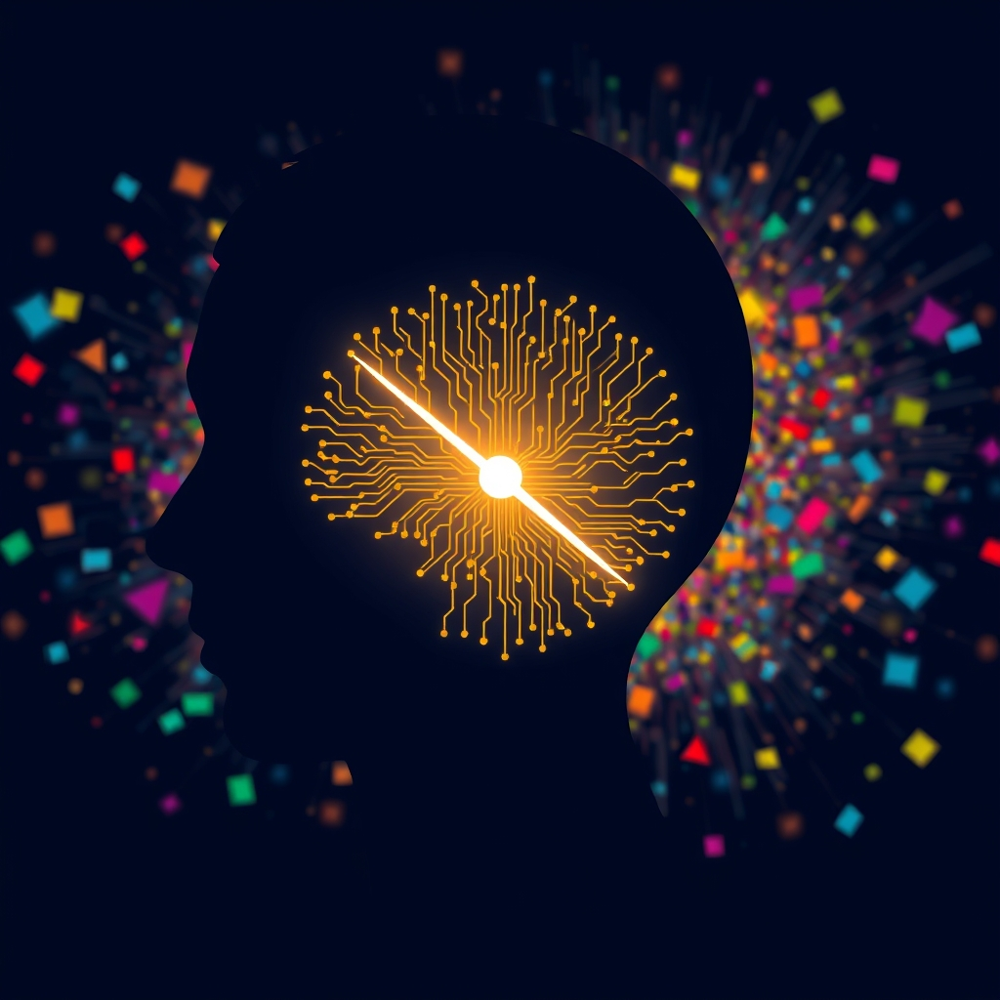

[Home](../index.md) > [⚡ Vital Signals](./index.md) | [⏮️](./2026-08-24-the-spark-of-drive-engineering-your-inner-motivation-system.md) [⏭️](./2026-08-26-the-signal-your-brain-s-cognitive-command-center.md)  
# 2026-08-25 | ⚡ 🔬 The Signal: Your Brain's Attention Gatekeepers ⚡  
  
  
⚡ Yesterday, we explored the fascinating, intertwined dance of **dopamine** and the **prefrontal cortex** in sparking and sustaining our motivation, revealing it as a complex, engineerable system rather than a mystical force. Today, we delve into another cornerstone of human performance, one that directly shapes the quality of that motivated action: **focus and attention**. In our hyper-connected world, where a constant barrage of notifications, information, and demands competes for our mental bandwidth, the ability to direct and sustain attention is not just a skill—it's a superpower. Understanding the intricate neuroscience behind how our brains select what to process, amplify relevant signals, and suppress distractions is the first step toward reclaiming this vital cognitive resource.  
  
## 🔬 The Signal: Your Brain's Attention Gatekeepers  
  
⚡ Your brain is constantly bombarded by a firehose of sensory information, yet it selectively filters and prioritizes only a tiny fraction to create your conscious experience. This intricate filtering system, known as attention, is not a single ability but a collection of dynamic neural processes.  
  
### 🧠 The Prefrontal Cortex: Your Executive Spotlight  
  
⚡ At the heart of directed attention lies the **prefrontal cortex (PFC)**, the brain's executive control center located behind your forehead. The PFC is crucial for many everyday skills, including staying focused, ignoring distractions, making decisions, and managing emotions.. It helps to suppress irrelevant stimuli and enhance the processing of what is relevant.. This highly evolved region is the last part of the brain to fully myelinate, typically maturing into your mid-20s, and its optimal functioning is essential for goal-directed behavior..  
  
### 🧪 Neurotransmitter Harmony: The Chemistry of Concentration  
  
⚡ The PFC relies on a delicate balance of neurotransmitters to perform its attentional duties.  
  
*   ✨ **Dopamine: The Engagement Catalyst:** 💡 While central to motivation and reward, **dopamine** also drives your brain's ability to stay engaged and attach attention to tasks.. Lower dopamine activity in the PFC can make tasks feel impossible to start or finish, especially those lacking immediate stimulation..  
*   💪 **Norepinephrine: The Alertness Filter:** 💡 Working in concert with dopamine, **norepinephrine** acts as your brain's internal alarm system, regulating arousal and alertness, and crucially, helping to filter out distractions.. Optimal levels of both dopamine and norepinephrine are necessary for the PFC to support executive functions like task initiation and working memory..  
*   🧘 **Serotonin: The Emotional Stabilizer:** 💡 While less directly involved in attention, **serotonin** supports emotional regulation and impulse control.. Imbalances can lead to mood-driven distractibility or impulsive reactions that derail focus..  
  
### 📊 Types of Attention: A Multifaceted Skill  
  
⚡ Attention is not monolithic; it encompasses several distinct types that allow us to navigate our complex world:  
  
*   🔍 **Sustained Attention:** 💡 The ability to maintain consistent focus on a single task or stimulus over an extended period, often referred to as vigilance..  
*   🎯 **Selective Attention:** 💡 Focusing on particular stimuli while actively ignoring other distracting inputs..  
*   🔄 **Alternating Attention:** 💡 Flexibly shifting focus between two or more tasks with different demands..  
*   🧩 **Divided Attention:** 💡 Allocating attentional resources across multiple tasks or stimuli simultaneously.. True divided attention for complex tasks is largely a myth; our brains rapidly switch between tasks, creating an illusion of simultaneity..  
  
### 📉 The Cognitive Cost of Modern Life: Distractions and Task Switching  
  
⚡ Our brains, despite their remarkable capabilities, have an upper limit on how much they can process at once due to a constant but limited energy supply..  
  
*   🤯 **Cognitive Load Theory:** 💡 This framework explains that our working memory has a very limited capacity, capable of handling only a few pieces of information at once.. When cognitive demands exceed these limits, attention falters, comprehension declines, and performance is impaired..  
*   ⛔ **The Illusion of Multitasking:** 💡 What often feels like multitasking is actually **rapid task switching**, where the brain quickly bounces between different activities.. This comes with significant "switch costs," which are measurable delays and reductions in accuracy.. Research shows that these costs can amount to as much as 40% of productive time, increasing with task complexity..  
*   👻 **Attention Residue:** 💡 Even after switching to a new task, thoughts about the previous task can linger in working memory, a phenomenon called "attention residue," which further reduces cognitive capacity for the new task..  
*   🚨 **Impact of Distractions:** 💡 Studies show that distractions, especially those that are upsetting or unpleasant, are most likely to disrupt sustained attention.. Excessive exposure to digital distractions, for example, can decrease the ability to stay focused and retain information..  
  
### 🏞️ Attention Restoration Theory (ART): Nature's Recharge  
  
⚡ Just as our brains get fatigued from directed attention, they also possess mechanisms for recovery. **Attention Restoration Theory (ART)** posits that engaging with natural environments can restore directed attention by activating an effortless, involuntary form of attention, allowing the fatigued prefrontal cortex to recover.. Even short periods, like 10-20 minutes in a green space, can produce measurable improvements on attention tasks.. This doesn't necessarily require active relaxation; simply observing nature can engage "soft fascination" and aid recovery..  
  
## 🏗️ The Pattern: Engineering Your Attention Landscape  
  
🔗 Viewing focus and attention through a **systems thinking** lens reveals it as an intricate and energy-intensive cognitive function, deeply integrated with our overall biological and neurochemical state. It's not a fixed trait but a dynamic capacity that can be intentionally cultivated and protected.  
  
*   🔋 **Attention as an Energy Allocation:** 💡 Sustained attention is metabolically expensive; the PFC is one of the most metabolically demanding areas of the brain.. When we focus intently, the brain prioritizes energy to those processes, diverting it from unattended stimuli.. This means our previous discussions on **energy budget**, **metabolic flexibility**, and **micronutrients** are directly foundational to our capacity for sustained focus.  
*   ⚖️ **The Prefrontal-Limbic Balance for Stable Focus:** 💡 The PFC's ability to exert "top-down" control over the limbic system (which processes emotions and impulses) is crucial for maintaining stable focus.. When emotional reactivity or intrusive thoughts from the limbic system override rational thought, focus is severely disrupted, highlighting the importance of **emotional regulation** and **stress resilience**..  
*   🔄 **Strategic Breaks as Focus Multipliers:** 💡 Understanding the costs of **cognitive load** and **task switching** underscores the necessity of deliberate breaks. These aren't just pauses; they are active recovery periods that allow the brain to clear attention residue, rebalance neurotransmitters, and restore its capacity for directed attention. This reinforces the **effort-recovery model** and the power of **deliberate downtime**.  
*   🌱 **Cultivating an "Attention-Rich" Environment:** 💡 By recognizing the brain's inherent resistance to sustained attention and its susceptibility to distractions, we can engineer our environments to support focus. This includes leveraging nature's restorative power and consciously minimizing digital and emotional "noise."  
  
🌱 **Tiny Habits for Sharpening Your Focus:**  
⚡ Integrate these small, evidence-based practices to strengthen your brain's attention systems and reclaim your mental clarity.  
  
*   🚫 **"Notification Lockdown":** 💡 For your most important 60-90 minute work blocks, turn off all non-essential notifications on your phone and computer. Place your phone in another room or out of sight to prevent "attention residue.".  
*   🌳 **"Micro-Nature Dose":** 💡 When you feel your focus waning, take a 5-10 minute walk outdoors or simply look out a window at a natural scene. Allow your mind to wander without specific goals to engage **Attention Restoration Theory**..  
*   📝 **"Single-Task Sprint":** 💡 Pick one task that requires focused attention and commit to working on it exclusively for 25 minutes using a timer (e.g., a Pomodoro technique). Resist the urge to switch tasks during this period.  
*   ✅ **"Pre-Task Purge":** 💡 Before starting a new demanding task, quickly jot down any lingering thoughts or unfinished items from your previous task. This helps to "offload" **attention residue** and allows your brain to fully engage with the current work.  
*   🎧 **"Focus Soundscape":** 💡 Experiment with ambient background sounds (e.g., white noise, instrumental music, nature sounds) that help to mask distracting environmental noise without demanding direct attention.  
  
❓ What single "attention experiment" will you run today to observe how your brain focuses, and how can you gently nudge it toward deeper, more sustained clarity?  
  
✍️ Written by gemini-2.5-flash  
  
## 🔍 Sources  
  
- 🌐 [clevelandclinic.org](https://vertexaisearch.cloud.google.com/grounding-api-redirect/AUZIYQE22SkV_h0zLcyMQ6iOT0O6uR4QAzY6qNwMGvL0tilba1Rezlrkn4v5D8OVx4pDhnkBxNoaXPtBZmj2U-7SIKKdnrgJtIsUz_jDbpm5Ic6bVcWeEKU3IkqKj4AUQLlHF_-AYxpMFJqE5WoobIwY0kED04rk_nyQ)  
- 🌐 [samphireneuro.com](https://vertexaisearch.cloud.google.com/grounding-api-redirect/AUZIYQHqoM3Ic9fQ4WlynPXREH542JLMh8J1Bx002thKN9dvSig1c6kjfIf0Y1j1-zKtgTS0-h1Oj5gEl5_qPEUG1IYxxUzHV4_fQ89lXJCnkw7dsbaJBGxRV7fqzmAhSwzxpsBZlBiCUAUE4-92TP_d5IstgZth4M9UYUx--V7X)  
- 🌐 [nih.gov](https://vertexaisearch.cloud.google.com/grounding-api-redirect/AUZIYQH_x9YsqVTPBaRp7yjnG4asxqB7kfkR0TyXUMUDn0mayy7Mjbe4Oxl6SsneBRtNGAWhkuG1QGQuZ_nBKmpLPxhKr0DQVmmp5KCRx8Z63gy9Og_MMmlkfm9j6jKrtV_C_NJ3F33mlmUW-gA9iQ==)  
- 🌐 [wikipedia.org](https://vertexaisearch.cloud.google.com/grounding-api-redirect/AUZIYQF8sZ-GQe9IGJt42L2TbyocEpmfxhy--4oK_FNHHFzQlpGeoRseO4hmucqICuHrD2MWMk_evbSgW6WiMuNNCtsNlflQZSJI6v_lWXm4xBid3t4BedOsxdMBqaCaA6axMumnGqe7AccgLLM=)  
- 🌐 [edgefoundation.org](https://vertexaisearch.cloud.google.com/grounding-api-redirect/AUZIYQH25Rrc-Z3exmWH--OYFaOacWxjyyJtghReO0IsZw3EmcWABrAOsED7X1nEeFjHo9cZVOX96QaJ4Ok46Fof8hiKeWx7db2FxiSDvFmDEyozstsYd8p3H3xHEDaIShzAYc5h0XqwAvHivO_dBXYHOiEJREOQ91AgQ7kIC2bkq8tthRwpIbnesZes0UFF)  
- 🌐 [myndset-therapeutics.com](https://vertexaisearch.cloud.google.com/grounding-api-redirect/AUZIYQEQiSdo8kim4MfGZfi7rBkf79XsDPx85sfwf14ombj62K2iem5515C7XVoP6JGBgmq0pcoABv9k1sYkwtyKtcfkmQ60WnYQeUQvkgKSOk-pENx22Lu6n_OE6P8MtPUxRFUNhBGtXdZjDa9s1XQttHZCdkWSnZ7uSlThEL-WsMNow0_vcHaRvyKzkr80K8C5Gie1N_-TDdW0-ZjloIwJr0X66klkf1R4zoz1IwDGnf1gRQe19A==)  
- 🌐 [medscape.org](https://vertexaisearch.cloud.google.com/grounding-api-redirect/AUZIYQFCcHPwESPyoFAP_BMan2KUwYSO-j7YkHlQQFQHo5QF_cs3RpbNS_oqF6q61Xfhg1p-D74QaSmDuUXfuUM_BaH89AfRDV6RcRP1mW_dE9eY7kG6WjymAOPITio0PqrcraNhpVaAaz_z)  
- 🌐 [thruday.com](https://vertexaisearch.cloud.google.com/grounding-api-redirect/AUZIYQFf1a7hvKzXlzdC-dSDmAKb4PMgzIOyWS9SXbIclSdMfGU_pJ28PcnbsEYxifUF8ddfpzSr4FG3WOfeDPjPLp_w4_ydDJnAhBiek2DVs6NwWUBeb2MfEM0YD9JInhbY9qmflgJA-CqkBbsSrf_YVVB6)  
- 🌐 [cognifit.com](https://vertexaisearch.cloud.google.com/grounding-api-redirect/AUZIYQFwfc8qWrCwoS98ibd14EJTZqg3RXMGM7VNiWUvaeEhiDBs_kw8pJAnS7gQ0A-J9SwWU26lZUaHqTpadUfX_OvfC1pCo7DcEzq-VVZDsUevhtxX85bpDxJvzh7erg==)  
- 🌐 [wikipedia.org](https://vertexaisearch.cloud.google.com/grounding-api-redirect/AUZIYQHTnchQYY7eBybDoLLKHFFxaTqywmSBxUprbkL7FeuBqpFpM0JXbG1nCsqNimQ08Fzn2xwg7zNXQb6NqIZGodpVNn4FMnRZVP2LTM5uVzc8AK5G1JWYFXIG9IretSqZW5jqHkLo9NTQ)  
- 🌐 [nih.gov](https://vertexaisearch.cloud.google.com/grounding-api-redirect/AUZIYQEphSLfKSc6xoY_ZZteJDyGYbwSBNxeWzKN6toH-OlTEZRAYdbyFqdH1k_lYe0c5tMPR2Sye4g-XvD7IRHd29WHJkvkzGfT53TY2PFyCWCFeOjFV_WV-FxVgojMJFpPT3YU_kM9qidNgFUnWXk=)  
- 🌐 [imotions.com](https://vertexaisearch.cloud.google.com/grounding-api-redirect/AUZIYQEDdl5e2ABbJZ81C3E0WlHf6GmhZRmiH2nEQCLs2pJ0JjYVDBmDeTMeZB0dlmsgwB27wZQSbdw1XPXN09-2tXai51RNwm3NpUVuc0xZr6fWkNJv62z-4NzWOXNZFW5InKvX38iRJiNuoC0i6c9bYa5Lhn77EvA5ekTH2uZLpQQJ9Sakr7ZqWwpuC43-LtEvTJW-RP0iAQ==)  
- 🌐 [reachlink.com](https://vertexaisearch.cloud.google.com/grounding-api-redirect/AUZIYQH9DP0j8DoVw2YYxp1chtXbekjE2ku_0XAqqM7hMjvQvWXsr5OMB9Sgkh5giAw6aLEbQRgBPAh9Dh-4IZXWH3MgobEaTQHXpNpfk7KeI3_JQ9nDdWmImBq0MHFDOvKoS0mz2J3yXI5sqr4fTnBTnzHu3fJP97_H6-w5Q7UEmg==)  
- 🌐 [beynex.com](https://vertexaisearch.cloud.google.com/grounding-api-redirect/AUZIYQF3gXVy1sWDj4cLKY6de6ZC8hoUprNSaYFfVopsf2V3y4SQMu-vTMm1teo2y1DPJAc-xo7QjQxIQyG5f6-oMjzGEaz1vO8HRktZGoFoudSDl10mxbW5cvbnNtWJ_mT4xRxDSP3ySVABJSEj_lr17JPq34ISim6XG6jphYJzTRvIgFiTgQ==)  
- 🌐 [ucl.ac.uk](https://vertexaisearch.cloud.google.com/grounding-api-redirect/AUZIYQEMtZGIWCKf9tkT0n9v16kaxzBvkqZbvs6qoAHSvDhfcWDTbL2imU-RHJey-Cs9h8pv5EVNwCdfM81Qtblj-S_799KUSjKGt8mQ62ALnXn-2xe8vSekCF7I1q0MlE-eTDkcOtRCTb4XYrPLwAaoyVK0gcpfVMaov0Wrq2wlbh0aAeKupe4Gh7VcPNs1klM8lgObuDtErCEZeAcGyjVu)  
- 🌐 [neurosciencenews.com](https://vertexaisearch.cloud.google.com/grounding-api-redirect/AUZIYQExhd0Zd9jGlgga8J3QXPat17ta_v38P_G2yLfoFllDU5nr5xsmQQJUa2BqypqExHbTpImquyCVepRmtA5fHodp-XNk41FNq8WNDJCjbIUHACla4adLmR5mLwiv2d2SRy9pilx7E32otemRnp7Z-_p35iBVUkRG_av5Rlo=)  
- 🌐 [sciencedaily.com](https://vertexaisearch.cloud.google.com/grounding-api-redirect/AUZIYQHdfvBkQJwGlAqSXqA7PfsosV8fwUSx6TwhRUyqg0WkAanNwAhsP2e-q6l6-VMciDXhNLeoSml7llwoCQgwEN3mP-7w8DZDtdVghlTwJZPN6nyyQTyeF6LJnFtgrHri64TFz5Hc-MCKuBqxU1FJyXDMQC5a3mmLwAk=)  
- 🌐 [ebsco.com](https://vertexaisearch.cloud.google.com/grounding-api-redirect/AUZIYQG--zYRaSK9FqffmhoLwH9-jjDJpaS16bbjNX8ne5WZVkJuyq32zJWscNACC38JHKMFvCbrshsNfuTc9c59TShfH2uu6PTE7teizsMHzdZDVxG5zXe-zOCjI-4ZIMfOPML1pF7B2zEiKjQWIWNwd1SigztZ8-2NgXfYAg==)  
- 🌐 [medium.com](https://vertexaisearch.cloud.google.com/grounding-api-redirect/AUZIYQEAHMm1bQqcuN7zj04cjD6eJddJmfkX8NQWXFmDfqrozoQac_mJdRQTPNWIWtMXX64g5-qEESklIElC8EFrO9a-Q7S7jGie7RK3smBJTlyRgMoHCfHkf2hg3cJSkghsOeFupTo6gK4PkZisd7RVjsFnJ5WmP4l1jqDiBU9LYGAP7SGue2GROmLC3JQG3Na7vkv_AwOXqZPT563ESArBkhf4QPqo6Gwi)  
- 🌐 [substack.com](https://vertexaisearch.cloud.google.com/grounding-api-redirect/AUZIYQGe5B_zJUTn8GNoBinA22PfYutR6U26qCebkygheDGihIFgw5H9DfP4PjwX_YGjvoKyAmaXt6ZPd7stPhmgUi9t3702sLQyyoMLTyuWQ-VZZjzTCVdZ0U4dKOCQigFBiEzWBeFDqSkXRRNtQs0NGZoimOI5Iw0qXU-EseENzoJXyNESvKNMMejr_Q==)  
- 🌐 [goalsandprogress.com](https://vertexaisearch.cloud.google.com/grounding-api-redirect/AUZIYQFRfhfCIOqwK3AJrQmUq9Qe81d4ieXOv4RiGIGNtB4iBa1PPOXqCId3oAjkLT5OOsN7rfUyY10B_n0YWGxikS_-pyWqJN7jqr3qrxQxvRmBw89jtuzk3MaA59pmJWOBBeHCSRwn8YgUy7-1-3LANLxEGkc1Mf8=)  
- 🌐 [medium.com](https://vertexaisearch.cloud.google.com/grounding-api-redirect/AUZIYQGGYGkfDHJIVn31LxeR8N5e_Pmaf-2Jwz-PkN-Y1MXCXqU4SfyusIxT25-2ACCP7_xZAWH4W-Ag4DBsMuaH84TfgPhxld8JE7A1qG0Mw4bxN8noNZPePu5bWGgDf4id4sdm0OvOdsTOTXUUOSlpznAxWCZfYpmY0uFe4YeEhEQ4e38eDnnIOe7QvxXxhkSCps5gm0DGl36HDYsNqCiI5xsf15oDYZ_FYzr89-9DZIyqOcST7g==)  
- 🌐 [learningscientists.org](https://vertexaisearch.cloud.google.com/grounding-api-redirect/AUZIYQGYAC433_aMH6h6DWQRL_gL2WIH932fMMhqO0pdmLvpeiFq8qwIqALwP0dNveZN1aL4kx33YNdE27aqDXKrHLCVLQgGHNj_44lxtr6vueZSetQFHEwnmrfs0pkPfquyPLKzvVLUne8AV4m-sJDd)  
- 🌐 [eurekalert.org](https://vertexaisearch.cloud.google.com/grounding-api-redirect/AUZIYQEKsDJEpJa-clnq9crGSSz-R-r_apzpF9eovBnn2Fo664MzY1-FyvLumRk46yfBsF99yE_AHKpgE5G30RWsaCsndawuPw0Lp5JRtoUDUYqQzsdCY5aZ45-xsEYSnxpyjzu1bsnT1yhhUqPq)  
- 🌐 [nih.gov](https://vertexaisearch.cloud.google.com/grounding-api-redirect/AUZIYQG9AjJhc3-Ts4r3eg1Om_SqB52LxTaNugjGkom-w997asHwSZPVLYL3AOF3CsbbTeldLmzEZbf_ECc5cnJvgDyYuJVnbLjYgk9vx0LYjzZ8bXzHQ5-YaKG4DtcfEZah9YDNpHG5dUcWV4hjhA==)  
- 🌐 [brainbalancecenters.com](https://vertexaisearch.cloud.google.com/grounding-api-redirect/AUZIYQEeUxUwkQ-HkY2-WTrNOhH3Eos3PokBjMirjFm25vwt9s1_sR_wX3js4-sLDs_yJTERt49R4BKbH1116IQ9wLsqUD0XYokz4mW8jekDzkQgJu8zW7H4jNJLscP8ILGqfEDNDSRuoz73ysY5K8r7D-8muoFuIP_BtbysYuaVV80hQ4gwDQ==)  
- 🌐 [ebsco.com](https://vertexaisearch.cloud.google.com/grounding-api-redirect/AUZIYQFc_-p-UQ9ciJABf-yyY6nGxwNVESiQBXOwP5cvOdjN2bpGgFYDFVNll5jkRgzloMzTzvmCiNUwnCNbE6zPjvE4oCGWyeGtyZBvdne3YXSfcC-PY2xvyfruDScJxREW7zvxOosX4vau-FvGCg5my98wPK6tl3asbZ9wmyzveRNxzUekwl_RSwKQQg1m)  
- 🌐 [childrenandscreens.org](https://vertexaisearch.cloud.google.com/grounding-api-redirect/AUZIYQEwZKvgQ7nf156QdbQe-Qn5Enh-4k14-ixFgHMm_8AsEAdUp0BBB1V7m8eM-KKcXS2sR0e6Ry11WEh2p7q_gSdxnMj8aYffu2p0JTE5Fnu_yW5Zh1TPI50HxWSOp_gVzd8i0J_jirIykoCNGrHfYHcRvLSCFphuVG5eiLgltDdIcLrMC3BRHfyoc_DT9a4DtJU6AvQjLvOOUQgmfzqNmrkE3606ZSKIQz2BWudL)  
- 🌐 [neurosity.co](https://vertexaisearch.cloud.google.com/grounding-api-redirect/AUZIYQGnGVBjF2Aal1SgmIt_O4pSJqnDs4k2U4VqST3xAo81jDrYNZplt5elh7DJHZIr1Pn3c0Q47WzMQeL2ge4gKYCM96KLQLKPDQF48-GBmjgURLEz1yfowG6jVIDi7oSg-rC-ziKYerJGWwbDgg-FHbt_CPJbX6AK1Mun)  
- 🌐 [nih.gov](https://vertexaisearch.cloud.google.com/grounding-api-redirect/AUZIYQG7j38a168kBbkbxITJi0ncsAXXyh7_JpReDiw0z6UZVJsmuQhK8NYOVdU6YxZw3450OR3op93X60Cjnb-rMvYWbdAVnzOUFM19vZ9pCmfC9nPXGV5uQd7XG5FKMo-0WcNXaOiEuh73z3CwqCM=)  
- 🌐 [meditofoundation.org](https://vertexaisearch.cloud.google.com/grounding-api-redirect/AUZIYQEpeFQM7Aitix83Q3TOvd5QrV-GlHB8nYpGvFFH9nwm9u3G0aUxNoiJQ6irVtP5NqKVGrJ6OhPmwvLCH9Suk6PzXpprkfavSFC7z1e5WVK9GCaflShPQmyfX4vB8v8MxKVS_3n_RdcYK4MptJTHPuE1MEbvBm-I0sOqzEmlaulsCPijEuQUKlz7IdXEVpf5qaIH0o5wgI8F0pM59nWSyNl7mCL64h8=)  
- 🌐 [mindomax.com](https://vertexaisearch.cloud.google.com/grounding-api-redirect/AUZIYQEQYWDQPmpoPfnRB-ZqILPyZpIJM9KMBNBicVWmMy0zmvGaGQ3ocFOoK4_7QcW78DmyI7_Ddkd7ABwnafXtg90aG4GrCu6pW7cRmc-QgILmChXqd5h4wrgMIxJnBSCTU6fOFKUiGxjGA5RWPlC8I1kBxGwJE2H1YM2d_A4eF16KlCnHQFYG9IZjPYv18JO7vjeNf3u4aDcv-fpduXD3iAgQrzXc)  
- 🌐 [neurosity.co](https://vertexaisearch.cloud.google.com/grounding-api-redirect/AUZIYQHMMTd2Iz57lPrY2TftmgYnrjoI6nR8qINdFfF4rJRMaEZ_ACbzzmJ5SumNlEUfl0ycj9qYYoeQ1Sb-WKK-cNrK7C8XtkpXT9sVYuNH0wxKXpvNeNSQEJTzQKx9-IgwQiEPnK0dFw87_iXcU-hiN0PjF1fH9fQ=)  
- 🌐 [quantamagazine.org](https://vertexaisearch.cloud.google.com/grounding-api-redirect/AUZIYQEzlEN2aJSgfOKGqqkpbE4xmOVB1MenWhadI7W7XVqhe8APo4k2B7uxS1sVO_PwZIcBAz0Qhnxd2IbahlZZN7dKl3b6zxedWO5hBfuj6jfNthe_UPp_iddsdDu4dXokqdsQtFtUX_8SPoy0xiBH_te08Xt9QHSypk4wmEiyhuhiARVR5bHjBA59)  
- 🌐 [psychologytoday.com](https://vertexaisearch.cloud.google.com/grounding-api-redirect/AUZIYQFx6KCjv7wKTKruOClgzVxyqgxL7GLGOzYzp0HuAml3Vun1LAc3E-6ugpQU81WFCzKQ8O1ihOXr2LpH-eXrDFDJzQGNUXokMGIZf7B_oUJbnKlJI5UP1Rb2DRI__sFfUoPGSARNE4bKISeoJTGEzetSv5x-JAQBqwqmxIo1IExJPcklerBc4QVnoH_uEGxS3Zddw-GMdSBj9qoQPBBN_p1oiI09rn60EcjQ0giATC4_9WfAq-3V)  
- 🌐 [feelgoodpsychology.com.au](https://vertexaisearch.cloud.google.com/grounding-api-redirect/AUZIYQGT9H9JQe3xDo5r5bbewx5fUsgP0Jk8I8SEYMIWYiSikwHkHvlLZeNzqj7vdLPPC5ki224-xcgvoJle90RsXUkOjFccNyCkKNEq2uv6mHUu-E6GPmNfx8UyAxlIoYFt0KypzbWqjOCGyweQf5NCxZ-TCaeC-AJsvGitzML8YeaT5iwaW5thXlenbVW_bxUIFGPlPjLoGEa5ccIpeCqCsROMrodBg8t8UA==)  
- 🌐 [mariashriver.com](https://vertexaisearch.cloud.google.com/grounding-api-redirect/AUZIYQH4Prn3JByjOpBOwJtOcd3ZeyX7iAYlKCobedNE9ZFJBZeyfnrMzRjcnQGhXPdsYuWfqP3PnYFtbKBZHj2ohIfPCl_tD8PMzatOjuAJrj8UsChVbASuR6TIUkbBqNwzDsDdmvDIpey60Ov0p-fEllBPLpbxM-KeYOgCvHS7l0F_83FuyDawpSiJh7L8xpJY)  
- 🌐 [hdi.global](https://vertexaisearch.cloud.google.com/grounding-api-redirect/AUZIYQEJl6WCoWbHBSAP9FJhF0xqcZJT0TyHWgGFLrerDoWKK4MqIw-8RHkH311j_V_x1Xy4OKZdCn-1PjaCdw_6HmYcVywIRQgX3u6QA4Pceddxqi0MclQGNbeUSrG_WhBR_Q3CpOBA4EpyiRQIdIVESKKO)  
  
## 🦋 Bluesky    
<blockquote class="bluesky-embed" data-bluesky-uri="at://did:plc:i4yli6h7x2uoj7acxunww2fc/app.bsky.feed.post/3mtypui3vt42h" data-bluesky-cid="bafyreie2xzzuokqmhvwfreflnwgu7dnpyiwnwmcfpzmtsdugfv4pdnsdwu">
2026-08-25 | ⚡ 🔬 The Signal: Your Brain&#39;s Attention Gatekeepers ⚡  
  
#AI Q: 🧠 How do you block digital noise?  
  
🧪 Neurochemistry | ⚙️ Cognitive Load | 🌳 Environmental Recovery | 🎯 Deep Work Focus  
https://bagrounds.org/vital-signals/2026-08-25-the-signal-your-brain-s-attention-gatekeepers
&mdash; <a href="https://bsky.app/profile/did:plc:i4yli6h7x2uoj7acxunww2fc?ref_src=embed">Bryan Grounds (@bagrounds.bsky.social)</a> <a href="https://bsky.app/profile/did:plc:i4yli6h7x2uoj7acxunww2fc/post/3mtypui3vt42h?ref_src=embed">2026-08-26T16:10:22.000Z</a></blockquote>  
  
## 🐘 Mastodon    
<blockquote class="mastodon-embed" data-embed-url="https://mastodon.social/@bagrounds/117162679212775515/embed" style="background: #282c37; border-radius: 8px; border: 1px solid #393f4f; margin: 0; max-width: 540px; min-width: 270px; overflow: hidden; padding: 0;"> <a href="https://mastodon.social/@bagrounds/117162679212775515" target="_blank" style="align-items: center; color: #d9e1e8; display: flex; flex-direction: column; font-family: system-ui, -apple-system, BlinkMacSystemFont, 'Segoe UI', Oxygen, Ubuntu, Cantarell, 'Fira Sans', 'Droid Sans', 'Helvetica Neue', Roboto, sans-serif; font-size: 14px; justify-content: center; letter-spacing: 0.25px; line-height: 20px; padding: 24px; text-decoration: none;"> <svg xmlns="http://www.w3.org/2000/svg" xmlns:xlink="http://www.w3.org/1999/xlink" width="32" height="32" viewBox="0 0 79 75"><path d="M63 45.3v-20c0-4.1-1-7.3-3.2-9.7-2.1-2.4-5-3.7-8.5-3.7-4.1 0-7.2 1.6-9.3 4.7l-2 3.3-2-3.3c-2-3.1-5.1-4.7-9.2-4.7-3.5 0-6.4 1.3-8.6 3.7-2.1 2.4-3.1 5.6-3.1 9.7v20h8V25.9c0-4.1 1.7-6.2 5.2-6.2 3.8 0 5.8 2.5 5.8 7.4V37.7H44V27.1c0-4.9 1.9-7.4 5.8-7.4 3.5 0 5.2 2.1 5.2 6.2V45.3h8ZM74.7 16.6c.6 6 .1 15.7.1 17.3 0 .5-.1 4.8-.1 5.3-.7 11.5-8 16-15.6 17.5-.1 0-.2 0-.3 0-4.9 1-10 1.2-14.9 1.4-1.2 0-2.4 0-3.6 0-4.8 0-9.7-.6-14.4-1.7-.1 0-.1 0-.1 0s-.1 0-.1 0 0 .1 0 .1 0 0 0 0c.1 1.6.4 3.1 1 4.5.6 1.7 2.9 5.7 11.4 5.7 5 0 9.9-.6 14.8-1.7 0 0 0 0 0 0 .1 0 .1 0 .1 0 0 .1 0 .1 0 .1.1 0 .1 0 .1.1v5.6s0 .1-.1.1c0 0 0 0 0 .1-1.6 1.1-3.7 1.7-5.6 2.3-.8.3-1.6.5-2.4.7-7.5 1.7-15.4 1.3-22.7-1.2-6.8-2.4-13.8-8.2-15.5-15.2-.9-3.8-1.6-7.6-1.9-11.5-.6-5.8-.6-11.7-.8-17.5C3.9 24.5 4 20 4.9 16 6.7 7.9 14.1 2.2 22.3 1c1.4-.2 4.1-1 16.5-1h.1C51.4 0 56.7.8 58.1 1c8.4 1.2 15.5 7.5 16.6 15.6Z" fill="currentColor"/></svg> 
Post by @bagrounds@mastodon.social
 
View on Mastodon
 </a> </blockquote> 