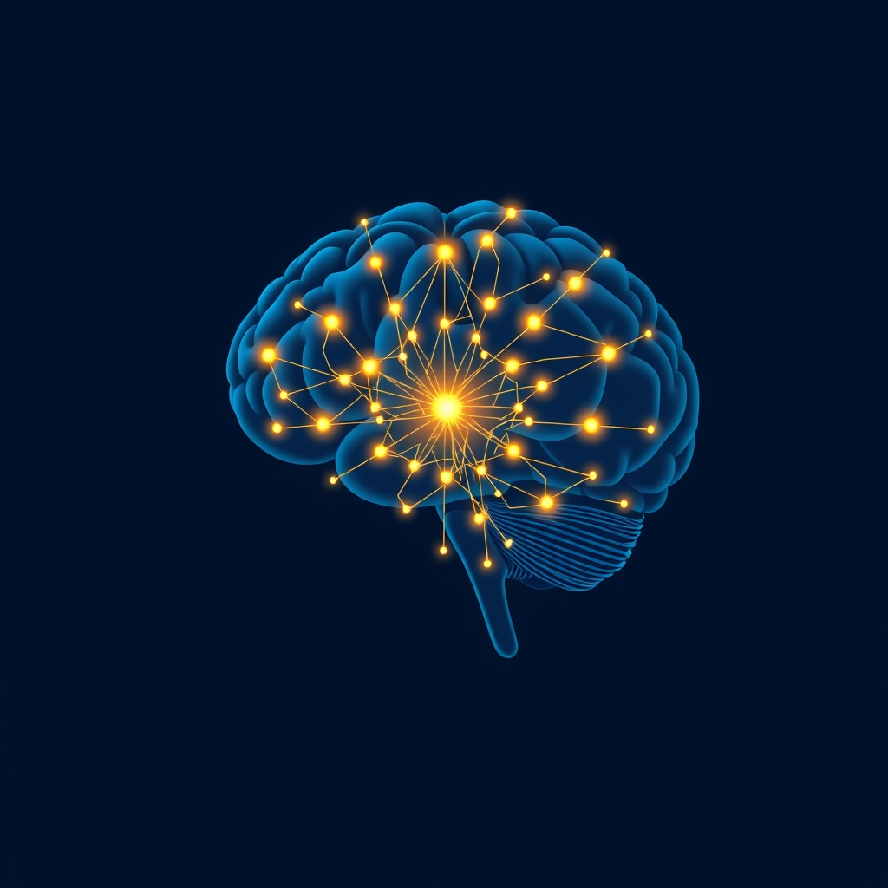

[Home](../index.md) > [⚡ Vital Signals](./index.md) | [⏮️](./2026-08-25-the-signal-your-brain-s-attention-gatekeepers.md) [⏭️](./2026-08-27-the-unseen-architect-how-sleep-builds-your-brain-s-best-performance.md)  
# 2026-08-26 | ⚡ 🔬 The Signal: Your Brain's Cognitive Command Center ⚡  
  
  
⚡ Yesterday, we navigated the intricate landscape of **focus and attention**, discovering how our brains selectively filter, amplify, and sustain mental effort amidst a barrage of distractions. Today, we ascend to a higher level of cognitive command: **executive functions**. These are the sophisticated "air traffic control" systems of your brain, orchestrating your thoughts, emotions, and actions to achieve complex goals. While attention allows you to spot the planes, executive function is what guides them safely to their destinations, ensuring efficient take-offs, smooth flights, and precise landings. Understanding and cultivating these core mental skills is paramount, as they underpin virtually every aspect of high performance, from strategic planning to resilient problem-solving.  
  
## 🔬 The Signal: Your Brain's Cognitive Command Center  
  
⚡ Executive functions are a family of top-down mental processes that enable goal-directed behavior by regulating thoughts and actions through cognitive control. They are essential for navigating novel challenges, resisting temptations, and staying focused when automatic responses are insufficient or ill-advised.  
  
### 🧠 The Prefrontal Cortex: The Executive Hub  
  
⚡ At the forefront of executive function lies the **prefrontal cortex (PFC)**, located in the frontal lobe of your brain, just behind your forehead. This region is crucial for integrating information from various brain areas and environmental stimuli, allowing you to plan, make judgments, control behavior, and adapt to new situations. The PFC is one of the last brain regions to fully mature, typically completing its development by your mid-20s.  
  
### 💡 The Core Three: Pillars of Control  
  
⚡ While executive functions encompass a broad range of skills, three core components are widely recognized as foundational:  
  
*   🚫 **Inhibitory Control:** 💡 This is your brain's ability to resist impulses, override automatic responses, and suppress distractions. It includes self-control (resisting temptations) and interference control (selective attention and cognitive inhibition). Strong inhibitory control allows you to pause, think, and choose a considered response instead of reacting impulsively.  
*   🧩 **Working Memory:** 💡 Often described as your mental workspace, working memory is the capacity to hold and manipulate information actively in your mind for short periods. It's essential for tasks like following multi-step instructions, mental math, or retaining a conversation's key points. Working memory capacity directly influences cognitive flexibility and overall intelligence.  
*   🔄 **Cognitive Flexibility:** 💡 Also known as mental flexibility or set-shifting, this is the ability to adapt your thinking or behavior in response to changing rules, perspectives, or demands. It allows you to think creatively, see things from different angles, and quickly switch between tasks. Cognitive flexibility relies on inputs from both inhibitory control and working memory.  
  
### ⚙️ Neurochemical Orchestration: The Brain's Conductors  
  
⚡ The effective functioning of the PFC and its executive duties relies on a precise balance of neurotransmitters:  
  
*   ✨ **Dopamine & Norepinephrine: The Activation Duo:** 💡 These two neurotransmitters are critical for supporting executive functions like task initiation, working memory, and inhibition. Dopamine is vital for motivation, attention, and reward processing, influencing our ability to stay focused. Norepinephrine, closely related to adrenaline, enhances alertness and arousal, helping the brain filter distractions and stay responsive. Lower activity in the PFC for these neurotransmitters is linked to challenges in focus, goal-setting, and effort regulation.  
*   🧘 **Serotonin: The Stabilizing Influence:** 💡 While less directly involved in acute attention, serotonin plays a crucial role in regulating mood, impulse control, and emotional stability. Imbalances can lead to distractibility and impulsive actions that derail executive efforts.  
  
### 📉 Vulnerability Across the Lifespan: Stress, Sleep, and Sustenance  
  
⚡ Executive functions, despite their power, are remarkably vulnerable to various factors, affecting their development and long-term health:  
  
*   😴 **Sleep Deprivation's Toll:** 💡 Insufficient sleep significantly impairs executive functions in young adults, with the most pronounced effects on working memory, followed by inhibitory control and cognitive flexibility. Even one night of sleep deprivation can deteriorate executive function.  
*   🤯 **Chronic Stress Erosion:** 💡 Prolonged or intense stress negatively affects executive functions by damaging the prefrontal regions of the brain. Chronic stress can impair working memory, attention, response inhibition, and cognitive flexibility, and is a risk factor for psychiatric conditions like depression and anxiety, which also feature executive dysfunction.  
*   🍎 **Nutrition as a Foundation:** 💡 A balanced diet rich in fruits, vegetables, whole grains, lean proteins, omega-3 fatty acids, and B vitamins is essential for optimal brain development and cognitive function. These nutrients provide steady fuel, protect brain cells, and support memory and focus. Conversely, diets high in processed foods and sugar can impair memory, concentration, and mood, leading to difficulties with executive functions.  
  
## 🏗️ The Pattern: Cultivating Your Cognitive Conductor  
  
🔗 Viewing executive function through a **systems thinking** lens reveals it as the central conductor of your entire human performance orchestra. It's the sophisticated interface where your energy, motivation, focus, rest, and overall health converge to produce coherent, goal-directed action. Optimizing executive function isn't about isolated training; it's about nurturing the interconnected biological and psychological systems that support it.  
  
*   💡 **Energy and Motivation as Executive Fuel:** 💡 The PFC, the seat of executive functions, is metabolically demanding. This means your **energy budget** and **metabolic flexibility** (discussed previously) directly impact its capacity. Dopamine and norepinephrine, crucial for executive function, are also key players in **motivation** and **attention**. A well-fueled, well-rested brain has more "cognitive capital" to allocate to complex planning and self-regulation.  
*   ⚖️ **Resilience Through Regulation:** 💡 The profound impact of stress and sleep on executive function underscores the importance of **allostatic load** management and **deliberate downtime**. By reducing chronic stress and prioritizing quality sleep, you protect the structural integrity of your PFC and allow for neurotransmitter rebalancing, enhancing your capacity for **emotional regulation** and resilient decision-making.  
*   🌱 **Holistic Nurturing for Lifelong Capacity:** 💡 The development of executive functions extends into early adulthood, and their maintenance is a lifelong endeavor. This reinforces the need for consistent engagement with **micronutrients**, a healthy **gut-brain axis**, and **physical movement**—all of which provide the biological scaffolding for a robust, adaptable cognitive command center. Tiny, consistent efforts across these foundational areas compound into significant improvements in executive function.  
*   📈 **Leveraging Structure and Practice:** 💡 Executive functions can be strengthened. Strategies that simplify tasks, create routines, and provide external organizational supports effectively offload cognitive burden from a fatigued PFC, allowing it to perform more efficiently. Consistent practice of inhibitory control, working memory, and cognitive flexibility through mindful engagement and structured techniques builds neural pathways and enhances these skills.  
  
🌱 **Tiny Habits for Sharpening Your Executive Functions:**  
⚡ Integrate these small, evidence-based practices to bolster your brain's command center and enhance your daily performance.  
  
*   📝 **"The Prioritization Pyramid":** 💡 At the start of your day, identify your top three priorities. Focus on completing the most important one first before moving to the others, training your **inhibitory control** against less critical tasks.  
*   ⏱️ **"Micro-Task Chunking":** 💡 Break down large tasks into the smallest possible steps. Write them down and check them off as you go. This reduces **cognitive load** and provides mini-wins that fuel dopamine for **task initiation**.  
*   🧘 **"Mindful Pause":** 💡 Before reacting to an email, message, or stressful situation, take three deep breaths. This brief pause engages your **inhibitory control** and allows your PFC to engage before an impulsive response.  
*   🔄 **"Cognitive Flex Challenge":** 💡 Regularly try a new route to work, learn a new simple skill (like a few words in a different language), or attempt a different approach to a familiar problem. This gently exercises your **cognitive flexibility**.  
*   📚 **"Working Memory Warm-Up":** 💡 Before a demanding mental task, try to recall a short list of items or details from a recent conversation without writing them down. This serves as a quick mental "stretch" for your **working memory**.  
  
❓ What single executive function "lever" will you intentionally pull today to bring more clarity, control, and effectiveness to your actions?  
  
✍️ Written by gemini-2.5-flash  
  
## 🔍 Sources  
  
- 🌐 [examiningthehumanbrain.wordpress.com](https://examiningthehumanbrain.wordpress.com/2016/06/07/examining-the-role-of-the-prefrontal-cortex-in-executive-function-and-decision-making/)  
- 🌐 [en.wikipedia.org](https://en.wikipedia.org/wiki/Executive_functions)  
- 🌐 [ncbi.nlm.nih.gov](https://www.ncbi.nlm.nih.gov/pmc/articles/PMC3969123/)  
- 🌐 [my.clevelandclinic.org](https://my.clevelandclinic.org/health/articles/24712-prefrontal-cortex)  
- 🌐 [www.ebsco.com](https://www.ebsco.com/blog/article/prefrontal-cortex-pfc-health-and-medicine-research-starters)  
- 🌐 [en.wikipedia.org](https://en.wikipedia.org/wiki/Prefrontal_cortex)  
- 🌐 [www.ncbi.nlm.nih.gov](https://www.ncbi.nlm.nih.gov/pmc/articles/PMC3594191/)  
- 🌐 [connectionsinmind.co.uk](https://www.connectionsinmind.co.uk/articles/what-are-executive-functions)  
- 🌐 [www.lifeskillsadvocate.com](https://www.lifeskillsadvocate.com/blog/12-executive-functions-of-the-brain/)  
- 🌐 [buildingbrainstogether.com](https://www.buildingbrainstogether.com/what-are-executive-functions)  
- 🌐 [vuir.vu.edu.au](https://vuir.vu.edu.au/16016/1/Thesis-final.pdf)  
- 🌐 [thebigpictureslp.com](https://thebigpictureslp.com/executive-functioning-across-the-lifespan-adolescence-to-aging/)  
- 🌐 [www.scirp.org](https://www.scirp.org/journal/PaperInformation.aspx?PaperID=129596)  
- 🌐 [www.ncbi.nlm.nih.gov](https://www.ncbi.nlm.nih.gov/pmc/articles/PMC7898822/)  
- 🌐 [www.ncbi.nlm.nih.gov](https://www.ncbi.nlm.nih.gov/pmc/articles/PMC3752676/)  
- 🌐 [www.lifeskillsadvocate.com](https://www.lifeskillsadvocate.com/blog/nutrition-and-executive-function)  
- 🌐 [www.lifeskillsadvocate.com](https://www.lifeskillsadvocate.com/blog/improve-executive-function-in-adults)  
- 🌐 [www.ncbi.nlm.nih.gov](https://www.ncbi.nlm.nih.gov/pmc/articles/PMC8574381/)  
- 🌐 [www.executivefunction.org](https://www.executivefunction.org/executive-function-skills-by-age-a-guide-for-parents-teachers/)  
- 🌐 [developingchild.harvard.edu](https://developingchild.harvard.edu/resources/a-guide-to-executive-function/)  
- 🌐 [edgefoundation.org](https://edgefoundation.org/how-to-regulate-attention-with-brain-smart-strategies-neurotransmitters-attention/)  
- 🌐 [www.diva-portal.org](https://www.diva-portal.org/smash/get/diva2:1666635/FULLTEXT01.pdf)  
- 🌐 [www.ncbi.nlm.nih.gov](https://www.ncbi.nlm.nih.gov/pmc/articles/PMC4029267/)  
- 🌐 [bodymeasure.com](https://bodymeasure.com/how-to-reduce-stress-improve-your-executive-functioning/)  
- 🌐 [www.ncbi.nlm.nih.gov](https://www.ncbi.nlm.nih.gov/pmc/articles/PMC4946029/)  
- 🌐 [www.neurology.org](https://www.neurology.org/doi/10.1212/WNL.0000000000208226)  
- 🌐 [my.clevelandclinic.org](https://my.clevelandclinic.org/health/articles/24713-executive-function)  
- 🌐 [www.ncbi.nlm.nih.gov](https://www.ncbi.nlm.nih.gov/pmc/articles/PMC7741349/)  
- 🌐 [academic.oup.com](https://academic.oup.com/cd/article/87/2/689/4611295)  
- 🌐 [www.tandfonline.com](https://www.tandfonline.com/doi/full/10.1080/02640416.2026.2185202)  
- 🌐 [www.pureencapsulations.com](https://www.pureencapsulations.com/blog/neurotransmitters-attention-focus-behavior)  
- 🌐 [www.atlantaneuroscienceinstitute.com](https://www.atlantaneuroscienceinstitute.com/how-diet-and-nutrition-affect-brain-health/)  
- 🌐 [thruday.com](https://thruday.com/blogs/news/guide-to-neurotransmitters-dopamine-adhd-and-your-brain)  
- 🌐 [rewiringtheadhdbrain.substack.com](https://rewiringtheadhdbrain.substack.com/p/rewiring-the-adhd-brain-a-deep-dive)  
- 🌐 [www.ncbi.nlm.nih.gov](https://www.ncbi.nlm.nih.gov/pmc/articles/PMC9324649/)  
- 🌐 [www.nm.org](https://www.nm.org/healthbeat/healthy-tips/nutrition/brain-health-diet)  
- 🌐 [www.frontiersin.org](https://www.frontiersin.org/journals/systems/articles/10.3389/fsys.2024.1378125/full)  
- 🌐 [sachscenter.com](https://sachscenter.com/executive-function-strategies/)  
- 🌐 [www.mdpi.com](https://www.mdpi.com/2076-3425/13/11/1598)  
- 🌐 [www.tandfonline.com](https://www.tandfonline.com/doi/full/10.1080/02640416.2024.2398436)  
- 🌐 [dres.illinois.edu](https://dres.illinois.edu/sites/default/files/Improving%20Memory%20and%20Executive%20Functioning.pdf)  
- 🌐 [www.additudemag.com](https://www.additudemag.com/activities-to-improve-executive-functions-adults-children/)  
  
✍️ Written by gemini-2.5-flash  
  
## 🔍 Sources  
  
- 🌐 [wikipedia.org](https://vertexaisearch.cloud.google.com/grounding-api-redirect/AUZIYQENyhG8nsAz-4x7s7amDG2oXb9StXjUztIS16r0U2s97SCV422K2RangISbqW-e0Dgt_J7G4wLNxUaABbY8yfBxKEhc5YzdXxNb5mrM-D9klDZJzAMGu2YvzlY3rs4FlY3DbWSYO_a6IA0JLkI=)  
- 🌐 [nih.gov](https://vertexaisearch.cloud.google.com/grounding-api-redirect/AUZIYQFNf0KV7quPJ4f4yxdtI-VJ4Mr-8HmB8--4F4f9Cwg3EIH4vNaLLVhD_IPR-_bCl8EGKPCsGb1cIuyatfl8w5s3UD6j9o7XRYqztv3t2WkrpnpNM_LoEUVXqI6iTDIpfd3W5GMBTPQNJOwyXGQ=)  
- 🌐 [connectionsinmind.com](https://vertexaisearch.cloud.google.com/grounding-api-redirect/AUZIYQEfA9v992tFedwVPUpq4okVWbDh9MwCwzqYYZyPYPXdscgLIwI7K9AJC7DWsWwDOVk2qfMsvG7M-Ch5d9-Hh2Wo2UOOZJT2rSP5pyf-nT6t1K4lH03lz1jB_A4gGqaIeEmKoYFwqXAeXte-AFvgyYSESGOKiA==)  
- 🌐 [hilarispublisher.com](https://vertexaisearch.cloud.google.com/grounding-api-redirect/AUZIYQE6L4WdDm5ImCAMBfYIf5FtJm9PqcnuSLkYa6Mc5nwSnXZukssZTZlIrycXNIfcmX2Zu2n1azJHpUQ2Wz2jt0dFF8g0_h43F_-75g8f-s5nc3xX1YlQodw1fkgs_23h8mBoEI7dljvOl5itAij__zzJXZ3mJW2AR-tYTqpBJx2IB6WMLzQ02v0IhtLlvaQhwnrfJVledPwY6ExQU9POEnzLBjI685MN2yAjaUBuPQvlG_8I-yU9NYDaVbv3ViLWGc-bljjiohz4r6q3)  
- 🌐 [clevelandclinic.org](https://vertexaisearch.cloud.google.com/grounding-api-redirect/AUZIYQEW1n5GXyYduCLtAZX1APDeAwa8YMMctogasbnXkJTmYQ5PumtBJJG5bR8YXFSahLdbt5nR0Bpbam-0qiYcdJB3DRiDTBf5JgPoJzLJQBhd7xZn70WSL3ZP_W_zgh4sWBMD1FahnvDFlErHUggNCR38x1QTDSrthQ==)  
- 🌐 [ebsco.com](https://vertexaisearch.cloud.google.com/grounding-api-redirect/AUZIYQFAUHz82pBINlYT6qNTB8fc0-c_1HFRF2KefeFVeDtWWUu9Q37ZEk3CYfaLKdOP6veTyHjCcn620ETFde9qZPdIaU7DycJ9O_l3HqFN4NeCoRmQ3PON_jT12KaMw_HpPRLdFgfqYogOWRGQ977Gq6dhSoHbyymK5xnP0yc0cFFhB-sku5dXmAU8YdIvtw==)  
- 🌐 [wikipedia.org](https://vertexaisearch.cloud.google.com/grounding-api-redirect/AUZIYQG8xaBN02X0fylunbwiU0IzLkgX40qV2mFRGI9_srTYv76xU97QWUx3EP_JpG9sSCs2qzu-nN1eqaQshGF0ZkezxmxGvOrSNT1qyrfiea_jjOl7eJgxyCTJqRqhfUueP42YLe0c-K7u6lAw8xRkB47G4g==)  
- 🌐 [bigpicturespeechlanguageservices.com](https://vertexaisearch.cloud.google.com/grounding-api-redirect/AUZIYQFZuJFkiPYLJLLQnisYrxDGN0K1ekndUiJePYqJkc9xmGcqF4iKoXSz7LJBM-veXUuGMl6tx51KQlMwUYG0FiNiO-ZqL2NaVXlJObKf91uAKPfqHxNOs1K77Engw7hATvWgzghvmCTIHsGpYINv052dFwOgkDbCLevhthCrFTdmpYzIt58n1Ahowxn0sJ0V_70UALdHuOf8-uKUGUdjPO7orQd25aRNE_ZiTyZIRmcn)  
- 🌐 [lifeskillsadvocate.com](https://vertexaisearch.cloud.google.com/grounding-api-redirect/AUZIYQELgMuHfryGHTBPbxFpVp7CqJaLzihh-oVOj4A6VVWAsWN4lgxQ_HrtmZOU-DTopk8W12c2K1nOyVoEa9PUigSjdqgaGLvoSyia06fWALUtUnCROGZF4w6x3FszlWlPSu3ZqpyikULNNUQ7irawAnYTWz_7XpI-OVIPOcQe0KfnQA==)  
- 🌐 [buildingbrains.ca](https://vertexaisearch.cloud.google.com/grounding-api-redirect/AUZIYQE_v_g3oiEFNwapzrYKBX6NTTcSYm26ljPj_Bhle5FqvXPEISFILjU6Qp3KEbBAWyCDYIQi0AaKABQd5tcRzHW1bCuoIYBfsLIPG6kxJDKigfdROYFzOszevTkSQQjdMEBPcyr9U2FhBoGZ1H6mzCOrAu0cbl_lcdHGGvBdP2Nz)  
- 🌐 [biorxiv.org](https://vertexaisearch.cloud.google.com/grounding-api-redirect/AUZIYQFTvQvGE80hOJOF-I7Mu-RrHn3Wo8iEeTO26XlSE51weMSCnuu91mqnqH7i5MJjAMgNiKp2QZ6Wc0e4r5U2B98ttoqaqW4KMZzHlz77JsOtlN73UJrt-C9IhC0Qazp-cmI79i5ZASTK947C-Ogwph9vbWUgmAAiUd_vjase_fCdvQ==)  
- 🌐 [nih.gov](https://vertexaisearch.cloud.google.com/grounding-api-redirect/AUZIYQFQuJUUokn07tqod2XCW-IfucN3C677-axVfncDpgq4JW084Q0jYdgg_5ufwtzn5TgAtVgTwGkYl5-EVR_6Kh55gXd1X-s5Ex3MJjJ9lQLDHlgdd4SUJIPMT7WONH88fsvMquBUcsNFQNIMkIk=)  
- 🌐 [oup.com](https://vertexaisearch.cloud.google.com/grounding-api-redirect/AUZIYQEAvQaQrUEmB4ZeFN1Hh2rqZSHHk5RPtWHGvze5LkwF9yDfljsONgzkE0BApVfITnvovPEH5qdigw6KO1wmltrzVJPt9_BV7y41zT5MeFyvj2SZa5xsFgwk5F8G0279cB_nT5J3SVn8VRXecpSELpbMQOKU)  
- 🌐 [edgefoundation.org](https://vertexaisearch.cloud.google.com/grounding-api-redirect/AUZIYQEm3CQDWC0-VCZzd7CQzf7WHEbg3Owd8btOjIFuIC3T0_cFSAaVJ41RxrPV2LwvkNm3uy1lL4aDmx14dX-tnAmips5DubZdCP1ss6FBhmvgK0q7mg2etozvDCVVMAfYn4YiAvIzKd2MV3T8NuCL02Tfr4yORbkli9bbEHA4NCWQSNzpanSbPe1rjaLWOw==)  
- 🌐 [nih.gov](https://vertexaisearch.cloud.google.com/grounding-api-redirect/AUZIYQEVDe0cNgirSJtsTf71wDHKKP0SVZAcBgGoB-7aFCJ1jw7cIZPdRNAjzVS9Sb9dgHR8x84KHsp4V5phxnzIiC03qLqGpPH1yLEvqOxs0btS0_DpNpF0sUlYoQmSDFKbZEaLzHlzPIrScv9uugc=)  
- 🌐 [pureencapsulationspro.com](https://vertexaisearch.cloud.google.com/grounding-api-redirect/AUZIYQGHbF3BLujlvgIpXdSmabsllxUCBQlj3vokSfe_HXus9kui4CKMLMnuw8X2DLMsFbgRowf4hUdxvUeOQaD4Z4mhAqF2QOJWk93Z9Cxx5KTWaxKivfGqBjuOW9rGoCyaMJEb9WVVOaCek9TKzFGkBli2OG9LZGQH6qtyeyhXhRSAcPlTnTwGMIcnc-TrxQVg22dfEM5DdN2K94Cl0gHfEvo4xu1m)  
- 🌐 [thruday.com](https://vertexaisearch.cloud.google.com/grounding-api-redirect/AUZIYQHbDNmnq3HbG-bRBbQW-nDVRbBQjUWBiA-32rP9g7ZUHizNp6L3o0hqMzzmRJPrVIaWrP0jrizIPiuGjv9zJE0P1y8hdkBWqUEDiAQgJzmagsDAPMrCZY03yZ2gT95Xcm7EOcfEbSh00DsIWOM84niGWg==)  
- 🌐 [myndset-therapeutics.com](https://vertexaisearch.cloud.google.com/grounding-api-redirect/AUZIYQERztIIlqt_LjHJdxEBtIdpIzcrsfm-IYUbKuETw2GLqmoCd6P05nnLqMUknx-TqZ94MhpvGJY0q80xJ78gSNcNk9HTH1TkFEgHjZQbxrfyeB574_gORFz5A2JPzkuo6V8lNc0Z1V0EiHrtbL51Myb9Y-JMseYX1vVozYFAc6X3XhzLW15JMDs3QGWSt2TtpHD_KvJZS_KbyAJ_V0VKtZXdJp7oCmbk3TWUdKYeUUonc7CjTqE=)  
- 🌐 [scipublications.com](https://vertexaisearch.cloud.google.com/grounding-api-redirect/AUZIYQGnbJy_2qE0oProML0m2F7mAwR-GBr-GdjAlO3Lj6i4-CVMy8f7UoI6KgZ5z63y063Va0RvR18wFox-bPOvyjImyu64WLLFLXhYrUkg9PpUljtLUTWOqzDpl-Rdrkr9DehLemybNX-DraLLebDyz7zRZAyWR-C-V7ciKRzuVFwGrbK1TBvjPxCGtxc8rox1z5CP7w-X-RRbqTD_jidSoEDq-MnLDUe1zzWL9DaRPk_gXlVLTOIreywZY8B1CErZRk5V8pkBmnIFJEhP)  
- 🌐 [nih.gov](https://vertexaisearch.cloud.google.com/grounding-api-redirect/AUZIYQGdeOt9Swl4eMSqZAowf9TJcTW5tqTl4-hyox9bzhTc7CFKjlZiTMPqNBKSSh0X0SaWX-Wm78c8I93L8rHNHLVl2cXq4DuS-o6hzRLYTIf5_vXcZu7oIk9N4E2_Pug6CTMtvuqk3-prM9oJyCk=)  
- 🌐 [tandfonline.com](https://vertexaisearch.cloud.google.com/grounding-api-redirect/AUZIYQFNPuBpdHUOnPqq3k7f75BGX-ZQTaEvUzsv97xgWglic7gp--vfgLX_NPj2WA4c3wjhcyg90ZQgeCv1zQ3rUhfb2GUJGOG2fm4YJMI310mcSSVErssHP3jlrfQooe8954Gcl0h6DDGP2IOAt-L-ng2tuObsDG6joImTFGcSbg==)  
- 🌐 [vanderbilt.edu](https://vertexaisearch.cloud.google.com/grounding-api-redirect/AUZIYQF2n1PWEieKec_GKdvYP4NjCfym-MM_3vD-KC9mtNud-BB0shOUwQxpa8g9GBdxh4UXzVQbchUWkncogTOUio3jQs4OZwlfNzdUErP4GiiRsYLSo-qfX248Lt8NMxVkV5YR4dggoge6g41xTe9RpsTxJJDlPvlx-JqiUF_kL6xX)  
- 🌐 [nih.gov](https://vertexaisearch.cloud.google.com/grounding-api-redirect/AUZIYQEgeajZGONHHQgT7COKl_xBh_igWsSrdCDEQVnMTIqoXmusPVCo8RqSVmFD0xNb2Aa0NCspp-pOUvgBXA4kHwlHuL2gzhX4FYlDIefeCnVyAeoJSkGwOKtD_ToC5hy52mOpnBBH2HxDx8gkioQ=)  
- 🌐 [bodymeasure.ca](https://vertexaisearch.cloud.google.com/grounding-api-redirect/AUZIYQFS9WdXXana1cwIHD42auz0A9rdDyjXwAQW3hizpik9c7q87AFNWlfVxhyPa-HRKXFDHG-GGvDnuLkbX1qiPLGNY1YdXc0Ex4qnY84xVF6QCkmdIQ-Mzib-RBH5jf9cwIkrF_jEPRJmqmA8I85nomBFX9c_EmkKo2kj5IDSLEUNTdW8uSnNs70NfZQ=)  
- 🌐 [uthscsa.edu](https://vertexaisearch.cloud.google.com/grounding-api-redirect/AUZIYQHtUqK_HA_Mc2q9hAU2RIbHr8VjjaeyOoXMCcvYrMb70II0Xg3kBTgiogDl6W09KT8z80l2YGRJa8hT9Z2n8-gf-w_ekjvWghE4bTQyb-locNTF5694bHuS8qH5ZMIBXDch1aEF5jkaEhquKn3aVs_2SF4j3GwP2AAjXYEwcpavn1vHvEUY8HvOiV-DuBxVm_5mYhWm9tJCsjeFxLPgKn-iQc8mPgI4_UPvDw==)  
- 🌐 [lifeskillsadvocate.com](https://vertexaisearch.cloud.google.com/grounding-api-redirect/AUZIYQF8YToHs-fL2XqUCfDMVY_BOJPli1Hu2S85jeMaBDZTusceB6-XmFkaKJpB0Ns_qrqlmNzV8cOxr6U9W9cqzXkf4oy7eyNVTdwgb4wawWgMi3qLR5XWfhhvt5fL5GLDk7MZqFYBA0FKY7sJtu1p1R5QVug_yA_VvGF50ypA2zbXjA==)  
- 🌐 [atlneuroinstitute.org](https://vertexaisearch.cloud.google.com/grounding-api-redirect/AUZIYQGcL_r6mHgFE2EACQg20qQCq5DhVg6ygLk0gP7Smi5sMYjM8My2OFJ-gpfHmatsW3aYw0T2EbFYwVFO-mW05xoJx9zzrVbm_6vYBneQ0BWkJFdNMtDuXVQ7pdSNADmoLFhUUaVSUMcyhBlYSBoNRzCws3dAt0lwDc4BtzmDVBlGOxZXEpc=)  
- 🌐 [nih.gov](https://vertexaisearch.cloud.google.com/grounding-api-redirect/AUZIYQHMajSzwKiDf7wG7L1J5eLvmQQUR7frpayRI9JvANUW9PuPi-i4XxfTD8H_tjt_qCMSTVvVFsZ11KzrBMfVUhm2iipOhTaROjx_DI6XovKCcvT7Wy5KIeNebTMdD6ksmUuVGVNZqjKbS1fc4Z8D)  
- 🌐 [cambridgerehabhc.com](https://vertexaisearch.cloud.google.com/grounding-api-redirect/AUZIYQF98w1wReqA1S-u7vjgRHQjVTb9NfdtcIacf7TLR_e5HbHZ4cUEqp37iwVuvU0o0u-jgJPzr9WecSeYpmvnUi6daB3ccQPv3aQKBWO3eWT5_xuZlIbu44fxtpTI0zmnv3DaDk_RQjQ7aDsCTydC8A9OmJrkgYAQDb0dUmjzWYI=)  
- 🌐 [nm.org](https://vertexaisearch.cloud.google.com/grounding-api-redirect/AUZIYQGB9FspSn4uzOg7Pxckfu1pHx6UCx87VX2APgpjXuUCBY024EYeyh1PEHMtQEt18yZEK1vI5Jvcj2NGMJ7g35OOD3KG-1khg-P1fKtq2XaKq5oCDVyfWgYdYDh6SbynbOIdqDF0gFTGsTWAnU1g4IZf2z-miq2A0Eo5e7UFAai4n9jDTxuv1sLYDUIG0vg=)  
- 🌐 [illinois.edu](https://vertexaisearch.cloud.google.com/grounding-api-redirect/AUZIYQHnP2tjI8EyKavb6y4omiv4HuLJRs27JTfOPzXW0TV1XoHvIBAR4LhbL1vvS2z367PR5QaamHhtht1CzCPuU0ebNWbrdpVGpzWWxLQqi-Fchlpjb8-iKjFud-F5WnzklFkx79Hf7ohih_a1gmVXPSqSMAf07khoJ7xfVWAjIuRgw22PtRTH1nRpVVFU2TCVYTGvwJi6guWrK2oTaVkJBnnbJDS6PAgL1ug16b0t1ecORBN-UEa7rn5o5g==)  
- 🌐 [clevelandclinic.org](https://vertexaisearch.cloud.google.com/grounding-api-redirect/AUZIYQGWeMBIMmiU6xn6EM-yDkascrpcs4nh6n-1t72gFntzEUHx7P4r824pH2GJiT3Km1ray1-RmYu6RSMvI6dv4KwMXa7aLa2FK6S0p6YYD8LQW7F1YEso37X0aDHlgG9jo5qCYQKXx4WIskLc4LNTeJOnRk6DJvAfu4CBVAGH)  
