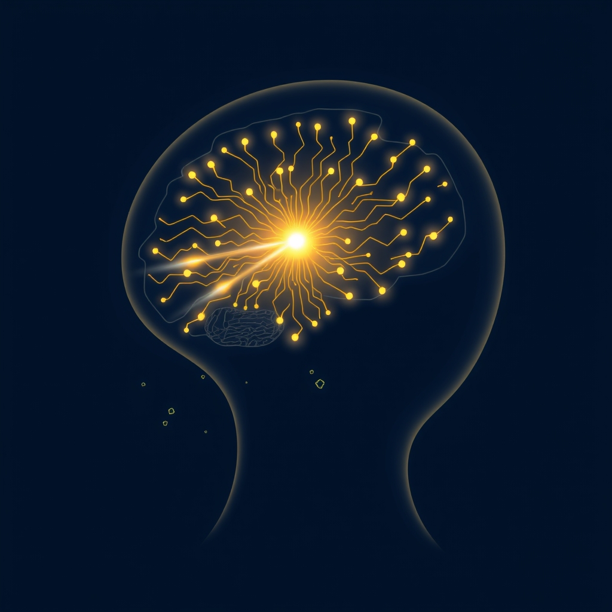

[Home](../index.md) > [⚡ Vital Signals](./index.md) | [⏮️](./2026-08-26-the-signal-your-brain-s-cognitive-command-center.md) [⏭️](./2026-08-28-the-allostatic-balance-reclaiming-your-resilience-from-chronic-stress.md)  
# 2026-08-27 | ⚡ 😴 The Unseen Architect: How Sleep Builds Your Brain's Best Performance ⚡  
  
  
# 😴 The Unseen Architect: How Sleep Builds Your Brain's Best Performance  
  
⚡ Yesterday, we explored the critical role of **executive functions**—your brain's sophisticated command center, orchestrating everything from planning to impulse control. Just as a conductor needs a well-rested orchestra to perform a masterpiece, your executive functions rely on a consistently restorative process that happens every single night: **sleep**. Far from mere downtime, sleep is an active and dynamic state where your brain performs essential maintenance, consolidates learning, and rebalances its delicate chemistry. Ignoring this nightly architectural work is like trying to build a skyscraper without a solid foundation; eventually, the structure will falter, impacting your focus, motivation, and overall cognitive resilience.  
  
## 🔬 The Signal: Your Brain's Nightly Restoration Project  
  
⚡ Sleep is a profoundly active state, a complex biological imperative during which your brain undergoes critical processes vital for physical and mental health. When sleep is consistently shortened or fragmented, these processes are disrupted, leading to measurable declines in cognitive, emotional, and physical performance.  
  
### 🌙 The Dynamic Stages of Sleep: Crafting Memory and Mood  
  
⚡ Sleep is not uniform; it progresses through distinct stages, each with unique restorative functions.  
*   🌌 **Non-Rapid Eye Movement (NREM) Sleep:** 💡 This phase includes light sleep and deep, slow-wave sleep (SWS). SWS is crucial for physical restoration, tissue repair, and the release of growth hormone, which is vital for adult metabolism, muscle, and bone health. During NREM sleep, the brain consolidates declarative memories—facts and events—transferring them from short-term to long-term storage.  
*   💭 **Rapid Eye Movement (REM) Sleep:** 💡 Characterized by vivid dreaming, REM sleep is essential for emotional processing, creativity, and the consolidation of implicit memories, such as skills and procedures. Dopamine activity increases during REM sleep, preparing your brain for wakefulness and boosting focus for the day ahead.  
  
### 🌊 The Glymphatic System: Your Brain's Nightly Detox  
  
⚡ One of sleep's most remarkable discoveries is the **glymphatic system**, the brain's unique waste clearance network, which is primarily active during deep sleep.  
*   🧹 **Active Clearance:** 💡 During slow-wave NREM sleep, brain cells actually reduce in size, expanding the interstitial space and allowing cerebrospinal fluid to flush through the brain's perivascular spaces. This process actively clears out metabolic waste products and toxic proteins like amyloid-beta and tau, which are linked to neurodegenerative diseases like Alzheimer's. Research published in *Cell* in 2025 found that a drop in norepinephrine during deep sleep triggers a rhythmic pulsing in brain fluid channels that sweeps waste out of tissue.  
*   🛡️ **Protecting Brain Health:** 💡 When sleep is disrupted, the glymphatic system cannot complete its nightly clearing work, leading to protein accumulation that may contribute to long-term cognitive decline.  
  
### ⚖️ Neurochemical & Hormonal Rebalancing: The Internal Reset  
  
⚡ Sleep plays a pivotal role in regulating the balance of crucial neurotransmitters and hormones that govern mood, motivation, and stress.  
*   ✨ **Dopamine Regulation:** 💡 Dopamine levels decrease during deep sleep, allowing for repair and restoration. As REM sleep approaches, dopamine activity increases, priming the brain for alertness. Chronic sleep deprivation disrupts this rhythm, reducing dopamine receptor sensitivity and impairing motivation and focus.  
*   📉 **Cortisol & Growth Hormone:** 💡 Cortisol, the stress hormone, follows a natural daily rhythm, peaking in the morning and gradually declining at night. Disrupted sleep patterns, often due to prolonged stress, can keep cortisol levels elevated in the evening, interfering with sleep onset and deep sleep stages. Conversely, deep sleep triggers the release of human growth hormone, essential for muscle repair, bone health, and adult metabolism.  
  
### 🤯 The Cost of Sleep Deprivation: Impaired Cognitive Command  
  
⚡ The prefrontal cortex (PFC), the seat of your **executive functions**, is one of the most sleep-sensitive regions of the brain.  
*   🎯 **Executive Dysfunction:** 💡 Even one night of partial sleep deprivation can significantly reduce metabolic activity in the PFC, leading to slower reaction times, fragmented attention, increased errors on complex tasks, and weakened impulse control. A 2024 study in young adults found that less than 7 hours of sleep per night was associated with significantly worse executive function and working memory scores.  
*    émotion **Emotional Dysregulation:** 💡 Sleep loss makes the amygdala, the brain's emotional center, more reactive, while simultaneously weakening its communication with the PFC. This imbalance leads to exaggerated emotional responses, increased irritability, and a reduced ability to manage stress effectively.  
*   💡 **Reduced Creativity:** 💡 Creative problem-solving, which relies on the PFC making novel connections, suffers with sleep deprivation. Research from MIT and Harvard Medical School in 2023 indicates that the earliest stage of sleep, N1, is a "sweet spot" for creative insight, and being prompted to dream about a topic during this phase can significantly boost creativity on related tasks upon waking. While some studies show sleep deprivation impairs creativity, others suggest brief N1 sleep can enhance it.  
  
## 🏗️ The Pattern: Sleep as the Master Integrator  
  
🔗 Viewing sleep through a **systems thinking** lens reveals it as the ultimate integrator of human performance, a foundational leverage point that dynamically influences every other aspect of your well-being. It's the essential nightly reset that harmonizes your **energy budget**, optimizes **motivation**, sharpens **focus**, and fortifies your **executive functions**.  
  
*   🔋 **Recharging Your Cognitive Capital:** 💡 Sleep is where your brain recharges its **ATP** stores and restores glycogen, directly impacting your **energy budget** and **metabolic flexibility**. Consistent, high-quality sleep helps your body efficiently switch between fuel sources, preventing the metabolic slowdown associated with sleep deprivation. This ensures a well-fueled brain, ready for demanding cognitive tasks.  
*   📈 **Sustaining Drive and Clarity:** 💡 By regulating dopamine, serotonin, and norepinephrine, sleep directly underpins your **motivation** and **emotional stability**. A well-slept brain maintains optimal neurotransmitter balance, enabling consistent drive and reducing vulnerability to mood swings or decreased focus.  
*   🧠 **Fortifying Executive Command:** 💡 Sleep is not just about quantity but also **consistency**. Maintaining a regular sleep schedule helps align your **circadian rhythm**, improving sleep quality, memory, and decision-making. This consistent rhythm directly supports your **prefrontal cortex**, enhancing working memory, inhibitory control, and cognitive flexibility, and improving your adaptive response to stress.  
*   ⚖️ **Reducing Allostatic Load and Building Resilience:** 💡 Adequate sleep is a primary mechanism for reducing **allostatic load**—the physiological wear and tear from chronic stress. By regulating cortisol and promoting restorative processes, sleep helps your body and brain recover from daily stressors, enhancing overall resilience and preventing burnout.  
  
🌱 **Tiny Habits for Optimizing Your Sleep Architecture:**  
⚡ Integrate these small, evidence-based practices to build a robust sleep foundation and unlock peak cognitive performance.  
  
*   ⏰ **"Consistent Sleep Window":** 💡 Identify a consistent bedtime and wake-up time that allows for 7-9 hours of sleep, even on weekends. Stick to this schedule to entrain your **circadian rhythm**.  
*   🌅 **"Morning Light Exposure":** 💡 Within 30 minutes of waking, expose yourself to natural light for 10-15 minutes (e.g., by a window or outdoors). This helps set your internal clock and suppresses melatonin at the right time.  
*   📱 **"Digital Sunset":** 💡 Implement a strict 60-90 minute screen-free period before bed. The blue light from devices can interfere with melatonin production and delay sleep onset.  
*   ☕ **"Caffeine Cut-off":** 💡 Avoid caffeine after 2 PM (or at least 8 hours before your chosen bedtime). Caffeine has a long half-life and can disrupt deep sleep.  
*   🌬️ **"Cool, Dark, Quiet":** 💡 Optimize your sleep environment by ensuring your bedroom is cool (around 65°F or 18°C), dark, and quiet. Even small amounts of light or noise can disturb sleep stages.  
  
❓ How will you prioritize consistent, restorative sleep today, recognizing it as the master architect of your energy, focus, and overall human performance?  
  
✍️ Written by gemini-2.5-flash  
  
✍️ Written by gemini-2.5-flash  
  
## 🔍 Sources  
  
- 🌐 [ancsleep.com](https://vertexaisearch.cloud.google.com/grounding-api-redirect/AUZIYQEH_GYgdh13_u4oOrVKvGDGixy7oXgDP_K_LkEdFJlDhWAnnXyevAdY3UI5O6O8VbvpLFcQcP_Xfi49ABG5HhpAfKrqKHanv11TRY969_i7YginnfZofmNjoKC6aEErzG5yUUdAiNH1z_X67VcuurqLSr11Mde34YKFD_xy40JGqXepYnJCcjAHfm2Grlvcuv_Me2Mg)  
- 🌐 [harvard.edu](https://vertexaisearch.cloud.google.com/grounding-api-redirect/AUZIYQGRFGXArESqne5eCR2ZshZeNXuf80MiSWcK5nxKTs0jjqI6nSk71vGYJ2rtS2RAXEmKC_JJpAQV26pqQn2CtOmSBHTbDQocVPywRq5hxnbsywbkSf8nMXcSlKdcr_fys6zZZ57eQFzyu4Z3-R2j9Okd3u4qn-uPhV6S)  
- 🌐 [cradlewise.com](https://vertexaisearch.cloud.google.com/grounding-api-redirect/AUZIYQFvdRryqfpKB0fFe2iGERGa0FS8a4sRixML4LILvsqz8txcHje4XUdm1V8p2ZLiHURAVpNs-2rTuXdxgHFzzBgleVqotdUiq3ebYZl7w5MKA_0T6r097ZvGx4gOkq7Xj5r_WTTKJIAb1JGdWiYliJ9uF9QkRaPeqrVoJQ==)  
- 🌐 [berkeley.edu](https://vertexaisearch.cloud.google.com/grounding-api-redirect/AUZIYQHPrpDFXfqzH7wK8H8Ua75G8Li4-ph2ppM5YM13iHQshr3Mp3A7aaZ27_uj9Lrjv0n-LuHMzUTxZm4_vTTcAUfRLlXrcZZAG33lnsm03jraq4yPB0NPlj1u0a6Df30brrFaKD5vlHVzqBYf4UW6_5Cv6HWzWi6t74_a2cZ64XkhjosPyiUqtcbeg0Lrfq-_rWyTE0anZTWvpAkIG3AxwVvvwsLB2nwEBFN3qIZt3wHpdUMkvy3G0DDVhWOQKB4mNmlqEWXVKkW2tWmb)  
- 🌐 [nih.gov](https://vertexaisearch.cloud.google.com/grounding-api-redirect/AUZIYQE6xsI3niRAtTlfjAFQT0qZZrt0zLN1_riquSOqV2m0n2TLIV3OgA0e_IAmZOY8fSodRQ5A-NsHMGCelU6cJeFBMXk1d8ds-cw1qyhAdoPucBwX5s59LyxQ-l14KUdYJJiYT1LiIIepA20SPaiY)  
- 🌐 [berkeley.edu](https://vertexaisearch.cloud.google.com/grounding-api-redirect/AUZIYQFzpbpYcA1r3ze3doKwQ7uk5S8cBhHqmCw3YopY4UPqkgPKwevGj9O4jkCCMk9qIr92S_btVBeTQEP6pwZaa5LApaAzLvNeqHRlStHJSZmg-p-W2WvrloTX_cZQgmH2gtwrINShGjCZsyFeJA-HHXkU6YaHzUl4YGjccW-_Z_AKfZ4DF26TGjKQ3v8iA-MIfF7k8fdtpd6DgASW2oMX-repJ148a09I2iMHDs43eG3VfcAC)  
- 🌐 [nulifeinstitute.com](https://vertexaisearch.cloud.google.com/grounding-api-redirect/AUZIYQGM-mDL27vstEFpdqQvHKTQYDdb0fGAoQ2dr80KOlcC09CCL51YgmcTc4s68IzxniQhQSN0XpgzBNr4UeBBG-4nWOo_XHnCIcwMfbrOqm_RGM2QpTySM_FeIPWKMig6r_e-TEyf0oM2N56_7GXzvPYtUPkJ0GzRNdT-TAXsDG3bRELqNPmrxA1_hMYndtkvvTcbfo0=)  
- 🌐 [warriorfitnessadventure.com](https://vertexaisearch.cloud.google.com/grounding-api-redirect/AUZIYQGugxcI6R-Ex81aKI9kasYdUmGip5cfwmKu3dUu7gKj7iKYw2predpwsPgp6qXc5q3zQNcY8thhwt-oMougdLGnbSK9Kzy4yWVrR2RfijUTkddXIzQslBx88Re-TdvFZUMj-mu34q_YK51yzjYNNJJfO9vYUFEMLRv3pcCkING_xcnl)  
- 🌐 [sleepfoundation.org](https://vertexaisearch.cloud.google.com/grounding-api-redirect/AUZIYQECyzxGH9mvqQg_XmtwqLpJ6lUYbtYBCiKIKayMhvBvNXJqMGomXV0B-_BY6KjlVBlp_IsFCTJ_Rvr3K_rFVp7Fx-du_XoUY2iJj0OVzqX3TRwFT6_l9VCOb80KUzmiRhUIN78wba9dmmwcBXJqx-y5gz2lHp1-TzD6BwI=)  
- 🌐 [medium.com](https://vertexaisearch.cloud.google.com/grounding-api-redirect/AUZIYQGl3-wejvVlQVq8r864cT5aDrlapxomEpAF4pvVMLzYq1ENoOAATVUgVl5N_caKrywJqwM_uFj2ViX0Q_pS-NHBh1ui_tx6Dgjssd8xpLyYFfLEiEIhgQCocEGOAMduVUlyXXuC_Z_4kP9lCv4nwZRnqgOusXF8oK6PMjvfVFhjqSpmMDJM2YWH8xaUQk3AtlALGqfWZ_oGeAzdNMQ3NYAQIxyUbKzN_6qMsyNYE6saRQ==)  
- 🌐 [journalmeddbu.com](https://vertexaisearch.cloud.google.com/grounding-api-redirect/AUZIYQGA5sojxHVWJ_QTokToT35QxcaOfAuhj_xWtJ5XTa6cpdxI-vlqnFZITk6j6z4ScLrALTmxjAR35WA9zUsfq5W2O8I_qu37hzrPVF8F5AFailpmRHyztQWZhjZC91nD07CX2A==)  
- 🌐 [harborspringsmattress.com](https://vertexaisearch.cloud.google.com/grounding-api-redirect/AUZIYQE1gh6Jcup2IVDG0U_FnFPKd1oZFHBZIwK8asJbvlOwOc4exg5LAC9wZBCGKIXg0suO5QjxS4hUUWu0dLUwZrLdo-R-h-ahwz5cLOnjFFrw9oaDiL79ReJlak5JKK1Zr0ekHcxrElBpFWXvAK8BKkrGqkIFqlziSV_kljZQZgT5O1Lbx8b_2Fp6-w5W7InBuaDk3LsYrtuqxlZUrcs=)  
- 🌐 [trygraymatter.com](https://vertexaisearch.cloud.google.com/grounding-api-redirect/AUZIYQFG4-ThE_WYKFKTfVpiGWHnLyEfF3FcXS8nrxUzPCiASHl_mUDC_BzmMeIrDbs1WjHu71JCYOQDlyNi9kWVR71Znq92Hdj-IroiiaLGBNOTqhHK15JTe18BYIBqJD7aykQDI8-A9bSQ9mJqUrrXVxsKj1KHUVaAZaPX1CdRjRe9Mwjb8cgOou6OxfKZhwkYXxLn)  
- 🌐 [ancsleep.com](https://vertexaisearch.cloud.google.com/grounding-api-redirect/AUZIYQH_1kot_fJB1sjQvAArujmCIc4G-PzZqR-AWvaEnHGVN6w4P8rMeWdzROHX-ozWVX8uyq9gX5OBg6oHWX15D_U6DXvi-b971o39E1DVSmMbOHTG0H_sCYl23niLrO1m1oR6B9dQ97arv8jLuGTZGMlvK_i6lzFylSp77fK7ZY6DuzAZuT0N6PheP_r_mRFy)  
- 🌐 [resilienthealthaustin.com](https://vertexaisearch.cloud.google.com/grounding-api-redirect/AUZIYQHCzOP1_TIOHUYTwJREmZ1KI1KsLxfha_28PfBk0PRGqAJA2qJ6XfMtGa1YCVwpe91onumfWkPPlGgxjuVW6AuHWvf4wZWG6VlmfJvZbJwTNNEOnivXml6L3fmX8IAng4KARWoAsw7n3axh8RwGpROV9NFA5D6MhVAWA_GhBprayt7_3Q1R9DsitKSeNto=)  
- 🌐 [rochester.edu](https://vertexaisearch.cloud.google.com/grounding-api-redirect/AUZIYQG9GIquuqoyUWq5EnjmVLKn741-5Wl5pVZCueFqkcVKm7cumU92wBe10WMRqjjLtmgLGItBTHjIniLbEF51Q6MOoCrx-U5VeQ9c3BnyVOMS1PStVCfriclrgeAZoM6EOrUwXGy8ix2DXJtvfGH35uI6937WJ8-HuqckON0M6RRLgA==)  
- 🌐 [clevelandclinic.org](https://vertexaisearch.cloud.google.com/grounding-api-redirect/AUZIYQEVwu_t8tWWdjg66wzUXug8UPg904AaXBe2mmzqd-dWAZrbnlf5YUu27rAGLmloCp-BC_2bD3UyB60ip7UfQC0Eto-VVVWujIzR8cGV5Qr6lVQ6kYjovMfn49cgCg6W2_09eHHz-8oNxnX6P-_oM_8D3j-2hfWnJQ==)  
- 🌐 [nih.gov](https://vertexaisearch.cloud.google.com/grounding-api-redirect/AUZIYQHgNIzxmadKZ5eFmIAJo6Fg-siN-N3uu9wXTIg1F1CYShVeN4GoPX4DbUOSDq0T7qoOK-iGy56pTYM_r1hfw8If4GjMu_zyqytmEkXtRbtVgEou148jTqGNDLXwut3W-NXcXgX_udwVkW2R0r4=)  
- 🌐 [springernature.com](https://vertexaisearch.cloud.google.com/grounding-api-redirect/AUZIYQHVKvEViCYHsygMaedwrg-txwZG06aH0c0hD5FonfFVVfosrt57Z5pe7heCzL6HCeda58EsF1HLONHNQfiNdxqhfMY_EQnORMOtMm0bATo2kmmk4HDROnhu_Lbtkh0vmV5JA0e5Rsq4gn6MnF-Grfo3XhzNDXb-r3ui-O9rkYttX_PZgkL5ifPtt1z7_Ru-IgKKKJCpHyv7iW8wFWHkDWvOwtGjwb01TemMCGB2gQPs_lWF1tjdV0nZhJspEAgy3E8JKsBL4zoZANHuvLe2MIBtp6wet3AzU-yHeAU=)  
- 🌐 [haven-psychology.com](https://vertexaisearch.cloud.google.com/grounding-api-redirect/AUZIYQEAZvXgjsoh66HXqbKEdFknmWK8PMPRgJha6ICINmafsPrJOFKamDXfETquOheCqhBFJHGBRugOxooqVWx8NAcEh-NFs46GjbAX8yBJB073XVnjIioENXDjA8f5ClMSO0qI6e5u-py0HX_sRyaFOJZudVy9No7W6WcLR7csZKKUFvzOm06Z5tngY5kNsiCSVQVu8KkTHf1RYw==)  
- 🌐 [nih.gov](https://vertexaisearch.cloud.google.com/grounding-api-redirect/AUZIYQHJSawPHxSnr-HJ1yTMtpFPAkbFZDXsnYP6jzlQGcWnPy2tFQ1w49Fkc5zYuX-T2GtbMg--jn3_ozSf6pZ5gUzHz4O9kDo7P7hmNad6-8y26_ESrl5sTvElzXqWk8E916SYGCSBk18pHfOZ8h8=)  
- 🌐 [ubiehealth.com](https://vertexaisearch.cloud.google.com/grounding-api-redirect/AUZIYQFRuirXaq_uFAeVZQIxILWU-uYTODCMVngHo1srULVCJ7LxmHgjTh-fgGQYtL-gDifurceeVn0X4oaI46uQGSh73WMV5bkaG2FpGVMUchSgiTgy1FYMjcebK5OXAlbJKSPGgRE2rOWugBFL7Eyb8omOqkKcW4HjIa_NYocpW14ElqzdX2Q8ydi83005naFcF5_ZQ5HavWU=)  
- 🌐 [healthline.com](https://vertexaisearch.cloud.google.com/grounding-api-redirect/AUZIYQEAWBpS2FNoASNja1F4K3wMC7olzb9a4I5-rMcaPvVdwMwBQNp-Km64NFw20rusGOCrAi80ykn2cNNd9km__A9kwC-xDx9G29g0xpBoEELhEKiKUx0ZwP7-ITVuVXFsl3qShIhOUmXOfnwvoxHmbBc=)  
- 🌐 [activated.health](https://vertexaisearch.cloud.google.com/grounding-api-redirect/AUZIYQE1EAJio37aS1Enx8pHv7JRjMMheRh2zNts9vs6jWivoCofvW13RjmyRZIvQvNLH0l3oqQ9StQTTZxR69qdoR6mXOY5xRCo46PHKz5bkczo4dj3_PA8QRC8RUYq83j2bwPAXx392uu8O9xTZnPJku2hrPxLuGRxnEPuovMcUL7QERCaioEhtz2QWogag4eJYj2zLRgFrgvLgw==)  
- 🌐 [forbes.com](https://vertexaisearch.cloud.google.com/grounding-api-redirect/AUZIYQHjJozcdGMQJ-xZKm5f18Wo8KMHDvSl2jk901-7w_bYxbdk2LQpnRQGl3WXO39tDpddFVTIHMSkj0Ljo7z_db64GE9Md4YWRgrwN0vuYirFDgAgNrV9mqKMpgA0j6ZY9ResfORIZRQ7xMBQfW-6So9XDPHWBrdn8QmE_MB2dWvCHsCjnN2XW6Pp4zmM)  
- 🌐 [nirvanahealthcare.com](https://vertexaisearch.cloud.google.com/grounding-api-redirect/AUZIYQGnjbdKB9Ejer42QFNC6uQi4j6hbBwUg5-snXp-ihSz04db2Atq5pD7lUjCbD2LbSvNkyNKxYRbKb-3pNU5ijn0elssTi-k7mQlgPbYeIDwZMcskbYL1GDW7dzbN9QJxo27_GJNnzwADX-FwkXL3WJDg9hZr9d6Bq8=)  
- 🌐 [neurosity.co](https://vertexaisearch.cloud.google.com/grounding-api-redirect/AUZIYQGrePCEzwyPaGJ8PSm0k-bXRS2m88HIk8109Qpz0xqbtn83Nb33EaRb2i34qeJ95hKQ2j92zspnW1N5HLVP8oJWKmOib4iKGTKYgJBjbP6L-cbtm6D21l_Rd8a2WMNOORByXvb5UMXKl719-RC7h5WsWOIPRdc=)  
- 🌐 [nih.gov](https://vertexaisearch.cloud.google.com/grounding-api-redirect/AUZIYQGz2v6bXvDG3jKfydd1_VAnNuvFDpTTKBrEGpMJcp4skL-IiLwx4RBdSVdmYSqOvyHXcGlvJFYmlat3kyX6GCIiuRg3ye6jNZLGjTGBrpGhDnd3mhN4Rza8ZhrNXNQEoWPMZfCoOveZ4uV8EKWP)  
- 🌐 [tandfonline.com](https://vertexaisearch.cloud.google.com/grounding-api-redirect/AUZIYQE0UrxpO0ws7RzB_4iXiQddvV_183L_4HHoRHgLn_PAWJfInvm47Kce7bS5Q9tlO1rbLMgYUiftzz0WVg67C__3B6YKl7HjUnTx_i82mcXeJbSZWWunFOKOYh821Pk7pjFkj4RC1p0x6V200uB4Vz97oVITXFuHbFCgcI0p)  
- 🌐 [sleepcenterinfo.com](https://vertexaisearch.cloud.google.com/grounding-api-redirect/AUZIYQFfIfryjmUH7_Ml82sUnIlOZumbsWO4NEianM8uWVWVWbjCE145YA5ry2H3enro6xbwthU9Z6O-CunjIJduT-3baqkFe3CAPL9kWn4kLEEhE2BBcAgURoGcRwy3VwDIeEgVGZhqFHxWjH4cuEDkHSr4ltYsheuLQaf_rxp9u7yM)  
- 🌐 [foundmyfitness.com](https://vertexaisearch.cloud.google.com/grounding-api-redirect/AUZIYQHbNzEeWX7oIKP1xP8Ml5vmzSUXcvlR7HzdC9qkH7fb7MGiBx9CrFs92Vh7iiTQUzhccutBIInQrR8kF_nZ8DwYEoAfyp-DALD_-pcTlb8NYjKsOVQVl5HjCQ1Hq7uG0BZpOAQj1twajIaWzwBkjm7UnFWUG1mxuOfJ0ESBMgjp-daPtLbqWHsCMKKASyK2ISokTQsuwxuNJH1AHDY5jbu8Asid060fSEacnyWfj4FkXZLTYba8d56FRZN7hgpJhoX_oCTxExD1OVR3Ew==)  
- 🌐 [mit.edu](https://vertexaisearch.cloud.google.com/grounding-api-redirect/AUZIYQEAc6AL3cxyvxVCqPS6rpuvJlHIiBzhQci4HNk8455vGCrP5mKf801YOVtta1gFoF9ukjXYfZEXiSjyzUBD41ojuZw0PlZpEB6sq_mMyGruCghYENqsEHVFX2cRA34skFe3F2sgYkcx-pTUnYZMyAG8fVmG9kC5DHAIA0cV)  
- 🌐 [nih.gov](https://vertexaisearch.cloud.google.com/grounding-api-redirect/AUZIYQFz8DWZndr85vAq7dmO0vM94JyZ5Obj1iQ6nBhY6N4qYykmCKcRnA5yLEfIRiPywhMR_es5MMbsRk_6aVx-SaI2P9peu_eiuBIxwFYXzyhZLTGIluHHdpjMaOwewpwZX-wqyKpVmVuQ98_yVQikvg0MqqjXNd_hq_aQokVi7RShoTtTEMSCAZVEdZ1Xh1dmc-M1Qg==)  
- 🌐 [wikipedia.org](https://vertexaisearch.cloud.google.com/grounding-api-redirect/AUZIYQHLOD2PJ1Ulm2ceP32iaRtKo2HmLRd1BFCbHASJolnxKvZJey5gAav9nGW-G_ftN3-1xIsxNaBoAiy6fS-FHXtpG5tA5-K8jVk31ZhEaCT24EoXA8Im3JAvVJ7leA56DLWEJkxYv2nihLBhdsSd)  
- 🌐 [tandfonline.com](https://vertexaisearch.cloud.google.com/grounding-api-redirect/AUZIYQG-HCKfAl95rwJcYYEIDaIHgoGVPStl9IcWnHytaJJd3fzc0iZOXZ5mty2KouULOMsOZw9KJcGDWn6kmA47jWS5-0GvDJuuDSq0CeS9zcOGnDeKkDGo9uVGpwDupK3MBxqVqfe-03PtFCW4ickVvYps3HBSnY2Bj2SwH7vmug==)  
- 🌐 [gennev.com](https://vertexaisearch.cloud.google.com/grounding-api-redirect/AUZIYQHkh28iCkx8pwuS3oz8_ZgNDf-fZs3x8bGEDZPL-bZ741wW8Ef_iHCOKS_yaBOpek0AE3UmEaXwZjsjroS2pvbwAvcWz2goE0A41yiKRPVUMcfoN5SrBi4afCZuJH0rTbvqDGLg0nMkkKJGxG-pMPR2NPMfFg==)  
- 🌐 [nih.gov](https://vertexaisearch.cloud.google.com/grounding-api-redirect/AUZIYQERnix1_lWMRMA_yX5yOfBmgMrgA-BGjYI3azrPU44Kzdcql0P7STCjzIF6ix6BGEc2Brv4Xwow_OBjg4H9D7oW0wHZHNILhket58qoO-1SaG_IZtKnm-r1dN_svtv1xdVP-u8Rsri9tBbT2UU=)  
- 🌐 [uchicagomedicine.org](https://vertexaisearch.cloud.google.com/grounding-api-redirect/AUZIYQE1nnPaUGXiA50YaSNHozuY6_ode1R-L0akv-OVm2lRQljB-tllwk1N_QdMJvVqQSVjabgd4OqW4kr3n6-gYQFW6QLk1kA7XEe0bjanbo8WPSIiBxn8hnlaO9yhaCFjBrAJcq58oRkaq7MbsfD1rL3NKYY9JS_opJTS30yW5kgnqKYTQS66j2ih-LPD2TAsn_bxTO6QJ6jzlqEaSmJD6PWwSw1-THOTOSKV2HI_yeA=)  
- 🌐 [psu.edu](https://vertexaisearch.cloud.google.com/grounding-api-redirect/AUZIYQGm-DI4mXkRn8Pm7SMJbjvV6KUvOabc0JRO2w8heTeH8Yj6uTuYe0grNZyfPeQ3I38AK9idanNUlMyuEnWug5gFk9W4YFWz224H_LEtetYUO-IRI-aMQFsT2u0ukro6DRvHo4czBNcZyI_lgebyEc9dPACTHznl_yy-COrwDA-tk2M9Bm5D2qzXakLQMoWc6TV3fQmaGLyuv9rgfA==)  
- 🌐 [sleepopolis.com](https://vertexaisearch.cloud.google.com/grounding-api-redirect/AUZIYQHIp7vVwalWeKNYhGgq2i3DLdHR5QFv57UQ6O0pjL5WA3-hGACGp4s0xIC_q-MA9vKSiuKWIpGSyT73ghgi47tIytf8MFwAfhDp_7R8DnnbJjzKjzGVJTzl2fHsU6ANAcVM-zjpjZm67P-iw0UnaA==)  
- 🌐 [neurodegenerationresearch.eu](https://vertexaisearch.cloud.google.com/grounding-api-redirect/AUZIYQF5QhehT4K_OUhVB_NHP-AuDFi2qX_orJnMNEujG8UukQmp2_1Q69tiyko_6FMiw6oBj8Je18wDHePRixNUGdOKb2jd496eXs6c2XrBmOo2qPFDeaBu13V48Pz7-zlepYNCNNPsbLOtTOIMsYKKlp3KEr9ZyRgEr8aAXro7-txBlPhN8TzKjbr80gvVGUn3TdTeA6-kOr2qLN3P1NwVt7SzmEo-iL7S_I5ZNfN2RA==)  
- 🌐 [myotape.com](https://vertexaisearch.cloud.google.com/grounding-api-redirect/AUZIYQGTn3LDtylq43FGVnwBWopRNS6_UcRvoar_Q03FpWoQ6TsS-u1QW9RAMewUh8jshEP-8DJ6vNt0YDCt21koJgarySXXP-FYtVEg7R3B2FYaixC4yhOzuVvU-u6W7S_3GGcjVsOzVEpTUSsFscVCMFI5_7OwMOLRIgod9ODREqLY0Ap45mEVb4_szGl_GQ==)  
- 🌐 [whoop.com](https://vertexaisearch.cloud.google.com/grounding-api-redirect/AUZIYQG8pv5aszhM9hESksvgth46s8xNTBeHr0tSOHV1jUlQP1cAi_wv9u-Fa-V4h4RL0PI8JBM20P2Yd9YAE8lnZTCscF4-9NO9Jl9Nup3oZ2K4nyb-ySnto_zkjkEcedY5I_PpFtEneCu4SCqkxUKf3QyI6NHF46-e1az-uSDl7_eLddJC4aveioxZqWvTlMXLPTyK)  
- 🌐 [tanner.org](https://vertexaisearch.cloud.google.com/grounding-api-redirect/AUZIYQFnW4TqkL2eKnboZJent9cHrEIVzo-AV7cx2sWTr8ufYhKNn7OmVDTtxkiV2TZ6-bDnys_IhOf5y12gIKdHEKqvImBsTqBCHodSDZyKRRhwx4x2xJmok7WqXrG7lc1x-4wuyodcvz54Kb3_M5AYSzLFI1BJjEEnWCYNMxOHNPvG7XbSzg3Mxg8Gw0BXuOfZyJM=)  
- 🌐 [psychiatrist.com](https://vertexaisearch.cloud.google.com/grounding-api-redirect/AUZIYQEZCXHbUvMEJnntKQsHTUpK0WC3EG30kXUpC0fCs9wGpri3J5IZU9H5OLq9O8xmzEd_JQwRpqddpkt1ebIiA6VRJU6xXHzsKZemZivUxnyunfUJ3LhSh2mTjwkbjgD45uZPCElJzFFCPMgybusdfQ6NTYtyK3mp7cgjv9BLTDh5dDrfLTmg_emig7n2-oovGdSm-hi5wI9k)  
- 🌐 [nih.gov](https://vertexaisearch.cloud.google.com/grounding-api-redirect/AUZIYQEMVpPRdUfAoZ6hZCZ_cLAwLsAe_as_bBFs-90PIoVXzXsN2z3LkIr6Z6aIUnKCjuX7oxlcbaGnqN0D1AodIUwRQciR1Hb4VlP9oCa1Hp_TQYzm9WQDsWP5AxCNECujiFw28eodcfDpee8pIYNc)  
- 🌐 [psychiatryonline.org](https://vertexaisearch.cloud.google.com/grounding-api-redirect/AUZIYQElZS2dX7-_7foZ8vZzIlnJPMSYB8B2y73ygl77vU1i0Q-OvixLL6YDbHADUQfOHs42nZOFvFdUN60itrRDTTVl-nhZGMfq0ZukchobCA-_gBcexk5ETfgTx6Fjq5wTeVSXA3nF0Wrt7PDdqVEV6Pg66Xno8rSdYBWGTt_W1wZSHi7Rnb5g)  
- 🌐 [nih.gov](https://vertexaisearch.cloud.google.com/grounding-api-redirect/AUZIYQHGcisMq0X2uAm0vbJsMIhHUzukRBo-LLx0l6LePocBoaz0Qbsha8ubh2-HNUJQXnT_6qap0valUF8s7g4rQ063nBArfTMWuq-neFQtkij6dJLGhQSW80GjCx2clG2Bwq1Pzf57_h4qkU4NHgE=)  
  
## 🦋 Bluesky    
<blockquote class="bluesky-embed" data-bluesky-uri="at://did:plc:i4yli6h7x2uoj7acxunww2fc/app.bsky.feed.post/3mu75ag2xcc2w" data-bluesky-cid="bafyreigeazmnsyscmskngoopk4mjrenkuh3shc3i3tpfd4rlkhcvnsbxyy">
2026-08-27 | ⚡ 😴 The Unseen Architect: How Sleep Builds Your Brain&#39;s Best Performance ⚡  
  
#AI Q: 😴 Sleep tips?  
  
🧠 Cognitive Control | 🌊 Glymphatic System | 🔄 Circadian Rhythms |  
https://bagrounds.org/vital-signals/2026-08-27-the-unseen-architect-how-sleep-builds-your-brain-s-best-performance
&mdash; <a href="https://bsky.app/profile/did:plc:i4yli6h7x2uoj7acxunww2fc?ref_src=embed">Bryan Grounds (@bagrounds.bsky.social)</a> <a href="https://bsky.app/profile/did:plc:i4yli6h7x2uoj7acxunww2fc/post/3mu75ag2xcc2w?ref_src=embed">2026-08-29T05:25:39.000Z</a></blockquote>  
  
## 🐘 Mastodon    
<blockquote class="mastodon-embed" data-embed-url="https://mastodon.social/@bagrounds/117177131963433518/embed" style="background: #282c37; border-radius: 8px; border: 1px solid #393f4f; margin: 0; max-width: 540px; min-width: 270px; overflow: hidden; padding: 0;"> <a href="https://mastodon.social/@bagrounds/117177131963433518" target="_blank" style="align-items: center; color: #d9e1e8; display: flex; flex-direction: column; font-family: system-ui, -apple-system, BlinkMacSystemFont, 'Segoe UI', Oxygen, Ubuntu, Cantarell, 'Fira Sans', 'Droid Sans', 'Helvetica Neue', Roboto, sans-serif; font-size: 14px; justify-content: center; letter-spacing: 0.25px; line-height: 20px; padding: 24px; text-decoration: none;"> <svg xmlns="http://www.w3.org/2000/svg" xmlns:xlink="http://www.w3.org/1999/xlink" width="32" height="32" viewBox="0 0 79 75"><path d="M63 45.3v-20c0-4.1-1-7.3-3.2-9.7-2.1-2.4-5-3.7-8.5-3.7-4.1 0-7.2 1.6-9.3 4.7l-2 3.3-2-3.3c-2-3.1-5.1-4.7-9.2-4.7-3.5 0-6.4 1.3-8.6 3.7-2.1 2.4-3.1 5.6-3.1 9.7v20h8V25.9c0-4.1 1.7-6.2 5.2-6.2 3.8 0 5.8 2.5 5.8 7.4V37.7H44V27.1c0-4.9 1.9-7.4 5.8-7.4 3.5 0 5.2 2.1 5.2 6.2V45.3h8ZM74.7 16.6c.6 6 .1 15.7.1 17.3 0 .5-.1 4.8-.1 5.3-.7 11.5-8 16-15.6 17.5-.1 0-.2 0-.3 0-4.9 1-10 1.2-14.9 1.4-1.2 0-2.4 0-3.6 0-4.8 0-9.7-.6-14.4-1.7-.1 0-.1 0-.1 0s-.1 0-.1 0 0 .1 0 .1 0 0 0 0c.1 1.6.4 3.1 1 4.5.6 1.7 2.9 5.7 11.4 5.7 5 0 9.9-.6 14.8-1.7 0 0 0 0 0 0 .1 0 .1 0 .1 0 0 .1 0 .1 0 .1.1 0 .1 0 .1.1v5.6s0 .1-.1.1c0 0 0 0 0 .1-1.6 1.1-3.7 1.7-5.6 2.3-.8.3-1.6.5-2.4.7-7.5 1.7-15.4 1.3-22.7-1.2-6.8-2.4-13.8-8.2-15.5-15.2-.9-3.8-1.6-7.6-1.9-11.5-.6-5.8-.6-11.7-.8-17.5C3.9 24.5 4 20 4.9 16 6.7 7.9 14.1 2.2 22.3 1c1.4-.2 4.1-1 16.5-1h.1C51.4 0 56.7.8 58.1 1c8.4 1.2 15.5 7.5 16.6 15.6Z" fill="currentColor"/></svg> 
Post by @bagrounds@mastodon.social
 
View on Mastodon
 </a> </blockquote> 