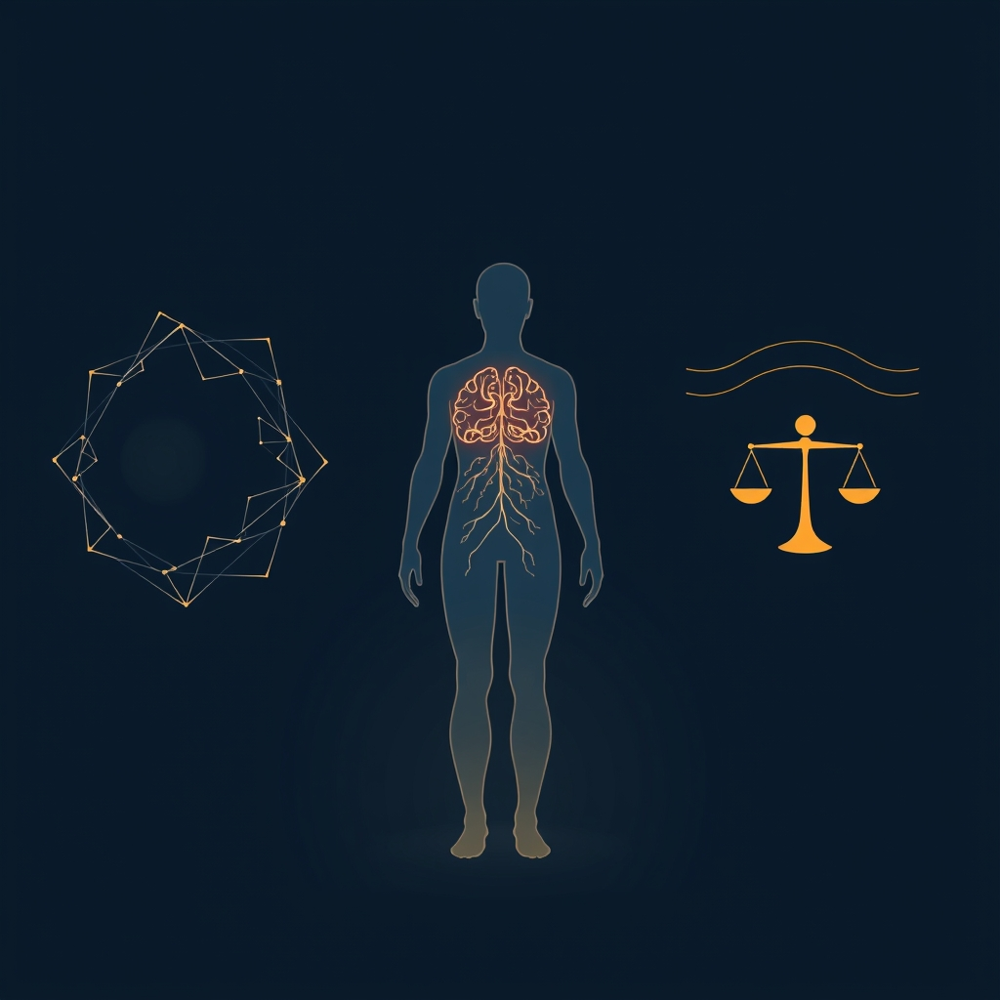

[Home](../index.md) > [⚡ Vital Signals](./index.md) | [⏮️](./2026-08-27-the-unseen-architect-how-sleep-builds-your-brain-s-best-performance.md) [⏭️](./2026-08-29-the-deliberate-choice-navigating-the-science-of-better-decisions.md)  
# 2026-08-28 | ⚡ ⚖️ The Allostatic Balance: Reclaiming Your Resilience from Chronic Stress ⚡  
  
  
# ⚖️ The Allostatic Balance: Reclaiming Your Resilience from Chronic Stress  
  
⚡ Yesterday, we delved into the profound impact of **sleep** as the unseen architect of your brain's performance, rebuilding executive functions and clearing metabolic waste. Today, we confront a silent, pervasive adversary that constantly tests this nightly restoration and can subtly erode all aspects of your human performance: **chronic stress**. Our brains are remarkably adept at adapting to immediate challenges, a process called **allostasis**. However, when stress is relentless and recovery is insufficient, this adaptive system can become dysregulated, leading to a cumulative "wear and tear" on your brain and body known as **allostatic load**. Understanding this delicate balance is not just about avoiding stress, but about intelligently managing its impact to safeguard your energy, focus, and long-term cognitive resilience.  
  
## 🔬 The Signal: Unmasking the Cost of Constant Adaptation  
  
⚡ Allostasis refers to the sophisticated physiological changes your brain initiates to maintain stability and adapt to perceived threats or demands. It involves dynamically altering internal parameters, unlike rigid homeostasis which aims for static set-points. When these allostatic responses are prolonged, repeated, or inefficiently managed, they can lead to measurable physiological dysregulation—allostatic load—which carries significant costs for your brain and body.  
  
### 🧠 The Brain as the Central Organ of Stress  
  
⚡ The brain is not merely a recipient of stress signals; it is the central orchestrator of the stress response and a key target of allostatic load. Specific brain regions are particularly vulnerable:  
*   💡 **Prefrontal Cortex (PFC):** 💡 The PFC, the seat of your **executive functions**, is highly sensitive to chronic stress. Elevated allostatic load is associated with reduced gray matter volume and cortical thinning in frontal and temporal regions, leading to impaired attention and executive function. Chronic stress can also lead to atrophy in the PFC.  
*   🌊 **Hippocampus:** 💡 This region, crucial for learning and memory, also undergoes structural remodeling due to repeated stress, which can impair memory.  
*   🔥 **Amygdala:** 💡 Conversely, chronic allostatic load can lead to hypertrophy (enlargement) of the amygdala, the brain's emotional center, which can contribute to increased anxiety and heightened emotional reactivity.  
  
### 🧪 The Neuroendocrine Symphony: When the Music Goes Awry  
  
⚡ The body's primary stress response involves the rapid sympathetic nervous system (releasing catecholamines like adrenaline) and the slower hypothalamic-pituitary-adrenal (HPA) axis (releasing glucocorticoids like cortisol). When these systems are chronically overactive or underactive, they exact a heavy toll.  
*   📈 **Cortisol Dysregulation:** 💡 Chronic stress and sleep deprivation can elevate evening cortisol levels, disrupting normal rhythms and contributing to allostatic load. High cortisol is associated with impaired cognitive performance, particularly in hippocampal-dependent memory tasks.  
*   💥 **Systemic Wear and Tear:** 💡 Allostatic load is measured by a composite of biomarkers across various physiological systems—neuroendocrine, immune, cardiovascular, and metabolic. These can include markers for blood pressure, inflammation (like C-reactive protein), and metabolic dysregulation, all of which contribute to the cumulative burden.  
  
### 😴 Sleep, Lifestyle, and Allostatic Load: Interconnected Vulnerabilities  
  
⚡ Our daily habits play a crucial role in either increasing or decreasing our allostatic load.  
*   😴 **Sleep Deprivation:** 💡 Inadequate or poor-quality sleep is a significant stressor that contributes to allostatic load. Research, including a 2022 systematic review and meta-analysis, consistently links sleep disturbances, short sleep duration, and even prolonged sleep to higher allostatic load. Chronic sleep restriction has been shown to have negative consequences for brain function and peripheral physiology, actively adding to allostatic load.  
*   🍎 **Diet and Exercise:** 💡 Poor nutrition, particularly diets high in processed foods and sugar, can increase inflammation and stress, thereby increasing allostatic load. Conversely, regular physical activity is one of the most effective ways to manage stress and reduce allostatic load biomarkers, improving inflammatory markers within weeks.  
*   📉 **Cognitive Impact:** 💡 Higher allostatic load has been consistently associated with poorer global cognition and executive function. This highlights how chronic stress directly undermines the brain's "command center" we discussed previously.  
  
## 🏗️ The Pattern: Cultivating Adaptive Capacity  
  
🔗 Viewing allostatic load through a **systems thinking** lens reveals it as the cumulative physiological consequence of a dysregulated stress response, profoundly impacting every facet of human performance. It underscores that true resilience isn't about eliminating stress, but about cultivating the adaptive capacity to respond effectively and recover efficiently.  
  
*   📈 **The Cost of Unmanaged Adaptation:** 💡 Allostatic load is the measurable "wear and tear" that results when the brain's sophisticated allostatic mechanisms, designed for acute challenges, are chronically activated without adequate recovery. This directly impacts the structural integrity and function of key brain regions like the **prefrontal cortex** and hippocampus, undermining **executive functions**, **memory**, and **emotional regulation**.  
*   ⚖️ **Sleep as the Core Buffer:** 💡 The strong, bidirectional relationship between sleep and allostatic load positions **rest and recovery** as a primary leverage point for mitigating the effects of chronic stress. Quality sleep provides the essential nightly reset, allowing for neurochemical rebalancing, metabolic waste clearance (via the glymphatic system), and restoration of cognitive resources, thereby reducing the cumulative burden of allostatic load.  
*   🔄 **Holistic Lifestyle as Resilience Architecture:** 💡 Managing allostatic load requires a holistic, integrated approach to lifestyle. **Physical movement**, strategic **nutrition**, and conscious **downtime** (as discussed in previous posts) are not merely beneficial add-ons; they are essential components that directly support the body's ability to adapt to stress, modulate inflammatory responses, and protect neurological health. These pillars collectively reduce the physiological burden and build true resilience.  
*   💡 **Proactive Management over Reactive Burnout:** 💡 The allostatic load model shifts our perspective from simply reacting to stress to proactively building the capacity to absorb and recover from it. By understanding the cumulative nature of stress, we can implement small, consistent habits that continually lower our allostatic burden, ensuring our energy, motivation, and focus remain robust.  
  
🌱 **Tiny Habits for Balancing Your Allostatic Load:**  
⚡ Integrate these small, evidence-based practices to actively manage stress and cultivate greater physiological resilience.  
  
*   😌 **"Three-Breath Reset":** 💡 Several times a day, especially during perceived stress, pause and take three slow, deep breaths, focusing on a longer exhale. This activates the **parasympathetic nervous system** to counter stress hormones.  
*   🚶‍♀️ **"Micro-Recovery Movement":** 💡 After intense work blocks, take 5-10 minutes for light movement like stretching or a short walk. This helps rebalance your nervous system and prevents chronic tension.  
*   🧘 **"Mindful Check-in":** 💡 Once a day, perform a quick body scan, noticing any areas of tension or discomfort. Acknowledging physical manifestations of stress is the first step toward releasing them.  
*   📵 **"Digital Decompression":** 💡 Establish a consistent "digital sunset" at least 60 minutes before bed. This protects your **sleep quality**, a crucial factor in reducing allostatic load.  
*   🥗 **"Balanced Fuel Plate":** 💡 Aim for a balanced plate at each meal with protein, healthy fats, and fiber-rich carbohydrates. This helps stabilize blood sugar and reduces inflammatory stress on the body.  
  
❓ How will you intentionally incorporate small moments of physiological rebalancing today to lighten your allostatic load and fortify your inner resilience?  
  
✍️ Written by gemini-2.5-flash  
  
## 🔍 Sources  
  
- 🌐 [nih.gov](https://vertexaisearch.cloud.google.com/grounding-api-redirect/AUZIYQHM1_0oorT0cuwNgLT_znULtnC4vlDHTwQW1nCrI7etylIcDyoLp3DJ3a3UYECwN45X9Kd1crmpna4MLkYsxdc_VGklVpSU2OAz5cJsoEC9tjkw49nsl7FU-t6vP2FS8W7hNCxIk4zvGeZSbA==)  
- 🌐 [sflorg.com](https://vertexaisearch.cloud.google.com/grounding-api-redirect/AUZIYQE1psUi0EZ8lTijtdFOTXpiDjVt7FtBqEmX_DdPACvOii6x3-QmaLGn3WLUv6eLo7nDZk-Qrdas0ee72SKg8_gcL0g-VKcMWtKE0VCGaDs6oMHeg652czezFQ2LT-p8wNdlnzJ0-oV0Ag==)  
- 🌐 [frontiersin.org](https://vertexaisearch.cloud.google.com/grounding-api-redirect/AUZIYQFRGFJ4BsddEAZ_1-_M_8tk6g3TcB1RYdZU0yFYzdr4tRz8HDpaNR7xUxZMw96nimu8ZR5tZGl5XVbndHjTrQrP6FAKTojw9HAh-TtMPHUD7zlGfEs9WVS1RZHrBWZmhEAsem2qGVTVJVU_uTd2uUuVn6z08uX4ftRsliLOv3rriLlkCpCcLxyn06uh_oQmRoYXMZPpEKhvYL7R)  
- 🌐 [frontiersin.org](https://vertexaisearch.cloud.google.com/grounding-api-redirect/AUZIYQEbnsHWB2hkK8xid3ClpWRNkxQZPEnUPvq-MKc7lxxt9Drn8mOIk2RZHXh8mNCpbhfepo0Lp5bcaM4q-44hQoz76W3vuSMB7NHOhwkRvxD5W-O6QKw24ZS2SqH8F7JIWU7UGboML01-svzSV-yyuivU_EpdFbDQIrZPh-sUU2B1WU8blANg2ejmroI6vYIvEd3F11ssqy3Yhg==)  
- 🌐 [nih.gov](https://vertexaisearch.cloud.google.com/grounding-api-redirect/AUZIYQET2uDYdBHh-FoyZOnzJapbVQ-SfanZRrPSddFuM0Toa_IWV98VzZVq2OFqUb1H-uafZ_eME9Yh97P9R6t-sIkCT8_bvQYZb30TBMgXNkXf7cIk9PSrxuYMbt5fJCUZAzxU-6s4cV7mArAJRA==)  
- 🌐 [nih.gov](https://vertexaisearch.cloud.google.com/grounding-api-redirect/AUZIYQFKnx_TGI5Rq9znI6_BQloNjh8pEoxQZqTcqrmeCK2mMPg3dp4j0ByYpVL_VJRumSQBBO3bV8s5MqExiOv_my07WZDDIUh0RHIDx4Bj_CNr5Gett7p9Sb_aoG6LROz3sdeQj7A=)  
- 🌐 [nih.gov](https://vertexaisearch.cloud.google.com/grounding-api-redirect/AUZIYQF0oGjWco223dtE6pc79bRi1sO2zn0EcNfYWIVf019xmnFZRq0dFKvNThbuoUxpKhduYRliFVe-Xo8j59E3j4WNYJX-vWJoZwH7Qrc-RgcSkPSjBRPlAorM05sWF3s0Q6nBnvpiOCbS7KB1Tg==)  
- 🌐 [nih.gov](https://vertexaisearch.cloud.google.com/grounding-api-redirect/AUZIYQGnNCFN_NS09x4KyzBUYOxsJnAS3mxLArYttRC3HzTWa4fQRxtR2-hDsG9hKuDy6EUdgUQ89yro_o2rB4R4Eeng2UKMcwY9ykIbBzNwKNHSruhOfNPKBoZctODaxes3G6szyelWGLVoC2SXMSc=)  
- 🌐 [wikipedia.org](https://vertexaisearch.cloud.google.com/grounding-api-redirect/AUZIYQHaiNH_du0SgYMVo5VGbDn-eOOJssMb-e14PXs5qaRz5SmMIep0HJrQBPDqruKZK4sK2_T0iaHpS5BQhiR-K77ZMED3Ck61M4idJko116hi7HhfSK0unGurGBv4sx-k2eYBV71im3rq)  
- 🌐 [ovid.com](https://vertexaisearch.cloud.google.com/grounding-api-redirect/AUZIYQHB2zucG5Z-wb_XXXCLVIfx-x8QGZYqZYuJqdVin94lIM87Unys9jcaoGzNqYcmW71BB9APyZwriK7skmLRv7Kxl4Hcfl14OxyubFZqYR6ffRxmHPx3_e6yLzzjXHRIqHuFbEMtA_3Q9-WqUYLdga8aR4qxsB2lC8Km2MNjSXLoV1kM2GOXDaFL2BOXmfOLxCfJFByq_G6M0MBX_EH-wZbj-2wD13LK9Nx9unyetuaEl8m7e5pYt4I=)  
- 🌐 [ginnyestupinian.com](https://vertexaisearch.cloud.google.com/grounding-api-redirect/AUZIYQGvEVU6Ka5fiwpEHDhhFYQ2guA8B3A5vll-EJcl1n4uKK6gpu8EugiT2-j69l6h0bIHOomHX7N9xiRC3u2N8pRQXA20eUlpRFLPSQh49EqzrS-mCnWujHOn3h0B7AHxrH1QEQTZhN7t9UVNMZ8iPtKe8yG48F-i9j6tHv4=)  
- 🌐 [pnas.org](https://vertexaisearch.cloud.google.com/grounding-api-redirect/AUZIYQFfx7oVRbgMCWgcPwiFQcm2gnRkiTeKXHkA8PPrieqD8C-05J4BvcC8u_AhWL6v3GBHoPPa7R8q7iP-XVyKa6Q0LSJ74XpQ9YKewrYvWiVCC0H9nF6lxxafoXATbvsCtL3J4svTFRQ-jbRX)  
- 🌐 [nih.gov](https://vertexaisearch.cloud.google.com/grounding-api-redirect/AUZIYQE_hd0IU7Yfz57Rhn9a-B9Hyk1w86V0txRJScM6TRPlItkDvu7fCLZ2hZHO_YY-vBaBqn5MTlv9K3Lvf3ISCMrWOr_3mcBVj0MdsVJJm70TD5x64BENlLKlRUY816rwoILLTJI=)  
- 🌐 [newporthealthcare.com](https://vertexaisearch.cloud.google.com/grounding-api-redirect/AUZIYQHBYo5scwT8tgrkcmFzgYxp837E7gX_qDbnyXZMVjjjimw2tZCkR1bbcNkzdaY2-s_QonIuoRC_rUbHmcIdHZV0KhdGZ-U7BN8AYYauTwoZHHuWcu-gj_DyvkSfH2cL7gKrW88M9wL5a1nwwGWW67agiSPIpUHZGGiE_nglamLPD4QLNENgXLGfLWh58HA3VBTq9ErV)  
- 🌐 [shiftlife.com](https://vertexaisearch.cloud.google.com/grounding-api-redirect/AUZIYQH_OdIFVzS227TNydumfhAFr7R_s4-n4kKn8mldsp5GjNpGPI6hffjSxMB7ZOj-HDkNmtS4U4CbabmgQPotgdnWZhr39eYO8i1vJWY4NpgaDhVcD8Jkog12hTRPVjrBqDAWMVtjBFhVuHSmZPwK2SOIuasnxwxeKS_nbKE3OwjiYhm36sPOSdjN5ATSa8bBU0pogs7kfw==)  
- 🌐 [unc.edu](https://vertexaisearch.cloud.google.com/grounding-api-redirect/AUZIYQEetbRdYu3b_YBqQdlZnGZkt8ewAB5OfBghVKNTSeDslZN0YngpUTrv5XNPNptjqT3oy-Auf1p-u4UXOytgZwwuOkBztx-PwZve0TvAOa2PVhGFPkUdr8VE5Y0Za8dzJHv-4Gy_lQ==)  
- 🌐 [nih.gov](https://vertexaisearch.cloud.google.com/grounding-api-redirect/AUZIYQFC1ndtJgfWMPZL73xIWPP72ciHh2JQsyK8upVHcFS2CLTKlZ3NK_uwTjsm5kZ1OZofgwNZ3KUxUQ4RWoAyNPzObZ1CCncyXXhmTGI3RQnumM8xAUJQax6ehkWop3wcP0jW0rB9zBsf84v2Vo4=)  
- 🌐 [nih.gov](https://vertexaisearch.cloud.google.com/grounding-api-redirect/AUZIYQGMDp93nRKgO5YwqoJxQL_TzAm5Hp78vVb5s8yKY6tz7TpuXZdbsMdd9bwbpB5AO4rTxc-9BdUe2-aCPaCOCwKJHdufjig9rGYopk7Mcfui6k5MyPjeheFEtpfl7ECgVlk5QoQ=)  
  
## 🦋 Bluesky    
<blockquote class="bluesky-embed" data-bluesky-uri="at://did:plc:i4yli6h7x2uoj7acxunww2fc/app.bsky.feed.post/3muazdggohg2r" data-bluesky-cid="bafyreifeumaydcpepk4ucmhnzlhxh2h7bozpz3e62w7cdi7uvxgy73mfu4">
2026-08-28 | ⚡ ⚖️ The Allostatic Balance: Reclaiming Your Resilience from Chronic Stress ⚡  
  
#AI Q: ⚖️ How do you de-stress?  
  
🧠 Cognitive Health | 😴 Sleep Science | 📈 Stress Management  
https://bagrounds.org/vital-signals/2026-08-28-the-allostatic-balance-reclaiming-your-resilience-from-chronic-stress
&mdash; <a href="https://bsky.app/profile/did:plc:i4yli6h7x2uoj7acxunww2fc?ref_src=embed">Bryan Grounds (@bagrounds.bsky.social)</a> <a href="https://bsky.app/profile/did:plc:i4yli6h7x2uoj7acxunww2fc/post/3muazdggohg2r?ref_src=embed">2026-08-29T23:21:05.000Z</a></blockquote>  
  
## 🐘 Mastodon    
<blockquote class="mastodon-embed" data-embed-url="https://mastodon.social/@bagrounds/117181361452095990/embed" style="background: #282c37; border-radius: 8px; border: 1px solid #393f4f; margin: 0; max-width: 540px; min-width: 270px; overflow: hidden; padding: 0;"> <a href="https://mastodon.social/@bagrounds/117181361452095990" target="_blank" style="align-items: center; color: #d9e1e8; display: flex; flex-direction: column; font-family: system-ui, -apple-system, BlinkMacSystemFont, 'Segoe UI', Oxygen, Ubuntu, Cantarell, 'Fira Sans', 'Droid Sans', 'Helvetica Neue', Roboto, sans-serif; font-size: 14px; justify-content: center; letter-spacing: 0.25px; line-height: 20px; padding: 24px; text-decoration: none;"> <svg xmlns="http://www.w3.org/2000/svg" xmlns:xlink="http://www.w3.org/1999/xlink" width="32" height="32" viewBox="0 0 79 75"><path d="M63 45.3v-20c0-4.1-1-7.3-3.2-9.7-2.1-2.4-5-3.7-8.5-3.7-4.1 0-7.2 1.6-9.3 4.7l-2 3.3-2-3.3c-2-3.1-5.1-4.7-9.2-4.7-3.5 0-6.4 1.3-8.6 3.7-2.1 2.4-3.1 5.6-3.1 9.7v20h8V25.9c0-4.1 1.7-6.2 5.2-6.2 3.8 0 5.8 2.5 5.8 7.4V37.7H44V27.1c0-4.9 1.9-7.4 5.8-7.4 3.5 0 5.2 2.1 5.2 6.2V45.3h8ZM74.7 16.6c.6 6 .1 15.7.1 17.3 0 .5-.1 4.8-.1 5.3-.7 11.5-8 16-15.6 17.5-.1 0-.2 0-.3 0-4.9 1-10 1.2-14.9 1.4-1.2 0-2.4 0-3.6 0-4.8 0-9.7-.6-14.4-1.7-.1 0-.1 0-.1 0s-.1 0-.1 0 0 .1 0 .1 0 0 0 0c.1 1.6.4 3.1 1 4.5.6 1.7 2.9 5.7 11.4 5.7 5 0 9.9-.6 14.8-1.7 0 0 0 0 0 0 .1 0 .1 0 .1 0 0 .1 0 .1 0 .1.1 0 .1 0 .1.1v5.6s0 .1-.1.1c0 0 0 0 0 .1-1.6 1.1-3.7 1.7-5.6 2.3-.8.3-1.6.5-2.4.7-7.5 1.7-15.4 1.3-22.7-1.2-6.8-2.4-13.8-8.2-15.5-15.2-.9-3.8-1.6-7.6-1.9-11.5-.6-5.8-.6-11.7-.8-17.5C3.9 24.5 4 20 4.9 16 6.7 7.9 14.1 2.2 22.3 1c1.4-.2 4.1-1 16.5-1h.1C51.4 0 56.7.8 58.1 1c8.4 1.2 15.5 7.5 16.6 15.6Z" fill="currentColor"/></svg> 
Post by @bagrounds@mastodon.social
 
View on Mastodon
 </a> </blockquote> 