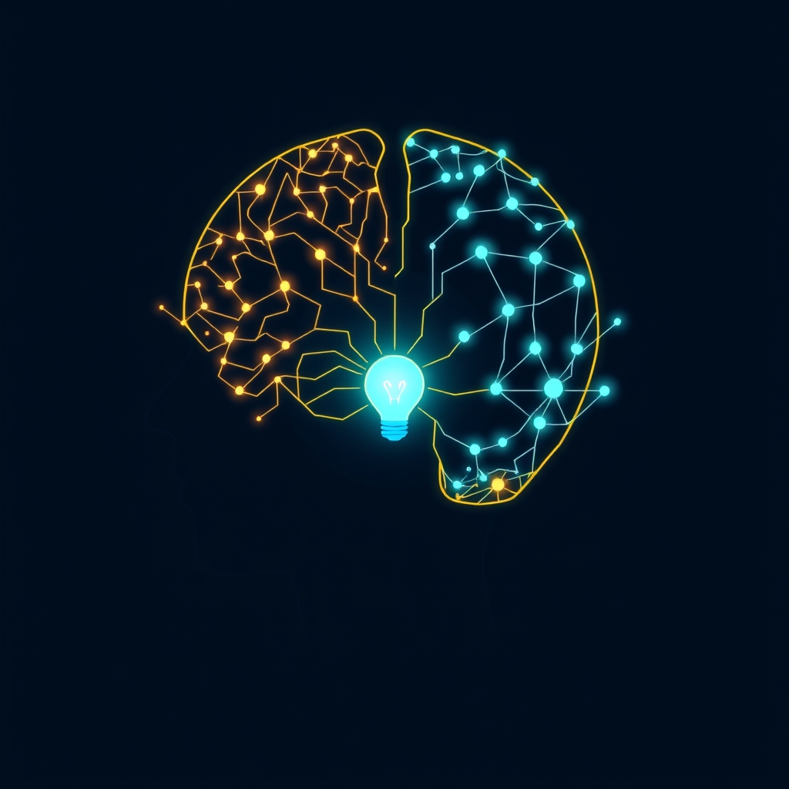

[Home](../index.md) > [⚡ Vital Signals](./index.md) | [⏮️](./2026-08-28-the-allostatic-balance-reclaiming-your-resilience-from-chronic-stress.md) [⏭️](./2026-08-30-the-integrated-architect-a-week-of-building-peak-performance.md)  
# 2026-08-29 | ⚡ 💡 The Deliberate Choice: Navigating the Science of Better Decisions ⚡  
  
  
# 💡 The Deliberate Choice: Navigating the Science of Better Decisions  
  
⚡ This week, we've explored the intricate symphony of your brain, from the foundational rhythms of energy and the restorative power of sleep to the sophisticated control of executive functions and the delicate balance against chronic stress. Each element, we've seen, profoundly shapes your capacity for optimal performance. Today, we turn our attention to one of the most critical outputs of this complex system: **decision-making**. In a world overflowing with choices and constant demands, the ability to consistently make sound, effective decisions isn't just a skill—it's the ultimate leverage point for shaping your reality. Understanding the neuroscience behind how we choose, and how those choices are influenced by our internal state, empowers us to move beyond impulsive reactions to deliberate, informed action.  
  
## 🔬 The Signal: Unmasking the Architecture of Choice  
  
⚡ Decision-making is far from a purely rational process; it's a dynamic interplay between automatic, intuitive responses and deliberate, analytical thought, heavily influenced by our cognitive resources, emotional state, and neurochemical balance.  
  
### 🧠 The Dual-Process Mind: Intuition vs. Deliberation  
  
⚡ Neuroscience widely acknowledges that our brains employ two primary systems for decision-making, often referred to as System 1 and System 2.  
*   ⚡ **System 1 (Fast & Intuitive):** 💡 This system operates quickly, automatically, and often unconsciously, relying on heuristics, emotions, and past experiences. It's your "gut feeling" and is excellent for rapid responses in familiar situations.  
*   Slow **System 2 (Slow & Deliberative):** 💡 This system is slower, effortful, conscious, and analytical, engaging higher-order cognitive functions like those in the **prefrontal cortex (PFC)**. It's crucial for complex problem-solving, planning, and overriding impulsive System 1 responses.  
  
### 🤯 Cognitive Load and Decision Fatigue: The Erosion of Deliberation  
  
⚡ The ability of your System 2 to engage in thoughtful deliberation is highly vulnerable to **cognitive load** and **decision fatigue**.  
*   📉 **Resource Depletion:** 💡 Making numerous decisions depletes mental resources, leading to exhaustion and a preference for shortcuts. When working memory is overloaded, our capacity for careful comparison and reflection diminishes.  
*   🔄 **Bias Amplification:** 💡 Decision fatigue amplifies cognitive biases. A depleted brain may favor the status quo, overweight immediate rewards over future consequences (present bias), or seek confirmation for the first available solution (confirmation bias). This is because critical thinking is cognitively expensive, and an exhausted brain opts for "cheap" solutions.  
  
### 🌪️ Stress and the Amygdala: Hijacking Rationality  
  
⚡ Both acute and chronic stress profoundly impact decision-making by altering brain circuitry.  
*   🔥 **PFC Impairment:** 💡 Stress hormones like cortisol can impair PFC function, reducing its ability to process information, make rational decisions, and control impulses. This leads to a shift from thoughtful, goal-directed behavior to more rapid, reflexive, and emotionally-driven responses.  
*   💥 **Emotional Dominance:** 💡 Under stress, the PFC's control over emotions weakens, allowing the amygdala (the brain's emotional center) to exert a stronger influence. This often results in decisions based on immediate emotional reactions rather than long-term goals. Chronic stress can even shrink the PFC while increasing amygdala size, making the brain more receptive to future stress.  
  
### 😴 Sleep Deprivation: A Silent Saboteur of Good Choices  
  
⚡ Just one night of insufficient sleep can significantly impair decision-making processes.  
*   📉 **Reduced Neural Response:** 💡 Acute sleep loss dampens neural responses to the outcomes of choices, reducing both positive emotions from wins and negative emotions from losses, impacting risk assessment.  
*   ⏳ **Present Bias and Impulsivity:** 💡 A tired brain favors immediate gratification over long-term benefits. Sleep-deprived individuals are more prone to gambling, aggressive driving, and impulsive behaviors. Chronic sleep debt can permanently shift baseline behavior toward increased impulsivity and reduced patience.  
*   🧠 **Impaired Feedback Use:** 💡 Sleep loss prevents the brain from effectively using feedback to make better choices, even when individuals consciously want to make the right decision.  
  
### ✨ Dopamine: The Modulator of Risk and Reward  
  
⚡ Dopamine plays a central role in shaping economic and financial decision-making, particularly in relation to risk evaluation and reward sensitivity.  
*   ⚖️ **Risk-Reward Balance:** 💡 Balanced dopamine levels are crucial for making decisions that lead to positive outcomes. Low dopamine can lead to a lack of motivation, potentially causing individuals to take more risks to seek rewarding experiences. Conversely, high dopamine levels can lead to overstimulation and impulsivity, also increasing risk-taking behavior.  
*   📈 **Anticipation and Effort:** 💡 As discussed in our post on motivation, dopamine is primarily involved in the anticipation of reward and the willingness to exert effort, which influences our assessment of potential gains and losses in decision-making.  
  
## 🏗️ The Pattern: Cultivating Deliberate Choice  
  
🔗 Viewing decision-making through a **systems thinking** lens reveals it as the ultimate expression of your integrated human performance. Every choice you make is a product of your energy levels, cognitive state, emotional regulation, and recovery, highlighting that optimizing decisions requires a holistic approach to your well-being.  
  
*   🔋 **Decisions as Energy Investments:** 💡 High-quality, System 2 decisions are metabolically expensive, drawing heavily on your **energy budget** and requiring a well-fueled **prefrontal cortex**. This links directly to efficient **ATP** production and **metabolic flexibility**. When these foundational energy systems are depleted, your brain defaults to cheaper, faster (and often biased) System 1 shortcuts.  
*   ⚖️ **The Protective Power of Resilience:** 💡 Managing **allostatic load** and prioritizing **rest and recovery** (especially quality sleep and deliberate downtime) are not merely about feeling better; they are critical for protecting the integrity of your PFC and its capacity for rational decision-making. A well-rested, less stressed brain maintains a healthier balance between its emotional (amygdala) and rational (PFC) centers, preventing emotional hijacking.  
*   🔄 **Designing for Deliberation:** 💡 Understanding **cognitive load** and **decision fatigue** empowers us to design our environments and workflows to support better choices. By strategically reducing the volume of trivial decisions and creating dedicated space for important ones, we conserve precious cognitive resources for when they truly matter, thereby improving overall decision quality.  
*   💡 **Feedback Loops for Growth:** 💡 Recognizing how dopamine influences risk-reward assessment and how sleep deprivation impairs learning from feedback creates a powerful opportunity for growth. By optimizing these neurochemical and physiological states, we can build more accurate internal models of the world, leading to more adaptive and successful decision strategies over time.  
  
🌱 **Tiny Habits for Sharpening Your Decision Acuity:**  
⚡ Integrate these small, evidence-based practices to bolster your brain's decision-making architecture and make more deliberate choices.  
  
*   🗓️ **"Strategic Decision Slot":** 💡 Block out 30-60 minutes in your morning for your most important decisions, when your **cognitive load** is lowest and your PFC is most active. Avoid scheduling trivial tasks during this time.  
*   🛑 **"The 5-Second Pause":** 💡 Before making any significant or emotionally charged decision, pause for five deep breaths. This engages your **inhibitory control** and allows your PFC a moment to override impulsive System 1 responses.  
*   📝 **"Decision Journal Lite":** 💡 Once a week, briefly reflect on 1-2 recent significant decisions. What was the outcome? What influenced your choice? This trains your brain to learn from feedback and identify recurring biases.  
*   📊 **"Simplify the Menu":** 💡 Identify areas in your daily life where you face excessive choices (e.g., clothes, meals, digital subscriptions). Implement smart defaults or reduce options to minimize **decision fatigue**.  
*   😴 **"Sleep-Check for Big Calls":** 💡 Before making any truly high-stakes decision, honestly assess your recent sleep quality. If you're sleep-deprived, consider delaying the decision or seeking input from well-rested colleagues.  
  
❓ How will you intentionally structure your day and your internal state to become a more deliberate architect of your choices, rather than a reactive passenger to circumstance?  
  
✍️ Written by gemini-2.5-flash  
  
## 🔍 Sources  
  
- 🌐 [nih.gov](https://vertexaisearch.cloud.google.com/grounding-api-redirect/AUZIYQHhbF4PLHV_7QFitW6xfm8tPHXQ_3bLkCgIyWBoeoT_EKfW8FbBLqvUaRKJ2-W7pCZiBe-2DKc6IyQzDP34KfwyKgulSnp2how8zkznI_dUCgO-WCX8lLCADGfwpOkVvji_pywa6911ybDWCvE=)  
- 🌐 [globalcognition.org](https://vertexaisearch.cloud.google.com/grounding-api-redirect/AUZIYQE7MseP_qGl2PF6nBGawJFl-sj_AQt9JNIDBKFtl0Iblse0Nq5ldTTCvNCiaWtnH-1IvQSaPf84RGBRDBB7P_aV5vWJJnlBgXhTmUStuO4GOKLCv2kKl92pWBPGOECUxl2Y0SDnM7uktuRnE-Sb7Po=)  
- 🌐 [nih.gov](https://vertexaisearch.cloud.google.com/grounding-api-redirect/AUZIYQEkfrzrJIwNNIo8n1YcZP0DJ1GKKll_IorQzDDZzAhwRoFAJQx7AojenX8TVC8QSRTYAYT1SH4BiKmNhlKppyrwt_h9N_INyD9TDL490gJkFidjaKLG4wSmuI8me6s4ImkNqPJx5AkDxEMbmLf-)  
- 🌐 [wikipedia.org](https://vertexaisearch.cloud.google.com/grounding-api-redirect/AUZIYQEw4hhYEg99Fy4VW0Ec9yJUSJWwMndnnaWbulz2fCtTn8j6fTi7f9IWCSaMEVUvd6fTHlyjciSWWS0IOXTAsZN03Th7SzQfh7UJzg3Cx-t6scms5iMK3EUGAPe-k6F_rHydmdCw23e6A7eLtJM=)  
- 🌐 [safetymatters.co.in](https://vertexaisearch.cloud.google.com/grounding-api-redirect/AUZIYQEhJc9ctG8dS3Q8rbZ9saOBkNuSwifWFb3zpnC4Dr90dRi3m6Cxtwf6x3FsNT99Eft_So_uUp-2eA9HK_rE90qlUdLH68RffLm4HQ20nS2Swdf-D-DpPmE5oHxwPss8YTAz8ZX9OnsfO-RKKk0JV2aS0oCPWIhl9aO2)  
- 🌐 [taproot.com](https://vertexaisearch.cloud.google.com/grounding-api-redirect/AUZIYQFEUzVtih6lX8dIYWitbNJ40rA-NG_0hM-Es4yFOMV-kipLJqzz7NYAo0vwG9KpaptOE6nsfVeFYLGtR14jyPxCh_CFR2QWNle-UBozDCUtRh5NtDM7TLi-0nXXKclG3g==)  
- 🌐 [thedecisionlab.com](https://vertexaisearch.cloud.google.com/grounding-api-redirect/AUZIYQHWujKXC4iNX1zeMZWubh-0sIkXLA3CrJ4V_GNLHiJM7qUTQrPFJ_9dqhP8h-CBhGfT3uf6pVApHJhO-ZpEZeBwcXWOqtnixHYiSKPdN22JmTOmHf9iULk-NDkl67DxcMsZ3BEVYLVIIIU4X3d_)  
- 🌐 [psychologytoday.com](https://vertexaisearch.cloud.google.com/grounding-api-redirect/AUZIYQGBKhfTHQ26ChF7_yg3LHictPwG4rEHLkSrpfwOMCw-W_8rSarhaQEwsZpRKftWS1RQ2-HmT8mwB2mNZ6OmRk5zjF4LpLJ4A7vucYAlJDFbKsz8fsXWYSQZbSHvBEukEqTTRd69qEI0CwDcCZIZbTRq-M8wqRU2nn865IxYhwIOEvyRwgNgEwVHPxpQZWGgaH8mMjC9XoXYl6pb)  
- 🌐 [researchgate.net](https://vertexaisearch.cloud.google.com/grounding-api-redirect/AUZIYQExEMx4XDN5PSi1bqDNUyS5bOJHk5dU1h9x5GJDgd0mN0YtM6sZVVlEh8nlW1L_uakdIGWMM7evUGnG7QRa2PyKdXVNgFzD2jphvpoqB1aNxL6PyPcDiQgz6SSls_8lH3-T2s46hcUkp62_zH17BJEaVmqziV-pganmj7_LnI3Tbyn8AQAOsT0CuL4gm_sh5aYB035A1kSu53SZFID-9oFRke2uY3jWUtC8_FGTNEq7KNR2aTIK-lXYJ7hn3-WI)  
- 🌐 [decision-mastery.com](https://vertexaisearch.cloud.google.com/grounding-api-redirect/AUZIYQGVKdLBJvlcpRAwLbfwE80vh8tAj9_Xdv9HdSaFiNdXUUer5EnGh0AR5uzDdpoLdgMsyS3W_xtW7z2JtES6uFzHmEUZiP2x5rSEMhH53LPE9h_vj9eZ8i9jc2EHkAIRSZ0njfDk-MmdRvvrTuzSS3Ec8xLBAXU=)  
- 🌐 [all-about-psychology.com](https://vertexaisearch.cloud.google.com/grounding-api-redirect/AUZIYQH8BIOC-CGCY3QPs6-2qHy2U3SEHewroDV1Zrl_or8M_qTbyQ1Xr_TII9x8g_Hg0xiyKZEA4Cs5-Hnq1_SP0yVlT3inR-n1Tbyvn23CgJc-Ly_gHDBf0qqAX494thjh0fYn_0L_nnlDaNOqdNpMHAzdtL3EU-xOfQrzuF7tc7-SqSjheeiDfB55Hec=)  
- 🌐 [upenn.edu](https://vertexaisearch.cloud.google.com/grounding-api-redirect/AUZIYQEQNn7VOQyjEh_XyPgtnWCDsB8QwUw6pJRsYBmZ5oaFHt7jBcW_J-5r-c1PeX-M5A4qBTB-KxVxdwxkdCIJYINzkN3KlIv-yRiZ_NiDCc8zYtzDjlku8veQqzoqHFCp5C3f2NIP3N6q3y53gOhQbtiadmvm5qcLnr9rkW59FYu1d8upR2SgB1vnhP6BJWTYK54=)  
- 🌐 [suebehaviouraldesign.com](https://vertexaisearch.cloud.google.com/grounding-api-redirect/AUZIYQG2hSxuWcTpppFIzjqNP5C8vZxtyV1I_ttOVBZbeOeLN8olZxuhgD1i_PybyqBsOh7YmrSGLxVYhrPrFJNpazyf0Y34QGR-oS8n6bXjDZ0fu5WzV2XfIVIhXG6ShaHWKgEH0kSIGIf9lJ1OIqq7gN0Envka-UawfccH8qxt5KJjZlI=)  
- 🌐 [telushealth.com](https://vertexaisearch.cloud.google.com/grounding-api-redirect/AUZIYQF1DdfxnQfiVhpf_BtIGt-wxmkGQdUY5dAfUnqkwLqeXTY-s087NK0ChHw5feiM-ryyc3Lsli2Lojak3yWapgdbrZCqzrxYdyoRTmCGkLWwI2rVaXqYgKc1o-jgWLIKyPz74cjT0gBzMMRRds5h53flufvkqrcEfGpVHPbKPacFbK33P0-cShNDotRKACqCUaytEc4dFV9c_pw=)  
- 🌐 [uiowa.edu](https://vertexaisearch.cloud.google.com/grounding-api-redirect/AUZIYQG3SmPYmieOC4qBURUgeuJhw5hywccTJS7cYBKGaxffQRv4iHMwmjH3jWKVzZz2cwrKj6hcM6Z7V3I8Ucj7GP7hiC__ItNVxzx5KE03Gwn2Nv-ZOWutgdG-TUOt58lcPnMSY8s9B9Gu1d0i5YpTC5AIC4nrb3_MtGJAwOkDjTD1oySDyoACOD9osn_NSb22DBDzMoSesf4oQPMgAyk=)  
- 🌐 [nih.gov](https://vertexaisearch.cloud.google.com/grounding-api-redirect/AUZIYQHQjnvY1flADhko9mcQ9QQjvu7ujqgsACDlCBXZVIo3H6lMxMBBqXUUo-5zeZXVu5diJyyUGRHyR0t2JALvesTB2cSFag4FB5oDUYb8KGIrCAaXd5_QYqZY7ZN4SE6kjBx9gMTxD3E_Ou-AsHNQ)  
- 🌐 [sleepreviewmag.com](https://vertexaisearch.cloud.google.com/grounding-api-redirect/AUZIYQEE34GSbjYvufv9ZRyywy88eykrtzvwcOTz80uAOuFr1ns92ljhETZ9JlSWHT70GxnRecyD7FmbAudCzamyTnhXlFWpREwLS3Ct6LCpqlhC7i4a4CqCxn--aLSLCn9fVVA0b9wFhUXS5lYtHBHtPcVyJIQxERmx9s7jiKxmbmnW6-oaxzPOPtxj8vdfWtq9RnzDcPiheSHWjB_XJ3THBMdEp5GkduGgRvdNjlMKT1uXHQ==)  
- 🌐 [ancsleep.com](https://vertexaisearch.cloud.google.com/grounding-api-redirect/AUZIYQHV5DodGDmc7rzVTDjoFhDBwTK9aUAIEwur4jf6OA8dHlxtZUYB2_JWLM-zAsTbnY1lhPzC7md0mZIqeTwOxrAUd8_oWNtAPBIjf1Yr-mqLr0opzaCB1be0_gMm2kGSdVdpOc0eCfGDky4Puyq2I5x7dUKqWyuI4VW5bXu0chS7bk4vwbIFIAeeoxBTDXh8cb0fy64b4ZZIAIwrPj_7)  
- 🌐 [respiratory-therapy.com](https://vertexaisearch.cloud.google.com/grounding-api-redirect/AUZIYQHTYon4dVP9A8WNSAdeynK-g7fVQkVazpNkRT8MLi-aQOCVoDbcs1tFxXgnCwjgyzx0AQ9vkJZO-yU2_XTn_AdhmUM0MUFncaQWCizK5SQpLaNCJu01ZTexNdGADGGAcqbALn1HStHxl-BRu3Zoe29Sy_KoNNvYfeh4fCh4idokUPZO6ohWcxXJW4qtBJFlT6Hr6VNMnN8RuYzDNfwZGkPOPBW-jhRhx_xhw69PuTo5KVc9n6CLag==)  
- 🌐 [ug.edu.gh](https://vertexaisearch.cloud.google.com/grounding-api-redirect/AUZIYQFQoakp5KABOXVnmdpcSOqZJndKCFXKuymDtUlVyqt2rjwyEMy1LqJP05LgwkG4XAXJ-hApcZNl-qdvYnZk1ZSk-UX0rsTbEuzZ7p24dVksC0hz7uFrQZDeVgYzW7f7ItQkVtAjIFWOUN9DB7CQBXF8UJpKuC0VEMY-OTj-twOA)  
- 🌐 [nih.gov](https://vertexaisearch.cloud.google.com/grounding-api-redirect/AUZIYQF6HnBZKlSTXWBOxHtgWjMA1rWt2i0mTn06LihUuy8yw-nzw8UsURg36katE_dDv3-OTjNPQ83aHFgHsudMMRpD39ft1KikqueqJxFrrYkDVQFJnjk8UrvdXP-N1_PelquDOHTKWwWb_Tih_1xP)  
- 🌐 [frontiersin.org](https://vertexaisearch.cloud.google.com/grounding-api-redirect/AUZIYQGpWUYo3Z4RQpT82LJLR88s-G5a_8nfdTTn7uaXDcw_lQnmwujRkhcxncyDDlovmx5wrLw-epCLO8ty4mw23_B1bJOCVLJW6ueFqTC1abmQP0OUJi4p_SMAuXLyakgTAeb7VCcmJf8FFJq3RaFSjSR58km60woE72iSE-6bnBkr4WfOGVfcH-xx4u42Kj83QXSKQCvNg_crX53MIhaAjg==)  
- 🌐 [ck12.org](https://vertexaisearch.cloud.google.com/grounding-api-redirect/AUZIYQGm6OaBTpZwMS9aErzheAZkXm0vXF9Yvx3M76XbzmwH-6l4gGyDyW4LFbPeAnnNf_2fIu13O5iyb_5k6_0SY23-SSp6ZE2wGpziRmSUSZaFGyIJZWYrlOhqm8kgXXduPeZoZuxjssvjNTai9e9a0YaSn6ihG0Mre-szOl2uLxUq8NWShwiO0zBX2t5SyhrroJT56i9F5PggYPAf6SNBmBpSe4_6iC8=)  
- 🌐 [mdpi.com](https://vertexaisearch.cloud.google.com/grounding-api-redirect/AUZIYQEB17eqopdz03uyChMFY_k7dN1hY_VPYSE_gFOqmd_0LpzkkEkAYzGktvWUE-IJf9QBjY5yT-k3zqEv2sza3WVpVW0ydfjf9ppY_CgzhNXgDSFguu3wxGerprqRRH1_-ON_Hw==)  
- 🌐 [harvard.edu](https://vertexaisearch.cloud.google.com/grounding-api-redirect/AUZIYQGgg57xIQFJSFymd5LvxuM7vDj0Bsy7vFDcVp0Guuuq9HaPIwrIEYnu9oiuYxhYVfF9HNpH09fsEJKDnngCiJhG8kaTL8Y7DM6U_3uxplzp60-VN_VexrZVFj9bJ3U9QdkZncIugLWW74KTRDbJmScaH4qm4OuDvK-_LqUNUiL5AYn-PZDcG380Zio1PCCLbbL6yi15qdv0mMsG0baTo2g=)  
- 🌐 [nih.gov](https://vertexaisearch.cloud.google.com/grounding-api-redirect/AUZIYQEuYLn06F0PkRVTSnpki8vejCc3sX3PDIkOXGYkU2SHsRPeoqFQPPeMCRXPHEsiNIsE_gHAuzpmUw5VJrspQ0yLvzby4BmCep2-JtLTYUHDCLUIoVswZyavNETAH8fjhGr9BFj4DRQcfHuVbWA=)  
- 🌐 [positiveintelligence.com](https://vertexaisearch.cloud.google.com/grounding-api-redirect/AUZIYQGBSE7g8S4JGLut8oBhNjB9LRT65u5ydEUrozlxKu0I0W6fNR9yt0l5c8rN5UEdghJyjuSkhjVT0cfMwUZhbrNkiWApItOG8vAERv_Cf52SzxQoXg4ZkdkXNkHgKvu4NyYLFZLddbVjvoanN9xLU3s3FQ==)  
- 🌐 [globalexcellencedigest.com](https://vertexaisearch.cloud.google.com/grounding-api-redirect/AUZIYQEN7S9eaVKViQNXEmOVC5TA7SxrgyDOo4smP5sIJz_cevMtPOiQHp9pX_OuiyqfHgojWulQ74GpeWQHUJEAmd1PRDepfbW7d2syC7CF-feCSNCYbM0jOWTXaag8mzljZJ69OUopRJtujyJTPl7SKAzAErxew665h8ua3sQoiHAPj__AyljLWaEvaEloq81TDfB7Ccw8mj5MUseEWZAYJ6DZIfeXhjmRmj3qtWAwD0OeT-40KAn9f4V7PMxZccjddqMbyyq8GWtdtVU5CMm7Ig==)  
  
## 🐘 Mastodon    
<blockquote class="mastodon-embed" data-embed-url="https://mastodon.social/@bagrounds/117184664282591217/embed" style="background: #282c37; border-radius: 8px; border: 1px solid #393f4f; margin: 0; max-width: 540px; min-width: 270px; overflow: hidden; padding: 0;"> <a href="https://mastodon.social/@bagrounds/117184664282591217" target="_blank" style="align-items: center; color: #d9e1e8; display: flex; flex-direction: column; font-family: system-ui, -apple-system, BlinkMacSystemFont, 'Segoe UI', Oxygen, Ubuntu, Cantarell, 'Fira Sans', 'Droid Sans', 'Helvetica Neue', Roboto, sans-serif; font-size: 14px; justify-content: center; letter-spacing: 0.25px; line-height: 20px; padding: 24px; text-decoration: none;"> <svg xmlns="http://www.w3.org/2000/svg" xmlns:xlink="http://www.w3.org/1999/xlink" width="32" height="32" viewBox="0 0 79 75"><path d="M63 45.3v-20c0-4.1-1-7.3-3.2-9.7-2.1-2.4-5-3.7-8.5-3.7-4.1 0-7.2 1.6-9.3 4.7l-2 3.3-2-3.3c-2-3.1-5.1-4.7-9.2-4.7-3.5 0-6.4 1.3-8.6 3.7-2.1 2.4-3.1 5.6-3.1 9.7v20h8V25.9c0-4.1 1.7-6.2 5.2-6.2 3.8 0 5.8 2.5 5.8 7.4V37.7H44V27.1c0-4.9 1.9-7.4 5.8-7.4 3.5 0 5.2 2.1 5.2 6.2V45.3h8ZM74.7 16.6c.6 6 .1 15.7.1 17.3 0 .5-.1 4.8-.1 5.3-.7 11.5-8 16-15.6 17.5-.1 0-.2 0-.3 0-4.9 1-10 1.2-14.9 1.4-1.2 0-2.4 0-3.6 0-4.8 0-9.7-.6-14.4-1.7-.1 0-.1 0-.1 0s-.1 0-.1 0 0 .1 0 .1 0 0 0 0c.1 1.6.4 3.1 1 4.5.6 1.7 2.9 5.7 11.4 5.7 5 0 9.9-.6 14.8-1.7 0 0 0 0 0 0 .1 0 .1 0 .1 0 0 .1 0 .1 0 .1.1 0 .1 0 .1.1v5.6s0 .1-.1.1c0 0 0 0 0 .1-1.6 1.1-3.7 1.7-5.6 2.3-.8.3-1.6.5-2.4.7-7.5 1.7-15.4 1.3-22.7-1.2-6.8-2.4-13.8-8.2-15.5-15.2-.9-3.8-1.6-7.6-1.9-11.5-.6-5.8-.6-11.7-.8-17.5C3.9 24.5 4 20 4.9 16 6.7 7.9 14.1 2.2 22.3 1c1.4-.2 4.1-1 16.5-1h.1C51.4 0 56.7.8 58.1 1c8.4 1.2 15.5 7.5 16.6 15.6Z" fill="currentColor"/></svg> 
Post by @bagrounds@mastodon.social
 
View on Mastodon
 </a> </blockquote> 