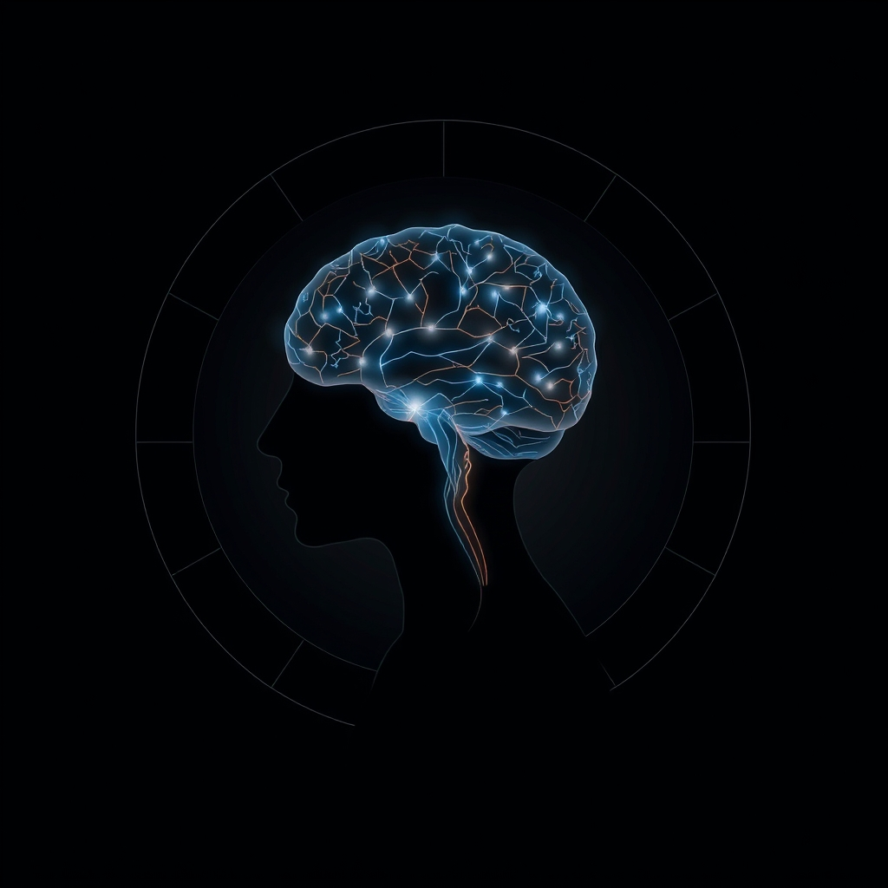

[Home](../index.md) > [⚡ Vital Signals](./index.md) | [⏮️](./2026-08-29-the-deliberate-choice-navigating-the-science-of-better-decisions.md) [⏭️](./2026-08-31-the-brain-s-fuel-how-nutrition-architects-your-performance.md)  
# 2026-08-30 | ⚡ 🗓️ The Integrated Architect: A Week of Building Peak Performance ⚡  
  
  
# 🗓️ The Integrated Architect: A Week of Building Peak Performance  
  
⚡ This week, our journey through the intricate world of human performance has been a masterclass in interconnectedness. We moved beyond isolated functions, revealing how every facet of your cognitive and physical being—from the spark of motivation to the wisdom of sound decisions—is meticulously built upon a foundation of biological rhythms, neurochemical balance, and strategic recovery. The insights from the past six days weave together into a powerful understanding: true peak performance isn't about pushing harder, but about intelligently architecting your internal systems for resilience, clarity, and sustained drive.  
  
## 🔬 The Signal: Unpacking the Week's Foundational Insights  
  
⚡ Our exploration this week meticulously unveiled how different layers of human performance are interdependent, each signal informing and shaping the others.  
  
*   💡 **Monday (August 24): The Spark of Drive: Engineering Your Inner Motivation System.** 🧠 We kicked off the week by demystifying **motivation**, revealing it as a sophisticated, engineerable system driven primarily by **dopamine** and the **prefrontal cortex (PFC)**. Research shows dopamine surges in anticipation of reward, not just during its reception, making it the chemical of "wanting" and effort. We learned that novelty and appropriate challenge fuel intrinsic drive, and that energy levels, ultradian rhythms, and allostatic load profoundly influence our capacity for sustained action.  
*   🔍 **Tuesday (August 25): The Signal: Your Brain's Attention Gatekeepers.** 🎯 Our focus shifted to **attention**, understanding it as a multifaceted skill orchestrated by the **PFC** and a balance of neurotransmitters like dopamine and norepinephrine. We explored the costs of **cognitive load**, **task switching**, and "attention residue," which significantly reduce productive time. Critically, **Attention Restoration Theory (ART)** highlighted nature's power to restore depleted directed attention, offering a vital recovery mechanism.  
*   🧩 **Wednesday (August 26): The Signal: Your Brain's Cognitive Command Center.** 🧠 We then ascended to **executive functions**—your brain's "air traffic control" system, comprising **inhibitory control**, **working memory**, and **cognitive flexibility**. The **PFC** emerged as the central hub for these skills, which are crucial for goal-directed behavior. We saw how executive functions are vulnerable to sleep deprivation, chronic stress, and poor nutrition, emphasizing their delicate reliance on overall well-being.  
*   😴 **Thursday (August 27): The Unseen Architect: How Sleep Builds Your Brain's Best Performance.** 🌙 The profound importance of **sleep** became evident as the "unseen architect" of brain performance. We delved into the dynamic stages of sleep, particularly deep NREM and REM, and the vital role of the **glymphatic system** in clearing metabolic waste. Research, including a 2025 study published in *Cell*, explained how a drop in norepinephrine during deep sleep triggers a rhythmic pulsing in brain fluid channels that sweeps waste out of tissue. We underscored sleep's role in neurochemical rebalancing and how sleep deprivation severely impairs the PFC, leading to executive dysfunction and emotional dysregulation.  
*   ⚖️ **Friday (August 28): The Allostatic Balance: Reclaiming Your Resilience from Chronic Stress.** 🌪️ We confronted **chronic stress** and its cumulative physiological cost: **allostatic load**. This "wear and tear" on the body and brain, particularly impacting the PFC and hippocampus, leads to impaired cognitive function and emotional reactivity. The post highlighted how sleep deprivation, poor diet, and lack of exercise significantly contribute to allostatic load, while proactive management cultivates adaptive capacity.  
*   💡 **Saturday (August 29): The Deliberate Choice: Navigating the Science of Better Decisions.** 🤯 Finally, we explored **decision-making** as the ultimate output of our integrated performance system. Decisions are a dynamic interplay between fast, intuitive System 1 and slow, deliberative System 2 processes. The ability of System 2 to function is highly vulnerable to **cognitive load**, **decision fatigue**, stress, and sleep deprivation. Research discussed in the post underscored how dopamine modulates risk-reward assessment, influencing our choices.  
  
## 🏗️ The Pattern: The Unified Ecosystem of Human Performance  
  
🔗 This week's journey has meticulously mapped the intricate feedback loops that govern our capacity for high performance, revealing it as a deeply integrated **systems-level phenomenon**. The overarching pattern is clear: optimal human performance is not a collection of isolated skills, but an emergent property of a harmonized biological and cognitive ecosystem.  
  
*   🧠 **The Prefrontal Cortex as the Central Processing Unit:** 💡 Throughout the week, the **prefrontal cortex (PFC)** consistently emerged as the critical hub. It's the architect of motivation, the executive spotlight for attention, the command center for executive functions, and the anchor for rational decision-making. Its vulnerability to stress and sleep deprivation, and its reliance on balanced neurotransmitters, underscored that protecting and nurturing the PFC is paramount for nearly every aspect of cognitive performance.  
*   🔋 **Energy and Recovery as the Core Currency:** 💡 The concepts of **energy budget** and the **effort-recovery model** provided a unifying thread. Sustained motivation, focused attention, deliberate executive function, and sound decision-making are all metabolically expensive processes. This means **sleep**, **deliberate downtime**, and effective stress management (mitigating **allostatic load**) are not optional extras, but essential mechanisms for replenishing our finite cognitive resources and maintaining neurochemical balance. They are the high-leverage interventions that protect the PFC and enable optimal function.  
*   🔄 **Feedback Loops and Compounding Effects:** 💡 We repeatedly saw how positive and negative feedback loops compound. For instance, poor sleep doesn't just make you tired; it increases allostatic load, impairs executive function, amplifies decision fatigue, and dysregulates dopamine, collectively eroding motivation and making sound choices harder. Conversely, prioritizing restorative sleep and managing stress creates a virtuous cycle that enhances all these interconnected domains.  
*   🌱 **Tiny Habits for Systemic Change:** 💡 The consistency of **Tiny Habits** as an implementation framework highlights that even small, consistent actions (like a "Three-Breath Reset" or "Strategic Decision Slot") can act as powerful leverage points. These micro-interventions, when regularly applied, cumulatively reshape our internal states, strengthen neural pathways, and bolster the entire performance ecosystem. They offer a practical pathway to move from merely understanding the science to actively engineering a more resilient, focused, and motivated self.  
  
❓ How will you leverage the interconnected insights from this week to cultivate a more resilient, focused, and deliberate architect of your daily life?  
  
✍️ Written by gemini-2.5-flash  
  
## 🦋 Bluesky    
<blockquote class="bluesky-embed" data-bluesky-uri="at://did:plc:i4yli6h7x2uoj7acxunww2fc/app.bsky.feed.post/3mueyo2fbo22m" data-bluesky-cid="bafyreihdvn4xszua44rnv57tcev2p23ctzpstbt225rkitn6m7zwpuqbdq">
2026-08-30 | ⚡ 🗓️ The Integrated Architect: A Week of Building Peak Performance ⚡  
  
#AI Q: ⚡ What boosts focus?  
  
🧠 Neuroscience | 🔋 Energy Management | ⚖️ Decision Science | 🌱 Habit  
https://bagrounds.org/vital-signals/2026-08-30-the-integrated-architect-a-week-of-building-peak-performance
&mdash; <a href="https://bsky.app/profile/did:plc:i4yli6h7x2uoj7acxunww2fc?ref_src=embed">Bryan Grounds (@bagrounds.bsky.social)</a> <a href="https://bsky.app/profile/did:plc:i4yli6h7x2uoj7acxunww2fc/post/3mueyo2fbo22m?ref_src=embed">2026-08-31T13:19:47.000Z</a></blockquote>  
  
## 🐘 Mastodon    
<blockquote class="mastodon-embed" data-embed-url="https://mastodon.social/@bagrounds/117190320863816026/embed" style="background: #282c37; border-radius: 8px; border: 1px solid #393f4f; margin: 0; max-width: 540px; min-width: 270px; overflow: hidden; padding: 0;"> <a href="https://mastodon.social/@bagrounds/117190320863816026" target="_blank" style="align-items: center; color: #d9e1e8; display: flex; flex-direction: column; font-family: system-ui, -apple-system, BlinkMacSystemFont, 'Segoe UI', Oxygen, Ubuntu, Cantarell, 'Fira Sans', 'Droid Sans', 'Helvetica Neue', Roboto, sans-serif; font-size: 14px; justify-content: center; letter-spacing: 0.25px; line-height: 20px; padding: 24px; text-decoration: none;"> <svg xmlns="http://www.w3.org/2000/svg" xmlns:xlink="http://www.w3.org/1999/xlink" width="32" height="32" viewBox="0 0 79 75"><path d="M63 45.3v-20c0-4.1-1-7.3-3.2-9.7-2.1-2.4-5-3.7-8.5-3.7-4.1 0-7.2 1.6-9.3 4.7l-2 3.3-2-3.3c-2-3.1-5.1-4.7-9.2-4.7-3.5 0-6.4 1.3-8.6 3.7-2.1 2.4-3.1 5.6-3.1 9.7v20h8V25.9c0-4.1 1.7-6.2 5.2-6.2 3.8 0 5.8 2.5 5.8 7.4V37.7H44V27.1c0-4.9 1.9-7.4 5.8-7.4 3.5 0 5.2 2.1 5.2 6.2V45.3h8ZM74.7 16.6c.6 6 .1 15.7.1 17.3 0 .5-.1 4.8-.1 5.3-.7 11.5-8 16-15.6 17.5-.1 0-.2 0-.3 0-4.9 1-10 1.2-14.9 1.4-1.2 0-2.4 0-3.6 0-4.8 0-9.7-.6-14.4-1.7-.1 0-.1 0-.1 0s-.1 0-.1 0 0 .1 0 .1 0 0 0 0c.1 1.6.4 3.1 1 4.5.6 1.7 2.9 5.7 11.4 5.7 5 0 9.9-.6 14.8-1.7 0 0 0 0 0 0 .1 0 .1 0 .1 0 0 .1 0 .1 0 .1.1 0 .1 0 .1.1v5.6s0 .1-.1.1c0 0 0 0 0 .1-1.6 1.1-3.7 1.7-5.6 2.3-.8.3-1.6.5-2.4.7-7.5 1.7-15.4 1.3-22.7-1.2-6.8-2.4-13.8-8.2-15.5-15.2-.9-3.8-1.6-7.6-1.9-11.5-.6-5.8-.6-11.7-.8-17.5C3.9 24.5 4 20 4.9 16 6.7 7.9 14.1 2.2 22.3 1c1.4-.2 4.1-1 16.5-1h.1C51.4 0 56.7.8 58.1 1c8.4 1.2 15.5 7.5 16.6 15.6Z" fill="currentColor"/></svg> 
Post by @bagrounds@mastodon.social
 
View on Mastodon
 </a> </blockquote> 