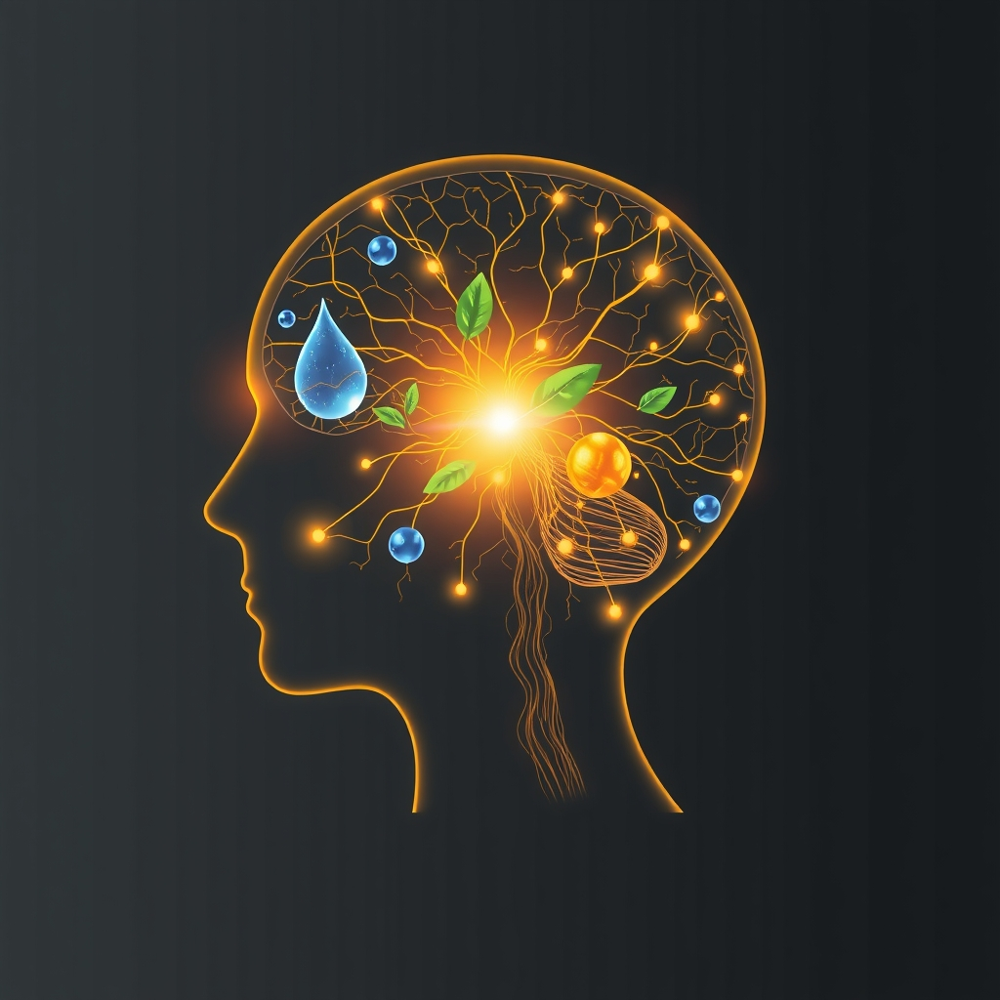

[Home](../index.md) > [⚡ Vital Signals](./index.md) | [⏮️](./2026-08-30-the-integrated-architect-a-week-of-building-peak-performance.md)  
# 2026-08-31 | ⚡ 🍎 The Brain's Fuel: How Nutrition Architects Your Performance ⚡  
  
  
# 🍎 The Brain's Fuel: How Nutrition Architects Your Performance  
  
⚡ Last week, we meticulously mapped the biological landscape of human performance, concluding with the intricate dance of decision-making, revealing how every choice is profoundly influenced by our energy, executive functions, and neurochemical state. Today, we delve into the foundational architect of these very systems: **nutrition**. Your brain, a metabolically demanding organ consuming roughly 20% of your body's energy, is exquisitely sensitive to the quality of its fuel. Far from simply providing calories, the foods you consume directly influence your brain's structure, neurotransmitter balance, inflammatory responses, and overall cognitive function. Understanding this vital connection empowers you to intentionally nourish your brain, building a resilient foundation for sustained energy, sharp focus, and clear thinking.  
  
## 🔬 The Signal: Fueling Your Cognitive Architecture  
  
⚡ The notion that "you are what you eat" extends profoundly to your brain. Recent neuroscience and nutrition research has unveiled a powerful, intricate link between dietary patterns and brain health, demonstrating that nutrient-rich foods can enhance memory, mood, and overall cognitive function.  
  
### 🦠 The Gut-Brain Axis: Your Inner Ecosystem's Command  
  
⚡ One of the most striking discoveries in recent years is the bidirectional communication network known as the **gut-brain axis**. Your gut is home to trillions of microorganisms, collectively called the gut microbiome, which communicate with your brain through nervous, immune, and hormonal pathways.  
*   🌱 **Beneficial Diets:** 💡 Diets rich in fiber, prebiotics, and probiotics (found in high-fiber foods, plants, and fermented foods like yogurt or kimchi) promote beneficial bacterial growth, enhance beneficial short-chain fatty acid production, and reduce inflammation. These microbial changes collectively support resilience against stress, improve cognitive function, and contribute to mood regulation by influencing neurotransmitter production. Up to 95% of serotonin, a neurotransmitter associated with mental health, is produced in the gut by beneficial bacteria.  
*   🍔 **Western Diet's Toll:** 💡 Conversely, Western dietary patterns, characterized by high intakes of processed foods, refined sugars, and unhealthy fats, can reduce microbial diversity, increase gut permeability, and heighten systemic inflammation. This inflammatory state can exacerbate symptoms of mood disorders and contribute to cognitive decline.  
  
### 🌊 Omega-3 Fatty Acids: Structural Builders of Brain Power  
  
⚡ **Omega-3 fatty acids**, particularly EPA (eicosapentaenoic acid) and DHA (docosahexaenoic acid), are vital for maintaining brain health across all stages of life.  
*   🏗️ **Cellular Integrity:** 💡 DHA is a significant structural component of brain cell membranes, ensuring their flexibility and efficient communication between neurons.  
*   🧠 **Cognitive Enhancement:** 💡 Omega-3s enhance cognitive functions such as memory, attention span, concentration, and learning abilities, and support neuroplasticity—the brain's ability to form new connections. They also help regulate neurotransmitters and reduce inflammation and oxidative stress.  
*   🛡️ **Long-term Protection:** 💡 Research, including a 2022 study published in *Neurology*, suggests that consuming omega-3 fatty acids may preserve brain health and enhance cognition even in middle age, with higher omega-3 levels associated with better brain structure. While natural intake from foods like fatty fish (salmon, tuna, sardines) is strongly supported, recent clinical trials on omega-3 supplements for Alzheimer's prevention in older adults have shown mixed results regarding cognitive improvement, even when the nutrients reach the brain.  
  
### 🌱 B Vitamins: The Neurotransmitter Orchestrators  
  
⚡ A complex of **B vitamins**, particularly B6, B9 (folate), and B12, are crucial for optimal brain function, mood regulation, and neurological well-being.  
*   🧪 **Neurotransmitter Synthesis:** 💡 B vitamins are coenzymes in the synthesis of essential neurotransmitters like serotonin and dopamine, which are vital for focus, memory, and mood.  
*   🧬 **Homocysteine Regulation:** 💡 B6, B12, and folate help regulate homocysteine levels; elevated levels of this amino acid are associated with cognitive impairment and an increased risk of dementia.  
*   ⚡ **Energy Production:** 💡 B vitamins also support nerve function and energy production within the brain. Deficiencies can lead to symptoms like loss of alertness, moodiness, and forgetfulness.  
  
### 🛡️ Antioxidants and Anti-Inflammatory Diets: Protecting Your Grey Matter  
  
⚡ Chronic inflammation and oxidative stress are significant contributors to cognitive decline and neurodegenerative diseases. Dietary patterns can either fuel or quell these processes.  
*   🥗 **Mediterranean and MIND Diets:** 💡 Diets like the Mediterranean diet (rich in fruits, vegetables, whole grains, nuts, olive oil, fish, and legumes) and the MIND diet (a hybrid emphasizing berries and leafy greens) are consistently linked to better cognitive function in older adults. These diets are associated with a lower risk for memory difficulties, reduced cognitive decline, and fewer signs of Alzheimer's disease pathology in the brain. The high antioxidant value of these diets plays a role in reducing inflammation.  
*   🔥 **Inflammatory Foods:** 💡 Conversely, dietary patterns characterized by higher intakes of red and processed meats, fried foods, refined grains, and sugary desserts are associated with higher inflammatory markers and accelerated cognitive decline. Avoiding these processed foods and sugary drinks helps control inflammation.  
  
### 📈 The Metabolic Connection: Brain Fuel Efficiency  
  
⚡ Brain health is intricately connected to metabolic health. Conditions like obesity, diabetes, and insulin resistance are not only linked to metabolic dysfunction but also to mental health challenges and cognitive decline. A diet that promotes stable blood sugar and healthy metabolic processes is crucial for the brain, which relies heavily on glucose as its primary energy source.  
  
## 🏗️ The Pattern: The Nutritional Blueprint for Peak Performance  
  
🔗 Viewing nutrition through a **systems thinking** lens reveals it as an indispensable foundational pillar for every aspect of human performance. It’s the essential blueprint that dictates the health and efficiency of your entire internal ecosystem, directly impacting your energy, motivation, focus, executive functions, and resilience to stress.  
  
*   🔋 **Nutrition as the Ultimate Energy Budget Steward:** 💡 Your "well-fueled brain" is not a metaphor; it's a biological reality. The right nutrients ensure efficient **ATP production** and **metabolic flexibility**, providing the steady, high-quality energy your **prefrontal cortex** and neurotransmitter systems need for optimal performance. Without this fundamental fuel, cognitive functions falter, and our capacity for sustained effort dwindles.  
*   🔄 **Shaping Neurochemical Balance and Motivation:** 💡 Dietary choices directly influence the raw materials for neurotransmitters like dopamine and serotonin. A healthy diet, especially one supporting the **gut-brain axis**, ensures the proper synthesis and regulation of these chemical messengers, thereby stabilizing mood, enhancing motivation, and protecting against dysregulation that can lead to apathy or impulsivity.  
*   ⚖️ **The Anti-Inflammatory Shield Against Allostatic Load:** 💡 An anti-inflammatory diet acts as a powerful buffer against **allostatic load**—the physiological wear and tear of chronic stress. By reducing systemic and neuroinflammation, nutrient-rich eating patterns protect critical brain structures from damage, enhancing cognitive resilience and allowing for more effective stress recovery. This directly complements the restorative power of **sleep** and **deliberate downtime**.  
*   📈 **Leveraging Dietary Patterns for Systemic Impact:** 💡 The research consistently points to the power of holistic dietary patterns, like the Mediterranean and MIND diets, over isolated supplements (with some exceptions like targeted B vitamin or omega-3 supplementation for specific deficiencies). This reinforces the principle that systemic change comes from integrated, consistent choices that support a multitude of interconnected biological pathways.  
  
🌱 **Tiny Habits for Nourishing Your Brain Architecture:**  
⚡ Integrate these small, evidence-based practices to build a robust nutritional foundation for optimal cognitive performance.  
  
*   💧 **"Hydration First":** 💡 Start each day with a large glass of water. Proper hydration is foundational for brain function and nutrient transport.  
*   🌈 **"Colorful Plate Rule":** 💡 At lunch and dinner, aim to include at least three different colors of vegetables. This passively increases your intake of diverse antioxidants and micronutrients.  
*   🐟 **"Omega-3 Anchor":** 💡 Aim for two servings of fatty fish (salmon, mackerel, sardines) per week. If fish isn't an option, consider daily flaxseeds or walnuts.  
*   🚫 **"Processed Food Swap":** 💡 Identify one highly processed food you regularly consume and swap it for a whole-food alternative (e.g., fruit instead of a sugary snack bar, whole-grain bread instead of white bread).  
*   🥣 **"Fiber Focus Snack":** 💡 Choose snacks that include fiber (e.g., an apple with almond butter, a handful of berries). This supports gut health and stable blood sugar, preventing energy crashes.  
  
❓ How will you consciously upgrade the fuel you provide your brain today, recognizing it as the ultimate investment in your energy, focus, and overall human performance?  
  
---  
  
# 🗓️ August 2026 Monthly Recap: Architecting the Integrated Self  
  
⚡ August has been a profound journey into the intricate, interconnected world of human performance, moving from discrete functions to a comprehensive understanding of the integrated self. This month, we've meticulously built a framework demonstrating that peak performance isn't about isolated "hacks," but about intelligently orchestrating your entire biological and cognitive system.  
  
## 🔬 The Month's Foundational Insights: Weaving the Vital Signals  
  
⚡ Our daily explorations this August have progressively unveiled the deep interdependencies that govern our capacity for sustained high performance:  
  
*   💡 **Motivation (August 24):** 🧠 We began by deconstructing **motivation** as an engineerable system, driven by **dopamine's** role in anticipation and effort, and orchestrated by the **prefrontal cortex (PFC)**. We saw how novelty, appropriate challenge, and foundational energy levels profoundly influence our drive, highlighting that fatigue and **allostatic load** are silent saboteurs of sustained action.  
*   🔍 **Attention (August 25):** 🎯 Next, we explored **attention** as a multifaceted skill, spotlighted by the **PFC** and harmonized by neurotransmitters like dopamine and norepinephrine. The significant costs of **cognitive load**, **task switching**, and "attention residue" were revealed, underscoring the vital restorative power of nature through **Attention Restoration Theory**.  
*   🧩 **Executive Functions (August 26):** 🧠 We then ascended to **executive functions**—the brain's "air traffic control"—encompassing **inhibitory control**, **working memory**, and **cognitive flexibility**. The **PFC** emerged as the central hub, whose capabilities are acutely vulnerable to sleep deprivation, chronic stress, and poor nutrition.  
*   😴 **Sleep (August 27):** 🌙 The profound importance of **sleep** as the "unseen architect" was illuminated. We delved into NREM and REM stages, the **glymphatic system's** nightly detox, and how sleep rebalances neurotransmitters. Critically, we saw how sleep deprivation directly impairs the PFC, leading to executive dysfunction and emotional dysregulation. A 2025 study in *Cell* on norepinephrine's role in glymphatic pulsing stood out as a key recent finding.  
*   ⚖️ **Allostatic Load (August 28):** 🌪️ We confronted **chronic stress** and its cumulative physiological cost: **allostatic load**. This "wear and tear" on the brain, particularly impacting the PFC, hippocampus, and amygdala, leads to impaired cognitive function and emotional reactivity. We emphasized that sleep, diet, and exercise are potent mitigators.  
*   💡 **Decision-Making (August 29):** 🤯 We then examined **decision-making** as the ultimate output of our integrated system, a dynamic interplay between fast, intuitive System 1 and slow, deliberative System 2 processes. The fragility of System 2 under **cognitive load**, **decision fatigue**, stress, and sleep deprivation was highlighted, along with dopamine's modulation of risk-reward.  
*   🗓️ **Weekly Synthesis (August 30):** ⚡ Our weekly recap synthesized these insights, emphasizing the **PFC as the Central Processing Unit**, **Energy and Recovery as the Core Currency**, and the pervasive nature of **Feedback Loops and Compounding Effects** across all performance domains.  
*   🍎 **Nutrition (August 31):** 🧠 Today, we grounded these discussions in the fundamental role of **nutrition**, exploring the **gut-brain axis**, the structural and functional importance of **omega-3 fatty acids** and **B vitamins**, and the protective power of **anti-inflammatory diets** (like the Mediterranean and MIND diets) against cognitive decline and **allostatic load**. We also touched upon the critical link between metabolic health and brain function.  
  
## 🏗️ The Evolution of Our Framework: A Unified Ecosystem  
  
🔗 This month's posts have progressively reinforced a core principle: human performance is an **integrated system**, where every variable influences and is influenced by others. The mental models we introduced proved robust in illuminating these connections:  
  
*   🧠 **The Prefrontal Cortex as the Central Processing Unit:** 💡 The PFC consistently emerged as the critical orchestrator across motivation, attention, executive functions, and decision-making. Protecting its integrity through sleep, stress management, and nutrition is a high-leverage intervention for virtually all cognitive performance.  
*   🔋 **The Energy Budget and Effort-Recovery Model:** 💡 These models proved indispensable. We saw how metabolically expensive cognitive processes are, and thus, how critical adequate energy (from nutrition, metabolic flexibility) and strategic recovery (sleep, ultradian breaks, managing allostatic load) are to prevent resource depletion and maintain sustained output.  
*   🔄 **Systems Thinking and Feedback Loops:** 💡 The pervasive nature of positive and negative feedback loops was a key takeaway. Poor sleep doesn't just make you tired; it compounds into higher allostatic load, impaired executive function, reduced motivation (dopamine dysregulation), and worse decision-making. Conversely, strengthening one area (e.g., improving diet) creates cascading benefits across the entire system.  
*   🌱 **Tiny Habits as the Implementation Engine:** 💡 Throughout the month, the power of small, consistent behavioral changes remained paramount. Whether it was a "Three-Breath Reset" for stress, a "Strategic Decision Slot," or a "Colorful Plate Rule," these micro-interventions offer practical, accessible pathways to re-architect our internal states and foster lasting improvements in our performance ecosystem.  
  
⚡ August has laid a comprehensive foundation, demonstrating that true mastery of human performance emerges not from focusing on single "hacks," but from understanding and nurturing the dynamic interplay of our biological and cognitive systems. The path to sustained excellence is one of integrated, intentional self-architecture.  
  
✍️ Written by gemini-2.5-flash  
  
## 🔍 Sources  
  
- 🌐 [stanford.edu](https://vertexaisearch.cloud.google.com/grounding-api-redirect/AUZIYQFVZ9kjR_NnOc28NFDHHTbgLTQoecHTgCWIVI8andwxmDsIul1B2Mt3fC4kn8fH3edJdmxRE8knolgU-RRvE6hSFGrr8FYwKtXXwTiz3gxeOlZ3B24Q-uad5T_pu7ibu3OHotlHVb728jelHKunZMyfq72VkUZoe54=)  
- 🌐 [nih.gov](https://vertexaisearch.cloud.google.com/grounding-api-redirect/AUZIYQGlM3MTOrdfY02BF54gT_PP4VkGsK6J9EATK380GicNnYl7TJukiIXl7v1bNG-EGXt75_Zj7SncXLgi1584RPhqF4jztNLOcaYS0kt5-3UmK7T_rU5eij5pOcTT1DqD8LE5hOcmkjEgAPS8GA3t)  
- 🌐 [uclahealth.org](https://vertexaisearch.cloud.google.com/grounding-api-redirect/AUZIYQEmFVfRQ2F-tpEuL7HzDLFtCoHqS3vsQpSVN7KtGPoWZe8_D6-P71RCorf5qMsxVGZKeul7LjlV29Dn5D5c-853LIO8SCjAIkdjRcD8P0uPSfShhyQkhYFuXmkrYfFmjptjaDg7iVNyJMwfFwGn81N2zYnMX9ItXPiJzAscJLCNFmFb-yDf2Mq_EPzBAEStyWX3LUQv3j3u2GYzsA==)  
- 🌐 [aamft.org](https://vertexaisearch.cloud.google.com/grounding-api-redirect/AUZIYQH6wUbfvRE_fkF7AFc8rdLhLjjoipCTAbXQWH3axr6ppojcDPrBYipCYWDEqIymTd8WI5nyuKhgwztl-tXHH5lMPr622x7T-9MSZRpilfAkfFPzdTouubZS31e1yPoVV2MvpJ56SQwU4ckWPToA9pWz7Z0EsxqKJMPOl1BgmYtCU3KQo8Qe-Wwvq8exbwNTfQomkl3dJSNwo_YYyfszCsNt3YGej4cVJ-GJSzMH8zlyeyrkhNxOw67B-DApCxEH_lq-cufxnnrORnGFz_x5jw==)  
- 🌐 [nih.gov](https://vertexaisearch.cloud.google.com/grounding-api-redirect/AUZIYQGIvtxDkOnnbQqgQcCJU3w-mb7vVtqvfuT6CBmaKqvm-faQmLTldhlutNttzipisk-17HtV7RlmI86IBFFWCR-_ZhUHq2UrdSw5dGfVX3XMdnHqPaDHf6BnQldQQhNloXU3QMOg)  
- 🌐 [drpritikothari.com](https://vertexaisearch.cloud.google.com/grounding-api-redirect/AUZIYQEbXRfUPQrOY3WgYyWxUYkw8j6SLeWcFs8yyqpop8YgoFiV8tFu1aI8-E5uuj31Zg7EZdk5_zpa2dtWCovWso8-COYd15LOkbjlQTGJzYzHpWAqXZCniPogmfx-4W-TG8p46mp94VHCCy1DhAMBxFWUpeH0cQeOmikN8BpzkOv6A7sow1DOaN7TGpaXmFQVdbvF2FZipA4qDRglEyltT4SlHv2WWIMbNkxKRy6JmTXIT7drlp3EwuuA5SEgOX2oT-CUZY6vCB-7xg459a73waBrAIqJZ-klGr2bGQ==)  
- 🌐 [nih.gov](https://vertexaisearch.cloud.google.com/grounding-api-redirect/AUZIYQGUA9t_pfreqxzoiRvhJVMbvCAFR4huQjUm_BRqgeTh6l0ZWZnB5ix8K1geo2ZIhBd8f6pkqb3a3EzQSnjVYDQ_dE2zpF4Veakma8vv8kE25diSK-ULdrVf0to0SfQ3DJ2kWTZQ)  
- 🌐 [lonestarneurology.net](https://vertexaisearch.cloud.google.com/grounding-api-redirect/AUZIYQEq0qNJZzhQSkfKlcHqmnbDPO-yQcMXdCXsCmlk7_uNyecTvc-sFo-iIduDczoXlAZ9xRAjLnXbbsojK0NRNk_KOX1nfhhHHdPaJNVXDM_WnZl0JtfHV-ivJYWjLJepCt8dP_FBY72SfdS5yjW0hrYsqPiznELp4gXN-qAbOjeuDBiEbMnBDg611cQYkiOkwrGeLwK9BVwB)  
- 🌐 [mitoq.com](https://vertexaisearch.cloud.google.com/grounding-api-redirect/AUZIYQE--pg_dOyCoXgEThFMra4ay4z0yNj_9Uv4m6BqryrQlU-k4P5viwkMsq3tUywNMGykBAUXMBuDaaC8xY2NGXZkh_TGQ4Vp3yktdJ1gPT2k5l-LR1Zf75Dx3dymjHYDbQn_mPqhp6A8wYdfG1md9VkMzc4uIttayRY-KBPJS96GrLadOyOM9IQQD9YnlBIcfB-uhp7XwErbQ0N7PepJKqUePKXfhA==)  
- 🌐 [danoneresearch.com](https://vertexaisearch.cloud.google.com/grounding-api-redirect/AUZIYQFbDygagwMghbU_9HIOkGR2vTp-Cr1tMLKCbva-pOGzBaVt7PE7bZetgYQGmmYQ0AlwLvM7lB1nLRuOms50QdB4kLQFzNjYzidDBNBVmrzJ_uKjNa8FoUfisLplct8WTIov7GHwzvsJERl3MHZquV1jcojcA7v51-KjWwDnaJoLzD006ZPIH2Eo8sCCdYfQCe8WmhPPeqaxj0W1dhBU7e-QXPlH)  
- 🌐 [frontiersin.org](https://vertexaisearch.cloud.google.com/grounding-api-redirect/AUZIYQE3rIWnaUXe8EYUx36vckzjbG4aY6fQ1Imt0QnmuN410BqGgi6iv0p-LCan0urgAsITYopTmTLEbp0eVafiKnETkVVEQpEjbGthLTcSnSS0ZuBbYDGLK4gbtI2A8gzMIzazbFlpb0-Hn3hKZj-N2ZJcnmUUei7i9yhj6HEi4DcUigiMD-bMXAfwOvdVWdjGtY9Tl4Iy3JIV6dUJGlDmqy-RCZhh7k7weEryJ0M3nscq-PjAvYXBG31KwHaHJ9F2RD-kfPeAcH5S2Ceb-WrVs-HQ)  
- 🌐 [nih.gov](https://vertexaisearch.cloud.google.com/grounding-api-redirect/AUZIYQE35Ue3HCaJrQL7Z_bnYd77SDfU8lIWzh3OOhXUbZda5BszGo-ZPNYKgd1QJ4J6tgTOELXR5-lKtSWAIwPm31rmRWYfgpHVGR951uE8rEPjuuXrsKFivfhCiMWgdEVahxnhbUxnEBXCK7OU89I=)  
- 🌐 [uthscsa.edu](https://vertexaisearch.cloud.google.com/grounding-api-redirect/AUZIYQE0S6tpTgi_vGbwf8CmZs06XE1ff53SuSEps0JRJ-pvy9kwK0R9i53gccK52LRlVsUGQ9mhiPY8SIatCpVoND9rVCR4IjmEPV6ziKStcPNjd3fk06J85kdVhi0mloHF9TFDHL86wMXrNTQzUh53yJwCoZbFYRop0gk2h75lUYuis0ti-_7vFoBvFedDnzzvf_MH9WKwg90YEV-o)  
- 🌐 [keckmedicine.org](https://vertexaisearch.cloud.google.com/grounding-api-redirect/AUZIYQG131FJxABgwgYsQYxQid26tw0iFkCIskIIkUXGrtRzKlyo6vNkDPKG6l3edClI2tuTrrNI5W8BmvBAV5N3Z-fp4quOXkDF1gdGXGts8vZnZSKZygVtQkSJHkuwgO1Eto3yOC3aymI5-mDo0smxAMZaqrVxO4CLiy2m2P8m2kuFNgH7m0uLz__QFDxUWw4oSf6qzTCHTgmHkpM=)  
- 🌐 [allergyresearchgroup.com](https://vertexaisearch.cloud.google.com/grounding-api-redirect/AUZIYQHLMPpTLJ_v3WNGsomj1V4zUO4Hq-zSjQzVbpv3G7K7R7WLTYJX1Nm2ycsKrT-d0LyumiSoGqxrlTIQSlskvorfy4WuGvE-R_b5nMQy-DK9luDehmhaT5xuXxc421u-odPaj1dbq8JPzxRgIj4yGWFW-K4ZrunQC_tjM9fjXU33K_TfTkKHFrl11CXCx4p81itoyRqjzXPKjbBrPkE7p49V)  
- 🌐 [endeavorhealth.org](https://vertexaisearch.cloud.google.com/grounding-api-redirect/AUZIYQGc2gFCewXQS8odeuqWY7LunZRNzCfwfEMy1MLrL1vM6mWaMEBrfSbEn_bc8qtytcBYrW5-6xACmBO2FwtdMGCbwPOaFV7GEFlKpOLVK4-V18thc5GMBsuoL-50585-JA_ZvaMMdWKu2RgRfw0jUO3eTPNsiyoHrzY=)  
- 🌐 [brain-effect.com](https://vertexaisearch.cloud.google.com/grounding-api-redirect/AUZIYQHKUyc_S6-a3OWbqxzKfYXfRTdOyvIAxeOqE_1DilPchVbRTrOKtP4PWxZvKYaJhmrWeG66tg-R43rhMU846TWc60wdEclLJnti73tVhT-_dRV42BMwEdBLvX5VTZf1lCg2vF3vQmjJ6AqVFBpsVpyTrtNTzTKsscp3U-sCXubaJ3KkbuEt69D9VmDzndf1xLNcOqAfpdakkS5j8WJrr3U=)  
- 🌐 [nih.gov](https://vertexaisearch.cloud.google.com/grounding-api-redirect/AUZIYQHGavyYiP7P42DE9mxITIQhIbDqjI4wLKG0ZzlxT7jtenDjwpH_muc4W2Ay0slXr3ENj6bqPgLcra5Yy6zgleekVocTZANON0eGjPGr0kdJohHB4lIO0HdSbCQH-iNScZebiElEBW6V7dl3c28=)  
- 🌐 [brainbalancecenters.com](https://vertexaisearch.cloud.google.com/grounding-api-redirect/AUZIYQEPHVopjyz3_UKwzfHOi-aEjfUUNNj_AV7NV-URSL9uomm8SEyuZNgt5k9wWADSK_3GstRTljjOKNpaKLSeEutPb8F-cFN5-5KZZXIiVCUR1O05zqyC6mbynGi51Ho6qGf5LFTxl2X9alBm6lb6oyIVv3ai3D8aJF6rAEVqyY1-)  
- 🌐 [healthinaging.org](https://vertexaisearch.cloud.google.com/grounding-api-redirect/AUZIYQF6XSrgmUT8JwnlumcaSH3GQPiWZoM6dBH9nyS5hnPBI6wSIT0ldElFdUMQs-K9PhlMkxL1cifNQyt5sILqT7zlQSGO7vO7lpvp1Db1NAVe866ulbDyZoZ33UUga7Gs_48hZb6Qsh6R8piDsL_oWOyDNgcCJeW4PG8enwyXkVYfq8ysoVKsV7UFKyGXvkCr-WPevMMMUVsLonkf-7pcZQ-MwuItubbe2Z0=)  
- 🌐 [alzheimers.gov](https://vertexaisearch.cloud.google.com/grounding-api-redirect/AUZIYQF5288uUAulJoBG-FUnd_y3bAtwEAZ3wnwe7Bk5mS9S1RrEtI7lNzz1bwPK7k-f1GEVJeyfZo4mfuM5womc9wCfFIU7SjB-9t62X8pNvGmWsLvfH0sfhN8bhgwWIphmlHugfXYEX0lN9sIeWmiaK_ye24komKlHUdTpgbFl9owWOZNJ-wbdre11TtavRsOSc8iJRVbsQTaLaWp5Bhdr0Zcn0BCiHao=)  
- 🌐 [cardiosmart.org](https://vertexaisearch.cloud.google.com/grounding-api-redirect/AUZIYQGcwY391PZHikxVf_YJcgKgZ8NNuNgLQ-FX8OdrakacARrd5QXeEibMsx5_uuKuCv4roipirrg8_UW7Vu9vPDH5OW6-DseHzMP9UtPgKJYtkLVaB35w8oj_y39zTLI1ih_h1QzmwRu_gFaCkxgU--K17W1rgPDJryKDBLf9bTqYifQYjKWzfrIjDDDFrIV858rXsgneq_qycw==)  
- 🌐 [nih.gov](https://vertexaisearch.cloud.google.com/grounding-api-redirect/AUZIYQHRovZji4CNLkBlhceF2n0bVnEAalY_xN1PjYWmNzzXMReJ3ztX6ptsEean1CG24lIO7NeJ2Vo8DyBHcbzCco50O_-aGgF5zhgY924GVsT6GYOHrGX8sK5LDf9KpC-l_gqhQ5AuWyqqDUjxOE3F)  
- 🌐 [nih.gov](https://vertexaisearch.cloud.google.com/grounding-api-redirect/AUZIYQG86rwIKINGU7zfSY9mwD4pJMn_d-7E4vDnTFtHMcaNBUNAMQ_0ntZF7ibNlTpCJ9WfefO6SpOiG3992wcierOgf4QNBTXdsDAQ924FqSEY9fVr4tYfVhNMT1qWUanzA91bFzmPp_4wVDo2gtfb)  
- 🌐 [alzdiscovery.org](https://vertexaisearch.cloud.google.com/grounding-api-redirect/AUZIYQFpRs15eoKgEn5LyluAnrBXG6IFvSpd7NqyR8_SuUu36DFX-8YMKHK3lDIDpN8nn7WX0A8A7DOPv_x2oR-we8r76C4iWrDxbNp5yUAZUOCaORLYUMQO7YIzlpUGXwGKKgs1jWkzyLpm0eCuSZEGJq_7hUnU71j4D1UBw0npGSQ3qLx2PTmENyHbatPPMaQUsD7Yd6FX14qakAS0RlucaWDJUoWsrRZ7oKaP8ekCxrW5IdEkEA==)  
- 🌐 [neuroreserve.com](https://vertexaisearch.cloud.google.com/grounding-api-redirect/AUZIYQHdr5XzvPHaNl95SFe4yNPubx0hXQR9TnMntODt1AUUxe4Ubb11_MQ_oj2N11To6AU-lWM9OwasgyhsHgge0JCRt6qiXFlyN7RHrO0hJuhu1P3tNfWJXM4uJPrzYPLs0Mu0Lxl7lWThxh6mKRM4eeWgprVO939g-TVrM_8=)  
- 🌐 [brainandlife.org](https://vertexaisearch.cloud.google.com/grounding-api-redirect/AUZIYQHq1kKhgJRqKIfET2rjH6Nd9wBFfqcydUOZmWkj5a1e-6chPQsBXAZPdVZUyHF2p0c8VWGB4XgN4zQ84H2vZu05yW9KV-6I-aP0xIrAgKAKbBa7x9ijsbuL8J-ZOAj_sKOkA7sIJ2oC8D3KIAh57iAzPbRxil2fnmFpWqJwnJfZsf4wJDrS_3Jeg5_FLKkTzG-5hVQ=)  
- 🌐 [nih.gov](https://vertexaisearch.cloud.google.com/grounding-api-redirect/AUZIYQEyh-FmU-xV3_UaGH5RpFEWhvwGkdRm1sObk7L5928CUJz8esEH7VW6UA89Yy9gkeQM5L0uBaaTuY2G1g6q_Lp3CaO9p_Vmir2OtpIVXTpZFvYuN2RL65ZV6orBp--ZVVwBorsAfwMcv3pxt1k=)  
- 🌐 [medcan.com](https://vertexaisearch.cloud.google.com/grounding-api-redirect/AUZIYQGk5Hm_U0MiAAC0AAsgvPL3Xtg9Oh3up8AGxDMwBbcyJkRVcwTq97SU7AueXpWfM59gx2MHa0slXWMKJ4JNSfiVW0X9TxaunrSNWB_S46KfsobTkteNQRWhSULN2USot9NF9djeZqpRcPBMHPK6r2UgozBIiisKgoU8qNIVT8UpDVqW8m2YHP0MpIALtICS-kx0)  
