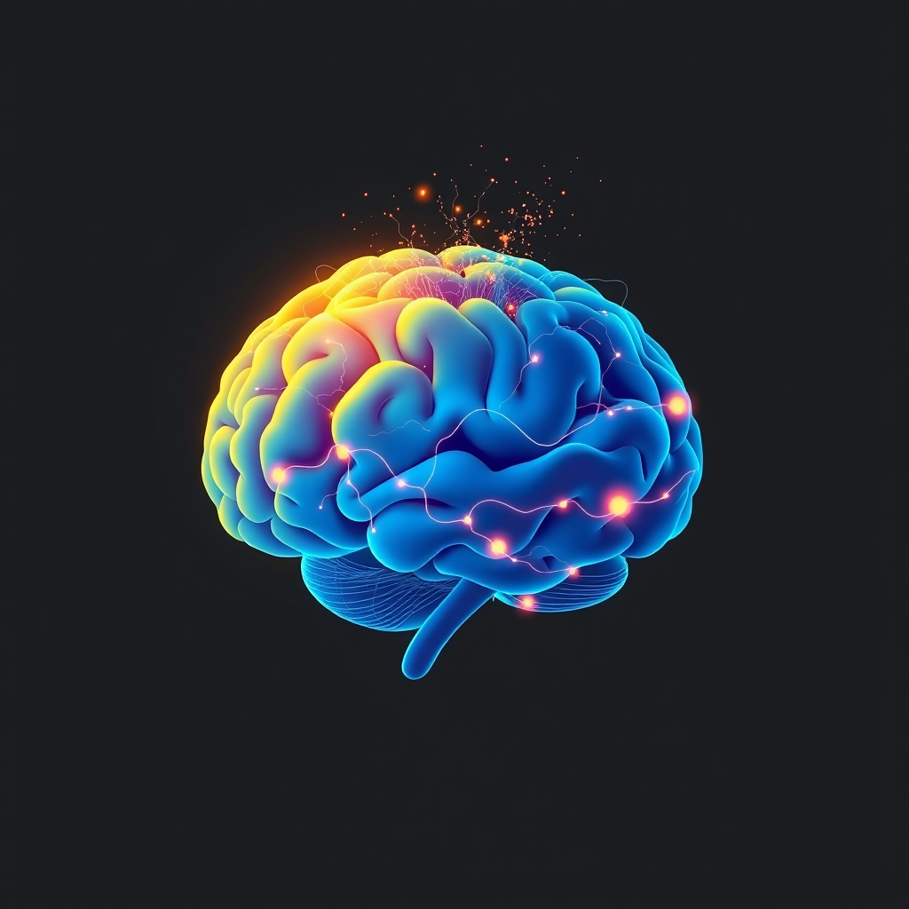

[Home](../index.md) > [⚡ Vital Signals](./index.md) | [⏮️](./2026-08-31-the-brain-s-fuel-how-nutrition-architects-your-performance.md) [⏭️](./2026-09-02-the-ebbing-tide-of-focus-mastering-your-ultradian-rhythms.md)  
# 2026-09-01 | ⚡ 🏃 The Moving Mind: How Exercise Rewires Your Brain ⚡  
  
  
# 🏃 The Moving Mind: How Exercise Rewires Your Brain  
  
⚡ Yesterday, we explored how **nutrition** serves as the foundational architect of your cognitive systems, directly influencing everything from neurotransmitter balance to gut health. Today, we shift our focus to another equally potent, yet often underutilized, architect of human performance: **exercise**. Far beyond its well-known physical benefits, regular movement is a powerful neurobiological intervention that profoundly rewires your brain, enhancing its structure, chemistry, and resilience. Understanding that your brain is designed for movement, not stillness, empowers you to leverage exercise as a direct pathway to sustained energy, sharper focus, elevated mood, and robust cognitive function.  
  
## 🔬 The Signal: Fueling Your Cognitive Architecture Through Movement  
  
⚡ The idea that a healthy body leads to a healthy mind is ancient wisdom, but modern neuroscience is now revealing the precise, mechanistic ways in which physical activity directly transforms brain health and cognitive performance.  
  
### 🧠 Neurogenesis and Brain Volume: Building a Better Brain  
  
⚡ Exercise isn't just about preserving existing brain cells; it actively promotes the growth of new ones, a process known as **neurogenesis**.  
*   🌱 **Hippocampal Growth:** 💡 Studies have consistently shown that exercise training enhances cell proliferation in the dentate gyrus region of the hippocampus, a brain area critical for learning and memory. This is particularly true for aerobic exercise. Research indicates that physical activity not only stimulates neurogenesis but also facilitates the integration of these newly formed neurons into existing neural circuits, enhancing synaptic plasticity.  
*   📈 **Reversing Age-Related Decline:** 💡 A randomized controlled trial with older adults found that one year of aerobic exercise increased hippocampal volume by 2%, effectively reversing one to two years of age-related loss in volume. This increased volume was associated with improved spatial memory. Even in aged mice, voluntary exercise improved learning and neurogenesis in the hippocampus.  
  
### ✨ BDNF: The Brain's "Miracle-Gro"  
  
⚡ **Brain-Derived Neurotrophic Factor (BDNF)** is often called "Miracle-Gro for the brain" due to its crucial role in neuroplasticity, the brain's ability to adapt and form new connections.  
*   💪 **Enhanced Plasticity:** 💡 Exercise, especially aerobic and high-intensity interval training (HIIT), increases BDNF levels in the brain, which in turn promotes neurogenesis, synaptogenesis (formation of new synapses), and memory consolidation. This neurotrophic factor is vital for the survival and growth of neurons and is linked to reduced cognitive decline.  
*   💡 **Cognitive Benefits:** 💡 Increased BDNF levels in the hippocampus correlate with improvements in memory and overall cognitive abilities in humans and animal models. Regular, long-term exercise regimens lead to more sustained increases in BDNF than acute bouts of activity. A 2026 initiative at the Salk Institute highlights BDNF as a key mechanism by which exercise boosts learning, memory, and new neuron growth.  
  
### 🧪 Neurotransmitter Orchestration: A Symphony of Well-being  
  
⚡ Physical activity profoundly influences the balance of key neurotransmitters, directly impacting mood, motivation, and cognitive function.  
*   ✨ **Dopamine, Serotonin, and Norepinephrine:** 💡 Exercise stimulates the release of these critical neurotransmitters. Dopamine, central to motivation and reward, creates a reinforcing cycle, making exercise feel pleasurable and encouraging continued engagement. Serotonin stabilizes mood, while norepinephrine enhances alertness and focus. This regulation helps combat symptoms of depression and anxiety.  
  
### 🛡️ Anti-Inflammatory Shield and Metabolic Optimization  
  
⚡ Exercise acts as a powerful protector against systemic and neuroinflammation, while also optimizing metabolic health.  
*   🔥 **Reducing Inflammation:** 💡 Regular physical exercise exerts neuroprotective effects by modulating neuroinflammatory pathways, strengthening the blood-brain barrier, and reducing both systemic and gut-derived inflammation. A 2025 review published in *Frontiers* highlighted how exercise regulates the activity of microglia (the brain's immune cells) and astrocytes, reducing inflammation-induced neuronal injury. A study published in *The Journal of Neuroscience* suggests that physical activity alters the activity of the brain's immune cells, lowering inflammation even when early signs of conditions like Alzheimer's are present.  
*   📊 **Stable Blood Sugar:** 💡 Exercise improves metabolic flexibility and glucose utilization, which is crucial for the brain, a metabolically demanding organ that relies heavily on glucose for energy. Maintaining healthy blood sugar levels through physical activity can significantly slow cognitive decline, as noted in a 2026 study from UT Health San Antonio.  
  
## 🏗️ The Pattern: Movement as a Master Regulator  
  
🔗 Viewing exercise through a **systems thinking** lens reveals it as a master regulator of human performance, influencing and optimizing nearly every internal system. It's not merely an activity; it's a foundational biological requirement that profoundly shapes your energy, motivation, focus, and resilience.  
  
*   🔋 **Movement as the Ultimate Energy Multiplier:** 💡 Exercise directly improves mitochondrial efficiency and **metabolic flexibility**, enhancing your body's ability to generate and utilize **ATP**. This means a more stable and abundant energy supply for your brain, preventing cognitive fatigue and supporting sustained mental effort. It directly complements the **energy budget model** by increasing overall capacity.  
*   🧠 **Rewiring for Resilience and Executive Command:** 💡 By promoting neurogenesis, increasing BDNF, and balancing neurotransmitters, exercise directly fortifies the **prefrontal cortex** and hippocampus. This translates to enhanced **executive functions**, including working memory, inhibitory control, and cognitive flexibility. A 2023 study found that mild exercise in older adults improved executive function by increasing the efficiency of the prefrontal cortex.  
*   ⚖️ **The Anti-Stress Antidote to Allostatic Load:** 💡 Regular physical activity is one of the most effective tools for reducing **allostatic load**—the cumulative wear and tear from chronic stress. It recalibrates the HPA axis, reduces stress hormones, and improves inflammatory markers, building a more resilient stress response and protecting the brain from long-term damage.  
*   🔄 **Cascading Benefits Across the Ecosystem:** 💡 The impact of exercise is systemic. Improved cardiovascular health from movement enhances blood flow to the brain, directly supporting its function. Furthermore, exercise improves sleep quality, which in turn enhances cognitive function, particularly for those with poor sleep, as noted in a 2024 review in *ACSM*. This highlights the powerful **feedback loops** that connect physical activity to virtually every aspect of your performance ecosystem.  
  
🌱 **Tiny Habits for Integrating Movement into Your Day:**  
⚡ Integrate these small, evidence-based practices to make exercise a non-negotiable part of your brain's architecture.  
  
*   🚶‍♀️ **"Movement Snack":** 💡 Take a 5-10 minute brisk walk every 60-90 minutes during your workday. This breaks up sedentary time, boosts blood flow to the brain, and can improve focus.  
*   🗓️ **"Workout Anchor":** 💡 Link a short burst of exercise to an existing daily habit. For example, do 10 squats after brushing your teeth or 5 minutes of stretching before your morning coffee.  
*   📈 **"Stair Challenge":** 💡 Whenever possible, choose stairs over elevators or escalators. Even small increases in daily activity add up over time.  
*   💃 **"Active Break Playlist":** 💡 Create a short playlist (3-5 songs) of upbeat music and use it for an impromptu dance party or quick movement break when energy dips.  
*   ☀️ **"Outdoor Movement":** 💡 Aim to get at least 20-30 minutes of moderate-intensity activity outdoors daily. Natural light exposure combined with movement amplifies mood and cognitive benefits.  
  
❓ How will you intentionally move your body today to directly invest in the clarity, energy, and resilience of your mind?  
  
---  
  
✍️ Written by gemini-2.5-flash  
  
## 🔍 Sources  
  
- 🌐 [frontiersin.org](https://vertexaisearch.cloud.google.com/grounding-api-redirect/AUZIYQFNs8FH0_FiZ5_l8q-3B9hzAk4CwgYL41kBtRL6n3OsbBCBZljWjr3Quiypr0uR3crsMJwWEugk2vWeL0xriY0yuliAP47tjTrzXsNaNPlkTxSpzEBL4EZhAUW6TSw_UfEdu_pFg0xXSArxrzDZUo10l59GkMivhrvud4sTUVOFi45ouF8X-GDmYAzdxUNPzVgLi2YiyeVCmT0j7p2nwHj7nA==)  
- 🌐 [nih.gov](https://vertexaisearch.cloud.google.com/grounding-api-redirect/AUZIYQG27CUR_qeUTf3Qn8GEiYWWiIwMPegNdCaPlk4UZBvmBiceM7msyiVelLEDUkAiMrfR5tTKJXMvNfoxyc2xaKpMlQSPuZL5QR_4LoPnqkLkzdlfqP-Tj_qtEswHW5HH9ALBnHz7j3FjoLhfCfU=)  
- 🌐 [nih.gov](https://vertexaisearch.cloud.google.com/grounding-api-redirect/AUZIYQHdabcaEbObCY4FTnHV-7GVaAoIPNesZOcoylQGmwpbPpKIMcarQpNoT_3Zlzzih0lYZqgCUGq-TuJ8r1R_Wg72tCIeBtj4rIahDnCaoVPVk7CdI1hsTIUeH01SIdzl73XzO044EVK9reQ58baI)  
- 🌐 [nih.gov](https://vertexaisearch.cloud.google.com/grounding-api-redirect/AUZIYQFG0ETQ6i2vNGO6I7MZ4ozafBlEds-avaKavuE5fc8TQylXkP-trf_tEzrDw8b9neESX12voHuGfI38Efa06SCT0Ner3KaFgyjJOIBNgPJpJwFbplbKgbQg-i_LEYTTZ_Hfjy5n5wA8bJU28u0=)  
- 🌐 [nih.gov](https://vertexaisearch.cloud.google.com/grounding-api-redirect/AUZIYQEgxgoBrXX-Truq3QLXjkUY1V5fMpb4hUwS5wJzTL7NL8ygGlvUi2v-97Ysn2nhJ6Eg9FDKHSuKNqnEm3i91AOw-oDmUdhrPhb-upILdN1C5XB39hfSvk0Uc1Adf-Hns_1oGkCs2z_4JbSBOM-g)  
- 🌐 [biorxiv.org](https://vertexaisearch.cloud.google.com/grounding-api-redirect/AUZIYQFqcykC9cCVkCesqr_zaxTC4tbM_WrNEHNhq-vIaf_mW0n-mqw501L88n1TFEnY5Kb3MNlA6wNxp9BxLp9-xZMItWqTZy_JItz3LEtbhvgNsE7jxm4EMBsBlml1MvdOMSrXNRuzTbHismpXy7icoydR)  
- 🌐 [salk.edu](https://vertexaisearch.cloud.google.com/grounding-api-redirect/AUZIYQFXKJeYEvwzTKNDkgaqbjY457TQA3QGIyDo1BqgNsn5vRRW61LviGZOG8dgwOzFSGEivxf8yj4mE12YYDO9DSJL3SnHK5d0d4nUscYABxdKCwDLdf_C9aoCf6kxKHG2IpjUav20cLNEOyFFEjNqSHUoDYw-SVgzi_18FrVwxnKJocxeNrq4mdxqWHZema_vPw==)  
- 🌐 [seattleneurocounseling.com](https://vertexaisearch.cloud.google.com/grounding-api-redirect/AUZIYQG1GSvAY0wG2Ntj_sMWEfxiSAd2kKZSpq_koIaJUYlrcFBtwmdVFE292Up5N4C0Ucy4HHpxMvS6xB4dSAgYZZKcXIN3R2wX2qbzyDRMznSZ14jVIdgI4pTJ-FUG8n04uLzpvg_Zl-PeBnqcPdptL4ijYSf09sA0mBgFLgBSKkZcslPA-PL6C1WHQwddA6RZw4tCjaU=)  
- 🌐 [oregon.gov](https://vertexaisearch.cloud.google.com/grounding-api-redirect/AUZIYQGzVA1z_SqvYRdTt43PeubQvtmEc2B_YUOVdlJVvrzYCCMcxLyLzfmauVyNvTL6QuAaNx95mkkFk5DBwhL0B04IyLCgYbllnGPiKwO13ZOrgjJV6Y0ztl8UNWpAtsyH8SXiHTT8dMmoK4OneN49EwNk-A6XPsstzLlZE8MZEEPI)  
- 🌐 [kaiserpermanente.org](https://vertexaisearch.cloud.google.com/grounding-api-redirect/AUZIYQHSLI7hwrO8L323bjJ_4yt0lX0KTp8kP1zytNlDBP7TmYuuq39YlVHxnF-ZGHYdutS6UXmjMCozzNdw9YgLB2cNsw18Rqfjzdxak24cEqIgtWZ_X7Yxk5DfMQd0bNyBsSC2Uflvu-IW9pdDV8EQhhZoSvS_t3oY_mGBVZdgtkGmAhWjNHSRQG_YqDmbWPxP8tmplh0Po_8Z9AP_TWZSriP0Nc-MTHwoOaA8kCVwOBsGorlqzatGYg==)  
- 🌐 [nih.gov](https://vertexaisearch.cloud.google.com/grounding-api-redirect/AUZIYQFy0B86RgOfV1JnIWf3xgm9QYPHgi4WFWeLpZ2wY2ZKx2YKJ2j51C8rAgPb2VWhgP76drGiZFvowg1P0q9ESRAci24eVTW7GQuBrL6B-eovknnu6SjqFsSymqFKq158cOBToxO-eBJhIBYioRkD)  
- 🌐 [vernonwilliamsmd.com](https://vertexaisearch.cloud.google.com/grounding-api-redirect/AUZIYQGIKd7hepjQHJKKTAw8XWMhK0Qwdpni58WsoDwR_Nw1LenDqDMFD5RvgDw2_P74Y_iRT_tecEs88kQppbZh4GuHES2LLWQHjxd_9mnxannMzuTAwFRR1czt_VfWcnm-is8dOjtEwff1hgT2xUjMCNrC1TSsC4uW4TQ25K5xd6rfWI0NuBoZRwlzkx2gb1Y2ATbQNUkwwUTyNYG4TKc=)  
- 🌐 [nih.gov](https://vertexaisearch.cloud.google.com/grounding-api-redirect/AUZIYQGJEluiUVAL9xfKSsx-Ez43BnKygHSHKma6kbvViLXzHuJdBIApQXmJhnZt-zgnhxUQaD1mlsLLG7TO8UuyCQ1QXgwP7jWBFTSlS7IJv1PzPBNUz4hz1OcXmby9n0CqNUfJhqlwv1W-KlN16y-Q)  
- 🌐 [facebook.com](https://vertexaisearch.cloud.google.com/grounding-api-redirect/AUZIYQE4HdQ2PTnysl83mEyEx53VC6Xa3vG6xFPOmbNA9uuD_xBaCF1M5iiCa3G2mBmFgZpgsn6-g_oAsOvUMj48QUZqifmUvFERy-BWmYBa4MVLiVGuCvBoiJNoYrfRw09AFXsDDfieCKlHAY2XksMwWn0VPMNXJUMsgVeHxtifPPRD8AiJvxXcHchyZjH4CkDu99wbdg64TaWHn_h1vyXbP0gVzfd0tW9QidMn5bFafiGq4i7sQ6RvE7V1BDcbihzzXOAssV-06PRmTqtW)  
- 🌐 [nih.gov](https://vertexaisearch.cloud.google.com/grounding-api-redirect/AUZIYQFvrDUwOqh4BcVF4i1Fl6rsDAxd7dFgXz8aYc4jJcyDyLMnYPQZJ0M7pwIwWyd8ZQsXU4V0eFvtnbUJZNqGfFFlzL-5ZTFjrPG273XjHfknjqslkDO1FLT-esMUT4xmqbkmph0yVaG2ykgRXIbQ)  
- 🌐 [tcd.ie](https://vertexaisearch.cloud.google.com/grounding-api-redirect/AUZIYQHnWnC633H_MT6nsBF84hPK4kNjFOcwQNP32VwCcHRpCwg-r4gVZNLJK2vPdVCxrmVAQqsJHGILB-j7HIzxLzqB3F9yyAEYBOZeWCMCm-7OqVsysh8icXw-w6EOVlc59UtPRDlOiNCKeFYYZRbhqNfDkwHPXE2THvyWdZ84_rP4P0LuRCEN_dTF083HjIo12LWzfbQb1M_I0ctGajSk_ESH59jSjmpvGAOuXd6QgjjxNXWeZ1SQ9nkhQbkhKVc=)  
- 🌐 [sciencedaily.com](https://vertexaisearch.cloud.google.com/grounding-api-redirect/AUZIYQG6yO07MOzCTSr6tXfXHKoAZDRSQbGg3JRpXIuvgEdnB0tDRM2aY_Qxf781s0LeX1sZRb-WMaXZ6cUm7UCeQyLj1NYNxU08qBfagtsFsIl0F7-yGMSQuF4qrPFTEVAnfmyhUmsRoAmGR-FWMwzR7jFCgr3-OwvzxNld)  
- 🌐 [neurosciencenews.com](https://vertexaisearch.cloud.google.com/grounding-api-redirect/AUZIYQF962SOb5RaLTBGNgaoQLzXvJlrbEJFilU_ZtrfG42UhOhvk7CMOdFFlPblp4lbcKryP8jlKLdy5jrS59L_OmhKwSUkakxfXI09QnLg-EBWID4w-hc4ErwgdcB3KKAKEO3Fu3S2kP22CJgROPY0fLCMg2TneWlG4Q==)  
- 🌐 [msu.edu](https://vertexaisearch.cloud.google.com/grounding-api-redirect/AUZIYQEtPey3-pjemZ9FvKCnxHcTqHjrUHN1mUh-aPiKygRE8VilfQJypGCZv0gmW5nbufmaCLL1dAru86hPMXrWjKcs28aFZ0QlOJzDWTh8JeN67Ra2hAIv5YXw3_bTtCvJrg3iVekzweYlxYHp6QK8GCebH3eoybAbGjoPRPJPmo1JDvpZTkkMskhIXTnxqwD8UZpDSfZmzRABQatfdEY-VhT2JvmM5NKWSLQnKmg9SAc9QShWfhQ-g3cG)  
- 🌐 [nih.gov](https://vertexaisearch.cloud.google.com/grounding-api-redirect/AUZIYQHZGsTE4yMfeaojV-gnszuFcU-b22unuEnKYwAjg-xm_oqB7bGntdvbCFdqC_RuGJ2IUN2JkM4mcn540F0d_86JfLNP8DHPiY9lB6FBYEjXxzn-uqwvLaMtv0P5ts6Oldk5EGl9cRaH9rM7SJQ=)  
- 🌐 [sdstate.edu](https://vertexaisearch.cloud.google.com/grounding-api-redirect/AUZIYQGxX9GXcVKpgX16tpbOil9aLYwNf1_XzBID5jaZmutQfWOnSHith7L7hhab74naPlE0prc2fcvZlM5EC9IgoR_wsd-hDSfH8zIhJOPcGqfM4KVhil9VhnY_46woX_roDcomO7fDhMdDhU4Uizw6I_A4Xs5zXOSs-0T59Xzyzp_sR-kr6tIvyhc9_rwcfrjXrc1BnA8=)  
- 🌐 [shiftlife.com](https://vertexaisearch.cloud.google.com/grounding-api-redirect/AUZIYQGEpPyF3tcIYh_lhlTonDslG17b0hgR4QxCzBWpEGr0T7OxeZitXfdsK6m3JUi5SULUp8vJk5bXiGx9OC3-4EmeZgCtqRtR8QTvIBsNq6Oyy-WsHrQdF0arRFxFhgP6NNvp_epTyFj2M-4AEhVzMgtpqcE-KlyjSpQ4px6iC0ot0wKKDJr3PkrjKfORBTnFkHViHmFBTyY=)  
- 🌐 [reachlink.com](https://vertexaisearch.cloud.google.com/grounding-api-redirect/AUZIYQEaFpaunVrqmBev5aEDIgrDdl-KrqgmOZerX9wuZd3qmjh3bIEvEPuKUYMIW-FUyM6ZhYb7kIsbSxw5P46m9_QI_YqQojoHPwqtdnRh2cvUSd1vJkF4J1Gi_tlHslL2Q0ioYg6QL5r-3V-W0vwoo_g5eHYa)  
- 🌐 [newporthealthcare.com](https://vertexaisearch.cloud.google.com/grounding-api-redirect/AUZIYQFjJTrnvwKh_tKUnhV0r28ht36hNqPzrDW2A6Yh6vE0tZuEpvi0LkLD1k16HQsQsxxJlSkVs5f0QQac3umbwGAC_GhBffnDcdVVmEHc_t5vGF67_for_SRadASw46yD8stJ81k-kfjC20aUUJdH8ztjRSLpTUMs-nENaUgMnQDMfZaVOGF3LyPeKqYZ1EQZMoeLjw-xUw==)  
- 🌐 [mdpi.com](https://vertexaisearch.cloud.google.com/grounding-api-redirect/AUZIYQFka4DebMIV78mspRrbiyzYxwXJO7HpMbl5BQIZaCipcZRT1SPNCF0FJJs_p86EaBUa6QNFJoxB3jBBb7FQyUXABbxdzrhGcXHacZ84eEcGcQ1Owmo-65q3tO5cPas_LIP_Rg==)  
- 🌐 [acsm.org](https://vertexaisearch.cloud.google.com/grounding-api-redirect/AUZIYQG_AEHYCQt65QdfRyldsfZkS1wopxvVxYm0DGLlAmGG1fyMlAp9dJwsTYq9oZ7BMZVFR4xR0l2qRz2a1frsxRs88T7QBmPrit3XlPPq5CT5p1a1JAiizjxFqw7PoRZHhD53VpyDIIVAfg==)  
- 🌐 [acibademinternational.com](https://vertexaisearch.cloud.google.com/grounding-api-redirect/AUZIYQHQJUe7CMKQ4AvAM09uHNFrAdo2EaHFrwanxemggCCESC7b5u8MjWFlfF6rsj1knO0LalMRiXoOo1Mhwz95sDYb8AZ74vG9AkH2tmatPkb0bvnDeEyl7GE38Naxs5nElRamWNV4JlYdcB1119o9Y6c_lOQikFECxlwkGPI1D3-NYaKp7CpyzVvc6KdiIKcuzQ6YmAQcjkcp6EHxqmkmB5ibaC57NQ==)  
  
## 🦋 Bluesky    
<blockquote class="bluesky-embed" data-bluesky-uri="at://did:plc:i4yli6h7x2uoj7acxunww2fc/app.bsky.feed.post/3mujzsgzaa52v" data-bluesky-cid="bafyreianpcoqoibcbxujrktjhut3kk6pccnzzgtwo37xrnm2va73523rle">
2026-09-01 | ⚡ 🏃 The Moving Mind: How Exercise Rewires Your Brain ⚡  
  
#AI Q: 🏃 Which movement habit boosts your focus the most?  
  
🌱 Neurogenesis | 🧬 Neuroplasticity | 🔋 Metabolic Health | 🌐 Systems  
https://bagrounds.org/vital-signals/2026-09-01-the-moving-mind-how-exercise-rewires-your-brain
&mdash; <a href="https://bsky.app/profile/did:plc:i4yli6h7x2uoj7acxunww2fc?ref_src=embed">Bryan Grounds (@bagrounds.bsky.social)</a> <a href="https://bsky.app/profile/did:plc:i4yli6h7x2uoj7acxunww2fc/post/3mujzsgzaa52v?ref_src=embed">2026-09-02T13:23:26.000Z</a></blockquote>  
  
## 🐘 Mastodon    
<blockquote class="mastodon-embed" data-embed-url="https://mastodon.social/@bagrounds/117201662399617993/embed" style="background: #282c37; border-radius: 8px; border: 1px solid #393f4f; margin: 0; max-width: 540px; min-width: 270px; overflow: hidden; padding: 0;"> <a href="https://mastodon.social/@bagrounds/117201662399617993" target="_blank" style="align-items: center; color: #d9e1e8; display: flex; flex-direction: column; font-family: system-ui, -apple-system, BlinkMacSystemFont, 'Segoe UI', Oxygen, Ubuntu, Cantarell, 'Fira Sans', 'Droid Sans', 'Helvetica Neue', Roboto, sans-serif; font-size: 14px; justify-content: center; letter-spacing: 0.25px; line-height: 20px; padding: 24px; text-decoration: none;"> <svg xmlns="http://www.w3.org/2000/svg" xmlns:xlink="http://www.w3.org/1999/xlink" width="32" height="32" viewBox="0 0 79 75"><path d="M63 45.3v-20c0-4.1-1-7.3-3.2-9.7-2.1-2.4-5-3.7-8.5-3.7-4.1 0-7.2 1.6-9.3 4.7l-2 3.3-2-3.3c-2-3.1-5.1-4.7-9.2-4.7-3.5 0-6.4 1.3-8.6 3.7-2.1 2.4-3.1 5.6-3.1 9.7v20h8V25.9c0-4.1 1.7-6.2 5.2-6.2 3.8 0 5.8 2.5 5.8 7.4V37.7H44V27.1c0-4.9 1.9-7.4 5.8-7.4 3.5 0 5.2 2.1 5.2 6.2V45.3h8ZM74.7 16.6c.6 6 .1 15.7.1 17.3 0 .5-.1 4.8-.1 5.3-.7 11.5-8 16-15.6 17.5-.1 0-.2 0-.3 0-4.9 1-10 1.2-14.9 1.4-1.2 0-2.4 0-3.6 0-4.8 0-9.7-.6-14.4-1.7-.1 0-.1 0-.1 0s-.1 0-.1 0 0 .1 0 .1 0 0 0 0c.1 1.6.4 3.1 1 4.5.6 1.7 2.9 5.7 11.4 5.7 5 0 9.9-.6 14.8-1.7 0 0 0 0 0 0 .1 0 .1 0 .1 0 0 .1 0 .1 0 .1.1 0 .1 0 .1.1v5.6s0 .1-.1.1c0 0 0 0 0 .1-1.6 1.1-3.7 1.7-5.6 2.3-.8.3-1.6.5-2.4.7-7.5 1.7-15.4 1.3-22.7-1.2-6.8-2.4-13.8-8.2-15.5-15.2-.9-3.8-1.6-7.6-1.9-11.5-.6-5.8-.6-11.7-.8-17.5C3.9 24.5 4 20 4.9 16 6.7 7.9 14.1 2.2 22.3 1c1.4-.2 4.1-1 16.5-1h.1C51.4 0 56.7.8 58.1 1c8.4 1.2 15.5 7.5 16.6 15.6Z" fill="currentColor"/></svg> 
Post by @bagrounds@mastodon.social
 
View on Mastodon
 </a> </blockquote> 