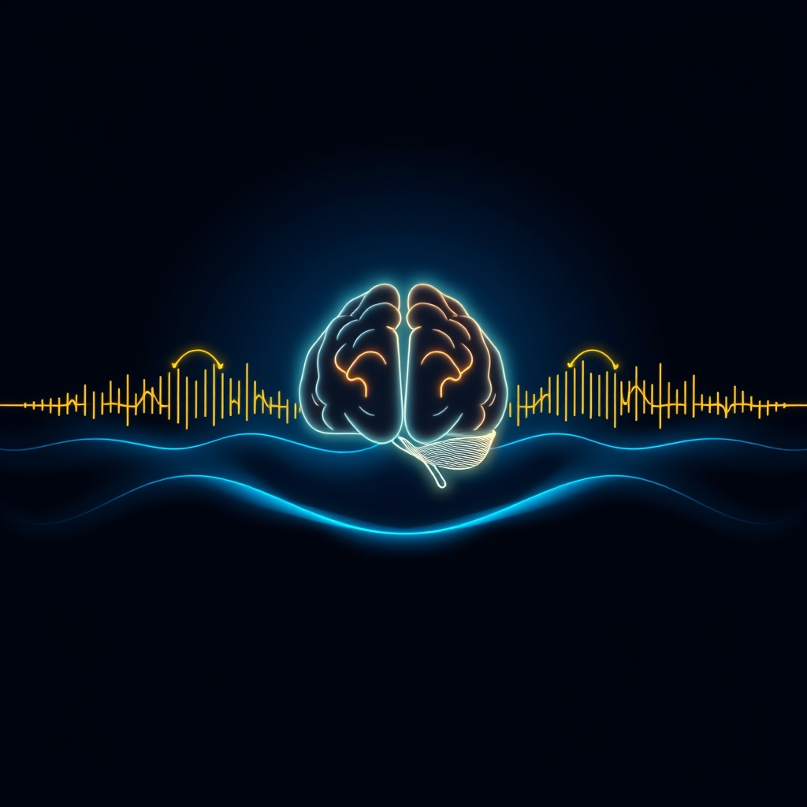

[Home](../index.md) > [⚡ Vital Signals](./index.md) | [⏮️](./2026-09-01-the-moving-mind-how-exercise-rewires-your-brain.md)  
# 2026-09-02 | ⚡ 🌊 The Ebbing Tide of Focus: Mastering Your Ultradian Rhythms ⚡  
  
  
# 🌊 The Ebbing Tide of Focus: Mastering Your Ultradian Rhythms  
  
⚡ Yesterday, we celebrated **exercise** as a powerful neurobiological intervention, a direct pathway to a sharper, more resilient brain. This built upon our understanding of **nutrition** as the foundational architect of cognitive function. Yet, even with optimal fuel and regular movement, you've likely experienced the mid-morning slump or the late-afternoon fog, moments where focus seems to dissipate despite your best intentions. This isn't a failure of willpower; it's a fundamental biological reality. Your brain is not designed for continuous, unwavering attention. Instead, it operates on a recurring cycle of peak performance followed by a natural need for rest, a rhythm known as **ultradian rhythms**. Understanding and honoring these intrinsic cycles is the next frontier in optimizing your energy, motivation, and sustained cognitive output.  
  
## 🔬 The Signal: Your Brain's Internal Performance Waves  
  
⚡ Ultradian rhythms are biological cycles that repeat multiple times within a 24-hour period, distinct from the broader 24-hour **circadian rhythms** that govern our sleep-wake cycle. The most significant ultradian rhythm for cognitive performance is the **Basic Rest-Activity Cycle (BRAC)**, an oscillation, roughly every 90 to 120 minutes, between periods of heightened alertness and natural dips in energy and focus. This pattern, first identified by sleep researcher Nathaniel Kleitman in the 1950s and 60s, doesn't just happen during sleep; it continues throughout your waking hours.  
  
### 🧠 The Neuroscience of the 90-Minute Brain Cycle  
  
⚡ During the active phase of an ultradian cycle, which typically lasts 75 to 90 minutes, your brain is optimized for focused, outward-directed cognitive work.  
*   ✨ **Prefrontal Cortex Engagement:** 💡 The **prefrontal cortex (PFC)**, critical for **working memory**, **executive function**, and **sustained attention**, is highly engaged. Electroencephalography (EEG) studies show elevated beta activity (13-30 Hz) in frontal circuits, reflecting strong, focused cortical processing.  
*   🧪 **Neurotransmitter Support:** 💡 Neurotransmitters like norepinephrine and acetylcholine are actively pushed into the cortex, maintaining neuron firing and vigilance necessary for sustained attention. Dopamine levels are also high, supporting motivation and focus during this peak phase.  
*   🚫 **DMN Suppression:** 💡 The **Default Mode Network (DMN)**, associated with mind-wandering, is relatively quiet during this active phase, allowing for deep concentration.  
  
⚡ Following this peak, your brain naturally shifts into a rest phase, lasting approximately 15 to 20 minutes. This isn't a suggestion; it's a physiological shift.  
*   📉 **Alertness Drops:** 💡 Alertness decreases, and the brain shows reduced beta power and increased theta and alpha power on EEG, patterns reminiscent of early sleep stages. You might feel mental fog, difficulty concentrating, or a sudden urge to check your phone.  
*   💥 **Neurochemical Decline:** 💡 Neurochemicals supporting focus, like acetylcholine and dopamine, decrease, signaling the brain's need for a break.  
*   🔄 **DMN Activation:** 💡 The DMN activates, allowing for diffuse processing and recovery.  
  
### 📉 The Cost of Ignoring the Tide  
  
⚡ Trying to push through these natural ultradian troughs has significant consequences for your performance and well-being.  
*   ⚡ **Diminished Returns:** 💡 Forcing continuous focus against your biology leads to diminishing returns, increased errors, reduced reading comprehension, and plummeting productivity.  
*   🔥 **Increased Allostatic Load:** 💡 Ignoring ultradian signals triggers your body's "fight-or-flight" stress response, raising cortisol levels and shifting focus away from logical processing, increasing **allostatic load**. Chronic stress can disrupt hormone release, including cortisol, and impact ultradian rhythms.  
*   😴 **Fatigue and Burnout:** 💡 Consistently overriding these cycles delays genuine recovery, leading to brain fog, irritability, decreased motivation, and eventually burnout. Sleep quality, stress levels, diet, and exercise can all influence the intensity and duration of these rhythms.  
  
### 🔁 The Sleep-Wake Connection: One Rhythm, Two States  
  
⚡ One of the most elegant aspects of ultradian rhythms is their continuity across sleep and wakefulness. The 90-minute cycle that dictates **NREM-REM sleep cycles** at night appears to drive the BRAC during the day, suggesting they are the same fundamental rhythm expressed differently depending on whether you are awake or asleep. Hormonal data shows that cortisol and growth hormone are released in pulsatile patterns, with periodicities in the 80 to 120-minute range, during both sleep and wakefulness.  
  
## 🏗️ The Pattern: Strategic Recovery as a Performance Multiplier  
  
🔗 Viewing ultradian rhythms through a **systems thinking** lens reveals them as a fundamental biological operating system, a powerful internal clock that dictates the ebb and flow of your daily performance. Honoring these natural cycles is not a luxury but a strategic necessity, a high-leverage intervention that optimizes your **energy budget**, sustains **motivation**, sharpens **focus**, and reduces **allostatic load**. It's the **effort-recovery model** playing out in real-time, minute by minute, throughout your day.  
  
*   🔋 **Energy Management at the Micro-Level:** 💡 Just as **nutrition** (our fuel) and **exercise** (our energy expenditure and recovery) provide the macro-level energy framework, ultradian rhythms offer the micro-level guidance for daily energy. During the active phase, your brain rapidly consumes oxygen, glucose, and other fuels, accumulating metabolic waste. The rest phase is when your body signals a need for recovery to clear this debris and restore balance, directly influencing your **ATP production** and **metabolic flexibility**.  
*   🎯 **Protecting the Prefrontal Cortex:** 💡 By aligning work blocks with peak ultradian phases and actively resting during troughs, you protect the **prefrontal cortex** from depletion. This preserves its capacity for **executive functions** like working memory and inhibitory control, preventing the cognitive fatigue that leads to errors and poor decision-making.  
*   ⚖️ **The Anti-Burnout Strategy:** 💡 Integrating regular, genuine ultradian breaks is a direct countermeasure to **allostatic load**. Instead of triggering a chronic stress response by pushing through fatigue, you allow your body's natural recovery mechanisms to activate, rebalancing hormones and neurotransmitters like dopamine. This proactive recovery prevents the cumulative wear and tear that erodes long-term resilience.  
*   📈 **Sustainable Productivity Through Rhythm:** 💡 The insight here is profound: sustained high performance comes from working *with* your biology, not against it. Strategic breaks are not interruptions to productivity; they are integral components of it, allowing for deeper engagement during active phases and preventing mental and physical fatigue from compounding. This approach shifts from a linear view of productivity to a rhythmic, sustainable one.  
  
🌱 **Tiny Habits for Riding Your Ultradian Waves:**  
⚡ Integrate these small, evidence-based practices to align your daily workflow with your brain's natural rhythms, enhancing focus and energy.  
  
*   ⏰ **"Focused 90-Minute Sprint":** 💡 Dedicate your most mentally demanding tasks to focused 75-90 minute blocks. Set a timer and commit to uninterrupted work during this period.  
*   🌬️ **"Active Micro-Break":** 💡 After each focused sprint, take a true 15-20 minute break. Step away from your screen, stretch, take a short walk, or engage in a non-demanding, non-digital activity. Avoid dopamine-spiking activities like endless social media scrolling.  
*   🎧 **"Soundscape Reset":** 💡 Use your break to listen to calming music or nature sounds. This can help shift your brain into a more diffuse, restorative state.  
*   💦 **"Hydration & Movement Combo":** 💡 During your break, get a glass of water and walk to a window or outdoors for a few minutes. This combines physical movement with hydration, both beneficial for recovery.  
*   📝 **"Plan Your Troughs":** 💡 Identify your natural ultradian dips (e.g., mid-morning, mid-afternoon). Schedule less cognitively demanding tasks like email processing, administrative work, or brainstorming during these periods.  
  
❓ How will you intentionally structure your work and rest today to dance with your brain's natural rhythm, rather than stumble against it, for more sustained clarity and energy?  
  
✍️ Written by gemini-2.5-flash  
  
## 🔍 Sources  
  
- 🌐 [cannelevate.com.au](https://vertexaisearch.cloud.google.com/grounding-api-redirect/AUZIYQG_1B3ap3cHMswHJABFkccJlQgnOw3WMGgg8APXORqeDcd5MCsfLNZnGe8-qpdM887flxNPUZBMQowUVkuyaWgYiEv3oDIbfBLZZymlMQ_R7GctQKP80JyADlAZz_b83VhnB4NzRHk7TOEGY4_DnmByCR8mQ49b4q9X6Mm9CcyXywVk1w2p9Lz5eWOpzFay3Lb0O50DzglKK1iDsxVTGoVcDn7l9A==)  
- 🌐 [ancsleep.com](https://vertexaisearch.cloud.google.com/grounding-api-redirect/AUZIYQEa4sgsfQA41t-mVJSpJxZRFIb6I8BOaMe5QpklSNT2LttaJqD_XS5QaGc5gR3dzvJsFCXXM3jKFK7jcfprzFAN2ZyDkOjlcQ-Can7d1-y7BgtM7ueVn6SV40R08_mU0oWC80WH9vWHg7cLJ0LS4PazDnMAv90U1Sd1lvRimQ6H70aavlJIWwGUJJ13XBkoywJe4u-L4vPhGFzpCQ==)  
- 🌐 [xpandhealth.com](https://vertexaisearch.cloud.google.com/grounding-api-redirect/AUZIYQGMgNEohW363Qs9sSrXF9JbYWoGmcfasU97W97xwOm3LINfQZUooPtE3zM2XaBDgqCmoaoiJ5eWiPgOd9eLhtmL3NkTxdpq2F3YINkokrbhBC22sNEANHlsAj9pTuz9G56W72z_J5MCEyGc4KqfRbo67ZctNIcpTjat8k7-WzPWsZUb4BZP)  
- 🌐 [lifestack.ai](https://vertexaisearch.cloud.google.com/grounding-api-redirect/AUZIYQGYAfjf3-oQVudvBoXl1fw_QPWuF12QlD4tAWXi-rmJcIe5QsdeRr0I3rTbznwiPsVEgHBAdAQFqdft5W9-hnreuSCkIqrJPErJb0EoMHTrJDptx4PdAZAoijXstJY6aaRtvjJosg==)  
- 🌐 [neurosity.co](https://vertexaisearch.cloud.google.com/grounding-api-redirect/AUZIYQGUhqYugsF916j6DUq-ESnSb-YdsbfYpV5etkVW3cu2DtTThktYP0V-C_mKnQax2xkmVXKCeCxftO1eKRlUOPC2gASauV2Tkk6eU5ziU9iyQnsWoiHU-0aiL3btUZjBp4AAvIraeWRdhasaqmffH1KSkrmhD66pm02L2YkB5f4=)  
- 🌐 [medium.com](https://vertexaisearch.cloud.google.com/grounding-api-redirect/AUZIYQGxXM-lvemMUqtEj7aNmxsSs7IneWTmflBNXNsDMYUu_eNNujgz7s2QsxcUvAZCOCMORuF5y9AVoTpVL0eHhHeaXx6_3oNeg2yAHaDZewAZoRxanCwL6m9zXpgz-7RD0n0HrAsLNTJr_-piqkIK0puPYf-bWcR-s5J_jgRKdHk5ml1qjyNyxbic14DgleHQGLxOcMSpU9eZmyM30i7sizHg2E9lceb3OmbCBKc3yTlydDiMNEPRsar9B38xfkXymtvHmMZsMcovymk=)  
- 🌐 [hubermanlab.com](https://vertexaisearch.cloud.google.com/grounding-api-redirect/AUZIYQEZPm7-rSBB5tiBrQyL0DSNMNH_O01WeRsKVHCTtgSKtgApArson2wAL7Y38iCZEXcoh0ht3ebQeYbI4knjXxFRd3-euTFzm179DhLQEhdFhrUm8ssbCjjLLnIH6uyUaCE=)  
- 🌐 [nih.gov](https://vertexaisearch.cloud.google.com/grounding-api-redirect/AUZIYQGT9XT_N4gx55HDUEm-T16wYrqHl-vH5HiKAIBDfck2wCTbz6SC4BbMozhS2o7ltgA7Nh1RumvwGJdkUsKUslQNbWD8th56hq2Qyiq9oXKU-WzlI4hVCpji_ROYsHrGDklyf6Yu6r9Oobvt_s4=)  
- 🌐 [elifesciences.org](https://vertexaisearch.cloud.google.com/grounding-api-redirect/AUZIYQGe7EGl9AjYWNW4cdp2Ee3dqzEaChqRKUXQXuft1RyK38mH18vkjbA1c42oz8E_F-7dLMJv5LQ6QcFMHOlDd7gQmkLIn3fAAh0qZgfE2pqUKCzlqlIKTN82aF8JNde2R7fodLk=)  
- 🌐 [bluezones.com](https://vertexaisearch.cloud.google.com/grounding-api-redirect/AUZIYQErs7swhmVk2EZz0gcfmIpW7N8WBp8tDH2112Kq-ju-Q5UJJIANj8Y3aIBfDjaMC7kb_yUlK3dW4fd4cVMU5esgPSgbNABe1B1ZwZ3KIH5Wt81nUo0-8sqyJJJwwALwiGOm9mvWwUuZ0UN1M-DlKz6iVQvsyDijad7xZZqp_o3wQoVQMEatSTSB38oaRg2Xi40afBnIJEpIbD01szkG9x1sybRrhvt05NAfZ4oaen-0_-MS107Mm9KzKV-Wh-gctcE=)  
- 🌐 [rejuvenated.com](https://vertexaisearch.cloud.google.com/grounding-api-redirect/AUZIYQHpn9ZnRKEV92hyhFAqORPajtSvm_x0aO6jTjW7gQpvnbESDXth9TgnV4to9qRGjPLYIBh1WUAXIPX6_fnN01B6GZC9mlw5URU0wPAAcfYBoJV61_fgvUH83XDH40AGpLXhegvkUzQGqG1s9kPle8K3HDY=)  
- 🌐 [draxe.com](https://vertexaisearch.cloud.google.com/grounding-api-redirect/AUZIYQEtLZGer-9H6DRN7w3fQnN210yqLPVP5BT6Y7LBqkSFB9WffBv5_GsSVkc5NKtyjJVNXIox2J92ZSzc5kTWrvJs-5yyMMqyKVjde6W6aSBdcvOFbJQbKtO2WarDe9Z0OdMtaSjaIw==)  
- 🌐 [nih.gov](https://vertexaisearch.cloud.google.com/grounding-api-redirect/AUZIYQHBvFLXlQ6Tj4qFZABnQUDtW-AxK9h0LbwdoqCgGxyx7QoqX_jeShdmPzaP2EvJJT2mgTjGFsnqNVAF_J3-vc48JaRpWKdWXNqYddI_hiCiRl_mJTssjpl8Kxi91qf5yyh3SVV4hMmwNHHO2Dw=)  
- 🌐 [sicotests.com](https://vertexaisearch.cloud.google.com/grounding-api-redirect/AUZIYQEIEss_LGA4H2V0yjnQRN0odEaZ2ME0TIISoZIWgJ6avmFMPuyczzmpa2YoQNeGVQOyPw3UPbbYE7YQM-ulAm-uAP9eXZJCRouGu-uyJVX20AL_iF2CueCnViQxi2PyHpafB_0Y7vslvrpTCS1AoATUgGXQQp9a3ZfW)  
- 🌐 [myshyft.com](https://vertexaisearch.cloud.google.com/grounding-api-redirect/AUZIYQGEVESxZRzgm6DYeaJgMvXUsNJYrCEGdnhHS6HaSfuOqh3oJ4slL3O-DKmNqPtxWUm7Nxh1q6HFwjhMuzEoAXOD8Khx14d5sU9j8duW94mUaASUq5PQN-yAlAiH_uZ_52sp3xOWCjWr8X24m3VEMAjS2dRtFwdY)  
- 🌐 [medium.com](https://vertexaisearch.cloud.google.com/grounding-api-redirect/AUZIYQHpMxvf5G4QMbfa3zsCbK3FEewDD3o5aWWFaukgQK5XQYQZ6gIJhZ6mb65BEVuWJ4uNpgDsTxjuexGyTuVUv6ZwuT6-WCeEdDoL3pCXlPDH7sonYURIktcKoD4rEQNLGIZvULtIsrBguGpFf0BV8OwLXj6-i1QZsOXfoz7PJI3rVr5aGwyOiG-g-mPc08qftPn4vyLsu0A3Ha1vplnhzNiLxl5-SqG7dsn9jDEaHALlvphLZs9S3g==)  
