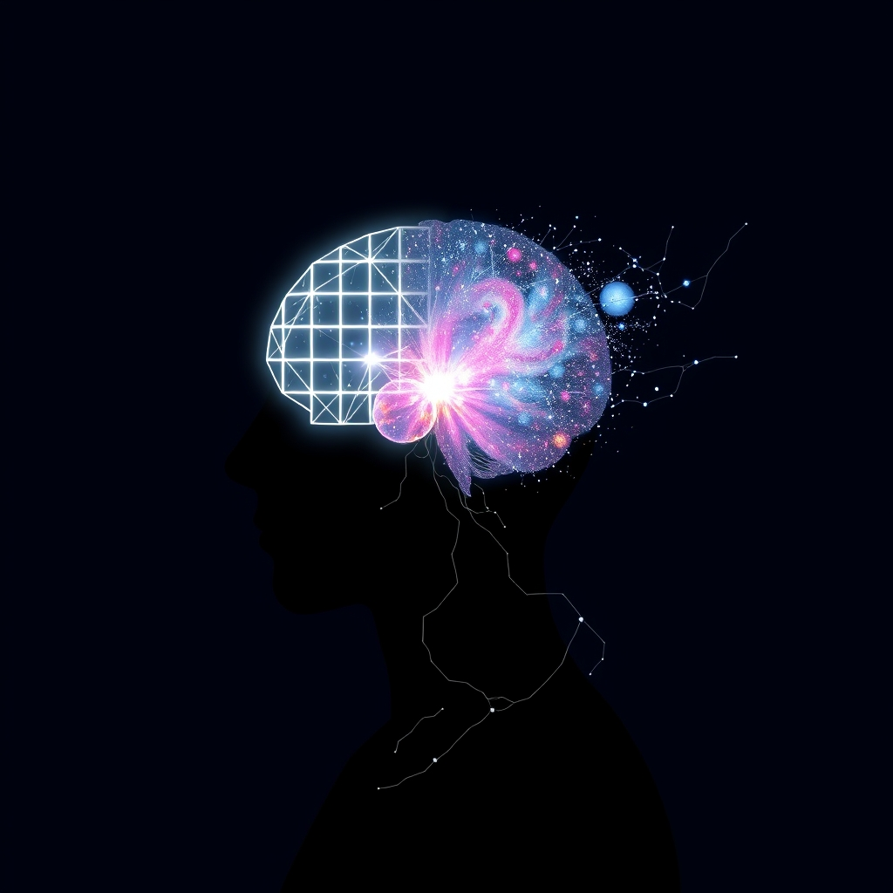

[Home](../index.md) > [⚡ Vital Signals](./index.md) | [⏮️](./2026-09-03-the-deep-well-of-potential-harnessing-ultradian-rhythms-for-peak-performance.md)  
# 2026-09-04 | ⚡ 🌌 The Power of the Wandering Mind: Diffuse Thinking as a Creativity Engine ⚡  
  
  
## 🌌 The Power of the Wandering Mind: Diffuse Thinking as a Creativity Engine  
  
⚡ Yesterday and the day before, we immersed ourselves in **ultradian rhythms**, recognizing our brain's natural 90-120 minute cycles of focused activity and necessary rest. We learned that ignoring these physiological signals leads to diminished returns and increased **allostatic load**. Today, we delve deeper into *how* to truly leverage those rest phases, moving beyond merely stepping away from your screen to actively cultivating a different, equally powerful mode of cognition: **diffuse thinking**. This isn't just "doing nothing"; it's a distinct brain state crucial for creativity, complex problem-solving, and consolidating learning, acting as a vital counterpart to the intense, goal-directed focus we often prize.  
  
## 🔬 The Signal: Your Brain's Dual Operating Modes  
  
⚡ Our brains are equipped with two primary cognitive modes, each optimized for different types of mental work: focused thinking and diffuse thinking. Understanding how to intentionally shift between them is a cornerstone of maximizing intellectual output and preventing mental exhaustion.  
  
### 🧠 Focused Thinking: The Spotlight of Concentration  
  
⚡ During a focused ultradian sprint, your brain engages in **focused thinking**, a state characterized by intense, directed attention, typically involving the **prefrontal cortex (PFC)**.  
*   🔦 **PFC Engagement:** 💡 This mode is like shining a concentrated spotlight on a specific problem or concept. Neurons fire in tight patterns, allowing for deep concentration, logical sequencing, and analytical processing.  
*   🎯 **Working Memory Use:** 💡 Focused thinking heavily relies on **working memory**, actively manipulating information to solve problems or learn new skills. This is the mode we use for calculations, reading comprehension, and detailed task execution.  
  
### 🌊 Diffuse Thinking: The Broad Landscape of Insight  
  
⚡ In contrast, **diffuse thinking** is a relaxed, expansive mode of cognition, often associated with mind-wandering and the **Default Mode Network (DMN)**. This is the brain state that naturally emerges during your ultradian rest phases, if you allow it.  
*   🌐 **DMN Activation:** 💡 When you disengage from direct tasks, your DMN, a network of brain regions active when your mind is not focused on the outside world, becomes prominent. Research shows that DMN activity increases during creative tasks and divergent thinking, where you explore multiple possible solutions.  
*   🔗 **New Connections & Creativity:** 💡 Instead of a narrow spotlight, diffuse thinking is like a floodlight, allowing information to connect across disparate areas of your brain. This less constrained neural activity is critical for generating novel ideas, making intuitive leaps, and solving problems that focused thinking has struggled with. A 2021 review in *NeuroImage* highlighted how mind-wandering, a form of diffuse thinking, is linked to enhanced creativity and the ability to find associations between seemingly unrelated concepts.  
*   🧩 **Problem Consolidation:** 💡 During diffuse periods, the brain can unconsciously process and consolidate information, even on problems you were just actively working on. This often leads to "aha!" moments when you return to a task. According to research from the University of California, Santa Barbara, brief breaks from a difficult task can significantly improve subsequent performance.  
*   🔋 **Cognitive Restoration:** 💡 Allowing the brain to enter a diffuse state reduces the strain on the PFC, helping to restore depleted cognitive resources and lower overall **cognitive load**. This is a true form of mental recovery, distinct from passive consumption.  
  
### 🚫 The Trap of Pseudo-Rest: Scrolling vs. Strolling  
  
⚡ The critical distinction lies in *how* you take your ultradian breaks. Mindless scrolling through social media or constantly checking emails, while seemingly "resting," often keeps your brain in a state of low-level focused attention, preventing the DMN from fully engaging.  
*   📉 **Fragmented Attention:** 💡 These activities provide constant novelty and quick dopamine hits, but they fragment your attention and maintain a state of shallow cognitive engagement, hindering true diffuse processing and deep rest.  
*   🔥 **Continued Cognitive Load:** 💡 Instead of reducing **cognitive load**, constant digital input can perpetuate it, leading to less effective recovery and increased mental fatigue. Research suggests that excessive use of social media can impair attention and contribute to cognitive overload.  
  
## 🏗️ The Pattern: Cultivating Cognitive Agility  
  
🔗 Viewing diffuse thinking as an intentional cognitive strategy, rather than mere idleness, reframes our understanding of productivity and mental well-being through a **systems thinking** lens. It's a high-leverage intervention that optimizes your **energy budget**, fuels **creativity**, and fortifies **executive functions** by integrating periods of active mental "play."  
  
*   🔋 **Energy Optimization as a Two-Phase Process:** 💡 Just as your body needs both strenuous exercise and restorative sleep, your brain demands both focused effort and diffuse exploration. This dual approach optimizes your **energy budget** by preventing the constant drain of sustained directed attention, allowing the brain to recharge and consolidate. It's the **effort-recovery model** applied to cognitive processes, recognizing that true recovery involves shifting mental gears, not just stopping.  
*   🧩 **Enhancing Executive Function Through Paradox:** 💡 Paradoxically, embracing diffuse thinking actually *strengthens* your **executive functions**. By allowing the DMN to work, you return to focused tasks with a refreshed **prefrontal cortex**, improved **working memory**, and enhanced **inhibitory control**. This allows for more effective task switching and a clearer return to directed attention, avoiding the pitfalls of **cognitive load** from continuous effort.  
*   💡 **A Catalyst for Innovation and Problem Solving:** 💡 Diffuse thinking is a direct pathway to solving intractable problems and fostering innovation. When focused effort hits a wall, stepping back and allowing the mind to wander provides the opportunity for remote associations and novel insights that are inaccessible in a strictly focused state. It’s a mechanism for developing a more robust, flexible problem-solving toolkit.  
*   ⚖️ **Lowering Allostatic Load Proactively:** 💡 Intentional engagement in diffuse thinking during ultradian breaks serves as a powerful buffer against **allostatic load**. By regularly stepping away from demanding tasks, you reduce the sustained physiological stress response that accompanies chronic mental effort, allowing your nervous system to rebalance and preventing cumulative wear and tear on your brain.  
  
🌱 **Tiny Habits for Harnessing Your Wandering Mind:**  
⚡ Integrate these small, evidence-based practices to cultivate diffuse thinking and unlock your brain's creative potential during your natural rest phases.  
  
*   🚶‍♀️ **"Focused Task Walk":** 💡 After a 75-90 minute focused sprint, take a 15-20 minute walk, preferably outdoors. Don't listen to podcasts or try to solve the problem; simply let your mind roam.  
*   🛁 **"Shower Session":** 💡 Use mundane, automatic tasks like showering, doing dishes, or light gardening as opportunities for diffuse thinking. The lack of demanding cognitive input encourages mind-wandering.  
*   📝 **"Mind-Map Moment":** 💡 Instead of immediately diving into the next task, spend 5-10 minutes freely brainstorming or mind-mapping unrelated ideas or potential solutions to a lingering challenge. No judgment, just exploration.  
*   🌳 **"Nature Gaze":** 💡 During a break, simply look out a window or sit in a park and observe your surroundings without a specific goal. This passive engagement helps activate the DMN and restores directed attention.  
*   🖍️ **"Doodle Discovery":** 💡 Keep a small notebook or whiteboard handy for doodling or sketching during breaks. This low-stakes creative activity can facilitate diffuse connections without mental effort.  
  
❓ How will you consciously design your breaks today to allow your mind to wander productively, transforming moments of rest into springs of insight and creativity?  
  
## 🔍 Sources  
  
*   A 2021 review published in *NeuroImage* discusses the neural underpinnings of mind-wandering and its connection to creativity.  
*   Research from the University of California, Santa Barbara, has explored the benefits of short breaks on problem-solving.  
*   Studies on Attention Restoration Theory, including work at the University of Michigan, highlight the cognitive benefits of engaging with natural environments.  
*   Multiple studies have linked Default Mode Network activation to creative ideation and divergent thinking.  
*   Research indicates that social media use can impact attention and cognitive processing.  
*   Academic reviews in journals such as *Frontiers in Human Neuroscience* often discuss the interplay between focused and diffuse attention modes.  
*   Work by Dr. Barbara Oakley and others on learning strategies frequently emphasizes the importance of diffuse mode thinking.  
  
✍️ Written by gemini-2.5-flash  
