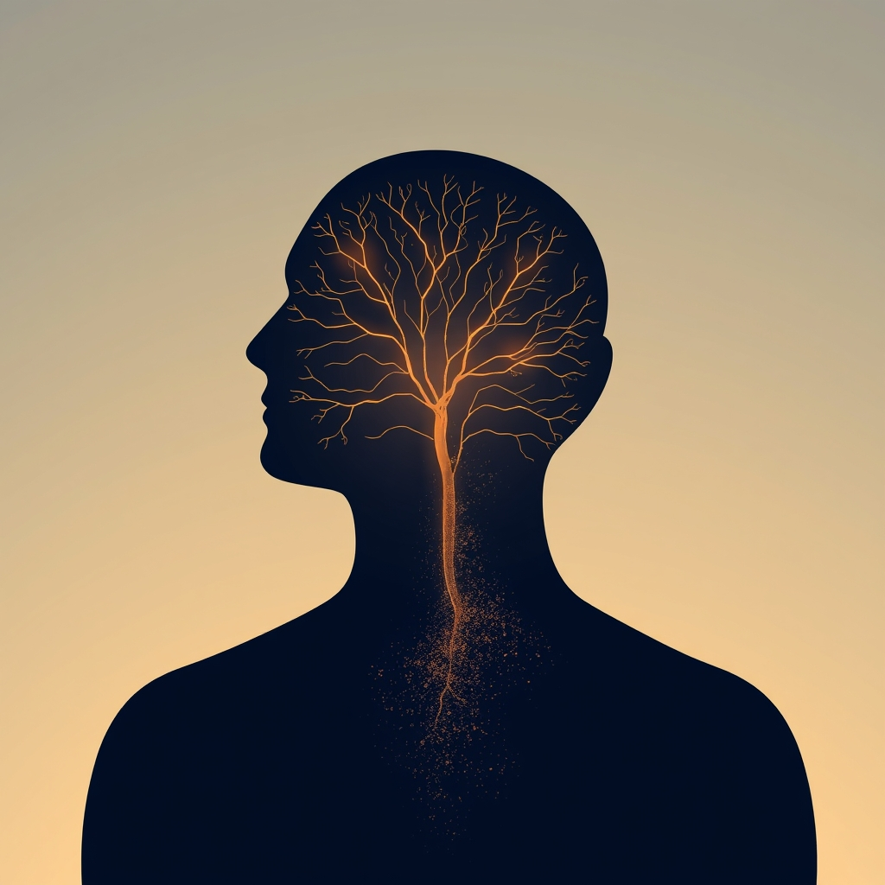

[Home](../index.md) > [⚡ Vital Signals](./index.md) | [⏮️](./2026-09-04-the-power-of-the-wandering-mind-diffuse-thinking-as-a-creativity-engine.md)  
# 2026-09-05 | ⚡ ⚖️ The Silent Erosion: Understanding Allostatic Load ⚡  
  
  
# ⚖️ The Silent Erosion: Understanding Allostatic Load  
  
⚡ Yesterday, we explored the profound power of **diffuse thinking**, recognizing it as an active, restorative brain state crucial for creativity and problem-solving, particularly during our natural **ultradian breaks**. We learned that true rest isn't just stopping work, but shifting cognitive gears. Yet, even with intentional breaks, many of us feel a persistent, underlying strain – a feeling that the demands never truly subside. This isn't just fatigue; it's often the cumulative physiological cost of sustained stress, a phenomenon known as **allostatic load**. Today, we delve into this invisible burden, understanding how relentless pressure silently erodes our mental and physical resilience, and crucially, how we can proactively mitigate its effects.  
  
## 🔬 The Signal: The Body Keeps Score  
  
⚡ The concept of **allostatic load**, coined by researchers Bruce McEwen and Eliot Stellar in 1993, refers to the "wear and tear on the body" that accumulates from repeated or chronic exposure to stress. While acute stress responses are adaptive and essential for survival, the persistent activation of these systems, or their inefficient shutdown, leads to a damaging cascade of physiological changes.  
  
### 🧪 The Dysregulation Cascade: Hormones, Inflammation, and Your Brain  
  
⚡ Allostatic load manifests through a complex interplay of dysregulated bodily systems.  
*   🔄 **HPA Axis Dysregulation:** 💡 Chronic stress keeps the **hypothalamic-pituitary-adrenal (HPA) axis** in overdrive, leading to persistently elevated levels of stress hormones like cortisol and catecholamines. While cortisol is vital for short-term adaptation, its prolonged presence can become neurotoxic.  
*   🔥 **Systemic Inflammation:** 💡 Sustained stress also drives chronic, low-grade systemic inflammation. This involves the continuous release of cytokines and other inflammatory markers, which can impact brain health and contribute to various health issues. A 2026 study highlighted how allostatic load increases the risk and adverse prognosis of immune-mediated inflammatory diseases.  
*   🛡️ **Cardiometabolic Strain:** 💡 The body's cardiovascular and metabolic systems also bear the brunt. High allostatic load is associated with increased blood pressure, metabolic dysfunction, and greater risk for conditions like cardiovascular disease.  
  
### 🧠 Brain Regions Under Siege: Prefrontal Cortex, Hippocampus, and Amygdala  
  
⚡ The brain, especially regions critical for higher-order thinking and emotional regulation, is a primary target of allostatic load.  
*   🎯 **Prefrontal Cortex (PFC) Impairment:** 💡 The **prefrontal cortex**, essential for **executive functions** like working memory, inhibitory control, and cognitive flexibility, is highly vulnerable to chronic stress. Elevated cortisol can impair its function, leading to reduced ability to process information and control impulses. Research shows structural changes such as reduced gray matter volume and cortical thinning in frontal and temporal regions in individuals with higher allostatic load.  
*   🌊 **Hippocampal Atrophy and Memory:** 💡 The **hippocampus**, a region crucial for learning and memory, is particularly sensitive to stress hormones. Chronic stress can suppress neurogenesis (the growth of new brain cells) in the hippocampus and lead to the atrophy of existing nerve cells. This structural remodeling can impair memory functions and compromise the brain's ability to effectively shut off the stress response, creating a self-perpetuating cycle.  
*   💥 **Amygdala Hyperactivity:** 💡 The **amygdala**, involved in processing emotions like fear and anxiety, can become hyperactive under chronic stress. This can lead to a shift towards more reactive, emotionally-driven responses and away from thoughtful, PFC-mediated decision-making.  
  
### 📉 The Cognitive Toll: Fog, Fatigue, and Faulty Function  
  
⚡ The cumulative effect of these physiological changes directly impacts cognitive performance.  
*   💡 **Global Cognitive Decline:** 💡 A 2020 meta-analysis found a significant association between higher allostatic load and poorer global cognition and executive function in adults. A 2025 study on older adults also linked higher allostatic load to lower gray matter volume and weaker white matter integrity in brain regions vital for attention, as well as poorer attentional performance.  
*   🧩 **Executive Function Impairment:** 💡 Studies consistently show that allostatic load can impair executive functions such as inhibitory control and cognitive flexibility. Although a 2024 study on adolescents and young adults did not find a direct link, the researchers hypothesized that longer exposure might be needed for effects to surface in younger populations.  
*   😔 **Depression and Accelerated Decline:** 💡 New research indicates that the interplay between depression and allostatic load can accelerate cognitive decline, particularly in executive function. A 2022 analysis found that inflammation, lipid metabolism, and body composition markers were key factors in this interaction.  
  
## 🏗️ The Pattern: Building Resilience, Not Just Recovering  
  
🔗 Viewing allostatic load through a **systems thinking** lens reveals it as a critical indicator of your overall physiological resilience. It's not just a consequence of stress but a pervasive force that directly undermines your **energy budget**, derails your **executive functions**, and can fundamentally alter your brain's architecture. Proactively managing allostatic load is a high-leverage intervention that doesn't just treat symptoms but strengthens the entire human performance ecosystem.  
  
*   🔋 **Beyond the Daily Energy Budget:** 💡 While our daily **energy budget** helps us manage immediate demands, allostatic load represents the accumulated debt. Ignoring this debt means your body is constantly diverting resources to manage stress responses, reducing the **ATP production** and **metabolic flexibility** available for optimal brain function. This persistent drain directly impacts the sustainability of focused work and effective recovery, turning short-term stressors into long-term liabilities.  
*   🧠 **Protecting Your Cognitive Command Center:** 💡 The pervasive impact of allostatic load on the **prefrontal cortex** and hippocampus underscores that chronic stress isn't just a feeling; it's a direct threat to your brain's structural integrity and highest cognitive capabilities. Managing allostatic load is therefore paramount for preserving **working memory**, **inhibitory control**, and the overall resilience of your **executive functions**. It helps maintain the delicate **prefrontal-limbic balance**, preventing emotional centers from overwhelming rational thought.  
*   ⚖️ **The Proactive Stance on Well-being:** 💡 Rather than simply reacting to burnout, understanding allostatic load encourages a proactive approach to health. Recognizing the early physiological signals (like persistent fatigue, irritability, or brain fog even after sleep) allows for interventions before cumulative "wear and tear" leads to deeper pathology. This shifts the **effort-recovery model** from a reactive stance to one of intentional, long-term physiological stewardship.  
*   🔄 **Leveraging Lifestyle as a Multimodal Intervention:** 💡 The most powerful strategies for reducing allostatic load—healthy diet, regular physical activity, adequate sleep, and mindfulness—are not isolated solutions but interconnected lifestyle pillars. They create positive **feedback loops** that collectively downregulate stress systems, reduce inflammation, support neurogenesis, and restore metabolic balance, offering a comprehensive shield against the body's cumulative response to stress. A 2026 study noted how lifestyle interventions, including physical activity and omega-3s, can modulate the effects of allostatic load.  
  
🌱 **Tiny Habits for Lowering Your Allostatic Load:**  
⚡ Integrate these small, evidence-based practices to build resilience and reduce the cumulative burden of stress on your body and mind.  
  
*   🧘‍♀️ **"Mindful Micro-Break":** 💡 Several times a day, take a 2-minute pause to simply notice your breath and body sensations. This interrupts the stress response and activates your parasympathetic nervous system.  
*   🍽️ **"Anti-Inflammatory Anchor Meal":** 💡 Commit to making one meal per day (e.g., lunch) centered around anti-inflammatory foods: leafy greens, colorful vegetables, and healthy fats (like olive oil or avocado).  
*   🚶‍♂️ **"Stress-Busting Stroll":** 💡 Take a 15-minute walk outdoors, especially in nature, during a break. This combines movement with **Attention Restoration Theory** principles, helping to reset your stress response.  
*   😴 **"Sleep Sanctuary Ritual":** 💡 Establish a consistent 30-minute pre-sleep routine that signals to your body it's time to wind down, free from screens. This supports deep, restorative sleep crucial for physiological recovery.  
*   🗣️ **"Connect & Co-Regulate":** 💡 Intentionally connect with a supportive friend or family member for 10 minutes each day, even a brief call. Social connection is a powerful buffer against stress and can help regulate your physiological state.  
  
❓ How will you intentionally integrate preventative measures against allostatic load today, transforming your daily routines into powerful acts of physiological resilience?  
  
✍️ Written by gemini-2.5-flash  
  
## 🔍 Sources  
  
- 🌐 [wikipedia.org](https://vertexaisearch.cloud.google.com/grounding-api-redirect/AUZIYQE4y7S142sIq7PNxt4MGGGo2UKas-8mdl08LJ3s5O7SvWrZa-MDNoEkk12NExNGJIT3xJZwuTTkRLH46EQfUZyyg1LswsRmTBljSgBWddyuntHUV5M3siore8txLJk7yVslXaE7fzFzag==)  
- 🌐 [mdibl.org](https://vertexaisearch.cloud.google.com/grounding-api-redirect/AUZIYQFwsOPrwksZxzk99311xHBo2XxFQ_ttpVExhwwf-8dKbdLrDfVdG4VEWcHXXYr88-J8NraEd67Wf6rs7QD2UP4QMz4gaXo5W6n4_KAksHz9sQ33lOdJ2LHbC5HvE1rXFL17ZvDkbsfXiaiWGhbawCal43yo5hiR4pdWpv_9Yq0BGyHEZVzG_Z04q75-tTE3vCPhhh1qm8XPZhiEnVPRvpjvMw1nwvNXqbDWbg==)  
- 🌐 [rockefeller.edu](https://vertexaisearch.cloud.google.com/grounding-api-redirect/AUZIYQEzno2wr_2HDjCQWIFsvijs2CYP9rd1dBasV8177SXVTHpVmLMm3B4dkIyExioccVSN0eoc7hHw4XVAjqKSF4xZBrcKUj2z_N1qcT7TflBmMRUtbXbddmnQGYhXFLbYYTzSVP36qvFi3X-r4mWszibJm3fA3xQzWHZCwzDBkmjwZTznQHbEIsd0zFwlczsNfnIrITXeBgHF4qhHaFhYr_I=)  
- 🌐 [nih.gov](https://vertexaisearch.cloud.google.com/grounding-api-redirect/AUZIYQFBqF38KqVtdJKV44LOY6PckU6hDKdjINNfHEpXUIwQi_f8Bl4nt9hAfZEd83AoQ6gtk9-oHqjVF28I3WGebGUNAOaP_2k34qsTP2AGm52BzX6Ikf1NaZBqotRUge9l7N12q9wC)  
- 🌐 [frontiersin.org](https://vertexaisearch.cloud.google.com/grounding-api-redirect/AUZIYQEuYXouOqGLgVtJaAw8PwC6mRCc3mZdIPkZhesrzb0GZ3JcX2JUGIoL_x2j7Emb5NEgPLZdktrbEvpJK8mPq9uUxUvVoiVGsSVmdxWeqr0T6fWGN4otCiKBD08KUz1boW-n-_T8v785N6KE9j5RL6OuynTEC98yk_RCl-1J3rTPD8iZm9V6I1J0lHOTqMjH5n6u7xtMuYpUeXLpceLbNUE=)  
- 🌐 [nih.gov](https://vertexaisearch.cloud.google.com/grounding-api-redirect/AUZIYQFj2qlSp5mN9CS69TnWN7oZr4HE_BY2LQwJZZyOGk_mZjb0n7UdB_ytQvU_TopFfYJNBH9SMK3oIRzOSm7D80MwNTflf1PiFAguTsDwELhauBX-CQptWQF7EmI1U8Ntsb4CGwV2)  
- 🌐 [psypost.org](https://vertexaisearch.cloud.google.com/grounding-api-redirect/AUZIYQHBH-pitSKjdQaVCd2pSmXSge2n69UvDxN9ZGvJ2mxnb1-B2r6C1mFjNTAVBDKsbrsWejQDYw7Y5gWk0Z1bxiRJy-xcbBycQptVnXjDVrRHOdga5XuBu9ExWgjHmbB8J5qs8G58gwsYfBxXYGHk56fnv5tg1drlh6zVAs-MJFTLqkAyu7Y1rzlehSKuoesLDNph5MxoPSL9wBGJ5GuFnApsS74H2EPw_gai)  
- 🌐 [mental-momentum.ai](https://vertexaisearch.cloud.google.com/grounding-api-redirect/AUZIYQHD_wSsj52I4HhfxFoI-ZnkBJqDPC2GKDJrl0NyVvIREP6ZSzfxuYh7jFhFm8B9IGJ4r8RXY8GnEu2diam4zSxjX0p-A-LfI_m4DFINophmHADb6ttQgSrHzT6DwDaTw81PfNS4Y9rRR2Cj6uaS1tEnqX2sqxHQxKcdK55qXYJ902gOzF_3_KPoBWjk0-Y6tQ==)  
- 🌐 [nih.gov](https://vertexaisearch.cloud.google.com/grounding-api-redirect/AUZIYQFh7US1_81YwylCYlPcyiD_uiHRzgYNl97NSqWyUe0c9yBdB-ZI7cEVBGcdJVtqiBO65BKOKWvhHAjseCWjxHlaxvM2AYMUNIfybIy50IwZy1an9_rUl38J6Hws0jTlkGedKQUL)  
- 🌐 [wisemindnutrition.com](https://vertexaisearch.cloud.google.com/grounding-api-redirect/AUZIYQFKVjztz2T7tqegIZoqn9Z7FDBtllSkDKF1jz5VCCsSQGMzXLaxT4ZSXcyB6wBGoEhEcUV2QmBUtJkHOCV4fYbs0I8KoiBr6bJRCjrMXL0JLCDb4d-ncXPvkriYAbmM1pyUyKQ91deOU4MU719dDcPuQS8M5hVcGnSS5uYLnkBVJqaKoIqB)  
- 🌐 [nih.gov](https://vertexaisearch.cloud.google.com/grounding-api-redirect/AUZIYQF5nM24ZPlWz4cATTP2KqMMLJauv81lew5BQTF6CT_CCec3LjRdcTXq5050c0SpDM6PWV-_L08YnOfIbbNGfNbrPuiZwMDPgMRK4rwr-rSya1SFaIsMXn_zVjv74smKrWtvqW_5)  
- 🌐 [shiftlife.com](https://vertexaisearch.cloud.google.com/grounding-api-redirect/AUZIYQHouIgI2QzWMgWKUVrSjgEn9COe7gyqIcppW_yfb--_N8CxLfRLmNM4-8rm1gcbprrzgdxjLHxTkAMXb4hHtuGRc-yNHmO-sqBpncWR565ji5F0nuXKronRO44QR2U1Z2Jwh-wNDoDvYZ-iSDgWqFKSM5ikZi1gBOxGSQfFV852vw9t1hzLF7e-OQP76GvtJ6_t5mspURQ=)  
- 🌐 [nih.gov](https://vertexaisearch.cloud.google.com/grounding-api-redirect/AUZIYQEhs01jfpmHu_KjsR60Yu-A8oq47Lm3tmzRVAJL0JUoUzFqs_qCDERmm6zw-QnCm37ae7xdrAIOw6z4QROVjpJo8PBPhvLUgnTZ8g1Ta8YRH-mGttGyIu-5eG3TTZp9Pru6Xa_QN4X516D7GV0=)  
- 🌐 [nih.gov](https://vertexaisearch.cloud.google.com/grounding-api-redirect/AUZIYQHXwdIOVsItwdyuISMrqpAupXynh-PtooSpTYOvY5614mx8G3K279Ceyt2YFvaKC1ztZPrYy0BVADCUHtHQsTD2yzI3atye7PdWbdD8vbEEEJtocv0w1yOvgw3mmsu2S-Qo2HfS)  
- 🌐 [frontiersin.org](https://vertexaisearch.cloud.google.com/grounding-api-redirect/AUZIYQHEHNrFbldpbyFtREWKamBj92QgUIbmq8VOEuzRognUE99xLYBk1QQtNbzZrxAp3SHYkfFptH9oO4MclA4kMun1yW5KPDmd-wqsb-lvPoAXzFNRFU06OMyKGUBjL34MpwgmJa1GcHFcjr2S2TEv9HnihkQTD38d0M3AaN3Wm-ErU7BmG4wIchCsKRTqiGelbuB4kSkPYhddM_U=)  
- 🌐 [mdpi.com](https://vertexaisearch.cloud.google.com/grounding-api-redirect/AUZIYQFGpQ_v3SgdGfOVznq8t_drsshHaPZAvuiBYBt5LtILwNzmhuwnpfxIFXFCl1lQbDlh-z3w5JJbnRRUbtgYh-oXpKDS6H2kYB5ad9WHrvuhTQJ2oOeDefzm49x88u9I8lRuIg==)  
- 🌐 [ub.edu](https://vertexaisearch.cloud.google.com/grounding-api-redirect/AUZIYQEit8gkhTo6QiOZDF2gLnsAI0kIHAUC-OZipKKd8fjSQcTQwrP6nbknIr0i47HERNxR7Ka_4PJ8cd8zHi-C3VjNqLv_93oTBK0x0vP_hkXbY2-3PBR3JN6F7L1pnUs-dEzOVU9GzA1yCz5oAHBqFgF7UbIKYfH0XjD9Di1d9XqqCSIeTIb2j2IUunE=)  
- 🌐 [frontiersin.org](https://vertexaisearch.cloud.google.com/grounding-api-redirect/AUZIYQG1LUy2899Y_M8t0BDhVNI1h5-wqBirYTJXiV0yynkLLLQWB9aiUt81o0UyAOMPxZFhSb1KCVUSyy5jZm6HZL2S386E9GWRstV5qEI2xy7h5KuVKF3Vfk_gqmHzjdSyVaLvKAlxttvnZ-f9U0PcuMqnGWFgMrwfy7gkNBlcrfuW7P-JdRehYIiVn0JEy_D9zN4_EPIW9v7gme9ing==)  
- 🌐 [nih.gov](https://vertexaisearch.cloud.google.com/grounding-api-redirect/AUZIYQEH7vjA1EwNiQNGXQ1kIAC5gDPJqL1zZwwarANQZvavcn3yT0cDa37MQQvEpXV0s7HUkZrsY_1wov76BYhYxevSfOy5bpfyW7J1QLFzahjFsiyomYqUddgZomRaPZfSX1CcIiuV)  
- 🌐 [wesleyan.edu](https://vertexaisearch.cloud.google.com/grounding-api-redirect/AUZIYQEvulcbRHrwgDQwGNr4YFq_GbkF_XnVTdo2Jg4MlHu9JoZ82KbveRiLxCowbvLwJrLQUiwS5P1B2zvdE9bj3Jts9NFBDsGYaiKg4_JE5S7q0cuYqRWrMs2-yXfRCSzxXh7LlsHbKW95IKyvrkVYqOWaIr-RLrjgS9H_0FKNBiDPHzX8NEdomCr--WcQ3Rm3rFO5Ddy5mvopzXFFfrkEA4rsj5v5hTYbHH7WXu1HUX0RBf8JWGy7wtMQZxOT7EHn33ni9tgWZ4H5ZCnQ)  
- 🌐 [proquest.com](https://vertexaisearch.cloud.google.com/grounding-api-redirect/AUZIYQE-dAE7KX4CW1zW4_PzsFLogfrt-ubVAYtrGUn5FCje_ps15fTzwC8ZTZmAeg7cSc6Mt8uZK4TmBOZUoBKdBceMAXclpL4wDgWuVtRA61a-nKNc2qKDWKG-vM5r7FaX9zZ_Iw-XCKes8uoNucPXRN_ZC2QvjUzLv3bMsbdoZeQqWw3Re7AYIGI7BbU-7Dw4XBFisGVJ41gQTv5twXcZpyvLqetFXNrqIzg=)  
- 🌐 [psychologicalscience.org](https://vertexaisearch.cloud.google.com/grounding-api-redirect/AUZIYQE-5SNu3jqgcOFia2o6Pr6wGDuWm7CfvIq8lwy22LXp0d0WyVRfeYdNrVE5bBBlH84Jm4TcmsvwAuYe-UqbCzQfguLoiPg9o0ysebZBjSBCTDs63FYddy2FMEwNJ9pHsu1XYa3-S8Zs3pbYHft48ZfH57dmIz1Otc94zuktZyC5jYfatK4Id67N_M5za7j75Nk=)  
- 🌐 [nih.gov](https://vertexaisearch.cloud.google.com/grounding-api-redirect/AUZIYQH1jmNX1CqpZBDE5ECbetNf1NspbJ09tBm9aMcxBdxI2MQElEgJQ5uIilSJtNwtjOkv9Vqxxbu0kFxHwhflyFt-YhabEZxccBF1le6w2fdXCpC6RiwGBi1wtcT3JUcnHCkr93Y3)  
- 🌐 [nih.gov](https://vertexaisearch.cloud.google.com/grounding-api-redirect/AUZIYQFVLQnzogzHSrGBRdfwUuh7atUv2Wg6qWhFhWwHi4D9MoIxxwtdotT66UdFu_BJlO66sQCqYOaLcMaxTKoxXMt28yiaCwS92qeAaWchAITMpi7yF9wouhAYXG6-_tVerfADYmHY)  
- 🌐 [nih.gov](https://vertexaisearch.cloud.google.com/grounding-api-redirect/AUZIYQEwZzBfQInQ37Qxtly_S7aglkfCLN8Pmi5Pwc2iBDTrdhLyOU3yPRt-13iclOlAR7xumZiz3DMkCO8pJIvQOxPnjPSQNPdJCFpAZJ45N0RE3kSHfWs8OnG1MpscCxh7-bU0Yyc=)  
- 🌐 [newporthealthcare.com](https://vertexaisearch.cloud.google.com/grounding-api-redirect/AUZIYQFbiAuS91FoJ5EVHYW_ItryL_w_W91qUheUU1IhKB9CMzuo7z0jafTU84uSUi1lXzm2X3F8VvWAuss_tKSVZr_UJSu4nqckbG2AOU86EmKGgE6Gt8GqqyP246s7bhArfMKdRn8mC94kTqGQQBgDnpZ0nkoQ-Ag_H0JiUO4roG5l0yEldW1Bl1tAy2cZQicJ3mXhn6s2ng==)  
