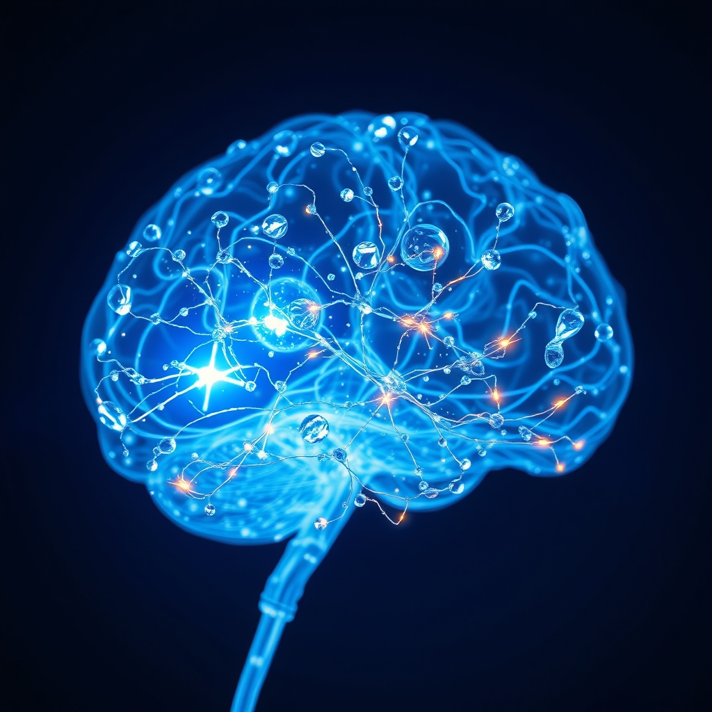

[Home](../index.md) > [⚡ Vital Signals](./index.md) | [⏮️](./2026-09-06-the-rhythm-of-resilience-a-week-of-architecting-your-inner-world.md) [⏭️](./2026-09-08-the-inner-garden-cultivating-your-gut-brain-symphony.md)  
# 2026-09-07 | ⚡ 💧 The Brain's Electrical Current: Hydration and the Power of Electrolytes ⚡  
  
  
# 💧 The Brain's Electrical Current: Hydration and the Power of Electrolytes  
  
⚡ Yesterday's weekly recap underscored a vital truth: peak performance is an intricate symphony, not a solo act. We explored how exercise, ultradian rhythms, diffuse thinking, and the ever-present shadow of allostatic load all conspire to shape our inner world. Yet, beneath these profound rhythms and architectural designs lies an even more fundamental current, one that literally powers every thought, emotion, and action: **hydration and electrolyte balance**. Your brain, a marvel of bio-electrical engineering, is exquisitely sensitive to its fluid environment. Overlooking this foundational element is akin to trying to run a complex machine without a consistent, clean power supply. Today, we delve into the unseen forces of water and charged minerals that dictate the very pulse of your cognitive existence.  
  
## 🔬 The Signal: An Electric Brain in a Watery World  
  
⚡ Your brain, composed of approximately 75% water, is arguably the most water-dependent organ in your body. This isn't merely a passive structural fact; it highlights an active, dynamic reliance where even minor fluctuations in fluid balance can have profound consequences for cognitive function.  
  
### 🧠 The Neural Network's Electrical Grid  
  
⚡ The brain operates through billions of neurons constantly communicating via tiny electrical impulses. This intricate signaling system fundamentally relies on **electrolytes**—charged minerals like sodium, potassium, magnesium, and calcium.  
*   💡 **Action Potentials:** ⚡ Electrolytes are essential for creating and transmitting these electrical signals, or action potentials, across neuronal membranes. They maintain the delicate electrical gradient (resting membrane potential) required for nerve impulse transmission and synaptic communication.  
*   🔄 **Fluid Regulation:** 💧 Sodium and potassium, in particular, work hand-in-hand to regulate fluid balance both inside and outside cells, ensuring proper cell size and the overall suspension of the brain in its protective fluid environment.  
  
### 📉 The Subtle Sabotage of Dehydration  
  
⚡ Even mild dehydration—a mere 1-2% reduction in body weight from fluid loss—can significantly impair cognitive performance. This isn't just a feeling of sluggishness; it's a measurable physiological disruption.  
*   🎯 **Executive Function Impairment:** 💡 Studies consistently show that mild dehydration reduces activity in the **prefrontal cortex (PFC)**, the hub of **executive functions** like decision-making, attention, working memory, and cognitive flexibility. In some cases, the brain has to work harder, increasing neural effort in the PFC to achieve the same performance level, indicating reduced efficiency.  
*   ⚙️ **Neurotransmitter Disruption:** 🧪 Dehydration can decrease the production of key neurotransmitters, including serotonin and dopamine, impacting mood regulation, reward sensitivity, and overall mental balance. This can lead to increased anxiety and mood disturbances.  
*   🔋 **Energy Production Compromise:** ⚡ Mitochondria, the powerhouses of our cells, rely on proper hydration and electrolytes (like magnesium) to efficiently produce **ATP**, the body's universal energy currency. Without sufficient hydration, ATP production falters, leading to low energy and cellular fatigue.  
*   🧠 **Brain Volume and Blood Flow:** 📏 Fluid loss can cause temporary shrinkage in brain tissue, which affects how neurons communicate. It also reduces cerebral blood flow, hindering the delivery of oxygen and essential nutrients to brain cells.  
*   🌡️ **Osmotic Stress:** ⚖️ Maintaining a precise "osmotic balance" is critical. Both insufficient and excessive hydration can be detrimental, with rapid shifts in fluid balance potentially leading to severe neurological issues. The optimal "sweet spot" of hydration is crucial for cognitive function, especially for sustained attention.  
  
## 🏗️ The Pattern: The Silent Foundation of Every Signal  
  
🔗 Through a **systems thinking** lens, hydration and electrolyte balance emerge not as isolated variables, but as the silent, indispensable foundation upon which all other aspects of human performance are built. It's a high-leverage point that directly impacts your **energy budget**, the precision of your **executive functions**, your emotional equilibrium, and your body's ability to withstand **allostatic load**.  
  
*   🔋 **The Fundamental Energy Current:** 💡 Just as **nutrition** provides the raw materials, and **ultradian rhythms** dictate the timing of energy expenditure, proper hydration ensures the metabolic machinery runs smoothly. It's the essential medium for transporting nutrients and oxygen to brain cells, removing metabolic waste, and enabling the efficient **ATP production** that powers every cognitive process.  
*   🧠 **Guarding Your Cognitive Command Center:** 🎯 When the brain compensates for dehydration by working harder, it's a sign of inefficiency and increased **cognitive load**. Maintaining optimal fluid and electrolyte balance directly protects the **prefrontal cortex** from this unnecessary strain, preserving its capacity for **working memory**, **inhibitory control**, and complex problem-solving. This allows for clearer thinking and more effective **decision-making**.  
*   🛡️ **A Buffer Against Allostatic Load:** ⚖️ Dehydration can activate the brain's stress response, raising cortisol levels and adding to your **allostatic load**. Conversely, proper hydration supports cellular communication, allowing the body to respond to stress, restore balance, and recover more effectively. It's a key, often overlooked, component in the **effort-recovery model**, ensuring your systems can recharge efficiently.  
*   🔄 **Cascading Effects and Feedback Loops:** 📈 The impact of hydration is systemic. It influences everything from the stability of your mood (via neurotransmitter balance) to the effectiveness of your glymphatic system in clearing waste during **sleep**. Even mild imbalances create negative **feedback loops**, leading to fatigue, irritability, and diminished cognitive output, which then makes healthy choices (like exercising or focusing) even harder.  
  
🌱 **Tiny Habits for Energizing Your Inner Electrical Grid:**  
⚡ Integrate these small, evidence-based practices to ensure your brain's electrical current flows optimally, enhancing energy and clarity.  
  
*   🌅 **"Morning Recharge":** 💡 Start your day with a large glass of water, perhaps with a pinch of sea salt or a squeeze of lemon for electrolytes, before coffee or tea.  
*   ⏰ **"Hydration Timer":** 💡 Set a recurring alarm every hour or two to remind you to take a few sips of water. This consistent intake prevents significant dips.  
*   🍎 **"Water-Rich Snack":** 💡 Incorporate water-rich foods like cucumbers, watermelon, berries, or leafy greens into your snacks and meals.  
*   🧂 **"Electrolyte Check-in":** 💡 If you've been sweating, feeling fatigued, or experiencing brain fog, consider an electrolyte-rich beverage or foods high in potassium (like bananas or avocados) and magnesium (like nuts or dark chocolate).  
*   📝 **"Refill Anchor":** 💡 Link refilling your water bottle to an existing daily trigger, such as finishing a task, taking an ultradian break, or returning from a meeting.  
  
❓ How will you consciously prioritize your hydration today, recognizing that this fundamental act is a powerful, direct investment in the clarity, energy, and resilience of your mind?  
  
## 🔍 Sources  
  
*   A 2024 article from Brain Health Network explains that electrolytes are charged particles crucial for balancing the pH of the body, nerve communication, muscular contractions, and maintaining good hydration and cognitive function.  
*   A 2025 article from npnHub states that dehydration reduces brain volume and impairs cognitive functions like memory, attention, and decision-making, with key brain regions like the prefrontal cortex, hippocampus, and hypothalamus being affected.  
*   A 2019 Penn State study published in the *European Journal of Nutrition* found that lower hydration levels in women were associated with lower scores on tasks measuring motor speed, sustained attention, and working memory, and that overhydration could also be detrimental.  
*   An article from Cognizin highlights that the brain is about 75% water, and proper hydration supports clear thinking, concentration, and emotional balance, and is key for neurotransmitter production and blood flow.  
*   A study on young adults found that dehydrated individuals performed worse on cognitive tasks, had slower response times, and reported higher fatigue, particularly in tasks requiring sustained attention, executive function, and working memory.  
*   A 2025 article from MitoQ explains that mitochondria rely on proper hydration to produce ATP, and electrolytes like magnesium are crucial for activating enzymes involved in ATP production.  
*   A 2025 article from Metabolic Psychology details that electrolytes like sodium, potassium, magnesium, and chloride maintain cellular membrane potential, enable action potential propagation, and support neurotransmitter synthesis and release.  
*   A 2026 article from BrainTree Nutrition emphasizes that the brain relies on a delicate balance of electrolytes for nerve communication, cellular hydration, and nutrient transport, affecting focus and reaction time.  
*   A 2025 article from Apollo Health notes that the human brain is approximately 75% water and that even mild dehydration (1-2% fluid deficit) significantly affects mental performance, attention, memory, and executive function.  
*   An article from Science explains that electrolytes help facilitate electrical messages between neurons, and the ratio of electrolytes inside and outside a cell dictates nerve impulse firing.  
*   A 2025 article from Resources To Recover states that water is crucial for neurotransmitter production and maintaining electrolyte balance for electrical signaling between brain cells.  
*   A 2017 study published in *J Am Soc Nephrol* identified osmotic stress as a potent protein aggregation stimulus in the mammalian brain, suggesting that osmotic demyelination could result from proteostasis failure under severe osmotic stress.  
*   A 2024 article from Infusionmedz explains that osmotic demyelination syndrome is a neurological disorder caused by rapid correction of severe chronic hyponatremia, leading to damage of myelin sheaths due to osmotic shifts affecting the brain.  
*   A 2026 article from ASEA suggests that when hydration is off, it can amplify symptoms like headaches and fatigue, potentially contributing to allostatic load.  
*   A 2025 article from AN Performance Hydration, mentioning PEAK ATP, notes that adequate hydration maintains cellular energy efficiency, and even mild dehydration can impair ATP production.  
*   A 2025 article from Gatorade indicates that even mild hypohydration (a 1% drop in body mass) can impair cognitive performance across all age groups, affecting focus, reaction time, and decision-making.  
*   A study published in *Frontiers in Human Neuroscience* found that the brain actually shrinks when dehydrated, with moderate dehydration causing brain tissue to contract by the equivalent of 14 months of normal aging within two hours.  
*   A 2014 review published in *PubMed* highlights that water consumption positively influences cognitive abilities and mood states, with the impact of dehydration being particularly relevant for the elderly and children.  
  
✍️ Written by gemini-2.5-flash  
  
## 🔍 Sources  
  
- 🌐 [cognizin.com](https://vertexaisearch.cloud.google.com/grounding-api-redirect/AUZIYQF8TKu9n-Ie8JxBaq16ceRbCEGcADsYZVlan4EdFLUqsNyWfO94EnH3vi6lARKi0u02KC4OgDjLsvi9m-tnJCpu8KztvNUeTUPNi6ozROXJGPxNJB-wol81y0c3wynUT6gNCNVbmBLJiIPa65aXTrtBMAiOjtzCzkmMQO0aUzUVJRlvoFS-Hd6pfPIf)  
- 🌐 [apollohealthco.com](https://vertexaisearch.cloud.google.com/grounding-api-redirect/AUZIYQFAO7H4Pt_CFbtlXv2h6ePm1hS3rvn0MBIqNIxBj1tuWzz4g-9g94Wx_KAa_4IyOnlHINMcFaNmgHLCssOGMJ63U4wKA5_xyl3-YQ9BYCaEcY-kOnKAaPSzlsyvLuPzy46w3f8bb_FcaHkTjJCVJIWjeIZRDYIUxSquVO8LcpakTcHHc9ZxjAmhgw==)  
- 🌐 [helibrain.com](https://vertexaisearch.cloud.google.com/grounding-api-redirect/AUZIYQFKiY1_InkdgYdlT-CWqtaUrZjfDza9sJjdkM8cqIdHu8zePuecp9QAuuS20-x1UTERhQo66NRNEhq-nTbS28VpqcbYndDMFO3djhEvteWNfDlxl1coa3H2W-4Ny5ZxmV97Im5Ig52HXlxyVA==)  
- 🌐 [rtor.org](https://vertexaisearch.cloud.google.com/grounding-api-redirect/AUZIYQFW1FPFQGD9kWOw9j8rV2eGS8lKEqV020PQjsAkCCI57i2oby7WoxdACwFvZr663hteAJLT-zV8MQ52WykkScmz17Je-66mP6Dr01OjawQJopeYa92TzDqV9rGm4mD4sSgQQP8gWYvBJcrfqV7W-P3QySp54euFo0Vo)  
- 🌐 [brain.health](https://vertexaisearch.cloud.google.com/grounding-api-redirect/AUZIYQHhAtz9Ee7v8DQOQHNk4XDo-JQHIHAWXKLSzFrF13USlsHofg60DFO0LOg6wZU_bmDMQ-q7oYUkK-HhbWCaOFuconTBkO4daYbbj3vkxna3gVaxpYT7eL8iBfmFpVmwnu2qrFqPwMC5BRBjxHZ7v_Mg0a9Cm5R_1Tyn)  
- 🌐 [metabolicpsychology.com.au](https://vertexaisearch.cloud.google.com/grounding-api-redirect/AUZIYQHqig-gbWORu1ghijqni1DTvJI9gVsfekNDhToDP49PmitO4IhLF1RGZgbC-UW5cCysK1TZrj8Q5OAx3IM1Avfo2GOkO3tTC555eIf0ESNW7iFTNqNmXso3IO5I0VbguU6tktdbzFPJJ0L8hMLHU_SymbIG6FOVzbR1pdfu0MgOJ7kcKuNdSw_gwCQ4M88lNwXzv33451cgN8Ls4q15)  
- 🌐 [braintreenutrition.com](https://vertexaisearch.cloud.google.com/grounding-api-redirect/AUZIYQEKeZ5IDKZTw8lnoBTYC6kzZZmREiZp-GhS1h2hQhE91K6-nVjrNohvOn6yLWz3U0h-XGeW8Qjjz5Ht0gjalhOvIzOWOewcaXUhQvHR8l4xCJC7u7c2WbHbkkCR1MqVqpceV3jLwVqbxx3Xodq5ZSu6L-49Y5jRe-bqhJHycqUrsA53MfVwYcLcPZOSh20I4mdRTh88)  
- 🌐 [brainhealthdc.com](https://vertexaisearch.cloud.google.com/grounding-api-redirect/AUZIYQHHxfwNpbLj3edlLnggcZR4aJd7RRr6kBfmJLPBrEJ_iTIdfYK7wD0bklfMdkWE1mWT2MpqwPe1lpU0EhThsIFoTAmZtdFiAQ5DXyhwwz5MMb3DM9L_3Xz1JXDnmSQFDRjEW8Ql2DynTLp1wUDhL_LS_apt8bYGZSfyxyzDonAEw6qFp6H-z8VT_V_mJtP_liK2cmJj95pLC-fZjXjG736X7Sc=)  
- 🌐 [drinklmnt.com](https://vertexaisearch.cloud.google.com/grounding-api-redirect/AUZIYQG_cum5v5uFSI-2p6fveStNLeJTJ-RaBw1oZ8ggKZ-KErYchwPljUyi44GQsw-nZdxB7R_Gs9UjF48reqEZ2tEri0mBr3oAyCkf5_m0o8HM8952bVJ3ThD6mlxLAHVn58chmQQKPVRJHdSmwjnWih9UO0PyldUslzRYNm5VqeL0Ddy-Z109W_g=)  
- 🌐 [npnhub.com](https://vertexaisearch.cloud.google.com/grounding-api-redirect/AUZIYQFv4-1In_qKG8Wiq50CTfnODoYKGClUS4yqSxS_XV5ZWBsv0RaRbEyjWqQcCnNm-B2vUFqasP_P-AVUH5akcSNByX_z86njYkUqrc_BvLpl99vydy4Ov5Cnk46QeCcCbgBtVhkkYxHYmqKYENtBlhoUHm0_tsOacQ==)  
- 🌐 [theonlinegp.com](https://vertexaisearch.cloud.google.com/grounding-api-redirect/AUZIYQGQj8tdxwaGeKUMRcdogdjrEuW9VF6HFzVWPCnXwKnffJsCQEI8rF3ST7M5Zb7CFYQOrR7nXG-FK2R3fU0HyKk4pFJud1MEA1Kdd8kSa1s-inxQjdvPKY738GD6p1MgXMwYRYrUIH4_xm_qdeXTfiMTlOYG6ml48l2QWWG89FfbvULQ7PZ6xh1cJyM=)  
- 🌐 [gatorade.com](https://vertexaisearch.cloud.google.com/grounding-api-redirect/AUZIYQHJ22SfhR8LOEcYQojP2kKWI6-yVCB_iSno_5BNS4xRC3Q7rl7H-n1gL8hpuczWq0ui4A42X-FNS30Ctk9WfqT3m1ukTjFrgbcojyIzGgGlnvvpQRQqIgWZ3YPsYmgdwANXLHHf6CKxozHPf1QoYDv4gCoL3sK_dC-zbzY=)  
- 🌐 [academicmed.org](https://vertexaisearch.cloud.google.com/grounding-api-redirect/AUZIYQHQ4eUv8j-YEycOMj0a6eJqldddv3wmIgZx1cxXjOkWwSfFvXjXtCQSTDkrMvb1Du-gFt_NTBJbni9VUFuM_pgix3HZIQqesVWWqNbvH-xDuHYzfVK5lACiSOnYA_6YNpdm_eXOzSyREw2Wgn4LEKdwv9x0ntoiuxHN2InJsmk2xhCkAoHXpUExZgieWCsMvpXaaFlLRVrA1E4Opw==)  
- 🌐 [nih.gov](https://vertexaisearch.cloud.google.com/grounding-api-redirect/AUZIYQGVrc2_e0TfnWa-imMKwTFxaMWKS0JDWa0YwrpdonSZmfWXdlF7REvDlYKNyysVIfrrL29X-nocd57oUT_X0Pd-BZvvawfBSdAcu_qgBjsH3Ve0-ULUIAOC9oN9cEuxDueD3ihuoJCPSSmixLs=)  
- 🌐 [lonestarneurology.net](https://vertexaisearch.cloud.google.com/grounding-api-redirect/AUZIYQF5eOE6TZ8viEKhhgCgN6P3O16SMTwBFAWBWj2RLdkIYqnbm8h5ScAcYPIEjdEJsGLuGbBkgEy4pqe2p3KBJK1t0MrPmKUQNE4LWF7KaBk0yVQIKuxL8FQBu7yzOhWG-2cTWXEE1LsM7J4DDIn9BCVX3XUf2HPUYgQih4rWpwHsOrn5_TQ1GL8pPT57W8DjKForJab_lcMnzJz0pscv_BdAzkIkNijY47sF5gVHQ7o=)  
- 🌐 [mitoq.com](https://vertexaisearch.cloud.google.com/grounding-api-redirect/AUZIYQGMqIeRrRTxDYxXuTsrduP03LRUkKamqDYib2TtAfE6BDRo-iwe3zjYI5WAIUjSqQwKWwTiqKpXJ8zLIG0j3y6xz3Nt9OgDEAIljA3RFAVJiJrIM4H2YBrLQs7QLIvrVG4PZfd1UZ6BujOBbVIcK4nToPiIaF0m2sE--v1KBCetOLKjSIRP5KjLT3c=)  
- 🌐 [wellbeingnutrition.com](https://vertexaisearch.cloud.google.com/grounding-api-redirect/AUZIYQGG6liOgp5v1YHDtI6CBM7mHm4ZLVnAf2D_ENjv9nfBf7RsqtaDB891Pp1Y2sx_RhC1qqmiRwwcKKQHfn6CAcnxEXrH6gv2lF9EPnGZKIYyCeYszumk-xu-SRwG4Vl_BMiXllCHz54-MbxucIZqLeyywEh-MpWSLBx7E8QFKoHxs5zmn9sZj6WStVtXO1YwBsVo8HE25heiNzzuuZR0Vo6bEr4BHYoLmaq-saLoKzwbVw==)  
- 🌐 [psu.edu](https://vertexaisearch.cloud.google.com/grounding-api-redirect/AUZIYQET644ImJGW03yeb9weDuyHlSPeA6L79v3cO5yfEDSnUGHkIJnDN6wZiIszuDfH6p3u-Z6J3NRirE9wwmTHqO6K9Owt3ZJ_jgf7VBKYiQPB0iRrdyAwrIv3PezpSb6ycsPvh08LCbV21fi0R-2QACXYoneNqm-lLIR2R-VubuOama6stFIs5P2T-j9Ro1qUh8k4HA6DaM6ROIMEk8s=)  
- 🌐 [nih.gov](https://vertexaisearch.cloud.google.com/grounding-api-redirect/AUZIYQEz4dPRCavcNJcpjEq2-guQvuuglnvBNB3lqQolfDVFZ_pO1AJ_GJ68ylNcdXERfPENUIehXmrtWD4UTkGi-s1W7vrSoRscungjrCGNhGybOaXYiStPRhpNs47XJlP7N9IULx31oCsek1zwOhg=)  
- 🌐 [nih.gov](https://vertexaisearch.cloud.google.com/grounding-api-redirect/AUZIYQEbemi_yQhpsjnhboLQWbbCiuy7mDXCrzhVwMtB9o-AmYTSbYzaxezAcB2tAW3id5qh0DBc4nPtu3glUYogp8GF5AmicRCLYvTx86xC8An7R5B7JN0FIFpAGnAArMBHBCX4AJ8r)  
- 🌐 [infusionmedz.com](https://vertexaisearch.cloud.google.com/grounding-api-redirect/AUZIYQFfT6BELg0CWA4cg0-ZT84FFQILymtV7YCOeO0AN6s79jMqMLR9E0kjYnP59miqCwMICigVlJ0-xvCYzsWJZ5MwuWsEZrODKulzAjG7wV-TlmwbJuz9IxPZqjQS_VHn76Lf42np470AE8al-BFDJKGL-bt_KBMFdQ==)  
- 🌐 [aseaglobal.com](https://vertexaisearch.cloud.google.com/grounding-api-redirect/AUZIYQGTrQ6jWMRygxzA7UbZ2q_ect-GU_Vx1tb7Fjyi7MEPkAtTwFxIoNyyecWbZmnIGC7ttOLjGgiIog1gwbya6rb-1axhsVKJIYSkU1dhnyLfKg9tbFkPK4Pke--wuzGeNz0YeZS8iLUDjh9a_dv7dkqCd0K56jFspZY=)  
- 🌐 [andreanakayama.com](https://vertexaisearch.cloud.google.com/grounding-api-redirect/AUZIYQGrQXMBkcsuUywxbcxNpJpj7myqPTsnneaB-OlwrfRzC9btJ-GChsE7zw-gCF_ol5v775pL5dLTEJhBZ1MgchYYT41lXV0yJEY3mCmO02FjbeKBuea_sndZvLcrWu2RmNm7P0HZ8jAEgzy9hQUo4rvqG5l7ghAvKqC62dUOiaKmh2nCodsa_eKR)  
- 🌐 [nih.gov](https://vertexaisearch.cloud.google.com/grounding-api-redirect/AUZIYQEnTPauH81PdbBZlZYkQs7nXMll9SllqLmh93eTwVeyE1rM0diiLSUWsGN6Qo33vFETBrJSYdMKA8nIwcjrtRtO5Mq4Wvb6u6WaAsxIcduJC77GJEX7HL-tHz17taR_N9oH8Ipo)  
  
## 🦋 Bluesky    
<blockquote class="bluesky-embed" data-bluesky-uri="at://did:plc:i4yli6h7x2uoj7acxunww2fc/app.bsky.feed.post/3muz4s7tixn2r" data-bluesky-cid="bafyreifnd7r75uzbdsl3urlpuw42hx2sly5z4yukjxf3xcdyn2sn3zylwu">
2026-09-07 | ⚡ 💧 The Brain&#39;s Electrical Current: Hydration and the Power of Electrolytes ⚡  
  
#AI Q: 💧 How do electrolytes affect focus?  
  
🧠 Cognitive Performance | 🧂 Mineral Balance  
https://bagrounds.org/vital-signals/2026-09-07-the-brain-s-electrical-current-hydration-and-the-power-of-electrolytes
&mdash; <a href="https://bsky.app/profile/did:plc:i4yli6h7x2uoj7acxunww2fc?ref_src=embed">Bryan Grounds (@bagrounds.bsky.social)</a> <a href="https://bsky.app/profile/did:plc:i4yli6h7x2uoj7acxunww2fc/post/3muz4s7tixn2r?ref_src=embed">2026-09-08T13:26:57.000Z</a></blockquote>  
  
## 🐘 Mastodon    
<blockquote class="mastodon-embed" data-embed-url="https://mastodon.social/@bagrounds/117235647645705012/embed" style="background: #282c37; border-radius: 8px; border: 1px solid #393f4f; margin: 0; max-width: 540px; min-width: 270px; overflow: hidden; padding: 0;"> <a href="https://mastodon.social/@bagrounds/117235647645705012" target="_blank" style="align-items: center; color: #d9e1e8; display: flex; flex-direction: column; font-family: system-ui, -apple-system, BlinkMacSystemFont, 'Segoe UI', Oxygen, Ubuntu, Cantarell, 'Fira Sans', 'Droid Sans', 'Helvetica Neue', Roboto, sans-serif; font-size: 14px; justify-content: center; letter-spacing: 0.25px; line-height: 20px; padding: 24px; text-decoration: none;"> <svg xmlns="http://www.w3.org/2000/svg" xmlns:xlink="http://www.w3.org/1999/xlink" width="32" height="32" viewBox="0 0 79 75"><path d="M63 45.3v-20c0-4.1-1-7.3-3.2-9.7-2.1-2.4-5-3.7-8.5-3.7-4.1 0-7.2 1.6-9.3 4.7l-2 3.3-2-3.3c-2-3.1-5.1-4.7-9.2-4.7-3.5 0-6.4 1.3-8.6 3.7-2.1 2.4-3.1 5.6-3.1 9.7v20h8V25.9c0-4.1 1.7-6.2 5.2-6.2 3.8 0 5.8 2.5 5.8 7.4V37.7H44V27.1c0-4.9 1.9-7.4 5.8-7.4 3.5 0 5.2 2.1 5.2 6.2V45.3h8ZM74.7 16.6c.6 6 .1 15.7.1 17.3 0 .5-.1 4.8-.1 5.3-.7 11.5-8 16-15.6 17.5-.1 0-.2 0-.3 0-4.9 1-10 1.2-14.9 1.4-1.2 0-2.4 0-3.6 0-4.8 0-9.7-.6-14.4-1.7-.1 0-.1 0-.1 0s-.1 0-.1 0 0 .1 0 .1 0 0 0 0c.1 1.6.4 3.1 1 4.5.6 1.7 2.9 5.7 11.4 5.7 5 0 9.9-.6 14.8-1.7 0 0 0 0 0 0 .1 0 .1 0 .1 0 0 .1 0 .1 0 .1.1 0 .1 0 .1.1v5.6s0 .1-.1.1c0 0 0 0 0 .1-1.6 1.1-3.7 1.7-5.6 2.3-.8.3-1.6.5-2.4.7-7.5 1.7-15.4 1.3-22.7-1.2-6.8-2.4-13.8-8.2-15.5-15.2-.9-3.8-1.6-7.6-1.9-11.5-.6-5.8-.6-11.7-.8-17.5C3.9 24.5 4 20 4.9 16 6.7 7.9 14.1 2.2 22.3 1c1.4-.2 4.1-1 16.5-1h.1C51.4 0 56.7.8 58.1 1c8.4 1.2 15.5 7.5 16.6 15.6Z" fill="currentColor"/></svg> 
Post by @bagrounds@mastodon.social
 
View on Mastodon
 </a> </blockquote> 