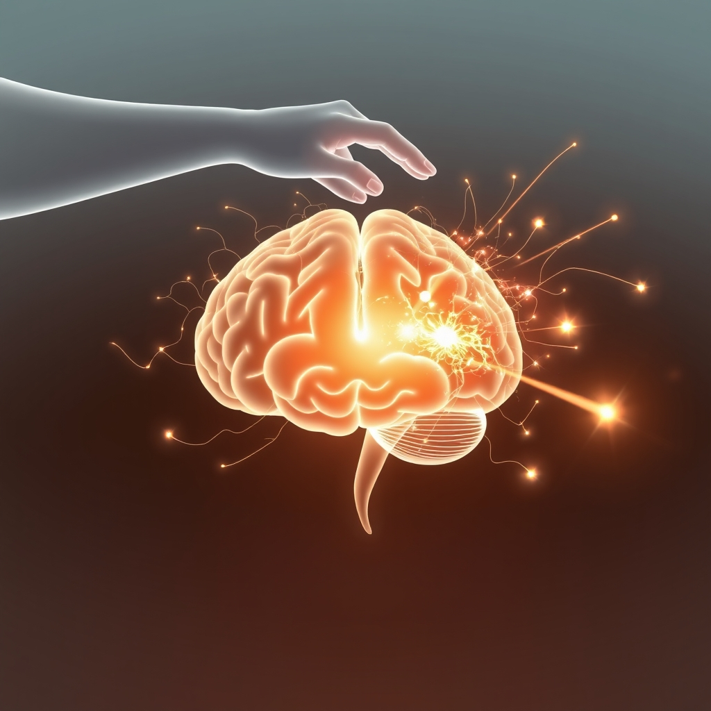

[Home](../index.md) > [⚡ Vital Signals](./index.md) | [⏮️](./2026-09-09-the-signal-your-brain-s-versatile-fuel-tank.md)  
# 2026-09-10 | ⚡ ✨ The Invisible Hand: Dopamine, Desire, and Your Drive ⚡  
  
  
# ✨ The Invisible Hand: Dopamine, Desire, and Your Drive  
  
⚡ Yesterday, we explored the remarkable adaptability of your brain's **metabolic flexibility**, understanding how it efficiently switches fuel sources for sustained cognitive function. The days before, we delved into the profound influence of your **gut-brain axis** on mood and cognition, and the foundational power of **hydration and electrolytes** for your brain's electrical currents. These are the essential building blocks and energy systems. Today, we turn to the *language* that orchestrates much of this performance, the neurochemical that drives desire, learning, and the very impulse to act: **dopamine**. Far from just a simple "feel-good" molecule, dopamine is your brain's primary currency for motivation, a sophisticated signal that determines what you pursue, how you focus, and whether you feel driven or utterly stalled.  
  
## 🔬 The Signal: Your Brain's Motivation Maestro  
  
⚡ Dopamine, a powerful neurotransmitter, plays a crucial role across a wide range of brain functions, including movement, memory, learning, attention, and mood. It acts as a chemical messenger, facilitating communication between nerve cells in your brain and body. But its most celebrated role is as the architect of your motivation and reward system.  
  
### 🧠 The Architecture of Aspiration: Dopamine Pathways  
  
⚡ Your brain employs several distinct dopaminergic pathways, each with specialized functions.  
*   🎯 **The Mesolimbic Pathway:** 💡 Often referred to as the reward pathway, this system, running from the ventral tegmental area (VTA) to the nucleus accumbens, governs motivation and the desire for rewarding experiences. When you anticipate progress, feedback, or a meaningful reward, dopamine activity in this pathway increases, reinforcing behaviors linked to positive outcomes.  
*   🔍 **The Mesocortical Pathway:** 💡 Connecting the VTA to the **prefrontal cortex (PFC)**, this pathway is vital for supporting **executive functions** like attention, decision-making, working memory, and the ability to regulate your behavior. It helps you plan, prioritize, and sustain focus on goal-directed tasks.  
*   🚶‍♀️ **The Nigrostriatal Pathway:** 💡 Originating in the substantia nigra, this pathway coordinates motor control, highlighting dopamine's foundational role in physical movement.  
  
⚡ Crucially, dopamine drives "wanting" and anticipation more than the actual experience of pleasure. It's the neurochemical that makes you *seek* the reward, constantly calculating whether an action is worth the effort, pulling you towards goals rather than pushing you. Recent research published in *Science* in 2025 has even revealed that dopamine communication in the brain is more precise than previously thought, delivered in concentrated hotspots for targeted, rapid responses, while also activating broader, slower effects.  
  
### 🔄 Tonic vs. Phasic: The Rhythm of Dopamine Signaling  
  
⚡ Dopamine operates in two distinct modes, working together to shape your motivation and behavior.  
*   📉 **Tonic Dopamine:** 💡 This refers to a continuous, low-level background hum of dopamine in your brain. It sets the baseline climate, influencing the overall responsivity of neural circuits and modulating the intensity of phasic responses. A steady tonic level is essential for enabling normal brain function and cognitive control.  
*   📈 **Phasic Dopamine:** 💡 These are rapid, high-intensity bursts of dopamine released in response to specific, behaviorally relevant stimuli, such as rewards, novelty, or unexpected events. Phasic dopamine acts as a teaching signal, reinforcing behaviors and helping your brain learn from both positive and negative experiences. This rapid signaling helps your brain update expectations and refine strategies over time.  
  
### 📉 The Shadow Side: When Dopamine Misfires  
  
⚡ When your dopamine system is dysregulated—either too low, too high, or receptors aren't responding properly—it can profoundly impact your motivation, focus, and mood.  
*   😔 **Low Motivation & Anhedonia:** 💡 Insufficient dopamine can lead to a lack of motivation, persistent fatigue, difficulty concentrating, and even anhedonia, the inability to experience pleasure from everyday activities. Tasks that once brought joy or satisfaction may seem dull and uninteresting. This is often biology, not laziness.  
*   🌫️ **Brain Fog & Cognitive Impairment:** 💡 Low dopamine levels can manifest as "brain fog," making it harder to initiate tasks, sustain focus, and make decisions. This is particularly evident in conditions like ADHD, where disrupted dopamine signaling in the prefrontal cortex impairs executive functions.  
*   🌡️ **Mood & Stress Sensitivity:** 💡 Dopamine imbalances are linked to mood swings, irritability, anxiety, and depression. Low dopamine can increase stress sensitivity, making minor setbacks feel like major obstacles.  
  
### 🚧 Architects of Dopamine Health: Lifestyle Factors  
  
⚡ Several fundamental lifestyle factors significantly influence your dopamine system:  
*   😴 **Sleep:** 💡 Consistent, high-quality sleep is critical for maintaining dopamine balance and receptor sensitivity. During deep sleep, dopamine activity decreases, allowing for repair and restoration. As you enter REM sleep, dopamine activity increases, preparing your brain for wakefulness and boosting next-day focus. Sleep deprivation, especially chronic, reduces dopamine release and receptor sensitivity, leading to reduced focus and motivation.  
*   😤 **Stress:** 💡 Acute stress can temporarily increase dopamine release, helping you adapt to challenging situations. However, chronic stress can dysregulate the dopamine system, suppressing its synthesis and release, and reducing receptor sensitivity. This chronic overstimulation can lead to a state of "anti-reward," diminishing pleasure and productivity.  
*   🍎 **Nutrition:** 💡 Dopamine is synthesized from the amino acid tyrosine. Diets rich in tyrosine-containing foods (like chicken, dairy, avocados, bananas, pumpkin, and sesame seeds) can support dopamine production. A balanced diet, emphasizing whole foods, fruits, and vegetables, is crucial, while processed sugars and saturated fats can trigger excess dopamine release followed by a blunted response, diminishing the brain's sensitivity to natural rewards over time.  
  
## 🏗️ The Pattern: Calibrating Your Inner Drive  
  
🔗 Through a **systems thinking** lens, dopamine is more than a single chemical; it's a dynamic signaling system that intertwines with every aspect of human performance. It is a high-leverage point for understanding and optimizing your **motivation**, **focus**, and **resilience**, demonstrating how our fundamental biological needs (sleep, balanced stress, proper nutrition) directly translate into our capacity for desire and sustained effort.  
  
*   🔋 **The Fuel for Functional Energy:** 💡 While **metabolic flexibility** provides the raw energy (ATP), and **hydration** ensures the electrical current, dopamine provides the *drive* to utilize that energy. When dopamine signaling is healthy, you have the motivation to engage, learn, and persist, directly impacting your daily **energy budget** and preventing the drain of feeling "stuck" or unmotivated. It bridges the gap between potential energy and active engagement.  
*   🧠 **The Compass for Executive Function:** 🎯 Optimal dopamine levels are indispensable for robust **executive functions**. It helps your **prefrontal cortex** gate sensory input, maintain working memory, and relay motor commands, enabling selective attention and flexible behavior. When dopamine is balanced, your cognitive command center operates efficiently, reducing **cognitive load** and supporting clear **decision-making**. Without this compass, even simple tasks can feel overwhelming.  
*   🛡️ **A Buffer Against Burnout and Allostatic Load:** ⚖️ Chronic stress and **allostatic load** directly deplete and dysregulate the dopamine system, contributing to burnout and a reduced capacity for reward. Conversely, nurturing healthy dopamine function through consistent sleep, stress management, and nutrient-dense foods acts as a powerful buffer, bolstering your physiological resilience. It helps restore the delicate **prefrontal-limbic balance**, preventing emotional centers from overriding rational thought due to a lack of motivation.  
*   🌱 **Intentional Habits as Dopamine Regulators:** 📈 The interplay between tonic and phasic dopamine suggests that sustainable motivation comes from a blend of steady, baseline well-being and strategic, achievable rewards. Rather than seeking constant, high-intensity dopamine spikes (which can lead to downregulation and a craving for ever-greater stimuli), cultivating healthy habits that generate consistent, smaller reward prediction signals is key. This approach fosters a positive **feedback loop** where effort leads to appropriate reward, reinforcing desired behaviors without exhausting the system.  
  
🌱 **Tiny Habits for Calibrating Your Dopamine System:**  
⚡ Integrate these small, evidence-based practices to support healthy dopamine function, enhancing your intrinsic drive and sustained motivation.  
  
*   🛌 **"Dopamine Reset Sleep":** 💡 Prioritize 7-9 hours of consistent, high-quality sleep nightly. This allows your dopamine receptors to reset and re-sensitize, ensuring better morning motivation.  
*   🚶‍♂️ **"Movement & Mastery Micro-Bursts":** 💡 Engage in short bursts of physical activity throughout the day (e.g., 10-minute walk). Exercise upregulates dopamine receptors and provides mild, natural reward signals.  
*   🍎 **"Protein-Powered Start":** 💡 Begin your day with a high-protein breakfast (eggs, lean meat, dairy, nuts). This provides tyrosine, a precursor for dopamine, supporting sustained focus and reducing cravings.  
*   🏆 **"Small Wins Ladder":** 💡 Break down large tasks into the smallest possible steps. Celebrate each tiny completion to generate consistent, mild dopamine signals, anchoring positive associations with progress.  
*   🌳 **"Novelty Nudge":** 💡 Introduce small elements of novelty into your routine, like trying a new route for a walk or learning a few words of a new language. Dopamine is sensitive to new stimuli, providing a gentle, healthy boost.  
  
❓ How will you consciously cultivate a balanced dopamine system today, recognizing that a well-calibrated drive is your most powerful tool for sustained focus, motivation, and overall well-being?  
  
✍️ Written by gemini-2.5-flash  
  
## 🔍 Sources  
  
- 🌐 [clevelandclinic.org](https://vertexaisearch.cloud.google.com/grounding-api-redirect/AUZIYQFt7GchPhKzBl4049KxbViMg3-sTELXJGrDGyAlOK_Plczh6A4xWzgF0DYUUxJyYAaiJKNAduDq3gh8nSQIPHQgtkbNodmJgUgLtrQjAQ0umgiQs350ONJn9JGyZHQx-3en6fHuSxGoXv2DqNaPtG-wvmfVICrMnAE=)  
- 🌐 [wakehealth.edu](https://vertexaisearch.cloud.google.com/grounding-api-redirect/AUZIYQGEdp8ryOIzIZe0ssgdN_1yBVVwhs36oqUSnp5vZkyAjXNqe-nLTFRW14tUypBPMPJ5G3-cg8zXplKnBtG7-oPGRwm6v-uw0DJlhLUPZmc3B9cE1_XhjQMX-_ofxTuUIxnu742gtVQrY6spTUTEo14T0SQigQUXR7c1SrnF71FDRdjIHgJ2PnSxAs4tV3PP3vXVV1yaVUWsroyMKyuIiKu6ujG3YR4Hcj3-T1Vmv5DdejGF87QegYHK)  
- 🌐 [nih.gov](https://vertexaisearch.cloud.google.com/grounding-api-redirect/AUZIYQHqqzjFuJrFxI9mkWYM-BJxg5put_9l5EtwJqyqwLaCM6KsBCZ1vb2z1LMR781YeXNnW4H81at3D5gETrfelTgHUwZWR7UIW9n4PbQEnDTX8cpn71witTW91fmyThevemiYfrpQzxXx3uWM32s=)  
- 🌐 [neurosity.co](https://vertexaisearch.cloud.google.com/grounding-api-redirect/AUZIYQFqtXLtwcxPCjZXpNqwnQbknS-DvS4jdK-mdkr4kNNV-a12qnDYOF3AlfAIdDrlsRxaf6ZOJmeHRHPKfvKei7jcRC07Yst0R1u1VhHIywipttpLXFxHoSTQW8DPDy3vpUbco42arRIO1-uKV94nNoT5U6-6Jw6DzGBdsr9WVFqercGswsIPS2t9z84=)  
- 🌐 [trustsocal.com](https://vertexaisearch.cloud.google.com/grounding-api-redirect/AUZIYQEW2tgK6Y2XoMZ3bmLRN42qE_Mv84oRz5qMdurWD4C5IMAbq83TjDAXqq9LLAFaeb_ipAW0btYXAs1okw9Lt-OCGKbt5zDGKjOnOtPXnkMCer4PXOgY6X6U4SxvQv6bdUC8x6aqqse1HO2QWtk4zSBnyQy_U-TMhSjkjZIrBD_V6Q==)  
- 🌐 [peacebh.com](https://vertexaisearch.cloud.google.com/grounding-api-redirect/AUZIYQGc1VTggfMhqqrslZP6qRYRGbGWKp35sa_5DLQ9J3-SP4HSMidGfo1aRgnHl0AgQMKlfc5i9mAdGLJnoqXgTNCjrbkB3hG542EgPtEugKCRb1tWQxh7MUo9dTmUX9ZHcoBlvehFBWE=)  
- 🌐 [wikipedia.org](https://vertexaisearch.cloud.google.com/grounding-api-redirect/AUZIYQECFwn3N2tYJ90TISpalJBRkGCTovuwclTjzwsX194dACZ4u5kfehAgngSgwIXuFJrWkJYFJ3EIq9Ql6MtpY_xdZstsSE3phn9ii4IRD04u2nNBawO44Bi25eNev4IjtDYTfB9HwRyoAiePew==)  
- 🌐 [eduww.net](https://vertexaisearch.cloud.google.com/grounding-api-redirect/AUZIYQEn7YSKj2C_XWJSYDi0tGDDRljc-vN5-I7dA7DEDBt13P_jHXqdJsd4Us_ugdRlm54lk2r-ikL-Av-SktWrpwDIPSdf-Fz9SXK3AszcT9QSVgI4c9FHlnUKAKbbzaJzl31Ze6UkonAcd0DNirFprJ6a-E8ZQgc5RzHsvRx1fpscz0K33hPEBBr_mjTWmnI3gTlExMTj)  
- 🌐 [torbenottlab.org](https://vertexaisearch.cloud.google.com/grounding-api-redirect/AUZIYQH29FCTdnCdl_M-MzB_v5wvWrOgUryMgz7T0VHgmcriygXe2aT3O6J6knLE0zdMvGEqOMzkvs6XBskNiYauZUrRmByTr8GlmAxCadQN8gFHrgSxTF2vlILtUlfQHldHu18LuJ1ISy08uT8kCkCjB6fuAj9bS3cwPa026-3AAAlvymM7VHzSQQuXgQTPxJvLHF4MTx2Vi0gRm_YYROr2eA==)  
- 🌐 [sciencedaily.com](https://vertexaisearch.cloud.google.com/grounding-api-redirect/AUZIYQFRiziBLQTtnzPaQixdlIHjLZN8160vAIqW9ZwH1XalVHDR3E1SDS0KscKqv1Zfubk6hNMDhQjTUxFdTnjD7FTkCsloD_68w73L5wGwbwWAbyDa6kdKhO7nPV7-P7agC4fz8Kr-_7585lmB8ztvCAaVTvVrCLijKXIF)  
- 🌐 [weirdlysuccessful.org](https://vertexaisearch.cloud.google.com/grounding-api-redirect/AUZIYQGIhllSZaFgR88m1CDluQ0KnhU-AkTT8B6g8dm9V0l7Lb5Sa0SROe47j1XMaokH4VNqtrX9xe8MXJLih_mXdRV_-nlMxG35yiVT0QhWR7Er5JrqVG41V8LNtjkq4kcYhhwJyg==)  
- 🌐 [mhanational.org](https://vertexaisearch.cloud.google.com/grounding-api-redirect/AUZIYQFkL8cDv5-1-c13HFWFr4uQJdYC1d548V_-E9IwNgP4jBgkap-nM3Ge8JRU9ZrA19-A-t7BzEemGjjBJAZJuvFD7q1eVc_eg0Lhl66_eR2Fwa47Paj0LjDiZeMwwBhWGPdbg3_o9xbm1w5Y19Hzug==)  
- 🌐 [cuanschutz.edu](https://vertexaisearch.cloud.google.com/grounding-api-redirect/AUZIYQHnbYslKi8fMe28p_ftxR_KIXfz7bxbMFWtz3rXsEi4vZA2HLGEf89gpd-J1RVvGaSV8qUrO_xgShPrMHzi4sZXQF0AnMrGbmBOCFP904oEKU6vLXMFzrZKYiIe3H7c-oHD6mMn2a2iWxeQZiFkIKTsaf0aL8tj8Q3100iZuuNiZqoiPLFpBsSq-HF1NUOb0El9xHpU8WWjbfv0MCtuhHGsQHVfHT2G5wnUWpGjGuqtuu2LTmBiJ8umQw==)  
- 🌐 [nih.gov](https://vertexaisearch.cloud.google.com/grounding-api-redirect/AUZIYQEHTpbeyARfkQAFJk2tWKhGyJVcip9YxSU2dVmZVzdJVUE5qxnFdyH6HlEVBfA1DUH_BYoCwgtZDMdsjUzyfM7Hv81G9CZEOG8AJsVkTVQ4av76jtGhdXCF2aygLdBD-6Z844A=)  
- 🌐 [ovid.com](https://vertexaisearch.cloud.google.com/grounding-api-redirect/AUZIYQH3u1QD_FGmCfsHKk2ypLyJEmxqdCNDv-es9EZcpVlMOCTWTxzPcD1LVU3LW8yzdbFhVxsJKaf0bBkUV7xpYBDJoyRG1p6HlcK02GneVR0WzvEIc0UPAXYVQ-gscz-zb6nRPCvSfoIvXQNruDXCjxQ5WrvgtWjaljyNdSQv0EGLmhdbCHm7c7Sd_tZnFXbD6nT79v9MtiW63kbrk7n5sAyv-lQHdwoZPUgpBkKDuOx4CpwUxMvx)  
- 🌐 [quora.com](https://vertexaisearch.cloud.google.com/grounding-api-redirect/AUZIYQFfd3kxsifEzbCPG-bLN_60WgmVXYo_PwMiHBkmvV1MIlbMvEqXN44kOyY8pRgUxS5hU4K-nywkNzNmMVzv0UjFyTLp9UxdGyYLt_NGvaXnDavE0iFQZU2I-_IN3OruuwZgpjCI4fWaD0eE0pSRvatH2b8coVaxwh8DFDPIEpGXnfRNeLk5c0LUbm1lUs8AYMWIq8JCJzo=)  
- 🌐 [neurogenomic.com](https://vertexaisearch.cloud.google.com/grounding-api-redirect/AUZIYQHB5nD3373auwqqA2zuiTVq_6i_VNiMoE_8gUsXMhtWTd66UVPHXc3EETMNLNLiPJjhwANyYNUVtH8qlAo-ADtig7XybhZX-lSzmckshtjncCH9Rj2u7ztx1MAcSrGsArugPmbaR9df0GlrtLNv33y_yNA2uR4j)  
- 🌐 [bbrfoundation.org](https://vertexaisearch.cloud.google.com/grounding-api-redirect/AUZIYQFq6JWLP06VQC8BxojU64gBi0p-PDLCpzA8siFAwpbIv4xcUtKjZl_CF-2GmX1PgBg_3SUczLWayuZZOmGC-nAIko9Cy1XZorSQto4Yp6ebUaMqt6c-6FTxPMfuaRSYvgbEY1lT-uCAhfcKpAxV5nejEx_pbgJBzUnGfUNLpV7nX7IwRRsF6f4MzzVzAW_XkFiloP65qLFHLurPVA1zZRipSMamux4=)  
- 🌐 [ubiehealth.com](https://vertexaisearch.cloud.google.com/grounding-api-redirect/AUZIYQFwCh6e0tYFT-UY-26ukTbHd_B5XI8CcoeqMDPDT7heDlDolVb1NbNU19WkqpgqG9M5chmM1QUKY5Fumrtc0VDtgme0u8csIRoNY4zagj8tTevF0H9HKkrhE_5PiQdbH-Lh6YyWOwcf0-cYWaXwDMQF22CCvmxoqLEVUXLpn2tMX7XjJFpTitnR_xP6jo5jR9rUJS629w==)  
- 🌐 [banyantreatmentcenter.com](https://vertexaisearch.cloud.google.com/grounding-api-redirect/AUZIYQFK2Q-8o-QPknZ67-uM_jUeMimqHfk0YfY52FC6kOcVmHyiYs4LVL4Y3xj2rrFJwB2K8oErp38PxGEvdwTv4XzXjaDHyDVwmDkVlRIV9ygbb_3C5I0v7m_JS284x8KimIBl-KeIgC-BEVUrRQgTrrsjK3PIk8nQsr2Yqa4RLXxTfsZbeM0WvXpZbLIeVCM=)  
- 🌐 [kirwanclinic.com.au](https://vertexaisearch.cloud.google.com/grounding-api-redirect/AUZIYQFVHUFujTAV8Gs9dfboq9VnJwZpRGGzXXm8zC9n2nMKKtsWtVxmM6lkYHAbS1FJNfMgmrKk_R-6Ttq1MkOP7eagykOliG79A2VxRzqLyn-aZLfkgY-OYBSTp9YaFbUf0cVaxQur1GbehGNfQzvmsVlCT7Q9VdT3maaXcwi2fO0fMgeelof_nX4X2tlz3Eb7-ar0GjhiqraQyg==)  
- 🌐 [psychologytoday.com](https://vertexaisearch.cloud.google.com/grounding-api-redirect/AUZIYQFtNFSF-uKPs9OPKU3hsbwlmILllSnvueSq6sRL8MHO0uHTc0j1c5VlFREOBAXwIPJOg2cg6vY7Refq7kpr9zK006etctRSAGaDeUpLbsnM-llk40qiLMEwPwsUAQ0ks7QgDfxyOV3zjvVk7qEVsKGi2zdwqXWEsbJhJv5yUQt3v7OWG3k8cAlNsuLrfNjnVtk7YhATmop212nrrD3nG9TnmGqGLoDfel2Ym2NNDkjTVQ==)  
- 🌐 [neurosity.co](https://vertexaisearch.cloud.google.com/grounding-api-redirect/AUZIYQFK01OLKuRt7DYvLwyEsoH8f0Ob8shOE409VFdiettVzGyQgcK4xfdYb0c_KvilAUwu3qsec1K2jLj7C6DX-jk8rusm27lsvHC8zI9EgJfvwt1zJV4MrIeSQnmjrXEnCwc9GUwk060KIRUGnhPq9CQo6Q==)  
- 🌐 [trygraymatter.com](https://vertexaisearch.cloud.google.com/grounding-api-redirect/AUZIYQHTWqfGBke0oQhKdNvPvIVqSBYHJ8pk2Cv3uN0uP-r5roC0EvuqLEcDJJwu6LpwSz8BsRXrYVLjpAF7aHNVg172oGWbP4jHmvp_V_VeWBmhKe204BWHTZOO0n1pvtHToyaX6V11kMTPguAeMH0guDT2cik3rf-VvdKvGLvbDSCjt3knpUECQ9JDG2QMEcoqGIR_)  
- 🌐 [integratedneurologyservices.com](https://vertexaisearch.cloud.google.com/grounding-api-redirect/AUZIYQEevdXxVBqamqpuQ8upkpl62siMnXRFXI498yInJ-tKh6D1G6j3seKpEN1bLeq9Y4E0pTV-y4ubTtI-ftlSdKFyxzZWKf23pppfkv9NqSzsu68GN1dDhdEIW5GZjNH9MUQNPNKLX8DdPSyHv7Y6-IqZys8Ex35gTYDF90bBig==)  
- 🌐 [stresscontrolathome.com](https://vertexaisearch.cloud.google.com/grounding-api-redirect/AUZIYQGph4YjOqDrFf1siwVxFxxMV4UXZstea1vjnT0CeH67pjIuffV_U8r6EPGR5knsPon9htEdrkFmVajcUYAMCfUUonu-qy-p46kn5TyReyGhpNp8UOlxYRoVFgA9zjRsExKytX7PKlsfB8DECqWk_aNm0_4_PnaYGcuHb0mO9F0lfGJsv20i98l_UD1-DbwNRVBto93nf6F7TSCGy-hn-9QaqxTmJQM5deVo65s0yHv39yk=)  
- 🌐 [spencerinstitute.com](https://vertexaisearch.cloud.google.com/grounding-api-redirect/AUZIYQERBK-sVOjBODWL2pZId4kPPBFkhWaFDapuc87VPKGA615E_p4P8ucr68YHZMpLNTAo6dL8Xivv2Pd3DZbyvKKYLmQ_niAzdRxMgG2JDWjjhIIMmg6bgBnLZA4sNheWm2neVPCCAmCit7583DoxfX726m3d_f470LCFT2M3jitkaCpI9UBubnJ-cvtJx8rP4jcwJ3E93EGP-RM=)  
- 🌐 [ancsleep.com](https://vertexaisearch.cloud.google.com/grounding-api-redirect/AUZIYQGjANSFlUVtHi7q_WfHhp1dm85fMohef2npIAMkLm0Ue66kHWSZNGZ3RmEiT3gMWn70fkVoRaJGbKkOfddrXRgAG6-T1344BmKkAY5-FogL7n-4MWIDGVZGFsEzqjBDANKWLjay2yxTeUEKeAmUDysw7dAcX2YgtRuYWXiytE80Kyc_jCbC_nENriW0TgRd)  
- 🌐 [nih.gov](https://vertexaisearch.cloud.google.com/grounding-api-redirect/AUZIYQFlEGqyT_f4H_la_RKTExzAgY_FnXx3gZeD2VUjZjNVzMOI1i_vErECDdsXIiJybVGhTSupVMKc2-a6459M7eyQaWyzxC5CyjHG6ZoIqw1paY5qg9sz-RzlO2Ak5qAmnUste9xCMDymGkDrbeQ=)  
- 🌐 [reddit.com](https://vertexaisearch.cloud.google.com/grounding-api-redirect/AUZIYQGcgs4yA1d4-gHAztUXiIARK5apykk18tyfDK2jnvT5-HxP0cF3f4TPnvItVN1a11JHJlKeziFgk529Fel0AtsRMXYna39JYpwB_cEZEyzwebxfonLQBMCwSbsRhe7_nCGKOVkIfdHAyFihW5CAuaPXLKox8G5-w01tvnKdhVutMXTCZptq8YnKNfulJMf1Syc7DvoEXMsg3TOxXxYkQA==)  
- 🌐 [royalsocietypublishing.org](https://vertexaisearch.cloud.google.com/grounding-api-redirect/AUZIYQE6Q2ZG7W3cAXAFFykP4RdXB0OP7fsSAgOU0P2hSRiikICeB8pbSx8AKRTFV1qKo56eAOT-L3nEs5BED4bBG3pptpfvuV9pxnD48_vYc-Ql90mYYJq8PPhWIpwWt0pFZ59azKXazhI8yVgXhAIB9JGIBrRtRbAFcSZnNp8YoJnL1DNsI5do4KqqLVS--iSdbiljG3j8xdZ8v_SjHB9SVjgjIWVAH3EGF9A9Fc0SAR64NAmkwyIJ)  
- 🌐 [wombat.health](https://vertexaisearch.cloud.google.com/grounding-api-redirect/AUZIYQGeqMmuD-qzTjqq03JLl1RFMtZd_YwjXYvKv5z3VMtsR_rBR93MDNp35EP1Q2jZ7oJL83bs2T5kvXo5fefx_SL8dYZFMSN4Deyieb57ct9DqWhyzMI7bN7immpybm7HRdN4uMjrhFnB-pDNbITrjh14ctz7vM-xoiBFUINLVpSygpo0u70Q9IlN49u9anYYFp5VSXm52hsk4Vao6mc=)  
- 🌐 [nih.gov](https://vertexaisearch.cloud.google.com/grounding-api-redirect/AUZIYQFk4LO_KCEWtKH6-W4olpPvA4jvaSk67yv7tF2kQ8C4dJd781Jdpv_c2qIitzfHQyMYVoCFhlPlGLp3wIM49Z22GSVOzbU6m96BMNGjS3SD4mV8fth6Jt5fYHScruRyGhtSAKMg)  
- 🌐 [cambridge.org](https://vertexaisearch.cloud.google.com/grounding-api-redirect/AUZIYQFI6hvZXCpuoKp4FqFDEXVlnKRmHmiP0F2bWJ0tseFnJpFguW_MLON-kMBgeWi_hpUarkvixOjnqTkOs6hIDK90PQ4JVWGufF6cQtiFwsJfKmfqYsdRYghfJUxHiyKL4f84MmjMczVa5FnLbD5rdyUX31h7UAdoUG5OY7IYwd21DJ2P58ca1uk-7xgFFgw1TwUCLVCwwYFW8wFl2_T2HXCyVxHnr7iDdFC38UvEKwTubT6z63v0)  
- 🌐 [buzzrx.com](https://vertexaisearch.cloud.google.com/grounding-api-redirect/AUZIYQHs3UyGFhVNPnNDsmRwTi6lqWMrwPWlDqvoDcwQiAQBCiUrPNF063KzDRfolQ-KjfhzMt5yaCVo2WGAAHCwxvnTryUOUr9ulDxUi9ftDNT6WRaVjEq9s05E_wwjxM3MWlhdbOcQuaS5IKiDwX0x2ElkfJir)  
- 🌐 [bbcgoodfood.com](https://vertexaisearch.cloud.google.com/grounding-api-redirect/AUZIYQG39vNwVSZJuqg9s2SxZR44cvZ1hOiPicqNLqh-59eI6RCsJeuyLTO9Em7UlV6NqYVCrfljl0V49_09TLFAr1gVLxMl0YWYH7aF94Vn-JPCC-xqsLj0zkVzpmrIWiuq0KbONXO4Js8_1deRT_UuuWweyN7MQuHyaHaq)  
- 🌐 [harvard.edu](https://vertexaisearch.cloud.google.com/grounding-api-redirect/AUZIYQEaZyBv9JoDmM414jnNGQupJt_y_RWdd2p0qZNhdPvmEMnOW_iAAHgJS8TqUShQlMjK5_yRjf8I15Ovwthf7UEjZCj6x2OM5UBIElmGogXmwHmOytjBcSm8EWZiTCydzePDK2FAW9e8d1SsP3-pQfdYCXnW7Uobt9PiaCtg9gGtXhzk4cfzuMjq)  
- 🌐 [nutritionist-resource.org.uk](https://vertexaisearch.cloud.google.com/grounding-api-redirect/AUZIYQEqyVu5Hre9uBjc8O2iflCFzaStvOp_fi6efTW6xzG4wnUU3cTtjW6aVzrKYySpXhTVWVvDo4b-aaffrSLmSLBVtgaGdvoslApUhkd0jgZ0UADbqusfXLNsAqYD-eoe7-uyOsd0Aq0iyHJlkOFZfMYOS-pt3i8NhtN0DCuyoZwCoL8ecZPf8I77LEPMpekKhB0GhUpjOPe3ETsFGjSgsKBI2A==)  
