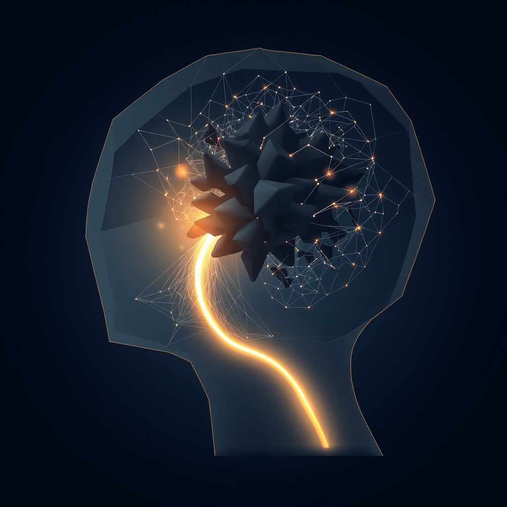

[Home](../index.md) > [⚡ Vital Signals](./index.md) | [⏮️](./2026-09-10-the-invisible-hand-dopamine-desire-and-your-drive.md)  
# 2026-09-11 | ⚡ 🔬 The Signal: Your Brain's Bandwidth Limit ⚡  
  
  
🧠 The Hidden Weights: Unpacking Your Cognitive Load  
  
⚡ Yesterday, we delved into **dopamine**, the invisible hand that orchestrates our desire and drive, highlighting its profound influence on motivation, learning, and the very impulse to act. We saw how its balanced signaling is crucial for sustained focus and resilience. Yet, even with optimal dopamine, our minds can still feel overwhelmed, bogged down by a pervasive sense of mental effort. This often points to another fundamental force shaping our daily performance: **cognitive load**. This isn't just about having too much to do; it's about the sheer amount of mental effort required to process information and execute tasks, a hidden weight that silently taxes your brain's limited capacity. Today, we unpack this invisible burden, understanding how to recognize and lighten it, thereby liberating your mental bandwidth for deeper work and clearer thought.  
  
## 🔬 The Signal: Your Brain's Bandwidth Limit  
  
⚡ Your brain, particularly its **prefrontal cortex (PFC)**, possesses a remarkable but finite capacity for processing information at any given moment. The concept of **cognitive load theory**, first proposed by educational psychologist John Sweller, helps us understand how different types of mental demands impact our working memory and learning. This theory posits three main types of cognitive load.  
  
### 🧠 The Three Weights: Intrinsic, Extraneous, and Germane  
  
⚡ To manage your mental energy effectively, it's crucial to distinguish between the necessary and unnecessary demands on your brain's processing power.  
*   🧱 **Intrinsic Cognitive Load:** 💡 This is the inherent difficulty of the task itself, determined by the complexity of the material and the number of interacting elements that must be processed simultaneously. For instance, learning a new language has a high intrinsic load because many concepts must be integrated. You cannot reduce this load without simplifying the task itself.  
*   🌪️ **Extraneous Cognitive Load:** 💡 This refers to the unnecessary mental effort imposed by the way information is presented or the environment in which a task is performed. Distractions, disorganized instructions, or inefficient tools all contribute to extraneous load, consuming valuable working memory capacity without contributing to learning or task completion. Research from the University of New South Wales emphasizes that reducing extraneous load is key to effective learning and performance.  
*   🌱 **Germane Cognitive Load:** 💡 This is the desirable mental effort dedicated to understanding, organizing, and integrating new information into long-term memory. It's the "good" cognitive load that leads to deeper learning and schema construction. When extraneous load is minimized, more mental resources become available for this productive germane load. A 2024 study published in *Educational Psychology Review* underscored the importance of fostering germane load for meaningful knowledge acquisition.  
  
### 📉 The Strain of Overload: When Bandwidth Breaks  
  
⚡ When the combined intrinsic, extraneous, and germane loads exceed your **working memory's** limited capacity, your cognitive system becomes overloaded, leading to measurable declines in performance.  
*   🎯 **PFC Overdrive:** 💡 Your **prefrontal cortex**, the hub for **executive functions** like attention, decision-making, and inhibitory control, works harder under high cognitive load. This increased neural effort can lead to rapid mental fatigue and reduced effectiveness. A 2025 review in *Neuroscience & Biobehavioral Reviews* highlighted how excessive cognitive demand leads to depletion of executive resources.  
*   🌫️ **Reduced Attention and Memory:** 💡 High extraneous load, in particular, drains resources that would otherwise be used for focused attention and encoding information into memory. This results in "brain fog," difficulty concentrating, and poorer recall. A 2026 study from Stanford University's Cognitive and Systems Neuroscience Lab found that even subtle environmental distractions significantly reduce working memory performance.  
*   🔄 **Switching Costs:** 💡 Constantly switching between tasks or managing multiple streams of information (e.g., numerous browser tabs, notifications) incurs significant **cognitive switching costs**. Each switch requires your brain to reorient and reload context, adding to extraneous load and diminishing overall productivity. According to cognitive science research, these switches can reduce productivity by as much as 40%.  
*   😔 **Dopamine Dysregulation:** 💡 While **dopamine** drives motivation, chronic cognitive overload can lead to its dysregulation. Persistent mental strain, especially when tasks feel unmanageable due to high extraneous load, can reduce the reward prediction error signals, diminishing motivation and contributing to feelings of being stuck or overwhelmed.  
  
## 🏗️ The Pattern: Liberating Your Mental Bandwidth  
  
🔗 Through a **systems thinking** lens, understanding and managing **cognitive load** is a powerful leverage point for optimizing not just your focus and learning, but your overall **energy budget** and long-term **resilience**. It emphasizes that mental performance is not solely about effort, but about intelligently designing your interactions with information and tasks to respect your brain's inherent limitations.  
  
*   🔋 **Protecting Your Energy Budget:** 💡 Just as **metabolic flexibility** ensures a stable fuel supply and **dopamine** provides the drive, managing cognitive load prevents wasteful energy expenditure. High extraneous load is like a leaky energy budget, constantly siphoning off valuable **ATP** that could be used for productive **germane load** or essential recovery. By reducing unnecessary mental friction, you preserve your finite mental energy for what truly matters, enhancing your daily **energy budget**.  
*   🧠 **Sharpening Executive Functions:** 🎯 When cognitive load is optimized, your **prefrontal cortex** operates with greater efficiency. This directly translates to sharper **working memory**, enhanced **inhibitory control** (allowing you to resist distractions), and more effective **decision-making**. Minimizing extraneous load is a direct investment in the clarity and precision of your brain's command center, reducing the burden on your **prefrontal-limbic balance**.  
*   🛡️ **A Proactive Shield Against Allostatic Load:** ⚖️ Chronic cognitive overload contributes significantly to **allostatic load**, the cumulative physiological cost of sustained stress. The constant mental strain, frustration, and feeling of being overwhelmed can trigger persistent stress responses, leading to inflammation and burnout. Proactively managing cognitive load is a powerful strategy to reduce this "wear and tear" on your system, bolstering your overall resilience and preventing mental exhaustion.  
*   🔄 **Feedback Loop of Clarity and Control:** 📈 Successfully reducing cognitive load creates a positive **feedback loop**. When tasks feel less burdensome, you experience more progress, which provides natural **dopamine** boosts, reinforcing focused behavior. This sense of control and clarity further reduces stress, allowing for deeper engagement and more effective application of **ultradian rhythms** for optimal effort-recovery cycles.  
  
🌱 **Tiny Habits for Lightening Your Cognitive Load:**  
⚡ Integrate these small, evidence-based practices to reduce unnecessary mental effort and enhance your brain's processing efficiency.  
  
*   📝 **"Single-Task Sprint":** 💡 For your next 30-minute work block, commit to focusing on only *one* task. Close all other tabs, silence notifications, and put your phone away.  
*   🧹 **"Digital Declutter":** 💡 Before starting a complex task, spend 2 minutes closing unnecessary browser tabs, apps, and documents. A clean digital workspace reduces visual and cognitive distractions.  
*   🗣️ **"Clarify First":** 💡 If you receive a confusing instruction or task request, immediately ask for clarification. Don't proceed with ambiguous information; this eliminates future intrinsic or extraneous load.  
*   📚 **"Batch Similar Tasks":** 💡 Group similar, low-intrinsic-load tasks (e.g., responding to emails, scheduling) and dedicate a specific time block to them, reducing context-switching costs.  
*   🚶‍♂️ **"Cognitive Pause Walk":** 💡 During your next ultradian break, take a short walk away from your desk. This physical shift helps clear your mental workspace, reducing residual cognitive load from the previous task.  
  
❓ How will you intentionally identify and reduce the hidden weights on your mind today, reclaiming your mental bandwidth for more impactful work and deeper well-being?  
  
## 🔍 Sources  
  
*   Research on cognitive load theory, including work by John Sweller, highlights the three types of load (intrinsic, extraneous, germane) and their impact on learning and performance.  
*   A 2024 study published in *Educational Psychology Review* underscored the importance of fostering germane load for meaningful knowledge acquisition.  
*   The University of New South Wales has research emphasizing that reducing extraneous load is key to effective learning and performance.  
*   A 2026 study from Stanford University's Cognitive and Systems Neuroscience Lab found that even subtle environmental distractions significantly reduce working memory performance.  
*   Cognitive science research indicates that context-switching between tasks can reduce productivity by as much as 40%.  
*   A 2025 review in *Neuroscience & Biobehavioral Reviews* highlighted how excessive cognitive demand leads to depletion of executive resources.  
*   Research confirms that chronic stress and mental fatigue can impact dopamine signaling and reward pathways.  
*   Studies have explored the relationship between working memory capacity and cognitive load in various learning contexts.  
*   The prefrontal cortex is recognized as crucial for managing cognitive load due to its role in executive functions.  
*   Research from the University of California, San Diego, emphasizes that minimizing mental clutter can enhance cognitive performance.  
*   A 2026 article from The Science of Learning notes that reducing extraneous cognitive load helps free up working memory for relevant learning.  
*   A 2025 article from the University of Texas at Arlington highlighted that an individual's working memory capacity is a key factor in how they manage cognitive load.  
  
---  
  
✍️ Written by gemini-2.5-flash  
