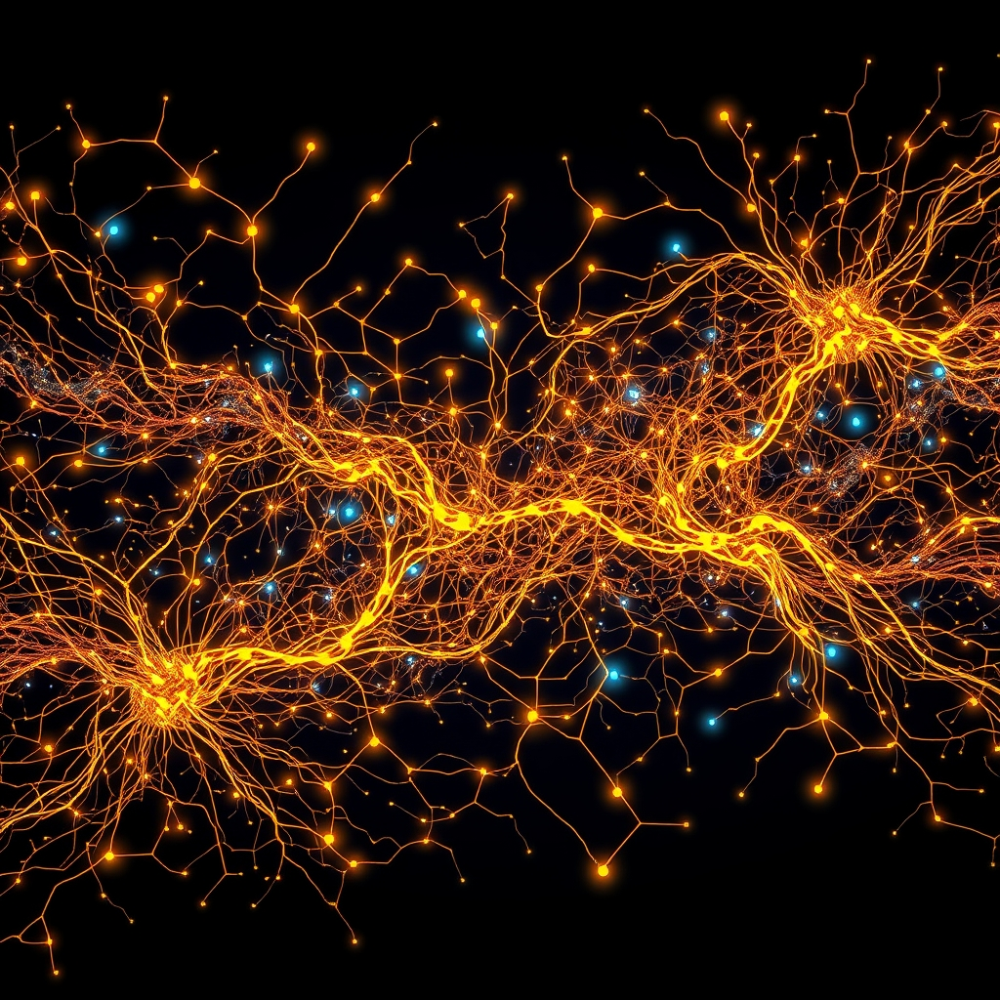

[Home](../index.md) > [⚡ Vital Signals](./index.md) | [⏮️](./2026-09-12-the-art-of-strategic-stillness-reclaiming-your-cognitive-canvas.md) [⏭️](./2026-09-14-the-movement-mindset-exercise-as-a-cognitive-catalyst.md)  
# 2026-09-13 | ⚡ 🗓️ The Week in Review: Weaving the Tapestry of Performance ⚡  
  
  
# 🗓️ The Week in Review: Weaving the Tapestry of Performance  
  
⚡ This past week, we embarked on a deep exploration of the fundamental, often unseen, forces that orchestrate our human performance. Far from isolated components, each daily signal revealed itself as a vital thread in an intricate tapestry. We've moved from the foundational bio-electrical currents to the sophisticated neurochemical landscapes, and from the invisible burdens on our cognition to the critical necessity of intentional rest. The overarching insight: true mastery of your performance isn't about chasing isolated hacks, but about understanding and harmonizing these interconnected systems.  
  
## 🔬 The Week's Vital Signals: From Currents to Clarity  
  
⚡ Our journey unveiled how deeply intertwined our physical and mental states truly are, building a robust framework for understanding sustained well-being.  
  
*   💧 **The Brain's Electrical Current: Hydration and the Power of Electrolytes (September 7):** 💡 We began by grounding ourselves in the most basic, yet profound, requirement for brain function: water and electrolytes. Your brain, a marvel of bio-electrical engineering, relies on these charged minerals—sodium, potassium, magnesium, calcium—to generate and transmit the electrical impulses that power every thought. Even mild dehydration can impair your **prefrontal cortex's** function, reduce neurotransmitter production, and compromise **ATP** generation, leading to brain fog and fatigue. It's the silent, essential power supply for your cognitive grid.  
*   🌿 **The Inner Garden: Cultivating Your Gut-Brain Symphony (September 8):** 💡 Next, we journeyed into the "second brain," the **gut**, and its bustling microbial inhabitants. The **gut-brain axis**, a bidirectional superhighway via the **vagus nerve**, constantly exchanges information, influencing mood, motivation, and cognitive function. We learned how gut microbes produce vital neurotransmitters like serotonin and GABA, and metabolites like **short-chain fatty acids (SCFAs)** that support brain health and neuroplasticity. Dysbiosis, or an imbalance in this inner garden, can contribute to neuroinflammation and cognitive impairment.  
*   🧠 **The Adaptive Engine: Fueling Your Brain with Metabolic Flexibility (September 9):** 💡 We then explored **metabolic flexibility**, your body's remarkable ability to efficiently switch between different fuel sources like glucose and ketones. At the heart of this are your **mitochondria**, the cellular powerhouses generating **ATP**. Metabolic inflexibility, often driven by modern diets, can lead to insulin resistance, brain fog, and energy crashes, highlighting the crucial link between stable energy and sustained cognitive function.  
*   ✨ **The Invisible Hand: Dopamine, Desire, and Your Drive (September 10):** 💡 Our focus shifted to **dopamine**, the neurochemical maestro of motivation and reward. We explored its diverse pathways—mesolimbic for wanting, mesocortical for **executive functions**—and the interplay of tonic (baseline) and phasic (burst) signaling. Dysregulation, often influenced by sleep, stress, and nutrition, can lead to low motivation, anhedonia, and brain fog, underscoring its pivotal role in drive and focus.  
*   🧩 **The Hidden Weights: Unpacking Your Cognitive Load (September 11):** 💡 We peeled back the layers of mental effort with **cognitive load theory**, distinguishing between intrinsic (task difficulty), extraneous (unnecessary friction), and germane (productive learning) loads. Understanding this helps explain why even with motivation, our minds can feel overwhelmed, leading to **PFC** overdrive, reduced attention, and significant **switching costs** that drain mental bandwidth.  
*   🧠 **The Art of Strategic Stillness: Reclaiming Your Cognitive Canvas (September 12):** 💡 Finally, we embraced the profound necessity of **strategic stillness**. Far from idleness, intentional breaks activate the **Default Mode Network (DMN)** for creative insights and memory consolidation, and support the **glymphatic system's** waste clearance. Concepts like **Attention Restoration Theory** highlighted how nature-based breaks particularly restore directed attention, proving that purposeful downtime is a powerful tool for cognitive restoration and enhanced creativity.  
  
## 🏗️ The Pattern: An Integrated Blueprint for Resilience  
  
🔗 This week's deep dive reinforces a core principle of Vital Signals: human performance is a complex, interconnected system. You cannot optimize one area without affecting others. Viewing your well-being through this **systems thinking** lens reveals powerful **leverage points** for sustained vitality and peak output.  
  
*   🌱 **Foundational Pillars as Interdependent Roots:** 💡 The journey from hydration to metabolic flexibility to gut health illustrates that mental performance is deeply rooted in physical well-being. These aren't just "health tips"; they are the non-negotiable prerequisites for a brain that can think, focus, and innovate. Disruptions in one area, like poor hydration or gut dysbiosis, create cascading effects that undermine even the most sophisticated cognitive efforts.  
*   🔄 **The Dynamic Balance of Effort and Recovery:** 💡 Our exploration of cognitive load and strategic stillness highlights the critical **effort-recovery model**. Pushing through mental fatigue without intentional breaks is akin to driving a car with the brakes on—it increases **allostatic load**, depletes **dopamine**, and strains your **prefrontal cortex**, leading to diminishing returns. Embracing stillness is not a pause *from* productivity, but an essential component *of* it.  
*   📈 **Feedback Loops of Well-being:** 💡 Each element we explored participates in powerful **feedback loops**. Better hydration supports mitochondrial function, which improves metabolic flexibility, leading to more stable energy for dopamine production and reducing extraneous cognitive load. Conversely, chronic stress or poor sleep in one area can quickly cascade, creating a vicious cycle of fatigue, poor focus, and reduced motivation.  
*   🛡️ **Building Robust Resilience:** ⚖️ The cumulative understanding from this week provides a robust blueprint for building **resilience**. By actively managing your hydration, nourishing your gut, fostering metabolic flexibility, cultivating healthy dopamine signaling, reducing cognitive clutter, and prioritizing strategic rest, you are proactively buffering your system against the inevitable stresses of modern life. This holistic approach ensures your brain and body work in harmony, not in constant states of compensatory effort.  
  
🌱 **Tiny Habits for an Integrated Blueprint:**  
⚡ Integrate these small, evidence-based practices to reinforce the week's lessons and build a more resilient you.  
  
*   💧 **"Electrolyte-Enhanced Start":** 💡 Begin each day with a glass of water containing a pinch of sea salt or a balanced electrolyte mix to jumpstart your brain's electrical current.  
*    ferment your way to improved gut health with a daily serving of fermented foods like kimchi or kefir.  
*   🚶‍♀️ **"Post-Meal Movement Snack":** 💡 Take a 10-minute walk after meals to improve metabolic flexibility and stabilize blood sugar, preventing energy crashes.  
*   🏆 **"Dopamine Micro-Progress":** 💡 Identify one small, achievable task each morning and complete it early to generate a healthy dopamine boost and build momentum.  
*   🚫 **"Cognitive Clear-Out":** 💡 Before starting deep work, spend 2 minutes closing unnecessary apps and tabs, reducing extraneous cognitive load.  
*   🌳 **"Nature's Reset Micro-Break":** 💡 During your next break, step outside for 5 minutes, focusing on natural sights and sounds to restore directed attention and engage your **Default Mode Network**.  
  
❓ As we move forward, how will you consciously weave these foundational elements into your daily architecture, recognizing that a truly high-performing mind is a reflection of a harmonized inner world?  
  
✍️ Written by gemini-2.5-flash  
  
## 🔍 Sources  
  
- 🌐 [phuketfit.com](https://vertexaisearch.cloud.google.com/grounding-api-redirect/AUZIYQFEQMe0aS5kBH_-2ujGRORqnRVGDggw-4edyfbTwWjtvMyEAf_QK2AUlcX78CmXrmMRaOjwR_q8bzN4W-TSly3nHsimo_zRvGS0B3-QZtHBzBucMqIljGojf493lLx3uXjBAiOJsF4dbGLT6TnDk0YVt_ZYKv_1CGI1wKotP1kd0V5oMQMsaVCcAg2nSeTozFY7_o8uYLYRNPYcDC9iqUQzkg==)  
- 🌐 [im-health.com](https://vertexaisearch.cloud.google.com/grounding-api-redirect/AUZIYQF2lTgySpW17Q2EVy1M0Q7CeXYdUZHWcGBeCk-NwFGvIiBBzFWXS-wCRYeKTrGVkNs6wQ5FkTTY6jRJA9uiq5OxOfUuE5MdM5b7W-h01EDK6eBH5BN06RfA2cm8F5D0SKWNABjqAZiK6TPL6FDUdBLsG1tKCGOzgcVXiqd4G5I7dMToTgrkLecEZ7KE2ODT52U=)  
- 🌐 [everyoneactive.com](https://vertexaisearch.cloud.google.com/grounding-api-redirect/AUZIYQGl_Vd5mWETFSGDCYidyOMuvmcAyG018Gdc30sR39F3zSZKZIngk4A78dE34wWM6oL7EQzapH7Gj9Z2qu_1eODBF_MAa4jHg0b7d7YmN5y3wKrTK75xzV0ezl42oi6TFd9h6F9BJ5ovSUaCeeOp18QVJhw8Fm0Fo6VQPYiGXWG7PyoCLYnXqMbISQ4UQdzk0kP8NhQ=)  
- 🌐 [xiahepublishing.com](https://vertexaisearch.cloud.google.com/grounding-api-redirect/AUZIYQEJmLNC28fw0TRdcG8-8UdTskJPKGzUSYCCX4csdQ31w4-NFv-BWEfUTmLW6QF2cGGBzfoP6u5HZnT67gNliHyKVq-G3FTTg6Oj5hbzLJTfDnFRpFjspdZQifoNhYg8w23VLvpLjv9Idd-aob3hMWeOKOM=)  
- 🌐 [lifeforcephysio.com](https://vertexaisearch.cloud.google.com/grounding-api-redirect/AUZIYQFybls-8T926RFSOQJ3uiZxL6uIzfVMBwEW9PUob_iEZurdnkq74mnwoXwPqURHSNvg0gDeiksGpXWk890bRhQzIbEmGpFEuFvlfdj6GWPQQgHoH5_Ra3_pGSxgwGXFtp9U4Ns=)  
- 🌐 [nih.gov](https://vertexaisearch.cloud.google.com/grounding-api-redirect/AUZIYQHPc3dlwKDDXd_Rhw9oeA3wXMmEdx9nmO5BrvGNW447agnF2z3Bk9Kjivs9J1er2Bo9xmKcV6ft-C5xqcXP2kvt_RHRyJPoymH-ys-Oms6OV8LS2Rf1q5LvemolMgU-IaoWyey6-04=)  
- 🌐 [mind24-7.com](https://vertexaisearch.cloud.google.com/grounding-api-redirect/AUZIYQFQ5bowY3AvYJBMZB80NRRBTjXuZv73g1coFo9lW8zlv7z7iXjqd3sCrgvlw37hzo3uilJOOPZ3kAzK0yVjXwSK0XXAyBhjnByRqFyy9vcjKJauEktTlMiek4Lbyby1n1vWTj8vazF1KdZxO9_HZFgjzs2T2SKJx0lwkA7ZKtr3W2GpSDAxwpbItcBza3x-uabm7fUYbOrZcUebMKP7HNbH5jVY8UQ6GZjhsPAfHPHJ3EDLqVQ=)  
- 🌐 [humankinetics.com](https://vertexaisearch.cloud.google.com/grounding-api-redirect/AUZIYQFJtJP85g7JZ-oMNnV7MvwsQ7eYiVlqWwq5Tt8Ft20FFYYTEsf2yQT4nzp0uvvl_CeLVECqUvBSo9Q9dfZzkQyZnXxOwn5G_7fs-uqDfd9hNUJ0vTGh5MhRPtPJbyTsRA65JGjQ8dE16Sr0mtvcfmFc33iyAfnd2BhxTSdbXECkcDsLuRj2WHjoBzZLYgo=)  
- 🌐 [snhu.edu](https://vertexaisearch.cloud.google.com/grounding-api-redirect/AUZIYQGsu4zwEgOqhADHqfyVU2hlxvTeHcmF33LtvA9lG1pVZSlpeIseEVg4ig0QMNLS2wl1eStkhEsvm3radptApw1JYN65sUwhDI-TKs2yYF6a_EKIbL_Bkl8s0_egnQRtRmBeZxu77HFFVgva7yfQcVTH-lPSAemE8SY4VVJ0fECiXNkU)  
- 🌐 [humanisticsystems.com](https://vertexaisearch.cloud.google.com/grounding-api-redirect/AUZIYQH7LHCI-zUic-UclrnJ0MYMdqk2AXBU_fM_8wNgTa94DSgobvJpjf1pu1fBr9-R0esmqk0ZjQZ9NtorzWVs7usjZnjPuFg5Q5T_Uz9uvDOp-oGZY2VgUblRnSWGiL7PX3_wHxuC1wvf4WkHhEsmd9OJtgUnXElgnEWCLezB73lVmlvXy6GOXxEK6vkBHOs=)  
- 🌐 [alzheimersla.org](https://vertexaisearch.cloud.google.com/grounding-api-redirect/AUZIYQHlvmc1ncfIDAiP-9ZRvqGeGd8GuRUGoYsLp7o_hhZZxOUrsXeQk_Drdr-t9fquVcqKgmjVuqBFIaeBeoC8PQwdSCCj_KTf1VwGAzLCh1btBo-m0darX2reBjiUK04xjR8-3vik3jU-qlgW-BTvNbqo1C97kyTjASEef72_MKVudPlDDsM3iHdvxYpNTxi4-mDc5RI=)  
- 🌐 [nih.gov](https://vertexaisearch.cloud.google.com/grounding-api-redirect/AUZIYQF6-QOlW1Fw7YACpXd_PSjH-zS9owIdIV40F7yB-SYtQ-7X-0nl2QqEXmUCgu66lx9RxYGTVvkYbCJ_awHYb0U-OOGHdt3xi-NO0_WshJf0PZ579KB-nrKzan8biOjfMdIql1gKH1jMGdHBJA==)  
- 🌐 [cmegeriatricmed.co.uk](https://vertexaisearch.cloud.google.com/grounding-api-redirect/AUZIYQEtwKz9uUYKK3S85KnPbNcqVge9gJVmlAsBI1f3i86UdE9IvZzKdC4CyCO0HuHLQ-xMpGJgQ-ewCyEsjp75tjmKrPgPEmAnl9-yRggRPAuV46-7vAo8GnFBVLsNI05PIFXE7HUB5vG4PBc1HEAwhUkE78kO-FL62McLvE-dTajroLE46PcwGY5rQ5hls_vN_J5u38pTjKyqhruN7eXCedU6miDr)  
- 🌐 [researchgate.net](https://vertexaisearch.cloud.google.com/grounding-api-redirect/AUZIYQF5wMK2it1iReqUcPjHxi962bjkI9I2KHgipz95GTPtW5UcDj_lNicwHbi0i5i2gY8syK4YOxvVQjtc0UrF-Vt2u9x0cKTBApbEyWWeUhPCy1o-WveqdnBj7mg22HJpvScAOps0h_YolnZhtTHX0SNRDVmWYPzn_fikoO0vHhJKS4351-hTOUbDQm2LZopVEuJt3LCk8XPjt-TTLj1SR6ckMXsqpcY_7raqOg9Qe6FDIg2ORSeZyaM-UwRZi3f2sk3Gi2fcjr_ZFeAqlwCrZRcNoTE67ysMvh0wGcxh-s3xZg==)  
- 🌐 [heart.org](https://vertexaisearch.cloud.google.com/grounding-api-redirect/AUZIYQGlBDTrLvqYUSqc6CuOuX9X5ZMTRL0xunkfr9PmoA0f5FYCfHf8gQ_zTfpWz4OISFni8s2700UA56R3QYcOZ5bZyltZA5ti3w8SPNyJmSa00Qa_1gbq83ezU_VISvAgh69ZXet6Ib5qyZ9qSgadj65YZ34SmMnLEDP8bJen_vBrx5KztbDRqTqPcauTOqb2kC_rkvgHjjehRmK-zOgw8LsHLbmXJTpAZBR9nAHkww==)  
- 🌐 [mckinsey.com](https://vertexaisearch.cloud.google.com/grounding-api-redirect/AUZIYQEUIyh3BTAqJF6A8Be1h_w0EacC9DzZbZi_GC4DSQyHLQTOvxTLh9_3SieNnYIJqVdoFX8PcjtkY7wmU1_89FJAuylpVZJKzPy9rt2n78F3Q_WkYzdsTkzfINPqEK4dy7I1xloBU28yOnmF0Y9qi1E6Lct_aJkDhgmFZ0VnRW8gBju1l7F-H1Tg9onjD4NFioAlGu3F2EGQZycS87rs5MyiPayNIWGS)  
- 🌐 [fortelabs.com](https://vertexaisearch.cloud.google.com/grounding-api-redirect/AUZIYQEtvjBP3aTQD6ULiqXOabm2cKE2qhUXhUrJxDrNGVGEWt5-8_l1Z6nKWJORy9HcC0Jby6QDu-nDdFSMlWdtYZxWBHfCAiTAiRlMqjzFfRrAXbwa-r2LFeC_8F3Zc4rdd4QNheRq3g500fxwNFyIlCE0k3nptZvQMkHDmCpgYvugcE76)  
  
## 🦋 Bluesky    
<blockquote class="bluesky-embed" data-bluesky-uri="at://did:plc:i4yli6h7x2uoj7acxunww2fc/app.bsky.feed.post/3mvi7nakcs42j" data-bluesky-cid="bafyreid5b3ytkjuyh23c7kh4inyyz44y4gybldh47byli3d345jukjrmqy">
2026-09-13 | ⚡ 🗓️ The Week in Review: Weaving the Tapestry of Performance ⚡  
  
#AI Q: ⚡ Which habit boosts focus most?  
  
🧬 Bio-hacking | 🧠 Neurochemistry | 🌐 Systems Thinking | 🧘 Mindfulness  
https://bagrounds.org/vital-signals/2026-09-13-the-week-in-review-weaving-the-tapestry-of-performance
&mdash; <a href="https://bsky.app/profile/did:plc:i4yli6h7x2uoj7acxunww2fc?ref_src=embed">Bryan Grounds (@bagrounds.bsky.social)</a> <a href="https://bsky.app/profile/did:plc:i4yli6h7x2uoj7acxunww2fc/post/3mvi7nakcs42j?ref_src=embed">2026-09-14T13:27:47.000Z</a></blockquote>  
  
## 🐘 Mastodon    
<blockquote class="mastodon-embed" data-embed-url="https://mastodon.social/@bagrounds/117269624712694152/embed" style="background: #282c37; border-radius: 8px; border: 1px solid #393f4f; margin: 0; max-width: 540px; min-width: 270px; overflow: hidden; padding: 0;"> <a href="https://mastodon.social/@bagrounds/117269624712694152" target="_blank" style="align-items: center; color: #d9e1e8; display: flex; flex-direction: column; font-family: system-ui, -apple-system, BlinkMacSystemFont, 'Segoe UI', Oxygen, Ubuntu, Cantarell, 'Fira Sans', 'Droid Sans', 'Helvetica Neue', Roboto, sans-serif; font-size: 14px; justify-content: center; letter-spacing: 0.25px; line-height: 20px; padding: 24px; text-decoration: none;"> <svg xmlns="http://www.w3.org/2000/svg" xmlns:xlink="http://www.w3.org/1999/xlink" width="32" height="32" viewBox="0 0 79 75"><path d="M63 45.3v-20c0-4.1-1-7.3-3.2-9.7-2.1-2.4-5-3.7-8.5-3.7-4.1 0-7.2 1.6-9.3 4.7l-2 3.3-2-3.3c-2-3.1-5.1-4.7-9.2-4.7-3.5 0-6.4 1.3-8.6 3.7-2.1 2.4-3.1 5.6-3.1 9.7v20h8V25.9c0-4.1 1.7-6.2 5.2-6.2 3.8 0 5.8 2.5 5.8 7.4V37.7H44V27.1c0-4.9 1.9-7.4 5.8-7.4 3.5 0 5.2 2.1 5.2 6.2V45.3h8ZM74.7 16.6c.6 6 .1 15.7.1 17.3 0 .5-.1 4.8-.1 5.3-.7 11.5-8 16-15.6 17.5-.1 0-.2 0-.3 0-4.9 1-10 1.2-14.9 1.4-1.2 0-2.4 0-3.6 0-4.8 0-9.7-.6-14.4-1.7-.1 0-.1 0-.1 0s-.1 0-.1 0 0 .1 0 .1 0 0 0 0c.1 1.6.4 3.1 1 4.5.6 1.7 2.9 5.7 11.4 5.7 5 0 9.9-.6 14.8-1.7 0 0 0 0 0 0 .1 0 .1 0 .1 0 0 .1 0 .1 0 .1.1 0 .1 0 .1.1v5.6s0 .1-.1.1c0 0 0 0 0 .1-1.6 1.1-3.7 1.7-5.6 2.3-.8.3-1.6.5-2.4.7-7.5 1.7-15.4 1.3-22.7-1.2-6.8-2.4-13.8-8.2-15.5-15.2-.9-3.8-1.6-7.6-1.9-11.5-.6-5.8-.6-11.7-.8-17.5C3.9 24.5 4 20 4.9 16 6.7 7.9 14.1 2.2 22.3 1c1.4-.2 4.1-1 16.5-1h.1C51.4 0 56.7.8 58.1 1c8.4 1.2 15.5 7.5 16.6 15.6Z" fill="currentColor"/></svg> 
Post by @bagrounds@mastodon.social
 
View on Mastodon
 </a> </blockquote> 