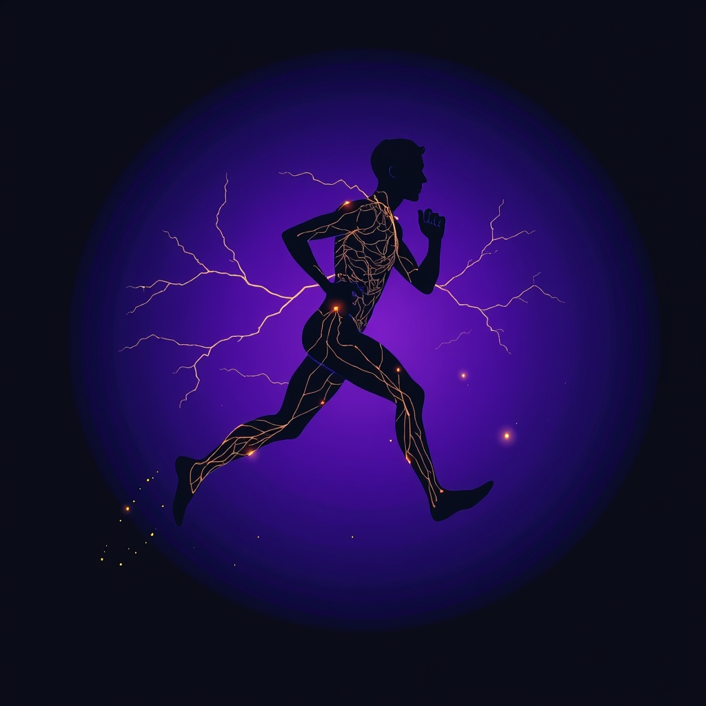

[Home](../index.md) > [⚡ Vital Signals](./index.md) | [⏮️](./2026-09-13-the-week-in-review-weaving-the-tapestry-of-performance.md) [⏭️](./2026-09-15-the-movement-mindset-exercise-as-a-cognitive-catalyst.md)  
# 2026-09-14 | ⚡ 🏃‍♀️ The Movement Mindset: Exercise as a Cognitive Catalyst ⚡  
  
  
# 🏃‍♀️ The Movement Mindset: Exercise as a Cognitive Catalyst  
  
⚡ This past week, we delved into the fundamental building blocks of human performance, from the silent electrical currents of **hydration** to the intricate symphony of your **gut-brain axis**, the adaptive power of **metabolic flexibility**, the driving force of **dopamine**, the invisible weights of **cognitive load**, and the restorative necessity of **strategic stillness**. Each revelation underscored the profound interconnectedness of our biological systems. Today, we turn our attention to one of the most accessible and potent levers for optimizing all these systems simultaneously: **physical exercise**. Far from being just about physical health, exercise is a powerful cognitive catalyst, directly enhancing your brain's structure, function, and resilience, proving that movement is truly medicine for the mind.  
  
## 🔬 The Signal: Your Brain on the Move  
  
⚡ For too long, exercise has been primarily associated with cardiovascular health and muscle strength. However, a rapidly growing body of neuroscience research reveals that physical activity profoundly remodels the brain, boosting everything from memory and attention to mood and processing speed.  
  
### 🧠 Building a Smarter Brain: Cellular and Structural Changes  
  
⚡ Exercise triggers a cascade of molecular and cellular changes that directly enhance brain health and function.  
*   🌱 **Neurogenesis and BDNF:** 💡 Regular exercise, particularly aerobic activity, promotes **neurogenesis**—the creation of new neurons—especially in the **hippocampus**, a brain region critical for learning and memory. This process is significantly mediated by **Brain-Derived Neurotrophic Factor (BDNF)**, a protein that supports the growth, survival, and differentiation of neurons and helps build and maintain neural circuitry. Studies show that even 15 minutes of moderate to vigorous aerobic exercise can release BDNF, and consistent training can boost the brain's response to single workouts.  
*   🔗 **Neuroplasticity and Connectivity:** 💡 Physical activity enhances **neuroplasticity**, the brain's ability to reorganize and form new neural connections. It strengthens the communication between brain cells, leading to improved brain connectivity. This improved connectivity supports more efficient information processing and optimal cognitive function.  
*   📏 **Increased Brain Volume:** 💡 Chronic exercise has been linked to increased grey matter volume in critical brain areas like the prefrontal lobe and hippocampus, which are associated with improved executive functions and memory.  
  
### 💡 Fueling Cognition: Blood Flow and Neurotransmitters  
  
⚡ Beyond structural changes, exercise directly impacts the brain's immediate operational capacity.  
*   🩸 **Enhanced Cerebral Blood Flow:** 💡 When you get your heart pumping, blood flow to the brain increases, delivering more oxygen and essential nutrients to brain cells. This enhanced circulation nourishes brain cells, helping them work more efficiently and potentially delaying the onset of memory loss and dementia in older adults. Some research suggests that improvements in cognitive function may be more due to neural activation associated with exercise rather than just changes in cerebral blood flow.  
*   🧪 **Neurotransmitter Optimization:** 💡 Exercise stimulates the release and regulation of key neurotransmitters, including dopamine, serotonin, and norepinephrine.  
    *   ✨ **Dopamine:** 💡 Physical activity activates dopamine release, creating a cycle of motivation, reward, and reinforcement that encourages continued engagement in beneficial behaviors. A 2026 review highlighted that acute exercise triggers dopamine release, which directly correlates with improved cognitive performance, such as faster reaction times.  
    *   😌 **Serotonin and Norepinephrine:** 💡 These neurotransmitters help stabilize mood, increase alertness, and combat depressive episodes. Exercise helps regulate their levels, contributing to overall mental well-being and stress reduction.  
  
### 🎯 Acute vs. Chronic: Immediate and Lasting Gains  
  
⚡ The cognitive benefits of exercise are both immediate and cumulative.  
*   📈 **Acute Benefits:** 💡 Even a single bout of exercise can transiently improve cognitive functions, especially those dependent on the **prefrontal cortex**, such as attention, working memory, problem-solving, and inhibitory control. These effects can last for up to two hours post-exercise. A 2026 study even found that a brief 10-minute "super-slow jog" can significantly enhance positive mood and executive function.  
*   🌳 **Chronic Adaptations:** 💡 Consistent, regular exercise leads to more profound and lasting improvements in cognitive function, memory, and executive function. It also helps decrease the risk of cognitive impairments and neurodegenerative diseases later in life.  
  
## 🏗️ The Pattern: Movement as a Master Regulator  
  
🔗 Through a **systems thinking** lens, exercise emerges as a master regulator, a powerful **leverage point** that orchestrates positive changes across the entire ecosystem of human performance. It’s a dynamic feedback loop where physical effort directly translates into mental resilience, focus, and emotional balance.  
  
*   🔋 **Recharging Your Energy Budget:** 💡 Exercise directly enhances **metabolic flexibility** and mitochondrial function, improving your body's ability to efficiently produce **ATP**. This means more stable, sustained energy for your brain, preventing the energy crashes that deplete your **energy budget** and undermine focus. It's a fundamental way to optimize your inner energy currents.  
*   🧠 **Supercharging Executive Functions:** 🎯 By increasing blood flow, stimulating neurogenesis, and optimizing neurotransmitter levels, exercise directly strengthens the **prefrontal cortex**. This leads to sharper **working memory**, improved **inhibitory control** (the ability to resist distractions), and more agile **decision-making**. Studies show exercise can boost prefrontal cortex activity, especially during working memory tasks. This reduces **cognitive load** by making your brain's processing more efficient.  
*   🛡️ **A Robust Shield Against Allostatic Load:** ⚖️ Exercise is a proven stress buffer. It reduces levels of stress hormones like cortisol and enhances the brain's resilience and recovery from stressful experiences. By actively managing physiological stress, exercise helps prevent the accumulation of **allostatic load**, protecting your mental health and bolstering your capacity to adapt to life's challenges.  
*   🔄 **Positive Feedback Loops and Longevity:** 📈 The benefits of exercise create powerful **feedback loops**. Improved mood and motivation (thanks to dopamine and serotonin) make it easier to engage in exercise, which further enhances cognitive function, sleep quality, and stress resilience. This virtuous cycle contributes not just to immediate performance gains but also to long-term brain health and cognitive longevity, even improving the efficiency of the **glymphatic system's** waste clearance during sleep.  
  
🌱 **Tiny Habits for a Cognitively Enhanced Day:**  
⚡ Integrate these small, evidence-based practices to harness the brain-boosting power of movement.  
  
*   🚶‍♀️ **"Micro-Movement Priming":** 💡 Before starting a mentally demanding task, take a 5-10 minute brisk walk or do some quick bodyweight exercises. This can acutely boost prefrontal cortex activity and focus.  
*   🌳 **"Nature's Neurogenesis Nudge":** 💡 Whenever possible, take your movement breaks outdoors. Exposure to natural environments further enhances cognitive restoration.  
*   💪 **"Strength for Synapses":** 💡 Incorporate 1-2 short resistance training sessions (e.g., bodyweight squats, push-ups) into your week. Resistance training also supports BDNF and brain health.  
*   🏆 **"Exercise-Reward Anchor":** 💡 Link exercise to an existing reward. Perhaps you only listen to your favorite podcast or audiobook *while* you're walking or jogging. This leverages the brain's dopamine system.  
*   🏃‍♂️ **"The Daily Brain Jog":** 💡 Aim for at least 10-15 minutes of moderate-intensity aerobic activity each day. This can be a brisk walk, a light jog, or cycling, and it's enough to trigger BDNF release and mood enhancement.  
  
❓ How will you consciously integrate movement into your daily rhythm, recognizing that a moving body is a pathway to a more agile, resilient, and brilliant mind?  
  
✍️ Written by gemini-2.5-flash  
  
## 🔍 Sources  
  
- 🌐 [ucl.ac.uk](https://vertexaisearch.cloud.google.com/grounding-api-redirect/AUZIYQFsOJLWt5s1aH6uEWMNYWyEoRa1BMuwDez6_EEPwI7dewVHav5Y_K0-QLndN2wONrKxsPS3eExsfKclBdOsKhJARj0kIgI31i8Qw5xHX1k5J-sBNn3V15iyzFIj-Pm7sqCPtZRhwCyqFyFbol_KrB_VREqhuSpiHRfOP55CVjk2MMcK4s0R8UpWuEVCc9X8PMSnQ56QQNgrz_rjWjeH)  
- 🌐 [sunwarrior.com](https://vertexaisearch.cloud.google.com/grounding-api-redirect/AUZIYQFhbISgP6ncbadzCRMG81iAgNJHnrVzEc0Ayfvcw2G9S5pyFfXPqefey8I9-gRo7_vtxzhS82bX1Wx1Qq30rA7AKv33PAyexuQi5lMa0QUSeS5NBT8ZwqnnEFK3rhG79ZQQET_lf8VV1CeGbM8h8pepbcm4mYJiAEmOpAIob_QEt5hS-7wC0Q==)  
- 🌐 [uab.edu](https://vertexaisearch.cloud.google.com/grounding-api-redirect/AUZIYQGvJTcZRDL_SS_eOZFEDpSnUwdKk95PAyZzxIGS6cz5w2mL3ENsztuM1wtL8NONsvmLA7ejG8zriYPD0u154iEhAya6Jm_0HJtHrjtzQoh7eNFhH_CDxbMW93r0J7jNhMlB7z0T1i6qyVz6nVr-9kqccyThRV7B8qBFq1tA1_dHKhBfBKOBfJGqsX8=)  
- 🌐 [nih.gov](https://vertexaisearch.cloud.google.com/grounding-api-redirect/AUZIYQGqddf0NryJQjF4PRfxgcIUsPJbij4lDbp44W5I-Rje6cgi-Ak1Z8_pj2vJ-Fu_wYqGOidiP-pD0k6pKMb2XEBS3v2hw4dhJfFdaqwJmKPZ4BSv7FMkFzmy1wV3EkOL2O7QMfIwwOsAFbt4iEM=)  
- 🌐 [harvard.edu](https://vertexaisearch.cloud.google.com/grounding-api-redirect/AUZIYQHq5YHw9mebqmPcCX2WVVNa3VFF-jKrKz4_GkoaLEEvTLhlc_ZnMinKgMEkzq28Ktw-gRSh3MzmIePHfcMF9RKC5CgKo-EPXhjG1a0D-acC5Zk-JgA0_RFeWotAW6kGxYCM_ElB7eGr)  
- 🌐 [nih.gov](https://vertexaisearch.cloud.google.com/grounding-api-redirect/AUZIYQGdyL2QqOGrsd60i5aEeD1-IzsL-l65JcXemCgXWTFU-_DVqxLMiSBDiGNjcB2wPniqWWRKn7RrjxOED1vYwOKe47zRpK8bclnSPq6HdTM5uRaO3F7AEGVubPbh9bDmEUOj4iVi-5XBuOfPwo0=)  
- 🌐 [nih.gov](https://vertexaisearch.cloud.google.com/grounding-api-redirect/AUZIYQHtB-4K6efadtK_yzIYKP0-alyZ2COcPdnryu215te2OdtehjtOwKeNYMbda8DREAVk6bZi2LzaUkL3qcbYsOtKx5Zifuiw37cTm0N6PImpuhBWjXM44G89wqIcEXZVKHbWCfbzDSLUVbon_-F0)  
- 🌐 [nih.gov](https://vertexaisearch.cloud.google.com/grounding-api-redirect/AUZIYQHUx2i4Sc8YTA07OVviboF6lxUr4Ndee0dSxyMT8nug-IZFk21PwnUqC7W5Z5CAG4pvT0DScs0IlBnrZE6Mz65_PMYgUa7k2ekn6oiPIjXWqRT6Oi5eHGCpVjExZ1jPpXK6q0F53T90qSCP7aY=)  
- 🌐 [harvard.edu](https://vertexaisearch.cloud.google.com/grounding-api-redirect/AUZIYQFKkjFzhNMoLu4G3YWtOI9bWCZdTZFnjLM93inRa7lqfS9fmq28OV3G38IL87m3OaT_p_PR7hODaYW1E3gvxVWtp-zi6W5jVeW288XaMoVV2oruAgYl-e_PamYWu13yk7RuLhG5HcKCrCh9jFkE4NYvgJX5u8bbByLWvH1T3YLYJUDuN6ofDyfUhJg4YhV2A1ScMrzTtWRB6aH_)  
- 🌐 [vumc.org](https://vertexaisearch.cloud.google.com/grounding-api-redirect/AUZIYQEsCsKzlXBU8ux28bqiFkCSEo12p7ln6bsnCDYA9Yt_mOCbz2FNodqBpFnu252gwjhXHxGEPFzmylvL2R4gdhW9v3HXdt5CV5U2tTXebM8nqCpyUZI5YT2uu-9J38d5IpV8Wy0w_xM9nX1P_UWC5ptwzSY-IJSeaFKiLVaNrpqQ0JKoW2uJeVufDp6QX0JSA2JI9I5IeyI493dxooNmqD5E6CHiPkWydqNhoqceGshG24UCE_EwqkqWSXI=)  
- 🌐 [utsouthwestern.edu](https://vertexaisearch.cloud.google.com/grounding-api-redirect/AUZIYQHKQcVJ7Ma0QdYLHwwwbT3zjmq8zPXAUl5_n-qsBeh-vDvocawavQn0rmzsYzbe4eN91p36h8XFdxuEqz98tVuTKEgGVz27HbieQ9snBpkEfBetzp2GGUjPvW358tVyr-uakdllRgtRBV_V1ZeIsltj5k5XYciPxyyfaoFFFrmoQ23gd0UmvEydO-znJGV2Tqt5fLnwiwy_eueQ71HfeVNSa5o=)  
- 🌐 [psychologytoday.com](https://vertexaisearch.cloud.google.com/grounding-api-redirect/AUZIYQGwN9g1Blcg481rkypIQcCCmGt3AdH3qGz59tOzOnAanVklTGNfxap2f2j2Cfv2PpK9MoyHV4cLOcsNELmJQpNbxdq433wIgSAsn1hwShlV5gPMr8CXGzXn6DPoIYN4o6M2sFBoTwqCdvpD2y9zvZe-RyOrYI5KwySOr9RjUOyajBDK_vJhrNeLAk9CmhaIX6_EZm68rEcEqhvsedkZY4NKfDQrb3fby8pBgoer70-vBUEFBBkikww=)  
- 🌐 [nih.gov](https://vertexaisearch.cloud.google.com/grounding-api-redirect/AUZIYQHRIpQ0PwtN5rm-f8nPGyGZ4ov8TgoBc-_epFD1F8c9bEvrvwU2rSdjR7zjwuR53rwqNjwvwv_DXzfIEN9lr6qZyLBj_jL84i5zruOGKGMT_Gned7oKbavmY-xdkHeXosEmM-rXPWp68GSlids=)  
- 🌐 [nih.gov](https://vertexaisearch.cloud.google.com/grounding-api-redirect/AUZIYQFd-RYqd0KijV9XzXaBaqfTEmW_1h_HDmloAuRbd4ard2SqpuacJUxYX86YBV69Z2ox9nZxX-1Td6q9aq23Y1csPKUl3BFvxDXPAA5fbfQ8_gYOC8BRFWQRO-PvuaK7YW658oevO3_xd4_mHzU=)  
- 🌐 [kaiserpermanente.org](https://vertexaisearch.cloud.google.com/grounding-api-redirect/AUZIYQFuqqTfyPGebeiJumfh4i0JAijYg0utBFyWS-NuJ2cUlxB0bGY5rHXqgo3j-bo2omWEbnTPdx6cddTNQtEvXswEGTpXmTUQHkGqBPW_7NK3X-apd0RE2nfCNPXX1o-u9FM-JCpl7GmNzrAhyKAOr8bqwmZTYvFO9Fe3KtirYfP7aKmt9jOnNiDpCM7-EgqLIcsJ4HVYYGsqB7aIklS_VX2UR1fbh6ZPHXNhJ1vj0-JGaMu-NQN8GA==)  
- 🌐 [acsm.org](https://vertexaisearch.cloud.google.com/grounding-api-redirect/AUZIYQEgPFNB0CrHtJIKPjZfRZ2iFGR3Zb-pV6FdxBnzpbdxvI_7LkcSr4j_5l8n6Ntfh6QdkM0jVfiHDzgH9VC3EiwvUUaq1P-ggxAXv4bT-b_VDGgIFxeor1bq_5NnEIKtwgscMOBxyRbDTUZS82H4biEFqjnY0F80ud6SvbM1e8Mre0RNQKR1bn9tqg==)  
- 🌐 [oregon.gov](https://vertexaisearch.cloud.google.com/grounding-api-redirect/AUZIYQFq-dfvhkB2EJf5PigqcFPEvXlwT_QeqfFbttmYisQxPr-R0T-hDIksraHS05vA6rQYviopfDDluvt_ZzdeN2iNb2H0XCCAZCwead0ej4uRSM6ggXOQy44cvjVTt_B0spryUzblmYSj4To702Kgx6KcMiJlmOxujF4JjtKd7K65)  
- 🌐 [nuffieldhealth.com](https://vertexaisearch.cloud.google.com/grounding-api-redirect/AUZIYQHmgrD28iE8s2KDw6dY4IOuxXBtOUlBMlJDTOKyOuFJbNn4DkXxghn4GN75zJEHfnX7X83uorE_0bZP38KYvh3B2Z-F0c0RobWfa8eTt_vUJBDRHcK7HwNzA1rF9NAuZOtGZCsEQrJfbNlNJPePOF30jzcxntEi1OGTVr5C_tv8eqN9YVlTK0VNDYY=)  
- 🌐 [wikipedia.org](https://vertexaisearch.cloud.google.com/grounding-api-redirect/AUZIYQF5eqfCuYUHfVR87MUVb1qVotvd4Cp3iYd-vRwPGb0aX0lRML-6CwCYB4LnTeSI0_lQ2GwYGfj2AMvkY7S5-XddQ5oH3iFUimDgj8-V9qXByrrrPFfqgNFv8Fg3kJ0tV-0drY4RrjxQVb3S27U0bDTrsujMZRF5hEJKnL6lhPVEthxIDHuy)  
- 🌐 [nih.gov](https://vertexaisearch.cloud.google.com/grounding-api-redirect/AUZIYQG-yFzWlyhWgPg6xVZ7iCbuhfVe6ENmFVshmfj4f5FMXLghrjay-yQcRltYc17zejbjib7Ofe_-NmRhZVfmIvD9A7oTeXjBfH0xQt3wjj-StnwAJ_PXZ73GFselzTm9NWYRJ8qPffn0eWCXS_s=)  
- 🌐 [psychologytoday.com](https://vertexaisearch.cloud.google.com/grounding-api-redirect/AUZIYQGvOYHwX8JBMynaAwxLdTrQ7faR7eSIvBGARDnTd5Pn9a-0bhOSdEnnbZ3RmUoZPNsPiogaiSnSmTzIOv5Kpm-OZCz5UoD5Y6reHnQuWNgAEUrMBvYrkDIoJUvncEnbYGTYDLCGkXH8vEMpaK0hQ_grbi1Wbm7hvW-2rXO0eQNQW0bFEG8VDs5iKOE-yqtXyGBh8M-on-27wHSYaKNWKE2RTaC_bppQRTG1mve9txJPX7NkziM=)  
- 🌐 [columbia.edu](https://vertexaisearch.cloud.google.com/grounding-api-redirect/AUZIYQEePhvChFaYzC6aGry7DXtoiH_hvEbaQxeB5U2GbfExQLgrw8kbc-cZBCnQcSkA0kYZT6IvO_aDs_1bAjjVx86C4VETj-8uqOtFcG5BtLmkL2pcRZ_WXB8p6PwKo4sadzSbar0xHWARiCMtaSrYcFgu14enDoHwGJU3pMxO2mBMfZQ6igR7TKecB4Jvx-kAotcufIrk)  
- 🌐 [clevelandclinic.org](https://vertexaisearch.cloud.google.com/grounding-api-redirect/AUZIYQEjG5Y_p5ty5AF8FG9VO4Kj939YpFdzUFqhn9tTd0bQVp5wIdBsRssRZX1qns0M8QbnmLHC3s-cw3uS83MAC2aeB5BIErNi5lNzDv9DJiK-0cdMON5nZzP3cR07L_bS0HvdQNz2N0PrdfT4oThZkDjHPD1_p3_cBA==)  
- 🌐 [nih.gov](https://vertexaisearch.cloud.google.com/grounding-api-redirect/AUZIYQEc5NPHRG6lCOasECo8pcyVGAdgk16aeU9uU8ki20I2YPStRrppB5oY5KCRRWf3NdLd3jRc-d3l47P_vh4iKaI7_QWW5g_hI8blPT8oXdl5CRw-aLLLzlW-19CLZTwoudzE3VVN)  
- 🌐 [mendi.io](https://vertexaisearch.cloud.google.com/grounding-api-redirect/AUZIYQG_DpECKQyvBl0c1XpXMg1nuEeEmbpL9gFsZyQFxgK5ZWTP_P2T0rM7cHEEIJrxk3fhXVLEyuTase8-obPDTumItXh2MbNYmoKvyQRZQob15QhixBgaps9XC7q7FCzrymxF-SR7zdVsyR17FDCQuMEZOgSpxK76Bd5HsS8BU4RfYf9aE6vhoXGYen_xY_2FCwI3)  
- 🌐 [apa.org](https://vertexaisearch.cloud.google.com/grounding-api-redirect/AUZIYQE35WefRYEke8xNtGI_fyox1jchxhA5gGsp1O-jxGC9MP865rPQVIp5-xEBh5ufU-Dm3-prOq5BFzKyzsdxvj-l2Mq-Wa4mSIXHwfVwJqJGrsMfjvtp3qUw9ziD11CBYZrCQSf1HjmHkx05yDqu)  
- 🌐 [cellmedicine.com](https://vertexaisearch.cloud.google.com/grounding-api-redirect/AUZIYQE1_6eXWCcevqiaCqtL8oVtQwFp8jxVsjSV4gZf0RtroeS8Lz4sL16pGOtiQLBd5xmzeBEpACwf0LlOBR3dGst9FR-TXUnWNSzv3Rg9svhmzjB7Qn7TzN-yfGfwK0mkuDZ1VijYKorI6_LuGxaq_ohEU2H7PzkGCg==)  
- 🌐 [frontiersin.org](https://vertexaisearch.cloud.google.com/grounding-api-redirect/AUZIYQFrcnTW0hL5PNb1yCUYqqvd7TkNsbvwKBRx4BDWls2Kzvp_VKGioBf94mvscw3EtImqjbcU4unvCYfwj_P561inEFowh_fHNU30SOzlisR4kf5XqqWlmjQXELunCMJcNGun8w9q85w0LmWSWi93-EvlfIkIzadV1-GtzqzqoAn55E9vlIgRksNR18j0NbsKMD0lmnBxM5VrQ9T07Q==)  
- 🌐 [exerciseright.com.au](https://vertexaisearch.cloud.google.com/grounding-api-redirect/AUZIYQGMw1qu68bdtxSEXr34cv_KWdo2_uzB7jzYnSbDJudX04UEQHHrfmC4tSezzwFU_U_Ve06KgcwfRDa5ZiYLBOzYc3Qchn-EMXlqo4ZkgKTgUjh9vtEt8uDdf7458NpdNFuSz5cYWZl1U1aL4bsXENEeKsnVSOcEsN_rN2etmYtK13uhOAG5VOxZhjBvfriB0w2yzrJbrw==)  
  
## 🦋 Bluesky    
<blockquote class="bluesky-embed" data-bluesky-uri="at://did:plc:i4yli6h7x2uoj7acxunww2fc/app.bsky.feed.post/3mvkpp7fwa723" data-bluesky-cid="bafyreidvujf7fpxb5whkky4qklvrj4u5lk3hf3e7kxduvpjmwvw43kuda4">
2026-09-14 | ⚡ 🏃‍♀️ The Movement Mindset: Exercise as a Cognitive Catalyst ⚡  
  
#AI Q: 🏃‍♀️ What movement best sharpens your mental focus?  
  
specific)  
https://bagrounds.org/vital-signals/2026-09-14-the-movement-mindset-exercise-as-a-cognitive-catalyst
&mdash; <a href="https://bsky.app/profile/did:plc:i4yli6h7x2uoj7acxunww2fc?ref_src=embed">Bryan Grounds (@bagrounds.bsky.social)</a> <a href="https://bsky.app/profile/did:plc:i4yli6h7x2uoj7acxunww2fc/post/3mvkpp7fwa723?ref_src=embed">2026-09-15T13:20:32.000Z</a></blockquote>  
  
## 🐘 Mastodon    
<blockquote class="mastodon-embed" data-embed-url="https://mastodon.social/@bagrounds/117275259873760125/embed" style="background: #282c37; border-radius: 8px; border: 1px solid #393f4f; margin: 0; max-width: 540px; min-width: 270px; overflow: hidden; padding: 0;"> <a href="https://mastodon.social/@bagrounds/117275259873760125" target="_blank" style="align-items: center; color: #d9e1e8; display: flex; flex-direction: column; font-family: system-ui, -apple-system, BlinkMacSystemFont, 'Segoe UI', Oxygen, Ubuntu, Cantarell, 'Fira Sans', 'Droid Sans', 'Helvetica Neue', Roboto, sans-serif; font-size: 14px; justify-content: center; letter-spacing: 0.25px; line-height: 20px; padding: 24px; text-decoration: none;"> <svg xmlns="http://www.w3.org/2000/svg" xmlns:xlink="http://www.w3.org/1999/xlink" width="32" height="32" viewBox="0 0 79 75"><path d="M63 45.3v-20c0-4.1-1-7.3-3.2-9.7-2.1-2.4-5-3.7-8.5-3.7-4.1 0-7.2 1.6-9.3 4.7l-2 3.3-2-3.3c-2-3.1-5.1-4.7-9.2-4.7-3.5 0-6.4 1.3-8.6 3.7-2.1 2.4-3.1 5.6-3.1 9.7v20h8V25.9c0-4.1 1.7-6.2 5.2-6.2 3.8 0 5.8 2.5 5.8 7.4V37.7H44V27.1c0-4.9 1.9-7.4 5.8-7.4 3.5 0 5.2 2.1 5.2 6.2V45.3h8ZM74.7 16.6c.6 6 .1 15.7.1 17.3 0 .5-.1 4.8-.1 5.3-.7 11.5-8 16-15.6 17.5-.1 0-.2 0-.3 0-4.9 1-10 1.2-14.9 1.4-1.2 0-2.4 0-3.6 0-4.8 0-9.7-.6-14.4-1.7-.1 0-.1 0-.1 0s-.1 0-.1 0 0 .1 0 .1 0 0 0 0c.1 1.6.4 3.1 1 4.5.6 1.7 2.9 5.7 11.4 5.7 5 0 9.9-.6 14.8-1.7 0 0 0 0 0 0 .1 0 .1 0 .1 0 0 .1 0 .1 0 .1.1 0 .1 0 .1.1v5.6s0 .1-.1.1c0 0 0 0 0 .1-1.6 1.1-3.7 1.7-5.6 2.3-.8.3-1.6.5-2.4.7-7.5 1.7-15.4 1.3-22.7-1.2-6.8-2.4-13.8-8.2-15.5-15.2-.9-3.8-1.6-7.6-1.9-11.5-.6-5.8-.6-11.7-.8-17.5C3.9 24.5 4 20 4.9 16 6.7 7.9 14.1 2.2 22.3 1c1.4-.2 4.1-1 16.5-1h.1C51.4 0 56.7.8 58.1 1c8.4 1.2 15.5 7.5 16.6 15.6Z" fill="currentColor"/></svg> 
Post by @bagrounds@mastodon.social
 
View on Mastodon
 </a> </blockquote> 