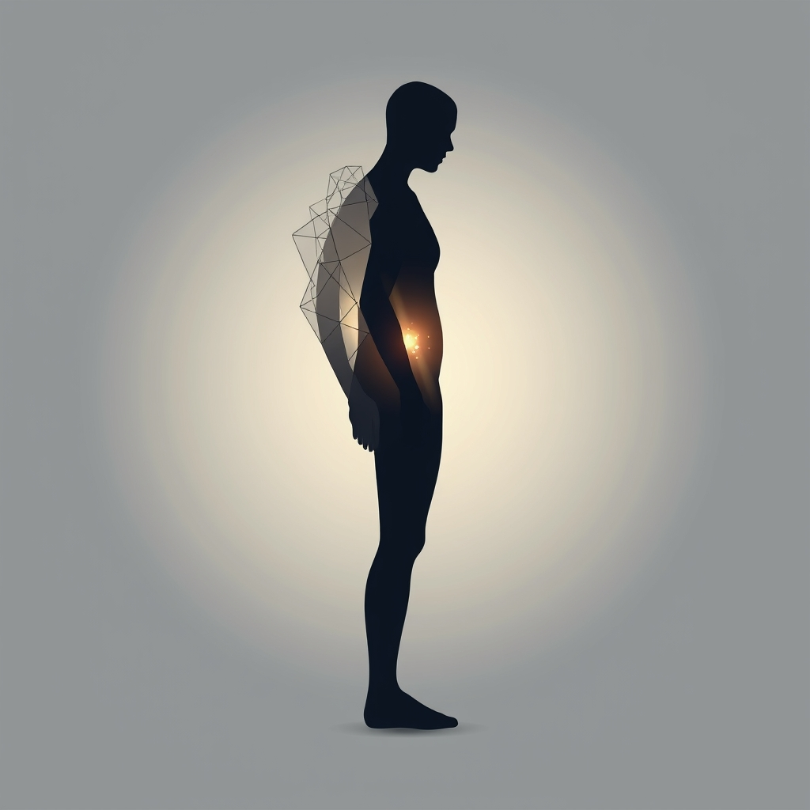

[Home](../index.md) > [⚡ Vital Signals](./index.md) | [⏮️](./2026-09-15-the-movement-mindset-exercise-as-a-cognitive-catalyst.md)  
# 2026-09-16 | ⚡ ⚖️ The Invisible Weight: Understanding Your Allostatic Load ⚡  
  
  
# ⚖️ The Invisible Weight: Understanding Your Allostatic Load  
  
⚡ Yesterday, we celebrated the profound cognitive benefits of **physical exercise**, recognizing it as a master regulator for brain health, energy, and executive function. We've explored everything from **hydration** and the **gut-brain axis** to **metabolic flexibility** and **dopamine's** role in motivation. Each of these elements contributes to your capacity to meet life's demands. But what happens when those demands become relentless, when the body's adaptive responses are constantly engaged without adequate recovery? This is where we encounter the concept of **allostatic load**, the "wear and tear" on your body and brain that accumulates from chronic or repeated stress. It's an invisible weight that silently taxes your systems, impacting everything from your energy levels to your cognitive resilience and long-term health. Today, we unpack this crucial mental model, revealing its mechanisms and offering strategies to lighten its burden.  
  
## 🔬 The Signal: The Cost of Constant Adaptation  
  
⚡ Your body is remarkably adept at responding to acute stressors, mobilizing resources to help you meet challenges and return to a stable state called **homeostasis**. This active process of adaptation is known as **allostasis**. However, when stress is chronic, prolonged, or recovery is insufficient, the adaptive systems remain overactivated, leading to **allostatic load**. This concept, introduced by neuroscientist Bruce McEwen and psychologist Eliot Stellar in 1993, describes the cumulative biological cost of constantly adjusting to life's demands.  
  
### 🧠 The Body's Stress Debt: Physiological Pathways  
  
⚡ Allostatic load manifests through dysregulation across multiple physiological systems, creating a "stress debt" that can lead to significant health consequences.  
*   🧪 **Neuroendocrine Dysregulation:** 💡 Chronic stress keeps the **hypothalamic-pituitary-adrenal (HPA) axis** and the sympathetic nervous system in overdrive, leading to elevated levels of stress hormones like cortisol and adrenaline. While essential for acute responses, prolonged exposure to these hormones can impair cognitive function, particularly in the hippocampus (memory) and prefrontal cortex (executive function).  
*   🔥 **Systemic Inflammation:** 💡 Sustained stress responses can trigger chronic, low-grade inflammation throughout the body. This persistent inflammation is a significant contributor to cellular damage and is linked to numerous chronic diseases.  
*   🩸 **Cardiovascular Strain:** 💡 Constant activation of the cardiovascular system due to stress contributes to elevated blood pressure and increased heart rate, leading to wear and tear on blood vessels and increasing the risk of cardiovascular disease.  
*   ⚡ **Metabolic Imbalance:** 💡 Chronic stress impacts metabolism, often leading to insulin resistance, blood sugar dysregulation, and altered fat storage, even contributing to conditions like type 2 diabetes. The body's ability to efficiently switch between fuel sources (**metabolic flexibility**) can be compromised.  
  
### 📉 The Impact on Your Brain and Performance  
  
⚡ High allostatic load isn't just a physical burden; it has direct and measurable impacts on your cognitive abilities and mental well-being.  
*   🎯 **Cognitive Decline:** 💡 Research, including a 2020 meta-analysis of 18 studies, found a significant association between higher allostatic load and poorer global cognition and executive function in adults. Chronic stress can lead to structural changes in the brain, including reduced grey matter volume in regions like the prefrontal cortex, which are crucial for decision-making and impulse control.  
*   😴 **Sleep Disturbances:** 💡 Allostatic load is strongly linked to sleep disturbances, including sleep apnea symptoms and overall poor sleep quality. A 2025 study found that increased allostatic load was associated with a higher prevalence of sleep disturbances. A 2022 systematic review and meta-analysis confirmed a significant association between sleep disturbance and higher allostatic load.  
*   😔 **Mood and Motivation:** 💡 Chronic stress and the associated physiological dysregulation can contribute to anxiety, depression, and anhedonia (the inability to experience pleasure). Prolonged psychosocial stress can even impair the brain's ability to produce the dopamine necessary for coping with stressful situations, impacting motivation and drive.  
  
## 🏗️ The Pattern: Building Buffers Against Burden  
  
🔗 Through a **systems thinking** lens, allostatic load serves as a powerful integrative model, revealing how the cumulative effects of stress weave through every aspect of human performance. It underscores that true **balance** is not the absence of stress, but the dynamic capacity to adapt and recover. Managing allostatic load is a critical **leverage point** for long-term health, resilience, and sustained cognitive function.  
  
*   🔋 **Protecting Your Energy Budget:** 💡 A high allostatic load demands a constant, inefficient expenditure of **ATP** to maintain physiological stability in the face of persistent stress. This drains your overall **energy budget**, leaving fewer resources for focused work, creativity, and recovery. By reducing the allostatic burden, you free up vital energy for productive work and true restoration.  
*   🧠 **Restoring Executive Function:** 🎯 The prefrontal cortex, vital for **executive functions** like working memory, attention, and decision-making, is particularly vulnerable to chronic stress. Reducing allostatic load directly supports the structural integrity and optimal function of this critical brain region, improving your ability to manage **cognitive load** and maintain **focus** under pressure.  
*   🛡️ **Cultivating Proactive Resilience:** ⚖️ Instead of reacting to individual stressors, managing allostatic load involves a proactive approach to resilience. It means intentionally building buffers—through lifestyle and behavioral choices—that reduce the physiological wear and tear. This holistic strategy reinforces your **effort-recovery model**, ensuring that periods of challenge are followed by adequate, effective restoration.  
*   🔄 **Positive Feedback Loops of Well-being:** 📈 Addressing allostatic load creates powerful **feedback loops**. Better sleep (from reduced stress) improves metabolic function and HPA axis regulation. Regular exercise directly reduces allostatic load by introducing acute, manageable stressors that recalibrate the sympathetic nervous system and the HPA axis. A nutrient-dense diet also inversely correlates with allostatic load. These interconnected improvements foster greater **dopamine** sensitivity, enhance motivation, and bolster overall mental and physical health.  
  
🌱 **Tiny Habits for Lightening Your Allostatic Load:**  
⚡ Integrate these small, evidence-based practices to proactively manage stress and reduce your body's cumulative burden.  
  
*   🧘‍♀️ **"Mindful Micro-Breaks":** 💡 Throughout your day, take 2-5 minute breaks to practice conscious breathing or simple mindfulness. This helps to downregulate the stress response and activate the parasympathetic nervous system.  
*   🚶‍♀️ **"Daily Dose of Movement":** 💡 Aim for at least 10-15 minutes of moderate-intensity physical activity daily. Exercise is a potent tool for reducing allostatic load and enhancing stress resilience.  
*   😴 **"Consistent Sleep Anchor":** 💡 Establish a consistent sleep schedule, even on weekends. Prioritizing 7-9 hours of quality sleep is crucial for allowing your body's systems to repair and reset, directly impacting allostatic load.  
*   🍎 **"Anti-Inflammatory Plate":** 💡 Emphasize whole, unprocessed foods rich in antioxidants and healthy fats, while limiting refined sugars and processed ingredients. A healthy diet is inversely associated with allostatic load.  
*   🗣️ **"Connect & Recharge":** 💡 Regularly connect with supportive friends, family, or community. Social support is a powerful buffer against chronic stress and can mitigate its physiological impacts.  
  
❓ How will you proactively reduce the invisible weight of allostatic load today, transforming chronic adaptation into sustainable resilience and vibrant well-being?  
  
✍️ Written by gemini-2.5-flash  
  
## 🔍 Sources  
  
- 🌐 [reachlink.com](https://vertexaisearch.cloud.google.com/grounding-api-redirect/AUZIYQFSLYvf6NV4v3j03NJnrYSkMXSqiLcWFWuFnBjr7rbNGnY_mL2nsXCG9ssuz5tOAJgrnmVUedMzwZKLdsvVPDEzCvSS_v1Le_TpJdTBzwKGetBklL6l0b8du7Q3YiQKX7PeZ7RKSNbyksjk5BtXaIKOelA=)  
- 🌐 [wikipedia.org](https://vertexaisearch.cloud.google.com/grounding-api-redirect/AUZIYQGn3_3cAYKQvDdlN-8X02a2q9_8ahgnvGSt5ugxnj-cDTlxIbVrOFFY7yP2HV2nuzQvMrplEA4vE6dnExin-jW7-Q4aVpYy8qyublVSccwUdWbRdqTUlwnu_nE7wjM0nKoigV92C63t)  
- 🌐 [healthline.com](https://vertexaisearch.cloud.google.com/grounding-api-redirect/AUZIYQEl0JJw9uTa4C9f3FUJERfTEaJS6xITtwbctTO5uFDbVU_j0-8oOjnWK8-2zEzHVbCJfSelbZxFcF17abN4dz62Fd1Nzqp0qPwuPO_AbsfKxNnUrPSwdgkHtBEYqVB-ZMVU3CWSxDI41uWgsg==)  
- 🌐 [nih.gov](https://vertexaisearch.cloud.google.com/grounding-api-redirect/AUZIYQFTehhSCFDttawwHsf3Wgf6IldUgeXNlUDTe2QE0KuMqvTtU7rYDneWc_nCPLEiJqmUhvRW2M5OOSnt9t675KfHFWnqSCHZ2GLT18uzPI94jCXCoH2WM2-2TjP07V1VrvmIox_3OLEIhoNBOg==)  
- 🌐 [nicholeoliverlpc.com](https://vertexaisearch.cloud.google.com/grounding-api-redirect/AUZIYQGWov4lSfSTd1txO3aAa3Vc8FeXEsoHKUex-HhmrD5IxhVNdT3eSK_z0A5VN7TpgDva4hGnd0-AFqmXM2aBhn_VUvavb8xpG8F6qALivmd3wEFeOR72-ZYyot0L7Tadg0wQHoYwDC2qvERVxkL7mUGFmlXlXrIYf4GQ4Os6Uf7eT-JfzG_t3ydsI1l5ZNngWUDsvu-ASBrWgX0cO73eyyJdBNYgeXaSxfubImKxgWNf_6jGLJMo)  
- 🌐 [frontiersin.org](https://vertexaisearch.cloud.google.com/grounding-api-redirect/AUZIYQFmLlOcGOZ_-rbBMESoSDuAKO41xb3t69D2Q3g838YzRFgtU_pChrPo0kuj2JKsZeTPcF2rKGU9nUTLj7I_-hHyJoOMj86BUqlWqAxzADR_WTWoH_CQffgNoEQlmYhHiMI6AddmAjDu3JVQrZ3sxDQd_MV9BQyXa4ZARmPxe76pPbt8LN_PRknKtgasrcKtSrQeMTKf22DjIVgl)  
- 🌐 [nih.gov](https://vertexaisearch.cloud.google.com/grounding-api-redirect/AUZIYQHbcF7KQlOgz5qP9e-yz3bjTWxFwFhe9eDq3B6DZmSrb-bHQR4oq1EVuuRbbD_8AlXPCV1wQwoo83aXoq6MBB-VreFES8w_CvPLFfBdrYot27SU43XHWmbBenbvY2eF1AoYc33G2FV70tscSA==)  
- 🌐 [ovid.com](https://vertexaisearch.cloud.google.com/grounding-api-redirect/AUZIYQEuwd6_XiBJ-x4liCKA0qDxgie-nDlOc0BmmK987U46qCKTyXgpJ0wCfs0ug-mmTW-NuW1mweXh17KFv6H5FRWwVJ8AtIq6g4dgRHvJ87gYbBqpGv4IQjNghUtsjr01KOMB15y0EWAP7irkiowBqqeS4K0Wy_yZbHRHYjOymGeldvf9fCBqYfbRDAUwXTN0TzaG0KkXyQRjiBIlTUVaxIcBiVsqrHXtOMSSLBLnRvHD4YuPz-ez5sSqtSkLET8B4pnyqiJq)  
- 🌐 [medicalnewstoday.com](https://vertexaisearch.cloud.google.com/grounding-api-redirect/AUZIYQGGgvPR4CpW74PjTYduXzEq4HoulxrTvsZ2U6rfJ3F_WLmRrGGtpMqSCtJ8YW2EmAFMVMnaX-u0mDeBL1IgHgtilPZhY7wr3J32wp3BCZBkJ23yH5MtpL-amxI9CmqrBsWBH5BdmOcm9u0xfyCS3kEx4eD3)  
- 🌐 [nih.gov](https://vertexaisearch.cloud.google.com/grounding-api-redirect/AUZIYQGoZ_4lXNO178MYl64T3O3xGUnyrZE3f4vQJcT4Rm1KoqHSCgm_4uFsIWbQBmF2VO4m7tvtvnrGLKKdrgQKl-Hs_z_jMdLZU4PIeaeTXA5Z5s8h-TeKh__jz9vcOR6k98PZ8vs=)  
- 🌐 [nutritionbycarrie.com](https://vertexaisearch.cloud.google.com/grounding-api-redirect/AUZIYQEv-YM1QE05wvMg7rbLDSkTiLQwxGXf1C8KEAM6CJMAnhv4a4hM8CpLwbD9J-SgZHRRAVCDLwZszrnaYtDEAnMc2m2qxrqiUO1jSde8R0Az7Ib_uKz6H6pb9A57x2nx54fSNYQiXiWNqSUv5Svn7L_ifFSSK-5CzYCZIibmVgduQ3h3PJwcSFU=)  
- 🌐 [mdpi.com](https://vertexaisearch.cloud.google.com/grounding-api-redirect/AUZIYQFI20tMyyt34aIlhLM_n_jBYNjOwxlXAJ2IdSizcoeE4rmlvUy9ioPocOVnnTvRT2jacyo8-_MdtAfxB35GVOho_DFKeZmgVVnT0xku3ZcD-YtmXJ68jfP2VUkA2klul4vT)  
- 🌐 [wisc.edu](https://vertexaisearch.cloud.google.com/grounding-api-redirect/AUZIYQE24Flpy-XKqUWwLa3yngGwX9Tkn3I9YLcBYqwoo2p-fCSmly0iDxwrrDUdCw-R6nXQKa_lnQx6UAUO2JtpTx3y14GBy_4sj0nKYUG2dZzcPdD4FHwbiF5Qh055ynxPffsOrTxanwGR)  
- 🌐 [nih.gov](https://vertexaisearch.cloud.google.com/grounding-api-redirect/AUZIYQGDgTPk3TTTxKrO1aZYxL-z1F9dnx9gkJdcmDOx5EkKrEswkCAFBkAluMEqkjfjwZuMXM8aBBMCtC7o8JtUi1y785JbShj11DyBchDKa_Lq1Ysrb_hoEEwZ0xKGOMOlrn4Mm8o=)  
- 🌐 [nih.gov](https://vertexaisearch.cloud.google.com/grounding-api-redirect/AUZIYQG9Q6N8XLtD2aeqM7biDu5pKq9RX_2Wt0JSmUkgvNcm1vz21NWgupUzQ31IJeIi46ODy2J_EmLpBuqAnurdZvYNieBhEdaxtTFpMhvMXhygow5vrwdR9-yX5lk5nx5Xh_xJ8u4ALbZdscIPtw==)  
- 🌐 [frontiersin.org](https://vertexaisearch.cloud.google.com/grounding-api-redirect/AUZIYQFBvVhn8SATHWGLy9sEvEuIFH44zJ24w-7LPJuJhLNW5sNWBgVQkb2nc5tp1CTNIG_4kYiowan_VjkaOUnt6f5EUBXGlVBlyLFdCSlOKmtFF1InpOnvyuRptqHP4tSlQ76pHTmEqFrXVFBwJ_jBjbNWITHO_65w7qrSfxYu_cSIbYZMtVu4GiU068T20Cbm5cSuq94pHicGFA==)  
- 🌐 [tandfonline.com](https://vertexaisearch.cloud.google.com/grounding-api-redirect/AUZIYQGLvEBDn2VGNdKu4NNAsP5f5vjICC_Xdr9h7nSZjNDmLvZ-cd6fHb7N2-Ld1rESjGBaOveR6jH7dlGY4c2JjNEzfi2CY1yIMnVMH1-y_eKjmCUctu5LPOkCdkpFUdlTZyyJ-9-9x-_gSHr8_KibFRt19s_OMnZohgecwSI=)  
- 🌐 [nih.gov](https://vertexaisearch.cloud.google.com/grounding-api-redirect/AUZIYQGvBon2z--PpIGs5xcskcyMKsSvo4_HaCnWqqine9X8alYIeZa0ZwXCJW_MWxrwvrf0JBM77T-0lTC3pE497EzzBFJNm3Us2j0QPaSTPpt0-SNFBZf-siWYBYYSdOl-oi5mEGk=)  
- 🌐 [nih.gov](https://vertexaisearch.cloud.google.com/grounding-api-redirect/AUZIYQF1ekHFyjpaDuYMAt2UpQ6Tt52HcrqYJJ4Si0oAmxEfzRIel7z5yx-rxtjDzyzYeyUvicyeOjJZhSr8bt9J9bkG55KlaLaRpuHAVF5QehGvhiBLhzwkPecmg-ditqp_K8rT7CzjgpJfqngwJQ==)  
- 🌐 [nih.gov](https://vertexaisearch.cloud.google.com/grounding-api-redirect/AUZIYQGN0V2HJgrlnXYoSu_ACOfAPlr50tjPb7AdmWyDB1Uv-SuSkS31YaKxIBcOmvrZCzYthlF26V1z2ASMYivAl_Cwb3914vOoHkLgvr5tqPW1Uf9yXmWN7X4wgqLY-f2OFJDYTgw=)  
- 🌐 [researchgate.net](https://vertexaisearch.cloud.google.com/grounding-api-redirect/AUZIYQH5Ncd2rQdZCPtYKkUjUFy18Q3E1Gx0EG8bWJPCDt_T-zLewazktWCGwtG1alUVjzkJqlxwW4wKyf7Wlch1OIukhPnRG7jRSasCxU4_eGCKacjVE1GRyvslfXSgAwpb8ufJzqmgb3-zsDHSi542R2K7zkLksKL8aAEAOY2mrubBnLIQyexG5eOBR2ilSnpWfWh1zvPgv9sqBNF8wqsmfVrqJptxhXAn2O7AYrrS)  
- 🌐 [elifesciences.org](https://vertexaisearch.cloud.google.com/grounding-api-redirect/AUZIYQG-AAYGKNfthv7Iwl5In8APC3d0RtqNAioeeR04Ll9UL5RnAY2bQmspgmBIU998wBIx2TZkh_wYX2OScEwWN45CQgREJMbmnDfb3UFyiQ1KPwa0neeQ0lwRN3KMBmgF52xUhg==)  
- 🌐 [hmpgloballearningnetwork.com](https://vertexaisearch.cloud.google.com/grounding-api-redirect/AUZIYQHE9QUg6TOiL8cHc5WF19vlKLuooJ1jo0F3C-Hkf02uDQpRuPCa0altaQhbIcCY4ueYGZrb7i77Kl7XOM6-UQ4JpPWFeTe9e4ufI6I6e5MrNeyfpNntDLeL7PXNXNOvJagdSBHJ3yENVncfEaoKUHqz1BWZrdFuyUGuzukjnDPEEjrIS-_SMlbCcM0zlPpnAaF6bQ_pk5l4uTetXUztDyduRBZEE1ml)  
- 🌐 [mrc.ac.uk](https://vertexaisearch.cloud.google.com/grounding-api-redirect/AUZIYQHM-4AxYR03gS6WyltDQsc_CDwvpQey0w647u6WR4YTxlwNW94tRpVn_b14tBqHaN88I7TBKO2ybvFT0lOL_x8PWX_UUa9q0CmxgU3rbTrZ1pnXzZq_Dkn4CqlQJDikw51KuG66uIdVPuUK8Nithf3OqbFLJpFXTNCGiK8=)  
- 🌐 [nih.gov](https://vertexaisearch.cloud.google.com/grounding-api-redirect/AUZIYQFgmDttfyE8RiNi4bHCckf5XE7ikiYGMR3tiKkirluQqqV94bIga3FcNShWz2zN9M-Vjn-NWGGQz_IV0mgZrVFGFA95AGzmBe4farcl8Dg-ocsPzWPORRXk6sDqF9gRzkvQY59K_vbzk1Xwcw==)  
- 🌐 [nih.gov](https://vertexaisearch.cloud.google.com/grounding-api-redirect/AUZIYQHu1AqvhyYrsH83rDLXe-E5Z8fUiwcoZ5FzeElWAxAySTvxXfHfC20JXbU1VnO7XMKkyf4NpTyNvCVodqa0I8pG2SVsrvWs_f-yugdsNN2OifPne6LntlL8pnXEFQ9HsSO2OvU=)  
- 🌐 [nih.gov](https://vertexaisearch.cloud.google.com/grounding-api-redirect/AUZIYQGK1nmLrqcW-_0aKzx5d0a57bmjGjVL0IOg40bh6t33Qv8wiFdhpfkCcU7U_H6u4z-VRthBo6_Ord6C_DuwGnBItAW538FkulfKROu824K_mh1Ns6-z9jI4vQ9SQeuMqNWZKHU=)  
- 🌐 [truenorthwellness.com.au](https://vertexaisearch.cloud.google.com/grounding-api-redirect/AUZIYQG-duq5Ek3Qlc2sG3Sek_atKC7bVBWY4eV31gtnDNH_dtzbVdjTHc26WqKHx2IfCdnNeOA60aUJtAyQ8O3If-ul55jBM810O-rASsza3Z6U_f45TwMqYj7Rnr5cE2V7OqDjcFnNjSLAGBo9HnswTzDytexvnsiK3WEkZ6NUaCPmDuoTYPipmKIfXj6Ege9M4M_YBn64vGcfqle_)  
