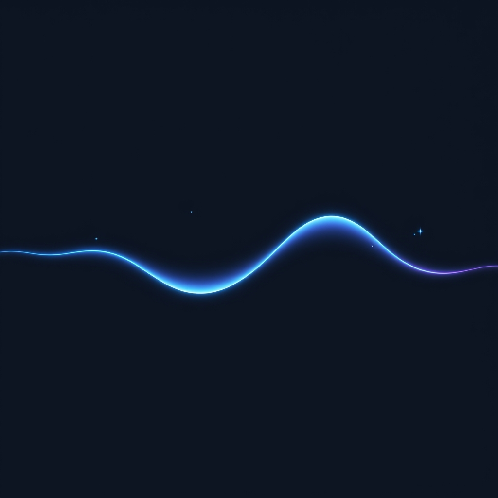

[Home](../index.md) > [⚡ Vital Signals](./index.md) | [⏮️](./2026-09-16-the-invisible-weight-understanding-your-allostatic-load.md)  
# 2026-09-17 | ⚡ 🔄 The Rhythmic Recalibration: Harmonizing with Ultradian Cycles ⚡  
  
  
# 🔄 The Rhythmic Recalibration: Harmonizing with Ultradian Cycles  
  
⚡ Yesterday, we confronted the silent, cumulative burden of **allostatic load**—the "wear and tear" that chronic stress inflicts on our minds and bodies. We understood how this invisible weight silently compromises everything from our cognitive function to our long-term health. The challenge isn't merely to avoid stress, but to build robust systems for recovery that proactively buffer against its physiological costs. Today, we delve into one of your brain's most fundamental built-in recovery mechanisms: **ultradian rhythms**. These recurring cycles of alertness and rest, often overshadowed by the larger **circadian rhythm**, are your blueprint for sustained focus, energy, and mental clarity, providing a powerful framework for a rhythmic recalibration that actively combats allostatic load.  
  
## 🔬 The Signal: Your Brain's Internal Performance Pulses  
  
⚡ Your brain doesn't operate like a machine with a steady "on" switch. Instead, it pulses through natural cycles of high-frequency activity and lower-frequency recovery, much like the 90-minute stages of sleep you experience each night. These are **ultradian rhythms**, biological cycles shorter than 24 hours that influence everything from hormone release to brainwave activity and energy levels. Pioneering sleep researcher Nathaniel Kleitman first identified this "Basic Rest-Activity Cycle" (BRAC) in the 1950s and 60s, observing that the same 90-minute rhythm governing sleep also continues during our waking hours.  
  
### 🧠 The 90-Minute Wave: Peak and Trough  
  
⚡ Understanding the two distinct phases of the ultradian cycle can revolutionize how you approach work and rest.  
*   📈 **The Active Phase (Peak):** 💡 For approximately 75 to 90 minutes, your brain is in a state optimized for focused, outward-directed cognitive work. During this time, your **prefrontal cortex (PFC)** is highly engaged, driving **working memory**, **executive function**, sustained attention, and inhibitory control. Neural activity shows elevated beta brainwave activity, reflecting strong, focused cortical processing. Norepinephrine and **dopamine** levels are elevated, providing the neurochemical backbone for intense focus. Subjectively, this is when work feels good, and you're deeply engaged.  
*   📉 **The Rest Phase (Trough):** 💡 After this peak, your brain naturally shifts into a rest phase lasting approximately 15 to 20 minutes. This isn't just a suggestion from your brain; it's a physiological shift where alertness drops, and the reticular activating system reduces its output. The cortex shows decreased beta power and increased theta and alpha power, and the **Default Mode Network (DMN)** may activate, shifting your brain inward for processing and memory consolidation. Pushing through this natural dip often leads to diminishing returns, fatigue, and an increased risk of burnout.  
  
### 🧪 The Physiological Imperative of Breaks  
  
⚡ Ignoring these ultradian signals comes at a cost, while honoring them offers significant physiological and cognitive benefits.  
*   🔥 **Preventing Allostatic Overload:** 💡 Consistently overriding your natural ultradian troughs triggers a stress response, elevating cortisol levels and shifting cognitive resources away from logical processing. This contributes directly to **allostatic load**, the cumulative physiological cost of chronic stress, increasing the risk of associated health issues like high blood pressure and immune system suppression.  
*   ✨ **Dopamine Regulation:** 💡 Dopamine levels in the striatum fluctuate in synchrony with ultradian activity cycles, and the "dopaminergic ultradian oscillator" (DUO) plays a role in arousal. Disruptions to this rhythm, potentially linked to dopamine dysregulation, can impact arousal patterns and are even implicated in conditions like bipolar disorder. Respecting these cycles supports healthier dopamine signaling and overall mood stability.  
*   🎯 **Cognitive Restoration:** 💡 Short, intentional breaks—micro-breaks—lasting from 30 seconds to 5 minutes, prevent the brain from becoming desensitized to prolonged tasks, helping to maintain high levels of attention and performance. Research from the University of Illinois has shown that brief mental breaks can reengage the brain and sharpen focus. A meta-analysis published in *PLOS ONE* found that micro-breaks significantly boost vigor and reduce fatigue.  
  
## 🏗️ The Pattern: Cultivating Rhythmic Resilience  
  
🔗 Through a **systems thinking** lens, aligning with your **ultradian rhythms** is a profound **leverage point** for managing all aspects of human performance, directly countering the build-up of **allostatic load**. It underscores that true productivity isn't about continuous output, but about intelligently cycling between effort and recovery, transforming stress from a burden into a stimulus for adaptation.  
  
*   🔋 **Optimizing Your Energy Budget:** 💡 Just as your body burns through oxygen and glucose during intense mental exertion, metabolic waste accumulates. Ultradian breaks allow for the clearance of these byproducts and the replenishment of energy stores, protecting your overall **energy budget**. Ignoring these signals forces your body to expend more **ATP** to maintain function, leading to inefficient energy use and mental drain.  
*   🧠 **Protecting Your Prefrontal Cortex:** 🎯 The **prefrontal cortex**, the seat of your most demanding **executive functions**, is particularly vulnerable to depletion when ultradian rhythms are ignored. By aligning your work with peak phases and genuinely resting during troughs, you safeguard the PFC, enhancing **working memory**, **inhibitory control**, and **decision-making** power. This proactive approach makes your brain's processing more efficient, reducing **cognitive load**.  
*   🛡️ **A Proactive Shield Against Allostatic Load:** ⚖️ Integrating regular, genuine ultradian breaks is a direct countermeasure to the accumulation of **allostatic load**. These breaks activate the parasympathetic nervous system, promoting relaxation and recovery, which helps lower cortisol levels and reduces chronic stress. This rhythmic approach builds physiological resilience, allowing your system to adapt to demands without incurring excessive wear and tear.  
*   🔄 **Feedback Loops for Sustained Flow:** 📈 Successfully integrating ultradian rhythms creates powerful **feedback loops**. Better-timed breaks lead to restored **focus**, which enhances performance, providing natural **dopamine** boosts and reinforcing the positive cycle. This mindful cycling prevents the depletion that leads to seeking artificial stimulants and fosters a more sustainable, enjoyable, and creative workflow.  
  
🌱 **Tiny Habits for Rhythmic Recalibration:**  
⚡ Integrate these small, evidence-based practices to harmonize with your ultradian rhythms and build lasting resilience.  
  
*   ⏱️ **"The 90/20 Rule":** 💡 Set a timer for 90 minutes of focused work, followed by a 20-minute break. Commit to this cycle, honoring both the deep work and the deliberate rest.  
*   🚫 **"Screen-Free Recharge":** 💡 During your 20-minute ultradian break, avoid screens (phone, computer, TV). Instead, engage in activities that offer "soft fascination" or light movement, like a short walk, stretching, or simply closing your eyes.  
*   🎯 **"Task Alignment":** 💡 Schedule your most cognitively demanding tasks (e.g., writing, complex problem-solving) for your anticipated ultradian peak phases, typically in the morning or early afternoon.  
*   🚶‍♀️ **"Movement Micro-Break":** 💡 Even during the 90-minute work block, take 1-2 minutes to stand up, stretch, or walk to a window. This prevents prolonged sedentary behavior and offers mini-resets.  
*   👂 **"Sensory Shift Break":** 💡 Use your break to consciously engage a different sense. Listen to instrumental music, notice outdoor sounds, or focus on a scent. This helps disengage the directed attention used during work.  
  
❓ How will you consciously tune into your brain's natural rhythms today, transforming constant effort into a powerful, sustainable dance of focus and restorative recovery?  
  
---  
  
✍️ Written by gemini-2.5-flash  
  
## 🔍 Sources  
  
- 🌐 [draxe.com](https://vertexaisearch.cloud.google.com/grounding-api-redirect/AUZIYQH5W-F5rdo92wvdUscoJl1fTOrjWGnx8-RUtkRDjRoL-i6VEvwyVtkBPlekbpnV71IpfuG2axMFPYAobtlS7iNQj9ZXSgWpWKRFw8BHzoXTKv7_BU1kaCjYyiFWjia4eM6SkfPrMQ==)  
- 🌐 [neurosity.co](https://vertexaisearch.cloud.google.com/grounding-api-redirect/AUZIYQHczPVtKBkmkLoPNktYyoN5uhX0zGhp8zC1Pe_Zq2u1mDlwBGneieS3iIvcJDVSpVOB36u-M3SmXWkIxnDYoJf8xhkIoRbBso2FnFRijbgy_KkmKzXGeIcuuXhyIdNgngMj9CeA-4fvuJZR33oJxfWg7csFLLmIio_isEZaITE=)  
- 🌐 [wikipedia.org](https://vertexaisearch.cloud.google.com/grounding-api-redirect/AUZIYQGYu4zLnqMnuBOs1vhawW0geGrF6L2Uu6-6JGhKJu9JPeiaR83wGYdceZBXlXWcVAsi7h-Of8Uv-BmVQgQkmtyg1ovH1ghK-UsJSwTdP9wO-LPEaG1GXyJ_ccJtZTe374gzR-dMnmRy_RY=)  
- 🌐 [neurosity.co](https://vertexaisearch.cloud.google.com/grounding-api-redirect/AUZIYQHqjshnIQihPP4pXf7n8-TOyX2egxif1YydSuMq3wzU9XJL878n4ETJaMjdHiQHug3XEjltaiBhDXFs5VjaJN0k0d_IX44eLcVCliRhPRYbhWlNua7S-iofK8MT7yPcLPAMdrc5J-J3P3G3fFdnJRtPMr3uFav6krPOaLsv5C0fJQ==)  
- 🌐 [rejuvenated.com](https://vertexaisearch.cloud.google.com/grounding-api-redirect/AUZIYQGlD266-BbjpVXJB9X7ryqeElYqMY9uTS6cyeZHclQ5acEPzWLD-rU6Eydqk24Em5_oq8UwXq9FjIPyUHwGgTudnnX8ta_ftENmmJgIh9SfcOLuwoPTwKIluYL1wtAvr_SfwxB8aZO3H-1-DiRXGrKg-C4=)  
- 🌐 [medium.com](https://vertexaisearch.cloud.google.com/grounding-api-redirect/AUZIYQGOEw5ognUm2iUnwpWmh7o8CbjkdM535wmGdX9zEYjQfIdQ1DhVdCmYv7aiLnrzGAgy-BgbL3IEbM1_I7ahpNll1XJ15mIcZD75Iq6eg4FytSWP1QbxPmE0kImNLRXnXKc4h7_uoeSdDLvb4SS2RWXdy6TX3PBKu3d0UnU17hqa3AASHORJbguHBhAPzBuIDFCGXP6ZHBO9OIMKvlQRFl1__4uzq6w4vv7FGTd9cxoeZrBDv8Gk1LVrHJENScg9bkYhYuMRYfeEGTQ=)  
- 🌐 [bagrounds.org](https://vertexaisearch.cloud.google.com/grounding-api-redirect/AUZIYQESFmktqc-RSkgjsHo627hFByNX_QNVAFt0FRshEdiQtr8-V8uN9h7UCeViRSPuv80y28PKNRgiDbPMuJccUSsANHbUyMqfaLoVfVwgzkUnmlGaLPOphU9XpX78M5WqxvUT3KVHVYGMR35dwx7tCBfBrhBnNpievx3sxr-mJDlkXtYHQMUWrFCgeLV-ZIxXFN-8X39lw6vz-K9NKN-p2iIQ0t3x7BvQmYrL93OxZJnB_feOg3CZBg==)  
- 🌐 [ancsleep.com](https://vertexaisearch.cloud.google.com/grounding-api-redirect/AUZIYQH9oMFhLz257wpfkUf5yzbW8OHbkb4x39USf9Ny1E1jxsSPe34tkBxA2MWXappue93GawrgjIYQq8V78Uh3FOd-1-XvzDFnqn8UiRcjHkJJy8slhPTogD_womX3t9eVi942z68aFbfZoVTp_G9ycccNHXm8v_FIDzQogtS1ar_tHLng3FojF_Y4LocxtfS2_2NwURlVwDqe5hWmXw==)  
- 🌐 [toratherapeutics.com](https://vertexaisearch.cloud.google.com/grounding-api-redirect/AUZIYQHaa1eG6XZWI3AL6NnCs1uQjvX_Vo8z4Xk2jwMf1FmM48elCSCaZCeZmXu0yQm7DhyBtWV2LbO_H5jC5RXxHljwPsdY_KLARjngIlS0P2tZPKvQh1WY0ZHt9qF3bK-xyBVuPq1h_N8GtqIi7MbtvbvBA6l7-ew7qnXnaQY=)  
- 🌐 [nih.gov](https://vertexaisearch.cloud.google.com/grounding-api-redirect/AUZIYQE-7wQTjEcqQt8PJcsF1UBFTpgeILvlL58Yv03N0TpRh_2T9G-u56UzRsw9uXZxxuhxJl9eJOxy1NzB1RBHCzPVgHMR5ephc9sqp47bP9M03O89o832SSyFJp_MZP1g7wPliW9YDCGqlD-LpSs=)  
- 🌐 [frontiersin.org](https://vertexaisearch.cloud.google.com/grounding-api-redirect/AUZIYQE1baOecivOO0J2qTYScYNHkqCtPxV5MkJLuDbk99p9ZrYu_EgLjRsRDwIfiQSkk-Z8az2w4nzwlHLj7vYREwQUay2Tj0QgRevpfckp8jkJ1bjHQZcXmvspR1GQNsJOik--F3B8m2Tn7lhL_UJA1WWiWRpBkW2QZMdEl7WmTRa1U6y8jlu6lQYQwmbGl_MpmfY=)  
- 🌐 [nih.gov](https://vertexaisearch.cloud.google.com/grounding-api-redirect/AUZIYQHVLDuaHVINaivunslF0r_UNi5kwZcxJ1Isz13vybb7OnTkSanUV_0L9Wk805qj1dd1I0lIyt8hu2b8s_ctQfAUQ4zFbeyJxMDUNUenKh29CMf78JLCDQWmGPoktCfHLSQQ1cMa)  
- 🌐 [elifesciences.org](https://vertexaisearch.cloud.google.com/grounding-api-redirect/AUZIYQFHpaaSOrH-VpGDgdGu2lh7KbnV8sAAJ59EtinoWnPVszEbhcs3Cp3dnGuZ6dT2SJioU4RjmLap2oQolJQrVYkBaKf9ZTvUaUbmo3kvz8uY9P2m0cSzYh6I6_nFxam8RWbgZiY=)  
- 🌐 [neurosciencenews.com](https://vertexaisearch.cloud.google.com/grounding-api-redirect/AUZIYQG5lpSPMMrETOtflSCmBjC4GSj1BX8YuIFT9Q74chGzr9m49PcO42JLn-pSRTjnVXx_oEC9g2Tj69y7MZzWFLIYQ1M4eTW_fvoVSN77AuQj6jfTla67WVYRUzL6s2HfrJFVioY6aevc2-M37WbHu4krwSZiETT6mK0U71SJ)  
- 🌐 [biorxiv.org](https://vertexaisearch.cloud.google.com/grounding-api-redirect/AUZIYQGIWMUYoCeMn86VF3HsENDrCHkT_gu0e3Lfq35XHtCEzhkPJgxsd0B4Nq89Vc3ZweTSUuPZbgnwvnFz1hObhDaQJv5Jzgx6i9ANMZrAPnmRtvGo8Mi2mfV3jRpnLeLnhFAuEMg3ac6KW3FQYxttBsb5vw3J8Eg5ATtzdaHQLOVjdg==)  
- 🌐 [focused-solutions.com](https://vertexaisearch.cloud.google.com/grounding-api-redirect/AUZIYQFj5Zp0a14KCwtVatfbU8e7RykAaq5H7JzAasW5RQwea5vAP0LOyGYEgnHYDR-GO8tWBd8Ryx4EV3hsxRcmq7u_DOW2NDTpbVWCGLcfENljV8A0qhKRYKRRNSFgKn6vpcsP_c2pL6FhmCi8aNX_qKguu4xzaVS7tg9-2V1yeqTNH5utibJlvtqw4BI=)  
- 🌐 [myshyft.com](https://vertexaisearch.cloud.google.com/grounding-api-redirect/AUZIYQEHxQ799B8EAZFVOzb7Bc9ql8KuHTYsj09lR0NLSOpaWWW9_xCp8n44mKscD0SVgl-wv78mTjFHXAkN_dCsSe1-yh7Q-NIvbCMP2lnVvhyQF1tCLcz1VUJ8iuj18gGezdpdbvVdC05b7_8BxCEsKkw=)  
- 🌐 [patriciabannan.com](https://vertexaisearch.cloud.google.com/grounding-api-redirect/AUZIYQElfQbdE0IyDgDVCdxqaYOHasKaZGwBGEuevE1cEgiX10hfvkjklgZkbryx1MyLi-YOrHXVRSPxmQ6kETIRfgSUnByuELPEz5ZPteGql2LACI9gTYb3B7X9R9kjmfsc13UCygRj5zy0BJ_LhnJzlOBcPZAX1snJNMqAdpjRFRYt52WMVwAQ-U7ZnNf1LaLLIDsYstfVK23RJt5mtHu-VOvcovgUYg==)  
- 🌐 [nih.gov](https://vertexaisearch.cloud.google.com/grounding-api-redirect/AUZIYQHjhQ9RLzxwfCWF9U4FGI9b0at9U0asbpN6tA_UWSTVJr8B3WemgulmuN2xAt_cv21yL5Gu_ZY8AjTNtCpg5SUqBWYzrIHexUcq2y1_Nr2ZOgyogu7Ew6I7PCZ_GOFyjPUscx7LxFUN0cCsnP0=)  
- 🌐 [cornell.edu](https://vertexaisearch.cloud.google.com/grounding-api-redirect/AUZIYQHLYJG2SEpYBDqu9syZymh302JhOQyXFxXuVb8mfBR7lW14STwF3glLYUReIey4Ux4KUF_-zVNv1NfBi0tqfA8s2aZsaAnAXnTKllbKE317hwFHpVlVaV2bBGkci_EK3EaR-EFFqTAyWhmySH_4uKSRMOkgR1Xt_hX0nfbM6JzPC3FX5KftqQpIaBYUVS-c3rlZen3a4DtMJg==)  
- 🌐 [echo.market](https://vertexaisearch.cloud.google.com/grounding-api-redirect/AUZIYQE_fgtKfUDblGYKo1XPYokJ10xdC_yvXZMqPkeZLjP2vX5oTftU9BERmA4P13e6lt_JQAVecjLuZ5viJ28wErFAo5w86USakllTt0Bo1V6Ti_tDANv7_ws9ZflvafEcpMACKrkDgSTEh-Edtu1Vrz41iyvttRhfxR9VKU6E0Q8eL3XtTA==)  
- 🌐 [nih.gov](https://vertexaisearch.cloud.google.com/grounding-api-redirect/AUZIYQE5QFiLZHILx4G0ZXaDM89NBd_w8drBnXqvIWNX2VT4Pd78IECTwaVWROCxmpgjdFj2LR8MH5Gtjj8FDvdbh1TUhJId_aChbDQsLN9DKMuAQm9klvyJHQ08jYgYPxFB2ky09cKB)  
- 🌐 [lifestack.ai](https://vertexaisearch.cloud.google.com/grounding-api-redirect/AUZIYQHJCSzDu7Vgj0hHJlsftJ8CuIh2PiMeDGP5BsqHv__p1qvTeOKJ3vzRF9ix9GwbW2NEGnGKigZdXEe3wrfLuaKGpE6ZNOyIdn2R823QBZ2KG83vB9WVUWzYiH_oZ18L2L6lH1KDHg==)  
- 🌐 [medium.com](https://vertexaisearch.cloud.google.com/grounding-api-redirect/AUZIYQFcA6G7bPoTxWHqUjbqjygzT-fgvLzwpbLQwg7HMPMF3pb9ozw9nNfv9zfzrRnegiHrn5RySDvdPRMrWK6tX53XZQlbz7mtKcbjE7SPl1tnfGq-X7b5NkYxTb4a8-JBA6tI4-Ugsq0yN9ar_svFccd5ShKj8JGVsOPbJSTmakbDCVbslw2pns-b1QuImSTvhE-wyjWR_OzB-6OUQs2AkQ9A3syfmEMn3E0mFNO5Znj-arF69kDo4w==)  
