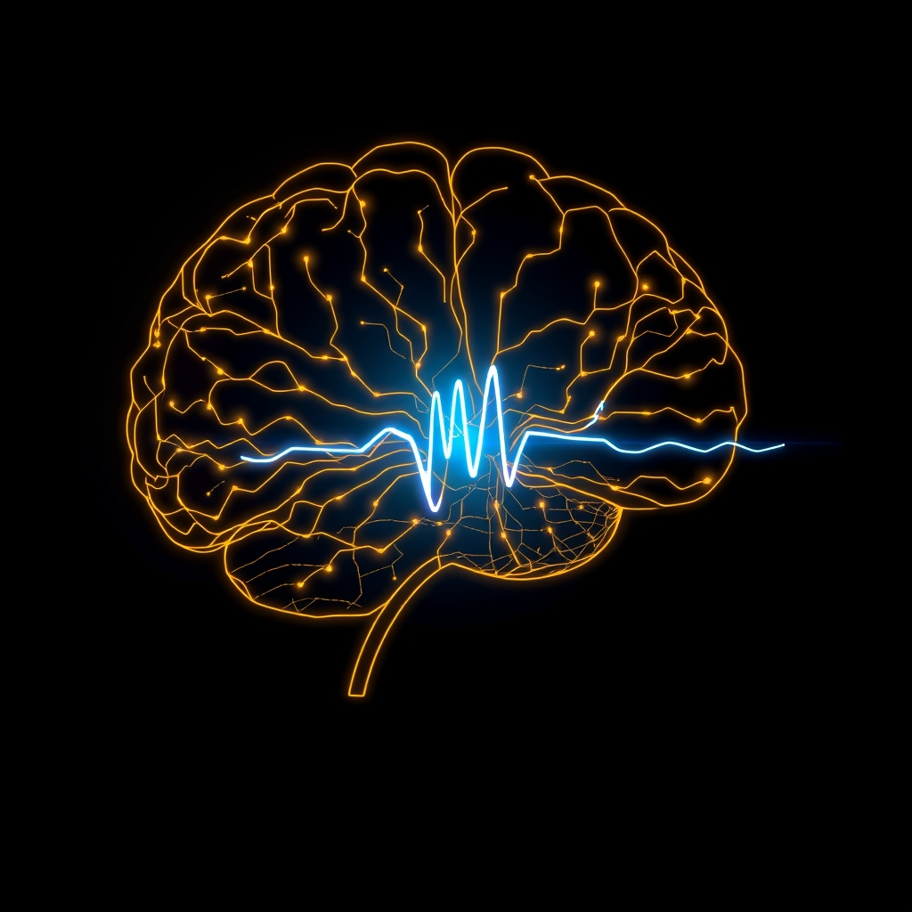

[Home](../index.md) > [⚡ Vital Signals](./index.md) | [⏮️](./2026-09-18-the-architect-of-your-waking-mind-deep-sleep-as-the-ultimate-performance-upgrade.md)  
# 2026-09-19 | ⚡ 🔬 The Signal: Your Brain's Motivational Architect ⚡  
  
  
⚡ Yesterday, we delved into the profound restorative power of **deep sleep**, revealing its role as the ultimate architect of your waking mind, from memory consolidation to glymphatic clearance. We connected it to the wisdom of **ultradian rhythms** and the buffering of **allostatic load**. Today, we extend this exploration into the very engine of your drive: **dopamine**. Often oversimplified as the "pleasure chemical," dopamine is, in fact, the brain's fundamental currency of motivation, anticipation, and effort. Understanding how sleep and strategic recovery intricately regulate this powerful neurotransmitter offers a critical **leverage point** for unlocking sustained focus, intrinsic drive, and resilience in your daily performance.  
  
## 🔬 The Signal: Your Brain's Motivational Architect  
  
⚡ Your capacity for motivation, persistence, and even the willingness to exert effort is profoundly shaped by the intricate dance of your brain's dopamine system. Far from a simple "feel-good" switch, dopamine is the neurochemical architect of your ambition, constantly assessing whether a task is "worth it."  
  
### 🧠 Dopamine's True Role: The "Go Toward This" Signal  
  
⚡ Dopamine acts as your brain's internal compass, signaling salience and value, pushing you towards action.  
*   ✨ **Anticipation and Effort:** 💡 Its primary function isn't just about experiencing pleasure, but about *anticipating* reward and generating the *drive* to pursue it. A healthy "dopamine baseline" is associated with higher motivation and a greater willingness to exert effort for meaningful goals. Conversely, a low dopamine baseline can manifest as depressive states and a preference for quick, easy gratification.  
*   🔗 **Learning and Habit Formation:** 💡 Dopamine is crucial for **reinforcement learning**, helping your brain link specific actions to positive outcomes and thereby forming habits. This system is vital for adapting behavior based on experience.  
  
### 📉 The Sleep-Dopamine Feedback Loop: From Drive to Drain  
  
⚡ While acute sleep deprivation might sometimes lead to a "tired and wired" or "slap-happy" feeling due to a temporary increase in dopamine release, this is a compensatory mechanism that does not offset the cognitive deficits of sleep loss. The long-term and chronic effects tell a different, more detrimental story.  
*   📉 **Reduced Receptor Sensitivity:** 💡 Research, including studies published in the *Journal of Neuroscience*, consistently shows that even a single night of sleep loss can significantly *reduce dopamine D2/D3 receptor availability* in the ventral striatum and D1 receptors in the striatum. This means your brain becomes less sensitive to dopamine, requiring more stimulation to generate the same sense of drive or reward.  
*   🎯 **Prefrontal Cortex Impairment:** 💡 Sleep deprivation impairs the **prefrontal cortex (PFC)**, the brain region critical for **executive functions** like planning, decision-making, and impulse control. This weakens your brain's "top-down" control over reward-related regions, leading to increased impulsivity and a bias toward immediate gratification. The striatum, where dopamine and adenosine systems interact, is particularly affected, leading to issues with cognitive flexibility.  
*   🍫 **"Wanting" vs. "Liking":** 💡 Poor sleep amplifies "wanting" (the urge to pursue rewards) over "liking" (the actual pleasure derived from them). This imbalance explains why, after a bad night's sleep, you might crave sugary foods, endless scrolling, or other low-effort, immediate rewards, while long-term, effortful goals feel significantly less appealing. Your brain's reward system, in a depleted state, seeks the easiest dopamine hit.  
*   🔄 **Disrupted Rhythms:** 💡 Dopamine naturally fluctuates during sleep, decreasing during deep sleep for repair and increasing during REM sleep to prepare you for wakefulness. Disruptions to these sleep stages lead to imbalances in dopamine production and sensitivity, impacting mood, focus, and motivation.  
  
### 💡 First Principles: Recovery Over Stimulation  
  
⚡ The science reveals that sustained, healthy motivation isn't achieved through endless stimulation or willpower alone. It's a biological outcome of a well-regulated dopamine system, which is fundamentally built upon robust and consistent recovery. When your brain is under-recovered, your dopamine system is running on low battery, making effort feel disproportionately heavy.  
  
## 🏗️ The Pattern: Rest as the Foundation of Relentless Drive  
  
🔗 Through a **systems thinking** lens, prioritizing consistent and high-quality recovery—especially sleep and strategic ultradian breaks—emerges as the most powerful **leverage point** for maintaining a healthy and resilient dopamine system. This isn't about mere rest; it's about actively architecting your brain's capacity for sustained motivation and joyful engagement.  
  
*   🔋 **Protecting Your Energy Budget:** 💡 A dysregulated dopamine system, fatigued by sleep debt, demands more **ATP** to push through tasks, draining your overall **energy budget** inefficiently. By restoring dopamine receptor sensitivity through adequate sleep, you optimize your brain's energetic processing, allowing for more stable, sustained energy and reducing the perceived effort of valuable tasks.  
*   🧠 **Supercharging Executive Functions:** 🎯 A well-rested brain with balanced dopamine signaling allows your **prefrontal cortex** to operate at peak efficiency. This strengthens **inhibitory control**, improves **decision-making**, and enhances your ability to focus on long-term goals over impulsive, short-term gratification. Adequate sleep strengthens the vital communication between reward centers and the prefrontal cortex, allowing for balanced reward processing.  
*   🛡️ **A Robust Shield Against Allostatic Load:** ⚖️ Chronic sleep deprivation, by disrupting dopamine and impairing the PFC, directly contributes to **allostatic load**. Consistently providing your brain with the recovery it needs helps downregulate the stress response, reduces systemic wear and tear, and builds physiological resilience, creating a buffer against burnout and sustained low motivation.  
*   🔄 **Positive Feedback Loops for Intrinsic Drive:** 📈 Prioritizing sleep creates a virtuous **feedback loop**. Improved sleep normalizes dopamine signaling and strengthens prefrontal regulation, which in turn boosts motivation, makes effort feel worthwhile, and enhances the satisfaction derived from achieving goals. This makes it easier to engage in healthy behaviors like exercise, further reinforcing sleep quality and overall well-being.  
  
🌱 **Tiny Habits for an Architected Drive:**  
⚡ Integrate these small, evidence-based practices to optimize your sleep and daily rhythms, thereby cultivating a robust dopamine system and sustainable motivation.  
  
*   ⏰ **"Dopamine Rhythm Anchor":** 💡 Establish a consistent sleep-wake schedule, even on weekends, aiming for 7-9 hours of quality sleep. This stabilizes dopamine's natural rhythm.  
*   ☀️ **"Morning Light Prime":** 💡 Get 10-20 minutes of natural light exposure within the first hour of waking. This helps reset your **circadian rhythm** and improves dopamine regulation.  
*   🚫 **"Digital Downtime":** 💡 Implement a strict screen-free wind-down routine 1.5 hours before bed. Blue light disrupts melatonin and can overstimulate dopamine pathways at the wrong time.  
*   🏆 **"Small Wins Loop":** 💡 Identify and consistently complete one small, meaningful task early in your day. The successful completion provides a healthy, natural dopamine boost that fuels further motivation.  
*   🚶‍♀️ **"Movement for Motivation":** 💡 Incorporate daily moderate physical activity. Exercise stimulates dopamine production and receptor sensitivity, improving mood and motivation.  
  
❓ How will you consciously invest in your recovery today, recognizing that a well-rested brain is the ultimate engine for an unstoppable, intrinsically driven self?  
  
## 🔍 Sources  
  
*   A November 2023 study published in *Neuron* by Northwestern University neurobiologists found that acute sleep deprivation can temporarily increase dopamine release in certain brain regions, like the prefrontal cortex, leading to a "tired and wired" feeling.  
*   Research, including a September 2025 publication by Graymatter Labs, indicates that sleep deprivation reduces dopamine receptor sensitivity, particularly D2/D3 receptors in the ventral striatum, making the brain less responsive to dopamine and impairing motivation and focus.  
*   A July 2012 study in *PLOS ONE* on sleep-deprived mice observed a significant decrease in D1 dopamine receptors and an increase in D3 receptors in the striatum, suggesting specific remodeling of dopaminergic circuits.  
*   According to the Altius Mind Institute, dopamine is a neurotransmitter associated with reward anticipation, motivation, and movement, with a higher baseline correlated with greater motivation.  
*   The Anchorage Sleep Center, in February 2026, explained that adequate sleep maintains stable dopamine signaling and healthy communication between reward centers and the prefrontal cortex, allowing for balanced reward experiences. They also noted that sleep deprivation amplifies "wanting" (reward anticipation) over "liking" (true pleasure), increasing impulsivity.  
*   An August 2008 imaging research published in *The Journal of Neuroscience* showed that one night without sleep increases dopamine in the striatum and thalamus, though this increase doesn't compensate for cognitive deficits.  
*   A September 2026 article by Kori Science elaborates that poor sleep impairs the prefrontal cortex, leading to a bias toward immediate, low-effort rewards and making long-term goals feel less attractive.  
*   Ubie Doctor's Note, in April 2026, highlighted that sleep deprivation reduces dopamine receptor sensitivity, disrupts the brain's reward system, and impairs the prefrontal cortex, increasing the perceived effort for tasks. They also emphasized that consistent sleep and morning light exposure can restore dopamine balance.  
*   Bridger Peaks Counseling, in July 2026, described dopamine as a brain chemical that drives motivation by signaling what is worth pursuing and how much effort a reward is worth, focusing on anticipation rather than just pleasure.  
*   Research from the National Institutes of Health, published in March 2020 in *Science*, found that dopamine influences how the brain decides if a mental task is worth the effort, suggesting it works by shifting attention to rewards rather than boosting cognitive ability.  
*   A November 2025 article from Anchorage Sleep Center detailed how dopamine regulates the sleep-wake cycle, with levels naturally rising in the morning and decreasing at night, and is active during REM sleep.  
*   A May 2018 study from Washington State University's Sleep and Performance Research Center linked sleep deprivation to cognitive flexibility issues in the striatum, where dopamine and adenosine systems interact.  
*   Simply Psychology, in September 2026, explained that a burst of dopamine in the nucleus accumbens signals to the prefrontal cortex, reinforcing behaviors that lead to rewards and forming learned habits.  
*   An October 2020 study from the University of Pittsburgh Department of Psychiatry found that sleep deprivation affects regions within the brain's reward circuitry, including the nucleus accumbens and amygdala, increasing drive for rewarding stimuli.  
*   A February 2026 article from Anchorage Sleep Center further explains that sleep deprivation disrupts dopamine signaling, impairing the brain's ability to assess effort-to-reward ratios, leading to a bias towards low-effort activities.  
*   According to Neurosity, setting achievable milestones and experiencing consistent small wins can keep your dopamine system calibrated for sustained effort.  
*   HealingUS Communities, in June 2026, noted that physical activity helps stimulate dopamine production, reduce stress, and improve sleep, supporting dopamine receptor recovery.  
  
✍️ Written by gemini-2.5-flash  
  
## 🔍 Sources  
  
- 🌐 [koriscience.com](https://vertexaisearch.cloud.google.com/grounding-api-redirect/AUZIYQF-6UV1luW8UoRIMipLUUJh2zOALED4QrbbxIXAKpbvCPcoN3fx4YYURbNaj8KtlzkHm7uLt5xbsNbM8NodQWRhPsArX3bQt4NKhh4re8M-l13oLSK6MGxUnFZVbH4KfeMVEIg-CuOcYcnRef4GV3EDbgwxw4A=)  
- 🌐 [bozemancounseling.org](https://vertexaisearch.cloud.google.com/grounding-api-redirect/AUZIYQHAvTcvD16tNSDy8zLGuTftsieQs9UDx3XX0hCd2F10qVWwzyohZVg9VGn4HjZDNmde71IJE6-FYEj7Rm9TYs6vpfn3Hr_N5Xw-JCfN259_PLy4Yb9nucb5SPzjmDtslqgsP516l7B43sKnu2pI2N23pEosRls5-HO5lqbF6Xu-AZOV)  
- 🌐 [nih.gov](https://vertexaisearch.cloud.google.com/grounding-api-redirect/AUZIYQFKUXWAOJMaiBNv2b_Ew3Uq97erd1_DNtK5a89y5dvnwxJjoP7DzPhMfYMh4GWJw-jSIuAs48dMvKan1p2VpW8TPH8FBazC9WkIuv8WwnlhMBrWnbdvNTY6VWIGs2o4SiHuvOHSFAr_vbnKPFNGuaGHfm0YmLMpH1To77h6z7egXaYzucMKYoOtUSR3nq7AsjsJgZVks9Xzf3O-z4YlV-hA9mTflkAVG7b4gUvZ)  
- 🌐 [nih.gov](https://vertexaisearch.cloud.google.com/grounding-api-redirect/AUZIYQHsR1Uiu5SHWIztUI0gdkLyh4mdjvhxNSsKSI6iiSqbf2-Ct2KdzoIBuz0_svbl53EQHdeVI9ops0WLsh1PiAwWgP0UdJCZ4G3NjXL4sEfGXRf9hJ2r7Jr-9rPGLpnv6xhwsAaDE4Ro0lxWxPM=)  
- 🌐 [altiusmindinstitute.com](https://vertexaisearch.cloud.google.com/grounding-api-redirect/AUZIYQHOsIgiKiQDNjSE009htmO_U8jqIwzlc0qI4WkMR3sN_Afm92UUDOFu3reqErBvMQYtNUrmD11MOlbRbYY0BIGd7IIxvoCyYuPCYCCyVpv0nI7DLvp6cWQNonDMBxbCXA8tKPsI9aB3aFV5Jx3Jdn26DbH7DF2trNkSs-29pf-Pls70_fvFzQELZmfOV9C2hm8YIA==)  
- 🌐 [ancsleep.com](https://vertexaisearch.cloud.google.com/grounding-api-redirect/AUZIYQF5SMuJE8lQhXE-Lxy3Iqrm0iQQ6-yNJ_CPwicZPq_zjNNZaKWL_AYRtqAYJdhIJGs9m1r5Ah89xy-dK2kam59foPT9f9DM0OKXCmi_YvS-ZhY9hT87cJMvc2vcAviFAoc3ZyVRmqjnSqf9Trl-5tKDbf941f8IPwM1g-KH7FqAHS40_mvKx_p2DCFbvTYk1320Y54=)  
- 🌐 [simplypsychology.org](https://vertexaisearch.cloud.google.com/grounding-api-redirect/AUZIYQGPOriEZwE9pTcuHGKc0NbSAqc9z5tBJ3DYQOIIL4qOgk0XZjHMdhYy4aKJWI3atqyB9FKm_MbmWUEe7TZ5FxOQ7fXhvqgPpThyJVsJlSSdZQnWb_gBxi3-OibLGyJvq-7pY7qQSTP8iZzLhOJG0coI-VXu-A==)  
- 🌐 [northwestern.edu](https://vertexaisearch.cloud.google.com/grounding-api-redirect/AUZIYQF0VcBO7wBag4MulpZX_Q8OTgPQ530rTt1HeF0wW4oEJIk3lo6zIGgaoEeervSKwt0EqiH4QzC0T02PLwmRS3UTM3HZ9g0dtgi30cb0PQA5Tpej1Jl1aZTZlXjSK9xH8yzqb26Bi32-Q7N-YcrXhXIUqu9JXrx9gGaBo6kNnWYGxkNtWiBDbfeVeE9qmiYN4Zrx0jEvlgjY-qA=)  
- 🌐 [sciencedaily.com](https://vertexaisearch.cloud.google.com/grounding-api-redirect/AUZIYQGoQx7AKLy-ccArrkZYm8zRoVrRAGCIspQhutLtKmYELz81nFltwXVfEyLTGQiR73pRqxFrr0ZmRHle4oy6LJc_XgDBvgQ6UGGZvecpwx0ruw05k3329k-2Uyodw_dqSF5PrHVnIeMDOM6VSDxEPjrPDEnJfC6v3l4N)  
- 🌐 [trygraymatter.com](https://vertexaisearch.cloud.google.com/grounding-api-redirect/AUZIYQHgyIFF55aT92oWY9EgaUudFaIE7qi3RAKl-fDxefDWAUcN8J8gSg3BDudADx1Aul-ym-TMcnS0kDYflDzZZnHYSJZS01BCZ6vtaA_NuULuOTGEJNvJ3jLeLBn9KQZVPTNqeYHFThKnYqTQI2rDXTsW4mv6KI6fRUnZKPbghT9tIdysKUjRnUwayvw7j1OwArNr)  
- 🌐 [nih.gov](https://vertexaisearch.cloud.google.com/grounding-api-redirect/AUZIYQHLzSa1OkdOblM4cA5fgtr2hDe5fwa3MfQWgDX0yVyJca-9l0D4Asyjwmbs79RxXbI411mDRmZZjg0kMIGYpgq2lhcw3RcmP0ciJD4NabUMrVeE_fZyVoaAZWK-HXjgTmgC98kBgm8QjGLIS4Y=)  
- 🌐 [nih.gov](https://vertexaisearch.cloud.google.com/grounding-api-redirect/AUZIYQHUuenbw4HdwEA6KN-zMOyyqQeB7WgGcgALB8V9rSVO8CMF3fhBTTciUlyCRdMYKDu_3sILNErZxxis1G67qjrp4czLKbENdRLQ5Ju-htjespMdw6b5zBqjuQLm_jzWb9VND8cPLx9bentR-O8=)  
- 🌐 [ubiehealth.com](https://vertexaisearch.cloud.google.com/grounding-api-redirect/AUZIYQG5zqGTAWczpNrQ-DZmdmkVQUOcQvwruA4D3NMcl8b7tUadzFoiLRExrXOilrTwRdb-K70NcgjLtE-jDjpHMfeB87GBFG4r6G-XU24rLFvHSTqQciparY2R38La2Btfcr_awGf32tNDGdOXaiNH8V_QzQaQNNpIAErTlE9_6I28eKRz0JeYt3cFFI2F9pEuy64eMV6slXo=)  
- 🌐 [harvard.edu](https://vertexaisearch.cloud.google.com/grounding-api-redirect/AUZIYQE8mib0ZhYxWc7GYfu0utuSBknNxGYja3CbKcdLhmbLPaEA5Z3YseanaldWEP5bqBZV7wtH4vYFKZIA7j-JMv5xmOBEzXfCg3VW4rhqmhVX_KnlNONNK5-jekgCJcF6qaa5RopFEMszs6hWdHCIXtOIVWZE_fGu-jmFmIJDBl0f0dZLbsdhBmU6XKfzFLuKKTpAVGE=)  
- 🌐 [nih.gov](https://vertexaisearch.cloud.google.com/grounding-api-redirect/AUZIYQHT7mPBdcsM5mmhj4ESxWGrnk94OMzWkWAge1oDOfJuY7Ge_xrXj-xtyVpIkPZossHANDbU8tkOLE8DqVEXkhGiZE_lZxIbUYBELaj3O7Hf3RSrQ4Ef7XEz-077sCn66TfdNdiWvA9uS3jRWF8=)  
- 🌐 [ubiehealth.com](https://vertexaisearch.cloud.google.com/grounding-api-redirect/AUZIYQF9JQdmkdAeggA0LBt-owz2P_gG5et6lh_u6CD2KnSxbH5n3ZFL4eYNh8vKlKEuGrdx9wZss8kAvJE2VMeFN3-wqsJTIH_IVTjh7eiYr2kzTKWjCUkPEAhFpkX4KzVOwm5eh5QMLHBTWzw_A2JzqEKZDHK-FRX1i3tTOzPy4c36lQtSgJqYlAWp-iwMqyHoIOk9aFh8YA==)  
- 🌐 [neurosciencenews.com](https://vertexaisearch.cloud.google.com/grounding-api-redirect/AUZIYQEsy-TUo2hYQyb63jF6Xxh9qmTwiFgKT42kgu3HoIcGO76cGIYkpcMWCK2msB1f9f7YKiwRt3UMovv2LhIuOOzkeiXz6kLHj_FmD4-A7993C2mP1iYk1k5uTIybO2rDfEALPjVnY_yPSU7rs2j0x70C0Z7pRxnP4cJN0UYVVhiX)  
- 🌐 [ancsleep.com](https://vertexaisearch.cloud.google.com/grounding-api-redirect/AUZIYQE6WrdhWWEzSyaiggI-eWwOieWdXKD5JA5S62YUwgXfRYou31CabrnXBGb7h5b_6Ixs5PfCfFsGGbhgy_LrdQrQKwLjqff3opi4UDlnOO0eEHMOYGd1WLCeLzZ0xuJ39wNlzuMH3j4niyOrungG9zwiwti046DMSi-a6111QOE4e66SOzwH)  
- 🌐 [ancsleep.com](https://vertexaisearch.cloud.google.com/grounding-api-redirect/AUZIYQHQ0V4FRX2tD4-Eii8vkigpivnIbq9Lj9WYN4GRC07uIlNA-90vcz7QCfK91vfoeRiKax4zV8_1-3N8_5tfKyjv3Ox6YhDmho3oVL98mODM4XKXtRd-eYtOEA7V-WhK7zAuk7bAFAnOFBGWyNFRjlcuwmwPonar_MCBk9u-AF8JEmE6wu0AvUPZKEigXjy_)  
- 🌐 [neurosity.co](https://vertexaisearch.cloud.google.com/grounding-api-redirect/AUZIYQGvlVt-SJ5O3GCFxQtqedSK_hltLFqqywKgsrmUZUrrfsU3hgpZ7j1i3-33mVzdFbNNCkGpFaZmAh0OHGMXTQ-5PBukjhbBbVh5sR-HgwIz2HPOuDOYdwbvBRpK45LT6q59KEVcFQ7TlsTHw5ft7PRufdNG5mWelq32Cj1bzEqWfZVBmKa8ZmD86w8=)  
- 🌐 [healingus.org](https://vertexaisearch.cloud.google.com/grounding-api-redirect/AUZIYQHOXMhHKiKBi6IpFJXxKh-f7jiqGpTyCeBczCdBuRiljx2Y2RnSsR5OMjyq-Qz-7FEYTuVU2--UkWCEjNNXiCsMtpzoZRS_LHnkXzHRXwegBE7ZJs4p4HP0eQcWi-smYuJiFxRTtMTueSj8ArHbNOoPiDpl55BRtdCXX-DQsH2vJ5IAd5ffae71IuInggRhZdxYAg==)  
- 🌐 [upmcphysicianresources.com](https://vertexaisearch.cloud.google.com/grounding-api-redirect/AUZIYQEqbYcTFa7i3_Q2OuLv6GRrtvZPlrNqDOCJ_W37GikVbgyEhpQYGRcjra8Q3dwLoSX0lIkF33hSQ5CLJqb7jOJbaPZubmG55PS8FbuqGCkAx8mQoHutvo-YyKNhagJEVnH1i5CX5EGoSpIEyS2f_wQCPjeukv9pQsCE1raAI-buQvgj6GE=)  
