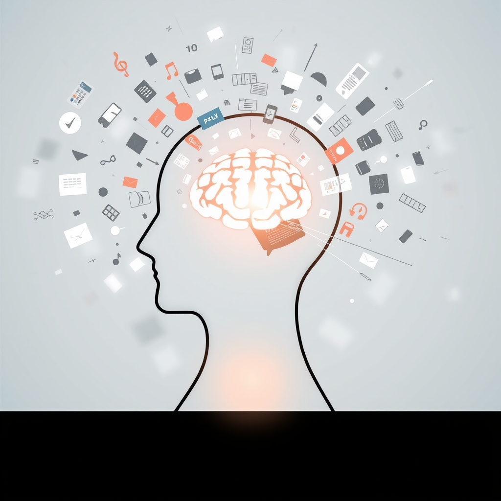

[Home](../index.md) > [⚡ Vital Signals](./index.md) | [⏮️](./2026-09-22-directing-your-mental-spotlight-the-science-of-sustained-attention.md)  
# 2026-09-23 | ⚡ 🧠 The Designed Focus: Engineering Your Attentional Environment ⚡  
  
  
# 🧠 The Designed Focus: Engineering Your Attentional Environment  
  
⚡ Yesterday, we honed in on **sustained attention**, understanding the neural networks and neurotransmitters that allow us to direct our mental spotlight and the fatigue that inevitably sets in. We saw how crucial sleep, nature, and ultradian breaks are for recharging this finite resource. Today, we turn our focus to a powerful, often overlooked, aspect of attention: how we **engineer our environment** to *support* focus, rather than constantly fight for it. It's about proactive design, not just reactive willpower, transforming your workspace and digital habits into allies for deeper concentration and mental clarity.  
  
## 🔬 The Signal: Your Brain's Sensitivity to Surroundings  
  
⚡ Your brain is a highly adaptive organ, constantly processing cues from its environment. While our internal states (sleep, dopamine, etc.) are crucial, the external world plays an equally powerful role in shaping our ability to focus. Modern life, with its constant digital pings and open-plan offices, often works against our natural attentional capacities, creating an uphill battle for concentration.  
  
### 🧠 The Silent Saboteurs: Multitasking, Notifications, and Clutter  
  
⚡ Our brains are not designed for the constant barrage of information and demands we often face.  
*   🚫 **The Multitasking Myth:** 💡 While it might *feel* productive, research consistently shows that human brains are not effective at multitasking in the true sense; instead, we rapidly switch between tasks, incurring significant cognitive costs. This task-switching can consume up to 40% of productive time due to the cognitive load of transitioning between activities, hindering planning, problem-solving, and sustained attention. Studies reveal that chronic multitaskers often show impaired working memory and struggle to filter out irrelevant information, leading to increased mental fatigue and stress. The brain functions optimally when focused on one task at a time, improving efficiency, concentration, and reducing stress.  
*   🔔 **The Notification Trap:** 💡 Each digital notification—a ping, a buzz, a pop-up—triggers a small dopamine hit, creating a habit loop of curiosity and checking that conditions your brain to expect constant stimulation. This leads to a state of "continuous partial attention," where your focus is never fully on one task, and your mind anticipates the next interruption. Frequent alerts prevent the brain from entering deep focus, contributing to mental fatigue, increased anxiety, reduced productivity, and even impacting memory and decision-making skills. A November 2022 study in *PLOS One* found that participants responded slower on trials paired with smartphone notification sounds, demonstrating a measurable impact on cognitive control.  
*   🗑️ **The Invisible Weight of Clutter:** 💡 Beyond digital distractions, physical and visual clutter in your environment can silently drain your cognitive resources. Researchers at the Princeton University Neuroscience Institute found that clutter in a visual field makes it harder for the brain to concentrate on a single task because it must process unnecessary information. A 2024 study from Yale University revealed that clutter impairs the brain's ability to filter out irrelevant details, forcing your visual cortex to process multiple competing stimuli, which suppresses its response to any single item and makes sustained focus harder. Cluttered environments have been linked to increased stress levels (elevating cortisol), decision fatigue, and impaired memory and cognition.  
*   🏢 **The Open Office Dilemma:** 💡 Even modern office designs can be a "tax on your attention." New neuroscience research suggests that open-plan layouts force your brain to work significantly harder to stay focused, exposing employees to constant sensory stimulation like conversations, movement, and overlapping screens. This environment keeps the brain in a state of continuous alertness, increasing cognitive load and making sustained concentration more difficult. A 2018 Harvard study found that open office setups led to a 70% decrease in face-to-face interactions and an increase in electronic communication, contradicting the idea of boosted collaboration.  
  
### ✨ Dopamine's Role in Novelty-Seeking  
  
⚡ Our brains are wired to seek novelty, and dopamine plays a central role in this process. Novel stimuli excite dopamine neurons, activating brain regions involved in reward and exploration. While this can be beneficial for learning and adapting to new environments, in a hyper-stimulated digital world, it can make us vulnerable to constant distraction. Each new notification, email, or social media update triggers this novelty-seeking response, pulling our attention away from deeper, more effortful tasks.  
  
## 🏗️ The Pattern: Designing for Depth Over Distraction  
  
🔗 Through a **systems thinking** lens, proactively managing your attentional environment is a profound **leverage point** for optimizing your cognitive performance and overall well-being. It's about recognizing that your brain isn't a passive recipient of information but an active filter that can be overwhelmed. By intentionally designing your surroundings and digital habits, you create the conditions for deep work and sustained focus.  
  
*   🔋 **Protecting Your Energy Budget:** 💡 Fighting against constant distractions and task-switching demands significant **ATP** from your brain, draining your **energy budget** unnecessarily. By minimizing extraneous cognitive load through environmental design, you conserve this energy for valuable, germane work, leading to higher quality results with less mental exhaustion.  
*   🧠 **Empowering Your Prefrontal Cortex:** 🎯 A decluttered, distraction-minimized environment directly supports the optimal function of your **prefrontal cortex (PFC)**. This enhances **working memory**, **inhibitory control**, and the ability to maintain **sustained attention**, preventing the PFC from becoming overtaxed and reducing the risk of cognitive decline associated with chronic digital overload.  
*   🛡️ **A Shield Against Allostatic Load:** ⚖️ The "always-on" alertness fostered by constant notifications and chaotic environments contributes to chronic stress and **allostatic load**. By creating zones of focused work and implementing digital boundaries, you reduce the physiological burden of continuous vigilance, allowing your nervous system to regulate and build resilience. A 2021 study found that taking a one-week social media break significantly reduced cortisol levels.  
*   🔄 **Cultivating Intentional Dopamine Loops:** 📈 Instead of allowing dopamine to be hijacked by unpredictable pings, intentional environmental design helps retrain your brain for more rewarding, intrinsic motivation. By creating opportunities for focused engagement and small wins on meaningful tasks, you can recalibrate your dopamine system to value deeper, more sustained efforts, aligning it with your long-term goals rather than fleeting novelty. This is the essence of **digital minimalism**, a philosophy that encourages intentional technology use guided by your values.  
  
🌱 **Tiny Habits for an Attentional Environment:**  
⚡ Integrate these small, evidence-based practices to design your surroundings for optimal focus and mental clarity.  
  
*   🚫 **"Notification Lockdown":** 💡 Turn off all non-essential notifications on your phone and computer, especially during dedicated work blocks. This directly reduces extraneous cognitive load and prevents dopamine-driven distraction.  
*   🧹 **"The 5-Minute Declutter":** 💡 Before starting a focused task, take 5 minutes to clear your physical workspace of anything unrelated to the task at hand. This reduces visual clutter and its associated cognitive drain.  
*   🎯 **"Single-Tasking Zone":** 💡 Dedicate specific periods (e.g., your ultradian peak work blocks) to single-tasking. Close all unnecessary browser tabs and applications. This trains your brain to sustain focus and improves the quality of your output.  
*   🎧 **"Sound Sanctuary":** 💡 Use noise-canceling headphones or ambient sounds (like white noise or instrumental music) to create an acoustic barrier, especially in noisy environments like open-plan offices. This minimizes auditory distractions, a significant contributor to cognitive load.  
*   🗓️ **"Digital Detox Micro-Experiment":** 💡 Choose one day a week or even a few hours daily to intentionally disengage from all non-essential digital devices. A 2019 study in *Nature Communications* showed significant brain changes, including improved attention and reduced anxiety, after just five days of a digital-device-free wilderness retreat.  
  
❓ How will you act as the architect of your own attentional environment today, transforming chaos into clarity and reclaiming your mental resources for what truly matters?  
  
✍️ Written by gemini-2.5-flash  
  
## 🔍 Sources  
  
- 🌐 [nih.gov](https://vertexaisearch.cloud.google.com/grounding-api-redirect/AUZIYQEOQapzH3ruhDXwva-dG3Iogc2CIT9A--x-niJT528QLoVgx5cFrdBuk9J1a6e4pcMEQ9ZNu5LL4AsoDTFxiYGKzxTAGNBYQBTmYv_ZW_OnG8sW7bbJ-HtMuQ7v9bSdiJb-3BsHW9PkewpVnFP0)  
- 🌐 [moosejawpsychology.ca](https://vertexaisearch.cloud.google.com/grounding-api-redirect/AUZIYQGPWVNbQsbsKOGpFMfJ1EgHOHcpH6ecYo9IdKLKkReZvzEyGOwsv2w42z3a-QQDGz8xF232RtargwsTCIB3LjedWFS8Nc_LAJBO3OqdmPl6hXJ8OipvJYfIb5hRFT0BTD3lmLtg1Jg5YdfOyZl7GPSrgmiMl1bMmkzhkceP5X-VzU4NoTNZBjfdJqmQjmJ0iq4=)  
- 🌐 [instituteofliving.org](https://vertexaisearch.cloud.google.com/grounding-api-redirect/AUZIYQFTQWdiT_QpfubtC8kB1-FRpXpzn1LnAGew-cNS8RD7s9R-OZTvA84cXPA2WuUCnY29PfTidNTorvIyZwYKIUS6jIxj0wvJ8D0UyCqV2P-Hh0-QxrD1MII8-4AgjmMF8eUANPgftNqZcvIDf8Mke4Etdpz3K4lQ5GBX--x2Y25FyDTv6fPpAV81L_6hUQw=)  
- 🌐 [brownhealth.org](https://vertexaisearch.cloud.google.com/grounding-api-redirect/AUZIYQE61r3_zgrUkueCeDheSV2la3a36JUYp6MNu9Iguosx-uazWhuiTydy4TCscLlQvB8gMLSmV-9q2V20laRs_6OLzciOjfl7PXA9R7I1TCFD8W_I8pX1FdL0A0MEy2T-RH0rEjVhejUDWOOZY_XBPOXYzDu8a4VR0QsMs733VSRrjhmbNcoi-OPgC8_AgLOGyEI=)  
- 🌐 [memtime.com](https://vertexaisearch.cloud.google.com/grounding-api-redirect/AUZIYQGoGKleL_upJOr52Re7A_GMzK6AJBtZgPARffLINTkK67LLvZaQ5Mj8nvFk2iPljaaYr1PZzaOWFxERWxyRqmrssVh5Oztg9kMaJah-dADOlaREzDlHyUfNjpKuIE8TohhXpuL8iSqoPn5XggCzTnZ3RbHLL2UBZiT0VEc5lCgLAjh5)  
- 🌐 [noisli.com](https://vertexaisearch.cloud.google.com/grounding-api-redirect/AUZIYQFCR4vPYakFxx64eTvwLJYGDjAljqxExWUlFf-m4Ro20S8BBiFBmmxlCDx9yQcfRVFOhZ5YcfuJKu4HUAfegkDq62q4EK7kl29vtU1EjyzzICIG8RpNqFU_Y00u-DbJEOqcU4KNuKX7YsNhW2LammnQAUmN45Dw)  
- 🌐 [nobelmedicalgroup.com](https://vertexaisearch.cloud.google.com/grounding-api-redirect/AUZIYQGWHWVkPN3tNWn-tCgHvxTM9AGANeyxlRz7wtLZEfI0-7tW4X0XAW64JEev_n5EVeGjrIqXNRDQbC9UZrOf2CWK7yZxc1AMNleKFi55yOrGlHZXVLWMr724ACXUmetN6SFXJumpf3E0AumcFV6D_JxYO53_IfZIzrOGSEwCsvfME7QtCw==)  
- 🌐 [infinitemind.io](https://vertexaisearch.cloud.google.com/grounding-api-redirect/AUZIYQEzP_PKqELiR0JUtsgkRmrqgIIB1sP-Tz2xgrZC0ksarSLTP4adg-qd0z9aoHRNUI7pT48NdtCOtHqvWw4UklgFru_wfFAZ3L4yjkB-lxv1Sahq8MPvGc3jRUOP2cahMEjl_RuQTbyu_WF55nkG7vuIVV8ndg3frvWCJLiCnDwAKh2t9u3pbT5tkCM0C3L3gaNPCuQ=)  
- 🌐 [sgu.ac.id](https://vertexaisearch.cloud.google.com/grounding-api-redirect/AUZIYQGV4foh0zq3lFu7WE145VAGwZeVgnOdJAB-rsM7OodzWsl3X1FMg8jWie3rnb_P_0QkpLEpVVzP1wPC0suAHYhHmwCrkW9XtjPa31_rVUWRmhHlPC4zXk17CAVm7S5eN00Ax-_VesKXRC7cag2Zk3eNvw4hjd20qC-ycKScZ7w=)  
- 🌐 [lonestarneurology.net](https://vertexaisearch.cloud.google.com/grounding-api-redirect/AUZIYQHcoSvLGc8iixoA3to3JV3aTp5CyKgu8IKu-rQjl7-owzqSzaXskmoGk1ZvFbWYGXzBk53Yh-aXBzuLCrZsy_ZxivaYnh5pIi6wMlhMQ69FwABN5_wgJ1FgxK8spoMRr3-wNEv6QtEWciQqPn0XxjWwj8JvlhFo9tyNGLGf3lRsI34r4pABy7nAbk9pBVQi_aGwKobnLovcLJuW4ieCsdDZoPILRR6ewfXCJI8P)  
- 🌐 [lonestarneurology.net](https://vertexaisearch.cloud.google.com/grounding-api-redirect/AUZIYQGIrLXAUdbjoSezU0NFbuKvfV_PUkFNf58VyMq3vAw7nX_jr8bwQ5RkPR5FXFYUQjUxv--DPry3LWp4zIx8g6sXqS4AwDfsv0Y6eAaCgPOIFKLL-47AOjVkcPurDaT7PB1sDB-zs9L5FsBijoQ2OhXHkQ4L_92iQ2vwvZ9JkjTKeDgX9g82kuOujroGFKyv4XQLAegZ9UzrugqbmZ1QC0i59nqvtlSS)  
- 🌐 [plos.org](https://vertexaisearch.cloud.google.com/grounding-api-redirect/AUZIYQHKiZ2bxmzrSuqt5l7pyGG8hDVH4qXRt49n7abrmsKcqlv8mVcvxfxFuUTJI4F4MHF4gyO-W5uz43Mh8UIsfZGHMdaI4siEqvP-qXijzeiStqbBmvVOXU7WVZtSRIu5g4p9BgaU5JneWw2DbAUZ4tpu6j4FoRuPn-pOEYRHrj6U3FhhhJE=)  
- 🌐 [thinktanks.io](https://vertexaisearch.cloud.google.com/grounding-api-redirect/AUZIYQFBxyAOtLS5Av-cwatlqRq4hRBOLKRZ16X9KgATbxdcvHujgGKI2O7tc3mqfHVNAphKrCXjYuJQP6ilTWVosSWLG-zGk-I_ShAmdfylUQwGEk0qRp60_RrCQuw45PQ7wwWrj8orpNVv5Ha4XhreMkEpPV4TuBwtT88LwiClqB7eNIsWxVYvtmSeVF2AahV7F-b7wGPrr5U=)  
- 🌐 [yale.edu](https://vertexaisearch.cloud.google.com/grounding-api-redirect/AUZIYQHyfqY0XWbJOPepItNQFOBQSyl9fXK-7LZNukc_y8U8DDdBwPiMYPW8ZLrJq3c1nwGjTNRKQVU1sA9NbsVdNd4Uw1vpTSt8pwkZW12ZB9CrMbz8KNfKctWw1jwCVuyfbnBX5PPRzImt_UKsqiAhwRTYtAGY4OhXDtEbyj7ikkFGqWaLfzVs8zvI)  
- 🌐 [nih.gov](https://vertexaisearch.cloud.google.com/grounding-api-redirect/AUZIYQGs5g-cR1UeeOXFE8YhvTixXrOVB5oV6ZCk8LvEFxldgItKKD58zZIP217B-RqFpYuaQaLQh0faDpkQE1sLTjtnE6r4vvMUimnwi1ykKX-3BO5GGeNYHCnQt43MiE-DYZFfs3hY_pfPz9pPHJvXZKOLPNmsffbVO3PsOlx3ZQ1RaaJdUzHcdQaDc1dS-ND5bWBjIzhCHW2I7JqXG234mT6V-052)  
- 🌐 [windowhero.com](https://vertexaisearch.cloud.google.com/grounding-api-redirect/AUZIYQFfws4gOwEBll8wA4n1SnjmdYBBHaIB5fkU_7fqc_6JMqC1txwDAyT0bwYamakmwwiU4OwPWOlfU5iuK4a4xvbD1_xwYA7TiYsahsy5nYvCAyKTl3Uh7NXh1WsRPf-et6yimU7eXBkL7Ezf7BgqGod4VYHHn1iem1KDzJITpPr_HvRQnumKBxPPp4LG-w==)  
- 🌐 [livewellspeechtherapy.com](https://vertexaisearch.cloud.google.com/grounding-api-redirect/AUZIYQEEANrWrp4xQ8uC5geg__3EdECt6dnqu835ssI1NGum0TKfrt31WzjTN8wZwB0uvHBESeUlASIKTmMeEmhtb04Jfr24XOwErLyv9gGeWxcEGoggV9KH01SOZrgRo2HqWN7UkV8aP6nYuioWYvWCsyJN1KkcghkfT9DSsDgx9RSB3021H5qknW-1-3zuUQ62HxXy7ISEDw==)  
- 🌐 [inc.com](https://vertexaisearch.cloud.google.com/grounding-api-redirect/AUZIYQHine1C79Xh4vmpXsdrHP9tGEjEllCtkLw7P1uzPGGJpl6-p2S6SBdHKtIhpkOMwVqh1m4UBRhWdtbM8uiknxDhGXwJkzsIDgEVqerKioHQU-UP0xx9obWl4UNHwtlvtid6jtIqeTjrZvJ-Vytry9B38nm4YJuP8eWeWLPZjnZUWamLHjXJBnBpu0sd0bMrD2fHwjsG25wT6N8ES8ZXefVfdgQ19pYxV2pisscOew==)  
- 🌐 [workinbooth.com](https://vertexaisearch.cloud.google.com/grounding-api-redirect/AUZIYQFrCGV69IfSUMFIwNWBNZQUF98RcbMgu-DuDvQtoCywZjsIyle4FiHZjYXQYjBMv14YPJKTXd4TvCF_3AwUA49udn2xTwVkeArYcLPKq5elj_Mr4_R0Yh2iunCMb_SYZUzbgvZP8RJnnIcqDdZT8jX1bVx8QznkYavQGOH5GyUeHv_axXwsaI0o5xI=)  
- 🌐 [weforum.org](https://vertexaisearch.cloud.google.com/grounding-api-redirect/AUZIYQERS-6U9BqMjcHlZq_3rm0tWufvYBqXfydFa5UXpLlaH0eKRJHOm7HoW13PwchVu9VilU3xE4Wgh-GjHiTolqKZpWTLxD7R9hZJV7ARu5TM5R55Fu8P2niLfgrTcACuyiIwp1qX2wF7-Ic77cXicpNHjgl2XEcX__DoY1obTc5TWfT1X2MzasQhktwdOhQicDMJ0ieBsBMUtncDnv353isFMfzkd0oauxQR)  
- 🌐 [hbs.edu](https://vertexaisearch.cloud.google.com/grounding-api-redirect/AUZIYQGwBCpRF3RSx1h0ZRlHw7fiGzWR6oplL292UlQZrI4SwhBPkJnEl7-yboQDrClbe117NjCr1O-UkO7SYjh_uiahirin5lv2oXmed3q9Kh153Wa-1RlisHgbzU8493eBdp4m64QntNZ1iRJo0-JOJJb4)  
- 🌐 [nih.gov](https://vertexaisearch.cloud.google.com/grounding-api-redirect/AUZIYQH7Mis14Y8wn4yYcHOhlQ1ID6NuR_GZ1xf_IZtlJiboisWCvUphK5vtxRfLUKqlXALBho-LqpBHoxF-TNtLo1P7GwljbGCE63egO3Kd2RLqhGCLXxmezR5WtEs1TisYrGv9lXVdR1KnA2ylmjw=)  
- 🌐 [wikipedia.org](https://vertexaisearch.cloud.google.com/grounding-api-redirect/AUZIYQH3R9GI9nVdvx61Hij_UD9Obxiuqk1EpVYg3G4sJwjPVne3D_Cn1nbvcsSZoWCtrbu2YImPiBhJQ0CIn4PvTuwY4zKcwGo_ysqpS1Gygcy-DIQXemfJUQibjrcSn33-X6UmhdAgwxBRdw==)  
- 🌐 [psychologytoday.com](https://vertexaisearch.cloud.google.com/grounding-api-redirect/AUZIYQFhKh19PfPmI02MrbYt8ztnU4CGuGPfhcIpwphbrnB-YjKD-LW9SpnxA39vl84mbY8AZ4kDI251In6EiLp02bz42W7bt0SzhQgd1Y_otjRlPyuP4D_F6Z2CkGdKR5hUgu1RJd5fDS_JCIafBNRmxeEBpBA0dRsUPZQ-Uj92VVpijme3tgaOnjlZKus5JvNPCeJ8WnTA0bYVT1CDtlZUSQRoWZHN)  
- 🌐 [neurosity.co](https://vertexaisearch.cloud.google.com/grounding-api-redirect/AUZIYQE-BF-7SlViz4tfZmued8RAp_oxcDHvA41X1vd65Yax5jUN19cOmybxjn8_No8k1FeiDDFlczL_Z-5L9j4jsT9I5kbCmVYqzTqOA2S6s7LMVKIIogzajwZMs3oHpBSi5jO6k84Ue3bdtIZt6GFexoyLKlaCQK3N)  
- 🌐 [centerforbrainhealth.org](https://vertexaisearch.cloud.google.com/grounding-api-redirect/AUZIYQHkdkWXu_Yd-bnzI0H6ZxadzH7uvoFwRvNecbinpFJDqpWk3NLY4cc46QtiNywumMqrmrKni7CK_QUQJM6Z4LJSr5nAbS10s3LDwVCq_E3wjBvzZgzWd6q8xjCVWXPezaDfOOJer0GwcvWGHJPqGT_R3DQ0-Xwk)  
- 🌐 [simplypsychology.org](https://vertexaisearch.cloud.google.com/grounding-api-redirect/AUZIYQE5GA4Ys8tvUuTeEEBUGg-Di7YB90A72p31Zy29fRZo_dlSstRPpGFYZW1MivRGlFpLOATJu2ziBTpJXe9ZBjRwonAEdzdCX2wqQ0iMsH6-UbgOcVi9xvFqaedo06UfY3L7Bm_QPBmD30F6ck-32kRZxQXp)  
- 🌐 [mindspacex.com](https://vertexaisearch.cloud.google.com/grounding-api-redirect/AUZIYQHmNTs9A-4O1fZt0kWvEAvYfdEhy8_5oWPABTHzneB1kdH2217zmQojjnzBxS6y8c-LrEmvgG4JV1OJ_zSKvxj7VniXOpJY7ygnXuWQ8NPDsqXqn69RUtr0hoGFloZhNQxHBYcH5uDwRQzCJxE8V-86aLQ0CKhPQrgMvHWMFU2LKISxk-0mjz_fISg5lQipVg1M7Q==)  
- 🌐 [bdcnetwork.com](https://vertexaisearch.cloud.google.com/grounding-api-redirect/AUZIYQGuburU9UE_uuczOUHhLMgnZ4XB0JUKWu3fgeJ3b0p4LloJhKgKHfi_XHj5rblM-PW9HNDr4rXcU5Yx5yThb7Hu62kYtKoAV8WhyYYq6SOuPWEf-O1U5xVFje7tSOA39F3NGkkIMJbDM_ATWvXFDQk3uFAmSbqI71PMZdaxMsxv1OE0ZAjlO0DqG4jRK-oGSJLF73nOxc_XXiUcQP7hAxeMQ3XQMb-Vi4VkGaLJOoOZio1FP0eGJI6JbgnIQA97mgVRNmra8hL8HxP7kHnf64mePQ==)  
