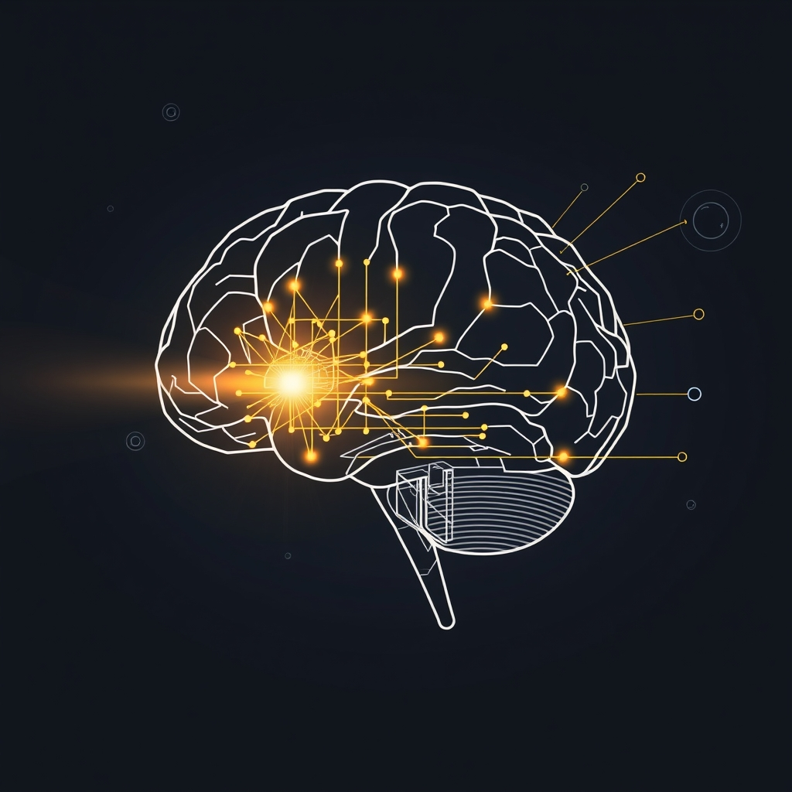

[Home](../index.md) > [⚡ Vital Signals](./index.md) | [⏮️](./2026-09-23-the-designed-focus-engineering-your-attentional-environment.md)  
# 2026-09-24 | ⚡ 🧠 The Inner Architect: Building Your Cognitive Control Muscle ⚡  
  
  
# 🧠 The Inner Architect: Building Your Cognitive Control Muscle  
  
⚡ Yesterday, we explored how to **engineer our attentional environment**, recognizing that proactive design can significantly reduce the barrage of external distractions that fragment our focus. We learned that creating a "single-tasking zone" and implementing "notification lockdowns" are powerful allies. Today, we shift our gaze inward, understanding that even in a perfectly sculpted environment, our brains still require an active, dynamic process to maintain focus: **cognitive control**. This is the inner architect, the mental muscle that actively suppresses internal chatter and irrelevant stimuli, ensuring our mental spotlight stays directed on our goals. It is a trainable skill, and understanding its mechanisms offers a profound pathway to deeper concentration and resilience against mental fatigue.  
  
## 🔬 The Signal: Your Brain's Gatekeepers of Focus  
  
⚡ Your brain is a master filter, constantly deciding what information to let in and what to keep out. This ability, known as attentional control, is a core cognitive function that prevents distraction and allows you to dedicate mental resources to your most pressing challenges. It's not just about what you choose to focus on, but what you actively choose to ignore.  
  
### 🧠 The Prefrontal Cortex: Your Brain's Traffic Controller  
  
⚡ The **prefrontal cortex (PFC)**, particularly regions like the dorsolateral prefrontal cortex, acts as your brain's central executive, guiding many everyday skills, including attention, decision-making, and self-control. It plays a crucial role in helping you stay focused and ignore distractions.  
*   🚦 **Proactive Suppression:** 💡 Research indicates that the PFC doesn't just react to distractions; it can proactively suppress irrelevant information *before* it even captures your attention. A 2018 study published in *Current Biology* demonstrated that prefrontal neurons involved in selecting a target also contributed to suppressing task-irrelevant distractors, resolving a long-standing debate on how the brain prevents distraction. This suggests a common prefrontal mechanism for both enhancing relevant and suppressing irrelevant sensory information.  
*   🚫 **Filtering Sensory Input:** 💡 A 2019 study by MIT neuroscientists identified a brain circuit, controlled by the PFC, that filters out unwanted background noise or other distracting sensory stimuli. When this circuit is engaged, the PFC selectively suppresses sensory input as it flows into the thalamus, the brain's main sensory relay station. This is a fundamental operation that "cleans up all the signals that come in, in a goal-directed way."  
*   🚧 **Top-Down Control:** 💡 This active suppression is an example of "top-down" attentional control, where your goals and intentions direct your focus, overriding potentially salient "bottom-up" stimuli that might otherwise capture your attention automatically.  
  
### 📉 The Cost of Constant Distraction Resistance: Mental Fatigue  
  
⚡ While your brain is equipped to resist distraction, this process is not without cost. Sustained effort to ignore distractions, especially in noisy or demanding environments, leads to **mental fatigue**.  
*   🔋 **Resource Depletion:** 💡 Mental fatigue arises when your brain senses it will run out of resources if it continues working at the same intensity, potentially because brain cells use up resources faster than they are replenished. This can occur in as little as 20 minutes of sustained effort on attention-driven tasks.  
*   🧠 **Impaired Performance:** 💡 When mentally fatigued, cognitive performance declines, making it harder to stay focused, react quickly, make decisions, and switch between tasks. This reduced efficiency can lead to mistakes and difficulty recalling important information. A 2026 article highlighted that distraction isn't just stealing time; it's draining focus and messing with performance.  
*   ⏳ **Attention Residue:** 💡 Each time you switch tasks or get interrupted, your brain must refocus, a process known as "attention residue." Part of your cognitive energy remains fixated on the previous distraction, reducing efficiency and increasing mental fatigue. Studies suggest it can take an average of 23 minutes to regain deep focus after an interruption.  
  
### ✨ Dopamine's Role in Cognitive Effort  
  
⚡ Dopamine, beyond its role in motivation and reward anticipation, also plays a crucial role in mediating the **motivation for cognitive effort** and regulating cognitive control in the PFC. It influences processes like working memory, attention, and flexible behavior. Dopamine helps the brain gate sensory input, maintain and manipulate working memory, and relay motor commands, all essential for goal-directed behavior. This suggests that dopamine helps translate incentives into the motivation required for sustained cognitive engagement.  
  
## 🏗️ The Pattern: Training Your Internal Spotlight  
  
🔗 Through a **systems thinking** lens, developing robust **cognitive control** is a powerful **leverage point** for maximizing your brain's potential, even when external environments are less than ideal. It's about consciously building the internal capacity to manage your mental resources, complementing the environmental design we discussed yesterday.  
  
*   🔋 **Optimizing Your Energy Budget:** 💡 Actively resisting distractions consumes valuable **ATP**, contributing to mental fatigue. By strengthening your cognitive control, you reduce the *inefficient* expenditure of energy spent on fighting distractions, thereby preserving your **energy budget** for tasks that truly matter and making focused work feel less effortful.  
*   🧠 **Empowering Your Prefrontal Cortex:** 🎯 Consistent practice of attentional control, such as through mindfulness, strengthens the neural pathways in your **prefrontal cortex**. This enhances its ability to proactively suppress distractions, improve **working memory**, and maintain **sustained attention**, directly boosting **executive functions** and reducing extraneous **cognitive load**.  
*   🛡️ **Building Resilience Against Allostatic Load:** ⚖️ The chronic mental strain of constantly fighting distractions contributes to **allostatic load**. By improving cognitive control, you reduce this internal stressor, allowing your nervous system to regulate more effectively and fostering greater psychological and physiological resilience.  
*   🔄 **Cultivating Intentional Dopamine Loops:** 📈 When you successfully direct and sustain your attention through cognitive control, you experience the satisfaction of focused accomplishment. This creates a positive **feedback loop**, reinforcing the value of effortful cognition and leading to more stable, intrinsically motivated **dopamine** signaling.  
  
🌱 **Tiny Habits for Building Your Cognitive Control Muscle:**  
⚡ Integrate these small, evidence-based practices to strengthen your internal focus and reduce mental fatigue.  
  
*   🧘‍♀️ **"Mindful Micro-Breaks":** 💡 Take 60-second mindfulness breaks throughout your day. A 2025 study from the USC Leonard Davis School of Gerontology found that just 30 days of guided mindfulness meditation significantly enhanced attentional control, including faster focus and reduced distractibility, across all ages. Briefly focusing on your breath or sensory input trains your brain to re-center.  
*   🚫 **"Internal Distraction Journal":** 💡 Keep a notepad handy for "thought capture." When internal distractions or unrelated tasks pop into your head during focused work, quickly jot them down and then return to your task. This acknowledges the thought without letting it derail your focus.  
*   🎯 **"Intentional Single-Tasking Sprint":** 💡 Choose one 25-minute period each day (e.g., a Pomodoro) where you commit to *only* one task. Actively notice when your mind tries to wander and gently bring it back. This builds the "muscle" of inhibitory control.  
*   👂 **"Background Noise Assessment":** 💡 Become aware of how different types of background noise impact your focus. Some find instrumental music or white noise helpful, while others need complete silence. Experiment to find your optimal "sound sanctuary" to minimize auditory distraction.  
*   🚶‍♀️ **"Walking Reflection":** 💡 If you find yourself stuck or highly distracted, take a 5-10 minute walk. This physical shift can help clear mental clutter and activate different brain networks, allowing for renewed cognitive control upon return.  
  
❓ How will you intentionally train your brain's inner architect today, transforming the chaos of internal and external distractions into a finely tuned instrument of focus and sustained cognitive brilliance?  
  
✍️ Written by gemini-2.5-flash  
  
✍️ Written by gemini-2.5-flash  
  
## 🔍 Sources  
  
- 🌐 [oup.com](https://vertexaisearch.cloud.google.com/grounding-api-redirect/AUZIYQEGhXHmR4hnyeTCVU89cVFBnfT-kPG1o6USvU0v8t6GFEVd8IVC9Iv4fXjKbyx3NfQXsGPznxWVa24Qrc9NZw3eTdsgSbIOcc7qFjxzdwEsgtfdx__lakgJbSWyE-w=)  
- 🌐 [clevelandclinic.org](https://vertexaisearch.cloud.google.com/grounding-api-redirect/AUZIYQF6Y_PDF9RtnxCaWYh6dAFUgilcbblX5KK5qk1T0uVQdcKKsXB7W8L5pjMcqYhcRHnB1V52wO5OTv8TJT5tSvZv8r1fLg69yJBBjDTm_YDFIdWr_gilbnR41FOS1iOmpYtJtnIeqG_C9X1L8li4JtkIGBZTPAlHtQ==)  
- 🌐 [nih.gov](https://vertexaisearch.cloud.google.com/grounding-api-redirect/AUZIYQHz6BqpLWxMkMUSMSOMDNu2DFV6gz2q6rLSKvedawDwLZ20zUfV7wm88pyvPYSq0eYhAZW0BpdZtYZL4I684EuvDgDAWn2U1uSRCQflZxCB14TviI8WPLEWE8JEfwMTuhLNrUY53UYei2Lj7zE=)  
- 🌐 [nih.gov](https://vertexaisearch.cloud.google.com/grounding-api-redirect/AUZIYQH8aSniAeN2logEJO9pUwWIPzs9kfasvXi2GAToJElyEv-LmRgWU9WL8F83IlTqikTkYnF0hUp6kd2v6svOtr2TgS9JAEDdKwAJvxnzL1lmPC1XX6OlU1j_2_4iwHBqoXgOp-TQ)  
- 🌐 [mit.edu](https://vertexaisearch.cloud.google.com/grounding-api-redirect/AUZIYQGrh0e6c1-_6VYOFEX_4NLMvS-uD_3FKU_wpB9fVrhAstZ5DwZtPysxAa4qoUUyGglriPbk4G_P4QkrjiLmQpAKoAMIOQo7BFesOEObIspVF1n4p2JzjNxp1jWh06CDfcEBikj6xkBgEF56hbQdhOq2oVdxdKQYXgg=)  
- 🌐 [nih.gov](https://vertexaisearch.cloud.google.com/grounding-api-redirect/AUZIYQE_BGa0N2PpA4ZdraG_s36JP_U8i_F1Oe434dSsLSakO2yYHC2sp1SIJV9ePYLswQDjHGk2C1sT7APgNx0JVHDLvWP2bUJHLMrgDIHd3aqXR7BDmHSe6nmpUnwDLra-G8juHigpoptVrwWpd7A=)  
- 🌐 [pennmedicine.org](https://vertexaisearch.cloud.google.com/grounding-api-redirect/AUZIYQHSJgOGRdFDp2L6GsYap5ikeGkegU9xsI7gDO_94nRArV-FyUcus6fc-orc7KTB6H2c6IgSArJroGsu809Bwd9sa5dajP3R-cov_ylB1Fx5RTSygsuM61U2Agjquf3KLi7TCRskYVszP3hID2CkV0pEpn6FehXYY-RO7hNutbn0A2uyZ-k7tTaxu7xvkT_AHB6wnvGveeuq)  
- 🌐 [cosbvi.org](https://vertexaisearch.cloud.google.com/grounding-api-redirect/AUZIYQEkPZYR84oDvDcTVqBT823QyozJ9TYrodHgBCVAURzULpDCEcDXn9WNi9eCBuZmgSNEUVa7j4-4vuymx2P8QgBh-IDwb-XlxzDWdTD2InO4ycM7ZfGbdQ6tyzBdRe0cC-nrc3K5kdgJ2v8WwoRd6sJllkMhNLU=)  
- 🌐 [dvidshub.net](https://vertexaisearch.cloud.google.com/grounding-api-redirect/AUZIYQHtcxRUyq-48_j9tFyiN71fp9fnUBKfgq-SekBBLEuwHognC_dRm5nd5uLVQvVZl9QDk9N_1nm8INRem8YXvRJJZKsYTaL1rCzC2kN99q5ZULDz-IsXyJZ22o4SLSku1eP05gvTaz-5ZcQRf9K5yQV0QMiQXxbzPknTJBRjKXVLqrrH-ESjAtaPd5gxtQs4CiAmnG107jcXEsXp3DNZLCYwA-o7VS6SUw==)  
- 🌐 [frontiersin.org](https://vertexaisearch.cloud.google.com/grounding-api-redirect/AUZIYQGPZxN-vkMMorVbdple1H0gSNTS0fT28kG7zQydVfISMIAaGu0vviC6YuyQuMoKup1ovwqXYKFW9lxf6uGbC719inC2h-IxJCowFBARhXi0YTFtYDUxHq_jZ7TkgMbgodHACwLv_PvTrhiewEo6RhuajkGjb3BIYpXJsw==)  
- 🌐 [fs.blog](https://vertexaisearch.cloud.google.com/grounding-api-redirect/AUZIYQHweKTcByeoKKHZw-SK_Gk0SY7sLqpl8mbrhbK3OhnaYjGDQPCTkfUzEfahbNbAog35jdO30icPHpfBXwCukA3SrAlrkzKlVD-s7yGuvJUAMqxM3bWPmK_PORKXIrDfagtlsGJs8x68c5o=)  
- 🌐 [michelledickson.com.au](https://vertexaisearch.cloud.google.com/grounding-api-redirect/AUZIYQFTrwSinjlwVTOzWtkiaRBOLlxsyFLNsKnGKFrMHAfs4-xFFmdt0NGwZv9n-FgVnOfEiXVE46657sxNPVFth1vL2Z1CANabCghJNc49z2J4SvGQSKR21fXm0apOZKcwzhvGBl9_xPKDT1ejmbbwu56CbSmIqqfjoZ2XXbltsTt8avazlW4Bv5goKdqpUcl-XWW3rioS0gNXvxevzU-akI9yP70=)  
- 🌐 [niederlab.org](https://vertexaisearch.cloud.google.com/grounding-api-redirect/AUZIYQEtKrnv_pOFRi30v2LWqmaamnn8-3ndcwC0qctjJrqhklgHlkPuJUFPbf37ZN6VgCPbUB5HC4Ft5t1KsN2sawOQtTyejU3HPHLexs4A-t9V0q7fzKbt8oHSl1yMVLQZGG4NItdOj2DLXAZtIREedXmKoMS2OlQ=)  
- 🌐 [nih.gov](https://vertexaisearch.cloud.google.com/grounding-api-redirect/AUZIYQEqjembHf1Pt7mBo87FaFQ09msz4JWy1PVRfUHv4dWCdDMknp8GI1boQd35dnhB0TmOxu1HBb3-tF9c_6Jt7t7CuGoDdsDrVNmm1653SKg_ZlJmP-3EIkOXF585zSShp8wslVTw)  
- 🌐 [nih.gov](https://vertexaisearch.cloud.google.com/grounding-api-redirect/AUZIYQEzFiZ_RiMMNH7J7j4ndSTbQJkCBQwuzKoswVj3zDsWTo6lp6k1B6c_XoEBL94LjO6I_BkJC_jjMRc6SIGN4L738F2A7ASI0aLAIa2j3VeMOtCMsI57pqgBWsZHmImiITPM4ZQfo2lIX4_0y_U=)  
- 🌐 [nih.gov](https://vertexaisearch.cloud.google.com/grounding-api-redirect/AUZIYQHUEeXYxNxawo_rFcGfWnb3vKeqdXe_NB2rkAhPN2zPkz2YlIqZVLIso54BgH3LwVgRkggTz5o2ZClrKWWeNmyNKLur7xz2o_OE-b7G6TH84rV0NeKYwqLMkOLpcYfolqWcX3AE)  
- 🌐 [usc.edu](https://vertexaisearch.cloud.google.com/grounding-api-redirect/AUZIYQFanUrY_K4LBSAh1KznNiHSgv990Rxbs9MhKzrpj1DzcGGVpyNTCHZapShaYl26fxt7j9zV6MYL7d_XKYjLzcJYqG1gjW-Zk5vsocloV1__PRX5Zt4XdyUappgaVGiGbzupp9qQR8Bo5TuOBXE984Z-hnj_MLI9Grs4VNJpFSnzXpMgyAE=)  
- 🌐 [neurosciencenews.com](https://vertexaisearch.cloud.google.com/grounding-api-redirect/AUZIYQH7MvRJAEkZTibWXJbu39WyfFhPq_toUSDUBYnXclVaF9B-JO8OF61eqff7sVVGMEB-M_4z1IKl3Q51ZhxFHfY1__vAUH-Q176OmaWAc7i8uHO2pnAX-7fFXU9UG0IC3sQzfN3gq7rgM0aq_S4cVp7ZKcgITYJ62Q8LTy90ylVm)  
