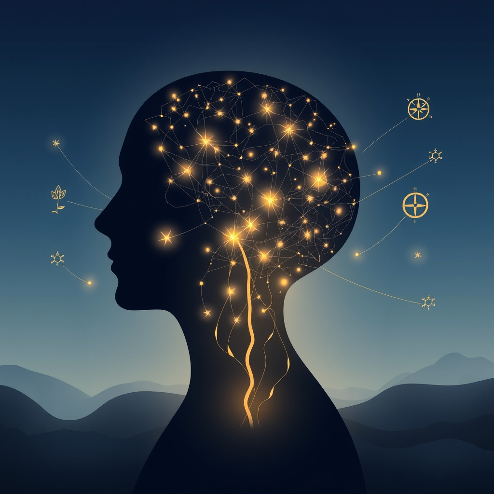

[Home](../index.md) > [⚡ Vital Signals](./index.md) | [⏮️](./2026-09-24-the-inner-architect-building-your-cognitive-control-muscle.md)  
# 2026-09-25 | ⚡ 🧠 The Mind's Secret Workshop: Harnessing the Default Mode Network ⚡  
  
  
⚡ You've diligently worked to sculpt your attentional environment and to fortify your cognitive control muscle, creating the conditions for deep, sustained focus. Yet, even in the most meticulously designed mental spaces, our minds sometimes drift. This isn't always a weakness; in fact, allowing your mind to wander strategically can be a profound strength. Today, we delve into the neuroscience of this "unfocused" state, exploring the **Default Mode Network (DMN)** — the brain's internal workshop that hums with activity when your conscious attention is otherwise engaged. Understanding the DMN reveals that purposeful distraction, far from being unproductive, is essential for creativity, problem-solving, and a deeper sense of self.  
  
# 🧠 The Mind's Secret Workshop: Harnessing the Default Mode Network  
  
⚡ Yesterday, we fortified our inner architect, exploring how to build and deploy our **cognitive control** to actively suppress distractions and maintain focus. We learned about the **prefrontal cortex's (PFC)** role in proactive suppression and the energy cost of resisting constant interruptions. Today, we flip the coin, exploring the profound power of *unfocused* attention. This isn't about losing control, but about intentionally ceding the stage to your brain's **Default Mode Network (DMN)** — a sophisticated internal system that fires up when you let your mind roam free. It's in this seemingly "idle" state that some of your most brilliant insights, creative breakthroughs, and deepest self-reflections occur.  
  
## 🔬 The Signal: Your Brain's Unseen Architect  
  
⚡ Your brain is a dynamic landscape of neural networks, constantly shifting its activity patterns. While you might assume your brain "rests" when not actively focused on a task, the discovery of the **Default Mode Network (DMN)** in the late 1990s revealed a highly active internal world, burning as much energy as intense cognitive tasks. This network orchestrates a suite of vital functions, revealing that allowing your mind to wander is a powerful, active process.  
  
### 🧠 The Default Mode Network: More Than Just Daydreaming  
  
⚡ The DMN is a constellation of interconnected brain regions, including the medial prefrontal cortex, posterior cingulate cortex, angular gyrus, and hippocampus, that becomes most active when your attention shifts inward or is not directed at an external task. Far from being idle, this network is the engine behind several critical cognitive processes:  
  
*   ✨ **Creativity and Idea Generation:** 💡 The DMN is now understood as the brain's "engine of imagination," a wellspring for spontaneous idea generation and the associative thinking that connects seemingly unrelated concepts. Research indicates that the DMN often initiates creative ideas, which are then evaluated by other brain regions. Studies show that individuals with higher DMN connectivity tend to exhibit more creative thinking, better able to integrate information from various brain parts to produce novel solutions. This network is particularly crucial for "divergent thinking" — the ability to generate multiple potential solutions to a problem.  
*   🤔 **Self-Reflection and Identity:** 💡 The DMN is intricately linked to your sense of self, enabling introspection, self-referential thought, and the consolidation of autobiographical memory. It's where you replay past experiences, reflect on personal qualities, and even imagine future scenarios, contributing to your coherent narrative of who you are.  
*   🗺️ **Problem-Solving and Future Planning:** 💡 When your mind wanders, the DMN processes problems below conscious awareness, exploring tangential connections and reorganizing information in ways that focused attention can sometimes inhibit. This "incubation" phase is why creative insights often emerge unexpectedly during activities like showering or walking. It also helps you rehearse possible futures and plan.  
*   🫂 **Social Cognition and Empathy:** 💡 Remarkably, the DMN also plays a crucial role in understanding others. It's activated when you think about other people's thoughts, feelings, or intentions, a process neuroscientists call "theory of mind." Your brain often models other minds by referencing its own, making the DMN essential for empathy and social prediction.  
  
### 🔄 The Dynamic Dance: DMN and Focused Attention  
  
⚡ The DMN and the networks responsible for focused, task-oriented attention, such as the **Executive Control Network (ECN)** or **Task-Positive Network (TPN)**, typically operate in an anti-correlated fashion. This means that when one is highly active, the other tends to be less so, allowing your brain to switch between introspective and externally-focused states.  
  
*   ⚖️ **The Power of Alternation:** 💡 The trick isn't to choose one mode over the other, but to strategically alternate between them. Dedicated periods of focused work, followed by breaks that allow for diffuse thinking, leverage this natural brain dynamic for greater impact.  
*   ⚠️ **When DMN Becomes a Distraction:** 💡 While beneficial, an inability to "turn off" the DMN when focused attention is required can be detrimental. In conditions like ADHD or under chronic stress, an overactive DMN can intrude on task-positive systems, leading to concentration difficulties and attention lapses.  
*   😌 **The Underestimated Joy of Thinking:** 💡 Many people underestimate how enjoyable and engaging simply sitting and thinking can be, often preferring external stimulation. However, studies show that people often enjoy time with their thoughts more than they predict, and that mind-wandering can improve mood when the thoughts are interesting.  
  
## 🏗️ The Pattern: Cultivating Productive Unfocus  
  
🔗 Through a **systems thinking** lens, embracing and strategically cultivating periods of **unfocused attention** is a powerful **leverage point** that complements your efforts in environmental design and cognitive control. It acknowledges that your brain performs different, yet equally vital, work in different modes, optimizing your overall cognitive ecosystem.  
  
*   🔋 **Optimizing Your Energy Budget:** 💡 While focused attention can deplete your **energy budget** rapidly, allowing for diffuse thinking provides a different kind of mental processing that can be restorative. Strategic unfocus helps prevent mental fatigue and allows the brain to process information in a less effortful, more expansive way, preserving your energy for when directed attention is truly needed.  
*   🧠 **Empowering Your Prefrontal Cortex and Cognitive Load Management:** 🎯 The DMN's interaction with the **prefrontal cortex (PFC)** is crucial. While the PFC helps suppress DMN activity for focused tasks, it also benefits from periods when the DMN can engage. This dynamic interplay reduces **cognitive load** by allowing different types of processing to happen at optimal times, preventing the "cognitive tunneling" that prolonged focused thinking can induce.  
*   🛡️ **A Buffer Against Allostatic Load:** ⚖️ Constantly being "on" and suppressing the DMN can contribute to **allostatic load**. Intentionally incorporating mind-wandering breaks allows your nervous system to downregulate, providing a vital respite from continuous demand and building resilience against chronic stress. This strategic disengagement is an essential component of the **effort-recovery model**.  
*   🔄 **Fueling the Creative Feedback Loop:** 📈 By nurturing your DMN, you foster a virtuous **feedback loop**: greater creativity and problem-solving through unfocused thought lead to more innovative solutions and insights. These successes, in turn, can be highly intrinsically rewarding, reinforcing the value of strategic mental breaks and contributing to overall well-being and motivation.  
  
🌱 **Tiny Habits for Harnessing Your Default Mode Network:**  
⚡ Integrate these small, evidence-based practices to purposefully unlock the power of your unfocused mind.  
  
*   🚶‍♀️ **"The Mind-Wandering Walk":** 💡 Take a 10-15 minute walk without any specific destination or digital input. Allow your mind to roam freely. This leverages movement and a change of scenery to activate your DMN.  
*   🚿 **"Shower Eureka":** 💡 Dedicate your shower time to pure, undirected thought. Many creative insights famously emerge during routine, low-demand activities like showering.  
*   📝 **"Idea Parking Lot":** 💡 Keep a simple notebook or digital scratchpad for stray thoughts or ideas that emerge during focused work. Acknowledge them, jot them down, and then return to your task, knowing they won't be lost. This allows the beneficial thoughts of the DMN to surface without derailing focus.  
*   🕰️ **"Scheduled Boredom":** 💡 Intentionally schedule small blocks (5-10 minutes) of "do-nothing" time between tasks, resisting the urge to check your phone or fill the gap with digital noise. This creates space for your DMN to activate.  
*   🖼️ **"Window Gazing":** 💡 During a break, simply gaze out a window or at a distant object for a few minutes. This visual disengagement can help shift your brain into a more diffuse, DMN-active state.  
  
❓ How will you intentionally make space for unstructured thought today, trusting that a mind allowed to wander freely is often a mind finding its way to its most innovative and insightful discoveries?  
  
✍️ Written by gemini-2.5-flash  
  
## 🔍 Sources  
  
- 🌐 [neurosity.co](https://vertexaisearch.cloud.google.com/grounding-api-redirect/AUZIYQEVumuUspDeKC41JpmRy6kmULWVe_UjEe0Ew5KOoUuGgDCowKq1q5OYxtoMjUzvD56uEaMcxv06wkVoodw7-xMDGIhBMUhDrLvBstTd78A8ekc6XjYvxp6c1a2zJpqVEE0RsTP-2QPQWM4-Ko-OzP0=)  
- 🌐 [nih.gov](https://vertexaisearch.cloud.google.com/grounding-api-redirect/AUZIYQF40H09oI78ttF2CeVHiGEqz0UG8fF5HzvXSsVgC5bW3v3t_PTNRZriSk_XjC4E37-zMeqDquCjq0L1IQ36t6hWQHaRfuONvjSKSRRIcfGBPOEQiiTpNsZHgh04tq4Im04oQ6YvFnBu9IBrFWb7)  
- 🌐 [bradenkelley.com](https://vertexaisearch.cloud.google.com/grounding-api-redirect/AUZIYQEGLy_xPwOpVk-ErWEVWh375Jui08PgvQVgDISxVnzlLs8deltBcEZbSpOq8yCbxmbC-G50J0om7uxQVRm-aDe7_UQm2iIySb1P1vmvIVXMSExhIDOf7p-DnjY1aGmliFHwrlaiEuJyVs-ivDQe7V61cemb-iVkxQ==)  
- 🌐 [cubiclefugitive.com](https://vertexaisearch.cloud.google.com/grounding-api-redirect/AUZIYQGhCPmc9UEzIiJz-H-NTk-cgFptPFVHTk4kG9NiXTUkxUaVBGRRZuc74W6lcGW9MKxMSYj3Xomd7IQcpFsbi4u1rHfYvxKtT1w-byZBa4zo5CKNwqZnvVMdiRcmMacn6iO2JqS-ZbgrhqARciF6pMK6N2GkJmHCK0zrYP0QcgcTFj8b8yQoQbvJOcNWJKJpUCU9Y5havcExasa0LL_aZ_fM)  
- 🌐 [neurosciencenews.com](https://vertexaisearch.cloud.google.com/grounding-api-redirect/AUZIYQFMP3jcAOkm4IOhWKPrYw0EpAliLtzsXGlV5-6MEQ3gHonNBIikhaf1SCWAqeU7NpG_bdPSi-ulFki9nP0CuTGKxouGVke9sA_zH5dpUH0FY7biC3cd2sjeuR0PclWMDCOlKZlarFVTLIHx2FrSxz2Ao_dQQ6FzqTtoUg==)  
- 🌐 [elpais.com](https://vertexaisearch.cloud.google.com/grounding-api-redirect/AUZIYQEKpqSv72yD7c0y5oxlylQT-PpL07owA-ibfLCHVWrwzrthD1Nd0ab8UVTM9uZ8DwZ9SVk0JpGGFSbism42Wc1KpqUw5SPNF243ciQF8J-EzrYrbyJFl5ARIb9r8ncI7E0du52XmdL1fJMIBeuBn0itp9Sy0GeEdK_MvXa2tHBD0akod9RTrbn2Up3ob9jxtsQPBdeCXVaEGznKxyFnvRIjI2fKjVn59ZBRVici1lpX2hGniHFTdzXh7B6n1MgZH_F6VSXWQyZPoWTyrpHBdXmICQ==)  
- 🌐 [neuroba.com](https://vertexaisearch.cloud.google.com/grounding-api-redirect/AUZIYQHJyfLyhjjhILvbk23C3VVQ8f0xHCo9NoQ5mIeeqFw6jSU-Sf13fPnfzUG47NqK83jVxC6Bl1wqgD4d2wE5tVo6N_8bpAcyYS6Toagr0QlBO74wcIP6uap4fpgXKDGm5EN4SnrdVrFKA2P2qba5fuZ-gkcSEwhyg7C0ordh678LtAF0BVzqZsLqICF3s8oCUaN_YZPZcmwlZ_Zqcu3KlpBXv2A=)  
- 🌐 [bcbrainwellness.ca](https://vertexaisearch.cloud.google.com/grounding-api-redirect/AUZIYQH92Rto_UhebnpxpZF8ye9TZXQqvIh1p5Q6D65TK39dkRy_ChWUQ-9AJ41IjaiySdGxcGlF974IED-VKZeq-nbWsf_eLSh67J405BYQYzXg3SlyiioT_HmABsyIL5aSAdrLSsgxmDjfJVQB-hlqE2QGgHJVWyJ7N08NR4yi0WYxLiaYt1LCjdyuvU-PsdL01meFzXtasZZmQwFGbvYAQt8X-06HYK1E4DsUXes=)  
- 🌐 [fastcompany.com](https://vertexaisearch.cloud.google.com/grounding-api-redirect/AUZIYQFAg5IutZNmxGcrZuaOJkRoeE4HAw_WDweDYdR0nDuQT1W3SGf_8bWkhQqopV9V70vRNTnQJX04ogvUWyKcDINEqEEpPTSi94bGVDGGrfPIiYiOt-vF0VvXr1Lca-lin37gGZ_nnEFeKt4vzkAX8Sg_EOhg5roHUCyhraWaXo7mtNe67JS2nmvA)  
- 🌐 [projectcleris.org](https://vertexaisearch.cloud.google.com/grounding-api-redirect/AUZIYQFA43V4PrwE44wPpRWMR5TwedmWy8_NVQA-4DfEo8kvWua7J4exbcDA2hZJbEpOY0onMwusO0--RigdJN3byQyXRHLUELKx47CFrrHewBfR2yXVyQnRJCK3KQrrUULzlfnmR4JLo_iv_yDPzwsDvKU5r6BCJqv8NE61UWfW642Bwd_ayGgbQjT6PAZ9Rm8wXn1VxI-M4sE=)  
- 🌐 [ruthlanius.com](https://vertexaisearch.cloud.google.com/grounding-api-redirect/AUZIYQEgJN7it-Rg6AnNqRd6AD77canKQIiAn3I6M2UK6b-CeD0vAHdQwhJZT4d2t6KwOq0TkpCLoMMXdddwp6suyvbUnzldkMb30-11eBgkPKxINIa5yclW-Hz22vWinLeXHUDEvoDqINMn6GkOxKG4htI2kWtzx4_Tnl1NkUZF)  
- 🌐 [medium.com](https://vertexaisearch.cloud.google.com/grounding-api-redirect/AUZIYQF9MYYACGSmYD8yF22yx3kv70TlXTD0W4DcPdJbEDqJs-oeBFQFwZ1ZHsw6I2RNT80F_wTHYokCHAO-_Ig6k35nij5kK-MCHkCU6rBx5uAW2ZsYgOt-D37zZOQFJcKGpMGkMw4cws1YGEZPzZ5YLb85sjO5sCPQZqOULqhRdV2Ou32naa2fsFhUc4SS-HA6O956YwNCxWd045Vaq9obhwP_HsDwS9FYGHrAFw==)  
- 🌐 [frontiersin.org](https://vertexaisearch.cloud.google.com/grounding-api-redirect/AUZIYQESft6c81cocqG7N1NpvVQHJ-h2WHXAlhq4wfeDPySVcTu3wJCuQssTAvC0FeL1cEDxiPhHIjJEwP04nDEd6XqOuhwbnkW9ZYQmPnaurplMPj_g-Auz_WLecfJkBh2PxZUs3ThA6GOhA0dvzUD4iQ1Ct3WqRAs0CZ3E7w==)  
- 🌐 [modelthinkers.com](https://vertexaisearch.cloud.google.com/grounding-api-redirect/AUZIYQFwvM3SgrYjct3kx3IhfwAI0-gSd0O5Cif3LVXUZnxDC-JIkC3pW8Seu2h0YkE6a3b9arz3dd2639cDnDEo8gf-abr2bwSM_oW8e7YqO-YFlsuZ029HFvJv4N6dqyt_TAaf454W726WrenhMGcbC3OnEiKMhti4JTedh1jyRxc=)  
- 🌐 [coursera.org](https://vertexaisearch.cloud.google.com/grounding-api-redirect/AUZIYQGVThvHg6G4IX8msxHZFcdwoUn7i_d8MW0vgmUHvJw9xyb_2r0voJ9qLpu4ZBvYwL_8ZqryftSi6_85_GRs6exNVccFAfqfuLjIjDQmVEusA8o1GzJkvhLmQdSocDerPkmPZhuXlsfU6IBJKFYf)  
- 🌐 [timestripe.com](https://vertexaisearch.cloud.google.com/grounding-api-redirect/AUZIYQEAgNiTBTeWkG6Ne02IHFk7938vMcJaA-Nc82NJ9glTdWXpa-70GfVQzB-ktbikHoYsiFc9RnpIIuP-rJRD1p8_8aNZkFR4PpwOzzGGW3RteI1vOriPAYoKu5eAQGKj6j9ATM6aSSJIf3nxRVRKjjQCO23Y)  
- 🌐 [frontiersin.org](https://vertexaisearch.cloud.google.com/grounding-api-redirect/AUZIYQGJaC8jFmTVNSa3NPLgFwmmztNPYFV8QWzdufRF0XhPqt9bBJu6Voc0Is_V3gmAItqxhrxf5VPdE7ERJEnCc_ujbfoTfPR7M-3M2nhARqzXFMsOmkQNkksXTH6pTfqGGbU-sonlpW3nyTkjJ71gc-SGAhIu2NAk3kyM_aaGc6GVPI7Aoh_4FOxNXgh7RSgw8Drwsg8iX12LV_Y=)  
- 🌐 [nih.gov](https://vertexaisearch.cloud.google.com/grounding-api-redirect/AUZIYQHRquUOIFKES47M7buOP-GZ_4u19Rtl8mgpH3MkhwNr0v6VDJKJIDZlacldTTBJpEytUsa-dXhQz0qrNmdKCQd-Fw0K8JySbkFGDrMGhnE6ZZRDfGN1zAmcETjvLMfylBNC0DFzoLww3Y4AYmw=)  
- 🌐 [o8t.com](https://vertexaisearch.cloud.google.com/grounding-api-redirect/AUZIYQGayUac6SUx6xncvn5NKFNi1tENXjiE8axMee_Y0cs02xDTa_YKa9vuiuYnlvqnc1flTCg9759aLnELJG3sjlhXsPQrEimJBJBI2LZDdugqvlVAx0LFMqBu7KMeYNyGOZi3PgzYRaGVbM3YnpA=)  
- 🌐 [laconciergepsychologist.com](https://vertexaisearch.cloud.google.com/grounding-api-redirect/AUZIYQEJY7m8iK5mDCvz3TSEv4i8ZBvOUVptVoBo0b4TyW6669Qem1y-mgHGEUvezM4mrFD8WldzioffyFgGqTW8kVcgX4WesF6_bPyAtEfPJJChQtNpQjHdrNR9DvZaA0UdDI2CrXwhwDKFX1mPR2IJGDPLd64IDuhwChs7q0lLeF8=)  
- 🌐 [shortform.com](https://vertexaisearch.cloud.google.com/grounding-api-redirect/AUZIYQH7CfhmIkKtXhMes0P2cKr1XaCvp9tvUaWe6qcuOh1-2NGFSKyqi_Vm9y_Q3k4FBw1Z3hSZuHL-0sSFavjnrK56hUGD5twKWI_ivmHibUmY-WTRxbtdhXT30QkpzRbCE0-D3ZpMJkp0lwzaDQ==)  
- 🌐 [labschool.org](https://vertexaisearch.cloud.google.com/grounding-api-redirect/AUZIYQEvo8n7YxwaOeqrA5w0DgovIp4KF-BYqCnhEHn3bwiQ8rcxLWaIOeiVAgKmKMWSXMy2TM0mtdgx3v0_9HAAIvg1zfwIjo5ZgSgrqk5qkYQojFNY1RnZHMGcaAkO1nlTjL_UPKQSFc_ZrOkgncsx76KU_fCLTqIgKZguY_FB273j0wjxRudKZ9qufoaj2-SE9A==)  
- 🌐 [apa.org](https://vertexaisearch.cloud.google.com/grounding-api-redirect/AUZIYQGG0pZWTnnKJKMnTTQ8SB0nzlXn1QNr851HNMYTMtVxnfI_sQ2EQ0aGGq1A8O3BJErg4a3uwlo6yP7dQt17LaYJL60VGY6yaaY3xaBqRh1A3S1i9CA82oOV20FwGbKQPS3hAekCt6J9dYTZGWnZp6x_m2brEfg3zpi0RnmtgHSm)  
- 🌐 [discovermagazine.com](https://vertexaisearch.cloud.google.com/grounding-api-redirect/AUZIYQFOd9Mhk9TT49Qgz0c0k41Lg45rBaUwnP3E8VF_dFv4amyq1-AjnK8N0SBLamepKam8w9gekPUckg-llQhFiCEks9VtcQUD5elh-uDRaPPxuu_pA5vYEo_NAOOQjLMe7RJjEnwxcrlo5e4yl9IOQlaAgmAxmABq56nT9mHj7nr4dvSEsX1e-SNQrtyk9SWIQQBd8py9pSOCat_g6130TAPK71X7B79p)  
- 🌐 [berkeley.edu](https://vertexaisearch.cloud.google.com/grounding-api-redirect/AUZIYQFrdnH50jDqWLvfQfaWQTi243zBJgvcNWbFBEXRyaUJMfPYCDZtPb7R7kfcRUpQtop0T9zeRi2s_YfNovsycxeDWUDr8J7DRYtDsEiiJU5RhFCbCQ4Ur-ELz-AtjOdy1UIaf9DgSJ7ycAPXIh3Kp5gku6CayhTmoB6VFc96Jo9bqdMTtF5pUtr2Zb2BqkVzDw==)  
- 🌐 [substack.com](https://vertexaisearch.cloud.google.com/grounding-api-redirect/AUZIYQFRcgRZbEGu06Ea6tDf-Vy5WI4zNeZZITbmWJVTBVmTxTzOeX7sLVOXFO7sIdtoZgIIPbbGYfE4G7e5WIM2u_oNmyJPxxFmEHHuRwI-XY37Ut3npTVi-ZcSfHbic35nxcXbCuX066o5BgqOY_3Ce6lP1jKtBG0bieun8u4rqpznow==)  
