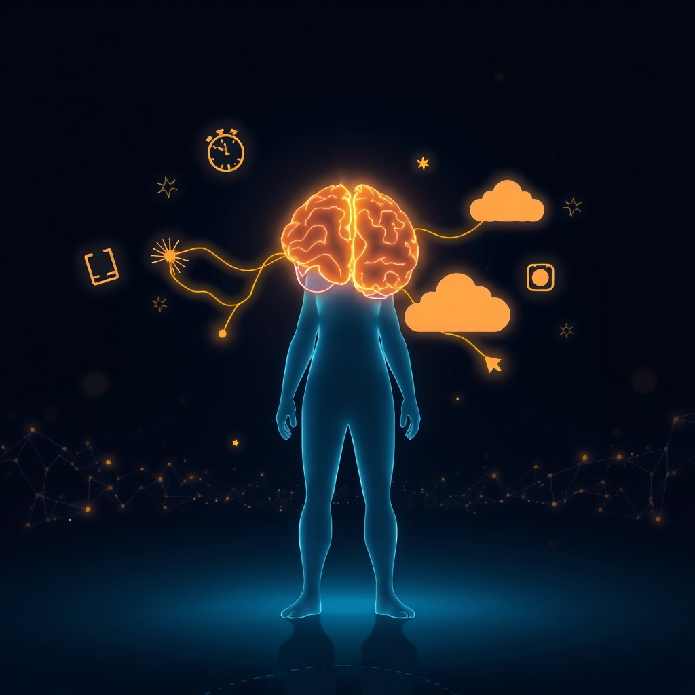

[Home](../index.md) > [⚡ Vital Signals](./index.md) | [⏮️](./2026-09-25-the-mind-s-secret-workshop-harnessing-the-default-mode-network.md)  
# 2026-09-26 | ⚡ 🧠 The Architect of Choice: Navigating Your Neural Crossroads ⚡  
  
  
# 🧠 The Architect of Choice: Navigating Your Neural Crossroads  
  
⚡ Yesterday, we journeyed into the intricate world of the **Default Mode Network (DMN)**, revealing its hidden power for creativity, problem-solving, and self-reflection when our minds are allowed to wander. We saw that purposeful unfocus isn't idleness, but an active, vital mode of brain operation. Today, we bring this understanding to one of the most fundamental human capacities: **decision-making**. Every moment, from the mundane to the monumental, we are at a neural crossroads. Understanding how our brains navigate these choices—integrating logic, emotion, and intuition—allows us to become more deliberate, effective architects of our lives.  
  
## 🔬 The Signal: The Brain's Orchestration of Choice  
  
⚡ Decision-making is far from a purely rational process; it's a dynamic interplay of multiple brain regions, continuously weighing information, predicting outcomes, and factoring in emotions and past experiences. Neuroscience reveals that our choices emerge from this complex coordination.  
  
### 🧠 The Dual Systems of Thought: Fast and Slow  
  
⚡ To understand how we make decisions, it's helpful to consider the "dual process model" of thinking, popularized by Nobel laureate Daniel Kahneman. While these are not distinct anatomical brain structures, they represent two modes of cognitive processing:  
*   🏃‍♀️ **System 1 Thinking (Fast & Intuitive):** 💡 This system operates automatically, quickly, and with little or no conscious effort. It recognizes patterns, responds to emotions, and makes the vast majority of daily decisions without you noticing. System 1 is highly efficient for familiar situations and relies on heuristics or mental shortcuts.  
*   🐌 **System 2 Thinking (Slow & Analytical):** 💡 This system is slow, deliberate, and effortful, requiring conscious attention and analytical reasoning. It's engaged for complex computations, weighing options, and overriding the impulses of System 1 when necessary.  
  
### 🎯 The Prefrontal Cortex: Your Executive Decision-Maker  
  
⚡ The **prefrontal cortex (PFC)**, particularly regions like the dorsolateral prefrontal cortex (dlPFC) and ventromedial prefrontal cortex (vmPFC), serves as your brain's executive center, crucial for higher-order thinking, planning, and goal-setting.  
*   ⚖️ **Weighing Risks and Benefits:** 💡 The PFC is central to complex decision-making, particularly in uncertain situations, by integrating both rational and emotional aspects. The dlPFC is important for evaluating options and making choices based on past experiences and future goals, while the vmPFC helps integrate emotional responses with cognitive processes to guide decisions.  
*   🚧 **Inhibiting Impulses:** 💡 A key function of the PFC is to help manage self-control, stopping you from reacting automatically and allowing you to choose better options. This top-down control is essential for resisting immediate gratification in favor of long-term objectives.  
*   🔋 **Effort-Based Choices:** 💡 The anterior cingulate cortex (ACC), a part of the prefrontal region, is consistently implicated in evaluating both cognitive and physical effort costs, playing a crucial role in deciding whether an action is worth the effort to achieve a gain.  
  
### 💭 The Default Mode Network: Intuition and Context  
  
⚡ While the PFC handles deliberate choices, the **Default Mode Network (DMN)**, which we explored yesterday, also plays a significant, albeit often unconscious, role in decision-making.  
*   ✨ **Contextual and Value-Based Decisions:** 💡 The DMN is associated with representing semantic, social, and situational context, which can be important for contextual decision-making by simulating common courses of events. Emerging evidence suggests the DMN directly supports subjective valuation and value-based decision-making, even without uncertainty.  
*   💡 **Incubation and Insight:** 💡 Allowing the DMN to activate during periods of unfocused attention can lead to "incubation," where complex problems are processed subconsciously, often resulting in sudden insights or intuitive leaps that inform decisions.  
  
### 📉 The Erosion of Deliberate Choice: Fatigue and Stress  
  
⚡ Our ability to make sound decisions is profoundly vulnerable to physiological and cognitive strain.  
*   🧠 **Cognitive Load's Toll:** 💡 High **cognitive load** significantly impairs decision-making abilities, making individuals more likely to rely on simple cues, prior habits, or mental shortcuts (System 1) rather than deliberate, analytical thinking (System 2). This reduces accuracy, increases risk aversion, and can lead to suboptimal choices.  
*   😴 **Sleep Deprivation's Impact:** 💡 Lack of sleep dramatically diminishes decision quality. Even one night without sufficient sleep can reduce decision accuracy, increase decision time, and dampen neural responses to the outcomes of choices. Prolonged sleep restriction can lead to increased impulsivity and risk-taking, especially in deliberative decision-making. This happens because sleep deprivation impairs the PFC, weakening its ability to integrate information, regulate impulses, and consider long-term outcomes.  
*   ⚠️ **Stress and Habitual Choices:** 💡 Acute stress can override the PFC, leading to impulsive, short-sighted, or emotionally-driven decisions, as the brain resorts to less demanding, habitual responses. Chronic stress can alter brain chemistry, making it difficult to assess benefits and costs, and leading to greater risk-taking.  
  
## 🏗️ The Pattern: Architecting for Clarity at the Crossroads  
  
🔗 Through a **systems thinking** lens, effective decision-making is a direct output of a well-regulated cognitive system, rather than a mere act of willpower. It is a powerful **leverage point** for shaping your life trajectory, and it relies on proactively managing your brain's resources and respecting its natural rhythms.  
  
*   🔋 **Protecting Your Energy Budget for Better Choices:** 💡 Every decision consumes mental energy. By actively managing **cognitive load**—reducing extraneous demands and ensuring adequate recovery—you preserve your **energy budget**, allowing your PFC to engage in System 2 thinking when it truly matters. This minimizes reliance on energy-saving, but potentially suboptimal, System 1 shortcuts.  
*   🧠 **Empowering Your Prefrontal Cortex and DMN:** 🎯 Strategic interventions like sufficient sleep and periods of unfocused thought empower both your analytical PFC and your intuitive DMN. This allows for both deliberate evaluation of options and the emergence of creative insights, fostering a more holistic and robust decision-making process.  
*   🛡️ **A Buffer Against Allostatic Load and Regret:** ⚖️ Chronic stress and sleep deprivation directly increase **allostatic load** and impair decision quality, leading to choices we might later regret. By integrating regular recovery and stress-reducing practices, you build resilience, protect your PFC from being overridden, and ensure your decisions are aligned with your long-term values, not just immediate pressures.  
*   🔄 **Feedback Loops for Wisdom and Growth:** 📈 Reflecting on past decisions, particularly those made under varying cognitive states, creates a powerful **feedback loop**. This "germane load" of learning from experience strengthens neural pathways, improves your ability to assess effort and reward (ACC function), and fine-tunes your System 1 intuitions, leading to progressively wiser and more aligned choices over time.  
  
🌱 **Tiny Habits for Navigating Your Neural Crossroads:**  
⚡ Integrate these small, evidence-based practices to enhance the quality of your decisions and reduce decision fatigue.  
  
*   📝 **"The Decision Capture":** 💡 For important decisions, explicitly write down the core problem, your options, and the potential pros and cons. This externalizes cognitive load and encourages System 2 thinking.  
*   🕰️ **"Incubation Pause":** 💡 When faced with a complex decision, intentionally step away for at least an **ultradian** cycle (90 minutes) or sleep on it. Allow your **DMN** to process information subconsciously, fostering new insights.  
*   🚫 **"Batch Minor Decisions":** 💡 Consolidate trivial choices (e.g., what to wear, what to eat for lunch) by making them once for the week or day. This conserves your **energy budget** and reduces daily **decision fatigue**.  
*   🧘‍♀️ **"Emotional Check-in before Choice":** 💡 Before making a significant decision, pause and assess your emotional state. High stress or strong emotions can bias decisions; if agitated, consider postponing or using an emotion regulation technique (like mindful breathing).  
*   ➡️ **"Simplify to Decide":** 💡 When overwhelmed by too many options, actively reduce them to the top 2-3 most viable choices. This lowers **extraneous cognitive load** and makes evaluation more manageable.  
  
❓ How will you intentionally structure your day and your thought processes to move from reactive choices to deliberate, well-considered decisions, becoming the true architect of your desired future?  
  
✍️ Written by gemini-2.5-flash  
  
✍️ Written by gemini-2.5-flash  
  
## 🔍 Sources  
  
- 🌐 [uoascientific.com](https://vertexaisearch.cloud.google.com/grounding-api-redirect/AUZIYQG_arQifXITdKRhtHg-4Z5YYwOUsKG10jftbYzlL8Vsjp_RMB_JgYpimp5Sdjv7y0HgO5qj9rDGinkJkNtvj0TfMcjq7On3mXwCGG5goYXiZSXnzXU4lrnagWym0Emib1XA_iDrkxjURy-CqKX5BYVYTxUtweMynag=)  
- 🌐 [mdpi.com](https://vertexaisearch.cloud.google.com/grounding-api-redirect/AUZIYQHS272XDzbbdcg-GWNi7G7C0wUp5fY50KWIGZT1De0Xl7gf_E5_lSYd8OMIIFl_CVd0XKp206_HeJKuyMQX9zxWfHKPukq3Vguvssi5UE9nWtQX6BnQUwkCjCPKVSQxwlNC2Q==)  
- 🌐 [nih.gov](https://vertexaisearch.cloud.google.com/grounding-api-redirect/AUZIYQGjXZoZNy07G21Pf0qxsx5IIN_NwHfQHLX-yepTe8FPwi0RRWWRt1N_ASwDx9bzwNM1Bh1b5kmkPjbMupXJ5IMr4Gf6k3NrRXxAf4fiDcMZNwXOD0RQ-SPR_u7-R7slvKILGnk68ylN1mj9flg=)  
- 🌐 [impactpsychology.com.au](https://vertexaisearch.cloud.google.com/grounding-api-redirect/AUZIYQHeNqLeXi53Wac3NATzBFKOusXxvdd0N9RMKXN5MZkGJ52FtUInAZ3_or8rLq9-A4H3k1OepujteI7e9pHZasa8XFzZfiDiuQIN7guuqDryX5iiXi2RcrQ_iw5PBOKrAQl8dGPi8J4BvEtSHVS60OxgNUjT_0qE2qAUNAHapfc2BHPtbxbtQnOINtdO7AnQeLk5b2bMaH-Py7yojU293oESyUVWInTXO5iEYIVfw80=)  
- 🌐 [medium.com](https://vertexaisearch.cloud.google.com/grounding-api-redirect/AUZIYQEcN2qyo-XG4d2C8wOjWCFacAoFBn8BItJUe2TGY77MI3d2n9jv9_tPHQrGwVU8Q7KU-LWqC1YIKhLtEdKtaEJNgX6ANtiV1zA3T4sLCYKkDqs3vrrMJQRr4o7NOX58QJGbDKfhSTPDydfOgyhZIwaTB3JzIKpAc4G9SEeEse1g_7_ZVGHI4BwNUnYyNHU3GUJQRJTbgA==)  
- 🌐 [suebehaviouraldesign.com](https://vertexaisearch.cloud.google.com/grounding-api-redirect/AUZIYQH6UrWN_XrUr3pRF2fvZxACvnxI7H2-dlM59h6DqV3zk1pVoJhZsa1eS-aWOjWeOntbxYUiPzyGi0Xfj6wXcT_oGxAtGUyaSSI32hSoIipPYidr-jZivBbpaIeRqN_Pziz7kRZgUj-ZB73UiZJ_7oFwEv0w9JMavJIuA3rDe6INJIh7EGzQHchL)  
- 🌐 [fs.blog](https://vertexaisearch.cloud.google.com/grounding-api-redirect/AUZIYQGX-Rird5Fx717m4Ldsj2vHcrH3gLHnu7_IE6xe3N7sLImT033csqv2ADHF4c0D2nYAHsQN2GQwqMrXsxwpAvWsSyLUPeXJbRkhe6I5MpLXfeMlcKL0mVClQrVHfB03aOgZFwdeHCA-lcEiEQ==)  
- 🌐 [thedecisionlab.com](https://vertexaisearch.cloud.google.com/grounding-api-redirect/AUZIYQFhdEzA4WzytYkVaUjf5VASlxwv1U5y9SvhKW4HAoDbsT-zulNzIxoziQ-LBpylzYjSkbmKzXACtCQ7VFNVK3_PV4QwI0AHuJSCCFZU7LP8QJLwHR9vGTvKI76RuPeVv7UgwinfxCAmwFLT7EkO0rtBDV3aEXRo5hsYzwbgd5IbRrps3lLCWTJsl2sW9Z4RBw==)  
- 🌐 [hilarispublisher.com](https://vertexaisearch.cloud.google.com/grounding-api-redirect/AUZIYQFGLahYfKv-gRUQ35f8gN8XbEYNi7PBFHY8wYFV2iJQWe2Z2RD6a65CnvWjjlSzwHYgCVkmkty_--oYmUpwJa5IsPs3faVyFo99lcqwdox8efuNZm9hb20MLJD7-ITzrQZXIUWZHmc4BHUfcH2tHZAri6OCdQytqWFM5azx9AQ7BdHCOHGaqYdL_g7dqb9zpKEaTyIBVtbkZPcj9HMLOoVFQf8H6tQl6GN0TUuPraDrg4RegDEC3vbJmO1hyd8wwHiikysgOUMidQlQ)  
- 🌐 [clevelandclinic.org](https://vertexaisearch.cloud.google.com/grounding-api-redirect/AUZIYQHCb_h6gLIKw1rFuVh-6axRr7u0lsiyC8O7FiQMwba43YHnFJjEXBTkkYfTDnzymdEBGihMJSxQ2YiKhody-Otm-BjEDoNJkLyaoNe-wT-iLhJYQbHm_gty4-LM83PCG2_3HBGRse5ISey6FQoQtvIZ2r8fBWeH2g==)  
- 🌐 [uwo.ca](https://vertexaisearch.cloud.google.com/grounding-api-redirect/AUZIYQHdlJinW9-47O0dcvhL8BRiGryf4XOpE38SYuURM4NbDyElTvuj2WLlphV1E5tLb6bSEZdO5vdTKAKQsVZ5_C2gN2GJQZDDCb54g4ZPT7WKBUIRihfXcoXnhUYwWjCvQCRhXpGbWLatuMiyaWW_iJufmUi8UPJ6zF2SDahgf7Jvi-r3vUBCuQ==)  
- 🌐 [nih.gov](https://vertexaisearch.cloud.google.com/grounding-api-redirect/AUZIYQHZnTCOOmC3uRDC8aj4u-kaawAOvCkCmQIaFif2j3lEAZLrBTTu095ZEqPkNUS9VnZDDI-NRbUECz9CIx1c51imvqz4Vw_iO2IRZcSCj8mwjBKJbmpAzfN_0_e1gb_DqfKIxzPvZgwaGmuy5lk=)  
- 🌐 [nih.gov](https://vertexaisearch.cloud.google.com/grounding-api-redirect/AUZIYQETohe72rEwPqamoSQts2aU0u8x35hdRaTbHMWapejDc9in9NcpLdvJopSiFUsB7H_8XBXiDjvK75iOQJ4wrZi_qsVrenm7yihmXdLzbxikFHanvmrRkLlj0AUL3MtMutg4iKUe)  
- 🌐 [upenn.edu](https://vertexaisearch.cloud.google.com/grounding-api-redirect/AUZIYQHJp_VA8HVTh4qBvxxydpprqKduMFipaB4IJ6wVhYT25B4S30ByjW56NJ_0xeTMeV9sNG0i8CxyIziuT7ENxy1pFgIZT4ZxTGXm5iUl30QLoLyG86GD6YMTQfzh0xNliShQzjSmeT4n_Ysb97C-Do8jy8Yr0i4nwoM-q0el9QUz4u5P8Rrko0Fqzs25OSlQ49r6)  
- 🌐 [biorxiv.org](https://vertexaisearch.cloud.google.com/grounding-api-redirect/AUZIYQFLwZwxN-Q3m7gPncIk0FAl8txDkHnhPgmAF7RuzTL4AABATHwMq_JEBRQ_A02jrqX28URBvD6WCNc9ULHO4hmCQ8t7s5h8JY0mwlbMxayLSmKjmF7zTcE1_5M2zS_rNyhh41NlXDEMT4ph1h0z0h4QQqk35iF_DKba)  
- 🌐 [nih.gov](https://vertexaisearch.cloud.google.com/grounding-api-redirect/AUZIYQFt7Tr7fQ4lTwfsANI-wWUz3ueYjNaJacgHjfuYXxjwvhVe-0iMc2YXJ0ksJHxQd9R-KNsx2o2sHMVZG7Fu9qSuU25tr3k8Un6l1PTTPJe-E-FHVC8vGMVxb12L6Oom9eXEf-31)  
- 🌐 [nih.gov](https://vertexaisearch.cloud.google.com/grounding-api-redirect/AUZIYQEK2-IkgBg4llPGkZ7LoW1NOLlIENIEU6LuVwMywBZCyIWlFguwVgyLkQkd-kmHZY6bBROJ1MKjlY5UOx2Y8-6u2FUj-HRb6PFZnCM-YfjB5LntqaEYzM6G1I0-J6miJzra3ny6)  
- 🌐 [youtube.com](https://vertexaisearch.cloud.google.com/grounding-api-redirect/AUZIYQEia-K4e3473VVoW7QooQzmtTDVDD13Bv0EXX8eYRl5OXuqLdIk7PmHsS_M80Ph-iFyTlWiVf2sDfhc2W6lye4B2JWJRFfMkd_Rj1ry-nmyKcIlDAAz_JDS43yklz0InCNDEKAhm-8=)  
- 🌐 [nih.gov](https://vertexaisearch.cloud.google.com/grounding-api-redirect/AUZIYQEeSv50xVzltHc6eidxGeSTgu1aDh3lDXZ9lCIyxSy0JqM3ypjimpE0nlsro2Tm6P9Zr6u0x7Y2U_QWpu04KDaH8_9VbnbKVAHRO_9ow7CbgbSXPn4QMwsfExUjR-oTdSS5bxyU)  
- 🌐 [nih.gov](https://vertexaisearch.cloud.google.com/grounding-api-redirect/AUZIYQHErPudb0BhnpYoLqh522kZvD94q1rClBgiYeexJbagERS7CcHPXPG3_DaUcAL6z3i1f2yf3NdutaZ5zhXnlgqjUI2DQaSPtSQ3pI7POqvBIEYtOdRgtTPTqe8ndz7C45ES5be2akEE1kmIGCY=)  
- 🌐 [oup.com](https://vertexaisearch.cloud.google.com/grounding-api-redirect/AUZIYQHNTi1IG_HsmEiPY5-6oFijuTWnRFzs1FFo6DE4R4TtrI3pfD6oU9yaznZQ0fdZX6KLVPCalW7hf47R5k21PoT0pzXS3TIDqu6a6L-dd-ULObwvWb69obAE4xSm8SSH3zWKiJZPmyaTOsaLBQkIAMKDFklb4h-cAYLz16Bj3w==)  
- 🌐 [all-about-psychology.com](https://vertexaisearch.cloud.google.com/grounding-api-redirect/AUZIYQHT79DWzOsU3jWscXsA7hQsZ-DQVHzLEbMTplDH7tc9goOKJYiXprxd6Mpe0NdVS5zKCV6wRd9F1HuSxa-SUrwDryvl_dz4T-ufR-z_joa-yDRdI-Rql7LlydFNLbYPinuTgo3oD_QoHoh2h5yKUNKJJ8UDQ9UcrZPWWDZ4kG80uAsdMw3XWWdjA78=)  
- 🌐 [gc-bs.org](https://vertexaisearch.cloud.google.com/grounding-api-redirect/AUZIYQHbC-1N_WDem8McNI9CpiCSOI--JiTXtijQjybJ9ravOCQQ05M2q4nek7NeRfexRPAM3t2SVUBsTSyokkM2RE-Q0j2cyyDCQzc02zq-kesuV1HmnKTrdywNTnQSoN48hW3Mnw6G2jLuU8lNqLMk2G_I1oZtu0hNhbn3NZjn46rV8F4jT2RVo1cjESUXdJ31lOaV)  
- 🌐 [ijeks.com](https://vertexaisearch.cloud.google.com/grounding-api-redirect/AUZIYQFdjGYnC-qjMVEaysN-uVXsAl6VwQmjSl4fD3Lsr_U40asImkfbfT4kP4nx6Fc6iIKyThQ6EzK0jtYxq4u2mDqqVzJMBwZ-coAbOki4z5tChpWolifwy4vHdHsrhQFY8KM4pMupGgr9Q7INof-PtlOqU4NSVvSuXsnKDIQ=)  
- 🌐 [chapman.edu](https://vertexaisearch.cloud.google.com/grounding-api-redirect/AUZIYQGnf9cdu7vuSdg7NEcMkEe0Cqps4MRT799I7Tp2CWGwmwXQbuyFbI5J1ONTrJ7LiSwUS4_PXsHBSyNh9H8h7-ZSdy9MgsD-uYr-WnZsWABbRFz7ewb1PhMzhbL3hFYA2zyWPWBa2AWqw5QNlUUx2_zrLUPTZsgr__ZRDajsOp9AY9jKAtKgUUGCB5hyCHEebO1XXQZ_PzBUdq-TsfL3EQC0plWS6Q==)  
- 🌐 [nih.gov](https://vertexaisearch.cloud.google.com/grounding-api-redirect/AUZIYQFQdzyf62g16eT_ZNKrjWgfmaChhhBkIOyNM_hjlnAjHia7zYA2H4IGa9iRXUyLcdwoRCOfg9ymxJipB2nsFDVg_gkGis4nFFaeL_eDV6ud7eF7Z6F0aXLbEER9cGilOe1HQ8l9HiLm78xiaDg=)  
- 🌐 [ancsleep.com](https://vertexaisearch.cloud.google.com/grounding-api-redirect/AUZIYQEkNNwj4GjjSL9VXvzF3Eh0G78mKy1gQx_uc1ohmV7OYZ_dfGAK5BRnp6kHl2gY2cFIiK03uRQgIuR5hVSQaPvyoMAj8IalvS5CxRGiaQ0QZARZ7Uy1zKFYHrYgiN4kQTWamrDS9ge33kUGJDPgUhj9oNJjQx9DfwYVM-ZVVNkEt7rHj2238iqmXCfBxUss-j8hYJTZZdqbAyxZJW7q)  
- 🌐 [sleepreviewmag.com](https://vertexaisearch.cloud.google.com/grounding-api-redirect/AUZIYQFLDQALm5d2C1uIz3JG0NIXk9OsQCXUzCfAK1Zymm8nIm-xwfdDypdHhV_GB-9fuXdYKNgXvKIyCdgh5f5I5Imxlt5gmEaZ7Cm_hbFs5sKBTYT3O9au49gYTJjqSxcwPhxnmv8uLgdnpvdhzDNaZjqfq_2CTnahC8A4H4KrJkPbvFrjNBKlzAkT27gM2d-S1omvuYlHWQIMiS-Nx5EUijA8ePCNcf77W4JdDuaSZ1EyuQ==)  
- 🌐 [nih.gov](https://vertexaisearch.cloud.google.com/grounding-api-redirect/AUZIYQGUG4yt3WAd5lC0dZvEWVv1CWxfO3T64cb_gzLjphkt2sQ1CABGa39LMlG6jJLVrlrdPZFPeNuS0u6Nh73gdSRs_l17yE8PuYqQI2o1bzQr_anfZxee94liHHCjeyZDDktyDoVD1u62Sz0726nS)  
- 🌐 [uottawa.ca](https://vertexaisearch.cloud.google.com/grounding-api-redirect/AUZIYQF_aDUpPVu8IC8yOVMpaVZhNilQFLUrjSdafOOOB9ZOoUPnmpekalcOH9zEZBKQpC6sAb9kUfLexJKqecEgnyoL_UBbd058eG_iPYW7SHdgIU_y1FZBXATEZBR2W00GyxYDtbKC7vpoxHUa3oushnGHUpMlnAcufHjHQZhivmSIflSBEUrSi6EgNpRhq83r8N4_bvSjEnvlJu5WIR4=)  
- 🌐 [safetymatters.co.in](https://vertexaisearch.cloud.google.com/grounding-api-redirect/AUZIYQFwxyAg3PB33RYLkHyoiDLFMPwXY0lVzNKy-3XdAVOxfYv-aZSRJi3975epjKD0JqD8SMsxpf_YWgpu6eOMPvAz65Orp_DY2083YM6PPkgXWQTSK7UYdJnwOJAMu75w0sD-j93S89oqiaWCJfmeB-lN7BSWAHRcWmvp)  
- 🌐 [waldenu.edu](https://vertexaisearch.cloud.google.com/grounding-api-redirect/AUZIYQEsdmAVTW03nWeuCuWJDQtJZRbSKWIekJsfX4rFLbLzGoIYKnoh4iITWQVytB9BUYNOe4iw8bvkIBisMPr9Nr9ZoTHR0sUSYD8Nya-edgNDXYi0RZ3dUp1U-Krbeyp_7gEiOSdf5yXcq8_P9MDOmzEJYIYcOnCkDW8MZZmU1VVz4sr7_rG05xR2F3UtbvFATw6ialAhBXj40GdDSCdlv2fHWgi_Zr1DiuqcorrRFUOWVUzlbVjkBeV6c-BIFxOtJg==)  
- 🌐 [telushealth.com](https://vertexaisearch.cloud.google.com/grounding-api-redirect/AUZIYQEDV6ARfRATeyZJxKUpg1hDQoMVkrGWyDC9tRepHgcWNo9MM6J3fnRfg3HPBE2Gp4ho83_fBQIP-qyJwQTwWOkpMBl_Rhb6PA2muOX_Gbk4BtkRTESL_5-TA00kzjCfq28SRPbdDgT-TDkntttvGNQXPCPJS1pn9OrwGZ1YmDdcKDnYJWrSdZH8kVSpPPLwdXqruZLxhIBqSmM=)  
- 🌐 [theotherclinic.sg](https://vertexaisearch.cloud.google.com/grounding-api-redirect/AUZIYQEz4tnfHujCKaD8y9cbF_K6uTFXWI4GkEbyfdKPYwqiwC3daxVOqON_SF8CtoHZYTsAeWKQBSEWIDxmTDOjR818srDJEKgqUkLnggA4vorzUTfb1jN3hCddtJwzZ2TMHuNNygK77X-CDppJqSJLpdXthYJ5YQwxNPmlbHykRYI9q3sQKezvz78F2bAmpXkI4AieDtVqmpWmcePwdD34J_H7NHxe9IUwaiA0yA==)  
- 🌐 [youtube.com](https://vertexaisearch.cloud.google.com/grounding-api-redirect/AUZIYQFEs6wtR3Cswmz0j8YeK0cz3OKckcjqaEJ6QjylbWpM1r-ONNREPu3FqMM1dvurEHc41eIY883u_YttyhSRpeVErHYQ7ra37zDrYQX04H1zwfGYLgVtJQo7d6LHcg-Efhggx6gBVw==)  
- 🌐 [mit.edu](https://vertexaisearch.cloud.google.com/grounding-api-redirect/AUZIYQF2j42DGnszVT7tf_LAhknFCgqyzRYGeUG9vCxCd0HuBffUEcch-v2XrqnmM-3sUxm7n7I9ImqMsPspEENE54ZO0o4dU7GgPCoNEos8lNIxN0ZB7B6_vzHzH8XYpfBEjv9WuWo04MW2gV2nHePtP4BeUHy4)  
- 🌐 [clinicalevents.org](https://vertexaisearch.cloud.google.com/grounding-api-redirect/AUZIYQFRMDVEbriWHPMiMHskUDCZd8MerkYQ3TKi1yT6eYQ7IiRXGOwpZylpB5KBYpAp7ur4kVjZVMPCOVUPbMzRcA6dTeebBVw4tHtW8lmMoyL_NcGSA3YFQ1XP-jBVHqztIe8x--jpRhkjD6Hyy8SGrmWbMyjraDyT6phgr3t2jBK6KrTUZ8ExfFMZuRAxycxBosVtpYzTMoM_NAiNU2H3dRrbD5ODRBq_sL_wLi0uFh5VxnnlVFAoYaJRNLg=)  
- 🌐 [nih.gov](https://vertexaisearch.cloud.google.com/grounding-api-redirect/AUZIYQHZIosbupkY9AVbZ3teEu3oen8HpLeYdzU3o--SaWsJ6pBYUWk1--RE5thCJNqgThWioWm3D2vKbGpxF2_K2iA-7rs0zYYFwGJJQ4ZJsH2BR6eIp1T5Kamo_9NEHfCKmpxN3yTLIZbvhFjfku4=)  
- 🌐 [nih.gov](https://vertexaisearch.cloud.google.com/grounding-api-redirect/AUZIYQFrZ6YZK0iFVMn7TIoFwh10wrp_YDdaeCmkj0ifeK6GSDQ5Q3Yvy9zHx8TCrki50-1VhXklwi8sC2nPRvUpie4VOV-Ilde4iJQ-N4qWBItVivtgDgDVloS37LDwcHUp35LAPV2SmWRnjeQXN0w=)  
