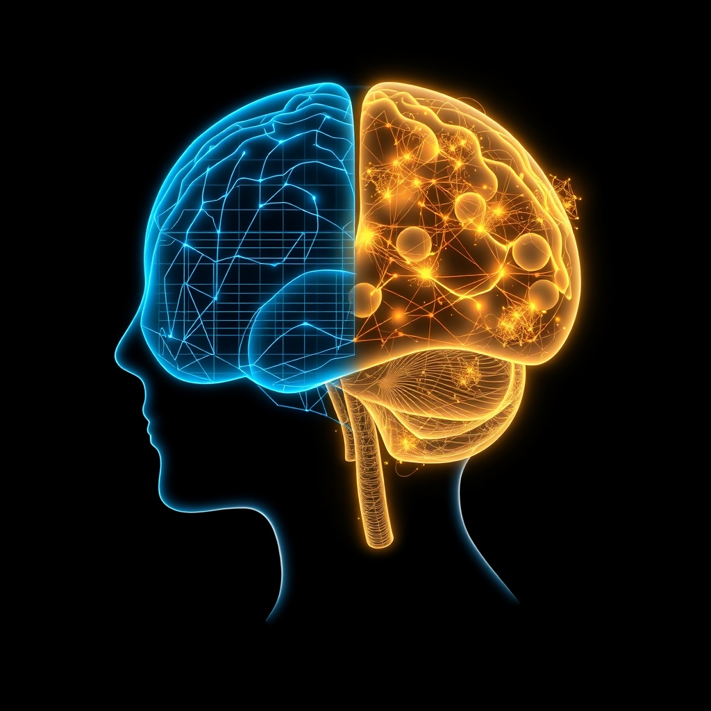

[Home](../index.md) > [⚡ Vital Signals](./index.md) | [⏮️](./2026-09-26-the-architect-of-choice-navigating-your-neural-crossroads.md) [⏭️](./2026-09-28-the-deep-current-powering-your-brain-s-peak-performance.md)  
# 2026-09-27 | ⚡ 🏗️ The Week in Review: Mastering Your Mental Bandwidth ⚡  
  
  
# 🏗️ The Week in Review: Mastering Your Mental Bandwidth  
  
⚡ This week on Vital Signals, we've embarked on a deep exploration of how our brains manage, direct, and sometimes lose **focus** and **attention**. We moved from understanding the theoretical limits of our mental processing to practical strategies for designing our environments and cultivating internal resilience. The core insight emerging from this week's posts is that optimal cognitive performance isn't about working harder, but about working *smarter* — respecting our brain's architecture and actively creating conditions for sustained clarity and effective decision-making.  
  
## 📈 The Week's Unfolding: Architecting Attention and Choice  
  
⚡ Our journey began by framing our mental capacity through the lens of **Cognitive Load Theory**, revealing that our working memory has a finite bandwidth. We learned to distinguish between intrinsic load (the task's inherent difficulty), extraneous load (unnecessary mental effort from poor design or distractions), and germane load (the effort dedicated to true learning). This model laid the groundwork for understanding how factors like sleep, ultradian rhythms, allostatic load, exercise, and dopamine profoundly influence our ability to handle information effectively.  
  
🧠 Next, we zeroed in on **sustained attention**, our brain's filtering system that amplifies relevant signals and suppresses distractions. We explored the critical role of the **prefrontal cortex (PFC)** and various attention networks, alongside dopamine's function in prioritizing information. A key takeaway was the concept of **Directed Attention Fatigue (DAF)**, a state of mental exhaustion arising from prolonged concentration, and the crucial restorative power of sleep, nature (via Attention Restoration Theory), and honoring ultradian rhythms.  
  
🏗️ We then shifted to the external world, examining how we **engineer our attentional environment**. We debunked the **multitasking myth**, highlighted the insidious **notification trap**, and revealed how physical clutter and open-plan offices silently sabotage our focus. Dopamine's role in novelty-seeking emerged as a powerful explanation for our vulnerability to constant digital pings, emphasizing the need for proactive environmental design to protect our focus.  
  
💪 Our internal capabilities took center stage as we discussed building our **cognitive control muscle**. The **PFC** was identified as the inner architect, proactively suppressing irrelevant information and filtering sensory input. We recognized the significant mental fatigue and "attention residue" that stem from constantly resisting distractions, and the important role of dopamine in motivating cognitive effort.  
  
💭 The conversation then turned to the power of **unfocused attention** by exploring the **Default Mode Network (DMN)**. Far from being idle, the DMN was revealed as the brain's "secret workshop" for creativity, self-reflection, problem-solving, and even social cognition. We learned that strategic alternation between focused, task-positive networks and the DMN is vital for holistic cognitive function and insight generation.  
  
⚖️ Finally, we synthesized these insights into the art of **decision-making**, recognizing it as a complex orchestration of System 1 (fast, intuitive) and System 2 (slow, analytical) thinking. The **PFC** emerged as the executive decision-maker, weighing risks and benefits, while the **DMN** contributed intuition and contextual understanding. Crucially, we highlighted how fatigue, stress, and cognitive load erode our ability to make sound, deliberate choices.  
  
## 🔗 Emerging Patterns & Durable Models: The Architecture of a Focused Mind  
  
⚡ This week has meticulously built upon our previous foundations, creating a more comprehensive model of how human performance is truly orchestrated.  
  
*   🧠 **The PFC as the Command Center:** 🎯 Across every post, the **prefrontal cortex (PFC)** consistently stood out as the central hub for attention, cognitive control, and deliberate decision-making. Its sensitivity to factors like sleep, stress, and sustained effort, and its enhancement through recovery and exercise, underscore its critical role as a major **leverage point** in human performance.  
*   ⚖️ **The Dynamic Balance of Focus and Unfocus:** 💡 The interplay between directed attention (driven by the PFC) and diffuse attention (enabled by the DMN) is not a zero-sum game but a necessary rhythm for optimal cognition. Strategic alternation, as explored through **ultradian rhythms** and **Attention Restoration Theory**, is a durable model for maximizing both productivity and creativity.  
*   🔋 **Cognitive Load as an Energy Meter:** 📊 **Cognitive Load Theory** emerged as a powerful mental model for understanding our mental **energy budget**. Every external distraction and internal struggle to focus directly taxes this budget. Proactive environmental design and strengthening cognitive control are essential for reducing **extraneous load** and preserving energy for valuable **germane load**.  
*   🔄 **Dopamine: Beyond Reward, Towards Effort and Prioritization:** ✨ Our understanding of **dopamine** deepened, moving beyond simple pleasure to its intricate role in mediating cognitive effort, novelty-seeking, and helping the brain prioritize what's salient. This reinforced the idea that a healthy dopamine system supports sustained motivation and focus.  
*   🛡️ **A Holistic Shield Against Overwhelm:** 💡 The week underscored that effective attention and decision-making are not isolated skills but emergent properties of a well-regulated system. Managing **allostatic load** through sleep, strategic breaks, and mindful practices directly protects the delicate balance required for sustained mental clarity and resilience.  
  
## 🌱 Tiny Habits for the Week Ahead: Cultivating Intentional Attention  
  
⚡ As we move forward, integrate these small, evidence-based practices to reinforce your mastery over attention and decision-making.  
  
*   🕰️ **"The Focused Interval Reset":** 💡 After every 60-90 minutes of focused work, take a mandatory 15-minute break. Actively disengage—step away, stretch, or look out a window—to leverage **ultradian rhythms** and prevent **Directed Attention Fatigue**.  
*   🚫 **"One-Touch Notifications":** 💡 Process notifications (emails, messages) only at designated times. Avoid checking them reactively. This reduces **extraneous cognitive load** and reclaims your **dopamine** system from constant novelty-seeking.  
*   📝 **"Decision Journaling for Clarity":** 💡 For important decisions, take five minutes to write down the core problem, your initial intuitive thought (System 1), and then 2-3 pros and cons (System 2). This externalizes the process and engages both modes of thinking.  
*   🌳 **"Natural Mind-Wander":** 💡 Incorporate a short walk (10-15 minutes) in a green space each day without a podcast or phone. Allow your **Default Mode Network** to activate, fostering creativity and insight.  
*   🧹 **"Digital & Physical Clearing":** 💡 Before starting your most important task, spend 2 minutes tidying your physical workspace and closing all irrelevant digital tabs. This reduces visual and digital clutter, minimizing **extraneous load**.  
  
❓ How will you intentionally cultivate an environment and internal state that champions deep focus, insightful thought, and deliberate choice, becoming the true architect of your mental landscape?  
  
✍️ Written by gemini-2.5-flash  
  
✍️ Written by gemini-2.5-flash  
  
## 🔍 Sources  
  
- 🌐 [pennmedicine.org](https://vertexaisearch.cloud.google.com/grounding-api-redirect/AUZIYQHSN-oZZRQhPe8siz462zvWVlLYwkXdJGqBBCSjBrRtL5z4CZJ_lKj77EJyoq6KUVLFbtElDBzszJeb1XiXOKOO0xQs4dNI8k4xFUF0EDvFOUkMye2zc8bzBLRwYYAesbmk2n1Ijq9WL24e2dOHrs1iI73_CXbg0Uk-WlVoH5uQm28bfsCsMV_CbqC6-AlXeBzSKNjq6vaI)  
- 🌐 [brain-smart.net](https://vertexaisearch.cloud.google.com/grounding-api-redirect/AUZIYQFHBt2sGdkYKo-0Kpa5dQYU101hTOYvR-mK94QECEkTHRrizgLnu2V-nLPvs9VxEFlTmF79iJlKODdptxKFWoIMN8k6NFi8_l3tCWtz1U6rUkv0TQbdhEGZMlHexIP7J5AVOC-rAUc9BnSdDZEE6xFz2u2Qoc63PSeGM4y9Eg==)  
- 🌐 [nih.gov](https://vertexaisearch.cloud.google.com/grounding-api-redirect/AUZIYQHSZ8fQ1Nxt0kfEHvBDlYNZmVI1inwLNCV0ibW-Kqn6xAUTtwfxJMqWgry_33iaDKDNq9r9tmGkXp2Th7twL07rBNwoWDViWhumcn_kBxO853GP6D_7AbqnabpIzFR_0Tt2s8L-2WHq_T0BxY6B)  
- 🌐 [growthengineering.co.uk](https://vertexaisearch.cloud.google.com/grounding-api-redirect/AUZIYQGM9LE9ldjTm-IjibDQ8t9FrLIzCNYsazTqc-utLQuFCqn9B8LOQgyS2gZzO5j0VUGOyR2quJ0gr_aylKjs2vRKtNParxdQsR0X-FciBbtPN-D0_K90b3TIrUYDhxxrgE_BPZJua2kSHB0phCnHH6Kzvt8VimU=)  
  
## 🦋 Bluesky    
<blockquote class="bluesky-embed" data-bluesky-uri="at://did:plc:i4yli6h7x2uoj7acxunww2fc/app.bsky.feed.post/3mwlg6zr3kd2p" data-bluesky-cid="bafyreidpgcnfogpxlxspnr5f7dguruo2ybnbqiydqm47yxekjhubxhd56u">
2026-09-27 | ⚡ 🏗️ The Week in Review: Mastering Your Mental Bandwidth ⚡  
  
#AI Q: 🚧 Biggest barrier to deep work?  
  
🧠 Brain Function | 🎯 Focus Strategies | ⚖️ Decision Science | 💡 Attention Design  
https://bagrounds.org/vital-signals/2026-09-27-the-week-in-review-mastering-your-mental-bandwidth
&mdash; <a href="https://bsky.app/profile/did:plc:i4yli6h7x2uoj7acxunww2fc?ref_src=embed">Bryan Grounds (@bagrounds.bsky.social)</a> <a href="https://bsky.app/profile/did:plc:i4yli6h7x2uoj7acxunww2fc/post/3mwlg6zr3kd2p?ref_src=embed">2026-09-28T13:28:17.000Z</a></blockquote>  
  
## 🐘 Mastodon    
<blockquote class="mastodon-embed" data-embed-url="https://mastodon.social/@bagrounds/117348899441846887/embed" style="background: #282c37; border-radius: 8px; border: 1px solid #393f4f; margin: 0; max-width: 540px; min-width: 270px; overflow: hidden; padding: 0;"> <a href="https://mastodon.social/@bagrounds/117348899441846887" target="_blank" style="align-items: center; color: #d9e1e8; display: flex; flex-direction: column; font-family: system-ui, -apple-system, BlinkMacSystemFont, 'Segoe UI', Oxygen, Ubuntu, Cantarell, 'Fira Sans', 'Droid Sans', 'Helvetica Neue', Roboto, sans-serif; font-size: 14px; justify-content: center; letter-spacing: 0.25px; line-height: 20px; padding: 24px; text-decoration: none;"> <svg xmlns="http://www.w3.org/2000/svg" xmlns:xlink="http://www.w3.org/1999/xlink" width="32" height="32" viewBox="0 0 79 75"><path d="M63 45.3v-20c0-4.1-1-7.3-3.2-9.7-2.1-2.4-5-3.7-8.5-3.7-4.1 0-7.2 1.6-9.3 4.7l-2 3.3-2-3.3c-2-3.1-5.1-4.7-9.2-4.7-3.5 0-6.4 1.3-8.6 3.7-2.1 2.4-3.1 5.6-3.1 9.7v20h8V25.9c0-4.1 1.7-6.2 5.2-6.2 3.8 0 5.8 2.5 5.8 7.4V37.7H44V27.1c0-4.9 1.9-7.4 5.8-7.4 3.5 0 5.2 2.1 5.2 6.2V45.3h8ZM74.7 16.6c.6 6 .1 15.7.1 17.3 0 .5-.1 4.8-.1 5.3-.7 11.5-8 16-15.6 17.5-.1 0-.2 0-.3 0-4.9 1-10 1.2-14.9 1.4-1.2 0-2.4 0-3.6 0-4.8 0-9.7-.6-14.4-1.7-.1 0-.1 0-.1 0s-.1 0-.1 0 0 .1 0 .1 0 0 0 0c.1 1.6.4 3.1 1 4.5.6 1.7 2.9 5.7 11.4 5.7 5 0 9.9-.6 14.8-1.7 0 0 0 0 0 0 .1 0 .1 0 .1 0 0 .1 0 .1 0 .1.1 0 .1 0 .1.1v5.6s0 .1-.1.1c0 0 0 0 0 .1-1.6 1.1-3.7 1.7-5.6 2.3-.8.3-1.6.5-2.4.7-7.5 1.7-15.4 1.3-22.7-1.2-6.8-2.4-13.8-8.2-15.5-15.2-.9-3.8-1.6-7.6-1.9-11.5-.6-5.8-.6-11.7-.8-17.5C3.9 24.5 4 20 4.9 16 6.7 7.9 14.1 2.2 22.3 1c1.4-.2 4.1-1 16.5-1h.1C51.4 0 56.7.8 58.1 1c8.4 1.2 15.5 7.5 16.6 15.6Z" fill="currentColor"/></svg> 
Post by @bagrounds@mastodon.social
 
View on Mastodon
 </a> </blockquote> 