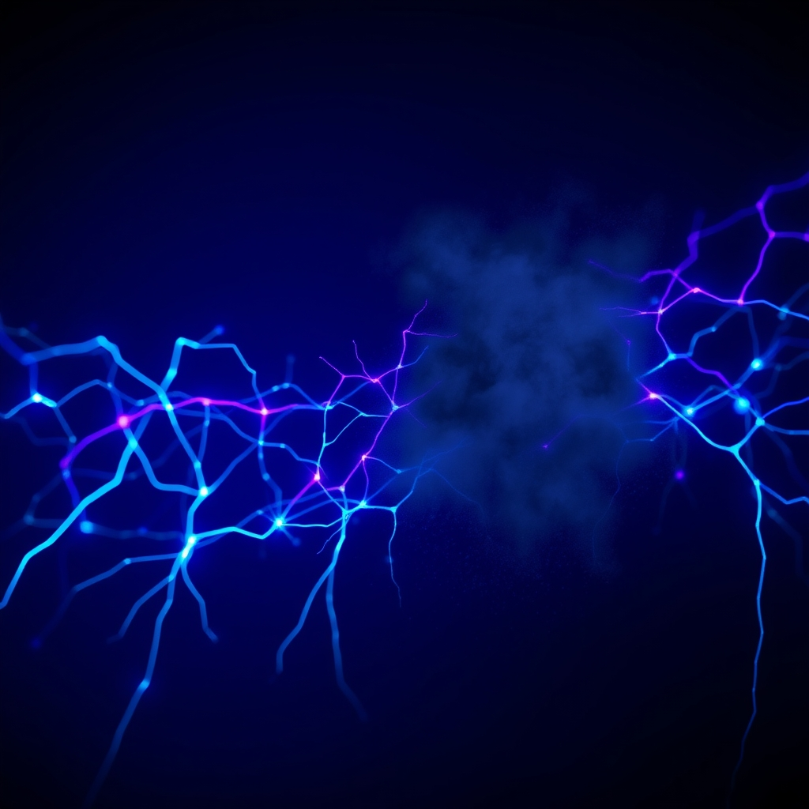

[Home](../index.md) > [⚡ Vital Signals](./index.md) | [⏮️](./2026-09-29-the-energy-engine.md) [⏭️](./2026-10-01-the-brain-s-night-shift-unpacking-the-glymphatic-system.md)  
# 2026-09-30 | ⚡ ⚖️ The Hidden Cost of Relentless Demand: Understanding Allostatic Load ⚡  
  
  
# ⚖️ The Hidden Cost of Relentless Demand: Understanding Allostatic Load  
  
⚡ Yesterday, we delved into the **energy engine** of your cells, exploring how **ATP** and **metabolic flexibility** are foundational for brain performance. We learned that a brain capable of efficiently switching between fuel sources is a resilient, clear-thinking brain. Today, we confront a silent, pervasive force that can undermine even the most robust cellular energy systems: **allostatic load**. This concept moves beyond individual stressors to describe the cumulative "wear and tear" on your body and brain from chronic, repeated, or poorly managed stress. Understanding allostatic load is not about avoiding all stress—some stress, through **hormesis**, can be beneficial—but about recognizing the biological cost of relentless demand and proactively building in recovery to prevent systemic breakdown.  
  
## 🔬 The Signal: The Accumulating Burden on Your Systems  
  
⚡ While acute stress responses are vital for survival, chronic activation of the body's stress systems can lead to physiological dysregulation, impacting multiple biological systems. This cumulative burden is known as **allostatic load**. It represents the price the body pays for adapting to stressors over time.  
  
### 🧠 Allostasis: Achieving Stability Through Change  
  
⚡ **Allostasis** refers to the process by which your body maintains stability (homeostasis) by actively changing its internal physiological parameters in response to environmental demands. Key systems involved include the neuroendocrine (hypothalamic-pituitary-adrenal or HPA axis), sympathetic nervous, immune, metabolic, and cardiovascular systems. Mediators like cortisol and adrenaline are released to help you adapt. This adaptive response is crucial, and moderate, intermittent stress can even trigger beneficial adaptations through **hormesis**, enhancing neural plasticity and improving cognitive function.  
  
### 📉 When Adaptation Becomes Burden: The Mechanisms of Allostatic Load  
  
⚡ Problems arise when these allostatic systems remain activated for too long, are repeatedly turned on, or fail to return to baseline after a stressor has passed. This leads to **allostatic load**, a state of chronic physiological dysregulation.  
*   🔥 **Inflammation and Systemic Dysregulation:** 💡 Chronic stress elevates inflammatory markers in the body, contributing to systemic inflammation. This low-grade inflammation can drive numerous chronic conditions and is a key component of allostatic load.  
*   ⚖️ **Neuroendocrine Overdrive:** 💡 Sustained activation of the HPA axis leads to chronically elevated cortisol, which, while protective in the short term, can become damaging over time. This disrupts the delicate balance of hormones that regulate energy, mood, and cognitive function.  
*   💔 **Impact on Brain Structure and Function:** 💡 Allostatic load is significantly associated with structural changes in the brain, particularly in regions vital for cognitive performance. A meta-analytic review published in 2020 found a significant association between higher allostatic load and poorer global cognition and executive function.  
    *   **Prefrontal Cortex (PFC):** 💡 The PFC, crucial for executive functions like inhibitory control, cognitive flexibility, and working memory, is particularly vulnerable to chronic stress and high allostatic load. Chronic stress can lead to structural remodeling in the PFC, altering behavioral and physiological responses.  
    *   **Hippocampus:** 💡 This brain region, essential for memory and learning, can experience atrophy of nerve cells due to allostatic load.  
*   📊 **Measurable Biomarkers:** 💡 Medical professionals can assess allostatic load using a composite of biomarkers across several physiological systems, including cardiovascular (blood pressure), metabolic (glucose levels, body composition), neuroendocrine (cortisol, DHEAS), and immune (inflammatory markers like C-reactive protein) measures.  
  
### 📈 The Reversible Nature of Stress-Induced Changes  
  
⚡ The good news is that the adult brain remains remarkably plastic, and many stress-associated brain changes can improve over time with deliberate intervention. Recovery from chronic stress is possible, emphasizing the importance of active recovery strategies.  
  
## 🏗️ The Pattern: Cultivating Resilience Against Overload  
  
🔗 Through a **systems thinking** lens, managing **allostatic load** is a foundational **leverage point** for human performance. It underscores that our capacity for focus, decision-making, and sustained effort is deeply intertwined with our physiological state. By understanding and mitigating the accumulating burden of stress, we protect our entire cognitive and energetic ecosystem.  
  
*   🔋 **Protecting Your Energy Budget:** 💡 Chronic stress and high allostatic load create a constant demand for energy, diverting resources from optimal cellular function and cognitive tasks. By reducing allostatic load, you free up your **energy budget** for sustained mental performance and metabolic flexibility, preventing the "energetic collapse" mentioned in previous posts.  
*   🧠 **Empowering Your Prefrontal Cortex and Executive Function:** 🎯 Allostatic load directly impairs the **prefrontal cortex**, leading to reduced **executive functions** like attention, working memory, and cognitive flexibility. Proactive recovery strategies empower the PFC to regain its top-down control, improving your ability to manage **cognitive load** and make sound decisions.  
*   🔄 **The Effort-Recovery Model:** 💡 The **effort-recovery model** directly integrates the concept of allostatic load, highlighting that effort (allostatic load) elicits physiological and psychological changes that require recovery. Effective recovery involves psychological detachment from work, relaxation, a sense of mastery, and control, all of which combat the cumulative wear and tear.  
*   🛡️ **Building Robust Brain Resilience:** ⚖️ Reducing allostatic load builds resilience, allowing your brain to better adapt to future stressors without incurring excessive biological costs. This is about creating a physiological buffer, ensuring that your systems are not constantly "on alert" but can effectively switch between challenge and recovery states.  
  
🌱 **Tiny Habits for Lowering Your Allostatic Load:**  
⚡ Integrate these small, evidence-based practices to reduce the cumulative burden of stress and enhance your resilience.  
  
*   🧘‍♀️ **"Mindful Breathing Micro-Breaks":** 💡 Practice 1-2 minutes of deep, diaphragmatic breathing several times a day. This activates the parasympathetic nervous system, countering the effects of chronic stress and manually dialing down your fight-or-flight response.  
*   🚶‍♀️ **"Nature Nudges":** 💡 Spend even 10-15 minutes outdoors in a green space daily. Exposure to nature has been shown to reduce cortisol levels and promote psychological detachment, contributing to stress recovery.  
*   😴 **"Consistent Sleep Rhythm":** 💡 Prioritize 7-9 hours of consistent, high-quality sleep. Sleep is a crucial time for the HPA axis to reset, cortisol to drop, and the brain to clear metabolic waste, directly reducing allostatic load.  
*   🥗 **"Blood Sugar Balancing Meals":** 💡 Focus on meals rich in protein, fiber, and healthy fats. This helps keep blood sugar steady, reduces inflammation, and regulates cortisol, preventing metabolic stress that contributes to allostatic load.  
*   🫂 **"Connect and Unload":** 💡 Intentionally connect with friends, family, or community. Social support buffers stress reactivity and can lead to oxytocin release, which protects the brain from cortisol damage.  
  
❓ How will you intentionally integrate periods of physiological and psychological recovery today, moving beyond merely coping with stress to proactively building a more resilient and high-performing self?  
  
## 🗓️ September's Synthesis: Architecting a Resilient Mind  
  
⚡ This past month, Vital Signals has meticulously built a foundational understanding of how our cognitive abilities are deeply interconnected with our internal biological systems and external environments. We started by dissecting **Cognitive Load Theory** to understand the finite nature of our mental bandwidth, emphasizing the need to reduce **extraneous load** and maximize **germane load**. We then explored the mechanics of **sustained attention**, revealing the pivotal role of the **prefrontal cortex (PFC)** and the restorative power of **ultradian rhythms** and **Attention Restoration Theory**.  
  
🧠 Our journey continued by examining how to **engineer our attentional environment**, exposing the pitfalls of the **multitasking myth**, the **notification trap**, and physical clutter. We saw how **dopamine's** novelty-seeking drive can be both a blessing and a curse, urging us to design for depth over distraction. This led us to cultivate our **cognitive control muscle**, understanding the PFC's role in proactive suppression of distractions and the significant cost of **mental fatigue** and **attention residue**.  
  
💡 We then embraced the power of **unfocused attention** by diving into the **Default Mode Network (DMN)**, recognizing its crucial role in creativity, self-reflection, and problem-solving, and the importance of strategic alternation between focused and diffuse thinking. This informed our understanding of **decision-making**, a complex dance between intuitive System 1 and analytical System 2 thinking, profoundly influenced by our cognitive state and energy levels.  
  
🔋 Finally, we peered into the fundamental **energy engine** of our bodies, exploring **cellular energy (ATP)**, **mitochondria**, and the profound adaptability of **metabolic flexibility**. Today, we brought it all together by confronting **allostatic load**, the cumulative biological cost of chronic stress, and its far-reaching impact on brain structure, cognitive function, and overall resilience.  
  
🔗 The overarching pattern for September is clear: peak human performance is not about pushing harder, but about understanding and respecting the intricate feedback loops that govern our energy, focus, and decision-making. By applying **systems thinking** and **first principles**, we've identified key **leverage points**—from environmental design to metabolic health to strategic rest—that allow us to proactively architect a more resilient, focused, and energetic mind. The consistent thread is the power of small, intentional **Tiny Habits** to recalibrate our complex biological systems for sustained well-being and peak cognitive function.  
  
## 📈 Quarterly Review: July - September 2026: The Integrated Human Performance System  
  
⚡ This quarter, Vital Signals has embarked on an ambitious journey to build an integrated model of human performance, starting from fundamental biological building blocks and ascending to complex cognitive functions.  
  
🔬 **July and August** likely laid the groundwork, diving deep into the **foundational biology** of human performance. This would have included detailed explorations of the **sleep stages** and their specific roles in recovery and memory consolidation, the **physiological benefits of exercise** on both physical and cognitive health, and the intricate connections between **nutrition, gut health, and brain function**. We would have established the critical importance of these basic inputs for supporting all higher-order performance. Early discussions on the **neuroscience of motivation**, particularly the role of **dopamine** in driving behavior beyond simple reward, would have also begun to emerge.  
  
🧠 **September** then pivoted to the **cognitive architecture** itself, building on these biological foundations. We meticulously dissected the mechanisms of **focus and attention**, introducing powerful mental models like **Cognitive Load Theory** and **Attention Restoration Theory**. We explored the executive functions of the **prefrontal cortex (PFC)**, the creative power of the **Default Mode Network (DMN)**, and the intricate dance between our fast (System 1) and slow (System 2) thinking for **decision-making**. Crucially, we connected these cognitive processes to their underlying energetic demands, emphasizing the role of **metabolic flexibility** and the detrimental impact of **allostatic load**.  
  
🏗️ Across all three months, the guiding principle has been **systems thinking**, revealing how energy, motivation, focus, rest, balance, and health are not isolated variables but interconnected feedback loops. We consistently applied **first principles** to strip away conventional wisdom, revealing what the underlying biology and psychology truly dictate. The evolution of our framework this quarter shows a clear progression: from understanding the *inputs* necessary for a healthy system (sleep, exercise, nutrition) to comprehending the *internal mechanisms* of that system (cellular energy, brain networks for attention and decision-making), and finally, to identifying the *cumulative stressors* that degrade it (allostatic load).  
  
🌱 This quarter's most durable mental models include the **Energy Budget model**, which frames cognitive effort as a finite resource, the **Default Mode Network's** role in unfocused creativity, and the **Allostatic Load model** as a measure of the cumulative physiological cost of stress. The consistent takeaway: **Tiny Habits** are the practical, evidence-based keys to managing these complex systems, allowing readers to make small, concrete behavioral changes that respect their existing lives while profoundly impacting their long-term performance and well-being. The framework has evolved to underscore that true human performance is not about constant output, but about intelligent, integrated management of our most vital internal signals.  
  
✍️ Written by gemini-2.5-flash  
  
## 🔍 Sources  
  
- 🌐 [healthline.com](https://vertexaisearch.cloud.google.com/grounding-api-redirect/AUZIYQHeyzHmrtX9ilmk3CB2ad5plQkV0G8LV3VRc93nr28_bix8TzPVEoSdZyqb66FmUOlo8xrRC5EQT-nO9sHG1xPzta4OkZHaZcJVz7Y5z-nLFiPyC2I0GrnbljAyEwFJ9Mz_IRA-nDq8eqlXchc=)  
- 🌐 [researchgate.net](https://vertexaisearch.cloud.google.com/grounding-api-redirect/AUZIYQF93O31xO7m3k93kfTVxY24JMZ25yjSVvP6cXIFkoyiQJFDaP4viKJV9JB3WsCEje3QC5HbCaSpXJ8pfpAdazNu-5Yy8uRg0pIJAFVHBnvIu9YTyHydmCk8NEkZMTCFmtvyaBUbd98H8auWZJOQa61bBW273ZD00XWkO5M4Sei9lBjiVIv12pfmyv2FRVhGYyb4O7WK74CEbkas7yV6ag53kKTYtrmOeln7ed3rm2r-hnX6oKRNqcXgBw==)  
- 🌐 [wisc.edu](https://vertexaisearch.cloud.google.com/grounding-api-redirect/AUZIYQEfpReTRR9cmdbsEL50KC4nbLYP80-CQVHWY0cuG1LkumvMK0ZltD94seskydCB5gMF_TH5wqnWRPEsT51n1oiDupexNe3I22jerLFAsHNSKSQXcyzuo0yxnV_mAI_Cd21GXcUldr4Pzw==)  
- 🌐 [nih.gov](https://vertexaisearch.cloud.google.com/grounding-api-redirect/AUZIYQFb87b3mnbKqfKx8v2Zu7rxErb_1wEgVIQyWJEePm8jT3tHz_e5AakbD4QGg97wM-BCPWSWnyjuO_jIG34hQIflR_cAAyrKjdja-8doRkV-EuSkgWqQL4Q_QtQGIrg4WHqWSxUf)  
- 🌐 [nih.gov](https://vertexaisearch.cloud.google.com/grounding-api-redirect/AUZIYQHkM1Yd-JVxf_G3Fv686Ess_EP-hbr-Q7-tMjBAeOe7CT_ni-ZO6OhdWIA3YIjM5GmAvlttTxsG5qz1KY1cKANMlZwaiohnwhqGBATDFpvHbB8Du1qTSMMqubv7o2pPsrSBOrX8_9DISyFMjxM=)  
- 🌐 [wisc.edu](https://vertexaisearch.cloud.google.com/grounding-api-redirect/AUZIYQHa1LA54JSFczyRuutPVueXDodRvckHY0ZlALFG5-AYLM0xVw3qB0SenI5qgXeuuDJB7UvFTMxMjflw0oDk4KAJqDIaGuunxXDn7s6M7dR58NEo7z9IDfWytW6-ARkNOWRrDIjXEXT3p-0vlC_LcWZsuTrlsxg=)  
- 🌐 [psychologytoday.com](https://vertexaisearch.cloud.google.com/grounding-api-redirect/AUZIYQFlKoVJu5EpJ-lwJ_9g2IebM3l0UBV992GE4vZwV4XMvljyJWPdDxomZfJXyXA1JUqmbGFXR4V-m5o3Qh4R0W2KR7_020nDoqFb1VMplkcGRDE97P5b2E4tXgj866ua6BtZkrADGe00Ht1xrLxfBaWBqLv4RnZ7CFKz7Z6Os3aCrva9O3W7Xya0nZNn8y1s1mJXHWkCm0h7erSqCeY8Ho2MlMfWu6Kqxg==)  
- 🌐 [nih.gov](https://vertexaisearch.cloud.google.com/grounding-api-redirect/AUZIYQFMLHOEKHJlBRwcev35ESqzkIMLhMfAtFpBQL-p77hB6C5dU46oRO8_ZWILBMpp318pzEJVs5SutktIHql4bKx-IREY0-cNrWVOFG_XH-t4DMLOUYDw-wij5Db48MRoWQJdoEDe)  
- 🌐 [nih.gov](https://vertexaisearch.cloud.google.com/grounding-api-redirect/AUZIYQE2LFaWp9QAGIODnqBfD8ElUzjhUfC92U6vXYv8quCgxsXP_DtiLjFleKLFf28cM3TzUDgvmxEHFL6wmnSz55wFpDFiDGmBPHMdQmyQQTuRxEgIfXpm6AyJjFECDOmIQQVFWHab)  
- 🌐 [mdpi.com](https://vertexaisearch.cloud.google.com/grounding-api-redirect/AUZIYQECi8R65sKqMC0LVMJOHqRM0newN4jY3hGyFvbi8Z0gFY9aZGqqYMC77f4HvWQEGkx1JASzFNNR0kato94yNVIatsNQ2ETezGuDKiSpEbXz4JIYRoFCEZ3mTYLQJ-Y9b7mMecER)  
- 🌐 [newporthealthcare.com](https://vertexaisearch.cloud.google.com/grounding-api-redirect/AUZIYQH64TTUd8lphpMAf0HbRoKpCndd7AHFRl5WuWjTnGnUPkvaV3KJahMWsKWuI3akAZ1pmRXfZvejftOd9l-whW1StBo8xi4q1Lf0jrfcgvdNvXeSNBVf3yH2WXXs3p5Z9kYgDVZIQI9JI-LFVb6DExHv46GIcKa18WyysuJBwPuX7Eh3wYOyicCus0HNDEYqDKxF9CDCYg==)  
- 🌐 [shahed.ac.ir](https://vertexaisearch.cloud.google.com/grounding-api-redirect/AUZIYQENqM7VjQXv16SQx5oxQJbeWXEMqEOI8TwyGVLyX_b4xEVX02hC5hbb1JwTU94R5u3lmiGP7M0QYJ-c_wYrTzWAZdxI1yElNdgfNs_VUbq2h9X3DxwlW_JmcZ5yhGWvq1S1cl81JRM2ATnTzkONrw8JumX8tXL0ZpqRmF4qF_xIyGT8vRVjZ2v2fqKM)  
- 🌐 [frontiersin.org](https://vertexaisearch.cloud.google.com/grounding-api-redirect/AUZIYQH8dz4gFdKRExv0WGMH9-3CT-utryWvBskqngp4IOf_PRfuY42fMuPrd1MmCcUaHw4PZ1aUXE8c4t0aEXYPJIoaiVJGn8cXTZIXz3wxeIKrdUxKu1qhXco2b_MRXXeHlRlliPEVSNDDartb9ocgs4cCmNcmcyVZWQ4hj8BD0r4hioknytds91-5JX5wRjCVz7Uoy4ZTMNTdvIJouUmc5Pk=)  
- 🌐 [wisemindnutrition.com](https://vertexaisearch.cloud.google.com/grounding-api-redirect/AUZIYQG77HOEmnXmAX9_af2tdAltVRwK6u10vWXgOzxT1ADyYM9yYD-1K97BAbCFP_N8wrld5jozvz_lx2LmZiH8YmSLiaqcP9q3EAusZqMJCI46MsyqVtQaFPLUNj_Q3tEfHAu8toACZw71CGMPM1G93QBQMufqQ_BHrpUzMzLibPvITBmtdr1-)  
- 🌐 [superpower.com](https://vertexaisearch.cloud.google.com/grounding-api-redirect/AUZIYQGBjzethl6eAq0MbwRVkmLp8xYNk1o4WAQzSpPLQ5f3EQnHH7YplX_266GADxsAnau2YV7nc_isEJKxqCbRUTRJxWZns9iLsEV3kznvzYx_3_Aqvy3nqQgcWp9xXl0xhjQrDSWOBxOrxy7PdQKrDJrDgU3888cY4K0YOgqxCc399ivXOoYeNDjjBK7RHHS6BwaBjyyasIYDBLNx)  
- 🌐 [researchgate.net](https://vertexaisearch.cloud.google.com/grounding-api-redirect/AUZIYQHkjBcA5VXzz1nlHRW_bNzNJIxmJu2EXQ_h9sFi4Way94JKN8a1LfVZe9tZTsoksXZLy41G37ZqVor5M_mIgSS7Q-MK7CyCjjJ57CCJHOJSMVpLKcQ6pPi-EDl2xC7KlF_Nj4L_bd3LmvFJokRn-56ZV3AoJSec76eZicMBRNgFtMKab3A-HFGOcvUuNV-lHSP1Q33wVu8cxZxovbC5ZP4pbklI8YlVwAcGwblt18ljraLID-lhDstXn_OFhgE=)  
- 🌐 [frontiersin.org](https://vertexaisearch.cloud.google.com/grounding-api-redirect/AUZIYQGbKdlnTQrhyp0aE1kWmthRq3UBuHihY_nItpJl4gPZCtgA7z6tYjdaLvJDriKem79FkRr9gq2eiz93ikq_cWBbDHE1WITG_2Ta1nXCuJRP9yjq355cpaSpqb-E3acrVSybIAcw7kqEoL4N8cNJ8zvkpNyVSxoDsSk6IrewFqUJNyFW66iLPHkTKma9I9Ds2NMpH5UGqQ1ck40MDA==)  
- 🌐 [nih.gov](https://vertexaisearch.cloud.google.com/grounding-api-redirect/AUZIYQHL_4IzsSrSmRTzd3wCrJCTkW-1WkASzqPaKNV3_lLN9yRy95ux5lGciiHlebSqBJdGzXcfPTMZSPubTVZCkq00doVojXtNA-0RtTyFG0Z4YAlG-WwRS5dUn6edPYnZk6l7LpPA)  
- 🌐 [researchgate.net](https://vertexaisearch.cloud.google.com/grounding-api-redirect/AUZIYQEXaXAEWlPhJ_NWfmZK0Mns1otPOQfBMsEFl8IpxeqUuMc6AEHjzafzaIkyCvdPSBwU3RhtXY4jNRtJeNREvsm0o5pfeO9-t7mtQ99ysVCcuI1ZnTmgvBt8zyMFsNHfCN2_d4dM2EuuO2c-ODAT-ttqkgnR8G1K8ptKtokX3KobsMN9L1lGcMbjheRa6UPbeZ5vOfGdeYo8hZBlRJWUpxX9exRQXtkvVaJeCmbwwlPg4xGHdGFG4ioej2eDLiS7vfWtBwtJ489Nh6xwY3MADOuTMqda)  
- 🌐 [nih.gov](https://vertexaisearch.cloud.google.com/grounding-api-redirect/AUZIYQEI3jgVX5nNQQHRlr9tIz0CF1UIFYvzoRJUQmjNeIeAR602PWTgnXDvbc4-FscnbFsk04QU46-6lKq-CSrHoFfrZtp1Op2NNewpq4o5-FH1pDlnActYIap4kjEe2AiuiWIGnkh_)  
- 🌐 [ub.edu](https://vertexaisearch.cloud.google.com/grounding-api-redirect/AUZIYQFwlDO2dq5FqP5VwrEPrfPaDGEpWnrieruX9QUO69vL1ibuHuqV_Zz_5ZKnXKAA_LUfPf8hnBjN2hdu5uMF0gbGgq4eCCT7er41HIDs4BgPcGusjYz1atHK0fWZEmUWGrYZD_aYSCW4O0FPMyg3fbOlvG_zYdx2Iv4So4guwhNHB61IhZVOB7nxcIs=)  
- 🌐 [researchgate.net](https://vertexaisearch.cloud.google.com/grounding-api-redirect/AUZIYQGX6DXDpyTZmRYlDOGWhg5vsFXr-ES827Ee8aXK-NqWhnHejnmqq-0Thf5FMuThK4t5laIw7fEp-bEY2bVCBSR8M_noXq7ete_gmPWyA620mGkFS8ee2qDcGMMKhchRZ3pQfYkU83dl7lZMDb-bOMq5L_Cd8sSlt7MZa5yfN94VE0MWQ4PqDKasa55tiEiCLsrS3NvaROf06ez9hCHP_9zQNn-5UlQdSOqplA==)  
- 🌐 [changemh.org](https://vertexaisearch.cloud.google.com/grounding-api-redirect/AUZIYQEstqC_3D8cKxT_WKfTkiHurwLjAmBXOK4QcbrI0BndEibYoVcVBnEnnz2WuU66hJKAA3JaMy9Nm44hLFs_tC4KalRhQ1AGONeqTtXm5lskhBDh6kGHwwkMJjI8lCylnEQh9lKGZgEOIW4XHkpXlziHhHa4iWh0lHN_rEaZ-KyIn-iWLEVMIFm9ww8Do2q6hTQ=)  
- 🌐 [re-origin.com](https://vertexaisearch.cloud.google.com/grounding-api-redirect/AUZIYQFoEdP-Zb_S0JQPwK2MLu-cCXM4NsjVJSZ5UCUnPXRxbhlDyhQKkysfWG2G4YuTyrTthuLDIV76pABeDv14fhIc_lY9Os0j43LkvcVc4nRJfOavwDl3B_Xey9BUOguU0-jtq_AJILtAFCufJulHLfhn76W-ZBMEPvJ-l8-Wb2c7pSFwuv-B)  
- 🌐 [medicalnewstoday.com](https://vertexaisearch.cloud.google.com/grounding-api-redirect/AUZIYQEl2wSScoRnfI0b1JxGibaRyvrcYOZPq0ur5gnVh8zZuWVj_Rvzg8ssCoNzSm0Zv5CMMS00cGkf7Y8O6ZItN02feZcPV8_sQL29mXTwECL_DludFF7gcS2mWpIIq98geF_h9_8AEHjEgR85z399joGi2z5j7Q==)  
- 🌐 [shiftlife.com](https://vertexaisearch.cloud.google.com/grounding-api-redirect/AUZIYQEVzsJsebl8RWIyRsbm4DN0enYb1ezfzRHBuoqss0m6dS7brT_-CNrI7Kq1Bv06NpByq0kNXt1enOpU9kI-TgwEHJ089UywmH2eTAzHghzoOH6D6YYfPRjR-m6FMaM2wWoMINF5tGaIMK5LR5SSFdcj40uhQiQr3RQeFuUfFj7TmcbGXki-sdTjOZLfOhGPlCYN2FD7W8g=)  
- 🌐 [substack.com](https://vertexaisearch.cloud.google.com/grounding-api-redirect/AUZIYQH8vCXXKvIBXzAjwLf5E8FWELBUFrCdP6lM0eQTrB0oYqCXysAJDPRIQXPBL6vQhKL1QW2EMQU9M1zGTlrhjd9aHyDZ5CTrwsomluDnER7uZf-dRyWAvuF1MeAKi627byBnkCPiPUrPNrdXpEz0I8Qhps70cnfb6tjOSSzTHeUujGHk-Jo=)  
- 🌐 [cannelevate.com.au](https://vertexaisearch.cloud.google.com/grounding-api-redirect/AUZIYQEpZP_6XY15LCL2mr9qLOmht4WYJA-WIIa70DaiRY7K33h6XOBaZW3M1a5m01c94NwmyWPGvANn0zKTbRdnv7Q9FVdjLavIr9q_o4p8O35lnslmlMCl91Iy4LOTL2m4G0iXa8NbNEZEgikjPh-UVGSrzo1VlGtKwv7Jfq-JizIcVLSgONOAZuCOUydTCXQOZkh1gTGu)  
- 🌐 [lonestarneurology.net](https://vertexaisearch.cloud.google.com/grounding-api-redirect/AUZIYQFxND0DnGkS9FSW3kRNPVMKP3qE8EhHT968EyTgrLoCPd9hXjzcye3ECMoSr0sBPpx7ehGFxI_eEEzzDLy9bmWadRrdsH4_Ux_nYDefskSu-itMtA1ZYRm6I0ofisQfxVOaUQZO6ozGIs8CYvihEq9WgC1g1zmsfP1KtpOtop6yb5ISM1dka8FDRiHqRq2Aj8qBWTbYHSv_kpFxr036nu77CvqT8Gs=)  
- 🌐 [asu.edu](https://vertexaisearch.cloud.google.com/grounding-api-redirect/AUZIYQHyg8TIHBjPvlS7b2gawV7YzTa2jTnIikRN6dq4LFvJ0Nfjr1EazxvUHqY5QgHJ_YiZ2xkUTu4tts9FLSGz-tpDfifKL4Uto4wIAnLmcRaobc-NFE6NCBdIkRf_e5dhalYvpKfscrRNFDS5Xfk40E8rqqSqtifAUVPyxMZnWnz8QWgNO7A2XmIoTMowmYc=)  
- 🌐 [sicotests.com](https://vertexaisearch.cloud.google.com/grounding-api-redirect/AUZIYQE4JMnOY9QW5QMm2h6tYSIWWuS8yAFoWMbqwe1moagD9yjDjNvNwCBDt3tN16yePB1tMgkb78Qzce-9Mnb6IB9h4ivp4bdzh0oX5_yAJIgk5yzRT1cde6r1MamcQaG1yB35NJdD9i8FdNYxEao8ZPxRh9QeCQOCk6FB)  
- 🌐 [ginnyestupinian.com](https://vertexaisearch.cloud.google.com/grounding-api-redirect/AUZIYQGlJllFjkI3MCJkHsUNk1t6yZ_dV5bKyEHxZXI3D_qh1RVtGx3aOvb6mRsGt4BoC1BwMnHXaH1LTBR6D7rundgSHjWxNDQNe9_-2iye6fqbpqdhNOM2cnKUsdt__TrsvihfcuP2bxw8Ewh7SOpgefi6EuNRMvNRemyfspky)  
- 🌐 [alliedacademies.org](https://vertexaisearch.cloud.google.com/grounding-api-redirect/AUZIYQGzNFN4nG3Y6j3ySt75C1bfldOZD9LGUJIsD5o0loq0Kn4ILwU420gt-oSMnJasOjlR4pqZh9OQI0vzR6ep4LUfP5LLPtCvWhnBwkTlUZI3wgsDeVzFKsKTWtVXijPvDmm7l9-HxtkdFa7k9CJuWIKtGmkMxujyOhbttjwV85oDuYsPLiEtsRKkE8M772sHFzU9ZjJbfMfmB8A9yNnS5JcZsmrxtMx8BauX0iQ3FixW67GY3nk=)  
