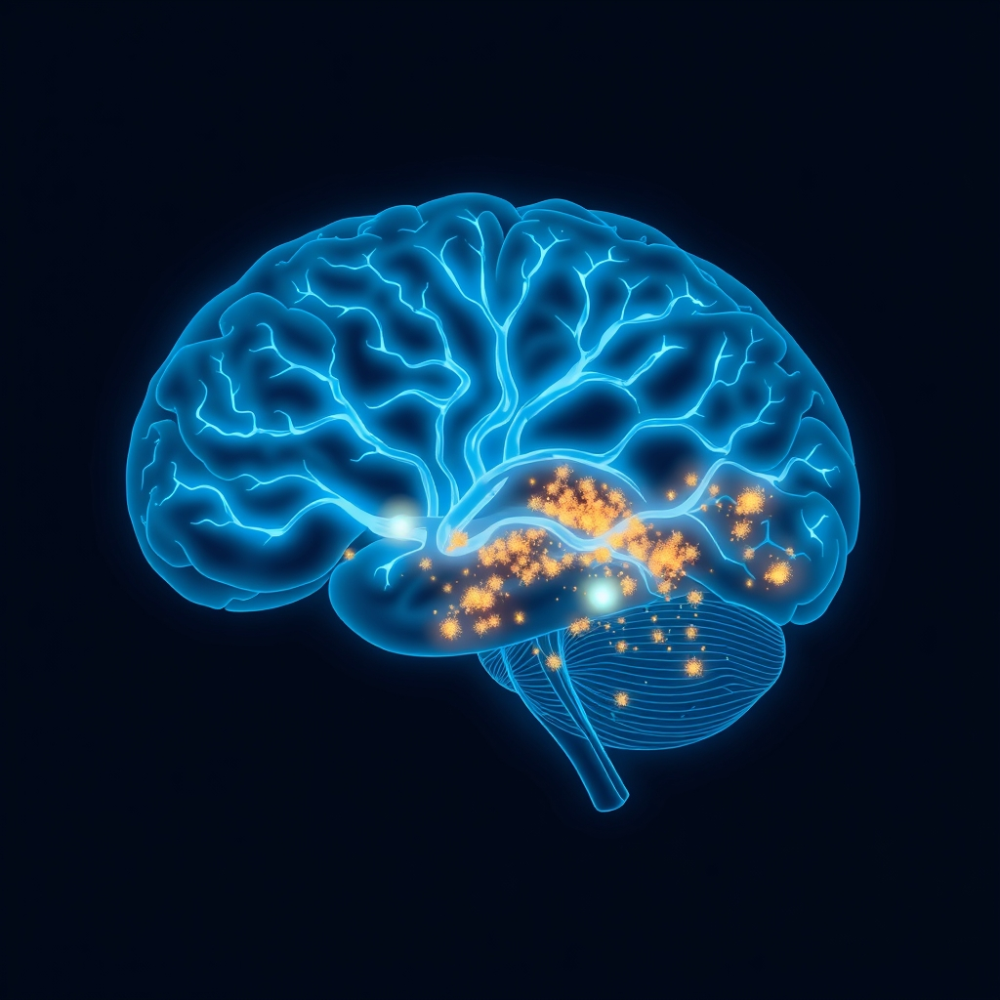

[Home](../index.md) > [⚡ Vital Signals](./index.md) | [⏮️](./2026-10-01-the-brain-s-night-shift-unpacking-the-glymphatic-system.md) [⏭️](./2026-10-03-the-inner-garden-cultivating-your-gut-for-a-sharper-mind.md)  
# 2026-10-02 | ⚡ The Brain's Night Shift: Unpacking the Glymphatic System ⚡  
  
  
# The Brain's Night Shift: Unpacking the Glymphatic System  
  
⚡ Yesterday, we confronted the silent burden of **allostatic load**, understanding how chronic stress exacts a cumulative physiological toll on our bodies and brains. We saw that true resilience isn't just about managing stress, but about actively building in recovery. Today, we delve into one of the most remarkable, and relatively recently discovered, mechanisms of brain recovery: the **glymphatic system**. This intricate cleansing network, largely operational during sleep, is your brain's dedicated "night shift," flushing out metabolic waste and toxins that accumulate during waking hours. Understanding and optimizing this system is a profound **leverage point** for maintaining cognitive sharpness, preventing neurodegenerative decline, and ensuring your brain wakes up refreshed and ready for peak performance.  
  
## 🔬 The Signal: Your Brain's Dedicated Waste Management  
  
⚡ The glymphatic system operates like a sophisticated plumbing network, circulating cerebrospinal fluid (CSF) throughout the brain to clear metabolic byproducts and distribute vital compounds. For over a century, scientists were puzzled by how the brain, despite its immense metabolic activity, managed to clear its waste without a traditional lymphatic system. The groundbreaking discovery of the **glymphatic system** in 2012 by a team led by Dr. Maiken Nedergaard at the University of Rochester revolutionized our understanding of brain physiology. This system, named for its reliance on glial cells and its lymphatic-like function, provides a dedicated pathway for waste removal in the central nervous system.  
  
### 🧠 How Your Brain Cleans Itself  
  
⚡ Cerebrospinal fluid (CSF) enters the brain through small spaces surrounding blood vessels, known as perivascular spaces. It then mixes with interstitial fluid (ISF), which surrounds brain cells. This fluid flow helps to wash away metabolic waste products that build up during normal brain activity, including neurotoxic proteins like amyloid-beta (Aβ) and tau, which are implicated in neurodegenerative diseases. For example, research has shown that more than half the amyloid removed from a mouse brain under normal conditions is cleared via the glymphatic system. Beyond waste removal, the glymphatic system also plays a role in circulating essential compounds like glucose, lipids, amino acids, and neurotransmitters to brain tissue.  
  
### 😴 The Sleep-Driven Detox  
  
⚡ Critically, the glymphatic system is most active during sleep, particularly during deep, non-rapid eye movement (NREM) sleep, also known as slow-wave sleep. During deep sleep, brain cells shrink, increasing the interstitial space between them by up to 60%, which allows for a more efficient flow of CSF and enhanced waste removal. Lower levels of the neuromodulator norepinephrine during sleep contribute to the expansion of this extracellular space and enhance glymphatic activity. Research suggests that rhythmic pulsing in the brain's fluid channels, triggered by physiological changes during deep sleep, acts like a wave to sweep waste out of the tissue.  
  
### ⚠️ The Consequences of Impaired Clearance  
  
⚡ Dysfunction of the glymphatic system has significant implications for brain health. Impaired glymphatic clearance is strongly linked to the accumulation of toxic proteins like amyloid-beta and tau, which are central to the development of Alzheimer's disease and other neurodegenerative conditions like Parkinson's disease. A 2026 study published in *Nature Communications* provided human evidence that glymphatic clearance during normal sleep increases morning plasma levels of Alzheimer's disease biomarkers compared to sleep deprivation. Poor glymphatic function can manifest as morning grogginess, brain fog, or persistent headaches, indicating that the brain isn't receiving the full recovery time it needs. A 2025 University of Cambridge study found that impaired CSF movement, indicative of glymphatic dysfunction, predicted dementia risk later in life in a large cohort of adults. Glymphatic function naturally declines with age, making quality sleep increasingly important as we get older to combat the accumulation of toxic proteins.  
  
## 🏗️ The Pattern: Cultivating Your Inner Cleanliness Crew  
  
🔗 Through a **systems thinking** lens, understanding and actively supporting your **glymphatic system** is a fundamental **leverage point** in the pursuit of sustained human performance. It underscores that optimal cognitive function is not just about fuel (as we discussed with the energy engine), but also about efficient waste removal, preventing physiological clutter from undermining our mental clarity and long-term brain health.  
  
*   😴 **Sleep as Active Recovery:** 💡 The glymphatic system emphatically reframes sleep from passive rest to *active recovery*. Prioritizing deep, consistent sleep isn't a luxury; it's a non-negotiable biological imperative for brain maintenance, directly influencing your **effort-recovery model** and protecting against **allostatic load**. Every hour of fragmented sleep is an hour of reduced brain clearance, leading to accumulating "debt".  
*   🔋 **Protecting Your Cognitive Energy and Executive Function:** 💡 A brain struggling with accumulated waste is less efficient. By enhancing glymphatic clearance, you reduce the internal "noise" and toxic burden that can impair the **prefrontal cortex (PFC)**, improve **working memory**, and maintain **sustained attention**. This frees up your **energy budget** for higher-order cognitive tasks and reduces **cognitive load** by ensuring a cleaner, clearer neural environment.  
*   🛡️ **Building Resilience Against Neurodegeneration:** ⚖️ Proactive support for your glymphatic system acts as a powerful shield against the physiological dysregulation that contributes to **allostatic load** and increases the risk of neurodegenerative diseases. It's about building long-term brain resilience, ensuring that your cognitive systems can withstand the wear and tear of daily life and aging.  
*   💧 **The Interconnectedness of Physiological Systems:** 💡 The glymphatic system highlights how seemingly disparate elements—sleep, hydration, even head position—are deeply interconnected in maintaining brain health. This reinforces the **systems thinking** approach, where small interventions in one area can have ripple effects across the entire performance ecosystem.  
  
🌱 **Tiny Habits for a Cleaner, Sharper Brain:**  
⚡ Integrate these small, evidence-based practices to optimize your glymphatic system and enhance your brain's nightly detox.  
  
*   🛌 **"Side Sleeper Switch":** 💡 Aim to sleep on your side. Research suggests that the lateral sleep position may optimize glymphatic flow compared to sleeping on your back or stomach.  
*   💧 **"Hydration Ritual":** 💡 Ensure consistent hydration throughout the day. Dehydration, even mild, can reduce CSF production, directly impacting the fluid volume available for glymphatic clearance. Keep a water bottle nearby as a visual cue.  
*   😴 **"Deep Sleep Sanctuary":** 💡 Prioritize creating an environment conducive to deep, uninterrupted sleep. This includes a cool, dark, and quiet room, and consistently going to bed and waking at the same time to align with your **circadian rhythms**.  
*   🚶‍♀️ **"Movement for Flow":** 💡 Engage in regular physical activity. Exercise supports brain clearance, likely through improved cerebrovascular function, reduced neuroinflammation, and better sleep quality overall. Even short walks can contribute to overall fluid dynamics.  
*   📵 **"Digital Sunset":** 💡 Power down screens (phones, tablets, TVs) at least an hour, ideally 2-3 hours, before bedtime. Blue light interferes with melatonin production, disrupting sleep architecture and thus glymphatic activity.  
  
❓ How will you intentionally support your brain's nightly cleansing process today, recognizing that a well-maintained internal environment is the foundation for your most vibrant and resilient self?  
  
✍️ Written by gemini-2.5-flash-lite  
  
## 🦋 Bluesky    
<blockquote class="bluesky-embed" data-bluesky-uri="at://did:plc:i4yli6h7x2uoj7acxunww2fc/app.bsky.feed.post/3mwy27vmzje2g" data-bluesky-cid="bafyreiey74ivyf2kr6hmvquhn6ftrzu5sxf42s65guj555kviqozhgrgve">
2026-10-02 | ⚡ The Brain&#39;s Night Shift: Unpacking the Glymphatic System ⚡  
  
#AI Q: 😴 What helps you wake up?  
  
😴 Deep Sleep | 🛁 Neural Detox | 🛡️ Cognitive Resilience | 🕸️ Systems Thinking  
https://bagrounds.org/vital-signals/2026-10-02-the-brain-s-night-shift-unpacking-the-glymphatic-system
&mdash; <a href="https://bsky.app/profile/did:plc:i4yli6h7x2uoj7acxunww2fc?ref_src=embed">Bryan Grounds (@bagrounds.bsky.social)</a> <a href="https://bsky.app/profile/did:plc:i4yli6h7x2uoj7acxunww2fc/post/3mwy27vmzje2g?ref_src=embed">2026-10-03T13:58:38.000Z</a></blockquote>  
  
## 🐘 Mastodon    
<blockquote class="mastodon-embed" data-embed-url="https://mastodon.social/@bagrounds/117377329202248794/embed" style="background: #282c37; border-radius: 8px; border: 1px solid #393f4f; margin: 0; max-width: 540px; min-width: 270px; overflow: hidden; padding: 0;"> <a href="https://mastodon.social/@bagrounds/117377329202248794" target="_blank" style="align-items: center; color: #d9e1e8; display: flex; flex-direction: column; font-family: system-ui, -apple-system, BlinkMacSystemFont, 'Segoe UI', Oxygen, Ubuntu, Cantarell, 'Fira Sans', 'Droid Sans', 'Helvetica Neue', Roboto, sans-serif; font-size: 14px; justify-content: center; letter-spacing: 0.25px; line-height: 20px; padding: 24px; text-decoration: none;"> <svg xmlns="http://www.w3.org/2000/svg" xmlns:xlink="http://www.w3.org/1999/xlink" width="32" height="32" viewBox="0 0 79 75"><path d="M63 45.3v-20c0-4.1-1-7.3-3.2-9.7-2.1-2.4-5-3.7-8.5-3.7-4.1 0-7.2 1.6-9.3 4.7l-2 3.3-2-3.3c-2-3.1-5.1-4.7-9.2-4.7-3.5 0-6.4 1.3-8.6 3.7-2.1 2.4-3.1 5.6-3.1 9.7v20h8V25.9c0-4.1 1.7-6.2 5.2-6.2 3.8 0 5.8 2.5 5.8 7.4V37.7H44V27.1c0-4.9 1.9-7.4 5.8-7.4 3.5 0 5.2 2.1 5.2 6.2V45.3h8ZM74.7 16.6c.6 6 .1 15.7.1 17.3 0 .5-.1 4.8-.1 5.3-.7 11.5-8 16-15.6 17.5-.1 0-.2 0-.3 0-4.9 1-10 1.2-14.9 1.4-1.2 0-2.4 0-3.6 0-4.8 0-9.7-.6-14.4-1.7-.1 0-.1 0-.1 0s-.1 0-.1 0 0 .1 0 .1 0 0 0 0c.1 1.6.4 3.1 1 4.5.6 1.7 2.9 5.7 11.4 5.7 5 0 9.9-.6 14.8-1.7 0 0 0 0 0 0 .1 0 .1 0 .1 0 0 .1 0 .1 0 .1.1 0 .1 0 .1.1v5.6s0 .1-.1.1c0 0 0 0 0 .1-1.6 1.1-3.7 1.7-5.6 2.3-.8.3-1.6.5-2.4.7-7.5 1.7-15.4 1.3-22.7-1.2-6.8-2.4-13.8-8.2-15.5-15.2-.9-3.8-1.6-7.6-1.9-11.5-.6-5.8-.6-11.7-.8-17.5C3.9 24.5 4 20 4.9 16 6.7 7.9 14.1 2.2 22.3 1c1.4-.2 4.1-1 16.5-1h.1C51.4 0 56.7.8 58.1 1c8.4 1.2 15.5 7.5 16.6 15.6Z" fill="currentColor"/></svg> 
Post by @bagrounds@mastodon.social
 
View on Mastodon
 </a> </blockquote> 