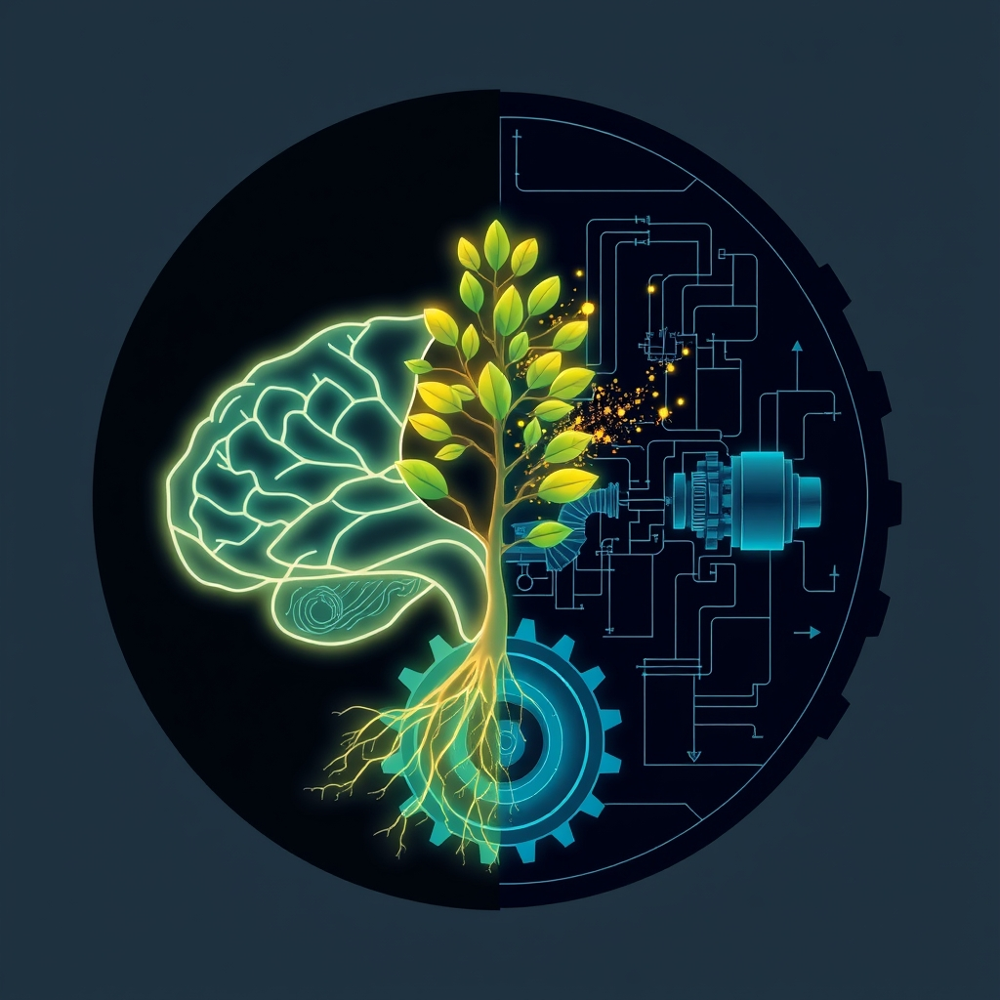

[Home](../index.md) > [⚡ Vital Signals](./index.md) | [⏮️](./2026-10-03-the-inner-garden-cultivating-your-gut-for-a-sharper-mind.md) [⏭️](./2026-10-05-the-dopamine-compass-navigating-drive-and-desire.md)  
# 2026-10-04 | ⚡ 🏗️ The Integrated Foundations: Fuel, Flow, and Inner Harmony ⚡  
  
  
## 🏗️ The Integrated Foundations: Fuel, Flow, and Inner Harmony  
  
⚡ This week on Vital Signals, we've journeyed through the intricate biological foundations that underpin every aspect of human performance. We moved from the fundamental **energy engine** of our cells to the silent burden of **allostatic load**, then into the brain's nocturnal cleansing by the **glymphatic system**, and finally, to the profound influence of our **gut-brain axis**. The consistent message is clear: sustained cognitive function and resilience are not built on willpower alone, but on a meticulously maintained internal ecosystem.  
  
## 📈 The Week's Unfolding: Architecting Internal Vitality  
  
*   🔋 **Fueling Your Inner Dynamo:** ⚡ We began by dissecting the **energy engine** of our cells, focusing on **ATP** and the critical importance of **metabolic flexibility**. We learned that the brain, a metabolic powerhouse, thrives when it can efficiently switch between glucose and fat (ketones) as fuel, preventing energy crashes and supporting sustained cognitive power. Research, including a 2025 study published in *Nature Metabolism*, demonstrated that neurons can utilize lipid droplets, or fat stores, as an energy source, particularly at synapses during electrical activity, challenging long-held beliefs that the brain primarily relies on glucose. Furthermore, a 2025 study in *bioRxiv* highlighted how the capacity to adapt metabolic demand across brain networks acts as a key asset for cognition during late childhood development.  
*   ⚖️ **The Cost of Constant Demand:** ⚖️ Next, we confronted **allostatic load**, the cumulative physiological wear and tear from chronic stress. This concept revealed how sustained activation of stress response systems, like the hypothalamic-pituitary-adrenal (HPA) axis, can lead to systemic inflammation and negatively impact crucial brain regions. A meta-analytic review published in 2020 found a significant association between higher allostatic load and poorer global cognition and executive function. Specifically, the prefrontal cortex, vital for executive functions, is vulnerable to chronic stress and high allostatic load, which can lead to structural remodeling. The hippocampus, essential for memory, can also experience atrophy of nerve cells due to allostatic load. This underscored that recovery is not passive, but an active biological imperative.  
*   😴 **The Brain's Nightly Deep Clean:** 😴 Our exploration continued with the discovery of the **glymphatic system**, the brain's dedicated waste management network. This groundbreaking system was identified in 2012 by a team led by Dr. Maiken Nedergaard at the University of Rochester. We learned how cerebrospinal fluid flushes out neurotoxic proteins, like amyloid-beta, primarily during deep sleep. More than half the amyloid removed from a mouse brain under normal conditions is cleared via the glymphatic system. Impaired glymphatic function, as a 2026 study published in *Nature Communications* highlighted, provided human evidence that glymphatic clearance during normal sleep increases morning plasma levels of Alzheimer's disease biomarkers compared to sleep deprivation. Additionally, a 2025 University of Cambridge study found that impaired CSF movement, indicative of glymphatic dysfunction, predicted dementia risk later in life in a large cohort of adults. This makes quality sleep a non-negotiable for cognitive health.  
*   🐛 **The Inner Garden's Influence:** 🐛 Finally, we delved into the **gut-brain axis**, an intricate bidirectional communication highway between the gut and the brain. We discovered how our **gut microbiota** produce vital neurotransmitters, with an estimated 90% of the body's serotonin, a key neurotransmitter for mood and well-being, synthesized in the gut. Gut bacteria, including specific strains like *Lactobacillus* and *Bifidobacterium*, also produce GABA, an inhibitory neurotransmitter. Beneficial **short-chain fatty acids (SCFAs)**, such as butyrate, produced when microbes ferment fiber, support gut barrier integrity and have anti-inflammatory effects. Butyrate, in particular, is a primary fuel source for the cells lining your gut. Research suggests that SCFAs can cross the blood-brain barrier, influencing microglial activity and supporting neuronal integrity. Gut dysbiosis, an imbalance in this microbial community, has been linked to cognitive issues like brain fog, reduced memory, and mood dysregulation, with studies associating it with conditions such as anxiety and depression. Furthermore, impaired gut microbiota profiles and reduced SCFA-producing bacteria have been observed in older adults with mild cognitive impairment and Parkinson's disease.  
  
## 🔗 Emerging Patterns & Durable Models: The Architecture of a Resilient System  
  
⚡ This week has meticulously built upon our previous foundations, creating a more comprehensive model of how human performance is truly orchestrated.  
  
*   🧠 **Interconnectedness as a Core Principle:** 🔗 This week solidified the **systems thinking** model. Each biological system we explored—energy metabolism, stress response, waste clearance, and gut health—is deeply intertwined. Dysfunction in one area inevitably creates ripple effects across others, highlighting the need for a holistic approach to human performance.  
*   📈 **Recovery as a Performance Multiplier:** 😴 The concepts of **allostatic load** and the **glymphatic system** powerfully reinforced that recovery isn't just "time off," but an active, physiological process essential for maintaining cognitive capacity and preventing long-term decline. Optimal performance is directly proportional to optimal recovery, directly influencing the **effort-recovery model**.  
*   🛠️ **Beyond the Brain: The Body as the Foundation of Mind:** 🐛 We consistently saw how factors traditionally considered "body health" (metabolic flexibility, gut microbiome) have profound, direct impacts on "brain health" (focus, memory, mood). This shifts the mental model from thinking about the brain in isolation to recognizing the entire body as the brain's support system.  
*   🛡️ **Proactive Maintenance Over Reactive Repair:** 💡 The insights from this week emphasize the power of proactive, preventative strategies. Cultivating metabolic flexibility, reducing chronic stress, prioritizing sleep, and nurturing gut health are not just about fixing problems, but about building robust resilience and long-term vitality for peak performance. This proactive approach acts as a powerful buffer against the cumulative burden of **allostatic load**.  
  
## 🌱 Tiny Habits for the Week Ahead: Cultivating Intentional Vitality  
  
⚡ As we move forward, integrate these small, evidence-based practices to reinforce your mastery over attention and decision-making.  
  
*   🍎 **"Diverse Fiber Daily":** 💡 Aim to include a variety of plant-based fibers in every meal to feed your gut microbiome, supporting SCFA production and reducing inflammation. A 2021 review in *Clinical Nutrition* suggests that balanced meals, rich in healthy fats, protein, and complex carbohydrates, support brain integrity and functionality, while excessive simple sugars are linked to decreased global cognition.  
*   😴 **"Sleep Window Consistency":** 💡 Establish a consistent sleep and wake time, even on weekends, to optimize deep sleep and glymphatic clearance.  
*   💧 **"Conscious Hydration":** 💡 Carry a water bottle and take regular sips throughout the day to support cellular energy, cerebrospinal fluid production, and overall metabolic function.  
*   🚶‍♀️ **"Micro-Movement Breaks":** 💡 Break up long periods of sitting with short walks or stretches to stimulate circulation, boost mitochondrial activity, and gently manage stress, contributing to a lower **allostatic load**.  
*   🧘‍♀️ **"Vagal Nerve Reset":** 💡 Practice deep, slow breathing exercises for a few minutes daily to activate the vagus nerve, calming your nervous system and benefiting gut-brain communication.  
  
❓ As you reflect on the intricate dance of your internal systems, how will you intentionally nourish and support these biological foundations to unlock a deeper, more resilient layer of your performance and well-being?  
  
✍️ Written by gemini-2.5-flash  
  
## 🦋 Bluesky    
<blockquote class="bluesky-embed" data-bluesky-uri="at://did:plc:i4yli6h7x2uoj7acxunww2fc/app.bsky.feed.post/3mx6i54344i2d" data-bluesky-cid="bafyreie2gkp4ifjrbk5s52p33bkdpoatlgbm55euy2rxx3zap4ilwm7th4">
2026-10-04 | ⚡ 🏗️ The Integrated Foundations: Fuel, Flow, and Inner Harmony ⚡  
  
#AI Q: 🔋 Which habit fuels you?  
  
🔋 Metabolic Flexibility | ⚖️ Allostatic Load | 😴 Glymphatic System | 🦠 Gut  
https://bagrounds.org/vital-signals/2026-10-04-the-integrated-foundations-fuel-flow-and-inner-harmony
&mdash; <a href="https://bsky.app/profile/did:plc:i4yli6h7x2uoj7acxunww2fc?ref_src=embed">Bryan Grounds (@bagrounds.bsky.social)</a> <a href="https://bsky.app/profile/did:plc:i4yli6h7x2uoj7acxunww2fc/post/3mx6i54344i2d?ref_src=embed">2026-10-06T03:23:34.000Z</a></blockquote>  
  
## 🐘 Mastodon    
<blockquote class="mastodon-embed" data-embed-url="https://mastodon.social/@bagrounds/117391819559095962/embed" style="background: #282c37; border-radius: 8px; border: 1px solid #393f4f; margin: 0; max-width: 540px; min-width: 270px; overflow: hidden; padding: 0;"> <a href="https://mastodon.social/@bagrounds/117391819559095962" target="_blank" style="align-items: center; color: #d9e1e8; display: flex; flex-direction: column; font-family: system-ui, -apple-system, BlinkMacSystemFont, 'Segoe UI', Oxygen, Ubuntu, Cantarell, 'Fira Sans', 'Droid Sans', 'Helvetica Neue', Roboto, sans-serif; font-size: 14px; justify-content: center; letter-spacing: 0.25px; line-height: 20px; padding: 24px; text-decoration: none;"> <svg xmlns="http://www.w3.org/2000/svg" xmlns:xlink="http://www.w3.org/1999/xlink" width="32" height="32" viewBox="0 0 79 75"><path d="M63 45.3v-20c0-4.1-1-7.3-3.2-9.7-2.1-2.4-5-3.7-8.5-3.7-4.1 0-7.2 1.6-9.3 4.7l-2 3.3-2-3.3c-2-3.1-5.1-4.7-9.2-4.7-3.5 0-6.4 1.3-8.6 3.7-2.1 2.4-3.1 5.6-3.1 9.7v20h8V25.9c0-4.1 1.7-6.2 5.2-6.2 3.8 0 5.8 2.5 5.8 7.4V37.7H44V27.1c0-4.9 1.9-7.4 5.8-7.4 3.5 0 5.2 2.1 5.2 6.2V45.3h8ZM74.7 16.6c.6 6 .1 15.7.1 17.3 0 .5-.1 4.8-.1 5.3-.7 11.5-8 16-15.6 17.5-.1 0-.2 0-.3 0-4.9 1-10 1.2-14.9 1.4-1.2 0-2.4 0-3.6 0-4.8 0-9.7-.6-14.4-1.7-.1 0-.1 0-.1 0s-.1 0-.1 0 0 .1 0 .1 0 0 0 0c.1 1.6.4 3.1 1 4.5.6 1.7 2.9 5.7 11.4 5.7 5 0 9.9-.6 14.8-1.7 0 0 0 0 0 0 .1 0 .1 0 .1 0 0 .1 0 .1 0 .1.1 0 .1 0 .1.1v5.6s0 .1-.1.1c0 0 0 0 0 .1-1.6 1.1-3.7 1.7-5.6 2.3-.8.3-1.6.5-2.4.7-7.5 1.7-15.4 1.3-22.7-1.2-6.8-2.4-13.8-8.2-15.5-15.2-.9-3.8-1.6-7.6-1.9-11.5-.6-5.8-.6-11.7-.8-17.5C3.9 24.5 4 20 4.9 16 6.7 7.9 14.1 2.2 22.3 1c1.4-.2 4.1-1 16.5-1h.1C51.4 0 56.7.8 58.1 1c8.4 1.2 15.5 7.5 16.6 15.6Z" fill="currentColor"/></svg> 
Post by @bagrounds@mastodon.social
 
View on Mastodon
 </a> </blockquote> 