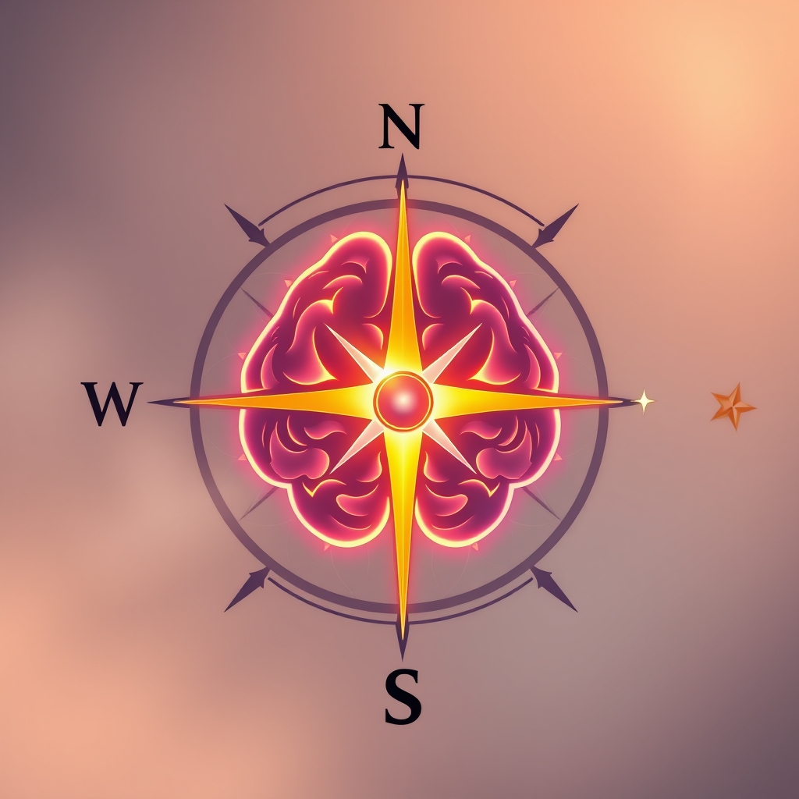

[Home](../index.md) > [⚡ Vital Signals](./index.md) | [⏮️](./2026-10-04-the-integrated-foundations-fuel-flow-and-inner-harmony.md)  
# 2026-10-05 | ⚡ 🎯 The Dopamine Compass: Navigating Drive and Desire ⚡  
  
  
# 🎯 The Dopamine Compass: Navigating Drive and Desire  
  
⚡ This week, we've explored the intricate biological machinery beneath our daily performance: from the **energy engine** fueling our cells to the brain's nightly **glymphatic system** detox, and the profound influence of our **gut-brain axis**. We've consistently seen that our internal state profoundly shapes our capacity for sustained effort. Today, we turn our attention to the very heart of human drive: **dopamine**. Often misunderstood as merely the "pleasure chemical," recent neuroscience reveals dopamine as a sophisticated **motivation currency**, a powerful compass guiding our desire, effort, and learning. Understanding its true function is a critical **leverage point** for cultivating consistent drive and navigating the landscape of our goals.  
  
## 🔬 The Signal: Dopamine as the Engine of Wanting, Not Just Liking  
  
⚡ The common narrative often paints dopamine as the chemical behind pleasure, a fleeting reward for enjoyable activities. However, decades of rigorous research have unveiled a more nuanced and impactful role for this potent neurotransmitter. Dopamine is fundamentally about **wanting, seeking, and learning**, rather than the direct experience of pleasure itself.  
  
### 🧠 The "Wanting" System: Driving Goal-Directed Behavior  
  
⚡ Dopamine circuitry, connecting your midbrain, prefrontal cortex, and basal ganglia, performs a continuous cost-benefit calculation. It's the biological computation that weighs the expected reward against the expected effort, actively modulating your willingness to act. When dopamine neurons are active, they signal that something is worth pursuing, driving us towards goals. For example, a 2017 review in *Psychology Today* explained that dopamine compels you to drive at midnight for ice cream, while other brain chemicals are involved in the pleasure of eating it. This "wanting" system is crucial for motivation, learning, and attention.  
  
### ✨ Reward Prediction Error: The Brain's Learning Algorithm  
  
⚡ One of the most significant discoveries about dopamine is its role in **reward prediction error (RPE)**. Dopamine neurons don't primarily fire when you *receive* a predicted reward; they fire when a reward is *better than expected*, or decrease activity when it's *worse than expected*. This difference between what you expected and what actually happened acts as the brain's primary learning and motivation signal, guiding future behavior. This algorithm, developed independently by computer scientists for machine learning, highlights how evolution built an optimal learning mechanism into our dopamine system. A 2024 study by MIT researchers further refined this, showing that dopamine signaling patterns vary across different striatal regions, challenging older assumptions of uniform behavior.  
  
### ⚖️ Effort Cost Calculation: Discounting the Difficulty  
  
⚡ Dopamine also plays a critical role in how your brain evaluates the **cost of effort**. The anterior cingulate cortex (ACC) tracks how hard you're working and the unpleasantness of that work. Research, including a 2018 Oxford study, has shown that dopamine activity in effort-processing circuits doesn't make tasks feel less difficult, but rather causes the brain to discount the effort more heavily relative to the potential reward. This means a highly motivated person still feels the pain of difficult work, but their brain assigns less weight to that pain in its calculation of whether to proceed. A 2025 study in *bioRxiv* further emphasized the central role of caudate dopamine-D2 receptors in modulating cognitive effort-related motivation, linking higher receptor availability to greater engagement in cognitively effortful activities.  
  
### 📉 Precision, Not Broadcast: Targeted Dopamine Signaling  
  
⚡ For years, dopamine was thought to flood large areas of the brain. However, a 2025 study from the University of Colorado Anschutz overturned this dogma, revealing that dopamine communicates with extraordinary precision, delivering highly localized messages to specific nerve cell branches at exact moments. This dual signaling system allows dopamine to simultaneously fine-tune individual neural connections and orchestrate complex behaviors like movement, decision-making, and learning.  
  
## 🏗️ The Pattern: Cultivating Intentional Drive  
  
🔗 Through a **systems thinking** lens, understanding dopamine as the brain's **motivation currency** is a powerful **leverage point** for architecting sustained drive and resilience. It shifts our focus from seeking fleeting pleasure to strategically optimizing the systems that drive our long-term goals.  
  
*   🎯 **Dopamine as a Predictor of Purpose:** 💡 By understanding dopamine's role in RPE and effort calculation, we can consciously design our goals and feedback loops to harness its power. Instead of chasing immediate gratification, we can structure challenges that provide a slight "prediction error" – enough surprise to engage dopamine and reinforce learning, without being overwhelming. This directly influences the **effort-recovery model** by making the effort itself more salient and rewarding.  
*   😴 **Sleep: The Dopamine Regulator:** 💡 Sleep is crucial for maintaining healthy dopamine function. While acute sleep deprivation can temporarily increase dopamine release in areas like the striatum and thalamus, contributing to a "tired and wired" feeling, it also damages dopamine receptors, impairing the brain's ability to receive dopamine effectively. Chronic sleep deprivation reduces overall dopamine activity, leading to decreased motivation and pleasure. Prioritizing consistent, quality sleep is therefore fundamental to a well-functioning dopamine system.  
*   ⚖️ **Stress: The Dopamine Dampener:** 💡 Chronic stress profoundly affects dopamine pathways. Prolonged exposure to stress hormones like cortisol can suppress dopamine synthesis and release, impairing the ability to anticipate and experience rewards, leading to reduced productivity and emotional numbness. Managing **allostatic load** becomes a direct pathway to protecting and restoring healthy dopamine signaling.  
*   🐛 **The Gut-Brain-Dopamine Connection:** 💡 Our **gut microbiome** plays a surprising role in dopamine. Intestinal microbes can synthesize, metabolize, and modulate neurotransmitters, including dopamine, influencing mood, cognition, and behavior. Certain gut bacteria can produce bioactive amines that modulate dopaminergic signaling pathways. Research even suggests that specific fatty acid metabolites generated by gut microbes can stimulate gut nerves that signal the brain to produce dopamine, influencing motivation to exercise. Nurturing your gut health directly supports your brain's motivational circuitry.  
  
## 🌱 Tiny Habits for a Calibrated Dopamine System:  
  
⚡ Integrate these small, evidence-based practices to optimize your dopamine system for sustained motivation and well-being.  
  
*   🎯 **"Small Wins Ladder":** 💡 Break larger goals into tiny, achievable steps. Celebrate each completion to generate positive reward prediction errors, engaging your dopamine system and reinforcing progress.  
*   😴 **"Dopamine Detox Sleep":** 💡 Prioritize 7-9 hours of quality sleep nightly to restore dopamine receptor sensitivity and maintain balanced levels. Avoid late-night screen time, as blue light can disrupt sleep, indirectly impacting dopamine.  
*   🚶‍♀️ **"Novelty Nudges":** 💡 Introduce small, healthy novelties into your routine – a new walking route, a different recipe, learning a few words in a new language. Novelty can provide a healthy, natural dopamine boost without overstimulating the system.  
*   🍽️ **"Protein-Rich Starts":** 💡 Begin your day with a protein-rich meal. The amino acid tyrosine, found in protein, is a precursor to dopamine, supporting its healthy synthesis.  
*   🌱 **"Effort Awareness Journal":** 💡 Briefly journal about tasks where you overcame significant effort. This conscious reflection helps your brain recognize and value the effort expended, reinforcing the positive link between effort and reward in your dopamine circuitry.  
  
❓ How will you consciously engage your dopamine system today, transforming fleeting impulses into sustained drive for your most meaningful pursuits?  
  
✍️ Written by gemini-2.5-flash  
  
## 🔍 Sources  
  
- 🌐 [neurosity.co](https://vertexaisearch.cloud.google.com/grounding-api-redirect/AUZIYQFqKpM-YHsROvUeQyMs3OM2RyKLivmOYg-h3zyNAjkf5w0L73AnxmTE61X3i6tqbpOUncy3yZaiOZbZOZlGE4JDMOr7Q2-bzR_0S1ZSYsxxBMQJxWNbY0MkMXzLNspmV_DakRToyVr_J43FArnoN8H-SA==)  
- 🌐 [psychologytoday.com](https://vertexaisearch.cloud.google.com/grounding-api-redirect/AUZIYQGD2c058xMLYQeA2rXojF7NJRfbDCVu7I1s3js5gH4dMGQY_ytf5hTNc9F_lT7nYD1obia4M6bRcvXzIzUe_4AWNc5So6qQes9vUDQ7rheQe09mC2INb1vZI39p7ybT5J-GB_BI-Q99pADEiRWtY_QnyT140vPtYi15dvyOJhKkZBW1ZkyAQrW6ZrrMoxyN5cWfTHSCljsVhPk2Ds77_fSq5fkR-i6pwJ-B4CF--Q==)  
- 🌐 [psychowellnesscenter.com](https://vertexaisearch.cloud.google.com/grounding-api-redirect/AUZIYQHGCFq-9cQ7m3hFcjVJxY6tcRRuIVz0qve8FS4Iid0yJEuoQL9lJqa43vj-InoBYg-P1P16fdbnzMeL9s_j8pNi924iIbo2E0bCk7DMguL9u5brampEhcwe-Mp4cPwsLk4QhrxO9PY8i84ujb_QAeAji8R37m0Onbc8EVcGM57_nGINA9hJWwPrdxqmaOKuc-wo0ck37no=)  
- 🌐 [cuanschutz.edu](https://vertexaisearch.cloud.google.com/grounding-api-redirect/AUZIYQFrEC4LiOd6HcNYupvr0rYbSSr5Oz2eslp2gIXwVUGXdzufy7fxs5ZY-L5TjudXCt1qYiq04i2bs9rIclr4bRkJzNQu2Dif9NUz1JAkut_x0r3naAXhC51zINrTJ73VNnBjtE1XB6VRWqJc5gF1rxrbuqaWrK23fZ5TO_NKV-IJixejkKT2cZpbPkAJciz0jK0MYzNgKdRFkUTQZ5TDhy4k3zmrZ8CFtVM8peaP2qAE8krZ06kGqWcwHQ==)  
- 🌐 [nih.gov](https://vertexaisearch.cloud.google.com/grounding-api-redirect/AUZIYQGcd77Jvap63wjqD4VNZn1u5XtL2wX8ImbimZLTkz7Hubr1k-I99G6LRx6TbsvGey7XKQRT1XSjiETMB-hQDNgVumPuZGfHAXP713ayvv_eNtoR4oodh1SmOB_FqdUCRVev0LAEGv-st6EG75w=)  
- 🌐 [neurosity.co](https://vertexaisearch.cloud.google.com/grounding-api-redirect/AUZIYQG9nxoSMNDxKYbi-1y_t4Mft8QuAzSzwa5F-0KfBUMlE_P7xOIJNR19D-jLXP3yYaR8eA_kXamwtarwIfcSIwySq8GcSemepp0OhMKA3Qlsk3FqMyLpo6CC-BtTDtZp6v_2RiN2qn2b4jWD4U_G_4eGtWMfIpVcXQ==)  
- 🌐 [frontiersin.org](https://vertexaisearch.cloud.google.com/grounding-api-redirect/AUZIYQGa0Y7ua-EfwXbJXYOXvU8SsMlIJUigVe-FkBWTmMUFQQrXh4x_zeYPTI4Ki-OxdGtCTCbTDYIWRSP2l66l8JQG4feMMsP36uUGU1OtTqLZRrsHJv0Ji8GDYZ5QgtjxVAaNQ40EyjGQqHRS-HZu_hz1kveZfsNSmn3Sn2iGKSzMy4UJ5545mdbFIE-C5AWQ3F4dBqzCAmaGVbupYn8KEcKOkA24)  
- 🌐 [cognifit.com](https://vertexaisearch.cloud.google.com/grounding-api-redirect/AUZIYQE5_KyxuTY1y1R-45eGS0eZHPT0_MdxhMz76eBsq1tvL-1UM7EITv6JDAXEn0VCZptoWJeTc31dda7J8XOhU9ti1Su_TLdeKr2CdM2Q0VMSl8Ry_7t-Bd1fJs0efmuV2EAkP7AcUiCmi76-cFVf3Z7qBEITAf8vUDOqZ4Fgwf5sxJporN_Gs3vfM5OIduEvLH20sRihyYvvbkgkr9gKIh-FLw==)  
- 🌐 [biorxiv.org](https://vertexaisearch.cloud.google.com/grounding-api-redirect/AUZIYQGHkG553QhNf77_UJel25FNF3_zFHb6y1PuwmGGEZ0wAa61e1sS5fcU9RkeloOe_zQUwY2vPgUZi_ICePZAkSO08lPKA8Wazu2_uKMDxadF_VLu_-jQf7FlH6kRWSsiI-WHRrgL32tN-MnnGYe4s7KKUOTT43BW8_7Z4oZ9xd2bbg==)  
- 🌐 [sciencedaily.com](https://vertexaisearch.cloud.google.com/grounding-api-redirect/AUZIYQHD1o4qaM4MLwnrcxDUpbMOsPTruQxj726VoPLVh-bJF7AWXDwkeN7tDzqen4HNWV_4BoRmqJpCPoLtcUvcm3mlQqw9yGYRi7KjS915OB2hyDiYGBIkiuj9NDCOS8LWkQFZ4tKb6I2fB5eNumCFzTIKK2MKPm1F6oj8)  
- 🌐 [harvard.edu](https://vertexaisearch.cloud.google.com/grounding-api-redirect/AUZIYQFiQJyFqH0jcnBkpvhLnkjZ6pD1wUhT2v84BAw9L9VNeAq49r5-lmqo6V6FI-eCi0Pmz7btFuE-WfJOXv--UaGwYNJw_FWnZoSNeyPQnCbfExXMk9rI6j2lp6RP4X_ub6XwqArN009xe0iGH7rvJqO8a7xPDzZvNsHbvBR1y8Afb6HTz_YLEcxTA0ZA4GHmq8YnOlk=)  
- 🌐 [northwestern.edu](https://vertexaisearch.cloud.google.com/grounding-api-redirect/AUZIYQGVtRwHmyrNe94hgV2hLCjj9WKizQ5oD1X-GulmByAypz67MzpEZq_HPktLMprMqBWxUjEoz842pLDNU0tjpDSRDc9TeJE2k9w6Z4TPlTnjXQjsTU-jh_D4bzfrJ7HO25gsBADH-W1S5io4X5JSdbEiUNFVW0VjmFtiwXXRwowY-_hFoBXui6TkLNdTs94jJG-lvXe6ZQpGZEo=)  
- 🌐 [mhanational.org](https://vertexaisearch.cloud.google.com/grounding-api-redirect/AUZIYQFYQv5M7yFl0rP3TS5Fa2KIUarMCewBZSufjUaABHhIFZR7nvrU2JUY-dJ3HV1VXWY-Eyb4ntwfcz6o51ToyU0uOZecl4wV81sWOfSp4eIOAtCAk7TryCxWp0s3MyLk0f4Ag5GWbFi_WAujZdYU0w==)  
- 🌐 [integratedneurologyservices.com](https://vertexaisearch.cloud.google.com/grounding-api-redirect/AUZIYQEwjz5ra_3nputiJs39CMwMB3kLLuJsxOj2cW-_fvIbwYYPETlbkWrpM0xvnYlLyKUsmbDkDrzM-KEmWLkqrEuWb-hpDDb5-ZGd5LoraxTHvddfVw3zuvSXq8CxZdYpBn2E4NODbpLpyqCQvU0kdqbuboR4hhMVfb-9PDz7Tg==)  
- 🌐 [wombat.health](https://vertexaisearch.cloud.google.com/grounding-api-redirect/AUZIYQFJfoIIKfULHqzioc9dKb2XjbPjouUIWgoFLvlzW7Vo60GdVxodf0FdQYtDQr8m0ShgZQGgC99I8-0HPkuY7QFtn8VKIpVzBwhsZ0MMBfkUcfTvV6tsLb7XZBClHO5rLxeiEtQgFmQJW0T_hMZSKPwGaVQKYaUOi6ZFQ_oZwbqAyzQcg3b55vhMySjSc4Q0V8O-lVsMUhPMK4BVn_4=)  
- 🌐 [mrc.ac.uk](https://vertexaisearch.cloud.google.com/grounding-api-redirect/AUZIYQHYAoMzRpr08p86CBkVyKNgzRgJx8Zww0gWO3oG_F0h0oEptuh3lPQksKgcPUmXUZR5clPXsU5-2VCKYz4NueblicbVVPl7MmRoRMqnY5lzn9Z2Bt3ug3z_rzbiwzz6mIlrapmzdHc_IORQgSLjygsK585WIiwVOOLXTXOt)  
- 🌐 [psychologytoday.com](https://vertexaisearch.cloud.google.com/grounding-api-redirect/AUZIYQHe5bIdDztNc_AblSifbmwYA7HqU7lOL7jBe-A6-PGkcfb8s5IwUjvB7ntX5VLmAz3nMihe0EDfu6YizSueXne_eYa9FWijpCzISLhRAjCAQQ_B-lrzV3BGpbocJ9k9sKcridG_V8I3CWNqKJJRnXOddHkbG4ErsPz5drNrYKnkCqG8EAhstWNMcPi1xj9MUuDRt0ODov8uzH-pot6ZneBaHyHzgxTSquOyL1MSYbaVVRBtEOD36A==)  
- 🌐 [hmpgloballearningnetwork.com](https://vertexaisearch.cloud.google.com/grounding-api-redirect/AUZIYQFDFFasB2qSLZQRqJ4V9POgSQ2C9WKXoGWQHNkmv730RewhCHfcewcVRb0hUvNhH8H6ePK_RuW1Lzw9Ik3ZnKVbRMujnZUxvSuzktUJyR4Uy6w7MwIovD_lB3qg2vTjiN5optTzqop5qDd6itV4nCCJN567wJOatvQtEzqQVWSAGk0Amc_vab6QCXNltLnLW9S6ggsPA6dPrTxtBfpfNsLkfFEun0W_xQ==)  
- 🌐 [nih.gov](https://vertexaisearch.cloud.google.com/grounding-api-redirect/AUZIYQEmnGUk4OeOPag2cY2Cm4pzhDd1FmMnJ0nGS9SSclrtFsaycur97sruGT1YzUKEHEuq-r07Bkfj3eC0nmmmizrlIMiYe-JF4D0XAJ64zGIUr9ZEz_p9MxcxXrda3mVbiYykRJOUNn1tv-rCEPSN)  
- 🌐 [nih.gov](https://vertexaisearch.cloud.google.com/grounding-api-redirect/AUZIYQEiMa_Wgsu-YDYZO2S6-dH1oC6jEiP_iSzUVA3ouURf4fOODgZHFn3MOSItGO2MlG3PjiWuIJkqsjNzA9uUN2u07BCIh4qw223k00Wtc24Z4n2FkPQTn4vq-_RW9jtOc6bm3kh_dArXU6u_AEc=)  
- 🌐 [visbiome.com](https://vertexaisearch.cloud.google.com/grounding-api-redirect/AUZIYQFjafNPExiNjAnsw2RIfwwSAGFOS8SMnpdZOvhqRRRa-Z0PEPhbj3zESJ8TOG_-O3RWlEikaWmlhqs8wPZPUNXFRLsgj6OazsEXWTKaSlEBhDdF0dHE3lySvwkdW8SuWSvUntaKKMmerOjKX2xTFkhQYtG9APs5khRuuW-p1enNu_rbuGUWb9_pi1Kqq9KfF9o=)  
- 🌐 [frontiersin.org](https://vertexaisearch.cloud.google.com/grounding-api-redirect/AUZIYQGu_TVDRkdJNLmmmFkRgiF2WmCuFj-UeE7fCPJWNBm78YWuzdatqlE7Zx68aGkDhHay5eUTYrQsZ-q2kb3B6ywt9BpsjleVZAQpgNUzybfmrHHDZvOfhUdsY0FCeeelMj4K9eSgdCRU1T51gsgq1XUh5wDlGWZk9NYYGn2FmFgAQCBRp0sEW8L2Op0u4Mmw56z4bC3U)  
- 🌐 [stanford.edu](https://vertexaisearch.cloud.google.com/grounding-api-redirect/AUZIYQH0ie7F0s3iytW-ZObVAKm5jIBZ_TueyxoBPPiAB2c8s-SbrnCaFNaPPQAMFExgim1AYuC-W9ePt_yJc1f0ka4RltiLPGksJoH-EdGa3mgM-ogczd_17Yp2Cmv2ycT_2LRMeyJt4LiZyT3w6tVBhbG3J858QAFLv1Is85EY4s-0jkUPxb5y_vNg7AIj_hhLr402r_hIzhQu_SMfHSD2GBymTA==)  
