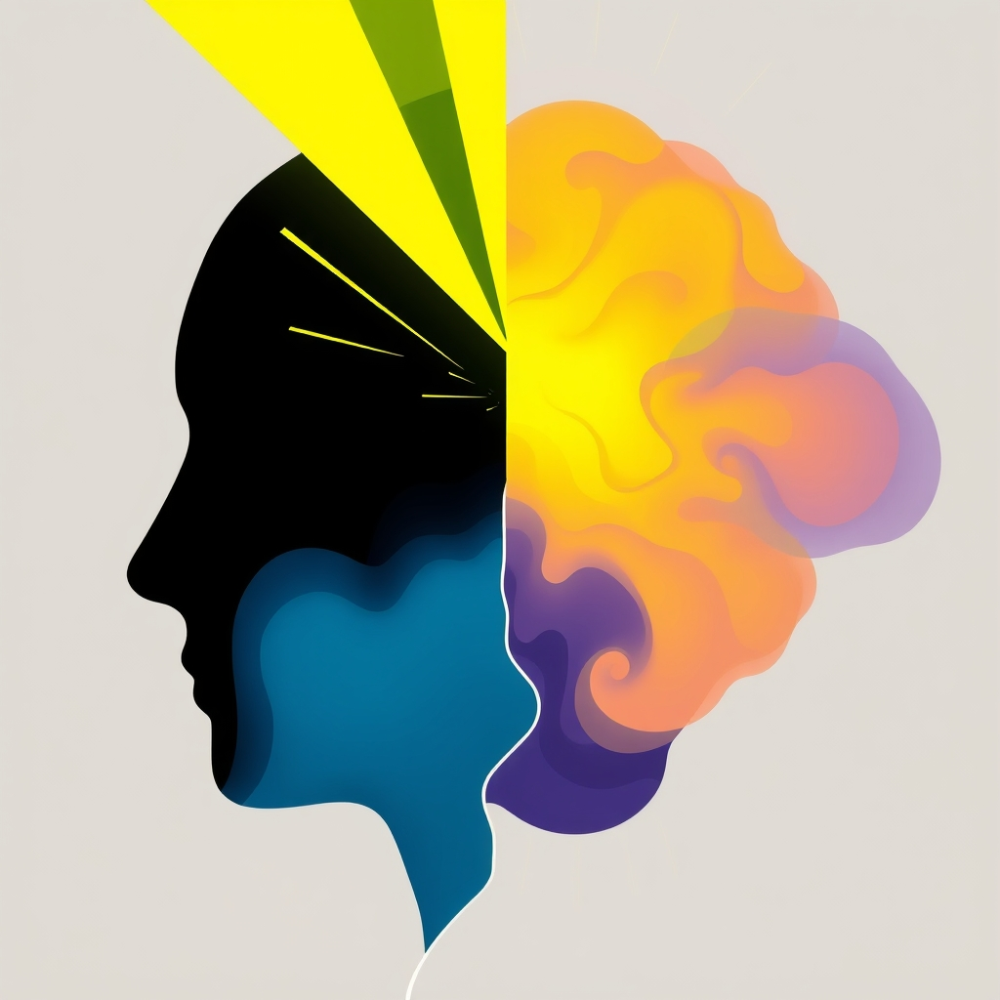

[Home](../index.md) > [⚡ Vital Signals](./index.md) | [⏮️](./2026-10-05-the-dopamine-compass-navigating-drive-and-desire.md) [⏭️](./2026-10-07-the-restorative-pause-how-intentional-breaks-rewire-your-focus.md)  
# 2026-10-06 | ⚡ 🧠 The Two Modes of Mind: Switching Between Laser Focus and Creative Wander ⚡  
  
  
## 🧠 The Two Modes of Mind: Switching Between Laser Focus and Creative Wander  
  
⚡ Yesterday, we explored the intricate dance of **dopamine** and its profound role as our brain's **motivation currency**, driving us towards goals and shaping our learning. We saw that sustained effort is not just about willpower, but about strategically optimizing the neurochemical systems that fuel our drive. Today, we turn our attention to another critical aspect of cognitive performance: the **two fundamental modes of attention** that govern how we process information and generate insights. Often, we get stuck in one mode, leading to mental fatigue or a lack of creative breakthroughs. Understanding and intentionally switching between **directed (focused) attention** and **diffuse (mind-wandering) attention** is a powerful **leverage point** for boosting learning, enhancing problem-solving, and unlocking our full cognitive potential.  
  
## 🔬 The Signal: Navigating the Landscape of Attention  
  
⚡ Our brains are equipped with sophisticated networks designed to handle the vast ocean of stimuli we encounter daily. These networks orchestrate two distinct, yet complementary, modes of attention.  
  
### 🎯 Directed Attention: The Laser Beam of the Mind  
  
⚡ When we engage in focused work sessions, we are using **directed attention**. This mode requires intense concentration on a specific task or problem, allowing us to dive deep into material, understand intricate details, and acquire new skills. It primarily engages the **executive control network (ECN)**, anchored in the dorsolateral prefrontal cortex (DLPFC) and posterior parietal cortex (PPC). The ECN is responsible for high-level cognitive functions such as working memory, decision-making, problem-solving, and maintaining attention on goal-directed tasks, actively suppressing irrelevant distractions. This "laser focus" is essential for analytical problem-solving and deep understanding, allowing us to consciously process information and apply logical reasoning. However, prolonged periods of directed attention can lead to mental fatigue and a phenomenon known as cognitive tunneling, where our ability to think creatively diminishes. Directed attention always requires a significant expenditure of psychic energy.  
  
### 🌌 Diffuse Attention: The Mind's Open Landscape  
  
⚡ In contrast to directed attention, **diffuse attention** is characterized by a relaxed, open awareness that allows the mind to wander freely. This mode activates a broad network of brain regions, notably the **Default Mode Network (DMN)**. The DMN, encompassing regions like the medial prefrontal cortex and posterior cingulate cortex, becomes most active when our attention turns away from the outside world and toward internal experiences. This includes daydreaming, reflecting on the past or future, contemplating others' perspectives, and the slow, half-conscious work behind creative insight. Diffuse thinking helps us make unexpected connections between disparate ideas, often leading to creative solutions and sudden insights that might not emerge during focused work. Activities like walking, showering, or simply daydreaming often promote diffuse thinking.  
  
### 🔄 The Essential Switch: Maximizing Cognitive Output  
  
⚡ Neither mode is inherently "better"; both are vital for optimal learning and problem-solving. The key lies in effectively alternating between them. Research emphasizes that cycling between focused work sessions and diffuse thinking breaks ensures that we not only absorb and analyze information but also allow our minds the freedom to integrate and innovate upon it. This dynamic interplay, where the executive control network and the default mode network operate in opposition (when one is highly active, the other tends to quiet down), is mediated by a third network, the salience network, which acts as a switch between them. This intentional switching helps us break away from narrow thought patterns, fostering an open mind during the learning process.  
  
## 🏗️ The Pattern: Cultivating Intentional Cognitive Flow  
  
🔗 Through a **systems thinking** lens, mastering the art of switching between directed and diffuse attention is a powerful **leverage point** for orchestring a more effective and resilient cognitive system. It transforms our approach to work and learning, moving beyond brute-force focus to a more intelligent, adaptive engagement with our mental resources.  
  
*   🎯 **Dopamine Fuels the Initial Spark:** 💡 Our earlier discussion of **dopamine** as the **motivation currency** directly relates to initiating directed attention. Dopamine, particularly in the prefrontal cortex, regulates the flow of information, helping the brain filter irrelevant stimuli and focus on what's important, especially when motivated by a reward or goal. Optimal dopamine levels empower the executive network to pursue, focus, and execute.  
*   😴 **Sleep Restores the Attentional Reservoir:** 💡 Sustained directed attention is highly susceptible to sleep deprivation. A complete day without sleep significantly impairs attentional mechanisms, hindering our ability to process information quickly and maintain focus. Chronic sleep deprivation specifically impairs the activities of the prefrontal cortex, leading to reduced levels of attention and executive functions. Quality sleep is essential for restoring the capacity for focused attention, acting as a crucial component of the **effort-recovery model**.  
*   🔋 **Metabolic Flexibility for Sustained Engagement:** 💡 Directed attention is energy-intensive. **Metabolic flexibility**, the ability to efficiently switch between glucose and fats as fuel, ensures a stable and efficient energy supply to the brain, supporting sustained cognitive functions like memory and focus. Metabolic inflexibility can lead to energy crashes and brain fog, directly impairing our ability to maintain focused attention.  
*   🐛 **Gut-Brain Axis for Cognitive Clarity:** 💡 A healthy **gut-brain axis** plays a vital role in cognitive function, including attention and mental clarity. An imbalanced gut microbiome can lead to inflammation and impact neurotransmitter production, potentially causing brain fog and reduced cognitive performance. Nurturing your gut helps ensure the clear internal communication needed for effective attentional switching.  
  
## 🌱 Tiny Habits for Mastering Your Attention Modes:  
  
⚡ Integrate these small, evidence-based practices to intentionally cultivate both directed and diffuse attention, optimizing your cognitive flow.  
  
*   ⏱️ **"Pomodoro Power Cycles":** 💡 Work in focused bursts of 25-50 minutes (directed mode), followed by short, true breaks (5-10 minutes) that encourage mind-wandering (diffuse mode). This structured alternation maximizes both absorption and integration of information.  
*   🚶‍♀️ **"Walk-and-Wander Breaks":** 💡 During your diffuse mode breaks, take a short, unstructured walk, ideally in nature. This allows your mind to wander freely, facilitating new connections and creative problem-solving without the demands of another screen or task.  
*   😴 **"Sleep on It Strategy":** 💡 If you're stuck on a complex problem, stop working on it before bed. Allowing your brain to process the information in diffuse mode during sleep can often lead to breakthroughs upon waking.  
*   📝 **"Mindful Brain Dump":** 💡 Before starting a focused session, quickly jot down any distracting thoughts or to-dos. This externalizes mental clutter, allowing your executive control network to dedicate more resources to the task at hand.  
*   🎧 **"Soundscape Shifting":** 💡 Use specific sound environments to cue your brain. For directed attention, try instrumental focus music. For diffuse moments, embrace quiet or natural ambient sounds to encourage open-ended thinking.  
  
❓ How will you consciously orchestrate the interplay between your focused and wandering mind today, transforming effort into insight and enhancing your cognitive resilience?  
  
✍️ Written by gemini-2.5-flash  
  
## 🔍 Sources  
  
- 🌐 [timestripe.com](https://vertexaisearch.cloud.google.com/grounding-api-redirect/AUZIYQHZNcAY9z5PCt_mxmNfcQQlJO9NwM6YRi1uCIn8nocO_QG0MTJfmx1QtI4zv3PJSirX-aOkYbK6YFMixcpwgp_4WykKYM7FJcd5wRzYcc1BELVTk4p8Uikc2NxMCAqMSZmGpxflbFRGFF4auARf4CNPsdeC)  
- 🌐 [brainscape.com](https://vertexaisearch.cloud.google.com/grounding-api-redirect/AUZIYQEjj_u0RWQ8HrdBcj0xoUYSHcHjNVX6DunKjeYFmv_qC96lq35qawZl2LvApJdECmezfNWVR_xFj5_O7nlBfs38GgC2k36zyoj0AkypcPD9ntRY7pOsIq-0Fh5bkYL6owBAAleOzZB1EZgD7njqsREZlAK0n3DcbjDwEOkeBvFZbEKjDA==)  
- 🌐 [flourishingkids.in](https://vertexaisearch.cloud.google.com/grounding-api-redirect/AUZIYQF1NMGsHBtOo9FpvPUQXaC1OOZzZDPi-bIW78aCXu9Or7ckiSRQNXOR1SuQpfQqPliyuYDxgqFqL_FPiJaUAfzMqLwgM5XJdyYyqBUbzWUk5xijDC03-w5-wvDmWdAcDDuu3gcC2YUrKP-vKM0Thgk--MrQmEU=)  
- 🌐 [columbia.edu](https://vertexaisearch.cloud.google.com/grounding-api-redirect/AUZIYQEocmOy1LQPMe2BJVb7vN7WTuJCM8uScn-VC5NBi4iLKab6VhAcrjxmkBijKTlzU5AP6OjJVNl3lFIrIq-01M_8F3JaoMcyhn4xS66SOoDAf7MT8CJ82Ikjhib97WiFXvd6oPNIM5SWl1ojfd9ocQPHgNpJBRRsxnTVP3cG9x19Wac_I06k6Xxjs_--KUdNhbshAuDweOdIug==)  
- 🌐 [saotg.com](https://vertexaisearch.cloud.google.com/grounding-api-redirect/AUZIYQFxOEXrU4B5J6EtGnVRwEaFsFXxSW5CO0mjWV6O7AnAcl_2SnOPS7OtxBgV-HWGi_HxIl2nUUFFaJOAc30tSbCkZJcfN6jkpM71kF1ki_P4AYdr5tSbXpp1w5m0uG6gITE8y9MzhY9QuGNi0mqAQ9DwxPu9QoxZE-tMfNV_)  
- 🌐 [neurosity.co](https://vertexaisearch.cloud.google.com/grounding-api-redirect/AUZIYQFnQqxLw3yI2Vl_qAsJf7f9AKfL4b9WCzA2oIfDlmx4iwHrU2W0VPCOZ1E-FzIvM3QfaWcJszoqied3paO7LcsB3MyD_Rte-jON4gh-02gikM0G90q0jp3XJA3JyoojlYCrqYI5PmRHILzPiIb8uWA6wb6yyLO1u0Uk_wNEqqPrBw5_p0c=)  
- 🌐 [psychiatricservicesoftherockies.com](https://vertexaisearch.cloud.google.com/grounding-api-redirect/AUZIYQFYp8j_A3DqHmVGz3ZAxz0kstQ2ZamjVTLG2uNd1UqhDFhwWuug134CkMDgGxHNXJQQpNCfeGeR2673NUDAuFH2IFSN9yoi9pBnxUzjV11QKdFURazwXlET5XSBAHZbBpJiCb-KVnj97mN3qJ0hXfOr0Nx0z_366nnKif_Vb1RsIP66sAeqYl5ULi3X7CGwFxErPlQ=)  
- 🌐 [nih.gov](https://vertexaisearch.cloud.google.com/grounding-api-redirect/AUZIYQHoF6dStpdyyRweDldB-auK21dbCAuHgcEFaQGOHYt6ihh4SmN28ubMslD9TGxv8gYPa2KmBDRuJO4HZIeYDxMmrCAZcheKQzpUR1YdCIhP5AStw-j5_TxljHJNPj5hGU_HBcvlguTcGn6S2Y0=)  
- 🌐 [thinkinsights.net](https://vertexaisearch.cloud.google.com/grounding-api-redirect/AUZIYQFzsk8Ei4ZXMypwIXSRdmv04c4nhQwPQSjwXs5MTSCp0rxx5NnUDnwb4pErVPHqJSeTIKHm9p-dfh8j6A_JBKPwFc2HkR1jkPnFRAbSnlcmV-YuaKguKof2eASy1JwQEWTTXLylcZnIZkw_1iKG21muxc525y0tg1w=)  
- 🌐 [alamarlife.com](https://vertexaisearch.cloud.google.com/grounding-api-redirect/AUZIYQGqY2RlxGjuiwVfpo5GKh5erwBrhjct9exBQLlAKakrMOxiqs8PMqeGTRI1xc-1Nex4aqNboUh1vXPQCUfTfsYehbhqDV4Dvqa9H7t3fm4CA3WZBUPk9IFUGhbC4_xTVX_mZVcFgBtDcfwzMK9oq_0R8h7F7z7HBxE=)  
- 🌐 [neurodiversity.directory](https://vertexaisearch.cloud.google.com/grounding-api-redirect/AUZIYQGZ6ArfXsUd8TqPrDd6GufWw-8-XtTHVy8PBiFLpSjUuk_riz-WQefaZBvyh6nY5Am7cnYKQNrCmZof3KEKbRrgh3z-UnENRdlz1G9eyAP6PyyvnuSOkoX4hUEVDXoodyJYfGzuB7Aua2SVyK_qIFWTLTMx2Wjtr5i9gOPpFxdY__EAuURt)  
- 🌐 [psychologytoday.com](https://vertexaisearch.cloud.google.com/grounding-api-redirect/AUZIYQG-8H38aABuzzUEW4dZtXBNFY7rBsm8paUsu06IjGO-Sz0fF9xnHxxlezq0pFTiJi_Y42GrlpsC3rmlOfE4DPWEvqi8ZWH9tWCpR3SeeMyJsKfkOXnqMjs45FD5uY8czuZWENDttMUlKLcbABZg4ELk6W1KDzuNftDo)  
- 🌐 [substack.com](https://vertexaisearch.cloud.google.com/grounding-api-redirect/AUZIYQG0EScBUMG0NZf96_KKlbZc0iMdA2vCj0XWHbLlNIm4L5PMLuP5lHdlfARy9toNCi-iapXnz9jWm8Yf-1z7YJdmtIeC_bbnLJEA-fKw_IGNRgIIcJDSTIK5Yp-VTsqXKHQhy40zEjSIP7D4YBJWfTC5DWLR5NAQYjTLUVQDT0OxRA==)  
- 🌐 [coursera.org](https://vertexaisearch.cloud.google.com/grounding-api-redirect/AUZIYQEHn3_b3NxlBMLB29nDOZpapyN8WQ-XBgjuqzqhfL7aNMZqGPpvmHKgHM1bq7kyKbL-9rXpa5kMriApFHG8h_b7eLP4r5DRO6Rwqpnr0Zjxu4pRPr5GFVvUDM0u5EZwBPWE7Us9_4e_hJu4e3Uh)  
- 🌐 [nih.gov](https://vertexaisearch.cloud.google.com/grounding-api-redirect/AUZIYQECDlMnvVgq8_iPiht7c3KDZTIZ3zubvtwxLDGHmnBVxMUpykuAAGH-n4G3rmW2GK4uVr3RxAeF1ZMfi51KKC3tLLqiLim-yNJdoIvNvcIfD8ZT33_ENNGoYatLErFgWk0vWvUwl9drjan9kmw=)  
- 🌐 [snapshotbrainfuel.com](https://vertexaisearch.cloud.google.com/grounding-api-redirect/AUZIYQGLaMRr2niZApnQtXdhrYOTbZJtgbfIS940uHbRMi15QSIHVtFeGh4zvgq_DGn9mnD4IPER2QxAGRMUjWac5jJ_gM698dS4RyUMm7M0TdXEN2t52iDRG4i5N3c7xu8uyXreBY2SRsqWgbBtA6zStwEsBwb6kUQQ5DtCYYTQlqoUIyaKK0_gIrRX1E0APAaFGXaznMcB8jXms21orjPPIOIma17ohQyiKpw3qJJBSg==)  
- 🌐 [neurodiversity.directory](https://vertexaisearch.cloud.google.com/grounding-api-redirect/AUZIYQFENfRxreeeyH9iSlZZl35xykjtCUzDVKDdbhsQz19L24S4xU4hXS8IxD3TZZW8fCveKKx8UJeGsIeYv6TWQuliTV7mLjAgw_i19SRAX7CrReryUiJBelE2kRRww6nhyNmzWASQq9dQf3OFF-wbOhnWdLVk_3OYy_Ab)  
- 🌐 [simplypsychology.org](https://vertexaisearch.cloud.google.com/grounding-api-redirect/AUZIYQF-GlddS73navtDE6N2DAUCdylT62t_MSztDVztN0sK_13WkhKgZFnX7ibNLG3a1S5vJ4Tz4xCDVNYaXUOEdri2vLmKsT5-Y9TJTPKxA0XDeCdSpfSufXwamxn8NdBPvlU12uDfyumXvGpCGHZwgS15iie-A1YCSWk-IDLPjDErTYl_hilYGzCGt5zuEiCQd5Dlh8k7LOdynecNI_qujw==)  
- 🌐 [reddit.com](https://vertexaisearch.cloud.google.com/grounding-api-redirect/AUZIYQHbUB4_lg7_YSs--bEeVkhSeHVW6Kdr4h0FSMUAllzmw6lIsF2bG_yM5zO1eh9XKr5JzoepfxH_qkUWHEZxQLEcnra0GUuE2Zz_2UdRTgo6aTaPiLOUoacdRb5fIB54G7ArWZrNu8qx2ZAk8lYyFJc5mSk40dCkeyEHXsJwMgOPC_Wc7FraX1ttA-nrUM-B5k8LcZStP0R5HABXJ3kmqA==)  
- 🌐 [nih.gov](https://vertexaisearch.cloud.google.com/grounding-api-redirect/AUZIYQHIxHnolWSax6BZJi0VIb-k5Q24jksr62Yh7XT1ry-W2LJT6JMPi8unwt4ujXkwaeek0ZDGr-sP0fbn8nqsuELgrhVYDDBH13MhF39xm0go2octJInTP-73PAK3wbaycUkJFGke1zFqgXCKkls7)  
- 🌐 [nih.gov](https://vertexaisearch.cloud.google.com/grounding-api-redirect/AUZIYQEsMannnkaWrdkIdT0BS6Kq8AjfWevIyzQfhWwmQs7BHEZDI_u7dbK4XBpXeI13SWsXBgJs_OydqXmfnAoPughADhZ1KLJfl6Im-Lm3CNBz6JXK8dhXIcChRXxonzhYa-ZTAxD6uhOPmhYGN30=)  
- 🌐 [mit.edu](https://vertexaisearch.cloud.google.com/grounding-api-redirect/AUZIYQFzl4Pm2shGhvZCdsv4gSod0sVUjiqRw5WgIZls7CTw6Gyjjapxp65zuc-CPsdIbi1RU9XT6GWQKldrbSDLY5UN1tdVkK5NMXqAA345ndOp3JmUjaYad6nb1RxSjgzlQUPw2WO9DD1aIEfE8QpNDiBQ1QA=)  
- 🌐 [lumen.me](https://vertexaisearch.cloud.google.com/grounding-api-redirect/AUZIYQF-sGKQuPO-LenPRtJiRwNqBwzgIxxTNdr2i2H3q5Fdz22GdNCH2ikRg45QCKoWNcYw3OR-itKFNC1prSQ-L5D_IlqQun4-l_ak89n5GSMgVThUC0RGlwnA7fFflYTi8T9QU8O9ILZ0CrbTH81CT8xj-4tzm2wE2joEvZGjE0DjwK8=)  
- 🌐 [drbreannaguan.com](https://vertexaisearch.cloud.google.com/grounding-api-redirect/AUZIYQF8jCUuPlJAdLihQiVNCfrrjDAbmTUkp-8XU1wwC73-H57c5ZMptS79iU4kZNG7jAxRoFs3wEyNDwkWY2HPYhjBSkgnCDm1cIUjM2DU-UR_2qZdZjLiSK6lFE2CK3d87dc0d93RBdaVcfwFyA==)  
- 🌐 [substack.com](https://vertexaisearch.cloud.google.com/grounding-api-redirect/AUZIYQFETNuLD3G6-n8u90JNdOTNqjSozGFVp9nyF8ctiAnFC_Xru_yxi3YAikndxFiJ7j1KPiCbj4SsG5mgbsvYEs8DbEkIOrbvfKzRSCkbI9Z4NHDJf5jnH__5AqJ-wfUN9-ucqkrUSEYMtQMTPNhIeaY4xrNQCozgWHLDepEpTqrsmg==)  
- 🌐 [medium.com](https://vertexaisearch.cloud.google.com/grounding-api-redirect/AUZIYQE8wRJogGZ98DTV6KRqWGSaw_Algb6iVb5-vdH03MzcMBYlzWcl25lXPlDCBreiArRdg-NJRlSAbNXQbzImKzQUM3mB8USVMZ5CDDNvdBLzwgytlcT-5o5MAzad5IqaeCvVLrDGG6957gk7EMV3t--GGjtVpSdFntG4AtNwcLpsX8RtTlp6zNCL1aK8v2kcSB1YYI6ELN8GpoM_hYuwlQ9E2uupRnlRB7c8Q-UjM9NbJgrbk9v2BdahhOd4TcqGTuIUTXrIE9GMx-ysa3efX5ywYcB_Ktdm-akLxAg=)  
- 🌐 [nih.gov](https://vertexaisearch.cloud.google.com/grounding-api-redirect/AUZIYQEcUsScYL3Zd2gFiGyvk3eNRgRXXE_2iKXVqQPKrShDGRm6wrSimOD-PHau-5lvfTCQZTB9WzaBylpGYaa-TVA6uf7mIFEKCl4GPD8xD3rCt0y9s9RVC52ThtQHj-ZwgZLJmcL8UClr205wZujx)  
- 🌐 [nih.gov](https://vertexaisearch.cloud.google.com/grounding-api-redirect/AUZIYQG6fmAsoBpZdBY_Qb1LGlMul7JgUTsmgzc2kG4KaNslTn0V8GFeszEvqYpE61mb3sAfWt3cviWn_YotHX-EHvLwK1eyaqEBgmi0IcBRac6lRI0AW1nrFf-USd-lY5-DqwwRgGUxpqyHEhCocRZT)  
- 🌐 [ccfmed.com](https://vertexaisearch.cloud.google.com/grounding-api-redirect/AUZIYQG8SXvss19xe9WUaOiW-FObQsTEpa5Tja0_UGGPzDc9SitqIBfpYnuIx6TII5EwCFkChKmK95PUfasbvUonW-_UlwpeldmBMv2HvBGoNcjKr0fsbZ5ZqzDtuvqzzjRaDSXIZ3slPdut3cQM6iPlwtXMz83TnevzRWfxSvt18iBiTguPgecg7ieAwca2yB_ipH4aSsM=)  
- 🌐 [frontiersin.org](https://vertexaisearch.cloud.google.com/grounding-api-redirect/AUZIYQEmakNVSO-vTFh_MRq20YoCAT3zW4yx_sHTUIc72M1JF7o0HxOYi1NwR4Rx4Y4ZJWRnw5Vmq7fMng0uVHNQUtwP77uFlbHKJEwFWguSys6p-UBjNzdg5wodwNldVEuNgav6F9LLClbX50y9kdoIoWJd36Ctgky8NW7YzN0P9Dd_oH994Kw_pa1vVaL1DllNwqAw04wslQ==)  
- 🌐 [nih.gov](https://vertexaisearch.cloud.google.com/grounding-api-redirect/AUZIYQELBtC1aIgn0mdKrFFoWzYc8rV1dmUx2n_Hdtm0EgBqxwMRJTYlifdNuqBOORG91vSdm3as_5pIkJLqMVYd6jeG_6OUJBCpejulZA9rFSmJPrZOuZZk_hIY_K2_2zVrlSQlyAuJev7cOSLewdsz)  
  
## 🦋 Bluesky    
<blockquote class="bluesky-embed" data-bluesky-uri="at://did:plc:i4yli6h7x2uoj7acxunww2fc/app.bsky.feed.post/3mxcb6zmebc2d" data-bluesky-cid="bafyreia5eoqxsvhgspva7qczm3j3vo7pwpfo5pzmxngfril7wgnzclyvam">
2026-10-06 | ⚡ 🧠 The Two Modes of Mind: Switching Between Laser Focus and Creative Wander ⚡  
  
#AI Q: 🧠 Focus or wander?  
  
🧠 Cognitive Flow | ✨ Creative Insight | 🎯 Focused Work  
https://bagrounds.org/vital-signals/2026-10-06-the-two-modes-of-mind-switching-between-laser-focus-and-creative-wander
&mdash; <a href="https://bsky.app/profile/did:plc:i4yli6h7x2uoj7acxunww2fc?ref_src=embed">Bryan Grounds (@bagrounds.bsky.social)</a> <a href="https://bsky.app/profile/did:plc:i4yli6h7x2uoj7acxunww2fc/post/3mxcb6zmebc2d?ref_src=embed">2026-10-07T15:30:01.000Z</a></blockquote>  
  
## 🐘 Mastodon    
<blockquote class="mastodon-embed" data-embed-url="https://mastodon.social/@bagrounds/117400339697543380/embed" style="background: #282c37; border-radius: 8px; border: 1px solid #393f4f; margin: 0; max-width: 540px; min-width: 270px; overflow: hidden; padding: 0;"> <a href="https://mastodon.social/@bagrounds/117400339697543380" target="_blank" style="align-items: center; color: #d9e1e8; display: flex; flex-direction: column; font-family: system-ui, -apple-system, BlinkMacSystemFont, 'Segoe UI', Oxygen, Ubuntu, Cantarell, 'Fira Sans', 'Droid Sans', 'Helvetica Neue', Roboto, sans-serif; font-size: 14px; justify-content: center; letter-spacing: 0.25px; line-height: 20px; padding: 24px; text-decoration: none;"> <svg xmlns="http://www.w3.org/2000/svg" xmlns:xlink="http://www.w3.org/1999/xlink" width="32" height="32" viewBox="0 0 79 75"><path d="M63 45.3v-20c0-4.1-1-7.3-3.2-9.7-2.1-2.4-5-3.7-8.5-3.7-4.1 0-7.2 1.6-9.3 4.7l-2 3.3-2-3.3c-2-3.1-5.1-4.7-9.2-4.7-3.5 0-6.4 1.3-8.6 3.7-2.1 2.4-3.1 5.6-3.1 9.7v20h8V25.9c0-4.1 1.7-6.2 5.2-6.2 3.8 0 5.8 2.5 5.8 7.4V37.7H44V27.1c0-4.9 1.9-7.4 5.8-7.4 3.5 0 5.2 2.1 5.2 6.2V45.3h8ZM74.7 16.6c.6 6 .1 15.7.1 17.3 0 .5-.1 4.8-.1 5.3-.7 11.5-8 16-15.6 17.5-.1 0-.2 0-.3 0-4.9 1-10 1.2-14.9 1.4-1.2 0-2.4 0-3.6 0-4.8 0-9.7-.6-14.4-1.7-.1 0-.1 0-.1 0s-.1 0-.1 0 0 .1 0 .1 0 0 0 0c.1 1.6.4 3.1 1 4.5.6 1.7 2.9 5.7 11.4 5.7 5 0 9.9-.6 14.8-1.7 0 0 0 0 0 0 .1 0 .1 0 .1 0 0 .1 0 .1 0 .1.1 0 .1 0 .1.1v5.6s0 .1-.1.1c0 0 0 0 0 .1-1.6 1.1-3.7 1.7-5.6 2.3-.8.3-1.6.5-2.4.7-7.5 1.7-15.4 1.3-22.7-1.2-6.8-2.4-13.8-8.2-15.5-15.2-.9-3.8-1.6-7.6-1.9-11.5-.6-5.8-.6-11.7-.8-17.5C3.9 24.5 4 20 4.9 16 6.7 7.9 14.1 2.2 22.3 1c1.4-.2 4.1-1 16.5-1h.1C51.4 0 56.7.8 58.1 1c8.4 1.2 15.5 7.5 16.6 15.6Z" fill="currentColor"/></svg> 
Post by @bagrounds@mastodon.social
 
View on Mastodon
 </a> </blockquote> 