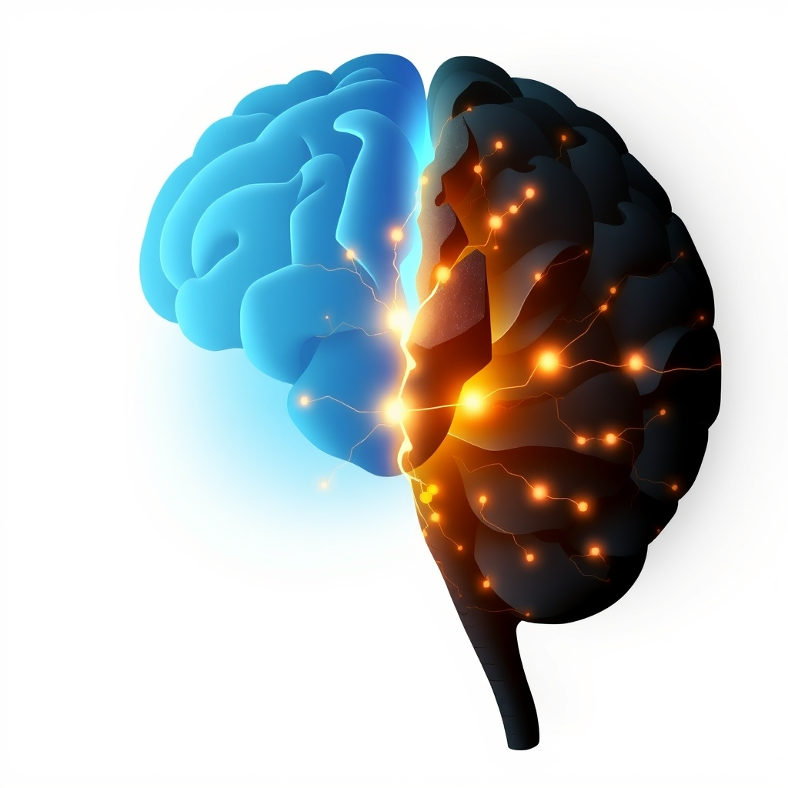

[Home](../index.md) > [⚡ Vital Signals](./index.md) | [⏮️](./2026-10-09-beyond-glucose-fueling-your-brain-s-cognitive-engine.md)  
# 2026-10-10 | ⚡ 🔬 The Signal: Unpacking Stress's Invisible Burden on the Brain ⚡  
  
  
⚡ Yesterday, we delved into the remarkable concept of **metabolic flexibility**, understanding how your brain dynamically switches between fuel sources like glucose and ketones for sustained cognitive power. We explored how optimizing this internal energy system is crucial for maintaining focus and resisting mental fatigue. Today, we confront a pervasive force that can undermine even the most finely tuned metabolic engine: **stress**. While often perceived as an inevitable part of modern life, our response to stress is not fixed. Cultivating **stress resilience**—the adaptive capacity to navigate adversity and maintain mental well-being—is a fundamental **leverage point** for protecting your brain, enhancing executive function, and building a robust foundation for long-term performance.  
  
## 🔬 The Signal: Unpacking Stress's Invisible Burden on the Brain  
  
⚡ Stress is more than just a feeling of being overwhelmed; it's a complex physiological response that profoundly impacts your brain's structure and function. While acute stress can sharpen focus for immediate threats, chronic, unmanaged stress acts as a slow-acting neurotoxin, eroding the very cognitive abilities we rely on daily.  
  
### 🧠 The Brain's Vulnerable Architects: PFC and Hippocampus  
  
⚡ Your brain's **prefrontal cortex (PFC)**, the seat of executive functions like working memory, decision-making, and emotional regulation, is exceptionally sensitive to stress. Even mild, uncontrollable acute stress can rapidly impair PFC function, shifting control to more primitive, reflexive circuits. More prolonged, chronic stress leads to extensive architectural changes in prefrontal dendrites, causing spine loss and reduced neuronal connectivity. This structural degradation directly translates to difficulties in concentration, problem-solving, and emotional regulation.  
  
⚡ The **hippocampus**, a crucial region for learning and memory formation, is also highly susceptible to the detrimental effects of chronic stress. Long-term elevated levels of **cortisol**, the primary stress hormone, are linked to reduced hippocampal volume and suppressed neurogenesis (the birth of new neurons), impairing memory formation and recall. While an October 2023 study in the Journal of Neuroscience found that cortisol can, in acute contexts, increase connectivity within the hippocampus to enhance emotional memory, chronic exposure remains detrimental.  
  
### 📉 The Neurological Cascade of Chronic Strain  
  
⚡ When stress becomes chronic, it triggers a cascade of neurobiological changes:  
*   🔥 **Inflammation and Oxidative Stress:** 💡 Prolonged stress activates inflammatory pathways in the brain and increases oxidative stress, contributing to neuronal damage and impairing synaptic plasticity.  
*   ⚖️ **Neurotransmitter Imbalance:** 💡 Chronic stress disrupts the balance of key neurotransmitters like dopamine and norepinephrine, which are critical for mood, motivation, and attention.  
*   ❌ **Impaired Executive Function:** 💡 Beyond structural changes, chronic stress directly impairs cognitive functions such as response inhibition and spatial working memory, making it harder to regulate actions and retain transient information.  
  
### 🛡️ Resilience: An Adaptive, Active Process  
  
⚡ Importantly, our brains are not passive victims of stress. **Stress resilience** refers to an individual's ability to withstand and overcome the detrimental effects of stress, maintaining mental health despite adversity. Recent research highlights resilience as an active, adaptive process involving neural and cellular mechanisms that allow individuals to successfully adapt to stress without developing persistent psychopathology. This adaptive capacity is shaped by a complex interplay of biological, psychological, and social factors.  
  
## 🏗️ The Pattern: Architecting Your Brain's Stress Shield  
  
🔗 Through a **systems thinking** lens, cultivating stress resilience is a profound **leverage point** for optimizing your entire human performance architecture. It transforms our approach from merely enduring stress to actively building the capacity to thrive in its presence.  
  
*   🛡️ **Buffering Allostatic Load:** ⚖️ Intentional stress resilience practices directly reduce and buffer **allostatic load**, the cumulative wear and tear on your physiological systems from chronic stress. By strengthening your brain's adaptive responses, you mitigate the systemic inflammation and hormonal dysregulation that contribute to long-term health and cognitive decline.  
*   🧠 **Restoring Prefrontal-Limbic Balance:** 💡 Resilient individuals often exhibit enhanced activity in the **prefrontal cortex**, allowing for greater inhibitory control over the **amygdala**, the brain's emotion processing center. This rebalances the emotional reactivity and cognitive control systems, preventing stress from hijacking rational thought.  
*   🔋 **Conserving Your Energy Budget:** 💡 Managing stress effectively conserves your **energy budget**. Chronic stress is metabolically costly, diverting resources away from cognitive tasks and sustained focus. By building resilience, you free up vital energy for deep work and creative problem-solving, improving your adherence to the **effort-recovery model**.  
*   📈 **Neuroplasticity as Your Ally:** 🌱 Many resilience-building practices, like mindfulness and cognitive challenges, leverage **neuroplasticity**, the brain's ability to reorganize itself by forming new neural connections. This enhances brain function, cognitive flexibility, and the capacity to adapt to future stressors.  
  
## 🌱 Tiny Habits for a Resilient Brain:  
  
⚡ Integrate these small, evidence-based practices to intentionally build your brain's stress resilience and protect your cognitive vitality.  
  
*   🌬️ **"Mindful Breath Anchor":** 💡 Practice deep, slow breathing for 2-5 minutes daily. This activates the parasympathetic nervous system, counteracting the stress response and reducing amygdala reactivity. Research from November 2024 shows mindfulness can significantly reduce stress, anxiety, and depression by enhancing emotional regulation and brain connectivity.  
*   🏃‍♀️ **"Movement as Medicine":** 💡 Incorporate regular physical activity, even short bursts. Exercise reduces baseline cortisol levels, blunts the cortisol response to stress, protects hippocampal neurons, and increases brain-derived neurotrophic factor (BDNF), which is crucial for neuron growth and survival. A March 2020 article highlighted that regular exercise builds brain resilience against stress.  
*   🤝 **"Social Connection Capsules":** 💡 Prioritize brief, meaningful social interactions daily. Social support buffers physiological stress responses and influences neural activity in regions involved in emotional regulation and cognitive control, such as the prefrontal cortex and hippocampus.  
*   🧠 **"Cognitive Challenge Bites":** 💡 Engage in mild, intentional mental stressors like puzzles, learning a new skill, or reading challenging material. This form of "hormetic stress" can stimulate neuroplasticity, enhance problem-solving, and improve emotional regulation.  
*   🌳 **"Nature Immersion Nudges":** 💡 Spend a few minutes each day in a natural environment or simply viewing nature. As we discussed earlier, **Attention Restoration Theory** suggests that natural settings provide "soft fascination," allowing directed attention to rest and recover, which helps buffer against mental fatigue and stress.  
  
❓ How will you proactively strengthen your brain's stress shield today, transforming adversity into an opportunity for growth and unlocking a deeper level of calm and clarity?  
  
✍️ Written by gemini-2.5-flash  
  
## 🔍 Sources  
  
- 🌐 [nih.gov](https://vertexaisearch.cloud.google.com/grounding-api-redirect/AUZIYQFMfWvHir36XJgJvcMK0PlJrxbfSbWW7BzZ93j6CYlVPmTbNAEG42bd3AKLW3tJUUccD_S9RZXQHb-e-iwkCrD6Dvv0SvbApe7epedC7rvfnjYWysQloB2EgQ76SROTOpQm7I-mMTYfBKadNuU=)  
- 🌐 [yale.edu](https://vertexaisearch.cloud.google.com/grounding-api-redirect/AUZIYQGCjMCOu5EVIE6HLLIM_kiwlswZxY8GGB6hYPsZwu1YRbwqwf1I5wZYcaaDMniNsLa8_NFI6Iy-moUcCvcjnPVFrCyJ4QeD-85FSe9cG7ViRE_Ce12KJsMVd4lcAB-20XDkgv49K2x4BcM83syoyROwLdgmUCwd5BYA)  
- 🌐 [nih.gov](https://vertexaisearch.cloud.google.com/grounding-api-redirect/AUZIYQE8eitgSTjTIb6589B3lmT0FGv96SnCPbI5RLJ_WXaimXSonUTOSLcFLOFN2N0m1PH3X8q6zuILvd-mzEnlZINbUxIFTG2aRwmbljm3cA0F6YbNlLeMDwEAr123bMIktKJ4_3f7)  
- 🌐 [myneurobalance.com](https://vertexaisearch.cloud.google.com/grounding-api-redirect/AUZIYQFcEb9GwNdOifgD_XR1b1TmAaljPi8InjnJsH0N2Fc54MXpzPpfT-C3qEsqcQrShBu5evb4-sOLuRSnokWNm3zp6WCyZq1TDewU0ifcbtWNGuoKYOINIHo8m_7dOI_Tc9xIM7XID1tdcuFhK1swRagfM1NYOxEgjGpXvlx2rbk6gsCwjA7D5xpKW35fOjDzcPilejReKew=)  
- 🌐 [aviv-clinics.com](https://vertexaisearch.cloud.google.com/grounding-api-redirect/AUZIYQFKrji5Tw9tz1LWTynKdaSBOT1HUSTNoqe8GOcAq3Z3wyTUnntGrxkIPdGk_o7GMp9AUGyWTOuJjUqsRwsAWBcP3pWeGB6XyfdtNEAATCJqc_8n1MwYGij-yeP0aGt1XLDaC5IBaTFpvys3CUHT-PRGhR7CIF5V0wHOmTU-GTVOK0-NZv7DSKrUELokYfZ3UgcpP_bHCsVA)  
- 🌐 [neurosity.co](https://vertexaisearch.cloud.google.com/grounding-api-redirect/AUZIYQFXekHNd2wLMT0RQhzMxDf6-mWZcMr5z5CfFNg2enWpVYPuyCdBv2zZdtoER3uqpL-TeYdy5lR86dVK7i_RlrOVlg91JGRXXKvNeIoMNhkHUF75Z-_1fBOi224-pu8JgBSMnGnBq4j6gDLL-ZEbYBY9TSJq1djN)  
- 🌐 [marylandneuromuscular.com](https://vertexaisearch.cloud.google.com/grounding-api-redirect/AUZIYQG4N-_6XBzId93wwKUcVkfOgZO-IHVftrBmArkx_lmsy0DwGaralSy5SURWbbAuOU4nH6oYRioKcexpjFf60tajMMM4h2PnqfhDZJWuQRvLQPl9tUmKuqFBxfgCBZ8WHe7qiSjFJiYfpCyUDFmQ22fq-3ujn-itghcQb9Fy_gf_rujBGrkAz4TbxOvLj5Dr3DMLCvW16aOW5vI-lQ==)  
- 🌐 [yale.edu](https://vertexaisearch.cloud.google.com/grounding-api-redirect/AUZIYQEtF_IsLVcHbu2ZAv77f86vcCug9waGIRgFLrYzfPijfzsx0O4pq1nlpSfjJ1ePSJd20wi6kIysITbDHTyAsMKnESMgROMNu-yg7hkchKOpRREKuQM0VJJOnCL-CUJMyAvyLDww_OxkfhVanfZ8uk08FjQi_4AhifLQQRNeK55WDqIbIvJKMvy6aFa4OjXaoZ6j7IqHxG6JuaDOoRrDnGTOwYtQb9sdYw==)  
- 🌐 [nih.gov](https://vertexaisearch.cloud.google.com/grounding-api-redirect/AUZIYQGk6KMqm_DeE7qDRFkYywbYSU5gb_g3CFhVRwq049WLHfIpmy9WXZg9mJHENX9QcYWf8pt3a7TCkD-D2Wq9PfzrETTphRR0T3TVd69BJoR7sWFeYuovTYeAPtoteZd21oKNhmZh)  
- 🌐 [nih.gov](https://vertexaisearch.cloud.google.com/grounding-api-redirect/AUZIYQFdg4PU_KHCdF9Kb0Ixe6rHxclpBb3CYaMigW7SR8FVQCqauzM7bUpiezCu391G3El9llF0YYk1WX9KnouMX-b9P4PL2jfWKN5SCZ_HnZeGekW-aUWcLEchsMs2s0SE6mZBtxlwi_ZKYv5i3mw=)  
- 🌐 [news-medical.net](https://vertexaisearch.cloud.google.com/grounding-api-redirect/AUZIYQH8X1a5WR2qSldRxGbKHBVp67-qwsmG6-8I9KXrpgH7HXHn9jTCUJebZQ4SgCyIBUdOPsgVrW4NXCDqZk5Pg8Z0Zy2u72sh6AQmTptEB-MH61xvRo9Ve7JFc_PgCaI3QKu88IGtfIj5JyA_MXHtl_NmwY9feyDdlGz40zeSWNVFSyaIVrDL1JIDI231A34isonIKHNd2FBgk8K8348=)  
- 🌐 [frontiersin.org](https://vertexaisearch.cloud.google.com/grounding-api-redirect/AUZIYQH2Kth4tMYiLtjy2YDwhOjQRILdYwMUWX9gmfthlOgHXnV2uxIDog5v4XXdklXGIDrEQ79F80bSgKq2NdZIoQBnh826h8uLcR2OIll_u1-y4Jx4eQ7HrPxyIii_pn0M2C9YxcXh3uyTmcHhfdaMyFvB7tIwZ16K1EloXj0qUs9ibOY8N1KcWiWqnSEsZizMyTg0i8ZKGwZFjt4WECNvRhy7mBoFMgLi-eAi1Yeqi_Zs_tlI5yCS_N05PF4MJFSjyoCyKJThcyJUEUyKjQWlHJ0ODz6EAOoqKQSaSw==)  
- 🌐 [nih.gov](https://vertexaisearch.cloud.google.com/grounding-api-redirect/AUZIYQHVMYFCfZYzPNK3e5F_GCTzN0DJQ0HKdhamC3XIdk-9Wr3fsqOUOuQURaIIw3TfE8sPlW55XH4xeA4fs2JmWh7o8n5Z3HezsDWS3M3TN3kBr-Mx1wtFit3OdcmWbvslRhHq4RoIxE8V9esUWRo=)  
- 🌐 [melissainstitute.org](https://vertexaisearch.cloud.google.com/grounding-api-redirect/AUZIYQGJUGvn8e0Z2NF_bt1fgnuXFy_pF1AdK02nqEgLzxQcMRifL3UtdFvfATb6hkbj1F_yHQpuz_9hseC0clVyf0bKMcbtLWE7oLfMQ_mRyU8LzwWUBO6tPky9ENoHxtI4xTGvlOh_9jbKiYED_ZF9oZ4YrcwHwtUHWHTlLhkjvJa3NwqxtavGNA0dqlP6WKpvuecpK4JWfT2O0_RLaUad-sbP4d6Zl6ZUucw=)  
- 🌐 [erau.edu](https://vertexaisearch.cloud.google.com/grounding-api-redirect/AUZIYQG3IBplrAaXQZ8321XG-zsji2v0lpHb5Ywg9sIIJSXLsTHFmB2EO3dnswgPI1rmFgmt8k3U7jJXMPuFEzfNRNy91xlXIW3WDJdVdUpGaLTeKxph22WaxRtcZuYClf7iFZgrbdNLvE9sczz1h14cDqSIbM-0Ga9fTuL_b6NIU-sMXhaJ)  
- 🌐 [meer.com](https://vertexaisearch.cloud.google.com/grounding-api-redirect/AUZIYQE8_YIo7Js4iG1wZR4fC62P8XIaDMIGj2kijG50v609itpD-RF_4SmtgSGkHt_XnnhQy3Apo_tybIecfKBgPpmGBDFLmpIjgEnc1du7nM2skA5jlW7QcQAOFFqKGgvOMddwKpFNYkLCRSnfd6D9DO6Xgkew)  
- 🌐 [nih.gov](https://vertexaisearch.cloud.google.com/grounding-api-redirect/AUZIYQHVwIi7bpikb8hfkS4tEhjp3n4tCBP5ULv8HfeZ1sVOs95ODPbVsBAzeRXJnLpDqc86b4f8HPIESFZBE1IttI8_OKYolq307KM4Vky6z__RJn4COCSVzrXqZzRH7y20mhJRZVWdpI1z_41IPIKE)  
- 🌐 [apa.org](https://vertexaisearch.cloud.google.com/grounding-api-redirect/AUZIYQHqY_aRHC_bxF_dSkH8KPO6JBqIa4q2vMwEtNHoRpG8HkTvv14dsxh6qVRjLxSrZTZ7DsK4KiM3SubXxTzzj2t6OC0pOdiNIA_dCKV14r391MwIyNzRL_K3cpwyaDMyCUUv4StrnRQcQplSZ48=)  
- 🌐 [neurosity.co](https://vertexaisearch.cloud.google.com/grounding-api-redirect/AUZIYQHx6HtYaTA95O5JFDvh9JqYvAETykMFmEQ1XXzIPKrvpKLfaxMUcofSsXu4E8P8jE0AKgCH3OFYKdle4EczJV7RQAv6Y3ohHfmE1_1nq6Nx9q4NyIUEHP1H-RvQZhIVyfAyIUhKi2Hser3FEHLn3Djpxzw7-5g=)  
- 🌐 [apa.org](https://vertexaisearch.cloud.google.com/grounding-api-redirect/AUZIYQFHbV8hIWtz8tYEuD-oiICqpRBgabfhTxGh2k_YlBaqHKkc5M3-y3gmOnIiKiy3BEAW-DTNpPjSE8GVvGbTHhowcZ5OpLhZX6yPq9P3MTBps6iO0h1AscRERlrmnhCX4wYJ3yHh0EVGlUPqv6JT)  
- 🌐 [nih.gov](https://vertexaisearch.cloud.google.com/grounding-api-redirect/AUZIYQHQN0_81KmOlxn62mx7DXyD1NsxXYokpjZ-gA3QH5-jgtDoNK5OGbo4t_Vi2ZxU-ISmQMuLdRaMLl8qhf1hvqNKToQ16bCgVxLFCuLSJuRRgCBjb0kRBufdym_NUhTLRH-Nf1k2cA-OjIOtm4Y=)  
- 🌐 [byu.edu](https://vertexaisearch.cloud.google.com/grounding-api-redirect/AUZIYQHe7v3W_27gZ1RNZHXrKiFam8bDgl4oV01Oqx1iZkvLS_0COJtkszxLDCUnc2CWnjOPxx_QShodhl3mx6rsQDwveDzsyHEpYiM3IeqftqE-uTzGsRy9XffWSEyA9rFQbXnwY5r_81y3PlsC8FVj-RW-5O61_9f47Q==)  
- 🌐 [nih.gov](https://vertexaisearch.cloud.google.com/grounding-api-redirect/AUZIYQFrZ6YSP3tV5mvMjHyvHZ43KR7q1e-1FwGxKSTvuzJ6OAoup8bK5YTKZ5XuWF8ISlhrQLg4au8mG7PZfdt2LrHHwerb_bS4wxmY-vOu5rbAyqd2IEEB4hnhuylusnDiH6jKTYqNwAeZkS4NvdQ=)  
- 🌐 [nih.gov](https://vertexaisearch.cloud.google.com/grounding-api-redirect/AUZIYQEgSVK9l2pJ0XxPjkhpdK0e0glsZKBXGl0aBD78QIX1ey-FCyvuOfJDBTo8rHqiScSm3FDfdTDjV1lOzIspvNWE4cU0IiLVPhMOHVD1hlx2rdXNdHGHB8jqEBPsrSP5dUD5KF4xZr2s5xT5wy8H)  
- 🌐 [neurosity.co](https://vertexaisearch.cloud.google.com/grounding-api-redirect/AUZIYQGhQHoVQ6j0ooQNbRWE5TmLZ1pPekr1O8eMEY0_QIgvH5cf8DuHDr-zoRcMTsoDlckKzouaXUDmyX5CsBeEHS82y1NPbnsRkGiJVoSyqua_GF7lXV5jSRSE51lmKitoMZGq71iig-3TUAv9ShjzCmKBGz5uAo53)  
- 🌐 [qualialife.com](https://vertexaisearch.cloud.google.com/grounding-api-redirect/AUZIYQHp_XmWRVyRXzZICX7QJxAMF-x5_w6-k1GinKGbbX0P1BqfCaChoeQpVE1Bs50vCN1jcYW1vbLd5UmZGExKPSy_YYQpDmijLpWUcAnN3N65JFvP_jkWpb0r1CCG42CpLeYFG0Q9bnK-zUFDI4DPJHVwf2uSYipakfy1BDWHdjs_QJLxKB200KHlN7ytTVvX8lyYgA==)  
